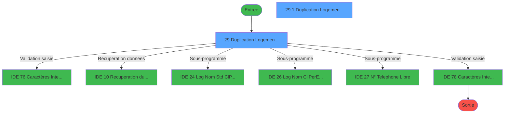
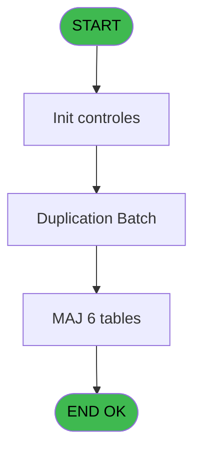
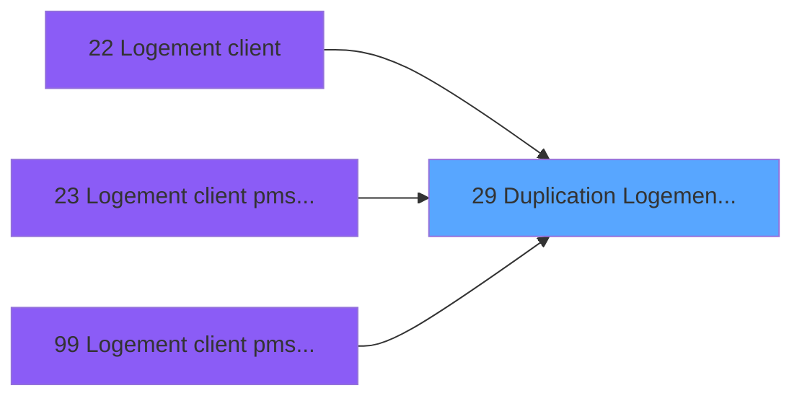
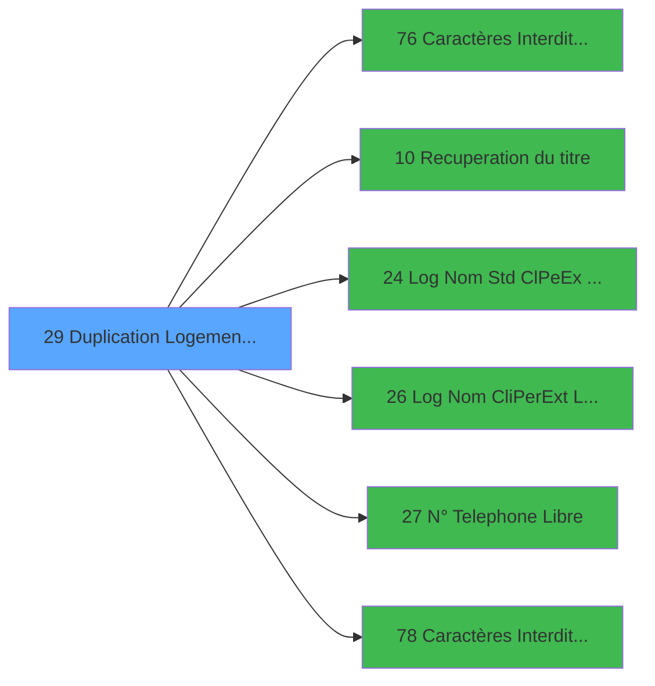

# PBS IDE 29 - Duplication Logement Client

> **Analyse**: Phases 1-4 2026-02-03 17:09 -> 17:10 (14s) | Assemblage 17:10
> **Pipeline**: V7.2 Enrichi
> **Structure**: 4 onglets (Resume | Ecrans | Donnees | Connexions)

<!-- TAB:Resume -->

## 1. FICHE D'IDENTITE

| Attribut | Valeur |
|----------|--------|
| Projet | PBS |
| IDE Position | 29 |
| Nom Programme | Duplication Logement Client |
| Fichier source | `Prg_29.xml` |
| Dossier IDE | Logement |
| Taches | 10 (2 ecrans visibles) |
| Tables modifiees | 6 |
| Programmes appeles | 6 |

## 2. DESCRIPTION FONCTIONNELLE

**Duplication Logement Client** assure la gestion complete de ce processus, accessible depuis [Logement client (IDE 22)](PBS-IDE-22.md), [Logement client pms-626 evo (IDE 23)](PBS-IDE-23.md), [Logement client pms-626 (IDE 99)](PBS-IDE-99.md).

Le flux de traitement s'organise en **2 blocs fonctionnels** :

- **Traitement** (6 taches) : traitements metier divers
- **Creation** (4 taches) : insertion d'enregistrements en base (mouvements, prestations)

**Donnees modifiees** : 6 tables en ecriture (logement_client__loc, fichier_menage, logement_zone_menage, tables_village, nb_code__poste, Table_1030).

Detail : phases du traitement

#### Phase 1 : Traitement (6 taches)

- **29** - Duplication Logement Client **[[ECRAN]](#ecran-t1)**
- **29.1** - Duplication Logement Client **[[ECRAN]](#ecran-t2)**
- **29.1.1.1** - Incrementations Tables
- **29.1.2.1** - Incrementations Tables
- **29.1.4** - Lecture Equipement
- **29.1.4.1.1** - (sans nom)

Delegue a : [Caractères Interdits (A6) (IDE 76)](PBS-IDE-76.md), [Recuperation du titre (IDE 10)](PBS-IDE-10.md), [ Log Nom Std (Cl/Pe/Ex) Libre? (IDE 24)](PBS-IDE-24.md), [ Log Nom (Cli/Per/Ext) Libre ? (IDE 26)](PBS-IDE-26.md), [ N° Telephone Libre ? (IDE 27)](PBS-IDE-27.md), [Caractères Interdits (TEL) (IDE 78)](PBS-IDE-78.md)

#### Phase 2 : Creation (4 taches)

- **29.1.1** - Creation Nouveau Logement **[[ECRAN]](#ecran-t3)**
- **29.1.2** - Creation Menage
- **29.1.3** - Creation Telephone
- **29.1.4.1** - Creation Logement Equipement

#### Tables impactees

| Table | Operations | Role metier |
|-------|-----------|-------------|
| logement_client__loc | **W** (2 usages) |  |
| Table_1030 | **W** (2 usages) |  |
| fichier_menage | **W**/L (2 usages) |  |
| logement_zone_menage | **W** (1 usages) |  |
| tables_village | **W** (1 usages) |  |
| nb_code__poste | **W** (1 usages) |  |

## 3. BLOCS FONCTIONNELS

### 3.1 Traitement (6 taches)

Traitements internes.

---

#### 29 - Duplication Logement Client [[ECRAN]](#ecran-t1)

**Role** : Tache d'orchestration : point d'entree du programme (6 sous-taches). Coordonne l'enchainement des traitements.
**Ecran** : 506 x 121 DLU (MDI) | [Voir mockup](#ecran-t1)

5 sous-taches directes

| Tache | Nom | Bloc |
|-------|-----|------|
| [29.1](#t2) | Duplication Logement Client **[[ECRAN]](#ecran-t2)** | Traitement |
| [29.1.1.1](#t4) | Incrementations Tables | Traitement |
| [29.1.2.1](#t6) | Incrementations Tables | Traitement |
| [29.1.4](#t8) | Lecture Equipement | Traitement |
| [29.1.4.1.1](#t10) | (sans nom) | Traitement |

**Delegue a** : [Caractères Interdits (A6) (IDE 76)](PBS-IDE-76.md), [Recuperation du titre (IDE 10)](PBS-IDE-10.md), [ Log Nom Std (Cl/Pe/Ex) Libre? (IDE 24)](PBS-IDE-24.md)

---

#### 29.1 - Duplication Logement Client [[ECRAN]](#ecran-t2)

**Role** : Traitement : Duplication Logement Client.
**Ecran** : 424 x 56 DLU (MDI) | [Voir mockup](#ecran-t2)
**Delegue a** : [Caractères Interdits (A6) (IDE 76)](PBS-IDE-76.md), [Recuperation du titre (IDE 10)](PBS-IDE-10.md), [ Log Nom Std (Cl/Pe/Ex) Libre? (IDE 24)](PBS-IDE-24.md)

---

#### 29.1.1.1 - Incrementations Tables

**Role** : Traitement : Incrementations Tables.
**Delegue a** : [Caractères Interdits (A6) (IDE 76)](PBS-IDE-76.md), [Recuperation du titre (IDE 10)](PBS-IDE-10.md), [ Log Nom Std (Cl/Pe/Ex) Libre? (IDE 24)](PBS-IDE-24.md)

---

#### 29.1.2.1 - Incrementations Tables

**Role** : Traitement : Incrementations Tables.
**Delegue a** : [Caractères Interdits (A6) (IDE 76)](PBS-IDE-76.md), [Recuperation du titre (IDE 10)](PBS-IDE-10.md), [ Log Nom Std (Cl/Pe/Ex) Libre? (IDE 24)](PBS-IDE-24.md)

---

#### 29.1.4 - Lecture Equipement

**Role** : Traitement : Lecture Equipement.
**Delegue a** : [Caractères Interdits (A6) (IDE 76)](PBS-IDE-76.md), [Recuperation du titre (IDE 10)](PBS-IDE-10.md), [ Log Nom Std (Cl/Pe/Ex) Libre? (IDE 24)](PBS-IDE-24.md)

---

#### 29.1.4.1.1 - (sans nom)

**Role** : Traitement interne.
**Delegue a** : [Caractères Interdits (A6) (IDE 76)](PBS-IDE-76.md), [Recuperation du titre (IDE 10)](PBS-IDE-10.md), [ Log Nom Std (Cl/Pe/Ex) Libre? (IDE 24)](PBS-IDE-24.md)

### 3.2 Creation (4 taches)

Insertion de nouveaux enregistrements en base.

---

#### 29.1.1 - Creation Nouveau Logement [[ECRAN]](#ecran-t3)

**Role** : Creation d'enregistrement : Creation Nouveau Logement.
**Ecran** : 821 x 181 DLU (MDI) | [Voir mockup](#ecran-t3)

---

#### 29.1.2 - Creation Menage

**Role** : Creation d'enregistrement : Creation Menage.

---

#### 29.1.3 - Creation Telephone

**Role** : Creation d'enregistrement : Creation Telephone.

---

#### 29.1.4.1 - Creation Logement Equipement

**Role** : Creation d'enregistrement : Creation Logement Equipement.

## 5. REGLES METIER

*(Aucune regle metier identifiee)*

## 6. CONTEXTE

- **Appele par**: [Logement client (IDE 22)](PBS-IDE-22.md), [Logement client pms-626 evo (IDE 23)](PBS-IDE-23.md), [Logement client pms-626 (IDE 99)](PBS-IDE-99.md)
- **Appelle**: 6 programmes | **Tables**: 6 (W:6 R:0 L:1) | **Taches**: 10 | **Expressions**: 14

<!-- TAB:Ecrans -->

## 8. ECRANS

### 8.1 Forms visibles (2 / 10)

| # | Position | Tache | Nom | Type | Largeur | Hauteur | Bloc |
|---|----------|-------|-----|------|---------|---------|------|
| 1 | 29 | 29 | Duplication Logement Client | MDI | 506 | 121 | Traitement |
| 2 | 29.1 | 29.1 | Duplication Logement Client | MDI | 424 | 56 | Traitement |

### 8.2 Mockups Ecrans

---

#### 29 - Duplication Logement Client
**Tache** : [29](#t1) | **Type** : MDI | **Dimensions** : 506 x 121 DLU
**Bloc** : Traitement | **Titre IDE** : Duplication Logement Client

<!-- FORM-DATA:
{
    "width":  506,
    "vFactor":  8,
    "type":  "MDI",
    "hFactor":  8,
    "controls":  [
                     {
                         "x":  4,
                         "type":  "label",
                         "var":  "",
                         "y":  24,
                         "w":  495,
                         "fmt":  "",
                         "name":  "",
                         "h":  64,
                         "color":  "",
                         "text":  "",
                         "parent":  null
                     },
                     {
                         "x":  15,
                         "type":  "label",
                         "var":  "",
                         "y":  32,
                         "w":  117,
                         "fmt":  "",
                         "name":  "",
                         "h":  10,
                         "color":  "",
                         "text":  "Nom Standard",
                         "parent":  2
                     },
                     {
                         "x":  15,
                         "type":  "label",
                         "var":  "",
                         "y":  52,
                         "w":  123,
                         "fmt":  "",
                         "name":  "",
                         "h":  10,
                         "color":  "",
                         "text":  "Nom Complet",
                         "parent":  2
                     },
                     {
                         "x":  15,
                         "type":  "label",
                         "var":  "",
                         "y":  72,
                         "w":  162,
                         "fmt":  "",
                         "name":  "",
                         "h":  10,
                         "color":  "",
                         "text":  "N° Poste Téléphone",
                         "parent":  2
                     },
                     {
                         "x":  2,
                         "type":  "label",
                         "var":  "",
                         "y":  95,
                         "w":  498,
                         "fmt":  "",
                         "name":  "",
                         "h":  24,
                         "color":  "",
                         "text":  "",
                         "parent":  null
                     },
                     {
                         "x":  182,
                         "type":  "edit",
                         "var":  "",
                         "y":  33,
                         "w":  82,
                         "fmt":  "",
                         "name":  "v.Nom Standard",
                         "h":  10,
                         "color":  "110",
                         "text":  "",
                         "parent":  2
                     },
                     {
                         "x":  182,
                         "type":  "edit",
                         "var":  "",
                         "y":  53,
                         "w":  182,
                         "fmt":  "",
                         "name":  "v.Nom Complet",
                         "h":  10,
                         "color":  "110",
                         "text":  "",
                         "parent":  2
                     },
                     {
                         "x":  182,
                         "type":  "edit",
                         "var":  "",
                         "y":  72,
                         "w":  82,
                         "fmt":  "",
                         "name":  "v.N° Standard",
                         "h":  10,
                         "color":  "110",
                         "text":  "",
                         "parent":  2
                     },
                     {
                         "x":  13,
                         "type":  "button",
                         "var":  "",
                         "y":  98,
                         "w":  154,
                         "fmt":  "",
                         "name":  "Bouton Ok",
                         "h":  18,
                         "color":  "",
                         "text":  "",
                         "parent":  10
                     },
                     {
                         "x":  4,
                         "type":  "edit",
                         "var":  "",
                         "y":  4,
                         "w":  497,
                         "fmt":  "60",
                         "name":  "",
                         "h":  10,
                         "color":  "",
                         "text":  "",
                         "parent":  null
                     },
                     {
                         "x":  373,
                         "type":  "image",
                         "var":  "",
                         "y":  32,
                         "w":  120,
                         "fmt":  "",
                         "name":  "",
                         "h":  52,
                         "color":  "",
                         "text":  "",
                         "parent":  2
                     },
                     {
                         "x":  335,
                         "type":  "button",
                         "var":  "",
                         "y":  98,
                         "w":  154,
                         "fmt":  "\u0026Abandonner",
                         "name":  "",
                         "h":  18,
                         "color":  "",
                         "text":  "",
                         "parent":  10
                     }
                 ],
    "taskId":  "29",
    "height":  121
}
-->

<strong>Champs : 4 champs</strong>

| Pos (x,y) | Nom | Variable | Type |
|-----------|-----|----------|------|
| 182,33 | v.Nom Standard | - | edit |
| 182,53 | v.Nom Complet | - | edit |
| 182,72 | v.N° Standard | - | edit |
| 4,4 | 60 | - | edit |

<strong>Boutons : 2 boutons</strong>

| Bouton | Pos (x,y) | Action |
|--------|-----------|--------|
| Ok | 13,98 | Valide la saisie et enregistre |
| Abandonner | 335,98 | Annule et retour au menu |

---

#### 29.1 - Duplication Logement Client
**Tache** : [29.1](#t2) | **Type** : MDI | **Dimensions** : 424 x 56 DLU
**Bloc** : Traitement | **Titre IDE** : Duplication Logement Client

<!-- FORM-DATA:
{
    "width":  424,
    "vFactor":  8,
    "type":  "MDI",
    "hFactor":  8,
    "controls":  [
                     {
                         "x":  1,
                         "type":  "label",
                         "var":  "",
                         "y":  0,
                         "w":  423,
                         "fmt":  "",
                         "name":  "",
                         "h":  29,
                         "color":  "",
                         "text":  "",
                         "parent":  null
                     },
                     {
                         "x":  99,
                         "type":  "label",
                         "var":  "",
                         "y":  10,
                         "w":  275,
                         "fmt":  "",
                         "name":  "",
                         "h":  8,
                         "color":  "7",
                         "text":  "Logement Client",
                         "parent":  null
                     },
                     {
                         "x":  1,
                         "type":  "label",
                         "var":  "",
                         "y":  29,
                         "w":  423,
                         "fmt":  "",
                         "name":  "",
                         "h":  27,
                         "color":  "",
                         "text":  "",
                         "parent":  null
                     },
                     {
                         "x":  55,
                         "type":  "label",
                         "var":  "",
                         "y":  39,
                         "w":  316,
                         "fmt":  "",
                         "name":  "",
                         "h":  8,
                         "color":  "",
                         "text":  "Duplication Logement en cours",
                         "parent":  null
                     },
                     {
                         "x":  2,
                         "type":  "image",
                         "var":  "",
                         "y":  2,
                         "w":  72,
                         "fmt":  "",
                         "name":  "",
                         "h":  25,
                         "color":  "",
                         "text":  "",
                         "parent":  null
                     }
                 ],
    "taskId":  "29.1",
    "height":  56
}
-->

## 9. NAVIGATION

### 9.1 Enchainement des ecrans

**Detail par enchainement :**

| Depuis | Action | Vers | Retour |
|--------|--------|------|--------|
| Duplication Logement Client | Validation saisie | [Caractères Interdits (A6) (IDE 76)](PBS-IDE-76.md) | Retour ecran |
| Duplication Logement Client | Recuperation donnees | [Recuperation du titre (IDE 10)](PBS-IDE-10.md) | Retour ecran |
| Duplication Logement Client | Sous-programme | [ Log Nom Std (Cl/Pe/Ex) Libre? (IDE 24)](PBS-IDE-24.md) | Retour ecran |
| Duplication Logement Client | Sous-programme | [ Log Nom (Cli/Per/Ext) Libre ? (IDE 26)](PBS-IDE-26.md) | Retour ecran |
| Duplication Logement Client | Sous-programme | [ N° Telephone Libre ? (IDE 27)](PBS-IDE-27.md) | Retour ecran |
| Duplication Logement Client | Validation saisie | [Caractères Interdits (TEL) (IDE 78)](PBS-IDE-78.md) | Retour ecran |

### 9.3 Structure hierarchique (10 taches)

| Position | Tache | Type | Dimensions | Bloc |
|----------|-------|------|------------|------|
| **29.1** | [**Duplication Logement Client** (29)](#t1) [mockup](#ecran-t1) | MDI | 506x121 | Traitement |
| 29.1.1 | [Duplication Logement Client (29.1)](#t2) [mockup](#ecran-t2) | MDI | 424x56 | |
| 29.1.2 | [Incrementations Tables (29.1.1.1)](#t4) | MDI | - | |
| 29.1.3 | [Incrementations Tables (29.1.2.1)](#t6) | MDI | - | |
| 29.1.4 | [Lecture Equipement (29.1.4)](#t8) | - | - | |
| 29.1.5 | [(sans nom) (29.1.4.1.1)](#t10) | - | - | |
| **29.2** | [**Creation Nouveau Logement** (29.1.1)](#t3) [mockup](#ecran-t3) | MDI | 821x181 | Creation |
| 29.2.1 | [Creation Menage (29.1.2)](#t5) | MDI | - | |
| 29.2.2 | [Creation Telephone (29.1.3)](#t7) | MDI | - | |
| 29.2.3 | [Creation Logement Equipement (29.1.4.1)](#t9) | - | - | |

### 9.4 Algorigramme

> **Legende**: Vert = START/END OK | Rouge = END KO | Bleu = Decisions
> *Algorigramme auto-genere. Utiliser `/algorigramme` pour une synthese metier detaillee.*

<!-- TAB:Donnees -->

## 10. TABLES

### Tables utilisees (6)

| ID | Nom | Description | Type | R | W | L | Usages |
|----|-----|-------------|------|---|---|---|--------|
| 103 | logement_client__loc |  | DB |   | **W** |   | 2 |
| 104 | fichier_menage |  | DB |   | **W** | L | 2 |
| 107 | logement_zone_menage |  | DB |   | **W** |   | 1 |
| 113 | tables_village |  | DB |   | **W** |   | 1 |
| 151 | nb_code__poste |  | DB |   | **W** |   | 1 |
| 1030 | Table_1030 |  | MEM |   | **W** |   | 2 |

### Colonnes par table (4 / 6 tables avec colonnes identifiees)

Table 103 - logement_client__loc (**W**) - 2 usages

*Table utilisee uniquement en Link ou aucune colonne Real identifiee dans le DataView.*

Table 104 - fichier_menage (**W**/L) - 2 usages

*Table utilisee uniquement en Link ou aucune colonne Real identifiee dans le DataView.*

Table 107 - logement_zone_menage (**W**) - 1 usages

| Lettre | Variable | Acces | Type |
|--------|----------|-------|------|
| A | > Zone/Secteur | W | Alpha |

Table 113 - tables_village (**W**) - 1 usages

| Lettre | Variable | Acces | Type |
|--------|----------|-------|------|
| A | > nom table | W | Alpha |
| B | > Code Alpha6 | W | Alpha |

Table 151 - nb_code__poste (**W**) - 1 usages

| Lettre | Variable | Acces | Type |
|--------|----------|-------|------|
| B | > Code Alpha6 | W | Alpha |

Table 1030 - Table_1030 (**W**) - 2 usages

| Lettre | Variable | Acces | Type |
|--------|----------|-------|------|
| A | > nom table | W | Alpha |

## 11. VARIABLES

### 11.1 Variables de session (7)

Variables persistantes pendant toute la session.

| Lettre | Nom | Type | Usage dans |
|--------|-----|------|-----------|
| B | v.titre | Alpha | 1x session |
| C | v.Contrôle | Logical | 3x session |
| D | v.Contrôle2 | Logical | 1x session |
| E | v.Contrôle3 | Logical | 1x session |
| F | v.Nom Standard | Alpha | 2x session |
| G | v.Nom Complet | Alpha | 2x session |
| H | v.N° Standard | Alpha | 2x session |

### 11.2 Autres (2)

Variables diverses.

| Lettre | Nom | Type | Usage dans |
|--------|-----|------|-----------|
| A | > Nom Standard | Alpha | 1x refs |
| I | Bouton Ok | Alpha | - |

## 12. EXPRESSIONS

**14 / 14 expressions decodees (100%)**

### 12.1 Repartition par type

| Type | Expressions | Regles |
|------|-------------|--------|
| CONSTANTE | 1 | 0 |
| OTHER | 3 | 0 |
| CONCATENATION | 1 | 0 |
| CONDITION | 5 | 0 |
| NEGATION | 3 | 0 |
| STRING | 1 | 0 |

### 12.2 Expressions cles par type

#### CONSTANTE (1 expressions)

| Type | IDE | Expression | Regle |
|------|-----|------------|-------|
| CONSTANTE | 2 | `32` | - |

#### OTHER (3 expressions)

| Type | IDE | Expression | Regle |
|------|-----|------------|-------|
| OTHER | 13 | `SetCrsr (1)` | - |
| OTHER | 12 | `SetCrsr (2)` | - |
| OTHER | 1 | `v.titre [B]` | - |

#### CONCATENATION (1 expressions)

| Type | IDE | Expression | Regle |
|------|-----|------------|-------|
| CONCATENATION | 3 | `MlsTrans ('Duplication du logement')&' '&> Nom Standard [A]` | - |

#### CONDITION (5 expressions)

| Type | IDE | Expression | Regle |
|------|-----|------------|-------|
| CONDITION | 7 | `v.Nom Complet [G]<>''` | - |
| CONDITION | 8 | `v.N° Standard [H]<>''` | - |
| CONDITION | 6 | `v.Nom Complet [G]=''` | - |
| CONDITION | 4 | `v.Nom Standard [F]=''` | - |
| CONDITION | 5 | `v.Nom Standard [F]<>''` | - |

#### NEGATION (3 expressions)

| Type | IDE | Expression | Regle |
|------|-----|------------|-------|
| NEGATION | 11 | `NOT (v.Contrôle3 [E])` | - |
| NEGATION | 10 | `NOT (v.Contrôle2 [D])` | - |
| NEGATION | 9 | `NOT (v.Contrôle [C])` | - |

#### STRING (1 expressions)

| Type | IDE | Expression | Regle |
|------|-----|------------|-------|
| STRING | 14 | `Val (v.N° Standard [H],'#6')` | - |

<!-- TAB:Connexions -->

## 13. GRAPHE D'APPELS

### 13.1 Chaine depuis Main (Callers)

Main -> ... -> [Logement client (IDE 22)](PBS-IDE-22.md) -> **Duplication Logement Client (IDE 29)**

Main -> ... -> [Logement client pms-626 evo (IDE 23)](PBS-IDE-23.md) -> **Duplication Logement Client (IDE 29)**

Main -> ... -> [Logement client pms-626 (IDE 99)](PBS-IDE-99.md) -> **Duplication Logement Client (IDE 29)**

### 13.2 Callers

| IDE | Nom Programme | Nb Appels |
|-----|---------------|-----------|
| [22](PBS-IDE-22.md) | Logement client | 1 |
| [23](PBS-IDE-23.md) | Logement client pms-626 evo | 1 |
| [99](PBS-IDE-99.md) | Logement client pms-626 | 1 |

### 13.3 Callees (programmes appeles)

### 13.4 Detail Callees avec contexte

| IDE | Nom Programme | Appels | Contexte |
|-----|---------------|--------|----------|
| [76](PBS-IDE-76.md) | Caractères Interdits (A6) | 2 | Validation saisie |
| [10](PBS-IDE-10.md) | Recuperation du titre | 1 | Recuperation donnees |
| [24](PBS-IDE-24.md) |  Log Nom Std (Cl/Pe/Ex) Libre? | 1 | Sous-programme |
| [26](PBS-IDE-26.md) |  Log Nom (Cli/Per/Ext) Libre ? | 1 | Sous-programme |
| [27](PBS-IDE-27.md) |  N° Telephone Libre ? | 1 | Sous-programme |
| [78](PBS-IDE-78.md) | Caractères Interdits (TEL) | 1 | Validation saisie |

## 14. RECOMMANDATIONS MIGRATION

### 14.1 Profil du programme

| Metrique | Valeur | Impact migration |
|----------|--------|-----------------|
| Lignes de logique | 261 | Taille moyenne |
| Expressions | 14 | Peu de logique |
| Tables WRITE | 6 | Fort impact donnees |
| Sous-programmes | 6 | Dependances moderees |
| Ecrans visibles | 2 | Quelques ecrans |
| Code desactive | 0% (0 / 261) | Code sain |
| Regles metier | 0 | Pas de regle identifiee |

### 14.2 Plan de migration par bloc

#### Traitement (6 taches: 2 ecrans, 4 traitements)

- **Strategie** : Orchestrateur avec 2 ecrans (Razor/React) et 4 traitements backend (services).
- Les ecrans deviennent des composants UI, les traitements invisibles deviennent des services injectables.
- 6 sous-programme(s) a migrer ou a reutiliser depuis les services existants.
- Decomposer les taches en services unitaires testables.

#### Creation (4 taches: 1 ecran, 3 traitements)

- **Strategie** : Repository pattern avec Entity Framework Core.
- Insertion via `IRepository<T>.CreateAsync()`

### 14.3 Dependances critiques

| Dependance | Type | Appels | Impact |
|------------|------|--------|--------|
| logement_client__loc | Table WRITE (Database) | 2x | Schema + repository |
| fichier_menage | Table WRITE (Database) | 1x | Schema + repository |
| logement_zone_menage | Table WRITE (Database) | 1x | Schema + repository |
| tables_village | Table WRITE (Database) | 1x | Schema + repository |
| nb_code__poste | Table WRITE (Database) | 1x | Schema + repository |
| Table_1030 | Table WRITE (Memory) | 2x | Schema + repository |
| [Caractères Interdits (A6) (IDE 76)](PBS-IDE-76.md) | Sous-programme | 2x | Haute - Validation saisie |
| [ N° Telephone Libre ? (IDE 27)](PBS-IDE-27.md) | Sous-programme | 1x | Normale - Sous-programme |
| [Caractères Interdits (TEL) (IDE 78)](PBS-IDE-78.md) | Sous-programme | 1x | Normale - Validation saisie |
| [ Log Nom (Cli/Per/Ext) Libre ? (IDE 26)](PBS-IDE-26.md) | Sous-programme | 1x | Normale - Sous-programme |
| [Recuperation du titre (IDE 10)](PBS-IDE-10.md) | Sous-programme | 1x | Normale - Recuperation donnees |
| [ Log Nom Std (Cl/Pe/Ex) Libre? (IDE 24)](PBS-IDE-24.md) | Sous-programme | 1x | Normale - Sous-programme |

---
*Spec DETAILED generee par Pipeline V7.2 - 2026-02-03 17:10*
