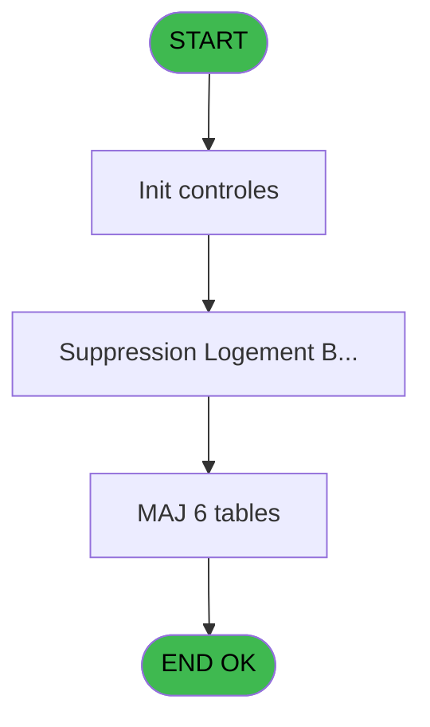
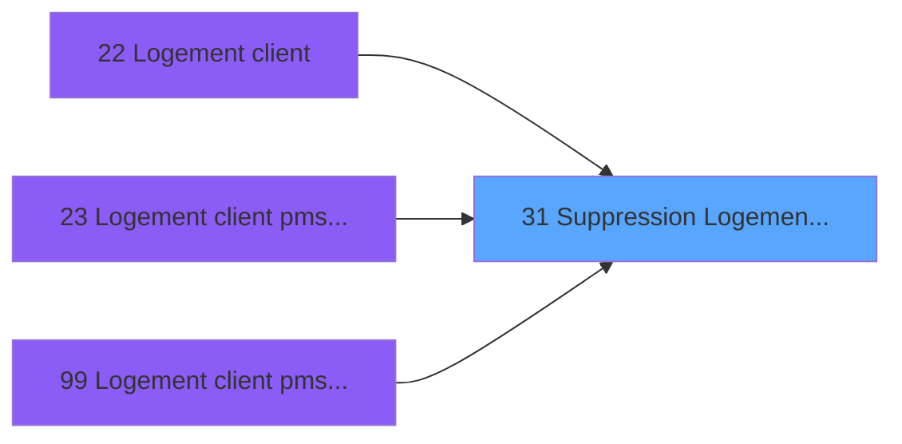
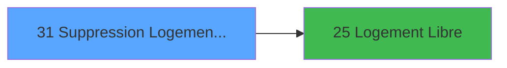

# PBS IDE 31 - Suppression Logement Client

> **Analyse**: Phases 1-4 2026-02-03 17:10 -> 17:10 (13s) | Assemblage 17:10
> **Pipeline**: V7.2 Enrichi
> **Structure**: 4 onglets (Resume | Ecrans | Donnees | Connexions)

<!-- TAB:Resume -->

## 1. FICHE D'IDENTITE

| Attribut | Valeur |
|----------|--------|
| Projet | PBS |
| IDE Position | 31 |
| Nom Programme | Suppression Logement Client |
| Fichier source | `Prg_31.xml` |
| Dossier IDE | Logement |
| Taches | 9 (1 ecrans visibles) |
| Tables modifiees | 6 |
| Programmes appeles | 1 |

## 2. DESCRIPTION FONCTIONNELLE

**Suppression Logement Client** assure la gestion complete de ce processus, accessible depuis [Logement client (IDE 22)](PBS-IDE-22.md), [Logement client pms-626 evo (IDE 23)](PBS-IDE-23.md), [Logement client pms-626 (IDE 99)](PBS-IDE-99.md).

Le flux de traitement s'organise en **1 blocs fonctionnels** :

- **Traitement** (9 taches) : traitements metier divers

**Donnees modifiees** : 6 tables en ecriture (logement_client__loc, fichier_menage, logement_complement, logement_zone_menage, tables_village, nb_code__poste).

Detail : phases du traitement

#### Phase 1 : Traitement (9 taches)

- **31** - Suppression Logement Client **[[ECRAN]](#ecran-t1)**
- **31.1** - Suppression Logement Client **[[ECRAN]](#ecran-t2)**
- **31.1.1** - Suppression Logement **[[ECRAN]](#ecran-t3)**
- **31.1.1.1** - Decrementations Tables
- **31.1.1.2** - Suppression Telephone
- **31.1.1.3** - Suppression Complements **[[ECRAN]](#ecran-t6)**
- **31.1.1.3.1** - Suppression Complements lies
- **31.1.2** - Suppression Menage
- **31.1.2.1** - Decrementations Tables

Delegue a : [ Logement Libre ? (IDE 25)](PBS-IDE-25.md)

#### Tables impactees

| Table | Operations | Role metier |
|-------|-----------|-------------|
| logement_complement | **W** (2 usages) |  |
| nb_code__poste | **W** (1 usages) |  |
| logement_client__loc | **W** (1 usages) |  |
| logement_zone_menage | **W** (1 usages) |  |
| tables_village | **W** (1 usages) |  |
| fichier_menage | **W** (1 usages) |  |

## 3. BLOCS FONCTIONNELS

### 3.1 Traitement (9 taches)

Traitements internes.

---

#### 31 - Suppression Logement Client [[ECRAN]](#ecran-t1)

**Role** : Tache d'orchestration : point d'entree du programme (9 sous-taches). Coordonne l'enchainement des traitements.
**Ecran** : 430 x 126 DLU (MDI) | [Voir mockup](#ecran-t1)

8 sous-taches directes

| Tache | Nom | Bloc |
|-------|-----|------|
| [31.1](#t2) | Suppression Logement Client **[[ECRAN]](#ecran-t2)** | Traitement |
| [31.1.1](#t3) | Suppression Logement **[[ECRAN]](#ecran-t3)** | Traitement |
| [31.1.1.1](#t4) | Decrementations Tables | Traitement |
| [31.1.1.2](#t5) | Suppression Telephone | Traitement |
| [31.1.1.3](#t6) | Suppression Complements **[[ECRAN]](#ecran-t6)** | Traitement |
| [31.1.1.3.1](#t7) | Suppression Complements lies | Traitement |
| [31.1.2](#t9) | Suppression Menage | Traitement |
| [31.1.2.1](#t10) | Decrementations Tables | Traitement |

**Delegue a** : [ Logement Libre ? (IDE 25)](PBS-IDE-25.md)

---

#### 31.1 - Suppression Logement Client [[ECRAN]](#ecran-t2)

**Role** : Traitement : Suppression Logement Client.
**Ecran** : 424 x 56 DLU (MDI) | [Voir mockup](#ecran-t2)
**Delegue a** : [ Logement Libre ? (IDE 25)](PBS-IDE-25.md)

---

#### 31.1.1 - Suppression Logement [[ECRAN]](#ecran-t3)

**Role** : Traitement : Suppression Logement.
**Ecran** : 490 x 124 DLU (MDI) | [Voir mockup](#ecran-t3)
**Delegue a** : [ Logement Libre ? (IDE 25)](PBS-IDE-25.md)

---

#### 31.1.1.1 - Decrementations Tables

**Role** : Traitement : Decrementations Tables.
**Delegue a** : [ Logement Libre ? (IDE 25)](PBS-IDE-25.md)

---

#### 31.1.1.2 - Suppression Telephone

**Role** : Traitement : Suppression Telephone.
**Delegue a** : [ Logement Libre ? (IDE 25)](PBS-IDE-25.md)

---

#### 31.1.1.3 - Suppression Complements [[ECRAN]](#ecran-t6)

**Role** : Traitement : Suppression Complements.
**Ecran** : 196 x 90 DLU (MDI) | [Voir mockup](#ecran-t6)
**Delegue a** : [ Logement Libre ? (IDE 25)](PBS-IDE-25.md)

---

#### 31.1.1.3.1 - Suppression Complements lies

**Role** : Traitement : Suppression Complements lies.
**Delegue a** : [ Logement Libre ? (IDE 25)](PBS-IDE-25.md)

---

#### 31.1.2 - Suppression Menage

**Role** : Traitement : Suppression Menage.
**Delegue a** : [ Logement Libre ? (IDE 25)](PBS-IDE-25.md)

---

#### 31.1.2.1 - Decrementations Tables

**Role** : Traitement : Decrementations Tables.
**Delegue a** : [ Logement Libre ? (IDE 25)](PBS-IDE-25.md)

## 5. REGLES METIER

*(Aucune regle metier identifiee)*

## 6. CONTEXTE

- **Appele par**: [Logement client (IDE 22)](PBS-IDE-22.md), [Logement client pms-626 evo (IDE 23)](PBS-IDE-23.md), [Logement client pms-626 (IDE 99)](PBS-IDE-99.md)
- **Appelle**: 1 programmes | **Tables**: 6 (W:6 R:0 L:0) | **Taches**: 9 | **Expressions**: 5

<!-- TAB:Ecrans -->

## 8. ECRANS

### 8.1 Forms visibles (1 / 9)

| # | Position | Tache | Nom | Type | Largeur | Hauteur | Bloc |
|---|----------|-------|-----|------|---------|---------|------|
| 1 | 31.1 | 31.1 | Suppression Logement Client | MDI | 424 | 56 | Traitement |

### 8.2 Mockups Ecrans

---

#### 31.1 - Suppression Logement Client
**Tache** : [31.1](#t2) | **Type** : MDI | **Dimensions** : 424 x 56 DLU
**Bloc** : Traitement | **Titre IDE** : Suppression Logement Client

<!-- FORM-DATA:
{
    "width":  424,
    "vFactor":  8,
    "type":  "MDI",
    "hFactor":  8,
    "controls":  [
                     {
                         "x":  1,
                         "type":  "label",
                         "var":  "",
                         "y":  0,
                         "w":  423,
                         "fmt":  "",
                         "name":  "",
                         "h":  29,
                         "color":  "",
                         "text":  "",
                         "parent":  null
                     },
                     {
                         "x":  99,
                         "type":  "label",
                         "var":  "",
                         "y":  10,
                         "w":  275,
                         "fmt":  "",
                         "name":  "",
                         "h":  8,
                         "color":  "7",
                         "text":  "Logement Client",
                         "parent":  null
                     },
                     {
                         "x":  1,
                         "type":  "label",
                         "var":  "",
                         "y":  29,
                         "w":  423,
                         "fmt":  "",
                         "name":  "",
                         "h":  27,
                         "color":  "",
                         "text":  "",
                         "parent":  null
                     },
                     {
                         "x":  55,
                         "type":  "label",
                         "var":  "",
                         "y":  39,
                         "w":  316,
                         "fmt":  "",
                         "name":  "",
                         "h":  8,
                         "color":  "",
                         "text":  "Suppression Logement en cours",
                         "parent":  null
                     },
                     {
                         "x":  2,
                         "type":  "image",
                         "var":  "",
                         "y":  2,
                         "w":  72,
                         "fmt":  "",
                         "name":  "",
                         "h":  25,
                         "color":  "",
                         "text":  "",
                         "parent":  null
                     }
                 ],
    "taskId":  "31.1",
    "height":  56
}
-->

## 9. NAVIGATION

Ecran unique: **Suppression Logement Client**

### 9.3 Structure hierarchique (9 taches)

| Position | Tache | Type | Dimensions | Bloc |
|----------|-------|------|------------|------|
| **31.1** | [**Suppression Logement Client** (31)](#t1) [mockup](#ecran-t1) | MDI | 430x126 | Traitement |
| 31.1.1 | [Suppression Logement Client (31.1)](#t2) [mockup](#ecran-t2) | MDI | 424x56 | |
| 31.1.2 | [Suppression Logement (31.1.1)](#t3) [mockup](#ecran-t3) | MDI | 490x124 | |
| 31.1.3 | [Decrementations Tables (31.1.1.1)](#t4) | MDI | - | |
| 31.1.4 | [Suppression Telephone (31.1.1.2)](#t5) | MDI | - | |
| 31.1.5 | [Suppression Complements (31.1.1.3)](#t6) [mockup](#ecran-t6) | MDI | 196x90 | |
| 31.1.6 | [Suppression Complements lies (31.1.1.3.1)](#t7) | MDI | - | |
| 31.1.7 | [Suppression Menage (31.1.2)](#t9) | MDI | - | |
| 31.1.8 | [Decrementations Tables (31.1.2.1)](#t10) | MDI | - | |

### 9.4 Algorigramme

> **Legende**: Vert = START/END OK | Rouge = END KO | Bleu = Decisions
> *Algorigramme auto-genere. Utiliser `/algorigramme` pour une synthese metier detaillee.*

<!-- TAB:Donnees -->

## 10. TABLES

### Tables utilisees (6)

| ID | Nom | Description | Type | R | W | L | Usages |
|----|-----|-------------|------|---|---|---|--------|
| 103 | logement_client__loc |  | DB |   | **W** |   | 1 |
| 104 | fichier_menage |  | DB |   | **W** |   | 1 |
| 105 | logement_complement |  | DB |   | **W** |   | 2 |
| 107 | logement_zone_menage |  | DB |   | **W** |   | 1 |
| 113 | tables_village |  | DB |   | **W** |   | 1 |
| 151 | nb_code__poste |  | DB |   | **W** |   | 1 |

### Colonnes par table (4 / 6 tables avec colonnes identifiees)

Table 103 - logement_client__loc (**W**) - 1 usages

*Table utilisee uniquement en Link ou aucune colonne Real identifiee dans le DataView.*

Table 104 - fichier_menage (**W**) - 1 usages

*Table utilisee uniquement en Link ou aucune colonne Real identifiee dans le DataView.*

Table 105 - logement_complement (**W**) - 2 usages

| Lettre | Variable | Acces | Type |
|--------|----------|-------|------|
| A | > Code Complement | W | Alpha |

Table 107 - logement_zone_menage (**W**) - 1 usages

| Lettre | Variable | Acces | Type |
|--------|----------|-------|------|
| A | > Zone/Secteur | W | Alpha |

Table 113 - tables_village (**W**) - 1 usages

| Lettre | Variable | Acces | Type |
|--------|----------|-------|------|
| A | > nom table | W | Alpha |
| B | > Code Alpha6 | W | Alpha |

Table 151 - nb_code__poste (**W**) - 1 usages

| Lettre | Variable | Acces | Type |
|--------|----------|-------|------|
| A | > Code Complement | W | Alpha |
| B | > Code Alpha6 | W | Alpha |

## 11. VARIABLES

### 11.1 Variables de session (2)

Variables persistantes pendant toute la session.

| Lettre | Nom | Type | Usage dans |
|--------|-----|------|-----------|
| B | v.Contrôle | Logical | 1x session |
| C | v.Reponse | Numeric | 1x session |

### 11.2 Autres (1)

Variables diverses.

| Lettre | Nom | Type | Usage dans |
|--------|-----|------|-----------|
| A | > Nom Standard | Alpha | - |

## 12. EXPRESSIONS

**5 / 5 expressions decodees (100%)**

### 12.1 Repartition par type

| Type | Expressions | Regles |
|------|-------------|--------|
| OTHER | 4 | 0 |
| CONDITION | 1 | 0 |

### 12.2 Expressions cles par type

#### OTHER (4 expressions)

| Type | IDE | Expression | Regle |
|------|-----|------------|-------|
| OTHER | 4 | `SetCrsr (1)` | - |
| OTHER | 5 | `GetParam ('SOCIETE')` | - |
| OTHER | 1 | `v.Contrôle [B]` | - |
| OTHER | 3 | `SetCrsr (2)` | - |

#### CONDITION (1 expressions)

| Type | IDE | Expression | Regle |
|------|-----|------------|-------|
| CONDITION | 2 | `v.Reponse [C]=6` | - |

<!-- TAB:Connexions -->

## 13. GRAPHE D'APPELS

### 13.1 Chaine depuis Main (Callers)

Main -> ... -> [Logement client (IDE 22)](PBS-IDE-22.md) -> **Suppression Logement Client (IDE 31)**

Main -> ... -> [Logement client pms-626 evo (IDE 23)](PBS-IDE-23.md) -> **Suppression Logement Client (IDE 31)**

Main -> ... -> [Logement client pms-626 (IDE 99)](PBS-IDE-99.md) -> **Suppression Logement Client (IDE 31)**

### 13.2 Callers

| IDE | Nom Programme | Nb Appels |
|-----|---------------|-----------|
| [22](PBS-IDE-22.md) | Logement client | 1 |
| [23](PBS-IDE-23.md) | Logement client pms-626 evo | 1 |
| [99](PBS-IDE-99.md) | Logement client pms-626 | 1 |

### 13.3 Callees (programmes appeles)

### 13.4 Detail Callees avec contexte

| IDE | Nom Programme | Appels | Contexte |
|-----|---------------|--------|----------|
| [25](PBS-IDE-25.md) |  Logement Libre ? | 1 | Sous-programme |

## 14. RECOMMANDATIONS MIGRATION

### 14.1 Profil du programme

| Metrique | Valeur | Impact migration |
|----------|--------|-----------------|
| Lignes de logique | 83 | Programme compact |
| Expressions | 5 | Peu de logique |
| Tables WRITE | 6 | Fort impact donnees |
| Sous-programmes | 1 | Peu de dependances |
| Ecrans visibles | 1 | Ecran unique ou traitement batch |
| Code desactive | 0% (0 / 83) | Code sain |
| Regles metier | 0 | Pas de regle identifiee |

### 14.2 Plan de migration par bloc

#### Traitement (9 taches: 4 ecrans, 5 traitements)

- **Strategie** : Orchestrateur avec 4 ecrans (Razor/React) et 5 traitements backend (services).
- Les ecrans deviennent des composants UI, les traitements invisibles deviennent des services injectables.
- 1 sous-programme(s) a migrer ou a reutiliser depuis les services existants.
- Decomposer les taches en services unitaires testables.

### 14.3 Dependances critiques

| Dependance | Type | Appels | Impact |
|------------|------|--------|--------|
| logement_client__loc | Table WRITE (Database) | 1x | Schema + repository |
| fichier_menage | Table WRITE (Database) | 1x | Schema + repository |
| logement_complement | Table WRITE (Database) | 2x | Schema + repository |
| logement_zone_menage | Table WRITE (Database) | 1x | Schema + repository |
| tables_village | Table WRITE (Database) | 1x | Schema + repository |
| nb_code__poste | Table WRITE (Database) | 1x | Schema + repository |
| [ Logement Libre ? (IDE 25)](PBS-IDE-25.md) | Sous-programme | 1x | Normale - Sous-programme |

---
*Spec DETAILED generee par Pipeline V7.2 - 2026-02-03 17:10*
