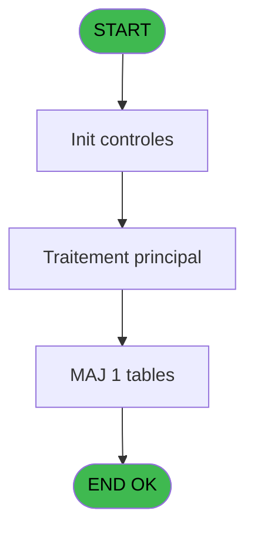
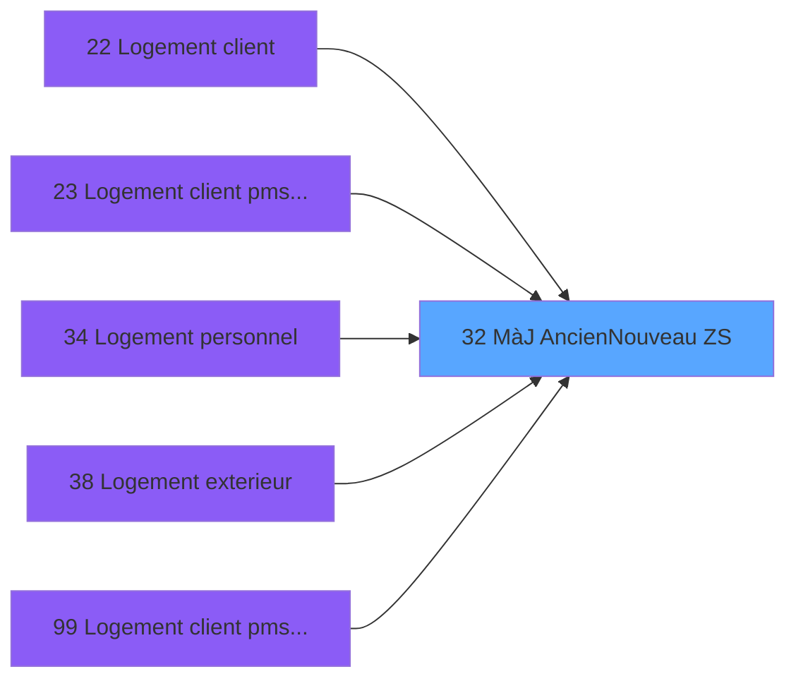

# PBS IDE 32 - MàJ Ancien/Nouveau (ZS)

> **Analyse**: Phases 1-4 2026-02-03 17:10 -> 17:11 (12s) | Assemblage 17:11
> **Pipeline**: V7.2 Enrichi
> **Structure**: 4 onglets (Resume | Ecrans | Donnees | Connexions)

<!-- TAB:Resume -->

## 1. FICHE D'IDENTITE

| Attribut | Valeur |
|----------|--------|
| Projet | PBS |
| IDE Position | 32 |
| Nom Programme | MàJ Ancien/Nouveau (ZS) |
| Fichier source | `Prg_32.xml` |
| Dossier IDE | Logement |
| Taches | 3 (0 ecrans visibles) |
| Tables modifiees | 1 |
| Programmes appeles | 0 |

## 2. DESCRIPTION FONCTIONNELLE

**MàJ Ancien/Nouveau (ZS)** assure la gestion complete de ce processus, accessible depuis [Logement client (IDE 22)](PBS-IDE-22.md), [Logement client pms-626 evo (IDE 23)](PBS-IDE-23.md), [Logement personnel (IDE 34)](PBS-IDE-34.md), [Logement exterieur (IDE 38)](PBS-IDE-38.md), [Logement client pms-626 (IDE 99)](PBS-IDE-99.md).

Le flux de traitement s'organise en **1 blocs fonctionnels** :

- **Traitement** (3 taches) : traitements metier divers

**Donnees modifiees** : 1 tables en ecriture (logement_zone_menage).

## 3. BLOCS FONCTIONNELS

### 3.1 Traitement (3 taches)

Traitements internes.

---

#### 32 - MàJ Ancien/Nouveau (ZS)

**Role** : Creation d'enregistrement : MàJ Ancien/Nouveau (ZS).

---

#### 32.1 - MàJ Nouveau Zone

**Role** : Creation d'enregistrement : MàJ Nouveau Zone.
**Variables liees** : B (> Nouveau Code)

---

#### 32.2 - MàJ Ancien Zone

**Role** : Traitement : MàJ Ancien Zone.
**Variables liees** : C (> Ancien Code)

## 5. REGLES METIER

*(Aucune regle metier identifiee)*

## 6. CONTEXTE

- **Appele par**: [Logement client (IDE 22)](PBS-IDE-22.md), [Logement client pms-626 evo (IDE 23)](PBS-IDE-23.md), [Logement personnel (IDE 34)](PBS-IDE-34.md), [Logement exterieur (IDE 38)](PBS-IDE-38.md), [Logement client pms-626 (IDE 99)](PBS-IDE-99.md)
- **Appelle**: 0 programmes | **Tables**: 1 (W:1 R:0 L:0) | **Taches**: 3 | **Expressions**: 2

<!-- TAB:Ecrans -->

## 8. ECRANS

*(Programme sans ecran visible)*

## 9. NAVIGATION

### 9.3 Structure hierarchique (3 taches)

| Position | Tache | Type | Dimensions | Bloc |
|----------|-------|------|------------|------|
| **32.1** | [**MàJ Ancien/Nouveau (ZS)** (32)](#t1) | MDI | - | Traitement |
| 32.1.1 | [MàJ Nouveau Zone (32.1)](#t2) | MDI | - | |
| 32.1.2 | [MàJ Ancien Zone (32.2)](#t3) | MDI | - | |

### 9.4 Algorigramme

> **Legende**: Vert = START/END OK | Rouge = END KO | Bleu = Decisions
> *Algorigramme auto-genere. Utiliser `/algorigramme` pour une synthese metier detaillee.*

<!-- TAB:Donnees -->

## 10. TABLES

### Tables utilisees (1)

| ID | Nom | Description | Type | R | W | L | Usages |
|----|-----|-------------|------|---|---|---|--------|
| 107 | logement_zone_menage |  | DB |   | **W** |   | 2 |

### Colonnes par table (1 / 1 tables avec colonnes identifiees)

Table 107 - logement_zone_menage (**W**) - 2 usages

| Lettre | Variable | Acces | Type |
|--------|----------|-------|------|
| A | > Code Menage | W | Alpha |

## 11. VARIABLES

### 11.1 Autres (3)

Variables diverses.

| Lettre | Nom | Type | Usage dans |
|--------|-----|------|-----------|
| A | > Code Menage | Alpha | 2x refs |
| B | > Nouveau Code | Alpha | - |
| C | > Ancien Code | Alpha | - |

## 12. EXPRESSIONS

**2 / 2 expressions decodees (100%)**

### 12.1 Repartition par type

| Type | Expressions | Regles |
|------|-------------|--------|
| CONDITION | 2 | 0 |

### 12.2 Expressions cles par type

#### CONDITION (2 expressions)

| Type | IDE | Expression | Regle |
|------|-----|------------|-------|
| CONDITION | 2 | `> Code Menage [A]='S'` | - |
| CONDITION | 1 | `> Code Menage [A]='Z'` | - |

<!-- TAB:Connexions -->

## 13. GRAPHE D'APPELS

### 13.1 Chaine depuis Main (Callers)

Main -> ... -> [Logement client (IDE 22)](PBS-IDE-22.md) -> **MàJ Ancien/Nouveau (ZS) (IDE 32)**

Main -> ... -> [Logement client pms-626 evo (IDE 23)](PBS-IDE-23.md) -> **MàJ Ancien/Nouveau (ZS) (IDE 32)**

Main -> ... -> [Logement personnel (IDE 34)](PBS-IDE-34.md) -> **MàJ Ancien/Nouveau (ZS) (IDE 32)**

Main -> ... -> [Logement exterieur (IDE 38)](PBS-IDE-38.md) -> **MàJ Ancien/Nouveau (ZS) (IDE 32)**

Main -> ... -> [Logement client pms-626 (IDE 99)](PBS-IDE-99.md) -> **MàJ Ancien/Nouveau (ZS) (IDE 32)**

### 13.2 Callers

| IDE | Nom Programme | Nb Appels |
|-----|---------------|-----------|
| [22](PBS-IDE-22.md) | Logement client | 2 |
| [23](PBS-IDE-23.md) | Logement client pms-626 evo | 2 |
| [34](PBS-IDE-34.md) | Logement personnel | 2 |
| [38](PBS-IDE-38.md) | Logement exterieur | 2 |
| [99](PBS-IDE-99.md) | Logement client pms-626 | 2 |

### 13.3 Callees (programmes appeles)

### 13.4 Detail Callees avec contexte

| IDE | Nom Programme | Appels | Contexte |
|-----|---------------|--------|----------|
| - | (aucun) | - | - |

## 14. RECOMMANDATIONS MIGRATION

### 14.1 Profil du programme

| Metrique | Valeur | Impact migration |
|----------|--------|-----------------|
| Lignes de logique | 27 | Programme compact |
| Expressions | 2 | Peu de logique |
| Tables WRITE | 1 | Impact faible |
| Sous-programmes | 0 | Peu de dependances |
| Ecrans visibles | 0 | Ecran unique ou traitement batch |
| Code desactive | 0% (0 / 27) | Code sain |
| Regles metier | 0 | Pas de regle identifiee |

### 14.2 Plan de migration par bloc

#### Traitement (3 taches: 0 ecran, 3 traitements)

- **Strategie** : 3 service(s) backend injectable(s) (Domain Services).
- Decomposer les taches en services unitaires testables.

### 14.3 Dependances critiques

| Dependance | Type | Appels | Impact |
|------------|------|--------|--------|
| logement_zone_menage | Table WRITE (Database) | 2x | Schema + repository |

---
*Spec DETAILED generee par Pipeline V7.2 - 2026-02-03 17:11*
