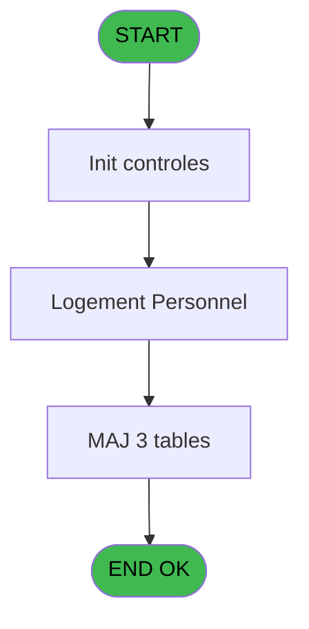
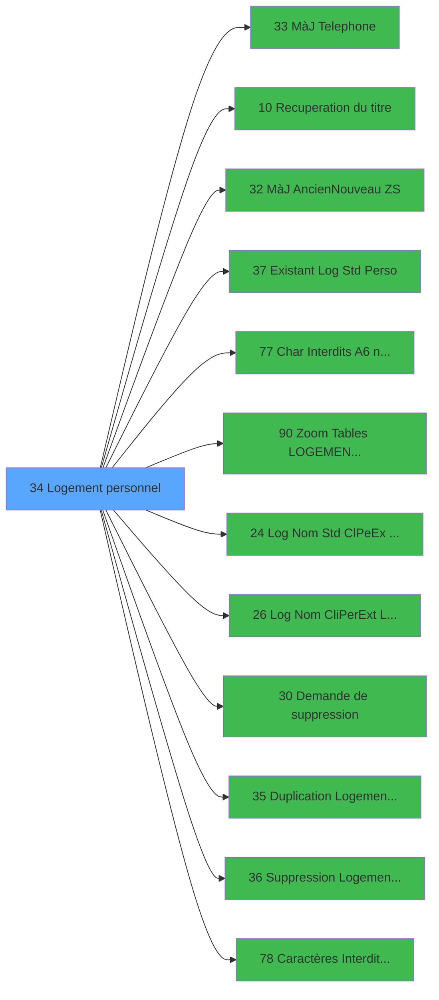

# PBS IDE 34 - Logement personnel

> **Analyse**: Phases 1-4 2026-02-03 17:11 -> 17:11 (12s) | Assemblage 17:11
> **Pipeline**: V7.2 Enrichi
> **Structure**: 4 onglets (Resume | Ecrans | Donnees | Connexions)

<!-- TAB:Resume -->

## 1. FICHE D'IDENTITE

| Attribut | Valeur |
|----------|--------|
| Projet | PBS |
| IDE Position | 34 |
| Nom Programme | Logement personnel |
| Fichier source | `Prg_34.xml` |
| Dossier IDE | Logement |
| Taches | 14 (4 ecrans visibles) |
| Tables modifiees | 3 |
| Programmes appeles | 12 |
| :warning: Statut | **ORPHELIN_POTENTIEL** |

## 2. DESCRIPTION FONCTIONNELLE

**Logement personnel** assure la gestion complete de ce processus.

Le flux de traitement s'organise en **4 blocs fonctionnels** :

- **Traitement** (10 taches) : traitements metier divers
- **Creation** (2 taches) : insertion d'enregistrements en base (mouvements, prestations)
- **Consultation** (1 tache) : ecrans de recherche, selection et consultation
- **Validation** (1 tache) : controles et verifications de coherence

**Donnees modifiees** : 3 tables en ecriture (logement_go______lop, logement_complement, tables_village).

Detail : phases du traitement

#### Phase 1 : Traitement (10 taches)

- **34** - Logement personnel **[[ECRAN]](#ecran-t1)**
- **34.1** - Êcran **[[ECRAN]](#ecran-t2)**
- **34.1.1** - Communicante **[[ECRAN]](#ecran-t3)**
- **34.1.1.2** - MaJ Logemt lie **[[ECRAN]](#ecran-t5)**
- **34.1.1.3** - Suppr. Communiqu.
- **34.1.1.3.1** - Suppr. Liens
- **34.1.3** - MàJ Table VILLAGE
- **34.1.4** - Proximite **[[ECRAN]](#ecran-t11)**
- **34.1.4.1** - Suppr. Proximite
- **34.1.4.1.1** - Suppr. Liens

Delegue a : [MàJ Telephone (IDE 33)](PBS-IDE-33.md), [Recuperation du titre (IDE 10)](PBS-IDE-10.md), [MàJ Ancien/Nouveau (ZS) (IDE 32)](PBS-IDE-32.md), [ Existant Log Std (Perso) (IDE 37)](PBS-IDE-37.md), [Char Interdits (A6) no space (IDE 77)](PBS-IDE-77.md), [ Log Nom Std (Cl/Pe/Ex) Libre? (IDE 24)](PBS-IDE-24.md), [ Log Nom (Cli/Per/Ext) Libre ? (IDE 26)](PBS-IDE-26.md), [ Demande de suppression (IDE 30)](PBS-IDE-30.md), [ Duplication Logement Perso (IDE 35)](PBS-IDE-35.md), [ Suppression Logement Perso (IDE 36)](PBS-IDE-36.md), [Caractères Interdits (TEL) (IDE 78)](PBS-IDE-78.md)

#### Phase 2 : Creation (2 taches)

- **34.1.1.1** - Creation Lien **[[ECRAN]](#ecran-t4)**
- **34.1.4.2** - Creation Lien **[[ECRAN]](#ecran-t14)**

#### Phase 3 : Validation (1 tache)

- **34.1.1.3.2** - Verif si Vide

Delegue a : [Char Interdits (A6) no space (IDE 77)](PBS-IDE-77.md), [Caractères Interdits (TEL) (IDE 78)](PBS-IDE-78.md)

#### Phase 4 : Consultation (1 tache)

- **34.1.2** - Rechercher **[[ECRAN]](#ecran-t9)**

Delegue a : [Recuperation du titre (IDE 10)](PBS-IDE-10.md), [Zoom Tables LOGEMENT PERSO (IDE 90)](PBS-IDE-90.md)

#### Tables impactees

| Table | Operations | Role metier |
|-------|-----------|-------------|
| logement_complement | **W**/L (10 usages) |  |
| logement_go______lop | **W** (3 usages) |  |
| tables_village | **W** (1 usages) |  |

## 3. BLOCS FONCTIONNELS

### 3.1 Traitement (10 taches)

Traitements internes.

---

#### 34 - Logement personnel [[ECRAN]](#ecran-t1)

**Role** : Tache d'orchestration : point d'entree du programme (10 sous-taches). Coordonne l'enchainement des traitements.
**Ecran** : 182 x 59 DLU (MDI) | [Voir mockup](#ecran-t1)

9 sous-taches directes

| Tache | Nom | Bloc |
|-------|-----|------|
| [34.1](#t2) | Êcran **[[ECRAN]](#ecran-t2)** | Traitement |
| [34.1.1](#t3) | Communicante **[[ECRAN]](#ecran-t3)** | Traitement |
| [34.1.1.2](#t5) | MaJ Logemt lie **[[ECRAN]](#ecran-t5)** | Traitement |
| [34.1.1.3](#t6) | Suppr. Communiqu. | Traitement |
| [34.1.1.3.1](#t7) | Suppr. Liens | Traitement |
| [34.1.3](#t10) | MàJ Table VILLAGE | Traitement |
| [34.1.4](#t11) | Proximite **[[ECRAN]](#ecran-t11)** | Traitement |
| [34.1.4.1](#t12) | Suppr. Proximite | Traitement |
| [34.1.4.1.1](#t13) | Suppr. Liens | Traitement |

**Variables liees** : I (v.Ancien Logement)
**Delegue a** : [MàJ Telephone (IDE 33)](PBS-IDE-33.md), [Recuperation du titre (IDE 10)](PBS-IDE-10.md), [MàJ Ancien/Nouveau (ZS) (IDE 32)](PBS-IDE-32.md)

---

#### 34.1 - Êcran [[ECRAN]](#ecran-t2)

**Role** : Traitement : Êcran.
**Ecran** : 1261 x 295 DLU (MDI) | [Voir mockup](#ecran-t2)
**Delegue a** : [MàJ Telephone (IDE 33)](PBS-IDE-33.md), [Recuperation du titre (IDE 10)](PBS-IDE-10.md), [MàJ Ancien/Nouveau (ZS) (IDE 32)](PBS-IDE-32.md)

---

#### 34.1.1 - Communicante [[ECRAN]](#ecran-t3)

**Role** : Traitement : Communicante.
**Ecran** : 170 x 84 DLU (Modal) | [Voir mockup](#ecran-t3)
**Delegue a** : [MàJ Telephone (IDE 33)](PBS-IDE-33.md), [Recuperation du titre (IDE 10)](PBS-IDE-10.md), [MàJ Ancien/Nouveau (ZS) (IDE 32)](PBS-IDE-32.md)

---

#### 34.1.1.2 - MaJ Logemt lie [[ECRAN]](#ecran-t5)

**Role** : Traitement : MaJ Logemt lie.
**Ecran** : 158 x 75 DLU (MDI) | [Voir mockup](#ecran-t5)
**Delegue a** : [MàJ Telephone (IDE 33)](PBS-IDE-33.md), [Recuperation du titre (IDE 10)](PBS-IDE-10.md), [MàJ Ancien/Nouveau (ZS) (IDE 32)](PBS-IDE-32.md)

---

#### 34.1.1.3 - Suppr. Communiqu.

**Role** : Traitement : Suppr. Communiqu..
**Delegue a** : [MàJ Telephone (IDE 33)](PBS-IDE-33.md), [Recuperation du titre (IDE 10)](PBS-IDE-10.md), [MàJ Ancien/Nouveau (ZS) (IDE 32)](PBS-IDE-32.md)

---

#### 34.1.1.3.1 - Suppr. Liens

**Role** : Traitement : Suppr. Liens.
**Delegue a** : [MàJ Telephone (IDE 33)](PBS-IDE-33.md), [Recuperation du titre (IDE 10)](PBS-IDE-10.md), [MàJ Ancien/Nouveau (ZS) (IDE 32)](PBS-IDE-32.md)

---

#### 34.1.3 - MàJ Table VILLAGE

**Role** : Traitement : MàJ Table VILLAGE.
**Delegue a** : [MàJ Telephone (IDE 33)](PBS-IDE-33.md), [Recuperation du titre (IDE 10)](PBS-IDE-10.md), [MàJ Ancien/Nouveau (ZS) (IDE 32)](PBS-IDE-32.md)

---

#### 34.1.4 - Proximite [[ECRAN]](#ecran-t11)

**Role** : Traitement : Proximite.
**Ecran** : 141 x 84 DLU (Modal) | [Voir mockup](#ecran-t11)
**Delegue a** : [MàJ Telephone (IDE 33)](PBS-IDE-33.md), [Recuperation du titre (IDE 10)](PBS-IDE-10.md), [MàJ Ancien/Nouveau (ZS) (IDE 32)](PBS-IDE-32.md)

---

#### 34.1.4.1 - Suppr. Proximite

**Role** : Traitement : Suppr. Proximite.
**Delegue a** : [MàJ Telephone (IDE 33)](PBS-IDE-33.md), [Recuperation du titre (IDE 10)](PBS-IDE-10.md), [MàJ Ancien/Nouveau (ZS) (IDE 32)](PBS-IDE-32.md)

---

#### 34.1.4.1.1 - Suppr. Liens

**Role** : Traitement : Suppr. Liens.
**Delegue a** : [MàJ Telephone (IDE 33)](PBS-IDE-33.md), [Recuperation du titre (IDE 10)](PBS-IDE-10.md), [MàJ Ancien/Nouveau (ZS) (IDE 32)](PBS-IDE-32.md)

### 3.2 Creation (2 taches)

Insertion de nouveaux enregistrements en base.

---

#### 34.1.1.1 - Creation Lien [[ECRAN]](#ecran-t4)

**Role** : Creation d'enregistrement : Creation Lien.
**Ecran** : 158 x 75 DLU (MDI) | [Voir mockup](#ecran-t4)

---

#### 34.1.4.2 - Creation Lien [[ECRAN]](#ecran-t14)

**Role** : Creation d'enregistrement : Creation Lien.
**Ecran** : 158 x 75 DLU (MDI) | [Voir mockup](#ecran-t14)

### 3.3 Validation (1 tache)

Controles de coherence : 1 tache verifie les donnees et conditions.

---

#### 34.1.1.3.2 - Verif si Vide

**Role** : Verification : Verif si Vide.

### 3.4 Consultation (1 tache)

Ecrans de recherche et consultation.

---

#### 34.1.2 - Rechercher [[ECRAN]](#ecran-t9)

**Role** : Traitement : Rechercher.
**Ecran** : 379 x 77 DLU (MDI) | [Voir mockup](#ecran-t9)
**Delegue a** : [Zoom Tables LOGEMENT PERSO (IDE 90)](PBS-IDE-90.md)

## 5. REGLES METIER

*(Aucune regle metier identifiee)*

## 6. CONTEXTE

- **Appele par**: (aucun)
- **Appelle**: 12 programmes | **Tables**: 4 (W:3 R:0 L:2) | **Taches**: 14 | **Expressions**: 3

<!-- TAB:Ecrans -->

## 8. ECRANS

### 8.1 Forms visibles (4 / 14)

| # | Position | Tache | Nom | Type | Largeur | Hauteur | Bloc |
|---|----------|-------|-----|------|---------|---------|------|
| 1 | 34.1 | 34.1 | Êcran | MDI | 1261 | 295 | Traitement |
| 2 | 34.1.1 | 34.1.1 | Communicante | Modal | 170 | 84 | Traitement |
| 3 | 34.1.2 | 34.1.2 | Rechercher | MDI | 379 | 77 | Consultation |
| 4 | 34.1.4 | 34.1.4 | Proximite | Modal | 141 | 84 | Traitement |

### 8.2 Mockups Ecrans

---

#### 34.1 - Êcran
**Tache** : [34.1](#t2) | **Type** : MDI | **Dimensions** : 1261 x 295 DLU
**Bloc** : Traitement | **Titre IDE** : Êcran

<!-- FORM-DATA:
{
    "width":  1261,
    "vFactor":  8,
    "type":  "MDI",
    "hFactor":  8,
    "controls":  [
                     {
                         "x":  2,
                         "type":  "label",
                         "var":  "",
                         "y":  1,
                         "w":  1255,
                         "fmt":  "",
                         "name":  "",
                         "h":  20,
                         "color":  "",
                         "text":  "",
                         "parent":  null
                     },
                     {
                         "x":  10,
                         "type":  "table",
                         "var":  "",
                         "name":  "",
                         "titleH":  12,
                         "color":  "110",
                         "w":  178,
                         "y":  31,
                         "fmt":  "",
                         "parent":  null,
                         "text":  "",
                         "rowH":  12,
                         "h":  223,
                         "cols":  [
                                      {
                                          "title":  "Nom Standard",
                                          "layer":  1,
                                          "w":  144
                                      }
                                  ],
                         "rows":  1
                     },
                     {
                         "x":  219,
                         "type":  "label",
                         "var":  "",
                         "y":  31,
                         "w":  833,
                         "fmt":  "",
                         "name":  "",
                         "h":  32,
                         "color":  "",
                         "text":  "",
                         "parent":  null
                     },
                     {
                         "x":  1064,
                         "type":  "label",
                         "var":  "",
                         "y":  31,
                         "w":  181,
                         "fmt":  "",
                         "name":  "",
                         "h":  222,
                         "color":  "",
                         "text":  "",
                         "parent":  null
                     },
                     {
                         "x":  14,
                         "type":  "label",
                         "var":  "",
                         "y":  33,
                         "w":  155,
                         "fmt":  "",
                         "name":  "",
                         "h":  8,
                         "color":  "7",
                         "text":  "Nom Standard",
                         "parent":  null
                     },
                     {
                         "x":  227,
                         "type":  "label",
                         "var":  "",
                         "y":  42,
                         "w":  120,
                         "fmt":  "",
                         "name":  "",
                         "h":  12,
                         "color":  "",
                         "text":  "Nom Complet",
                         "parent":  5
                     },
                     {
                         "x":  545,
                         "type":  "label",
                         "var":  "",
                         "y":  42,
                         "w":  75,
                         "fmt":  "",
                         "name":  "",
                         "h":  12,
                         "color":  "",
                         "text":  "N° Poste",
                         "parent":  5
                     },
                     {
                         "x":  222,
                         "type":  "label",
                         "var":  "",
                         "y":  69,
                         "w":  833,
                         "fmt":  "",
                         "name":  "",
                         "h":  83,
                         "color":  "195",
                         "text":  "Type logement",
                         "parent":  null
                     },
                     {
                         "x":  658,
                         "type":  "label",
                         "var":  "",
                         "y":  79,
                         "w":  133,
                         "fmt":  "",
                         "name":  "",
                         "h":  12,
                         "color":  "",
                         "text":  "Type Occup.",
                         "parent":  14
                     },
                     {
                         "x":  242,
                         "type":  "label",
                         "var":  "",
                         "y":  79,
                         "w":  109,
                         "fmt":  "",
                         "name":  "",
                         "h":  12,
                         "color":  "",
                         "text":  "Logement",
                         "parent":  14
                     },
                     {
                         "x":  658,
                         "type":  "label",
                         "var":  "",
                         "y":  105,
                         "w":  96,
                         "fmt":  "",
                         "name":  "",
                         "h":  12,
                         "color":  "",
                         "text":  "Occupation",
                         "parent":  14
                     },
                     {
                         "x":  242,
                         "type":  "label",
                         "var":  "",
                         "y":  105,
                         "w":  74,
                         "fmt":  "",
                         "name":  "",
                         "h":  12,
                         "color":  "",
                         "text":  "Bâtiment",
                         "parent":  14
                     },
                     {
                         "x":  242,
                         "type":  "label",
                         "var":  "",
                         "y":  130,
                         "w":  53,
                         "fmt":  "",
                         "name":  "",
                         "h":  12,
                         "color":  "",
                         "text":  "Etage",
                         "parent":  14
                     },
                     {
                         "x":  658,
                         "type":  "label",
                         "var":  "",
                         "y":  130,
                         "w":  131,
                         "fmt":  "",
                         "name":  "",
                         "h":  12,
                         "color":  "",
                         "text":  "Occupation Sbk",
                         "parent":  14
                     },
                     {
                         "x":  222,
                         "type":  "label",
                         "var":  "",
                         "y":  161,
                         "w":  412,
                         "fmt":  "",
                         "name":  "",
                         "h":  91,
                         "color":  "195",
                         "text":  "Renseignements",
                         "parent":  null
                     },
                     {
                         "x":  679,
                         "type":  "label",
                         "var":  "",
                         "y":  161,
                         "w":  376,
                         "fmt":  "",
                         "name":  "",
                         "h":  91,
                         "color":  "",
                         "text":  "",
                         "parent":  null
                     },
                     {
                         "x":  1072,
                         "type":  "line",
                         "var":  "",
                         "y":  171,
                         "w":  168,
                         "fmt":  "",
                         "name":  "",
                         "h":  0,
                         "color":  "",
                         "text":  "",
                         "parent":  6
                     },
                     {
                         "x":  230,
                         "type":  "label",
                         "var":  "",
                         "y":  177,
                         "w":  168,
                         "fmt":  "",
                         "name":  "",
                         "h":  12,
                         "color":  "",
                         "text":  "Zone Ménage",
                         "parent":  24
                     },
                     {
                         "x":  230,
                         "type":  "label",
                         "var":  "",
                         "y":  196,
                         "w":  170,
                         "fmt":  "",
                         "name":  "",
                         "h":  12,
                         "color":  "",
                         "text":  "Secteur Ménage",
                         "parent":  24
                     },
                     {
                         "x":  230,
                         "type":  "label",
                         "var":  "",
                         "y":  215,
                         "w":  108,
                         "fmt":  "",
                         "name":  "",
                         "h":  10,
                         "color":  "",
                         "text":  "N° Extérieur",
                         "parent":  24
                     },
                     {
                         "x":  230,
                         "type":  "label",
                         "var":  "",
                         "y":  232,
                         "w":  69,
                         "fmt":  "",
                         "name":  "",
                         "h":  10,
                         "color":  "",
                         "text":  "N° Fax",
                         "parent":  24
                     },
                     {
                         "x":  0,
                         "type":  "label",
                         "var":  "",
                         "y":  266,
                         "w":  1255,
                         "fmt":  "",
                         "name":  "",
                         "h":  24,
                         "color":  "",
                         "text":  "",
                         "parent":  null
                     },
                     {
                         "x":  52,
                         "type":  "edit",
                         "var":  "",
                         "y":  46,
                         "w":  75,
                         "fmt":  "",
                         "name":  "NOM STANDARD",
                         "h":  8,
                         "color":  "110",
                         "text":  "",
                         "parent":  4
                     },
                     {
                         "x":  352,
                         "type":  "edit",
                         "var":  "",
                         "y":  42,
                         "w":  182,
                         "fmt":  "U15",
                         "name":  "NOM COMPLET",
                         "h":  12,
                         "color":  "110",
                         "text":  "",
                         "parent":  5
                     },
                     {
                         "x":  631,
                         "type":  "edit",
                         "var":  "",
                         "y":  42,
                         "w":  82,
                         "fmt":  "",
                         "name":  "TELEPHONE INTERIEUR",
                         "h":  12,
                         "color":  "110",
                         "text":  "",
                         "parent":  5
                     },
                     {
                         "x":  724,
                         "type":  "combobox",
                         "var":  "",
                         "y":  42,
                         "w":  157,
                         "fmt":  "",
                         "name":  "STANDING",
                         "h":  12,
                         "color":  "110",
                         "text":  "11,22",
                         "parent":  5
                     },
                     {
                         "x":  893,
                         "type":  "combobox",
                         "var":  "",
                         "y":  42,
                         "w":  147,
                         "fmt":  "",
                         "name":  "ATTRIBUTION",
                         "h":  12,
                         "color":  "110",
                         "text":  "1,2",
                         "parent":  5
                     },
                     {
                         "x":  371,
                         "type":  "combobox",
                         "var":  "",
                         "y":  79,
                         "w":  250,
                         "fmt":  "",
                         "name":  "TYPE LOGEMENT",
                         "h":  12,
                         "color":  "110",
                         "text":  "11,22",
                         "parent":  14
                     },
                     {
                         "x":  371,
                         "type":  "combobox",
                         "var":  "",
                         "y":  105,
                         "w":  250,
                         "fmt":  "",
                         "name":  "BATIMENT",
                         "h":  12,
                         "color":  "110",
                         "text":  "11,22",
                         "parent":  14
                     },
                     {
                         "x":  371,
                         "type":  "combobox",
                         "var":  "",
                         "y":  130,
                         "w":  250,
                         "fmt":  "",
                         "name":  "ETAGE",
                         "h":  12,
                         "color":  "110",
                         "text":  "11,22",
                         "parent":  14
                     },
                     {
                         "x":  797,
                         "type":  "combobox",
                         "var":  "",
                         "y":  79,
                         "w":  190,
                         "fmt":  "",
                         "name":  "TYPE OCCUPATION",
                         "h":  12,
                         "color":  "110",
                         "text":  "GO,AD",
                         "parent":  14
                     },
                     {
                         "x":  797,
                         "type":  "edit",
                         "var":  "",
                         "y":  105,
                         "w":  37,
                         "fmt":  "",
                         "name":  "OCCUP.STANDARD",
                         "h":  12,
                         "color":  "110",
                         "text":  "",
                         "parent":  14
                     },
                     {
                         "x":  797,
                         "type":  "edit",
                         "var":  "",
                         "y":  130,
                         "w":  37,
                         "fmt":  "",
                         "name":  "OCCUP.SURBOOK",
                         "h":  12,
                         "color":  "110",
                         "text":  "",
                         "parent":  14
                     },
                     {
                         "x":  406,
                         "type":  "combobox",
                         "var":  "",
                         "y":  177,
                         "w":  216,
                         "fmt":  "",
                         "name":  "v.Code Zone Reduit",
                         "h":  12,
                         "color":  "110",
                         "text":  "11,22",
                         "parent":  24
                     },
                     {
                         "x":  406,
                         "type":  "combobox",
                         "var":  "",
                         "y":  196,
                         "w":  216,
                         "fmt":  "",
                         "name":  "v.Code Secteur Reduit",
                         "h":  12,
                         "color":  "110",
                         "text":  "11,22",
                         "parent":  24
                     },
                     {
                         "x":  406,
                         "type":  "edit",
                         "var":  "",
                         "y":  215,
                         "w":  182,
                         "fmt":  "",
                         "name":  "TEL. EXTERIEUR",
                         "h":  10,
                         "color":  "110",
                         "text":  "",
                         "parent":  24
                     },
                     {
                         "x":  406,
                         "type":  "edit",
                         "var":  "",
                         "y":  232,
                         "w":  182,
                         "fmt":  "",
                         "name":  "FAX",
                         "h":  10,
                         "color":  "110",
                         "text":  "",
                         "parent":  24
                     },
                     {
                         "x":  8,
                         "type":  "edit",
                         "var":  "",
                         "y":  7,
                         "w":  267,
                         "fmt":  "20",
                         "name":  "",
                         "h":  8,
                         "color":  "",
                         "text":  "",
                         "parent":  1
                     },
                     {
                         "x":  1047,
                         "type":  "edit",
                         "var":  "",
                         "y":  7,
                         "w":  203,
                         "fmt":  "WWW DD MMM YYYYT",
                         "name":  "",
                         "h":  8,
                         "color":  "",
                         "text":  "",
                         "parent":  1
                     },
                     {
                         "x":  1080,
                         "type":  "button",
                         "var":  "",
                         "y":  48,
                         "w":  154,
                         "fmt":  "\u0026Visualisation",
                         "name":  "",
                         "h":  18,
                         "color":  "",
                         "text":  "",
                         "parent":  null
                     },
                     {
                         "x":  1080,
                         "type":  "button",
                         "var":  "",
                         "y":  71,
                         "w":  154,
                         "fmt":  "\u0026Modification",
                         "name":  "",
                         "h":  18,
                         "color":  "",
                         "text":  "",
                         "parent":  null
                     },
                     {
                         "x":  1080,
                         "type":  "button",
                         "var":  "",
                         "y":  94,
                         "w":  154,
                         "fmt":  "\u0026Creation",
                         "name":  "Création",
                         "h":  18,
                         "color":  "",
                         "text":  "",
                         "parent":  null
                     },
                     {
                         "x":  1080,
                         "type":  "button",
                         "var":  "",
                         "y":  117,
                         "w":  154,
                         "fmt":  "\u0026Annulation",
                         "name":  "",
                         "h":  18,
                         "color":  "",
                         "text":  "",
                         "parent":  null
                     },
                     {
                         "x":  1080,
                         "type":  "button",
                         "var":  "",
                         "y":  140,
                         "w":  154,
                         "fmt":  "\u0026Suppression",
                         "name":  "",
                         "h":  18,
                         "color":  "",
                         "text":  "",
                         "parent":  null
                     },
                     {
                         "x":  1080,
                         "type":  "button",
                         "var":  "",
                         "y":  189,
                         "w":  154,
                         "fmt":  "C\u0026ommunicante",
                         "name":  "",
                         "h":  18,
                         "color":  "",
                         "text":  "",
                         "parent":  null
                     },
                     {
                         "x":  1080,
                         "type":  "button",
                         "var":  "",
                         "y":  218,
                         "w":  154,
                         "fmt":  "\u0026Proximité",
                         "name":  "",
                         "h":  18,
                         "color":  "",
                         "text":  "",
                         "parent":  null
                     },
                     {
                         "x":  6,
                         "type":  "button",
                         "var":  "",
                         "y":  269,
                         "w":  154,
                         "fmt":  "\u0026Quitter",
                         "name":  "",
                         "h":  18,
                         "color":  "",
                         "text":  "",
                         "parent":  33
                     },
                     {
                         "x":  927,
                         "type":  "button",
                         "var":  "",
                         "y":  269,
                         "w":  154,
                         "fmt":  "\u0026Rechercher",
                         "name":  "",
                         "h":  18,
                         "color":  "",
                         "text":  "",
                         "parent":  33
                     },
                     {
                         "x":  1093,
                         "type":  "button",
                         "var":  "",
                         "y":  269,
                         "w":  154,
                         "fmt":  "\u0026Dupliquer",
                         "name":  "",
                         "h":  18,
                         "color":  "",
                         "text":  "",
                         "parent":  33
                     }
                 ],
    "taskId":  "34.1",
    "height":  295
}
-->

<strong>Champs : 17 champs</strong>

| Pos (x,y) | Nom | Variable | Type |
|-----------|-----|----------|------|
| 52,46 | NOM STANDARD | - | edit |
| 352,42 | NOM COMPLET | - | edit |
| 631,42 | TELEPHONE INTERIEUR | - | edit |
| 724,42 | STANDING | - | combobox |
| 893,42 | ATTRIBUTION | - | combobox |
| 371,79 | TYPE LOGEMENT | - | combobox |
| 371,105 | BATIMENT | - | combobox |
| 371,130 | ETAGE | - | combobox |
| 797,79 | TYPE OCCUPATION | - | combobox |
| 797,105 | OCCUP.STANDARD | - | edit |
| 797,130 | OCCUP.SURBOOK | - | edit |
| 406,177 | v.Code Zone Reduit | - | combobox |
| 406,196 | v.Code Secteur Reduit | - | combobox |
| 406,215 | TEL. EXTERIEUR | - | edit |
| 406,232 | FAX | - | edit |
| 8,7 | 20 | - | edit |
| 1047,7 | WWW DD MMM YYYYT | - | edit |

<strong>Boutons : 10 boutons</strong>

| Bouton | Pos (x,y) | Action |
|--------|-----------|--------|
| Visualisation | 1080,48 | Bouton fonctionnel |
| Modification | 1080,71 | Modifie l'element |
| Creation | 1080,94 | Bouton fonctionnel |
| Annulation | 1080,117 | Annule et retour au menu |
| Suppression | 1080,140 | Appel [ Demande de suppression (IDE 30)](PBS-IDE-30.md) |
| Communicante | 1080,189 | Bouton fonctionnel |
| Proximité | 1080,218 | Bouton fonctionnel |
| Quitter | 6,269 | Quitte le programme |
| Rechercher | 927,269 | Ouvre la selection |
| Dupliquer | 1093,269 | Appel [ Duplication Logement Perso (IDE 35)](PBS-IDE-35.md) |

---

#### 34.1.1 - Communicante
**Tache** : [34.1.1](#t3) | **Type** : Modal | **Dimensions** : 170 x 84 DLU
**Bloc** : Traitement | **Titre IDE** : Communicante

<!-- FORM-DATA:
{
    "width":  170,
    "vFactor":  8,
    "type":  "Modal",
    "hFactor":  8,
    "controls":  [
                     {
                         "x":  0,
                         "type":  "table",
                         "var":  "",
                         "name":  "",
                         "titleH":  12,
                         "color":  "110",
                         "w":  142,
                         "y":  1,
                         "fmt":  "",
                         "parent":  null,
                         "text":  "",
                         "rowH":  14,
                         "h":  82,
                         "cols":  [
                                      {
                                          "title":  "Communicante",
                                          "layer":  1,
                                          "w":  135
                                      }
                                  ],
                         "rows":  1
                     },
                     {
                         "x":  8,
                         "type":  "edit",
                         "var":  "",
                         "y":  17,
                         "w":  75,
                         "fmt":  "",
                         "name":  "LIBELLE COMPLEMENT",
                         "h":  8,
                         "color":  "110",
                         "text":  "",
                         "parent":  1
                     },
                     {
                         "x":  94,
                         "type":  "button",
                         "var":  "",
                         "y":  17,
                         "w":  25,
                         "fmt":  "",
                         "name":  "v.Bouton Zoom",
                         "h":  10,
                         "color":  "",
                         "text":  "",
                         "parent":  1
                     }
                 ],
    "taskId":  "34.1.1",
    "height":  84
}
-->

<strong>Champs : 1 champs</strong>

| Pos (x,y) | Nom | Variable | Type |
|-----------|-----|----------|------|
| 8,17 | LIBELLE COMPLEMENT | - | edit |

<strong>Boutons : 1 boutons</strong>

| Bouton | Pos (x,y) | Action |
|--------|-----------|--------|
| v.Bouton Zoom | 94,17 | Ouvre la selection |

---

#### 34.1.2 - Rechercher
**Tache** : [34.1.2](#t9) | **Type** : MDI | **Dimensions** : 379 x 77 DLU
**Bloc** : Consultation | **Titre IDE** : Rechercher

<!-- FORM-DATA:
{
    "width":  379,
    "vFactor":  8,
    "type":  "MDI",
    "hFactor":  8,
    "controls":  [
                     {
                         "x":  6,
                         "type":  "label",
                         "var":  "",
                         "y":  4,
                         "w":  364,
                         "fmt":  "",
                         "name":  "",
                         "h":  40,
                         "color":  "",
                         "text":  "",
                         "parent":  null
                     },
                     {
                         "x":  21,
                         "type":  "label",
                         "var":  "",
                         "y":  11,
                         "w":  224,
                         "fmt":  "",
                         "name":  "",
                         "h":  8,
                         "color":  "",
                         "text":  "Entrez votre commande",
                         "parent":  1
                     },
                     {
                         "x":  0,
                         "type":  "label",
                         "var":  "",
                         "y":  51,
                         "w":  373,
                         "fmt":  "",
                         "name":  "",
                         "h":  24,
                         "color":  "",
                         "text":  "",
                         "parent":  null
                     },
                     {
                         "x":  96,
                         "type":  "edit",
                         "var":  "",
                         "y":  27,
                         "w":  82,
                         "fmt":  "",
                         "name":  "",
                         "h":  10,
                         "color":  "110",
                         "text":  "",
                         "parent":  1
                     },
                     {
                         "x":  12,
                         "type":  "button",
                         "var":  "",
                         "y":  54,
                         "w":  154,
                         "fmt":  "",
                         "name":  "",
                         "h":  18,
                         "color":  "",
                         "text":  "",
                         "parent":  null
                     },
                     {
                         "x":  210,
                         "type":  "button",
                         "var":  "",
                         "y":  54,
                         "w":  154,
                         "fmt":  "\u0026Abandonner",
                         "name":  "",
                         "h":  18,
                         "color":  "",
                         "text":  "",
                         "parent":  null
                     },
                     {
                         "x":  257,
                         "type":  "image",
                         "var":  "",
                         "y":  7,
                         "w":  107,
                         "fmt":  "",
                         "name":  "",
                         "h":  34,
                         "color":  "",
                         "text":  "",
                         "parent":  1
                     }
                 ],
    "taskId":  "34.1.2",
    "height":  77
}
-->

<strong>Champs : 1 champs</strong>

| Pos (x,y) | Nom | Variable | Type |
|-----------|-----|----------|------|
| 96,27 | (sans nom) | - | edit |

<strong>Boutons : 2 boutons</strong>

| Bouton | Pos (x,y) | Action |
|--------|-----------|--------|
| (sans nom) | 12,54 | Action declenchee |
| Abandonner | 210,54 | Annule et retour au menu |

---

#### 34.1.4 - Proximite
**Tache** : [34.1.4](#t11) | **Type** : Modal | **Dimensions** : 141 x 84 DLU
**Bloc** : Traitement | **Titre IDE** : Proximite

<!-- FORM-DATA:
{
    "width":  141,
    "vFactor":  8,
    "type":  "Modal",
    "hFactor":  8,
    "controls":  [
                     {
                         "x":  0,
                         "type":  "table",
                         "var":  "",
                         "name":  "",
                         "titleH":  12,
                         "color":  "110",
                         "w":  138,
                         "y":  0,
                         "fmt":  "",
                         "parent":  null,
                         "text":  "",
                         "rowH":  14,
                         "h":  83,
                         "cols":  [
                                      {
                                          "title":  "Proximité",
                                          "layer":  1,
                                          "w":  130
                                      }
                                  ],
                         "rows":  1
                     },
                     {
                         "x":  10,
                         "type":  "edit",
                         "var":  "",
                         "y":  16,
                         "w":  75,
                         "fmt":  "",
                         "name":  "LIBELLE COMPLEMENT",
                         "h":  8,
                         "color":  "110",
                         "text":  "",
                         "parent":  1
                     },
                     {
                         "x":  93,
                         "type":  "button",
                         "var":  "",
                         "y":  14,
                         "w":  25,
                         "fmt":  "",
                         "name":  "v.Bouton Zoom",
                         "h":  10,
                         "color":  "",
                         "text":  "",
                         "parent":  1
                     }
                 ],
    "taskId":  "34.1.4",
    "height":  84
}
-->

<strong>Champs : 1 champs</strong>

| Pos (x,y) | Nom | Variable | Type |
|-----------|-----|----------|------|
| 10,16 | LIBELLE COMPLEMENT | - | edit |

<strong>Boutons : 1 boutons</strong>

| Bouton | Pos (x,y) | Action |
|--------|-----------|--------|
| v.Bouton Zoom | 93,14 | Ouvre la selection |

## 9. NAVIGATION

### 9.1 Enchainement des ecrans

```mermaid
flowchart TD
    START([Entree])
    style START fill:#3fb950
    VF2[34.1 Êcran]
    style VF2 fill:#58a6ff
    VF3[34.1.1 Communicante]
    style VF3 fill:#58a6ff
    VF9[34.1.2 Rechercher]
    style VF9 fill:#58a6ff
    VF11[34.1.4 Proximite]
    style VF11 fill:#58a6ff
    EXT33[IDE 33 MàJ Telephone]
    style EXT33 fill:#3fb950
    EXT10[IDE 10 Recuperation du...]
    style EXT10 fill:#3fb950
    EXT32[IDE 32 MàJ AncienNouve...]
    style EXT32 fill:#3fb950
    EXT37[IDE 37 Existant Log St...]
    style EXT37 fill:#3fb950
    EXT77[IDE 77 Char Interdits ...]
    style EXT77 fill:#3fb950
    EXT90[IDE 90 Zoom Tables LOG...]
    style EXT90 fill:#3fb950
    EXT24[IDE 24 Log Nom Std ClP...]
    style EXT24 fill:#3fb950
    EXT26[IDE 26 Log Nom CliPerE...]
    style EXT26 fill:#3fb950
    EXT30[IDE 30 Demande de supp...]
    style EXT30 fill:#3fb950
    EXT35[IDE 35 Duplication Log...]
    style EXT35 fill:#3fb950
    EXT36[IDE 36 Suppression Log...]
    style EXT36 fill:#3fb950
    EXT78[IDE 78 Caractères Inte...]
    style EXT78 fill:#3fb950
    FIN([Sortie])
    style FIN fill:#f85149
    START --> VF2
    VF2 -->|Sous-programme| EXT33
    VF2 -->|Recuperation donnees| EXT10
    VF2 -->|Sous-programme| EXT32
    VF2 -->|Sous-programme| EXT37
    VF2 -->|Validation saisie| EXT77
    VF2 -->|Selection/consultation| EXT90
    VF2 -->|Sous-programme| EXT24
    VF2 -->|Sous-programme| EXT26
    EXT78 --> FIN
```

**Detail par enchainement :**

| Depuis | Action | Vers | Retour |
|--------|--------|------|--------|
| Êcran | Sous-programme | [MàJ Telephone (IDE 33)](PBS-IDE-33.md) | Retour ecran |
| Êcran | Recuperation donnees | [Recuperation du titre (IDE 10)](PBS-IDE-10.md) | Retour ecran |
| Êcran | Sous-programme | [MàJ Ancien/Nouveau (ZS) (IDE 32)](PBS-IDE-32.md) | Retour ecran |
| Êcran | Sous-programme | [ Existant Log Std (Perso) (IDE 37)](PBS-IDE-37.md) | Retour ecran |
| Êcran | Validation saisie | [Char Interdits (A6) no space (IDE 77)](PBS-IDE-77.md) | Retour ecran |
| Êcran | Selection/consultation | [Zoom Tables LOGEMENT PERSO (IDE 90)](PBS-IDE-90.md) | Retour ecran |
| Êcran | Sous-programme | [ Log Nom Std (Cl/Pe/Ex) Libre? (IDE 24)](PBS-IDE-24.md) | Retour ecran |
| Êcran | Sous-programme | [ Log Nom (Cli/Per/Ext) Libre ? (IDE 26)](PBS-IDE-26.md) | Retour ecran |
| Êcran | Sous-programme | [ Demande de suppression (IDE 30)](PBS-IDE-30.md) | Retour ecran |
| Êcran | Sous-programme | [ Duplication Logement Perso (IDE 35)](PBS-IDE-35.md) | Retour ecran |
| Êcran | Sous-programme | [ Suppression Logement Perso (IDE 36)](PBS-IDE-36.md) | Retour ecran |
| Êcran | Validation saisie | [Caractères Interdits (TEL) (IDE 78)](PBS-IDE-78.md) | Retour ecran |

### 9.3 Structure hierarchique (14 taches)

| Position | Tache | Type | Dimensions | Bloc |
|----------|-------|------|------------|------|
| **34.1** | [**Logement personnel** (34)](#t1) [mockup](#ecran-t1) | MDI | 182x59 | Traitement |
| 34.1.1 | [Êcran (34.1)](#t2) [mockup](#ecran-t2) | MDI | 1261x295 | |
| 34.1.2 | [Communicante (34.1.1)](#t3) [mockup](#ecran-t3) | Modal | 170x84 | |
| 34.1.3 | [MaJ Logemt lie (34.1.1.2)](#t5) [mockup](#ecran-t5) | MDI | 158x75 | |
| 34.1.4 | [Suppr. Communiqu. (34.1.1.3)](#t6) | MDI | - | |
| 34.1.5 | [Suppr. Liens (34.1.1.3.1)](#t7) | MDI | - | |
| 34.1.6 | [MàJ Table VILLAGE (34.1.3)](#t10) | MDI | - | |
| 34.1.7 | [Proximite (34.1.4)](#t11) [mockup](#ecran-t11) | Modal | 141x84 | |
| 34.1.8 | [Suppr. Proximite (34.1.4.1)](#t12) | MDI | - | |
| 34.1.9 | [Suppr. Liens (34.1.4.1.1)](#t13) | MDI | - | |
| **34.2** | [**Creation Lien** (34.1.1.1)](#t4) [mockup](#ecran-t4) | MDI | 158x75 | Creation |
| 34.2.1 | [Creation Lien (34.1.4.2)](#t14) [mockup](#ecran-t14) | MDI | 158x75 | |
| **34.3** | [**Verif si Vide** (34.1.1.3.2)](#t8) | MDI | - | Validation |
| **34.4** | [**Rechercher** (34.1.2)](#t9) [mockup](#ecran-t9) | MDI | 379x77 | Consultation |

### 9.4 Algorigramme

> **Legende**: Vert = START/END OK | Rouge = END KO | Bleu = Decisions
> *Algorigramme auto-genere. Utiliser `/algorigramme` pour une synthese metier detaillee.*

<!-- TAB:Donnees -->

## 10. TABLES

### Tables utilisees (4)

| ID | Nom | Description | Type | R | W | L | Usages |
|----|-----|-------------|------|---|---|---|--------|
| 102 | logement_go______lop |  | DB |   | **W** |   | 3 |
| 104 | fichier_menage |  | DB |   |   | L | 1 |
| 105 | logement_complement |  | DB |   | **W** | L | 10 |
| 113 | tables_village |  | DB |   | **W** |   | 1 |

### Colonnes par table (4 / 3 tables avec colonnes identifiees)

Table 102 - logement_go______lop (**W**) - 3 usages

| Lettre | Variable | Acces | Type |
|--------|----------|-------|------|
| A | > societe | W | Alpha |
| B | v. quitte tache | W | Logical |
| C | v.contrôle1 | W | Logical |
| D | v.contrôle2 | W | Logical |
| E | v.nombre de lieu de sejour | W | Numeric |
| F | v.Reponse | W | Logical |
| G | v.Ancien N° Telephone | W | Alpha |
| H | v.Ancien Ensemble | W | Alpha |
| I | v.Ancien Logement | W | Alpha |
| J | v.Ancien Batiment | W | Alpha |
| K | v.Ancienne Zone Menage | W | Alpha |
| L | v.Code Zone Reduit | W | Alpha |
| M | v.Ancien Secteur Menage | W | Alpha |
| N | v.Code Secteur Reduit | W | Alpha |

Table 105 - logement_complement (**W**/L) - 10 usages

| Lettre | Variable | Acces | Type |
|--------|----------|-------|------|
| A | v.controle | W | Logical |
| B | v.Reponse | W | Numeric |
| C | v.Bouton Zoom | W | Alpha |

Table 113 - tables_village (**W**) - 1 usages

| Lettre | Variable | Acces | Type |
|--------|----------|-------|------|
| A | > Ancien code | W | Alpha |
| B | > Table | W | Alpha |
| C | > Operateur | W | Alpha |

## 11. VARIABLES

### 11.1 Variables de session (14)

Variables persistantes pendant toute la session.

| Lettre | Nom | Type | Usage dans |
|--------|-----|------|-----------|
| A | v. flag type action | Alpha | 2x session |
| B | v. code nom standard | Alpha | - |
| C | v.Recherche | Alpha | - |
| D | v. titre | Alpha | - |
| E | v.nombre de lieu de sejour | Numeric | - |
| F | v.Reponse | Logical | - |
| G | v.Ancien N° Telephone | Alpha | - |
| H | v.Ancien Ensemble | Alpha | - |
| I | v.Ancien Logement | Alpha | - |
| J | v.Ancien Batiment | Alpha | - |
| K | v.Ancienne Zone Menage | Alpha | - |
| L | v.Code Zone Reduit | Alpha | - |
| M | v.Ancien Secteur Menage | Alpha | - |
| N | v.Code Secteur Reduit | Alpha | - |

## 12. EXPRESSIONS

**3 / 3 expressions decodees (100%)**

### 12.1 Repartition par type

| Type | Expressions | Regles |
|------|-------------|--------|
| CONSTANTE | 1 | 0 |
| CONDITION | 2 | 0 |

### 12.2 Expressions cles par type

#### CONSTANTE (1 expressions)

| Type | IDE | Expression | Regle |
|------|-----|------------|-------|
| CONSTANTE | 1 | `''` | - |

#### CONDITION (2 expressions)

| Type | IDE | Expression | Regle |
|------|-----|------------|-------|
| CONDITION | 3 | `v. flag type action [A]='S'` | - |
| CONDITION | 2 | `v. flag type action [A]=''` | - |

<!-- TAB:Connexions -->

## 13. GRAPHE D'APPELS

### 13.1 Chaine depuis Main (Callers)

**Chemin**: (pas de callers directs)

### 13.2 Callers

| IDE | Nom Programme | Nb Appels |
|-----|---------------|-----------|
| - | (aucun) | - |

### 13.3 Callees (programmes appeles)

### 13.4 Detail Callees avec contexte

| IDE | Nom Programme | Appels | Contexte |
|-----|---------------|--------|----------|
| [33](PBS-IDE-33.md) | MàJ Telephone | 3 | Sous-programme |
| [10](PBS-IDE-10.md) | Recuperation du titre | 2 | Recuperation donnees |
| [32](PBS-IDE-32.md) | MàJ Ancien/Nouveau (ZS) | 2 | Sous-programme |
| [37](PBS-IDE-37.md) |  Existant Log Std (Perso) | 2 | Sous-programme |
| [77](PBS-IDE-77.md) | Char Interdits (A6) no space | 2 | Validation saisie |
| [90](PBS-IDE-90.md) | Zoom Tables LOGEMENT PERSO | 2 | Selection/consultation |
| [24](PBS-IDE-24.md) |  Log Nom Std (Cl/Pe/Ex) Libre? | 1 | Sous-programme |
| [26](PBS-IDE-26.md) |  Log Nom (Cli/Per/Ext) Libre ? | 1 | Sous-programme |
| [30](PBS-IDE-30.md) |  Demande de suppression | 1 | Sous-programme |
| [35](PBS-IDE-35.md) |  Duplication Logement Perso | 1 | Sous-programme |
| [36](PBS-IDE-36.md) |  Suppression Logement Perso | 1 | Sous-programme |
| [78](PBS-IDE-78.md) | Caractères Interdits (TEL) | 1 | Validation saisie |

## 14. RECOMMANDATIONS MIGRATION

### 14.1 Profil du programme

| Metrique | Valeur | Impact migration |
|----------|--------|-----------------|
| Lignes de logique | 371 | Taille moyenne |
| Expressions | 3 | Peu de logique |
| Tables WRITE | 3 | Impact modere |
| Sous-programmes | 12 | Forte dependance |
| Ecrans visibles | 4 | Quelques ecrans |
| Code desactive | 0.3% (1 / 371) | Code sain |
| Regles metier | 0 | Pas de regle identifiee |

### 14.2 Plan de migration par bloc

#### Traitement (10 taches: 5 ecrans, 5 traitements)

- **Strategie** : Orchestrateur avec 5 ecrans (Razor/React) et 5 traitements backend (services).
- Les ecrans deviennent des composants UI, les traitements invisibles deviennent des services injectables.
- 12 sous-programme(s) a migrer ou a reutiliser depuis les services existants.
- Decomposer les taches en services unitaires testables.

#### Creation (2 taches: 2 ecrans, 0 traitement)

- **Strategie** : Repository pattern avec Entity Framework Core.
- Insertion via `IRepository<T>.CreateAsync()`

#### Validation (1 tache: 0 ecran, 1 traitement)

- **Strategie** : FluentValidation avec validators specifiques.
- Chaque tache de validation -> un validator injectable

#### Consultation (1 tache: 1 ecran, 0 traitement)

- **Strategie** : Composants de recherche/selection en modales.
- 1 ecran : Rechercher

### 14.3 Dependances critiques

| Dependance | Type | Appels | Impact |
|------------|------|--------|--------|
| logement_go______lop | Table WRITE (Database) | 3x | Schema + repository |
| logement_complement | Table WRITE (Database) | 8x | Schema + repository |
| tables_village | Table WRITE (Database) | 1x | Schema + repository |
| [MàJ Telephone (IDE 33)](PBS-IDE-33.md) | Sous-programme | 3x | **CRITIQUE** - Sous-programme |
| [Char Interdits (A6) no space (IDE 77)](PBS-IDE-77.md) | Sous-programme | 2x | Haute - Validation saisie |
| [Zoom Tables LOGEMENT PERSO (IDE 90)](PBS-IDE-90.md) | Sous-programme | 2x | Haute - Selection/consultation |
| [ Existant Log Std (Perso) (IDE 37)](PBS-IDE-37.md) | Sous-programme | 2x | Haute - Sous-programme |
| [Recuperation du titre (IDE 10)](PBS-IDE-10.md) | Sous-programme | 2x | Haute - Recuperation donnees |
| [MàJ Ancien/Nouveau (ZS) (IDE 32)](PBS-IDE-32.md) | Sous-programme | 2x | Haute - Sous-programme |
| [ Duplication Logement Perso (IDE 35)](PBS-IDE-35.md) | Sous-programme | 1x | Normale - Sous-programme |
| [ Suppression Logement Perso (IDE 36)](PBS-IDE-36.md) | Sous-programme | 1x | Normale - Sous-programme |
| [Caractères Interdits (TEL) (IDE 78)](PBS-IDE-78.md) | Sous-programme | 1x | Normale - Validation saisie |
| [ Log Nom Std (Cl/Pe/Ex) Libre? (IDE 24)](PBS-IDE-24.md) | Sous-programme | 1x | Normale - Sous-programme |

---
*Spec DETAILED generee par Pipeline V7.2 - 2026-02-03 17:11*
