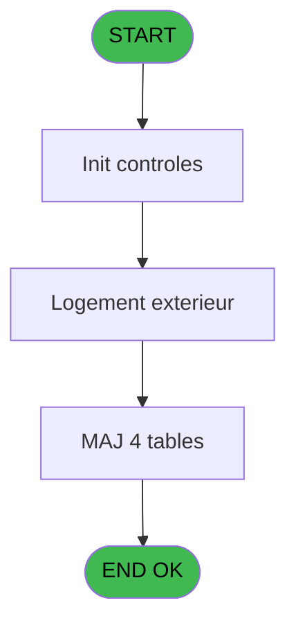
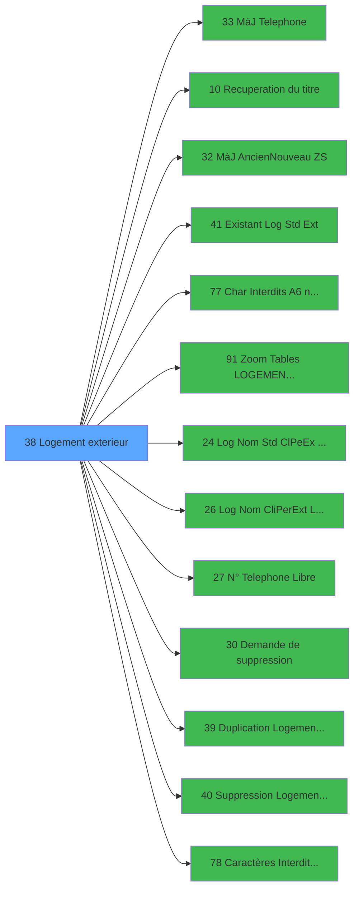

# PBS IDE 38 - Logement exterieur

> **Analyse**: Phases 1-4 2026-02-03 17:12 -> 17:12 (14s) | Assemblage 17:12
> **Pipeline**: V7.2 Enrichi
> **Structure**: 4 onglets (Resume | Ecrans | Donnees | Connexions)

<!-- TAB:Resume -->

## 1. FICHE D'IDENTITE

| Attribut | Valeur |
|----------|--------|
| Projet | PBS |
| IDE Position | 38 |
| Nom Programme | Logement exterieur |
| Fichier source | `Prg_38.xml` |
| Dossier IDE | Logement |
| Taches | 13 (4 ecrans visibles) |
| Tables modifiees | 4 |
| Programmes appeles | 13 |
| :warning: Statut | **ORPHELIN_POTENTIEL** |

## 2. DESCRIPTION FONCTIONNELLE

**Logement exterieur** assure la gestion complete de ce processus.

Le flux de traitement s'organise en **3 blocs fonctionnels** :

- **Traitement** (10 taches) : traitements metier divers
- **Creation** (2 taches) : insertion d'enregistrements en base (mouvements, prestations)
- **Consultation** (1 tache) : ecrans de recherche, selection et consultation

**Donnees modifiees** : 4 tables en ecriture (fichier_menage, logement_complement, logement_exterieurs, tables_village).

Detail : phases du traitement

#### Phase 1 : Traitement (10 taches)

- **38** - Logement exterieur **[[ECRAN]](#ecran-t1)**
- **38.1** - Êcran **[[ECRAN]](#ecran-t2)**
- **38.1.1** - Communicante **[[ECRAN]](#ecran-t3)**
- **38.1.1.2** - MaJ Logemt lie **[[ECRAN]](#ecran-t5)**
- **38.1.1.3** - Suppr. Communiqu.
- **38.1.1.3.1** - Suppr. Liens
- **38.1.3** - MàJ Table VILLAGE
- **38.1.4** - Proximite **[[ECRAN]](#ecran-t11)**
- **38.1.4.1** - Suppr. Proximite
- **38.1.4.1.1** - Suppr. Liens

Delegue a : [MàJ Telephone (IDE 33)](PBS-IDE-33.md), [Recuperation du titre (IDE 10)](PBS-IDE-10.md), [MàJ Ancien/Nouveau (ZS) (IDE 32)](PBS-IDE-32.md), [Existant Log Std (Ext) (IDE 41)](PBS-IDE-41.md), [Char Interdits (A6) no space (IDE 77)](PBS-IDE-77.md), [ Log Nom Std (Cl/Pe/Ex) Libre? (IDE 24)](PBS-IDE-24.md), [ Log Nom (Cli/Per/Ext) Libre ? (IDE 26)](PBS-IDE-26.md), [ N° Telephone Libre ? (IDE 27)](PBS-IDE-27.md), [ Demande de suppression (IDE 30)](PBS-IDE-30.md), [Duplication Logement Exterieur (IDE 39)](PBS-IDE-39.md), [Suppression Logement Exterieur (IDE 40)](PBS-IDE-40.md), [Caractères Interdits (TEL) (IDE 78)](PBS-IDE-78.md)

#### Phase 2 : Creation (2 taches)

- **38.1.1.1** - Creation Lien
- **38.1.4.2** - Creation Lien

#### Phase 3 : Consultation (1 tache)

- **38.1.2** - Rechercher **[[ECRAN]](#ecran-t9)**

Delegue a : [Recuperation du titre (IDE 10)](PBS-IDE-10.md), [Zoom Tables LOGEMENT EXT (IDE 91)](PBS-IDE-91.md)

#### Tables impactees

| Table | Operations | Role metier |
|-------|-----------|-------------|
| logement_complement | **W**/L (9 usages) |  |
| logement_exterieurs | **W**/L (2 usages) |  |
| tables_village | **W** (1 usages) |  |
| fichier_menage | **W** (1 usages) |  |

## 3. BLOCS FONCTIONNELS

### 3.1 Traitement (10 taches)

Traitements internes.

---

#### 38 - Logement exterieur [[ECRAN]](#ecran-t1)

**Role** : Tache d'orchestration : point d'entree du programme (10 sous-taches). Coordonne l'enchainement des traitements.
**Ecran** : 450 x 113 DLU (MDI) | [Voir mockup](#ecran-t1)

9 sous-taches directes

| Tache | Nom | Bloc |
|-------|-----|------|
| [38.1](#t2) | Êcran **[[ECRAN]](#ecran-t2)** | Traitement |
| [38.1.1](#t3) | Communicante **[[ECRAN]](#ecran-t3)** | Traitement |
| [38.1.1.2](#t5) | MaJ Logemt lie **[[ECRAN]](#ecran-t5)** | Traitement |
| [38.1.1.3](#t6) | Suppr. Communiqu. | Traitement |
| [38.1.1.3.1](#t7) | Suppr. Liens | Traitement |
| [38.1.3](#t10) | MàJ Table VILLAGE | Traitement |
| [38.1.4](#t11) | Proximite **[[ECRAN]](#ecran-t11)** | Traitement |
| [38.1.4.1](#t12) | Suppr. Proximite | Traitement |
| [38.1.4.1.1](#t13) | Suppr. Liens | Traitement |

**Variables liees** : I (v.Ancien Logement)
**Delegue a** : [MàJ Telephone (IDE 33)](PBS-IDE-33.md), [Recuperation du titre (IDE 10)](PBS-IDE-10.md), [MàJ Ancien/Nouveau (ZS) (IDE 32)](PBS-IDE-32.md)

---

#### 38.1 - Êcran [[ECRAN]](#ecran-t2)

**Role** : Traitement : Êcran.
**Ecran** : 1261 x 294 DLU (MDI) | [Voir mockup](#ecran-t2)
**Delegue a** : [MàJ Telephone (IDE 33)](PBS-IDE-33.md), [Recuperation du titre (IDE 10)](PBS-IDE-10.md), [MàJ Ancien/Nouveau (ZS) (IDE 32)](PBS-IDE-32.md)

---

#### 38.1.1 - Communicante [[ECRAN]](#ecran-t3)

**Role** : Traitement : Communicante.
**Ecran** : 131 x 75 DLU (Modal) | [Voir mockup](#ecran-t3)
**Delegue a** : [MàJ Telephone (IDE 33)](PBS-IDE-33.md), [Recuperation du titre (IDE 10)](PBS-IDE-10.md), [MàJ Ancien/Nouveau (ZS) (IDE 32)](PBS-IDE-32.md)

---

#### 38.1.1.2 - MaJ Logemt lie [[ECRAN]](#ecran-t5)

**Role** : Traitement : MaJ Logemt lie.
**Ecran** : 158 x 75 DLU (MDI) | [Voir mockup](#ecran-t5)
**Delegue a** : [MàJ Telephone (IDE 33)](PBS-IDE-33.md), [Recuperation du titre (IDE 10)](PBS-IDE-10.md), [MàJ Ancien/Nouveau (ZS) (IDE 32)](PBS-IDE-32.md)

---

#### 38.1.1.3 - Suppr. Communiqu.

**Role** : Traitement : Suppr. Communiqu..
**Delegue a** : [MàJ Telephone (IDE 33)](PBS-IDE-33.md), [Recuperation du titre (IDE 10)](PBS-IDE-10.md), [MàJ Ancien/Nouveau (ZS) (IDE 32)](PBS-IDE-32.md)

---

#### 38.1.1.3.1 - Suppr. Liens

**Role** : Traitement : Suppr. Liens.
**Delegue a** : [MàJ Telephone (IDE 33)](PBS-IDE-33.md), [Recuperation du titre (IDE 10)](PBS-IDE-10.md), [MàJ Ancien/Nouveau (ZS) (IDE 32)](PBS-IDE-32.md)

---

#### 38.1.3 - MàJ Table VILLAGE

**Role** : Traitement : MàJ Table VILLAGE.
**Delegue a** : [MàJ Telephone (IDE 33)](PBS-IDE-33.md), [Recuperation du titre (IDE 10)](PBS-IDE-10.md), [MàJ Ancien/Nouveau (ZS) (IDE 32)](PBS-IDE-32.md)

---

#### 38.1.4 - Proximite [[ECRAN]](#ecran-t11)

**Role** : Traitement : Proximite.
**Ecran** : 134 x 72 DLU (Modal) | [Voir mockup](#ecran-t11)
**Delegue a** : [MàJ Telephone (IDE 33)](PBS-IDE-33.md), [Recuperation du titre (IDE 10)](PBS-IDE-10.md), [MàJ Ancien/Nouveau (ZS) (IDE 32)](PBS-IDE-32.md)

---

#### 38.1.4.1 - Suppr. Proximite

**Role** : Traitement : Suppr. Proximite.
**Delegue a** : [MàJ Telephone (IDE 33)](PBS-IDE-33.md), [Recuperation du titre (IDE 10)](PBS-IDE-10.md), [MàJ Ancien/Nouveau (ZS) (IDE 32)](PBS-IDE-32.md)

---

#### 38.1.4.1.1 - Suppr. Liens

**Role** : Traitement : Suppr. Liens.
**Delegue a** : [MàJ Telephone (IDE 33)](PBS-IDE-33.md), [Recuperation du titre (IDE 10)](PBS-IDE-10.md), [MàJ Ancien/Nouveau (ZS) (IDE 32)](PBS-IDE-32.md)

### 3.2 Creation (2 taches)

Insertion de nouveaux enregistrements en base.

---

#### 38.1.1.1 - Creation Lien

**Role** : Creation d'enregistrement : Creation Lien.

---

#### 38.1.4.2 - Creation Lien

**Role** : Creation d'enregistrement : Creation Lien.

### 3.3 Consultation (1 tache)

Ecrans de recherche et consultation.

---

#### 38.1.2 - Rechercher [[ECRAN]](#ecran-t9)

**Role** : Traitement : Rechercher.
**Ecran** : 413 x 78 DLU (MDI) | [Voir mockup](#ecran-t9)
**Delegue a** : [Zoom Tables LOGEMENT EXT (IDE 91)](PBS-IDE-91.md)

## 5. REGLES METIER

*(Aucune regle metier identifiee)*

## 6. CONTEXTE

- **Appele par**: (aucun)
- **Appelle**: 13 programmes | **Tables**: 4 (W:4 R:0 L:2) | **Taches**: 13 | **Expressions**: 3

<!-- TAB:Ecrans -->

## 8. ECRANS

### 8.1 Forms visibles (4 / 13)

| # | Position | Tache | Nom | Type | Largeur | Hauteur | Bloc |
|---|----------|-------|-----|------|---------|---------|------|
| 1 | 38.1 | 38.1 | Êcran | MDI | 1261 | 294 | Traitement |
| 2 | 38.1.1 | 38.1.1 | Communicante | Modal | 131 | 75 | Traitement |
| 3 | 38.1.2 | 38.1.2 | Rechercher | MDI | 413 | 78 | Consultation |
| 4 | 38.1.4 | 38.1.4 | Proximite | Modal | 134 | 72 | Traitement |

### 8.2 Mockups Ecrans

---

#### 38.1 - Êcran
**Tache** : [38.1](#t2) | **Type** : MDI | **Dimensions** : 1261 x 294 DLU
**Bloc** : Traitement | **Titre IDE** : Êcran

<!-- FORM-DATA:
{
    "width":  1261,
    "vFactor":  8,
    "type":  "MDI",
    "hFactor":  8,
    "controls":  [
                     {
                         "x":  2,
                         "type":  "label",
                         "var":  "",
                         "y":  1,
                         "w":  1255,
                         "fmt":  "",
                         "name":  "",
                         "h":  20,
                         "color":  "",
                         "text":  "",
                         "parent":  null
                     },
                     {
                         "x":  12,
                         "type":  "table",
                         "var":  "",
                         "name":  "",
                         "titleH":  12,
                         "color":  "110",
                         "w":  185,
                         "y":  41,
                         "fmt":  "",
                         "parent":  null,
                         "text":  "",
                         "rowH":  12,
                         "h":  212,
                         "cols":  [
                                      {
                                          "title":  "Nom Standard",
                                          "layer":  1,
                                          "w":  151
                                      }
                                  ],
                         "rows":  1
                     },
                     {
                         "x":  217,
                         "type":  "label",
                         "var":  "",
                         "y":  41,
                         "w":  845,
                         "fmt":  "",
                         "name":  "",
                         "h":  23,
                         "color":  "",
                         "text":  "",
                         "parent":  null
                     },
                     {
                         "x":  1066,
                         "type":  "label",
                         "var":  "",
                         "y":  41,
                         "w":  191,
                         "fmt":  "",
                         "name":  "",
                         "h":  209,
                         "color":  "",
                         "text":  "",
                         "parent":  null
                     },
                     {
                         "x":  18,
                         "type":  "label",
                         "var":  "",
                         "y":  43,
                         "w":  155,
                         "fmt":  "",
                         "name":  "",
                         "h":  8,
                         "color":  "7",
                         "text":  "Nom Standard",
                         "parent":  null
                     },
                     {
                         "x":  242,
                         "type":  "label",
                         "var":  "",
                         "y":  46,
                         "w":  130,
                         "fmt":  "",
                         "name":  "",
                         "h":  12,
                         "color":  "",
                         "text":  "Nom Complet",
                         "parent":  5
                     },
                     {
                         "x":  650,
                         "type":  "label",
                         "var":  "",
                         "y":  46,
                         "w":  75,
                         "fmt":  "",
                         "name":  "",
                         "h":  12,
                         "color":  "",
                         "text":  "N° Poste",
                         "parent":  null
                     },
                     {
                         "x":  218,
                         "type":  "label",
                         "var":  "",
                         "y":  64,
                         "w":  400,
                         "fmt":  "",
                         "name":  "",
                         "h":  95,
                         "color":  "",
                         "text":  "",
                         "parent":  null
                     },
                     {
                         "x":  618,
                         "type":  "label",
                         "var":  "",
                         "y":  64,
                         "w":  303,
                         "fmt":  "",
                         "name":  "",
                         "h":  54,
                         "color":  "",
                         "text":  "",
                         "parent":  null
                     },
                     {
                         "x":  921,
                         "type":  "label",
                         "var":  "",
                         "y":  64,
                         "w":  141,
                         "fmt":  "",
                         "name":  "",
                         "h":  95,
                         "color":  "",
                         "text":  "",
                         "parent":  null
                     },
                     {
                         "x":  933,
                         "type":  "label",
                         "var":  "",
                         "y":  67,
                         "w":  117,
                         "fmt":  "",
                         "name":  "",
                         "h":  8,
                         "color":  "7",
                         "text":  "Communicante",
                         "parent":  16
                     },
                     {
                         "x":  242,
                         "type":  "label",
                         "var":  "",
                         "y":  69,
                         "w":  82,
                         "fmt":  "",
                         "name":  "",
                         "h":  12,
                         "color":  "",
                         "text":  "Ensemble",
                         "parent":  14
                     },
                     {
                         "x":  628,
                         "type":  "label",
                         "var":  "",
                         "y":  69,
                         "w":  72,
                         "fmt":  "",
                         "name":  "",
                         "h":  12,
                         "color":  "",
                         "text":  "Lit Pliant",
                         "parent":  15
                     },
                     {
                         "x":  242,
                         "type":  "label",
                         "var":  "",
                         "y":  84,
                         "w":  126,
                         "fmt":  "",
                         "name":  "",
                         "h":  12,
                         "color":  "",
                         "text":  "Logement",
                         "parent":  14
                     },
                     {
                         "x":  628,
                         "type":  "label",
                         "var":  "",
                         "y":  84,
                         "w":  81,
                         "fmt":  "",
                         "name":  "",
                         "h":  12,
                         "color":  "",
                         "text":  "Lit Bébé",
                         "parent":  15
                     },
                     {
                         "x":  242,
                         "type":  "label",
                         "var":  "",
                         "y":  99,
                         "w":  74,
                         "fmt":  "",
                         "name":  "",
                         "h":  12,
                         "color":  "",
                         "text":  "Bâtiment",
                         "parent":  14
                     },
                     {
                         "x":  628,
                         "type":  "label",
                         "var":  "",
                         "y":  100,
                         "w":  86,
                         "fmt":  "",
                         "name":  "",
                         "h":  12,
                         "color":  "",
                         "text":  "Banquette",
                         "parent":  15
                     },
                     {
                         "x":  242,
                         "type":  "label",
                         "var":  "",
                         "y":  114,
                         "w":  53,
                         "fmt":  "",
                         "name":  "",
                         "h":  12,
                         "color":  "",
                         "text":  "Etage",
                         "parent":  14
                     },
                     {
                         "x":  618,
                         "type":  "label",
                         "var":  "",
                         "y":  118,
                         "w":  303,
                         "fmt":  "",
                         "name":  "",
                         "h":  41,
                         "color":  "",
                         "text":  "",
                         "parent":  null
                     },
                     {
                         "x":  242,
                         "type":  "label",
                         "var":  "",
                         "y":  129,
                         "w":  38,
                         "fmt":  "",
                         "name":  "",
                         "h":  12,
                         "color":  "",
                         "text":  "Vue",
                         "parent":  14
                     },
                     {
                         "x":  628,
                         "type":  "label",
                         "var":  "",
                         "y":  132,
                         "w":  99,
                         "fmt":  "",
                         "name":  "",
                         "h":  12,
                         "color":  "",
                         "text":  "Handicapés",
                         "parent":  null
                     },
                     {
                         "x":  242,
                         "type":  "label",
                         "var":  "",
                         "y":  144,
                         "w":  96,
                         "fmt":  "",
                         "name":  "",
                         "h":  12,
                         "color":  "",
                         "text":  "Occupation",
                         "parent":  14
                     },
                     {
                         "x":  218,
                         "type":  "label",
                         "var":  "",
                         "y":  159,
                         "w":  705,
                         "fmt":  "",
                         "name":  "",
                         "h":  29,
                         "color":  "",
                         "text":  "",
                         "parent":  null
                     },
                     {
                         "x":  921,
                         "type":  "label",
                         "var":  "",
                         "y":  159,
                         "w":  139,
                         "fmt":  "",
                         "name":  "",
                         "h":  91,
                         "color":  "",
                         "text":  "",
                         "parent":  null
                     },
                     {
                         "x":  229,
                         "type":  "label",
                         "var":  "",
                         "y":  161,
                         "w":  690,
                         "fmt":  "",
                         "name":  "",
                         "h":  24,
                         "color":  "195",
                         "text":  "Ménage",
                         "parent":  29
                     },
                     {
                         "x":  936,
                         "type":  "label",
                         "var":  "",
                         "y":  162,
                         "w":  112,
                         "fmt":  "",
                         "name":  "",
                         "h":  8,
                         "color":  "7",
                         "text":  "Proximite",
                         "parent":  30
                     },
                     {
                         "x":  242,
                         "type":  "label",
                         "var":  "",
                         "y":  169,
                         "w":  46,
                         "fmt":  "",
                         "name":  "",
                         "h":  12,
                         "color":  "",
                         "text":  "Zone",
                         "parent":  31
                     },
                     {
                         "x":  615,
                         "type":  "label",
                         "var":  "",
                         "y":  169,
                         "w":  67,
                         "fmt":  "",
                         "name":  "",
                         "h":  12,
                         "color":  "",
                         "text":  "Secteur",
                         "parent":  31
                     },
                     {
                         "x":  1069,
                         "type":  "line",
                         "var":  "",
                         "y":  178,
                         "w":  187,
                         "fmt":  "",
                         "name":  "",
                         "h":  0,
                         "color":  "",
                         "text":  "",
                         "parent":  6
                     },
                     {
                         "x":  218,
                         "type":  "label",
                         "var":  "",
                         "y":  188,
                         "w":  705,
                         "fmt":  "",
                         "name":  "",
                         "h":  62,
                         "color":  "",
                         "text":  "",
                         "parent":  null
                     },
                     {
                         "x":  242,
                         "type":  "label",
                         "var":  "",
                         "y":  192,
                         "w":  114,
                         "fmt":  "",
                         "name":  "",
                         "h":  10,
                         "color":  "",
                         "text":  "N° Téléphone",
                         "parent":  36
                     },
                     {
                         "x":  242,
                         "type":  "label",
                         "var":  "",
                         "y":  204,
                         "w":  102,
                         "fmt":  "",
                         "name":  "",
                         "h":  10,
                         "color":  "",
                         "text":  "Responsable",
                         "parent":  36
                     },
                     {
                         "x":  242,
                         "type":  "label",
                         "var":  "",
                         "y":  215,
                         "w":  114,
                         "fmt":  "",
                         "name":  "",
                         "h":  10,
                         "color":  "",
                         "text":  "Adresse",
                         "parent":  36
                     },
                     {
                         "x":  0,
                         "type":  "label",
                         "var":  "",
                         "y":  268,
                         "w":  1255,
                         "fmt":  "",
                         "name":  "",
                         "h":  24,
                         "color":  "",
                         "text":  "",
                         "parent":  null
                     },
                     {
                         "x":  64,
                         "type":  "edit",
                         "var":  "",
                         "y":  56,
                         "w":  75,
                         "fmt":  "",
                         "name":  "NOM STANDARD",
                         "h":  8,
                         "color":  "110",
                         "text":  "",
                         "parent":  4
                     },
                     {
                         "x":  379,
                         "type":  "edit",
                         "var":  "",
                         "y":  46,
                         "w":  182,
                         "fmt":  "",
                         "name":  "NOM COMPLET",
                         "h":  12,
                         "color":  "110",
                         "text":  "",
                         "parent":  5
                     },
                     {
                         "x":  751,
                         "type":  "edit",
                         "var":  "",
                         "y":  46,
                         "w":  82,
                         "fmt":  "",
                         "name":  "N°POSTE",
                         "h":  12,
                         "color":  "110",
                         "text":  "",
                         "parent":  null
                     },
                     {
                         "x":  861,
                         "type":  "combobox",
                         "var":  "",
                         "y":  46,
                         "w":  157,
                         "fmt":  "",
                         "name":  "STANDING",
                         "h":  12,
                         "color":  "110",
                         "text":  "11,22",
                         "parent":  null
                     },
                     {
                         "x":  379,
                         "type":  "combobox",
                         "var":  "",
                         "y":  71,
                         "w":  216,
                         "fmt":  "",
                         "name":  "ENSEMBLE",
                         "h":  12,
                         "color":  "110",
                         "text":  "111,222",
                         "parent":  14
                     },
                     {
                         "x":  379,
                         "type":  "combobox",
                         "var":  "",
                         "y":  86,
                         "w":  216,
                         "fmt":  "",
                         "name":  "TYPE DE LOGEMENT",
                         "h":  12,
                         "color":  "110",
                         "text":  "11,22",
                         "parent":  14
                     },
                     {
                         "x":  379,
                         "type":  "combobox",
                         "var":  "",
                         "y":  101,
                         "w":  216,
                         "fmt":  "",
                         "name":  "BATIMENT",
                         "h":  12,
                         "color":  "110",
                         "text":  "11,22",
                         "parent":  14
                     },
                     {
                         "x":  379,
                         "type":  "combobox",
                         "var":  "",
                         "y":  115,
                         "w":  216,
                         "fmt":  "",
                         "name":  "ETAGE",
                         "h":  12,
                         "color":  "110",
                         "text":  "11,22,Sous\\-sol",
                         "parent":  14
                     },
                     {
                         "x":  379,
                         "type":  "combobox",
                         "var":  "",
                         "y":  130,
                         "w":  216,
                         "fmt":  "",
                         "name":  "VUE",
                         "h":  12,
                         "color":  "110",
                         "text":  "11,22",
                         "parent":  14
                     },
                     {
                         "x":  379,
                         "type":  "combobox",
                         "var":  "",
                         "y":  144,
                         "w":  216,
                         "fmt":  "",
                         "name":  "v.Occupation Std",
                         "h":  12,
                         "color":  "110",
                         "text":  "11,22",
                         "parent":  14
                     },
                     {
                         "x":  767,
                         "type":  "combobox",
                         "var":  "",
                         "y":  69,
                         "w":  139,
                         "fmt":  "",
                         "name":  "LIT PLIANT",
                         "h":  12,
                         "color":  "110",
                         "text":  "1,2",
                         "parent":  15
                     },
                     {
                         "x":  767,
                         "type":  "combobox",
                         "var":  "",
                         "y":  84,
                         "w":  139,
                         "fmt":  "",
                         "name":  "LIT BEBE",
                         "h":  12,
                         "color":  "110",
                         "text":  "1,2",
                         "parent":  15
                     },
                     {
                         "x":  767,
                         "type":  "combobox",
                         "var":  "",
                         "y":  100,
                         "w":  139,
                         "fmt":  "",
                         "name":  "LIT BANQUETTE",
                         "h":  12,
                         "color":  "110",
                         "text":  "1,2",
                         "parent":  15
                     },
                     {
                         "x":  767,
                         "type":  "combobox",
                         "var":  "",
                         "y":  132,
                         "w":  96,
                         "fmt":  "",
                         "name":  "HANDICAPES",
                         "h":  12,
                         "color":  "110",
                         "text":  "Oui,Non",
                         "parent":  null
                     },
                     {
                         "x":  379,
                         "type":  "combobox",
                         "var":  "",
                         "y":  169,
                         "w":  216,
                         "fmt":  "",
                         "name":  "v.Code Zone Reduit",
                         "h":  12,
                         "color":  "110",
                         "text":  "11,22",
                         "parent":  31
                     },
                     {
                         "x":  690,
                         "type":  "combobox",
                         "var":  "",
                         "y":  169,
                         "w":  216,
                         "fmt":  "",
                         "name":  "v.Code Secteur Reduit",
                         "h":  12,
                         "color":  "110",
                         "text":  "11,22",
                         "parent":  31
                     },
                     {
                         "x":  379,
                         "type":  "edit",
                         "var":  "",
                         "y":  192,
                         "w":  182,
                         "fmt":  "",
                         "name":  "TEL. EXTERIEUR",
                         "h":  10,
                         "color":  "110",
                         "text":  "",
                         "parent":  36
                     },
                     {
                         "x":  379,
                         "type":  "edit",
                         "var":  "",
                         "y":  204,
                         "w":  182,
                         "fmt":  "",
                         "name":  "NOM RESPONSABLE",
                         "h":  10,
                         "color":  "110",
                         "text":  "",
                         "parent":  36
                     },
                     {
                         "x":  379,
                         "type":  "edit",
                         "var":  "",
                         "y":  215,
                         "w":  350,
                         "fmt":  "",
                         "name":  "ADRESSE1",
                         "h":  10,
                         "color":  "110",
                         "text":  "",
                         "parent":  36
                     },
                     {
                         "x":  379,
                         "type":  "edit",
                         "var":  "",
                         "y":  226,
                         "w":  350,
                         "fmt":  "",
                         "name":  "ADRESSE2",
                         "h":  10,
                         "color":  "110",
                         "text":  "",
                         "parent":  36
                     },
                     {
                         "x":  379,
                         "type":  "edit",
                         "var":  "",
                         "y":  237,
                         "w":  350,
                         "fmt":  "",
                         "name":  "ADRESSE3",
                         "h":  10,
                         "color":  "110",
                         "text":  "",
                         "parent":  36
                     },
                     {
                         "x":  8,
                         "type":  "edit",
                         "var":  "",
                         "y":  7,
                         "w":  267,
                         "fmt":  "20",
                         "name":  "",
                         "h":  8,
                         "color":  "",
                         "text":  "",
                         "parent":  null
                     },
                     {
                         "x":  1047,
                         "type":  "edit",
                         "var":  "",
                         "y":  7,
                         "w":  203,
                         "fmt":  "WWW DD MMM YYYYT",
                         "name":  "",
                         "h":  8,
                         "color":  "",
                         "text":  "",
                         "parent":  null
                     },
                     {
                         "x":  1084,
                         "type":  "button",
                         "var":  "",
                         "y":  51,
                         "w":  154,
                         "fmt":  "\u0026Visualisation",
                         "name":  "",
                         "h":  18,
                         "color":  "",
                         "text":  "",
                         "parent":  6
                     },
                     {
                         "x":  1084,
                         "type":  "button",
                         "var":  "",
                         "y":  75,
                         "w":  154,
                         "fmt":  "\u0026Modification",
                         "name":  "",
                         "h":  18,
                         "color":  "",
                         "text":  "",
                         "parent":  6
                     },
                     {
                         "x":  1084,
                         "type":  "button",
                         "var":  "",
                         "y":  99,
                         "w":  154,
                         "fmt":  "\u0026Creation",
                         "name":  "Création",
                         "h":  18,
                         "color":  "",
                         "text":  "",
                         "parent":  6
                     },
                     {
                         "x":  1084,
                         "type":  "button",
                         "var":  "",
                         "y":  123,
                         "w":  154,
                         "fmt":  "\u0026Annulation",
                         "name":  "",
                         "h":  18,
                         "color":  "",
                         "text":  "",
                         "parent":  6
                     },
                     {
                         "x":  1084,
                         "type":  "button",
                         "var":  "",
                         "y":  147,
                         "w":  154,
                         "fmt":  "\u0026Suppression",
                         "name":  "",
                         "h":  18,
                         "color":  "",
                         "text":  "",
                         "parent":  6
                     },
                     {
                         "x":  1084,
                         "type":  "button",
                         "var":  "",
                         "y":  191,
                         "w":  154,
                         "fmt":  "C\u0026ommunicante",
                         "name":  "",
                         "h":  18,
                         "color":  "",
                         "text":  "",
                         "parent":  6
                     },
                     {
                         "x":  1084,
                         "type":  "button",
                         "var":  "",
                         "y":  220,
                         "w":  154,
                         "fmt":  "\u0026Proximité",
                         "name":  "",
                         "h":  18,
                         "color":  "",
                         "text":  "",
                         "parent":  6
                     },
                     {
                         "x":  6,
                         "type":  "button",
                         "var":  "",
                         "y":  271,
                         "w":  154,
                         "fmt":  "\u0026Quitter",
                         "name":  "",
                         "h":  18,
                         "color":  "",
                         "text":  "",
                         "parent":  45
                     },
                     {
                         "x":  927,
                         "type":  "button",
                         "var":  "",
                         "y":  271,
                         "w":  154,
                         "fmt":  "\u0026Rechercher",
                         "name":  "",
                         "h":  18,
                         "color":  "",
                         "text":  "",
                         "parent":  45
                     },
                     {
                         "x":  1093,
                         "type":  "button",
                         "var":  "",
                         "y":  271,
                         "w":  154,
                         "fmt":  "\u0026Dupliquer",
                         "name":  "",
                         "h":  18,
                         "color":  "",
                         "text":  "",
                         "parent":  45
                     }
                 ],
    "taskId":  "38.1",
    "height":  294
}
-->

<strong>Champs : 23 champs</strong>

| Pos (x,y) | Nom | Variable | Type |
|-----------|-----|----------|------|
| 64,56 | NOM STANDARD | - | edit |
| 379,46 | NOM COMPLET | - | edit |
| 751,46 | N°POSTE | - | edit |
| 861,46 | STANDING | - | combobox |
| 379,71 | ENSEMBLE | - | combobox |
| 379,86 | TYPE DE LOGEMENT | - | combobox |
| 379,101 | BATIMENT | - | combobox |
| 379,115 | ETAGE | - | combobox |
| 379,130 | VUE | - | combobox |
| 379,144 | v.Occupation Std | - | combobox |
| 767,69 | LIT PLIANT | - | combobox |
| 767,84 | LIT BEBE | - | combobox |
| 767,100 | LIT BANQUETTE | - | combobox |
| 767,132 | HANDICAPES | - | combobox |
| 379,169 | v.Code Zone Reduit | - | combobox |
| 690,169 | v.Code Secteur Reduit | - | combobox |
| 379,192 | TEL. EXTERIEUR | - | edit |
| 379,204 | NOM RESPONSABLE | - | edit |
| 379,215 | ADRESSE1 | - | edit |
| 379,226 | ADRESSE2 | - | edit |
| 379,237 | ADRESSE3 | - | edit |
| 8,7 | 20 | - | edit |
| 1047,7 | WWW DD MMM YYYYT | - | edit |

<strong>Boutons : 10 boutons</strong>

| Bouton | Pos (x,y) | Action |
|--------|-----------|--------|
| Visualisation | 1084,51 | Bouton fonctionnel |
| Modification | 1084,75 | Modifie l'element |
| Creation | 1084,99 | Bouton fonctionnel |
| Annulation | 1084,123 | Annule et retour au menu |
| Suppression | 1084,147 | Appel [ Demande de suppression (IDE 30)](PBS-IDE-30.md) |
| Communicante | 1084,191 | Bouton fonctionnel |
| Proximité | 1084,220 | Bouton fonctionnel |
| Quitter | 6,271 | Quitte le programme |
| Rechercher | 927,271 | Ouvre la selection |
| Dupliquer | 1093,271 | Appel [Duplication Logement Exterieur (IDE 39)](PBS-IDE-39.md) |

---

#### 38.1.1 - Communicante
**Tache** : [38.1.1](#t3) | **Type** : Modal | **Dimensions** : 131 x 75 DLU
**Bloc** : Traitement | **Titre IDE** : Communicante

<!-- FORM-DATA:
{
    "width":  131,
    "vFactor":  8,
    "type":  "Modal",
    "hFactor":  8,
    "controls":  [
                     {
                         "x":  0,
                         "type":  "table",
                         "var":  "",
                         "name":  "",
                         "titleH":  12,
                         "color":  "110",
                         "w":  131,
                         "y":  0,
                         "fmt":  "",
                         "parent":  null,
                         "text":  "",
                         "rowH":  14,
                         "h":  73,
                         "cols":  [
                                      {
                                          "title":  "",
                                          "layer":  1,
                                          "w":  122
                                      }
                                  ],
                         "rows":  1
                     },
                     {
                         "x":  11,
                         "type":  "edit",
                         "var":  "",
                         "y":  4,
                         "w":  75,
                         "fmt":  "",
                         "name":  "LIBELLE COMPLEMENT",
                         "h":  8,
                         "color":  "110",
                         "text":  "",
                         "parent":  1
                     },
                     {
                         "x":  89,
                         "type":  "button",
                         "var":  "",
                         "y":  3,
                         "w":  25,
                         "fmt":  "",
                         "name":  "v.Bouton Zoom",
                         "h":  10,
                         "color":  "",
                         "text":  "",
                         "parent":  1
                     }
                 ],
    "taskId":  "38.1.1",
    "height":  75
}
-->

<strong>Champs : 1 champs</strong>

| Pos (x,y) | Nom | Variable | Type |
|-----------|-----|----------|------|
| 11,4 | LIBELLE COMPLEMENT | - | edit |

<strong>Boutons : 1 boutons</strong>

| Bouton | Pos (x,y) | Action |
|--------|-----------|--------|
| v.Bouton Zoom | 89,3 | Ouvre la selection |

---

#### 38.1.2 - Rechercher
**Tache** : [38.1.2](#t9) | **Type** : MDI | **Dimensions** : 413 x 78 DLU
**Bloc** : Consultation | **Titre IDE** : Rechercher

<!-- FORM-DATA:
{
    "width":  413,
    "vFactor":  8,
    "type":  "MDI",
    "hFactor":  8,
    "controls":  [
                     {
                         "x":  3,
                         "type":  "label",
                         "var":  "",
                         "y":  5,
                         "w":  401,
                         "fmt":  "",
                         "name":  "",
                         "h":  39,
                         "color":  "",
                         "text":  "",
                         "parent":  null
                     },
                     {
                         "x":  35,
                         "type":  "label",
                         "var":  "",
                         "y":  13,
                         "w":  224,
                         "fmt":  "",
                         "name":  "",
                         "h":  8,
                         "color":  "",
                         "text":  "Entrez votre commande",
                         "parent":  1
                     },
                     {
                         "x":  0,
                         "type":  "label",
                         "var":  "",
                         "y":  51,
                         "w":  408,
                         "fmt":  "",
                         "name":  "",
                         "h":  24,
                         "color":  "",
                         "text":  "",
                         "parent":  null
                     },
                     {
                         "x":  88,
                         "type":  "edit",
                         "var":  "",
                         "y":  26,
                         "w":  82,
                         "fmt":  "",
                         "name":  "",
                         "h":  10,
                         "color":  "110",
                         "text":  "",
                         "parent":  1
                     },
                     {
                         "x":  14,
                         "type":  "button",
                         "var":  "",
                         "y":  55,
                         "w":  154,
                         "fmt":  "",
                         "name":  "",
                         "h":  18,
                         "color":  "",
                         "text":  "",
                         "parent":  null
                     },
                     {
                         "x":  245,
                         "type":  "button",
                         "var":  "",
                         "y":  54,
                         "w":  154,
                         "fmt":  "\u0026Abandonner",
                         "name":  "",
                         "h":  18,
                         "color":  "",
                         "text":  "",
                         "parent":  null
                     },
                     {
                         "x":  291,
                         "type":  "image",
                         "var":  "",
                         "y":  8,
                         "w":  92,
                         "fmt":  "",
                         "name":  "",
                         "h":  34,
                         "color":  "",
                         "text":  "",
                         "parent":  1
                     }
                 ],
    "taskId":  "38.1.2",
    "height":  78
}
-->

<strong>Champs : 1 champs</strong>

| Pos (x,y) | Nom | Variable | Type |
|-----------|-----|----------|------|
| 88,26 | (sans nom) | - | edit |

<strong>Boutons : 2 boutons</strong>

| Bouton | Pos (x,y) | Action |
|--------|-----------|--------|
| (sans nom) | 14,55 | Action declenchee |
| Abandonner | 245,54 | Annule et retour au menu |

---

#### 38.1.4 - Proximite
**Tache** : [38.1.4](#t11) | **Type** : Modal | **Dimensions** : 134 x 72 DLU
**Bloc** : Traitement | **Titre IDE** : Proximite

<!-- FORM-DATA:
{
    "width":  134,
    "vFactor":  8,
    "type":  "Modal",
    "hFactor":  8,
    "controls":  [
                     {
                         "x":  0,
                         "type":  "table",
                         "var":  "",
                         "name":  "",
                         "titleH":  12,
                         "color":  "110",
                         "w":  130,
                         "y":  0,
                         "fmt":  "",
                         "parent":  null,
                         "text":  "",
                         "rowH":  14,
                         "h":  71,
                         "cols":  [
                                      {
                                          "title":  "",
                                          "layer":  1,
                                          "w":  120
                                      }
                                  ],
                         "rows":  1
                     },
                     {
                         "x":  8,
                         "type":  "edit",
                         "var":  "",
                         "y":  3,
                         "w":  75,
                         "fmt":  "",
                         "name":  "LIBELLE COMPLEMENT",
                         "h":  8,
                         "color":  "110",
                         "text":  "",
                         "parent":  1
                     },
                     {
                         "x":  86,
                         "type":  "button",
                         "var":  "",
                         "y":  3,
                         "w":  25,
                         "fmt":  "",
                         "name":  "v.Bouton Zoom",
                         "h":  10,
                         "color":  "",
                         "text":  "",
                         "parent":  1
                     }
                 ],
    "taskId":  "38.1.4",
    "height":  72
}
-->

<strong>Champs : 1 champs</strong>

| Pos (x,y) | Nom | Variable | Type |
|-----------|-----|----------|------|
| 8,3 | LIBELLE COMPLEMENT | - | edit |

<strong>Boutons : 1 boutons</strong>

| Bouton | Pos (x,y) | Action |
|--------|-----------|--------|
| v.Bouton Zoom | 86,3 | Ouvre la selection |

## 9. NAVIGATION

### 9.1 Enchainement des ecrans

```mermaid
flowchart TD
    START([Entree])
    style START fill:#3fb950
    VF2[38.1 Êcran]
    style VF2 fill:#58a6ff
    VF3[38.1.1 Communicante]
    style VF3 fill:#58a6ff
    VF9[38.1.2 Rechercher]
    style VF9 fill:#58a6ff
    VF11[38.1.4 Proximite]
    style VF11 fill:#58a6ff
    EXT33[IDE 33 MàJ Telephone]
    style EXT33 fill:#3fb950
    EXT10[IDE 10 Recuperation du...]
    style EXT10 fill:#3fb950
    EXT32[IDE 32 MàJ AncienNouve...]
    style EXT32 fill:#3fb950
    EXT41[IDE 41 Existant Log St...]
    style EXT41 fill:#3fb950
    EXT77[IDE 77 Char Interdits ...]
    style EXT77 fill:#3fb950
    EXT91[IDE 91 Zoom Tables LOG...]
    style EXT91 fill:#3fb950
    EXT24[IDE 24 Log Nom Std ClP...]
    style EXT24 fill:#3fb950
    EXT26[IDE 26 Log Nom CliPerE...]
    style EXT26 fill:#3fb950
    EXT27[IDE 27 N° Telephone Libre]
    style EXT27 fill:#3fb950
    EXT30[IDE 30 Demande de supp...]
    style EXT30 fill:#3fb950
    EXT39[IDE 39 Duplication Log...]
    style EXT39 fill:#3fb950
    EXT40[IDE 40 Suppression Log...]
    style EXT40 fill:#3fb950
    EXT78[IDE 78 Caractères Inte...]
    style EXT78 fill:#3fb950
    FIN([Sortie])
    style FIN fill:#f85149
    START --> VF2
    VF2 -->|Sous-programme| EXT33
    VF2 -->|Recuperation donnees| EXT10
    VF2 -->|Sous-programme| EXT32
    VF2 -->|Sous-programme| EXT41
    VF2 -->|Validation saisie| EXT77
    VF2 -->|Selection/consultation| EXT91
    VF2 -->|Sous-programme| EXT24
    VF2 -->|Sous-programme| EXT26
    EXT78 --> FIN
```

**Detail par enchainement :**

| Depuis | Action | Vers | Retour |
|--------|--------|------|--------|
| Êcran | Sous-programme | [MàJ Telephone (IDE 33)](PBS-IDE-33.md) | Retour ecran |
| Êcran | Recuperation donnees | [Recuperation du titre (IDE 10)](PBS-IDE-10.md) | Retour ecran |
| Êcran | Sous-programme | [MàJ Ancien/Nouveau (ZS) (IDE 32)](PBS-IDE-32.md) | Retour ecran |
| Êcran | Sous-programme | [Existant Log Std (Ext) (IDE 41)](PBS-IDE-41.md) | Retour ecran |
| Êcran | Validation saisie | [Char Interdits (A6) no space (IDE 77)](PBS-IDE-77.md) | Retour ecran |
| Êcran | Selection/consultation | [Zoom Tables LOGEMENT EXT (IDE 91)](PBS-IDE-91.md) | Retour ecran |
| Êcran | Sous-programme | [ Log Nom Std (Cl/Pe/Ex) Libre? (IDE 24)](PBS-IDE-24.md) | Retour ecran |
| Êcran | Sous-programme | [ Log Nom (Cli/Per/Ext) Libre ? (IDE 26)](PBS-IDE-26.md) | Retour ecran |
| Êcran | Sous-programme | [ N° Telephone Libre ? (IDE 27)](PBS-IDE-27.md) | Retour ecran |
| Êcran | Sous-programme | [ Demande de suppression (IDE 30)](PBS-IDE-30.md) | Retour ecran |
| Êcran | Sous-programme | [Duplication Logement Exterieur (IDE 39)](PBS-IDE-39.md) | Retour ecran |
| Êcran | Sous-programme | [Suppression Logement Exterieur (IDE 40)](PBS-IDE-40.md) | Retour ecran |
| Êcran | Validation saisie | [Caractères Interdits (TEL) (IDE 78)](PBS-IDE-78.md) | Retour ecran |

### 9.3 Structure hierarchique (13 taches)

| Position | Tache | Type | Dimensions | Bloc |
|----------|-------|------|------------|------|
| **38.1** | [**Logement exterieur** (38)](#t1) [mockup](#ecran-t1) | MDI | 450x113 | Traitement |
| 38.1.1 | [Êcran (38.1)](#t2) [mockup](#ecran-t2) | MDI | 1261x294 | |
| 38.1.2 | [Communicante (38.1.1)](#t3) [mockup](#ecran-t3) | Modal | 131x75 | |
| 38.1.3 | [MaJ Logemt lie (38.1.1.2)](#t5) [mockup](#ecran-t5) | MDI | 158x75 | |
| 38.1.4 | [Suppr. Communiqu. (38.1.1.3)](#t6) | MDI | - | |
| 38.1.5 | [Suppr. Liens (38.1.1.3.1)](#t7) | MDI | - | |
| 38.1.6 | [MàJ Table VILLAGE (38.1.3)](#t10) | MDI | - | |
| 38.1.7 | [Proximite (38.1.4)](#t11) [mockup](#ecran-t11) | Modal | 134x72 | |
| 38.1.8 | [Suppr. Proximite (38.1.4.1)](#t12) | MDI | - | |
| 38.1.9 | [Suppr. Liens (38.1.4.1.1)](#t13) | MDI | - | |
| **38.2** | [**Creation Lien** (38.1.1.1)](#t4) | MDI | - | Creation |
| 38.2.1 | [Creation Lien (38.1.4.2)](#t14) | MDI | - | |
| **38.3** | [**Rechercher** (38.1.2)](#t9) [mockup](#ecran-t9) | MDI | 413x78 | Consultation |

### 9.4 Algorigramme

> **Legende**: Vert = START/END OK | Rouge = END KO | Bleu = Decisions
> *Algorigramme auto-genere. Utiliser `/algorigramme` pour une synthese metier detaillee.*

<!-- TAB:Donnees -->

## 10. TABLES

### Tables utilisees (4)

| ID | Nom | Description | Type | R | W | L | Usages |
|----|-----|-------------|------|---|---|---|--------|
| 104 | fichier_menage |  | DB |   | **W** |   | 1 |
| 105 | logement_complement |  | DB |   | **W** | L | 9 |
| 106 | logement_exterieurs |  | DB |   | **W** | L | 2 |
| 113 | tables_village |  | DB |   | **W** |   | 1 |

### Colonnes par table (4 / 4 tables avec colonnes identifiees)

Table 104 - fichier_menage (**W**) - 1 usages

| Lettre | Variable | Acces | Type |
|--------|----------|-------|------|
| A | > societe | W | Alpha |
| B | v. quitte tache | W | Logical |
| C | v.contrôle1 | W | Logical |
| D | v.contrôle2 | W | Logical |
| E | v.nombre de lieu de sejour | W | Numeric |
| F | v.Reponse | W | Logical |
| G | v.Ancien N° Telephone | W | Alpha |
| H | v.Ancien Ensemble | W | Alpha |
| I | v.Ancien Logement | W | Alpha |
| J | v.Ancien Batiment | W | Alpha |
| K | v.Ancienne Vue | W | Alpha |
| L | v.Occupation Std | W | Alpha |
| M | v.Ancienne Zone Menage | W | Alpha |
| N | v.Code Zone Reduit | W | Alpha |
| O | v.Ancien Secteur Menage | W | Alpha |
| P | v.Code Secteur Reduit | W | Alpha |

Table 105 - logement_complement (**W**/L) - 9 usages

| Lettre | Variable | Acces | Type |
|--------|----------|-------|------|
| A | v.controle | W | Logical |
| B | v.Reponse | W | Numeric |
| C | v.Bouton Zoom | W | Alpha |

Table 106 - logement_exterieurs (**W**/L) - 2 usages

| Lettre | Variable | Acces | Type |
|--------|----------|-------|------|
| B | v.Code Logement sav | W | Alpha |
| C | v.Code Logement lie | W | Alpha |
| I | v.Ancien Logement | W | Alpha |

Table 113 - tables_village (**W**) - 1 usages

| Lettre | Variable | Acces | Type |
|--------|----------|-------|------|
| A | > Ancien code | W | Alpha |
| B | > Table | W | Alpha |
| C | > Operateur | W | Alpha |

## 11. VARIABLES

### 11.1 Variables de session (16)

Variables persistantes pendant toute la session.

| Lettre | Nom | Type | Usage dans |
|--------|-----|------|-----------|
| A | v. flag type action | Alpha | 2x session |
| B | v. code nom standard | Alpha | - |
| C | v.Recherche | Alpha | - |
| D | v. titre | Alpha | - |
| E | v.nombre de lieu de sejour | Numeric | - |
| F | v.Reponse | Logical | - |
| G | v.Ancien N° Telephone | Alpha | - |
| H | v.Ancien Ensemble | Alpha | - |
| I | v.Ancien Logement | Alpha | - |
| J | v.Ancien Batiment | Alpha | - |
| K | v.Ancienne Vue | Alpha | - |
| L | v.Occupation Std | Alpha | - |
| M | v.Ancienne Zone Menage | Alpha | - |
| N | v.Code Zone Reduit | Alpha | - |
| O | v.Ancien Secteur Menage | Alpha | - |
| P | v.Code Secteur Reduit | Alpha | - |

Toutes les 16 variables (liste complete)

| Cat | Lettre | Nom Variable | Type |
|-----|--------|--------------|------|
| V. | **A** | v. flag type action | Alpha |
| V. | **B** | v. code nom standard | Alpha |
| V. | **C** | v.Recherche | Alpha |
| V. | **D** | v. titre | Alpha |
| V. | **E** | v.nombre de lieu de sejour | Numeric |
| V. | **F** | v.Reponse | Logical |
| V. | **G** | v.Ancien N° Telephone | Alpha |
| V. | **H** | v.Ancien Ensemble | Alpha |
| V. | **I** | v.Ancien Logement | Alpha |
| V. | **J** | v.Ancien Batiment | Alpha |
| V. | **K** | v.Ancienne Vue | Alpha |
| V. | **L** | v.Occupation Std | Alpha |
| V. | **M** | v.Ancienne Zone Menage | Alpha |
| V. | **N** | v.Code Zone Reduit | Alpha |
| V. | **O** | v.Ancien Secteur Menage | Alpha |
| V. | **P** | v.Code Secteur Reduit | Alpha |

## 12. EXPRESSIONS

**3 / 3 expressions decodees (100%)**

### 12.1 Repartition par type

| Type | Expressions | Regles |
|------|-------------|--------|
| CONSTANTE | 1 | 0 |
| CONDITION | 2 | 0 |

### 12.2 Expressions cles par type

#### CONSTANTE (1 expressions)

| Type | IDE | Expression | Regle |
|------|-----|------------|-------|
| CONSTANTE | 1 | `''` | - |

#### CONDITION (2 expressions)

| Type | IDE | Expression | Regle |
|------|-----|------------|-------|
| CONDITION | 3 | `v. flag type action [A]='S'` | - |
| CONDITION | 2 | `v. flag type action [A]=''` | - |

<!-- TAB:Connexions -->

## 13. GRAPHE D'APPELS

### 13.1 Chaine depuis Main (Callers)

**Chemin**: (pas de callers directs)

### 13.2 Callers

| IDE | Nom Programme | Nb Appels |
|-----|---------------|-----------|
| - | (aucun) | - |

### 13.3 Callees (programmes appeles)

### 13.4 Detail Callees avec contexte

| IDE | Nom Programme | Appels | Contexte |
|-----|---------------|--------|----------|
| [33](PBS-IDE-33.md) | MàJ Telephone | 3 | Sous-programme |
| [10](PBS-IDE-10.md) | Recuperation du titre | 2 | Recuperation donnees |
| [32](PBS-IDE-32.md) | MàJ Ancien/Nouveau (ZS) | 2 | Sous-programme |
| [41](PBS-IDE-41.md) | Existant Log Std (Ext) | 2 | Sous-programme |
| [77](PBS-IDE-77.md) | Char Interdits (A6) no space | 2 | Validation saisie |
| [91](PBS-IDE-91.md) | Zoom Tables LOGEMENT EXT | 2 | Selection/consultation |
| [24](PBS-IDE-24.md) |  Log Nom Std (Cl/Pe/Ex) Libre? | 1 | Sous-programme |
| [26](PBS-IDE-26.md) |  Log Nom (Cli/Per/Ext) Libre ? | 1 | Sous-programme |
| [27](PBS-IDE-27.md) |  N° Telephone Libre ? | 1 | Sous-programme |
| [30](PBS-IDE-30.md) |  Demande de suppression | 1 | Sous-programme |
| [39](PBS-IDE-39.md) | Duplication Logement Exterieur | 1 | Sous-programme |
| [40](PBS-IDE-40.md) | Suppression Logement Exterieur | 1 | Sous-programme |
| [78](PBS-IDE-78.md) | Caractères Interdits (TEL) | 1 | Validation saisie |

## 14. RECOMMANDATIONS MIGRATION

### 14.1 Profil du programme

| Metrique | Valeur | Impact migration |
|----------|--------|-----------------|
| Lignes de logique | 385 | Taille moyenne |
| Expressions | 3 | Peu de logique |
| Tables WRITE | 4 | Impact modere |
| Sous-programmes | 13 | Forte dependance |
| Ecrans visibles | 4 | Quelques ecrans |
| Code desactive | 0% (0 / 385) | Code sain |
| Regles metier | 0 | Pas de regle identifiee |

### 14.2 Plan de migration par bloc

#### Traitement (10 taches: 5 ecrans, 5 traitements)

- **Strategie** : Orchestrateur avec 5 ecrans (Razor/React) et 5 traitements backend (services).
- Les ecrans deviennent des composants UI, les traitements invisibles deviennent des services injectables.
- 13 sous-programme(s) a migrer ou a reutiliser depuis les services existants.
- Decomposer les taches en services unitaires testables.

#### Creation (2 taches: 0 ecran, 2 traitements)

- **Strategie** : Repository pattern avec Entity Framework Core.
- Insertion via `IRepository<T>.CreateAsync()`

#### Consultation (1 tache: 1 ecran, 0 traitement)

- **Strategie** : Composants de recherche/selection en modales.
- 1 ecran : Rechercher

### 14.3 Dependances critiques

| Dependance | Type | Appels | Impact |
|------------|------|--------|--------|
| fichier_menage | Table WRITE (Database) | 1x | Schema + repository |
| logement_complement | Table WRITE (Database) | 8x | Schema + repository |
| logement_exterieurs | Table WRITE (Database) | 1x | Schema + repository |
| tables_village | Table WRITE (Database) | 1x | Schema + repository |
| [MàJ Telephone (IDE 33)](PBS-IDE-33.md) | Sous-programme | 3x | **CRITIQUE** - Sous-programme |
| [Char Interdits (A6) no space (IDE 77)](PBS-IDE-77.md) | Sous-programme | 2x | Haute - Validation saisie |
| [Zoom Tables LOGEMENT EXT (IDE 91)](PBS-IDE-91.md) | Sous-programme | 2x | Haute - Selection/consultation |
| [Existant Log Std (Ext) (IDE 41)](PBS-IDE-41.md) | Sous-programme | 2x | Haute - Sous-programme |
| [Recuperation du titre (IDE 10)](PBS-IDE-10.md) | Sous-programme | 2x | Haute - Recuperation donnees |
| [MàJ Ancien/Nouveau (ZS) (IDE 32)](PBS-IDE-32.md) | Sous-programme | 2x | Haute - Sous-programme |
| [Duplication Logement Exterieur (IDE 39)](PBS-IDE-39.md) | Sous-programme | 1x | Normale - Sous-programme |
| [Suppression Logement Exterieur (IDE 40)](PBS-IDE-40.md) | Sous-programme | 1x | Normale - Sous-programme |
| [Caractères Interdits (TEL) (IDE 78)](PBS-IDE-78.md) | Sous-programme | 1x | Normale - Validation saisie |
| [ Demande de suppression (IDE 30)](PBS-IDE-30.md) | Sous-programme | 1x | Normale - Sous-programme |

---
*Spec DETAILED generee par Pipeline V7.2 - 2026-02-03 17:12*
