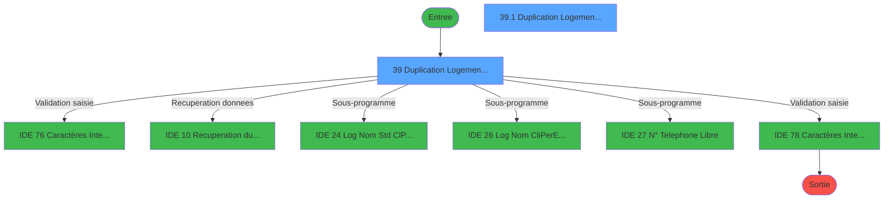
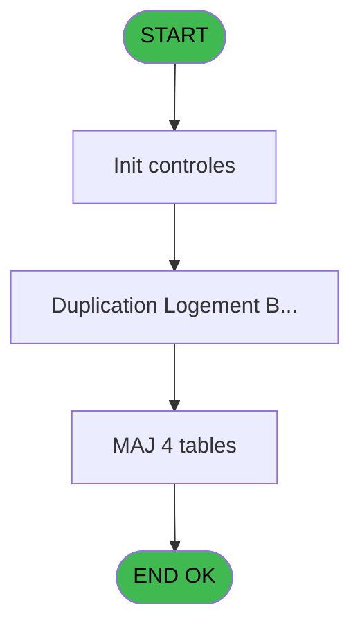
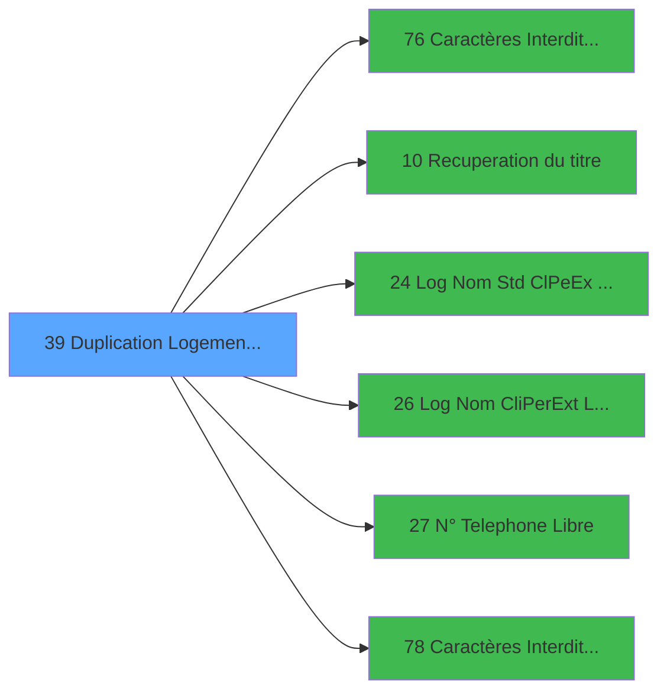

# PBS IDE 39 - Duplication Logement Exterieur

> **Analyse**: Phases 1-4 2026-02-03 17:13 -> 17:13 (13s) | Assemblage 17:13
> **Pipeline**: V7.2 Enrichi
> **Structure**: 4 onglets (Resume | Ecrans | Donnees | Connexions)

<!-- TAB:Resume -->

## 1. FICHE D'IDENTITE

| Attribut | Valeur |
|----------|--------|
| Projet | PBS |
| IDE Position | 39 |
| Nom Programme | Duplication Logement Exterieur |
| Fichier source | `Prg_39.xml` |
| Dossier IDE | Logement |
| Taches | 6 (2 ecrans visibles) |
| Tables modifiees | 4 |
| Programmes appeles | 6 |

## 2. DESCRIPTION FONCTIONNELLE

**Duplication Logement Exterieur** assure la gestion complete de ce processus, accessible depuis [Logement exterieur (IDE 38)](PBS-IDE-38.md).

Le flux de traitement s'organise en **2 blocs fonctionnels** :

- **Creation** (3 taches) : insertion d'enregistrements en base (mouvements, prestations)
- **Traitement** (3 taches) : traitements metier divers

**Donnees modifiees** : 4 tables en ecriture (fichier_menage, logement_exterieurs, logement_zone_menage, nb_code__poste).

Detail : phases du traitement

#### Phase 1 : Traitement (3 taches)

- **39** - Duplication Logement Exterieur **[[ECRAN]](#ecran-t1)**
- **39.1** - Duplication Logement Batch **[[ECRAN]](#ecran-t2)**
- **39.1.2.1** - Incrementations Tables

Delegue a : [Caractères Interdits (A6) (IDE 76)](PBS-IDE-76.md), [Recuperation du titre (IDE 10)](PBS-IDE-10.md), [ Log Nom Std (Cl/Pe/Ex) Libre? (IDE 24)](PBS-IDE-24.md), [ Log Nom (Cli/Per/Ext) Libre ? (IDE 26)](PBS-IDE-26.md), [ N° Telephone Libre ? (IDE 27)](PBS-IDE-27.md), [Caractères Interdits (TEL) (IDE 78)](PBS-IDE-78.md)

#### Phase 2 : Creation (3 taches)

- **39.1.1** - Creation Nouveau Logement **[[ECRAN]](#ecran-t3)**
- **39.1.2** - Creation Menage
- **39.1.3** - Creation Telephone

#### Tables impactees

| Table | Operations | Role metier |
|-------|-----------|-------------|
| logement_exterieurs | **W**/L (2 usages) |  |
| fichier_menage | **W** (2 usages) |  |
| nb_code__poste | **W** (1 usages) |  |
| logement_zone_menage | **W** (1 usages) |  |

## 3. BLOCS FONCTIONNELS

### 3.1 Traitement (3 taches)

Traitements internes.

---

#### 39 - Duplication Logement Exterieur [[ECRAN]](#ecran-t1)

**Role** : Traitement : Duplication Logement Exterieur.
**Ecran** : 526 x 119 DLU (MDI) | [Voir mockup](#ecran-t1)
**Delegue a** : [Caractères Interdits (A6) (IDE 76)](PBS-IDE-76.md), [Recuperation du titre (IDE 10)](PBS-IDE-10.md), [ Log Nom Std (Cl/Pe/Ex) Libre? (IDE 24)](PBS-IDE-24.md)

---

#### 39.1 - Duplication Logement Batch [[ECRAN]](#ecran-t2)

**Role** : Traitement : Duplication Logement Batch.
**Ecran** : 424 x 56 DLU (MDI) | [Voir mockup](#ecran-t2)
**Delegue a** : [Caractères Interdits (A6) (IDE 76)](PBS-IDE-76.md), [Recuperation du titre (IDE 10)](PBS-IDE-10.md), [ Log Nom Std (Cl/Pe/Ex) Libre? (IDE 24)](PBS-IDE-24.md)

---

#### 39.1.2.1 - Incrementations Tables

**Role** : Traitement : Incrementations Tables.
**Delegue a** : [Caractères Interdits (A6) (IDE 76)](PBS-IDE-76.md), [Recuperation du titre (IDE 10)](PBS-IDE-10.md), [ Log Nom Std (Cl/Pe/Ex) Libre? (IDE 24)](PBS-IDE-24.md)

### 3.2 Creation (3 taches)

Insertion de nouveaux enregistrements en base.

---

#### 39.1.1 - Creation Nouveau Logement [[ECRAN]](#ecran-t3)

**Role** : Creation d'enregistrement : Creation Nouveau Logement.
**Ecran** : 821 x 181 DLU (MDI) | [Voir mockup](#ecran-t3)

---

#### 39.1.2 - Creation Menage

**Role** : Creation d'enregistrement : Creation Menage.

---

#### 39.1.3 - Creation Telephone

**Role** : Creation d'enregistrement : Creation Telephone.

## 5. REGLES METIER

*(Aucune regle metier identifiee)*

## 6. CONTEXTE

- **Appele par**: [Logement exterieur (IDE 38)](PBS-IDE-38.md)
- **Appelle**: 6 programmes | **Tables**: 4 (W:4 R:0 L:1) | **Taches**: 6 | **Expressions**: 13

<!-- TAB:Ecrans -->

## 8. ECRANS

### 8.1 Forms visibles (2 / 6)

| # | Position | Tache | Nom | Type | Largeur | Hauteur | Bloc |
|---|----------|-------|-----|------|---------|---------|------|
| 1 | 39 | 39 | Duplication Logement Exterieur | MDI | 526 | 119 | Traitement |
| 2 | 39.1 | 39.1 | Duplication Logement Batch | MDI | 424 | 56 | Traitement |

### 8.2 Mockups Ecrans

---

#### 39 - Duplication Logement Exterieur
**Tache** : [39](#t1) | **Type** : MDI | **Dimensions** : 526 x 119 DLU
**Bloc** : Traitement | **Titre IDE** : Duplication Logement Exterieur

<!-- FORM-DATA:
{
    "width":  526,
    "vFactor":  8,
    "type":  "MDI",
    "hFactor":  8,
    "controls":  [
                     {
                         "x":  44,
                         "type":  "label",
                         "var":  "",
                         "y":  6,
                         "w":  296,
                         "fmt":  "",
                         "name":  "",
                         "h":  8,
                         "color":  "",
                         "text":  "Duplication du logement",
                         "parent":  null
                     },
                     {
                         "x":  8,
                         "type":  "label",
                         "var":  "",
                         "y":  19,
                         "w":  514,
                         "fmt":  "",
                         "name":  "",
                         "h":  70,
                         "color":  "",
                         "text":  "",
                         "parent":  null
                     },
                     {
                         "x":  24,
                         "type":  "label",
                         "var":  "",
                         "y":  32,
                         "w":  130,
                         "fmt":  "",
                         "name":  "",
                         "h":  10,
                         "color":  "",
                         "text":  "Nom Standard",
                         "parent":  3
                     },
                     {
                         "x":  24,
                         "type":  "label",
                         "var":  "",
                         "y":  52,
                         "w":  123,
                         "fmt":  "",
                         "name":  "",
                         "h":  10,
                         "color":  "",
                         "text":  "Nom Complet",
                         "parent":  3
                     },
                     {
                         "x":  24,
                         "type":  "label",
                         "var":  "",
                         "y":  72,
                         "w":  162,
                         "fmt":  "",
                         "name":  "",
                         "h":  10,
                         "color":  "",
                         "text":  "N° Poste Téléphone",
                         "parent":  3
                     },
                     {
                         "x":  2,
                         "type":  "label",
                         "var":  "",
                         "y":  94,
                         "w":  517,
                         "fmt":  "",
                         "name":  "",
                         "h":  24,
                         "color":  "",
                         "text":  "",
                         "parent":  null
                     },
                     {
                         "x":  345,
                         "type":  "edit",
                         "var":  "",
                         "y":  6,
                         "w":  78,
                         "fmt":  "",
                         "name":  "",
                         "h":  9,
                         "color":  "7",
                         "text":  "",
                         "parent":  null
                     },
                     {
                         "x":  190,
                         "type":  "edit",
                         "var":  "",
                         "y":  32,
                         "w":  82,
                         "fmt":  "",
                         "name":  "v.Nom Standard",
                         "h":  10,
                         "color":  "110",
                         "text":  "",
                         "parent":  3
                     },
                     {
                         "x":  190,
                         "type":  "edit",
                         "var":  "",
                         "y":  52,
                         "w":  182,
                         "fmt":  "",
                         "name":  "v.Nom Complet",
                         "h":  10,
                         "color":  "110",
                         "text":  "",
                         "parent":  3
                     },
                     {
                         "x":  190,
                         "type":  "edit",
                         "var":  "",
                         "y":  72,
                         "w":  82,
                         "fmt":  "",
                         "name":  "v.N° Standard",
                         "h":  10,
                         "color":  "110",
                         "text":  "",
                         "parent":  3
                     },
                     {
                         "x":  12,
                         "type":  "button",
                         "var":  "",
                         "y":  97,
                         "w":  154,
                         "fmt":  "",
                         "name":  "v.Bouton Ok",
                         "h":  18,
                         "color":  "",
                         "text":  "",
                         "parent":  11
                     },
                     {
                         "x":  385,
                         "type":  "image",
                         "var":  "",
                         "y":  29,
                         "w":  128,
                         "fmt":  "",
                         "name":  "",
                         "h":  53,
                         "color":  "",
                         "text":  "",
                         "parent":  3
                     },
                     {
                         "x":  354,
                         "type":  "button",
                         "var":  "",
                         "y":  97,
                         "w":  154,
                         "fmt":  "\u0026Abandonner",
                         "name":  "",
                         "h":  18,
                         "color":  "",
                         "text":  "",
                         "parent":  11
                     }
                 ],
    "taskId":  "39",
    "height":  119
}
-->

<strong>Champs : 4 champs</strong>

| Pos (x,y) | Nom | Variable | Type |
|-----------|-----|----------|------|
| 345,6 | (sans nom) | - | edit |
| 190,32 | v.Nom Standard | - | edit |
| 190,52 | v.Nom Complet | - | edit |
| 190,72 | v.N° Standard | - | edit |

<strong>Boutons : 2 boutons</strong>

| Bouton | Pos (x,y) | Action |
|--------|-----------|--------|
| v.Bouton Ok | 12,97 | Valide la saisie et enregistre |
| Abandonner | 354,97 | Annule et retour au menu |

---

#### 39.1 - Duplication Logement Batch
**Tache** : [39.1](#t2) | **Type** : MDI | **Dimensions** : 424 x 56 DLU
**Bloc** : Traitement | **Titre IDE** : Duplication Logement Batch

<!-- FORM-DATA:
{
    "width":  424,
    "vFactor":  8,
    "type":  "MDI",
    "hFactor":  8,
    "controls":  [
                     {
                         "x":  1,
                         "type":  "label",
                         "var":  "",
                         "y":  0,
                         "w":  423,
                         "fmt":  "",
                         "name":  "",
                         "h":  29,
                         "color":  "",
                         "text":  "",
                         "parent":  null
                     },
                     {
                         "x":  99,
                         "type":  "label",
                         "var":  "",
                         "y":  10,
                         "w":  312,
                         "fmt":  "",
                         "name":  "",
                         "h":  8,
                         "color":  "7",
                         "text":  "Logement Exterieur",
                         "parent":  null
                     },
                     {
                         "x":  1,
                         "type":  "label",
                         "var":  "",
                         "y":  29,
                         "w":  423,
                         "fmt":  "",
                         "name":  "",
                         "h":  27,
                         "color":  "",
                         "text":  "",
                         "parent":  null
                     },
                     {
                         "x":  15,
                         "type":  "label",
                         "var":  "",
                         "y":  39,
                         "w":  401,
                         "fmt":  "",
                         "name":  "",
                         "h":  8,
                         "color":  "",
                         "text":  "Duplication Logement en cours",
                         "parent":  null
                     },
                     {
                         "x":  2,
                         "type":  "image",
                         "var":  "",
                         "y":  2,
                         "w":  72,
                         "fmt":  "",
                         "name":  "",
                         "h":  25,
                         "color":  "",
                         "text":  "",
                         "parent":  null
                     }
                 ],
    "taskId":  "39.1",
    "height":  56
}
-->

## 9. NAVIGATION

### 9.1 Enchainement des ecrans

**Detail par enchainement :**

| Depuis | Action | Vers | Retour |
|--------|--------|------|--------|
| Duplication Logement Exterieur | Validation saisie | [Caractères Interdits (A6) (IDE 76)](PBS-IDE-76.md) | Retour ecran |
| Duplication Logement Exterieur | Recuperation donnees | [Recuperation du titre (IDE 10)](PBS-IDE-10.md) | Retour ecran |
| Duplication Logement Exterieur | Sous-programme | [ Log Nom Std (Cl/Pe/Ex) Libre? (IDE 24)](PBS-IDE-24.md) | Retour ecran |
| Duplication Logement Exterieur | Sous-programme | [ Log Nom (Cli/Per/Ext) Libre ? (IDE 26)](PBS-IDE-26.md) | Retour ecran |
| Duplication Logement Exterieur | Sous-programme | [ N° Telephone Libre ? (IDE 27)](PBS-IDE-27.md) | Retour ecran |
| Duplication Logement Exterieur | Validation saisie | [Caractères Interdits (TEL) (IDE 78)](PBS-IDE-78.md) | Retour ecran |

### 9.3 Structure hierarchique (6 taches)

| Position | Tache | Type | Dimensions | Bloc |
|----------|-------|------|------------|------|
| **39.1** | [**Duplication Logement Exterieur** (39)](#t1) [mockup](#ecran-t1) | MDI | 526x119 | Traitement |
| 39.1.1 | [Duplication Logement Batch (39.1)](#t2) [mockup](#ecran-t2) | MDI | 424x56 | |
| 39.1.2 | [Incrementations Tables (39.1.2.1)](#t5) | MDI | - | |
| **39.2** | [**Creation Nouveau Logement** (39.1.1)](#t3) [mockup](#ecran-t3) | MDI | 821x181 | Creation |
| 39.2.1 | [Creation Menage (39.1.2)](#t4) | MDI | - | |
| 39.2.2 | [Creation Telephone (39.1.3)](#t6) | MDI | - | |

### 9.4 Algorigramme

> **Legende**: Vert = START/END OK | Rouge = END KO | Bleu = Decisions
> *Algorigramme auto-genere. Utiliser `/algorigramme` pour une synthese metier detaillee.*

<!-- TAB:Donnees -->

## 10. TABLES

### Tables utilisees (4)

| ID | Nom | Description | Type | R | W | L | Usages |
|----|-----|-------------|------|---|---|---|--------|
| 104 | fichier_menage |  | DB |   | **W** |   | 2 |
| 106 | logement_exterieurs |  | DB |   | **W** | L | 2 |
| 107 | logement_zone_menage |  | DB |   | **W** |   | 1 |
| 151 | nb_code__poste |  | DB |   | **W** |   | 1 |

### Colonnes par table (1 / 4 tables avec colonnes identifiees)

Table 104 - fichier_menage (**W**) - 2 usages

*Table utilisee uniquement en Link ou aucune colonne Real identifiee dans le DataView.*

Table 106 - logement_exterieurs (**W**/L) - 2 usages

*Table utilisee uniquement en Link ou aucune colonne Real identifiee dans le DataView.*

Table 107 - logement_zone_menage (**W**) - 1 usages

| Lettre | Variable | Acces | Type |
|--------|----------|-------|------|
| A | > Zone/Secteur | W | Alpha |

Table 151 - nb_code__poste (**W**) - 1 usages

*Table utilisee uniquement en Link ou aucune colonne Real identifiee dans le DataView.*

## 11. VARIABLES

### 11.1 Variables de session (8)

Variables persistantes pendant toute la session.

| Lettre | Nom | Type | Usage dans |
|--------|-----|------|-----------|
| B | v.titre | Alpha | 1x session |
| C | v.Contrôle | Logical | 3x session |
| D | v.Contrôle2 | Logical | 1x session |
| E | v.Contrôle3 | Logical | 1x session |
| F | v.Nom Standard | Alpha | 2x session |
| G | v.Nom Complet | Alpha | 2x session |
| H | v.N° Standard | Alpha | 2x session |
| I | v.Bouton Ok | Alpha | - |

### 11.2 Autres (1)

Variables diverses.

| Lettre | Nom | Type | Usage dans |
|--------|-----|------|-----------|
| A | > Nom Standard | Alpha | - |

## 12. EXPRESSIONS

**13 / 13 expressions decodees (100%)**

### 12.1 Repartition par type

| Type | Expressions | Regles |
|------|-------------|--------|
| CONSTANTE | 1 | 0 |
| OTHER | 3 | 0 |
| CONDITION | 5 | 0 |
| NEGATION | 3 | 0 |
| STRING | 1 | 0 |

### 12.2 Expressions cles par type

#### CONSTANTE (1 expressions)

| Type | IDE | Expression | Regle |
|------|-----|------------|-------|
| CONSTANTE | 1 | `32` | - |

#### OTHER (3 expressions)

| Type | IDE | Expression | Regle |
|------|-----|------------|-------|
| OTHER | 12 | `SetCrsr (1)` | - |
| OTHER | 11 | `SetCrsr (2)` | - |
| OTHER | 2 | `v.titre [B]` | - |

#### CONDITION (5 expressions)

| Type | IDE | Expression | Regle |
|------|-----|------------|-------|
| CONDITION | 6 | `v.Nom Complet [G]<>''` | - |
| CONDITION | 7 | `v.N° Standard [H]<>''` | - |
| CONDITION | 5 | `v.Nom Complet [G]=''` | - |
| CONDITION | 3 | `v.Nom Standard [F]=''` | - |
| CONDITION | 4 | `v.Nom Standard [F]<>''` | - |

#### NEGATION (3 expressions)

| Type | IDE | Expression | Regle |
|------|-----|------------|-------|
| NEGATION | 10 | `NOT (v.Contrôle3 [E])` | - |
| NEGATION | 9 | `NOT (v.Contrôle2 [D])` | - |
| NEGATION | 8 | `NOT (v.Contrôle [C])` | - |

#### STRING (1 expressions)

| Type | IDE | Expression | Regle |
|------|-----|------------|-------|
| STRING | 13 | `Val (v.N° Standard [H],'#6')` | - |

<!-- TAB:Connexions -->

## 13. GRAPHE D'APPELS

### 13.1 Chaine depuis Main (Callers)

Main -> ... -> [Logement exterieur (IDE 38)](PBS-IDE-38.md) -> **Duplication Logement Exterieur (IDE 39)**

### 13.2 Callers

| IDE | Nom Programme | Nb Appels |
|-----|---------------|-----------|
| [38](PBS-IDE-38.md) | Logement exterieur | 1 |

### 13.3 Callees (programmes appeles)

### 13.4 Detail Callees avec contexte

| IDE | Nom Programme | Appels | Contexte |
|-----|---------------|--------|----------|
| [76](PBS-IDE-76.md) | Caractères Interdits (A6) | 2 | Validation saisie |
| [10](PBS-IDE-10.md) | Recuperation du titre | 1 | Recuperation donnees |
| [24](PBS-IDE-24.md) |  Log Nom Std (Cl/Pe/Ex) Libre? | 1 | Sous-programme |
| [26](PBS-IDE-26.md) |  Log Nom (Cli/Per/Ext) Libre ? | 1 | Sous-programme |
| [27](PBS-IDE-27.md) |  N° Telephone Libre ? | 1 | Sous-programme |
| [78](PBS-IDE-78.md) | Caractères Interdits (TEL) | 1 | Validation saisie |

## 14. RECOMMANDATIONS MIGRATION

### 14.1 Profil du programme

| Metrique | Valeur | Impact migration |
|----------|--------|-----------------|
| Lignes de logique | 148 | Programme compact |
| Expressions | 13 | Peu de logique |
| Tables WRITE | 4 | Impact modere |
| Sous-programmes | 6 | Dependances moderees |
| Ecrans visibles | 2 | Quelques ecrans |
| Code desactive | 0% (0 / 148) | Code sain |
| Regles metier | 0 | Pas de regle identifiee |

### 14.2 Plan de migration par bloc

#### Traitement (3 taches: 2 ecrans, 1 traitement)

- **Strategie** : Orchestrateur avec 2 ecrans (Razor/React) et 1 traitements backend (services).
- Les ecrans deviennent des composants UI, les traitements invisibles deviennent des services injectables.
- 6 sous-programme(s) a migrer ou a reutiliser depuis les services existants.
- Decomposer les taches en services unitaires testables.

#### Creation (3 taches: 1 ecran, 2 traitements)

- **Strategie** : Repository pattern avec Entity Framework Core.
- Insertion via `IRepository<T>.CreateAsync()`

### 14.3 Dependances critiques

| Dependance | Type | Appels | Impact |
|------------|------|--------|--------|
| fichier_menage | Table WRITE (Database) | 2x | Schema + repository |
| logement_exterieurs | Table WRITE (Database) | 1x | Schema + repository |
| logement_zone_menage | Table WRITE (Database) | 1x | Schema + repository |
| nb_code__poste | Table WRITE (Database) | 1x | Schema + repository |
| [Caractères Interdits (A6) (IDE 76)](PBS-IDE-76.md) | Sous-programme | 2x | Haute - Validation saisie |
| [ N° Telephone Libre ? (IDE 27)](PBS-IDE-27.md) | Sous-programme | 1x | Normale - Sous-programme |
| [Caractères Interdits (TEL) (IDE 78)](PBS-IDE-78.md) | Sous-programme | 1x | Normale - Validation saisie |
| [ Log Nom (Cli/Per/Ext) Libre ? (IDE 26)](PBS-IDE-26.md) | Sous-programme | 1x | Normale - Sous-programme |
| [Recuperation du titre (IDE 10)](PBS-IDE-10.md) | Sous-programme | 1x | Normale - Recuperation donnees |
| [ Log Nom Std (Cl/Pe/Ex) Libre? (IDE 24)](PBS-IDE-24.md) | Sous-programme | 1x | Normale - Sous-programme |

---
*Spec DETAILED generee par Pipeline V7.2 - 2026-02-03 17:13*
