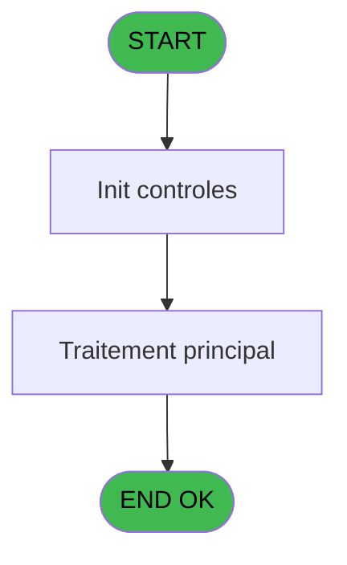
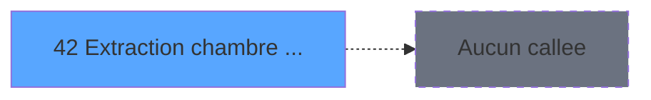

# PBS IDE 42 - Extraction chambre client

> **Analyse**: Phases 1-4 2026-02-03 17:14 -> 17:14 (14s) | Assemblage 17:14
> **Pipeline**: V7.2 Enrichi
> **Structure**: 4 onglets (Resume | Ecrans | Donnees | Connexions)

<!-- TAB:Resume -->

## 1. FICHE D'IDENTITE

| Attribut | Valeur |
|----------|--------|
| Projet | PBS |
| IDE Position | 42 |
| Nom Programme | Extraction chambre client |
| Fichier source | `Prg_42.xml` |
| Dossier IDE | Logement |
| Taches | 1 (1 ecrans visibles) |
| Tables modifiees | 0 |
| Programmes appeles | 0 |
| :warning: Statut | **ORPHELIN_POTENTIEL** |

## 2. DESCRIPTION FONCTIONNELLE

**Extraction chambre client** assure la gestion complete de ce processus.

Le flux de traitement s'organise en **1 blocs fonctionnels** :

- **Traitement** (1 tache) : traitements metier divers

## 3. BLOCS FONCTIONNELS

### 3.1 Traitement (1 tache)

Traitements internes.

---

#### 42 - Extraction chambre client [[ECRAN]](#ecran-t2)

**Role** : Traitement : Extraction chambre client.
**Ecran** : 5071 x 195 DLU | [Voir mockup](#ecran-t2)

## 5. REGLES METIER

*(Aucune regle metier identifiee)*

## 6. CONTEXTE

- **Appele par**: (aucun)
- **Appelle**: 0 programmes | **Tables**: 0 (W:0 R:0 L:0) | **Taches**: 1 | **Expressions**: 4

<!-- TAB:Ecrans -->

## 8. ECRANS

### 8.1 Forms visibles (1 / 1)

| # | Position | Tache | Nom | Type | Largeur | Hauteur | Bloc |
|---|----------|-------|-----|------|---------|---------|------|
| 1 | 42.1 | 42 | Extraction chambre client | Type0 | 5071 | 195 | Traitement |

### 8.2 Mockups Ecrans

---

#### 42.1 - Extraction chambre client
**Tache** : [42](#t2) | **Type** : Type0 | **Dimensions** : 5071 x 195 DLU
**Bloc** : Traitement | **Titre IDE** : Extraction chambre client

<!-- FORM-DATA:
{
    "width":  5071,
    "vFactor":  8,
    "type":  "Type0",
    "hFactor":  4,
    "controls":  [
                     {
                         "x":  8,
                         "type":  "table",
                         "var":  "",
                         "name":  "",
                         "titleH":  12,
                         "color":  "",
                         "w":  5049,
                         "y":  8,
                         "fmt":  "",
                         "parent":  null,
                         "text":  "",
                         "rowH":  13,
                         "h":  182,
                         "cols":  [
                                      {
                                          "title":  "loc_societe",
                                          "layer":  1,
                                          "w":  46
                                      },
                                      {
                                          "title":  "loc_nom_standard",
                                          "layer":  2,
                                          "w":  73
                                      },
                                      {
                                          "title":  "loc",
                                          "layer":  3,
                                          "w":  66
                                      },
                                      {
                                          "title":  "loc_nom_complet",
                                          "layer":  4,
                                          "w":  94
                                      },
                                      {
                                          "title":  "loc_type_logement",
                                          "layer":  5,
                                          "w":  74
                                      },
                                      {
                                          "title":  "libelle_vingt",
                                          "layer":  6,
                                          "w":  122
                                      },
                                      {
                                          "title":  "loc_batiment",
                                          "layer":  7,
                                          "w":  51
                                      },
                                      {
                                          "title":  "libelle_vingt",
                                          "layer":  8,
                                          "w":  122
                                      },
                                      {
                                          "title":  "loc_etage",
                                          "layer":  9,
                                          "w":  41
                                      },
                                      {
                                          "title":  "libelle_trente",
                                          "layer":  10,
                                          "w":  178
                                      },
                                      {
                                          "title":  "loc_vue",
                                          "layer":  11,
                                          "w":  34
                                      },
                                      {
                                          "title":  "libelle_vingt",
                                          "layer":  12,
                                          "w":  122
                                      },
                                      {
                                          "title":  "loc_orientation",
                                          "layer":  13,
                                          "w":  58
                                      },
                                      {
                                          "title":  "libelle_trente",
                                          "layer":  14,
                                          "w":  178
                                      },
                                      {
                                          "title":  "loc_secteur",
                                          "layer":  15,
                                          "w":  47
                                      },
                                      {
                                          "title":  "nom_zone_secteur",
                                          "layer":  16,
                                          "w":  122
                                      },
                                      {
                                          "title":  "loc_standing",
                                          "layer":  17,
                                          "w":  51
                                      },
                                      {
                                          "title":  "libelle_trente",
                                          "layer":  18,
                                          "w":  178
                                      },
                                      {
                                          "title":  "loc_surface",
                                          "layer":  19,
                                          "w":  63
                                      },
                                      {
                                          "title":  "loc_ensemble",
                                          "layer":  20,
                                          "w":  55
                                      },
                                      {
                                          "title":  "libelle_vingt",
                                          "layer":  21,
                                          "w":  122
                                      },
                                      {
                                          "title":  "loc_occupation_std",
                                          "layer":  22,
                                          "w":  78
                                      },
                                      {
                                          "title":  "libelle_trente",
                                          "layer":  23,
                                          "w":  178
                                      },
                                      {
                                          "title":  "loc_zone_menage",
                                          "layer":  24,
                                          "w":  73
                                      },
                                      {
                                          "title":  "loc_secteur_menage",
                                          "layer":  25,
                                          "w":  82
                                      },
                                      {
                                          "title":  "nom_zone_secteur",
                                          "layer":  26,
                                          "w":  122
                                      },
                                      {
                                          "title":  "loc_lit_pliant",
                                          "layer":  27,
                                          "w":  50
                                      },
                                      {
                                          "title":  "libelle_trente",
                                          "layer":  28,
                                          "w":  178
                                      },
                                      {
                                          "title":  "loc_lit_bebe",
                                          "layer":  29,
                                          "w":  49
                                      },
                                      {
                                          "title":  "libelle_trente",
                                          "layer":  30,
                                          "w":  178
                                      },
                                      {
                                          "title":  "loc_lit_banquette",
                                          "layer":  31,
                                          "w":  68
                                      },
                                      {
                                          "title":  "libelle_trente",
                                          "layer":  32,
                                          "w":  178
                                      },
                                      {
                                          "title":  "loc_attribution",
                                          "layer":  33,
                                          "w":  56
                                      },
                                      {
                                          "title":  "libelle_trente",
                                          "layer":  34,
                                          "w":  178
                                      },
                                      {
                                          "title":  "loc_1",
                                          "layer":  35,
                                          "w":  44
                                      },
                                      {
                                          "title":  "loc_lieu_sejour_perm",
                                          "layer":  36,
                                          "w":  82
                                      },
                                      {
                                          "title":  "loc_code_logement",
                                          "layer":  37,
                                          "w":  78
                                      },
                                      {
                                          "title":  "clo_libelle",
                                          "layer":  38,
                                          "w":  122
                                      },
                                      {
                                          "title":  "loc_lieu_de_sejour",
                                          "layer":  39,
                                          "w":  74
                                      },
                                      {
                                          "title":  "nom_import",
                                          "layer":  40,
                                          "w":  122
                                      },
                                      {
                                          "title":  "loc_2",
                                          "layer":  41,
                                          "w":  24
                                      },
                                      {
                                          "title":  "loc_3",
                                          "layer":  42,
                                          "w":  63
                                      },
                                      {
                                          "title":  "loc_communicante",
                                          "layer":  43,
                                          "w":  74
                                      },
                                      {
                                          "title":  "loc_handicapes",
                                          "layer":  44,
                                          "w":  63
                                      },
                                      {
                                          "title":  "loc_code_menage",
                                          "layer":  45,
                                          "w":  74
                                      },
                                      {
                                          "title":  "loc_tel_interieur",
                                          "layer":  46,
                                          "w":  62
                                      },
                                      {
                                          "title":  "loc_defauts",
                                          "layer":  47,
                                          "w":  47
                                      },
                                      {
                                          "title":  "libelle_dix",
                                          "layer":  48,
                                          "w":  66
                                      },
                                      {
                                          "title":  "loc_proche_centre",
                                          "layer":  49,
                                          "w":  74
                                      },
                                      {
                                          "title":  "loc_plus_belle",
                                          "layer":  50,
                                          "w":  57
                                      },
                                      {
                                          "title":  "zone_de_menage",
                                          "layer":  51,
                                          "w":  71
                                      },
                                      {
                                          "title":  "secteur_de_menage",
                                          "layer":  52,
                                          "w":  81
                                      },
                                      {
                                          "title":  "telephone_exterieur",
                                          "layer":  53,
                                          "w":  94
                                      },
                                      {
                                          "title":  "fax",
                                          "layer":  54,
                                          "w":  94
                                      },
                                      {
                                          "title":  "abandon",
                                          "layer":  55,
                                          "w":  77
                                      },
                                      {
                                          "title":  "pont",
                                          "layer":  56,
                                          "w":  20
                                      },
                                      {
                                          "title":  "cote",
                                          "layer":  57,
                                          "w":  27
                                      },
                                      {
                                          "title":  "zone",
                                          "layer":  58,
                                          "w":  77
                                      }
                                  ],
                         "rows":  58
                     },
                     {
                         "x":  12,
                         "type":  "edit",
                         "var":  "",
                         "y":  23,
                         "w":  9,
                         "fmt":  "",
                         "name":  "loc_societe",
                         "h":  10,
                         "color":  "",
                         "text":  "",
                         "parent":  1
                     },
                     {
                         "x":  58,
                         "type":  "edit",
                         "var":  "",
                         "y":  23,
                         "w":  37,
                         "fmt":  "",
                         "name":  "loc_nom_standard",
                         "h":  10,
                         "color":  "",
                         "text":  "",
                         "parent":  1
                     },
                     {
                         "x":  131,
                         "type":  "edit",
                         "var":  "",
                         "y":  23,
                         "w":  59,
                         "fmt":  "",
                         "name":  "loc",
                         "h":  10,
                         "color":  "",
                         "text":  "",
                         "parent":  1
                     },
                     {
                         "x":  197,
                         "type":  "edit",
                         "var":  "",
                         "y":  23,
                         "w":  87,
                         "fmt":  "",
                         "name":  "loc_nom_complet",
                         "h":  10,
                         "color":  "",
                         "text":  "",
                         "parent":  1
                     },
                     {
                         "x":  291,
                         "type":  "edit",
                         "var":  "",
                         "y":  23,
                         "w":  14,
                         "fmt":  "",
                         "name":  "loc_type_logement",
                         "h":  10,
                         "color":  "",
                         "text":  "",
                         "parent":  1
                     },
                     {
                         "x":  365,
                         "type":  "edit",
                         "var":  "",
                         "y":  23,
                         "w":  115,
                         "fmt":  "",
                         "name":  "libelle_vingt",
                         "h":  10,
                         "color":  "",
                         "text":  "",
                         "parent":  1
                     },
                     {
                         "x":  487,
                         "type":  "edit",
                         "var":  "",
                         "y":  23,
                         "w":  14,
                         "fmt":  "",
                         "name":  "loc_batiment",
                         "h":  10,
                         "color":  "",
                         "text":  "",
                         "parent":  1
                     },
                     {
                         "x":  538,
                         "type":  "edit",
                         "var":  "",
                         "y":  23,
                         "w":  115,
                         "fmt":  "",
                         "name":  "libelle_vingt_0001",
                         "h":  10,
                         "color":  "",
                         "text":  "",
                         "parent":  1
                     },
                     {
                         "x":  660,
                         "type":  "edit",
                         "var":  "",
                         "y":  23,
                         "w":  14,
                         "fmt":  "",
                         "name":  "loc_etage",
                         "h":  10,
                         "color":  "",
                         "text":  "",
                         "parent":  1
                     },
                     {
                         "x":  701,
                         "type":  "edit",
                         "var":  "",
                         "y":  23,
                         "w":  171,
                         "fmt":  "",
                         "name":  "libelle_trente",
                         "h":  10,
                         "color":  "",
                         "text":  "",
                         "parent":  1
                     },
                     {
                         "x":  879,
                         "type":  "edit",
                         "var":  "",
                         "y":  23,
                         "w":  14,
                         "fmt":  "",
                         "name":  "loc_vue",
                         "h":  10,
                         "color":  "",
                         "text":  "",
                         "parent":  1
                     },
                     {
                         "x":  913,
                         "type":  "edit",
                         "var":  "",
                         "y":  23,
                         "w":  115,
                         "fmt":  "",
                         "name":  "libelle_vingt_0002",
                         "h":  10,
                         "color":  "",
                         "text":  "",
                         "parent":  1
                     },
                     {
                         "x":  1035,
                         "type":  "edit",
                         "var":  "",
                         "y":  23,
                         "w":  14,
                         "fmt":  "",
                         "name":  "loc_orientation",
                         "h":  10,
                         "color":  "",
                         "text":  "",
                         "parent":  1
                     },
                     {
                         "x":  1093,
                         "type":  "edit",
                         "var":  "",
                         "y":  23,
                         "w":  171,
                         "fmt":  "",
                         "name":  "libelle_trente_0001",
                         "h":  10,
                         "color":  "",
                         "text":  "",
                         "parent":  1
                     },
                     {
                         "x":  1271,
                         "type":  "edit",
                         "var":  "",
                         "y":  23,
                         "w":  14,
                         "fmt":  "",
                         "name":  "loc_secteur",
                         "h":  10,
                         "color":  "",
                         "text":  "",
                         "parent":  1
                     },
                     {
                         "x":  1318,
                         "type":  "edit",
                         "var":  "",
                         "y":  23,
                         "w":  115,
                         "fmt":  "",
                         "name":  "nom_zone_secteur",
                         "h":  10,
                         "color":  "",
                         "text":  "",
                         "parent":  1
                     },
                     {
                         "x":  1440,
                         "type":  "edit",
                         "var":  "",
                         "y":  23,
                         "w":  14,
                         "fmt":  "",
                         "name":  "loc_standing",
                         "h":  10,
                         "color":  "",
                         "text":  "",
                         "parent":  1
                     },
                     {
                         "x":  1491,
                         "type":  "edit",
                         "var":  "",
                         "y":  23,
                         "w":  171,
                         "fmt":  "",
                         "name":  "libelle_trente_0002",
                         "h":  10,
                         "color":  "",
                         "text":  "",
                         "parent":  1
                     },
                     {
                         "x":  1669,
                         "type":  "edit",
                         "var":  "",
                         "y":  23,
                         "w":  56,
                         "fmt":  "",
                         "name":  "loc_surface",
                         "h":  10,
                         "color":  "",
                         "text":  "",
                         "parent":  1
                     },
                     {
                         "x":  1732,
                         "type":  "edit",
                         "var":  "",
                         "y":  23,
                         "w":  20,
                         "fmt":  "",
                         "name":  "loc_ensemble",
                         "h":  10,
                         "color":  "",
                         "text":  "",
                         "parent":  1
                     },
                     {
                         "x":  1787,
                         "type":  "edit",
                         "var":  "",
                         "y":  23,
                         "w":  115,
                         "fmt":  "",
                         "name":  "libelle_vingt_0003",
                         "h":  10,
                         "color":  "",
                         "text":  "",
                         "parent":  1
                     },
                     {
                         "x":  1909,
                         "type":  "edit",
                         "var":  "",
                         "y":  23,
                         "w":  56,
                         "fmt":  "",
                         "name":  "loc_occupation_std",
                         "h":  10,
                         "color":  "",
                         "text":  "",
                         "parent":  1
                     },
                     {
                         "x":  1987,
                         "type":  "edit",
                         "var":  "",
                         "y":  23,
                         "w":  171,
                         "fmt":  "",
                         "name":  "libelle_trente_0003",
                         "h":  10,
                         "color":  "",
                         "text":  "",
                         "parent":  1
                     },
                     {
                         "x":  2165,
                         "type":  "edit",
                         "var":  "",
                         "y":  23,
                         "w":  56,
                         "fmt":  "",
                         "name":  "loc_zone_menage",
                         "h":  10,
                         "color":  "",
                         "text":  "",
                         "parent":  1
                     },
                     {
                         "x":  2238,
                         "type":  "edit",
                         "var":  "",
                         "y":  23,
                         "w":  56,
                         "fmt":  "",
                         "name":  "loc_secteur_menage",
                         "h":  10,
                         "color":  "",
                         "text":  "",
                         "parent":  1
                     },
                     {
                         "x":  2320,
                         "type":  "edit",
                         "var":  "",
                         "y":  23,
                         "w":  115,
                         "fmt":  "",
                         "name":  "nom_zone_secteur_0001",
                         "h":  10,
                         "color":  "",
                         "text":  "",
                         "parent":  1
                     },
                     {
                         "x":  2442,
                         "type":  "edit",
                         "var":  "",
                         "y":  23,
                         "w":  9,
                         "fmt":  "",
                         "name":  "loc_lit_pliant",
                         "h":  10,
                         "color":  "",
                         "text":  "",
                         "parent":  1
                     },
                     {
                         "x":  2492,
                         "type":  "edit",
                         "var":  "",
                         "y":  23,
                         "w":  171,
                         "fmt":  "",
                         "name":  "libelle_trente_0004",
                         "h":  10,
                         "color":  "",
                         "text":  "",
                         "parent":  1
                     },
                     {
                         "x":  2670,
                         "type":  "edit",
                         "var":  "",
                         "y":  23,
                         "w":  9,
                         "fmt":  "",
                         "name":  "loc_lit_bebe",
                         "h":  10,
                         "color":  "",
                         "text":  "",
                         "parent":  1
                     },
                     {
                         "x":  2719,
                         "type":  "edit",
                         "var":  "",
                         "y":  23,
                         "w":  171,
                         "fmt":  "",
                         "name":  "libelle_trente_0005",
                         "h":  10,
                         "color":  "",
                         "text":  "",
                         "parent":  1
                     },
                     {
                         "x":  2897,
                         "type":  "edit",
                         "var":  "",
                         "y":  23,
                         "w":  9,
                         "fmt":  "",
                         "name":  "loc_lit_banquette",
                         "h":  10,
                         "color":  "",
                         "text":  "",
                         "parent":  1
                     },
                     {
                         "x":  2965,
                         "type":  "edit",
                         "var":  "",
                         "y":  23,
                         "w":  171,
                         "fmt":  "",
                         "name":  "libelle_trente_0006",
                         "h":  10,
                         "color":  "",
                         "text":  "",
                         "parent":  1
                     },
                     {
                         "x":  3143,
                         "type":  "edit",
                         "var":  "",
                         "y":  23,
                         "w":  9,
                         "fmt":  "",
                         "name":  "loc_attribution",
                         "h":  10,
                         "color":  "",
                         "text":  "",
                         "parent":  1
                     },
                     {
                         "x":  3199,
                         "type":  "edit",
                         "var":  "",
                         "y":  23,
                         "w":  171,
                         "fmt":  "",
                         "name":  "libelle_trente_0007",
                         "h":  10,
                         "color":  "",
                         "text":  "",
                         "parent":  1
                     },
                     {
                         "x":  3377,
                         "type":  "edit",
                         "var":  "",
                         "y":  23,
                         "w":  37,
                         "fmt":  "",
                         "name":  "loc_1",
                         "h":  10,
                         "color":  "",
                         "text":  "",
                         "parent":  1
                     },
                     {
                         "x":  3421,
                         "type":  "edit",
                         "var":  "",
                         "y":  23,
                         "w":  37,
                         "fmt":  "",
                         "name":  "loc_lieu_sejour_perm",
                         "h":  10,
                         "color":  "",
                         "text":  "",
                         "parent":  1
                     },
                     {
                         "x":  3503,
                         "type":  "edit",
                         "var":  "",
                         "y":  23,
                         "w":  37,
                         "fmt":  "",
                         "name":  "loc_code_logement",
                         "h":  10,
                         "color":  "",
                         "text":  "",
                         "parent":  1
                     },
                     {
                         "x":  3581,
                         "type":  "edit",
                         "var":  "",
                         "y":  23,
                         "w":  115,
                         "fmt":  "",
                         "name":  "clo_libelle",
                         "h":  10,
                         "color":  "",
                         "text":  "",
                         "parent":  1
                     },
                     {
                         "x":  3703,
                         "type":  "edit",
                         "var":  "",
                         "y":  23,
                         "w":  9,
                         "fmt":  "",
                         "name":  "loc_lieu_de_sejour",
                         "h":  10,
                         "color":  "",
                         "text":  "",
                         "parent":  1
                     },
                     {
                         "x":  3777,
                         "type":  "edit",
                         "var":  "",
                         "y":  23,
                         "w":  115,
                         "fmt":  "",
                         "name":  "nom_import",
                         "h":  10,
                         "color":  "",
                         "text":  "",
                         "parent":  1
                     },
                     {
                         "x":  3899,
                         "type":  "edit",
                         "var":  "",
                         "y":  23,
                         "w":  9,
                         "fmt":  "",
                         "name":  "loc_2",
                         "h":  10,
                         "color":  "",
                         "text":  "",
                         "parent":  1
                     },
                     {
                         "x":  3923,
                         "type":  "edit",
                         "var":  "",
                         "y":  23,
                         "w":  56,
                         "fmt":  "",
                         "name":  "loc_3",
                         "h":  10,
                         "color":  "",
                         "text":  "",
                         "parent":  1
                     },
                     {
                         "x":  3986,
                         "type":  "edit",
                         "var":  "",
                         "y":  23,
                         "w":  9,
                         "fmt":  "",
                         "name":  "loc_communicante",
                         "h":  10,
                         "color":  "",
                         "text":  "",
                         "parent":  1
                     },
                     {
                         "x":  4060,
                         "type":  "edit",
                         "var":  "",
                         "y":  23,
                         "w":  9,
                         "fmt":  "",
                         "name":  "loc_handicapes",
                         "h":  10,
                         "color":  "",
                         "text":  "",
                         "parent":  1
                     },
                     {
                         "x":  4123,
                         "type":  "edit",
                         "var":  "",
                         "y":  23,
                         "w":  48,
                         "fmt":  "",
                         "name":  "loc_code_menage",
                         "h":  10,
                         "color":  "",
                         "text":  "",
                         "parent":  1
                     },
                     {
                         "x":  4197,
                         "type":  "edit",
                         "var":  "",
                         "y":  23,
                         "w":  37,
                         "fmt":  "",
                         "name":  "loc_tel_interieur",
                         "h":  10,
                         "color":  "",
                         "text":  "",
                         "parent":  1
                     },
                     {
                         "x":  4259,
                         "type":  "edit",
                         "var":  "",
                         "y":  23,
                         "w":  9,
                         "fmt":  "",
                         "name":  "loc_defauts",
                         "h":  10,
                         "color":  "",
                         "text":  "",
                         "parent":  1
                     },
                     {
                         "x":  4306,
                         "type":  "edit",
                         "var":  "",
                         "y":  23,
                         "w":  59,
                         "fmt":  "",
                         "name":  "libelle_dix",
                         "h":  10,
                         "color":  "",
                         "text":  "",
                         "parent":  1
                     },
                     {
                         "x":  4372,
                         "type":  "edit",
                         "var":  "",
                         "y":  23,
                         "w":  9,
                         "fmt":  "",
                         "name":  "loc_proche_centre",
                         "h":  10,
                         "color":  "",
                         "text":  "",
                         "parent":  1
                     },
                     {
                         "x":  4446,
                         "type":  "edit",
                         "var":  "",
                         "y":  23,
                         "w":  9,
                         "fmt":  "",
                         "name":  "loc_plus_belle",
                         "h":  10,
                         "color":  "",
                         "text":  "",
                         "parent":  1
                     },
                     {
                         "x":  4503,
                         "type":  "edit",
                         "var":  "",
                         "y":  23,
                         "w":  20,
                         "fmt":  "",
                         "name":  "zone_de_menage",
                         "h":  10,
                         "color":  "",
                         "text":  "",
                         "parent":  1
                     },
                     {
                         "x":  4574,
                         "type":  "edit",
                         "var":  "",
                         "y":  23,
                         "w":  20,
                         "fmt":  "",
                         "name":  "secteur_de_menage",
                         "h":  10,
                         "color":  "",
                         "text":  "",
                         "parent":  1
                     },
                     {
                         "x":  4655,
                         "type":  "edit",
                         "var":  "",
                         "y":  23,
                         "w":  87,
                         "fmt":  "",
                         "name":  "telephone_exterieur",
                         "h":  10,
                         "color":  "",
                         "text":  "",
                         "parent":  1
                     },
                     {
                         "x":  4749,
                         "type":  "edit",
                         "var":  "",
                         "y":  23,
                         "w":  87,
                         "fmt":  "",
                         "name":  "fax",
                         "h":  10,
                         "color":  "",
                         "text":  "",
                         "parent":  1
                     },
                     {
                         "x":  4843,
                         "type":  "edit",
                         "var":  "",
                         "y":  23,
                         "w":  70,
                         "fmt":  "",
                         "name":  "abandon",
                         "h":  10,
                         "color":  "",
                         "text":  "",
                         "parent":  1
                     },
                     {
                         "x":  4920,
                         "type":  "edit",
                         "var":  "",
                         "y":  23,
                         "w":  9,
                         "fmt":  "",
                         "name":  "pont",
                         "h":  10,
                         "color":  "",
                         "text":  "",
                         "parent":  1
                     },
                     {
                         "x":  4940,
                         "type":  "edit",
                         "var":  "",
                         "y":  23,
                         "w":  20,
                         "fmt":  "",
                         "name":  "cote",
                         "h":  10,
                         "color":  "",
                         "text":  "",
                         "parent":  1
                     },
                     {
                         "x":  4967,
                         "type":  "edit",
                         "var":  "",
                         "y":  23,
                         "w":  70,
                         "fmt":  "",
                         "name":  "zone",
                         "h":  10,
                         "color":  "",
                         "text":  "",
                         "parent":  1
                     }
                 ],
    "taskId":  "42.1",
    "height":  195
}
-->

<strong>Champs : 58 champs</strong>

| Pos (x,y) | Nom | Variable | Type |
|-----------|-----|----------|------|
| 12,23 | loc_societe | - | edit |
| 58,23 | loc_nom_standard | - | edit |
| 131,23 | loc | - | edit |
| 197,23 | loc_nom_complet | - | edit |
| 291,23 | loc_type_logement | - | edit |
| 365,23 | libelle_vingt | - | edit |
| 487,23 | loc_batiment | - | edit |
| 538,23 | libelle_vingt_0001 | - | edit |
| 660,23 | loc_etage | - | edit |
| 701,23 | libelle_trente | - | edit |
| 879,23 | loc_vue | - | edit |
| 913,23 | libelle_vingt_0002 | - | edit |
| 1035,23 | loc_orientation | - | edit |
| 1093,23 | libelle_trente_0001 | - | edit |
| 1271,23 | loc_secteur | - | edit |
| 1318,23 | nom_zone_secteur | - | edit |
| 1440,23 | loc_standing | - | edit |
| 1491,23 | libelle_trente_0002 | - | edit |
| 1669,23 | loc_surface | - | edit |
| 1732,23 | loc_ensemble | - | edit |
| 1787,23 | libelle_vingt_0003 | - | edit |
| 1909,23 | loc_occupation_std | - | edit |
| 1987,23 | libelle_trente_0003 | - | edit |
| 2165,23 | loc_zone_menage | - | edit |
| 2238,23 | loc_secteur_menage | - | edit |
| 2320,23 | nom_zone_secteur_0001 | - | edit |
| 2442,23 | loc_lit_pliant | - | edit |
| 2492,23 | libelle_trente_0004 | - | edit |
| 2670,23 | loc_lit_bebe | - | edit |
| 2719,23 | libelle_trente_0005 | - | edit |
| 2897,23 | loc_lit_banquette | - | edit |
| 2965,23 | libelle_trente_0006 | - | edit |
| 3143,23 | loc_attribution | - | edit |
| 3199,23 | libelle_trente_0007 | - | edit |
| 3377,23 | loc_1 | - | edit |
| 3421,23 | loc_lieu_sejour_perm | - | edit |
| 3503,23 | loc_code_logement | - | edit |
| 3581,23 | clo_libelle | - | edit |
| 3703,23 | loc_lieu_de_sejour | - | edit |
| 3777,23 | nom_import | - | edit |
| 3899,23 | loc_2 | - | edit |
| 3923,23 | loc_3 | - | edit |
| 3986,23 | loc_communicante | - | edit |
| 4060,23 | loc_handicapes | - | edit |
| 4123,23 | loc_code_menage | - | edit |
| 4197,23 | loc_tel_interieur | - | edit |
| 4259,23 | loc_defauts | - | edit |
| 4306,23 | libelle_dix | - | edit |
| 4372,23 | loc_proche_centre | - | edit |
| 4446,23 | loc_plus_belle | - | edit |
| 4503,23 | zone_de_menage | - | edit |
| 4574,23 | secteur_de_menage | - | edit |
| 4655,23 | telephone_exterieur | - | edit |
| 4749,23 | fax | - | edit |
| 4843,23 | abandon | - | edit |
| 4920,23 | pont | - | edit |
| 4940,23 | cote | - | edit |
| 4967,23 | zone | - | edit |

## 9. NAVIGATION

Ecran unique: **Extraction chambre client**

### 9.3 Structure hierarchique (1 tache)

| Position | Tache | Type | Dimensions | Bloc |
|----------|-------|------|------------|------|
| **42.1** | [**Extraction chambre client** (42)](#t2) [mockup](#ecran-t2) | - | 5071x195 | Traitement |

### 9.4 Algorigramme

> **Legende**: Vert = START/END OK | Rouge = END KO | Bleu = Decisions
> *Algorigramme auto-genere. Utiliser `/algorigramme` pour une synthese metier detaillee.*

<!-- TAB:Donnees -->

## 10. TABLES

### Tables utilisees (0)

| ID | Nom | Description | Type | R | W | L | Usages |
|----|-----|-------------|------|---|---|---|--------|

### Colonnes par table (0 / 0 tables avec colonnes identifiees)

## 11. VARIABLES

### 11.1 Variables de session (3)

Variables persistantes pendant toute la session.

| Lettre | Nom | Type | Usage dans |
|--------|-----|------|-----------|
| CG | v.Ligne extraite 1 | Alpha | - |
| CH | v.Ligne extraite 2 | Alpha | - |
| CI | v.Ligne extraite 3 | Alpha | - |

### 11.2 Autres (58)

Variables diverses.

| Lettre | Nom | Type | Usage dans |
|--------|-----|------|-----------|
| A | loc_societe | Unicode | - |
| B | loc_nom_standard | Unicode | - |
| C | loc | Unicode | - |
| D | loc_nom_complet | Unicode | - |
| E | loc_type_logement | Unicode | - |
| F | libelle_vingt | Unicode | - |
| G | loc_batiment | Unicode | - |
| H | libelle_vingt | Unicode | - |
| I | loc_etage | Unicode | - |
| J | libelle_trente | Unicode | - |
| K | loc_vue | Unicode | - |
| L | libelle_vingt | Unicode | - |
| M | loc_orientation | Unicode | - |
| N | libelle_trente | Unicode | - |
| O | loc_secteur | Unicode | - |
| P | nom_zone_secteur | Unicode | - |
| Q | loc_standing | Unicode | - |
| R | libelle_trente | Unicode | - |
| S | loc_surface | Numeric | - |
| T | loc_ensemble | Unicode | - |
| U | libelle_vingt | Unicode | - |
| V | loc_occupation_std | Numeric | - |
| W | libelle_trente | Unicode | - |
| X | loc_zone_menage | Numeric | - |
| Y | loc_secteur_menage | Numeric | - |
| Z | nom_zone_secteur | Unicode | - |
| BA | loc_lit_pliant | Unicode | - |
| BB | libelle_trente | Unicode | - |
| BC | loc_lit_bebe | Unicode | - |
| BD | libelle_trente | Unicode | - |
| BE | loc_lit_banquette | Unicode | - |
| BF | libelle_trente | Unicode | - |
| BG | loc_attribution | Unicode | - |
| BH | libelle_trente | Unicode | - |
| BI | loc_1 | Unicode | - |
| BJ | loc_lieu_sejour_perm | Unicode | - |
| BK | loc_code_logement | Unicode | - |
| BL | clo_libelle | Unicode | - |
| BM | loc_lieu_de_sejour | Unicode | - |
| BN | nom_import | Unicode | - |
| BO | loc_2 | Unicode | - |
| BP | loc_3 | Numeric | - |
| BQ | loc_communicante | Unicode | - |
| BR | loc_handicapes | Unicode | - |
| BS | loc_code_menage | Alpha | - |
| BT | loc_tel_interieur | Unicode | - |
| BU | loc_defauts | Unicode | - |
| BV | libelle_dix | Unicode | - |
| BW | loc_proche_centre | Unicode | - |
| BX | loc_plus_belle | Unicode | - |
| BY | zone_de_menage | Unicode | - |
| BZ | secteur_de_menage | Unicode | - |
| CA | telephone_exterieur | Unicode | - |
| CB | fax | Unicode | - |
| CC | abandon | Numeric | - |
| CD | pont | Unicode | - |
| CE | cote | Unicode | - |
| CF | zone | Numeric | - |

Toutes les 61 variables (liste complete)

| Cat | Lettre | Nom Variable | Type |
|-----|--------|--------------|------|
| V. | **CG** | v.Ligne extraite 1 | Alpha |
| V. | **CH** | v.Ligne extraite 2 | Alpha |
| V. | **CI** | v.Ligne extraite 3 | Alpha |
| Autre | **A** | loc_societe | Unicode |
| Autre | **B** | loc_nom_standard | Unicode |
| Autre | **C** | loc | Unicode |
| Autre | **D** | loc_nom_complet | Unicode |
| Autre | **E** | loc_type_logement | Unicode |
| Autre | **F** | libelle_vingt | Unicode |
| Autre | **G** | loc_batiment | Unicode |
| Autre | **H** | libelle_vingt | Unicode |
| Autre | **I** | loc_etage | Unicode |
| Autre | **J** | libelle_trente | Unicode |
| Autre | **K** | loc_vue | Unicode |
| Autre | **L** | libelle_vingt | Unicode |
| Autre | **M** | loc_orientation | Unicode |
| Autre | **N** | libelle_trente | Unicode |
| Autre | **O** | loc_secteur | Unicode |
| Autre | **P** | nom_zone_secteur | Unicode |
| Autre | **Q** | loc_standing | Unicode |
| Autre | **R** | libelle_trente | Unicode |
| Autre | **S** | loc_surface | Numeric |
| Autre | **T** | loc_ensemble | Unicode |
| Autre | **U** | libelle_vingt | Unicode |
| Autre | **V** | loc_occupation_std | Numeric |
| Autre | **W** | libelle_trente | Unicode |
| Autre | **X** | loc_zone_menage | Numeric |
| Autre | **Y** | loc_secteur_menage | Numeric |
| Autre | **Z** | nom_zone_secteur | Unicode |
| Autre | **BA** | loc_lit_pliant | Unicode |
| Autre | **BB** | libelle_trente | Unicode |
| Autre | **BC** | loc_lit_bebe | Unicode |
| Autre | **BD** | libelle_trente | Unicode |
| Autre | **BE** | loc_lit_banquette | Unicode |
| Autre | **BF** | libelle_trente | Unicode |
| Autre | **BG** | loc_attribution | Unicode |
| Autre | **BH** | libelle_trente | Unicode |
| Autre | **BI** | loc_1 | Unicode |
| Autre | **BJ** | loc_lieu_sejour_perm | Unicode |
| Autre | **BK** | loc_code_logement | Unicode |
| Autre | **BL** | clo_libelle | Unicode |
| Autre | **BM** | loc_lieu_de_sejour | Unicode |
| Autre | **BN** | nom_import | Unicode |
| Autre | **BO** | loc_2 | Unicode |
| Autre | **BP** | loc_3 | Numeric |
| Autre | **BQ** | loc_communicante | Unicode |
| Autre | **BR** | loc_handicapes | Unicode |
| Autre | **BS** | loc_code_menage | Alpha |
| Autre | **BT** | loc_tel_interieur | Unicode |
| Autre | **BU** | loc_defauts | Unicode |
| Autre | **BV** | libelle_dix | Unicode |
| Autre | **BW** | loc_proche_centre | Unicode |
| Autre | **BX** | loc_plus_belle | Unicode |
| Autre | **BY** | zone_de_menage | Unicode |
| Autre | **BZ** | secteur_de_menage | Unicode |
| Autre | **CA** | telephone_exterieur | Unicode |
| Autre | **CB** | fax | Unicode |
| Autre | **CC** | abandon | Numeric |
| Autre | **CD** | pont | Unicode |
| Autre | **CE** | cote | Unicode |
| Autre | **CF** | zone | Numeric |

## 12. EXPRESSIONS

**4 / 4 expressions decodees (100%)**

### 12.1 Repartition par type

| Type | Expressions | Regles |
|------|-------------|--------|
| CONCATENATION | 1 | 0 |
| FORMAT | 3 | 0 |

### 12.2 Expressions cles par type

#### CONCATENATION (1 expressions)

| Type | IDE | Expression | Regle |
|------|-----|------------|-------|
| CONCATENATION | 1 | `'%club_exportdata%'&'_Chambre_Client_'&'.csv'` | - |

#### FORMAT (3 expressions)

| Type | IDE | Expression | Regle |
|------|-----|------------|-------|
| FORMAT | 4 | `'="'&'LIGNE3'&'"'&VG21
&Trim([OQ]) &VG21
 &Trim([OR]) &VG21
 &Trim([PG]) &VG21
 &Trim([PH]) &VG21
 &Trim([PR]) &VG21
 &Trim([PU]) &VG21
 &Trim([PV]) &VG21
 &Trim([OM]) &VG21
 &Trim([ON]) &VG21
 &Trim(Str([OS],'10')) &VG21
 &Trim(Str([QC],'10')) &VG21
 &Trim([QD]) &VG21
 &Trim([QE]) &VG21
 &Trim(Str([QF],'10')) &VG21
 &Trim([PX]) &VG21` | - |
| FORMAT | 3 | `'="'&'LIGNE2'&'"'&VG21
&'="'&Trim([PW])&'"'&VG21
&Str([OX],'2') &VG21
 &Trim([OZ]) &VG21
 &Trim([OO]) &VG21
 &Trim([OP]) &VG21
 &Trim([QA]) &VG21
 &Trim([QB]) &VG21
 &Trim([QD]) &VG21
 &Trim([PM]) &VG21
 &Trim([PN]) &VG21
 &Trim([PK]) &VG21
 &Trim([PL]) &VG21
 &Trim([PA]) &VG21
 &Trim([PB]) &VG21
 &Trim([PC]) &VG21
 &Trim([PD]) &VG21
 &Trim([PE]) &VG21
 &Trim([PF]) &VG21` | - |
| FORMAT | 2 | `'="'&'LIGNE1'&'"'&VG21
&'="'&Trim([OB])&'"'&VG21
&'="'&Trim([OD])&'"'&VG21
&'="'&Trim([PT])&'"'&VG21
&'="'&Trim([OT])&'"'&VG21
&'="'&Trim([OU])&'"'&VG21
&'="'&Trim([OE])&'"'&VG21
&'="'&Trim([OF])&'"'&VG21
&'="'&Trim([OG])&'"'&VG21
&'="'&Trim([OH])&'"'&VG21
&'="'&Trim([OI])&'"'&VG21
&'="'&Trim([OJ])&'"'&VG21
&'="'&Trim([OK])&'"'&VG21
&'="'&Trim([OL])&'"'&VG21
&'="'&Trim(Str([OV],'10'))&'"'&VG21
&'="'&Trim([OW])` | - |

<!-- TAB:Connexions -->

## 13. GRAPHE D'APPELS

### 13.1 Chaine depuis Main (Callers)

**Chemin**: (pas de callers directs)

### 13.2 Callers

| IDE | Nom Programme | Nb Appels |
|-----|---------------|-----------|
| - | (aucun) | - |

### 13.3 Callees (programmes appeles)

### 13.4 Detail Callees avec contexte

| IDE | Nom Programme | Appels | Contexte |
|-----|---------------|--------|----------|
| - | (aucun) | - | - |

## 14. RECOMMANDATIONS MIGRATION

### 14.1 Profil du programme

| Metrique | Valeur | Impact migration |
|----------|--------|-----------------|
| Lignes de logique | 70 | Programme compact |
| Expressions | 4 | Peu de logique |
| Tables WRITE | 0 | Impact faible |
| Sous-programmes | 0 | Peu de dependances |
| Ecrans visibles | 1 | Ecran unique ou traitement batch |
| Code desactive | 0% (0 / 70) | Code sain |
| Regles metier | 0 | Pas de regle identifiee |

### 14.2 Plan de migration par bloc

#### Traitement (1 tache: 1 ecran, 0 traitement)

- **Strategie** : 1 composant(s) UI (Razor/React) avec formulaires et validation.
- Decomposer les taches en services unitaires testables.

### 14.3 Dependances critiques

| Dependance | Type | Appels | Impact |
|------------|------|--------|--------|

---
*Spec DETAILED generee par Pipeline V7.2 - 2026-02-03 17:14*
