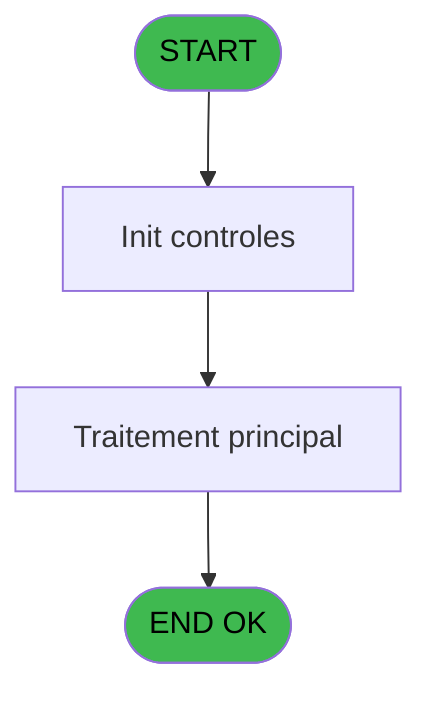
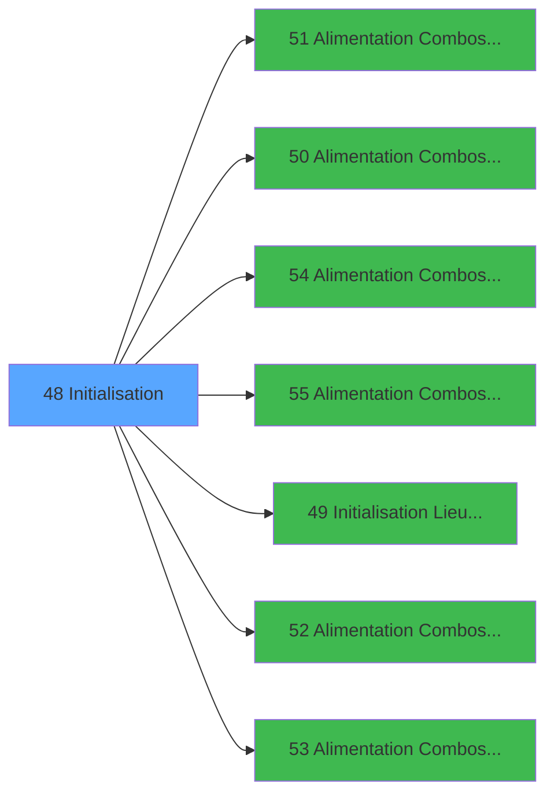

# PBS IDE 48 - Initialisation

> **Analyse**: Phases 1-4 2026-02-03 17:16 -> 17:16 (20s) | Assemblage 17:16
> **Pipeline**: V7.2 Enrichi
> **Structure**: 4 onglets (Resume | Ecrans | Donnees | Connexions)

<!-- TAB:Resume -->

## 1. FICHE D'IDENTITE

| Attribut | Valeur |
|----------|--------|
| Projet | PBS |
| IDE Position | 48 |
| Nom Programme | Initialisation |
| Fichier source | `Prg_48.xml` |
| Dossier IDE | Start |
| Taches | 1 (1 ecrans visibles) |
| Tables modifiees | 0 |
| Programmes appeles | 7 |

## 2. DESCRIPTION FONCTIONNELLE

**Initialisation** assure la gestion complete de ce processus, accessible depuis [Start (IDE 46)](PBS-IDE-46.md).

Le flux de traitement s'organise en **1 blocs fonctionnels** :

- **Traitement** (1 tache) : traitements metier divers

## 3. BLOCS FONCTIONNELS

### 3.1 Traitement (1 tache)

Traitements internes.

---

#### 48 - Veuillez patienter... [[ECRAN]](#ecran-t1)

**Role** : Traitement : Veuillez patienter....
**Ecran** : 426 x 56 DLU (MDI) | [Voir mockup](#ecran-t1)
**Delegue a** : [  Alimentation Combos PARIS 1 (IDE 51)](PBS-IDE-51.md), [  Alimentation Combos VILLAGE (IDE 50)](PBS-IDE-50.md), [  Alimentation Combos MENAGE (IDE 54)](PBS-IDE-54.md)

## 5. REGLES METIER

*(Aucune regle metier identifiee)*

## 6. CONTEXTE

- **Appele par**: [Start (IDE 46)](PBS-IDE-46.md)
- **Appelle**: 7 programmes | **Tables**: 4 (W:0 R:1 L:3) | **Taches**: 1 | **Expressions**: 56

<!-- TAB:Ecrans -->

## 8. ECRANS

### 8.1 Forms visibles (1 / 1)

| # | Position | Tache | Nom | Type | Largeur | Hauteur | Bloc |
|---|----------|-------|-----|------|---------|---------|------|
| 1 | 48 | 48 | Veuillez patienter... | MDI | 426 | 56 | Traitement |

### 8.2 Mockups Ecrans

---

#### 48 - Veuillez patienter...
**Tache** : [48](#t1) | **Type** : MDI | **Dimensions** : 426 x 56 DLU
**Bloc** : Traitement | **Titre IDE** : Veuillez patienter...

<!-- FORM-DATA:
{
    "width":  426,
    "vFactor":  8,
    "type":  "MDI",
    "hFactor":  8,
    "controls":  [
                     {
                         "x":  1,
                         "type":  "label",
                         "var":  "",
                         "y":  0,
                         "w":  423,
                         "fmt":  "",
                         "name":  "",
                         "h":  29,
                         "color":  "",
                         "text":  "",
                         "parent":  null
                     },
                     {
                         "x":  99,
                         "type":  "label",
                         "var":  "",
                         "y":  10,
                         "w":  275,
                         "fmt":  "",
                         "name":  "",
                         "h":  8,
                         "color":  "7",
                         "text":  "Planning Setup",
                         "parent":  null
                     },
                     {
                         "x":  1,
                         "type":  "label",
                         "var":  "",
                         "y":  29,
                         "w":  423,
                         "fmt":  "",
                         "name":  "",
                         "h":  27,
                         "color":  "",
                         "text":  "",
                         "parent":  null
                     },
                     {
                         "x":  100,
                         "type":  "label",
                         "var":  "",
                         "y":  39,
                         "w":  233,
                         "fmt":  "",
                         "name":  "",
                         "h":  8,
                         "color":  "",
                         "text":  "Initialisation Application",
                         "parent":  null
                     },
                     {
                         "x":  2,
                         "type":  "image",
                         "var":  "",
                         "y":  2,
                         "w":  72,
                         "fmt":  "",
                         "name":  "",
                         "h":  25,
                         "color":  "",
                         "text":  "",
                         "parent":  null
                     }
                 ],
    "taskId":  "48",
    "height":  56
}
-->

## 9. NAVIGATION

Ecran unique: **Veuillez patienter...**

### 9.3 Structure hierarchique (1 tache)

| Position | Tache | Type | Dimensions | Bloc |
|----------|-------|------|------------|------|
| **48.1** | [**Veuillez patienter...** (48)](#t1) [mockup](#ecran-t1) | MDI | 426x56 | Traitement |

### 9.4 Algorigramme

> **Legende**: Vert = START/END OK | Rouge = END KO | Bleu = Decisions
> *Algorigramme auto-genere. Utiliser `/algorigramme` pour une synthese metier detaillee.*

<!-- TAB:Donnees -->

## 10. TABLES

### Tables utilisees (4)

| ID | Nom | Description | Type | R | W | L | Usages |
|----|-----|-------------|------|---|---|---|--------|
| 63 | parametres___par |  | DB | R |   |   | 1 |
| 69 | initialisation___ini |  | DB |   |   | L | 1 |
| 109 | table_utilisateurs |  | DB |   |   | L | 1 |
| 728 | arc_cc_total |  | DB |   |   | L | 1 |

### Colonnes par table (1 / 1 tables avec colonnes identifiees)

Table 63 - parametres___par (R) - 1 usages

| Lettre | Variable | Acces | Type |
|--------|----------|-------|------|
| A | v. cdrt Lien Utilisateur | R | Logical |
| B | v.Liste Combo | R | Alpha |

## 11. VARIABLES

### 11.1 Variables de session (2)

Variables persistantes pendant toute la session.

| Lettre | Nom | Type | Usage dans |
|--------|-----|------|-----------|
| A | v. cdrt Lien Utilisateur | Logical | 2x session |
| B | v.Liste Combo | Alpha | - |

## 12. EXPRESSIONS

**56 / 56 expressions decodees (100%)**

### 12.1 Repartition par type

| Type | Expressions | Regles |
|------|-------------|--------|
| CONSTANTE | 41 | 0 |
| OTHER | 11 | 0 |
| REFERENCE_VG | 1 | 0 |
| NEGATION | 1 | 0 |
| CONDITION | 1 | 0 |
| FORMAT | 1 | 0 |

### 12.2 Expressions cles par type

#### CONSTANTE (41 expressions)

| Type | IDE | Expression | Regle |
|------|-----|------------|-------|
| CONSTANTE | 30 | `'TTYOC'` | - |
| CONSTANTE | 29 | `'CTCOMM'` | - |
| CONSTANTE | 31 | `'CTTYOC'` | - |
| CONSTANTE | 33 | `'S'` | - |
| CONSTANTE | 32 | `'Z'` | - |
| ... | | *+36 autres* | |

#### OTHER (11 expressions)

| Type | IDE | Expression | Regle |
|------|-----|------------|-------|
| OTHER | 50 | `[R]` | - |
| OTHER | 49 | `SetParam ('FISCALITEGREC',IF ([H],'O','N'))` | - |
| OTHER | 52 | `[D]` | - |
| OTHER | 56 | `MnuShow('IMPPRE',VG5)` | - |
| OTHER | 55 | `MnuShow('AGENT',VG18)` | - |
| ... | | *+6 autres* | |

#### REFERENCE_VG (1 expressions)

| Type | IDE | Expression | Regle |
|------|-----|------------|-------|
| REFERENCE_VG | 42 | `VG3` | - |

#### NEGATION (1 expressions)

| Type | IDE | Expression | Regle |
|------|-----|------------|-------|
| NEGATION | 47 | `NOT (v. cdrt Lien Utilisateur [A])` | - |

#### CONDITION (1 expressions)

| Type | IDE | Expression | Regle |
|------|-----|------------|-------|
| CONDITION | 54 | `[U]='O'` | - |

#### FORMAT (1 expressions)

| Type | IDE | Expression | Regle |
|------|-----|------------|-------|
| FORMAT | 51 | `'N###########'&IF([R]<>0,'.'&Trim(Str([R],'1')),'')&'CZ'` | - |

### 12.3 Toutes les expressions (56)

Voir les 56 expressions

#### CONSTANTE (41)

| IDE | Expression Decodee |
|-----|-------------------|
| 3 | `'CZONE'` |
| 4 | `'VENSE'` |
| 5 | `'CVENSE'` |
| 6 | `'VLOGE'` |
| 7 | `'CVLOGE'` |
| 8 | `'VBATI'` |
| 9 | `'CVBATI'` |
| 10 | `'VVUES'` |
| 11 | `'CVVUES'` |
| 12 | `'VEQUI'` |
| 13 | `'CVEQUI'` |
| 14 | `'TSTAN'` |
| 15 | `'CTSTAN'` |
| 16 | `'TATTR'` |
| 17 | `'CTATTR'` |
| 18 | `'TATTG'` |
| 19 | `'CTATTG'` |
| 20 | `'TETAG'` |
| 21 | `'CTETAG'` |
| 22 | `'TONCH'` |
| 23 | `'CTONCH'` |
| 24 | `'TORIE'` |
| 25 | `'CTORIE'` |
| 26 | `'TOINO'` |
| 27 | `'CTOINO'` |
| 28 | `'TCOMM'` |
| 29 | `'CTCOMM'` |
| 30 | `'TTYOC'` |
| 31 | `'CTTYOC'` |
| 32 | `'Z'` |
| 33 | `'S'` |
| 34 | `'CSECTEUR'` |
| 35 | `'SEJOU'` |
| 36 | `'CSEJOU'` |
| 37 | `1` |
| 38 | `2` |
| 39 | `3` |
| 40 | `5` |
| 41 | `6` |
| 48 | `'C'` |
| 53 | `39` |

#### OTHER (11)

| IDE | Expression Decodee |
|-----|-------------------|
| 1 | `SetCrsr (2)` |
| 2 | `SetCrsr (1)` |
| 43 | `SetParam ('SOCIETE',[D])` |
| 44 | `SetParam ('LANGUE',[E])` |
| 45 | `SetParam ('ZONE',[F])` |
| 46 | `v. cdrt Lien Utilisateur [A]` |
| 49 | `SetParam ('FISCALITEGREC',IF ([H],'O','N'))` |
| 50 | `[R]` |
| 52 | `[D]` |
| 55 | `MnuShow('AGENT',VG18)` |
| 56 | `MnuShow('IMPPRE',VG5)` |

#### REFERENCE_VG (1)

| IDE | Expression Decodee |
|-----|-------------------|
| 42 | `VG3` |

#### NEGATION (1)

| IDE | Expression Decodee |
|-----|-------------------|
| 47 | `NOT (v. cdrt Lien Utilisateur [A])` |

#### CONDITION (1)

| IDE | Expression Decodee |
|-----|-------------------|
| 54 | `[U]='O'` |

#### FORMAT (1)

| IDE | Expression Decodee |
|-----|-------------------|
| 51 | `'N###########'&IF([R]<>0,'.'&Trim(Str([R],'1')),'')&'CZ'` |

<!-- TAB:Connexions -->

## 13. GRAPHE D'APPELS

### 13.1 Chaine depuis Main (Callers)

Main -> ... -> [Start (IDE 46)](PBS-IDE-46.md) -> **Initialisation (IDE 48)**

### 13.2 Callers

| IDE | Nom Programme | Nb Appels |
|-----|---------------|-----------|
| [46](PBS-IDE-46.md) | Start | 1 |

### 13.3 Callees (programmes appeles)

### 13.4 Detail Callees avec contexte

| IDE | Nom Programme | Appels | Contexte |
|-----|---------------|--------|----------|
| [51](PBS-IDE-51.md) |   Alimentation Combos PARIS 1 | 7 | Sous-programme |
| [50](PBS-IDE-50.md) |   Alimentation Combos VILLAGE | 5 | Sous-programme |
| [54](PBS-IDE-54.md) |   Alimentation Combos MENAGE | 2 | Sous-programme |
| [55](PBS-IDE-55.md) |   Alimentation Combos LIEU SEJ | 2 | Sous-programme |
| [49](PBS-IDE-49.md) |   Initialisation Lieu Sejour | 1 | Reinitialisation |
| [52](PBS-IDE-52.md) |   Alimentation Combos PARIS 2 | 1 | Sous-programme |
| [53](PBS-IDE-53.md) |   Alimentation Combos PARIS 3 | 1 | Sous-programme |

## 14. RECOMMANDATIONS MIGRATION

### 14.1 Profil du programme

| Metrique | Valeur | Impact migration |
|----------|--------|-----------------|
| Lignes de logique | 97 | Programme compact |
| Expressions | 56 | Logique moderee |
| Tables WRITE | 0 | Impact faible |
| Sous-programmes | 7 | Dependances moderees |
| Ecrans visibles | 1 | Ecran unique ou traitement batch |
| Code desactive | 0% (0 / 97) | Code sain |
| Regles metier | 0 | Pas de regle identifiee |

### 14.2 Plan de migration par bloc

#### Traitement (1 tache: 1 ecran, 0 traitement)

- **Strategie** : 1 composant(s) UI (Razor/React) avec formulaires et validation.
- 7 sous-programme(s) a migrer ou a reutiliser depuis les services existants.
- Decomposer les taches en services unitaires testables.

### 14.3 Dependances critiques

| Dependance | Type | Appels | Impact |
|------------|------|--------|--------|
| [  Alimentation Combos PARIS 1 (IDE 51)](PBS-IDE-51.md) | Sous-programme | 7x | **CRITIQUE** - Sous-programme |
| [  Alimentation Combos VILLAGE (IDE 50)](PBS-IDE-50.md) | Sous-programme | 5x | **CRITIQUE** - Sous-programme |
| [  Alimentation Combos LIEU SEJ (IDE 55)](PBS-IDE-55.md) | Sous-programme | 2x | Haute - Sous-programme |
| [  Alimentation Combos MENAGE (IDE 54)](PBS-IDE-54.md) | Sous-programme | 2x | Haute - Sous-programme |
| [  Alimentation Combos PARIS 3 (IDE 53)](PBS-IDE-53.md) | Sous-programme | 1x | Normale - Sous-programme |
| [  Alimentation Combos PARIS 2 (IDE 52)](PBS-IDE-52.md) | Sous-programme | 1x | Normale - Sous-programme |
| [  Initialisation Lieu Sejour (IDE 49)](PBS-IDE-49.md) | Sous-programme | 1x | Normale - Reinitialisation |

---
*Spec DETAILED generee par Pipeline V7.2 - 2026-02-03 17:17*
