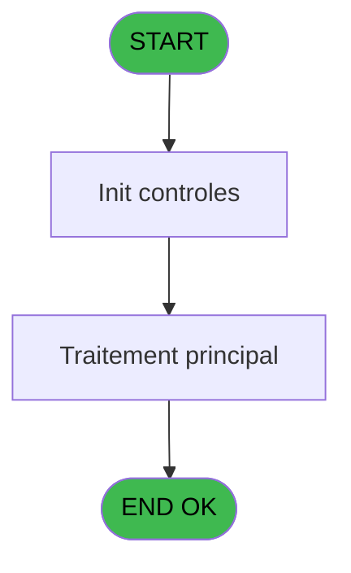
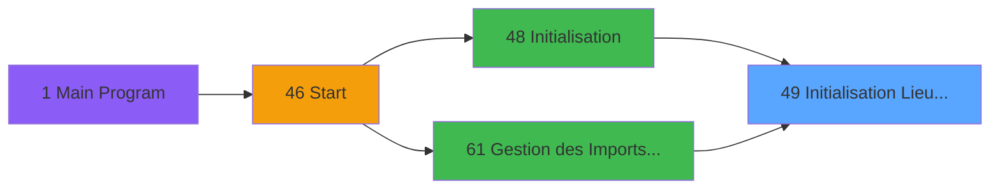

# PBS IDE 49 - Initialisation Lieu Sejour

> **Analyse**: Phases 1-4 2026-02-03 17:17 -> 17:17 (17s) | Assemblage 17:17
> **Pipeline**: V7.2 Enrichi
> **Structure**: 4 onglets (Resume | Ecrans | Donnees | Connexions)

<!-- TAB:Resume -->

## 1. FICHE D'IDENTITE

| Attribut | Valeur |
|----------|--------|
| Projet | PBS |
| IDE Position | 49 |
| Nom Programme | Initialisation Lieu Sejour |
| Fichier source | `Prg_49.xml` |
| Dossier IDE | Start |
| Taches | 5 (0 ecrans visibles) |
| Tables modifiees | 0 |
| Programmes appeles | 0 |

## 2. DESCRIPTION FONCTIONNELLE

**Initialisation Lieu Sejour** assure la gestion complete de ce processus, accessible depuis [Initialisation (IDE 48)](PBS-IDE-48.md), [Gestion des Imports ########## (IDE 61)](PBS-IDE-61.md).

Le flux de traitement s'organise en **2 blocs fonctionnels** :

- **Traitement** (4 taches) : traitements metier divers
- **Initialisation** (1 tache) : reinitialisation d'etats et de variables de travail

Detail : phases du traitement

#### Phase 1 : Traitement (4 taches)

- **49** - (sans nom)
- **49.2** - Lieu General
- **49.3** - Lieu General
- **49.4** - Lieu sejour Defaut

#### Phase 2 : Initialisation (1 tache)

- **49.1** - Initialisation Nom Import **[[ECRAN]](#ecran-t2)**

## 3. BLOCS FONCTIONNELS

### 3.1 Traitement (4 taches)

Traitements internes.

---

#### 49 - (sans nom)

**Role** : Traitement interne.

3 sous-taches directes

| Tache | Nom | Bloc |
|-------|-----|------|
| [49.2](#t3) | Lieu General | Traitement |
| [49.3](#t4) | Lieu General | Traitement |
| [49.4](#t5) | Lieu sejour Defaut | Traitement |

---

#### 49.2 - Lieu General

**Role** : Traitement : Lieu General.
**Variables liees** : A (< Nombre Lieu Sejour), B (< Code Lieu Sejour)

---

#### 49.3 - Lieu General

**Role** : Traitement : Lieu General.
**Variables liees** : A (< Nombre Lieu Sejour), B (< Code Lieu Sejour)

---

#### 49.4 - Lieu sejour Defaut

**Role** : Traitement : Lieu sejour Defaut.
**Variables liees** : A (< Nombre Lieu Sejour), B (< Code Lieu Sejour)

### 3.2 Initialisation (1 tache)

Reinitialisation d'etats et variables de travail.

---

#### 49.1 - Initialisation Nom Import [[ECRAN]](#ecran-t2)

**Role** : Reinitialisation : Initialisation Nom Import.
**Ecran** : 197 x 106 DLU (MDI) | [Voir mockup](#ecran-t2)
**Variables liees** : C (< Nom Import)

## 5. REGLES METIER

*(Aucune regle metier identifiee)*

## 6. CONTEXTE

- **Appele par**: [Initialisation (IDE 48)](PBS-IDE-48.md), [Gestion des Imports ########## (IDE 61)](PBS-IDE-61.md)
- **Appelle**: 0 programmes | **Tables**: 2 (W:0 R:2 L:0) | **Taches**: 5 | **Expressions**: 8

<!-- TAB:Ecrans -->

## 8. ECRANS

*(Programme sans ecran visible)*

## 9. NAVIGATION

### 9.3 Structure hierarchique (5 taches)

| Position | Tache | Type | Dimensions | Bloc |
|----------|-------|------|------------|------|
| **49.1** | [**(sans nom)** (49)](#t1) | MDI | - | Traitement |
| 49.1.1 | [Lieu General (49.2)](#t3) | MDI | - | |
| 49.1.2 | [Lieu General (49.3)](#t4) | MDI | - | |
| 49.1.3 | [Lieu sejour Defaut (49.4)](#t5) | - | - | |
| **49.2** | [**Initialisation Nom Import** (49.1)](#t2) [mockup](#ecran-t2) | MDI | 197x106 | Initialisation |

### 9.4 Algorigramme

> **Legende**: Vert = START/END OK | Rouge = END KO | Bleu = Decisions
> *Algorigramme auto-genere. Utiliser `/algorigramme` pour une synthese metier detaillee.*

<!-- TAB:Donnees -->

## 10. TABLES

### Tables utilisees (2)

| ID | Nom | Description | Type | R | W | L | Usages |
|----|-----|-------------|------|---|---|---|--------|
| 81 | societe__________soc |  | DB | R |   |   | 1 |
| 118 | tables_imports |  | DB | R |   |   | 3 |

### Colonnes par table (0 / 2 tables avec colonnes identifiees)

Table 81 - societe__________soc (R) - 1 usages

*Table utilisee uniquement en Link ou aucune colonne Real identifiee dans le DataView.*

Table 118 - tables_imports (R) - 3 usages

*Table utilisee uniquement en Link ou aucune colonne Real identifiee dans le DataView.*

## 11. VARIABLES

### 11.1 Autres (3)

Variables diverses.

| Lettre | Nom | Type | Usage dans |
|--------|-----|------|-----------|
| A | < Nombre Lieu Sejour | Numeric | [49.2](#t3), [49.3](#t4), [49.4](#t5) |
| B | < Code Lieu Sejour | Alpha | [49.2](#t3), [49.3](#t4), [49.4](#t5) |
| C | < Nom Import | Alpha | [49.1](#t2) |

## 12. EXPRESSIONS

**8 / 8 expressions decodees (100%)**

### 12.1 Repartition par type

| Type | Expressions | Regles |
|------|-------------|--------|
| CONDITION | 5 | 0 |
| OTHER | 3 | 0 |

### 12.2 Expressions cles par type

#### CONDITION (5 expressions)

| Type | IDE | Expression | Regle |
|------|-----|------------|-------|
| CONDITION | 4 | `SetParam ('CODE_LIEU_SEJOUR',< Code Lieu Sejour [B])` | - |
| CONDITION | 5 | `SetParam ('NOM_IMPORT',< Nom Import [C])` | - |
| CONDITION | 3 | `SetParam ('NB_LIEU_SEJOUR',< Nombre Lieu Sejour [A])` | - |
| CONDITION | 1 | `< Nombre Lieu Sejour [A]=0` | - |
| CONDITION | 2 | `< Nombre Lieu Sejour [A]>0` | - |

#### OTHER (3 expressions)

| Type | IDE | Expression | Regle |
|------|-----|------------|-------|
| OTHER | 8 | `GetParam ('NOM_IMPORT')` | - |
| OTHER | 7 | `GetParam ('CODE_LIEU_SEJOUR')` | - |
| OTHER | 6 | `GetParam ('NB_LIEU_SEJOUR')` | - |

<!-- TAB:Connexions -->

## 13. GRAPHE D'APPELS

### 13.1 Chaine depuis Main (Callers)

Main -> ... -> [Initialisation (IDE 48)](PBS-IDE-48.md) -> **Initialisation Lieu Sejour (IDE 49)**

Main -> ... -> [Gestion des Imports ########## (IDE 61)](PBS-IDE-61.md) -> **Initialisation Lieu Sejour (IDE 49)**

### 13.2 Callers

| IDE | Nom Programme | Nb Appels |
|-----|---------------|-----------|
| [48](PBS-IDE-48.md) | Initialisation | 1 |
| [61](PBS-IDE-61.md) | Gestion des Imports ########## | 1 |

### 13.3 Callees (programmes appeles)

### 13.4 Detail Callees avec contexte

| IDE | Nom Programme | Appels | Contexte |
|-----|---------------|--------|----------|
| - | (aucun) | - | - |

## 14. RECOMMANDATIONS MIGRATION

### 14.1 Profil du programme

| Metrique | Valeur | Impact migration |
|----------|--------|-----------------|
| Lignes de logique | 37 | Programme compact |
| Expressions | 8 | Peu de logique |
| Tables WRITE | 0 | Impact faible |
| Sous-programmes | 0 | Peu de dependances |
| Ecrans visibles | 0 | Ecran unique ou traitement batch |
| Code desactive | 0% (0 / 37) | Code sain |
| Regles metier | 0 | Pas de regle identifiee |

### 14.2 Plan de migration par bloc

#### Traitement (4 taches: 0 ecran, 4 traitements)

- **Strategie** : 4 service(s) backend injectable(s) (Domain Services).
- Decomposer les taches en services unitaires testables.

#### Initialisation (1 tache: 1 ecran, 0 traitement)

- **Strategie** : Constructeur/methode `InitAsync()` dans l'orchestrateur.

### 14.3 Dependances critiques

| Dependance | Type | Appels | Impact |
|------------|------|--------|--------|

---
*Spec DETAILED generee par Pipeline V7.2 - 2026-02-03 17:17*
