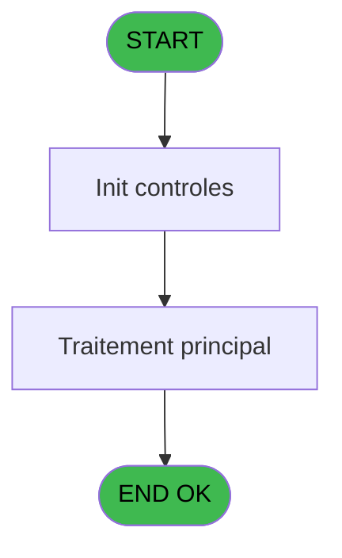

# PBS IDE 53 - Alimentation Combos PARIS 3

> **Analyse**: Phases 1-4 2026-02-03 17:18 -> 17:19 (18s) | Assemblage 17:19
> **Pipeline**: V7.2 Enrichi
> **Structure**: 4 onglets (Resume | Ecrans | Donnees | Connexions)

<!-- TAB:Resume -->

## 1. FICHE D'IDENTITE

| Attribut | Valeur |
|----------|--------|
| Projet | PBS |
| IDE Position | 53 |
| Nom Programme | Alimentation Combos PARIS 3 |
| Fichier source | `Prg_53.xml` |
| Dossier IDE | Start |
| Taches | 1 (0 ecrans visibles) |
| Tables modifiees | 0 |
| Programmes appeles | 1 |

## 2. DESCRIPTION FONCTIONNELLE

**Alimentation Combos PARIS 3** assure la gestion complete de ce processus, accessible depuis [Initialisation (IDE 48)](PBS-IDE-48.md).

Le flux de traitement s'organise en **1 blocs fonctionnels** :

- **Traitement** (1 tache) : traitements metier divers

**Logique metier** : 1 regles identifiees couvrant conditions metier.

## 3. BLOCS FONCTIONNELS

### 3.1 Traitement (1 tache)

Traitements internes.

---

#### 53 - Êcran [[ECRAN]](#ecran-t1)

**Role** : Traitement : Êcran.
**Ecran** : 573 x 251 DLU (MDI) | [Voir mockup](#ecran-t1)
**Delegue a** : [  Suppression Carac interdit (IDE 56)](PBS-IDE-56.md)

## 5. REGLES METIER

1 regles identifiees:

### Autres (1 regles)

#### [RM-001] Si GetParam ('CODELANGUE')='FRA' alors 'F' sinon 'G')

| Element | Detail |
|---------|--------|
| **Condition** | `GetParam ('CODELANGUE')='FRA'` |
| **Si vrai** | 'F' |
| **Si faux** | 'G') |
| **Expression source** | Expression 6 : `IF (GetParam ('CODELANGUE')='FRA','F','G')` |
| **Exemple** | Si GetParam ('CODELANGUE')='FRA' → 'F'. Sinon → 'G') |

## 6. CONTEXTE

- **Appele par**: [Initialisation (IDE 48)](PBS-IDE-48.md)
- **Appelle**: 1 programmes | **Tables**: 1 (W:0 R:1 L:0) | **Taches**: 1 | **Expressions**: 7

<!-- TAB:Ecrans -->

## 8. ECRANS

*(Programme sans ecran visible)*

## 9. NAVIGATION

### 9.3 Structure hierarchique (1 tache)

| Position | Tache | Type | Dimensions | Bloc |
|----------|-------|------|------------|------|
| **53.1** | [**Êcran** (53)](#t1) [mockup](#ecran-t1) | MDI | 573x251 | Traitement |

### 9.4 Algorigramme

> **Legende**: Vert = START/END OK | Rouge = END KO | Bleu = Decisions
> *Algorigramme auto-genere. Utiliser `/algorigramme` pour une synthese metier detaillee.*

<!-- TAB:Donnees -->

## 10. TABLES

### Tables utilisees (1)

| ID | Nom | Description | Type | R | W | L | Usages |
|----|-----|-------------|------|---|---|---|--------|
| 112 | tables_paris |  | DB | R |   |   | 1 |

### Colonnes par table (1 / 1 tables avec colonnes identifiees)

Table 112 - tables_paris (R) - 1 usages

| Lettre | Variable | Acces | Type |
|--------|----------|-------|------|
| A | > Table | R | Alpha |
| B | > Longueur Code | R | Numeric |
| C | > Nom Combo | R | Alpha |
| D | v.Combo | R | Alpha |

## 11. VARIABLES

### 11.1 Variables de session (1)

Variables persistantes pendant toute la session.

| Lettre | Nom | Type | Usage dans |
|--------|-----|------|-----------|
| D | v.Combo | Alpha | 2x session |

### 11.2 Autres (3)

Variables diverses.

| Lettre | Nom | Type | Usage dans |
|--------|-----|------|-----------|
| A | > Table | Alpha | 1x refs |
| B | > Longueur Code | Numeric | 2x refs |
| C | > Nom Combo | Alpha | 1x refs |

## 12. EXPRESSIONS

**7 / 7 expressions decodees (100%)**

### 12.1 Repartition par type

| Type | Expressions | Regles |
|------|-------------|--------|
| CONDITION | 5 | 5 |
| CONCATENATION | 2 | 0 |

### 12.2 Expressions cles par type

#### CONDITION (5 expressions)

| Type | IDE | Expression | Regle |
|------|-----|------------|-------|
| CONDITION | 6 | `IF (GetParam ('CODELANGUE')='FRA','F','G')` | [RM-001](#rm-RM-001) |
| CONDITION | 5 | `> Table [A]` | - |
| CONDITION | 7 | `SetParam (Trim (> Nom Combo [C]),v.Combo [D])` | - |
| CONDITION | 1 | `Counter (0)=1` | - |
| CONDITION | 2 | `Counter (0)<>1` | - |

#### CONCATENATION (2 expressions)

| Type | IDE | Expression | Regle |
|------|-----|------------|-------|
| CONCATENATION | 4 | `Trim (v.Combo [D])&','&Trim (Left ([G],> Longueur Code [B])&'  '&Trim ([H]))` | - |
| CONCATENATION | 3 | `Left ([G],> Longueur Code [B])&'  '&Trim ([H])` | - |

<!-- TAB:Connexions -->

## 13. GRAPHE D'APPELS

### 13.1 Chaine depuis Main (Callers)

Main -> ... -> [Initialisation (IDE 48)](PBS-IDE-48.md) -> **Alimentation Combos PARIS 3 (IDE 53)**

### 13.2 Callers

| IDE | Nom Programme | Nb Appels |
|-----|---------------|-----------|
| [48](PBS-IDE-48.md) | Initialisation | 1 |

### 13.3 Callees (programmes appeles)

### 13.4 Detail Callees avec contexte

| IDE | Nom Programme | Appels | Contexte |
|-----|---------------|--------|----------|
| [56](PBS-IDE-56.md) |   Suppression Carac interdit | 1 | Validation saisie |

## 14. RECOMMANDATIONS MIGRATION

### 14.1 Profil du programme

| Metrique | Valeur | Impact migration |
|----------|--------|-----------------|
| Lignes de logique | 16 | Programme compact |
| Expressions | 7 | Peu de logique |
| Tables WRITE | 0 | Impact faible |
| Sous-programmes | 1 | Peu de dependances |
| Ecrans visibles | 0 | Ecran unique ou traitement batch |
| Code desactive | 0% (0 / 16) | Code sain |
| Regles metier | 1 | Quelques regles a preserver |

### 14.2 Plan de migration par bloc

#### Traitement (1 tache: 1 ecran, 0 traitement)

- **Strategie** : 1 composant(s) UI (Razor/React) avec formulaires et validation.
- 1 sous-programme(s) a migrer ou a reutiliser depuis les services existants.
- Decomposer les taches en services unitaires testables.

### 14.3 Dependances critiques

| Dependance | Type | Appels | Impact |
|------------|------|--------|--------|
| [  Suppression Carac interdit (IDE 56)](PBS-IDE-56.md) | Sous-programme | 1x | Normale - Validation saisie |

---
*Spec DETAILED generee par Pipeline V7.2 - 2026-02-03 17:19*
