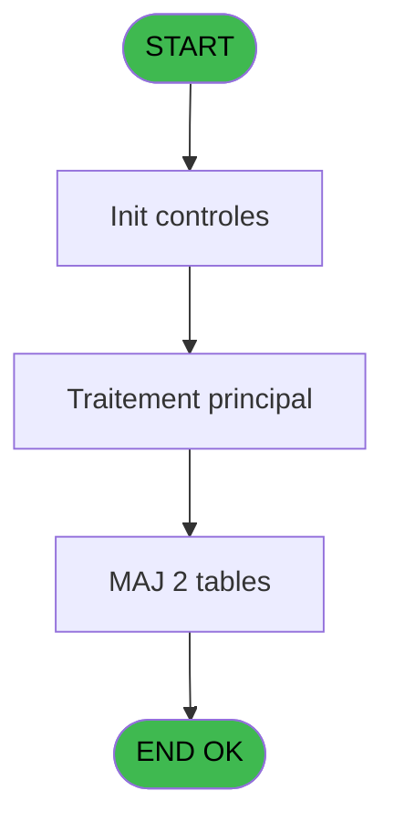
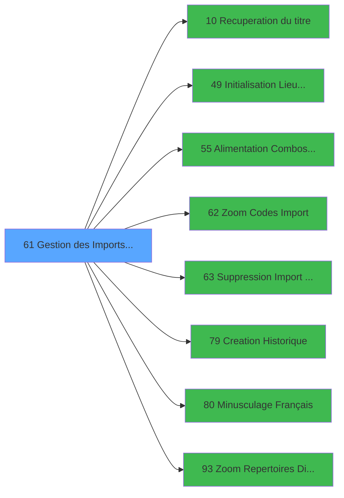

# PBS IDE 61 - Gestion des Imports ##########

> **Analyse**: Phases 1-4 2026-02-03 17:21 -> 17:21 (17s) | Assemblage 17:21
> **Pipeline**: V7.2 Enrichi
> **Structure**: 4 onglets (Resume | Ecrans | Donnees | Connexions)

<!-- TAB:Resume -->

## 1. FICHE D'IDENTITE

| Attribut | Valeur |
|----------|--------|
| Projet | PBS |
| IDE Position | 61 |
| Nom Programme | Gestion des Imports ########## |
| Fichier source | `Prg_61.xml` |
| Dossier IDE | Utilitaires |
| Taches | 6 (1 ecrans visibles) |
| Tables modifiees | 2 |
| Programmes appeles | 8 |
| :warning: Statut | **ORPHELIN_POTENTIEL** |

## 2. DESCRIPTION FONCTIONNELLE

**Gestion des Imports ##########** assure la gestion complete de ce processus.

Le flux de traitement s'organise en **3 blocs fonctionnels** :

- **Traitement** (3 taches) : traitements metier divers
- **Creation** (2 taches) : insertion d'enregistrements en base (mouvements, prestations)
- **Consultation** (1 tache) : ecrans de recherche, selection et consultation

**Donnees modifiees** : 2 tables en ecriture (societe__________soc, applications).

**Logique metier** : 2 regles identifiees couvrant conditions metier.

Detail : phases du traitement

#### Phase 1 : Traitement (3 taches)

- **61** - Êcran **[[ECRAN]](#ecran-t1)**
- **61.1.1** - Effaçage temporaire
- **61.3** - Mise à Jour Combo

Delegue a : [Recuperation du titre (IDE 10)](PBS-IDE-10.md), [  Alimentation Combos LIEU SEJ (IDE 55)](PBS-IDE-55.md), [  Suppression Import ######### (IDE 63)](PBS-IDE-63.md), [Minusculage Français (IDE 80)](PBS-IDE-80.md)

#### Phase 2 : Creation (2 taches)

- **61.1** - Creation Code Import **[[ECRAN]](#ecran-t2)**
- **61.1.2** - Creation Batch

Delegue a : [Creation Historique (IDE 79)](PBS-IDE-79.md)

#### Phase 3 : Consultation (1 tache)

- **61.2** - Selection Code Import **[[ECRAN]](#ecran-t5)**

Delegue a : [Recuperation du titre (IDE 10)](PBS-IDE-10.md), [  Zoom Codes Import (IDE 62)](PBS-IDE-62.md), [Zoom Repertoires Dispatch (IDE 93)](PBS-IDE-93.md)

#### Tables impactees

| Table | Operations | Role metier |
|-------|-----------|-------------|
| applications | **W** (3 usages) |  |
| societe__________soc | **W** (1 usages) |  |

## 3. BLOCS FONCTIONNELS

### 3.1 Traitement (3 taches)

Traitements internes.

---

#### 61 - Êcran [[ECRAN]](#ecran-t1)

**Role** : Traitement : Êcran.
**Ecran** : 1126 x 209 DLU (MDI) | [Voir mockup](#ecran-t1)
**Delegue a** : [Recuperation du titre (IDE 10)](PBS-IDE-10.md), [  Alimentation Combos LIEU SEJ (IDE 55)](PBS-IDE-55.md), [  Suppression Import ######### (IDE 63)](PBS-IDE-63.md)

---

#### 61.1.1 - Effaçage temporaire

**Role** : Traitement : Effaçage temporaire.
**Delegue a** : [Recuperation du titre (IDE 10)](PBS-IDE-10.md), [  Alimentation Combos LIEU SEJ (IDE 55)](PBS-IDE-55.md), [  Suppression Import ######### (IDE 63)](PBS-IDE-63.md)

---

#### 61.3 - Mise à Jour Combo

**Role** : Traitement : Mise à Jour Combo.
**Variables liees** : C (v.MàJ Combo), I (v.Ancien Code Lieu Sejour)
**Delegue a** : [Recuperation du titre (IDE 10)](PBS-IDE-10.md), [  Alimentation Combos LIEU SEJ (IDE 55)](PBS-IDE-55.md), [  Suppression Import ######### (IDE 63)](PBS-IDE-63.md)

### 3.2 Creation (2 taches)

Insertion de nouveaux enregistrements en base.

---

#### 61.1 - Creation Code Import [[ECRAN]](#ecran-t2)

**Role** : Creation d'enregistrement : Creation Code Import.
**Ecran** : 611 x 0 DLU (MDI) | [Voir mockup](#ecran-t2)
**Variables liees** : D (v. code), I (v.Ancien Code Lieu Sejour)
**Delegue a** : [Creation Historique (IDE 79)](PBS-IDE-79.md)

---

#### 61.1.2 - Creation Batch

**Role** : Creation d'enregistrement : Creation Batch.
**Delegue a** : [Creation Historique (IDE 79)](PBS-IDE-79.md)

### 3.3 Consultation (1 tache)

Ecrans de recherche et consultation.

---

#### 61.2 - Selection Code Import [[ECRAN]](#ecran-t5)

**Role** : Selection par l'operateur : Selection Code Import.
**Ecran** : 395 x 0 DLU (MDI) | [Voir mockup](#ecran-t5)
**Variables liees** : D (v. code), I (v.Ancien Code Lieu Sejour)
**Delegue a** : [  Zoom Codes Import (IDE 62)](PBS-IDE-62.md), [Zoom Repertoires Dispatch (IDE 93)](PBS-IDE-93.md)

## 5. REGLES METIER

2 regles identifiees:

### Autres (2 regles)

#### [RM-001] Si [N]='N' alors 110 sinon 145)

| Element | Detail |
|---------|--------|
| **Condition** | `[N]='N'` |
| **Si vrai** | 110 |
| **Si faux** | 145) |
| **Expression source** | Expression 3 : `IF ([N]='N',110,145)` |
| **Exemple** | Si [N]='N' → 110. Sinon → 145) |

#### [RM-002] Si [M]='N' alors 'CIMP' sinon 'MIMP')

| Element | Detail |
|---------|--------|
| **Condition** | `[M]='N'` |
| **Si vrai** | 'CIMP' |
| **Si faux** | 'MIMP') |
| **Expression source** | Expression 11 : `IF ([M]='N','CIMP','MIMP')` |
| **Exemple** | Si [M]='N' → 'CIMP'. Sinon → 'MIMP') |

## 6. CONTEXTE

- **Appele par**: (aucun)
- **Appelle**: 8 programmes | **Tables**: 5 (W:2 R:1 L:2) | **Taches**: 6 | **Expressions**: 26

<!-- TAB:Ecrans -->

## 8. ECRANS

### 8.1 Forms visibles (1 / 6)

| # | Position | Tache | Nom | Type | Largeur | Hauteur | Bloc |
|---|----------|-------|-----|------|---------|---------|------|
| 1 | 61 | 61 | Êcran | MDI | 1126 | 209 | Traitement |

### 8.2 Mockups Ecrans

---

#### 61 - Êcran
**Tache** : [61](#t1) | **Type** : MDI | **Dimensions** : 1126 x 209 DLU
**Bloc** : Traitement | **Titre IDE** : Êcran

<!-- FORM-DATA:
{
    "width":  1126,
    "vFactor":  8,
    "type":  "MDI",
    "hFactor":  8,
    "controls":  [
                     {
                         "x":  0,
                         "type":  "label",
                         "var":  "",
                         "y":  2,
                         "w":  1121,
                         "fmt":  "",
                         "name":  "",
                         "h":  20,
                         "color":  "",
                         "text":  "",
                         "parent":  null
                     },
                     {
                         "x":  538,
                         "type":  "label",
                         "var":  "",
                         "y":  29,
                         "w":  76,
                         "fmt":  "",
                         "name":  "",
                         "h":  10,
                         "color":  "",
                         "text":  "Société",
                         "parent":  null
                     },
                     {
                         "x":  11,
                         "type":  "table",
                         "var":  "",
                         "name":  "",
                         "titleH":  12,
                         "color":  "110",
                         "w":  449,
                         "y":  31,
                         "fmt":  "",
                         "parent":  null,
                         "text":  "",
                         "rowH":  14,
                         "h":  140,
                         "cols":  [
                                      {
                                          "title":  "Libellé import",
                                          "layer":  1,
                                          "w":  320
                                      },
                                      {
                                          "title":  "Code",
                                          "layer":  2,
                                          "w":  90
                                      }
                                  ],
                         "rows":  2
                     },
                     {
                         "x":  471,
                         "type":  "label",
                         "var":  "",
                         "y":  41,
                         "w":  630,
                         "fmt":  "",
                         "name":  "",
                         "h":  129,
                         "color":  "195",
                         "text":  "Fichiers",
                         "parent":  null
                     },
                     {
                         "x":  480,
                         "type":  "label",
                         "var":  "",
                         "y":  55,
                         "w":  112,
                         "fmt":  "",
                         "name":  "",
                         "h":  10,
                         "color":  "",
                         "text":  "Unité/Chemin",
                         "parent":  9
                     },
                     {
                         "x":  482,
                         "type":  "label",
                         "var":  "",
                         "y":  71,
                         "w":  64,
                         "fmt":  "",
                         "name":  "",
                         "h":  10,
                         "color":  "",
                         "text":  "Identité",
                         "parent":  9
                     },
                     {
                         "x":  480,
                         "type":  "label",
                         "var":  "",
                         "y":  88,
                         "w":  125,
                         "fmt":  "",
                         "name":  "",
                         "h":  10,
                         "color":  "",
                         "text":  "Fractionnement",
                         "parent":  9
                     },
                     {
                         "x":  478,
                         "type":  "label",
                         "var":  "",
                         "y":  105,
                         "w":  88,
                         "fmt":  "",
                         "name":  "",
                         "h":  10,
                         "color":  "",
                         "text":  "Annulation",
                         "parent":  9
                     },
                     {
                         "x":  478,
                         "type":  "label",
                         "var":  "",
                         "y":  121,
                         "w":  99,
                         "fmt":  "",
                         "name":  "",
                         "h":  10,
                         "color":  "",
                         "text":  "Modification",
                         "parent":  9
                     },
                     {
                         "x":  480,
                         "type":  "label",
                         "var":  "",
                         "y":  138,
                         "w":  160,
                         "fmt":  "",
                         "name":  "",
                         "h":  8,
                         "color":  "",
                         "text":  "Repertoire Siège",
                         "parent":  9
                     },
                     {
                         "x":  0,
                         "type":  "label",
                         "var":  "",
                         "y":  181,
                         "w":  1121,
                         "fmt":  "",
                         "name":  "",
                         "h":  24,
                         "color":  "",
                         "text":  "",
                         "parent":  null
                     },
                     {
                         "x":  645,
                         "type":  "edit",
                         "var":  "",
                         "y":  29,
                         "w":  277,
                         "fmt":  "",
                         "name":  "",
                         "h":  10,
                         "color":  "",
                         "text":  "",
                         "parent":  null
                     },
                     {
                         "x":  46,
                         "type":  "edit",
                         "var":  "",
                         "y":  47,
                         "w":  277,
                         "fmt":  "",
                         "name":  "NOM IMPORT",
                         "h":  8,
                         "color":  "110",
                         "text":  "",
                         "parent":  6
                     },
                     {
                         "x":  360,
                         "type":  "edit",
                         "var":  "",
                         "y":  47,
                         "w":  42,
                         "fmt":  "",
                         "name":  "",
                         "h":  8,
                         "color":  "110",
                         "text":  "",
                         "parent":  6
                     },
                     {
                         "x":  644,
                         "type":  "edit",
                         "var":  "",
                         "y":  55,
                         "w":  347,
                         "fmt":  "U30",
                         "name":  "",
                         "h":  9,
                         "color":  "",
                         "text":  "",
                         "parent":  9
                     },
                     {
                         "x":  644,
                         "type":  "edit",
                         "var":  "",
                         "y":  71,
                         "w":  149,
                         "fmt":  "",
                         "name":  "IDENTITE",
                         "h":  10,
                         "color":  "110",
                         "text":  "",
                         "parent":  9
                     },
                     {
                         "x":  644,
                         "type":  "edit",
                         "var":  "",
                         "y":  88,
                         "w":  149,
                         "fmt":  "",
                         "name":  "FRACTIONNEMENT",
                         "h":  10,
                         "color":  "110",
                         "text":  "",
                         "parent":  9
                     },
                     {
                         "x":  644,
                         "type":  "edit",
                         "var":  "",
                         "y":  105,
                         "w":  149,
                         "fmt":  "",
                         "name":  "ANNULATION",
                         "h":  10,
                         "color":  "110",
                         "text":  "",
                         "parent":  9
                     },
                     {
                         "x":  644,
                         "type":  "edit",
                         "var":  "",
                         "y":  121,
                         "w":  149,
                         "fmt":  "",
                         "name":  "COMPLEMENT",
                         "h":  10,
                         "color":  "110",
                         "text":  "",
                         "parent":  9
                     },
                     {
                         "x":  646,
                         "type":  "edit",
                         "var":  "",
                         "y":  138,
                         "w":  149,
                         "fmt":  "",
                         "name":  "EXPORT",
                         "h":  10,
                         "color":  "110",
                         "text":  "",
                         "parent":  9
                     },
                     {
                         "x":  797,
                         "type":  "button",
                         "var":  "",
                         "y":  138,
                         "w":  30,
                         "fmt":  "",
                         "name":  "b_Zoom Dispatch",
                         "h":  10,
                         "color":  "",
                         "text":  "",
                         "parent":  9
                     },
                     {
                         "x":  644,
                         "type":  "edit",
                         "var":  "",
                         "y":  152,
                         "w":  448,
                         "fmt":  "",
                         "name":  "",
                         "h":  10,
                         "color":  "142",
                         "text":  "",
                         "parent":  9
                     },
                     {
                         "x":  6,
                         "type":  "edit",
                         "var":  "",
                         "y":  8,
                         "w":  396,
                         "fmt":  "30",
                         "name":  "",
                         "h":  8,
                         "color":  "",
                         "text":  "",
                         "parent":  null
                     },
                     {
                         "x":  913,
                         "type":  "edit",
                         "var":  "",
                         "y":  8,
                         "w":  203,
                         "fmt":  "WWW DD MMM YYYYT",
                         "name":  "",
                         "h":  8,
                         "color":  "",
                         "text":  "",
                         "parent":  null
                     },
                     {
                         "x":  836,
                         "type":  "image",
                         "var":  "",
                         "y":  87,
                         "w":  104,
                         "fmt":  "",
                         "name":  "",
                         "h":  38,
                         "color":  "",
                         "text":  "",
                         "parent":  9
                     },
                     {
                         "x":  5,
                         "type":  "button",
                         "var":  "",
                         "y":  184,
                         "w":  154,
                         "fmt":  "\u0026Quitter",
                         "name":  "",
                         "h":  18,
                         "color":  "",
                         "text":  "",
                         "parent":  27
                     },
                     {
                         "x":  473,
                         "type":  "button",
                         "var":  "",
                         "y":  184,
                         "w":  154,
                         "fmt":  "\u0026Visualisation",
                         "name":  "",
                         "h":  18,
                         "color":  "",
                         "text":  "",
                         "parent":  null
                     },
                     {
                         "x":  636,
                         "type":  "button",
                         "var":  "",
                         "y":  184,
                         "w":  154,
                         "fmt":  "\u0026Modification",
                         "name":  "",
                         "h":  18,
                         "color":  "",
                         "text":  "",
                         "parent":  null
                     },
                     {
                         "x":  799,
                         "type":  "button",
                         "var":  "",
                         "y":  184,
                         "w":  154,
                         "fmt":  "\u0026Annulation",
                         "name":  "",
                         "h":  18,
                         "color":  "",
                         "text":  "",
                         "parent":  null
                     },
                     {
                         "x":  962,
                         "type":  "button",
                         "var":  "",
                         "y":  184,
                         "w":  154,
                         "fmt":  "\u0026Suppression",
                         "name":  "",
                         "h":  18,
                         "color":  "",
                         "text":  "",
                         "parent":  null
                     }
                 ],
    "taskId":  "61",
    "height":  209
}
-->

<strong>Champs : 12 champs</strong>

| Pos (x,y) | Nom | Variable | Type |
|-----------|-----|----------|------|
| 645,29 | (sans nom) | - | edit |
| 46,47 | NOM IMPORT | - | edit |
| 360,47 | (sans nom) | - | edit |
| 644,55 | U30 | - | edit |
| 644,71 | IDENTITE | - | edit |
| 644,88 | FRACTIONNEMENT | - | edit |
| 644,105 | ANNULATION | - | edit |
| 644,121 | COMPLEMENT | - | edit |
| 646,138 | EXPORT | - | edit |
| 644,152 | (sans nom) | - | edit |
| 6,8 | 30 | - | edit |
| 913,8 | WWW DD MMM YYYYT | - | edit |

<strong>Boutons : 6 boutons</strong>

| Bouton | Pos (x,y) | Action |
|--------|-----------|--------|
| b_Zoom Dispatch | 797,138 | Ouvre la selection |
| Quitter | 5,184 | Quitte le programme |
| Visualisation | 473,184 | Bouton fonctionnel |
| Modification | 636,184 | Modifie l'element |
| Annulation | 799,184 | Annule et retour au menu |
| Suppression | 962,184 | Appel [  Suppression Import ######### (IDE 63)](PBS-IDE-63.md) |

## 9. NAVIGATION

Ecran unique: **Êcran**

### 9.3 Structure hierarchique (6 taches)

| Position | Tache | Type | Dimensions | Bloc |
|----------|-------|------|------------|------|
| **61.1** | [**Êcran** (61)](#t1) [mockup](#ecran-t1) | MDI | 1126x209 | Traitement |
| 61.1.1 | [Effaçage temporaire (61.1.1)](#t3) | MDI | - | |
| 61.1.2 | [Mise à Jour Combo (61.3)](#t6) | MDI | - | |
| **61.2** | [**Creation Code Import** (61.1)](#t2) [mockup](#ecran-t2) | MDI | 611x0 | Creation |
| 61.2.1 | [Creation Batch (61.1.2)](#t4) | MDI | - | |
| **61.3** | [**Selection Code Import** (61.2)](#t5) [mockup](#ecran-t5) | MDI | 395x0 | Consultation |

### 9.4 Algorigramme

> **Legende**: Vert = START/END OK | Rouge = END KO | Bleu = Decisions
> *Algorigramme auto-genere. Utiliser `/algorigramme` pour une synthese metier detaillee.*

<!-- TAB:Donnees -->

## 10. TABLES

### Tables utilisees (5)

| ID | Nom | Description | Type | R | W | L | Usages |
|----|-----|-------------|------|---|---|---|--------|
| 81 | societe__________soc |  | DB |   | **W** |   | 1 |
| 112 | tables_paris |  | DB | R |   |   | 1 |
| 118 | tables_imports |  | DB |   |   | L | 2 |
| 670 | applications |  | DB |   | **W** |   | 3 |
| 715 | tpe_par_terminal old |  | DB |   |   | L | 1 |

### Colonnes par table (1 / 3 tables avec colonnes identifiees)

Table 81 - societe__________soc (**W**) - 1 usages

| Lettre | Variable | Acces | Type |
|--------|----------|-------|------|
| A | > societe | W | Alpha |
| B | v. titre | W | Alpha |
| C | v.MàJ Combo | W | Logical |
| D | v. code | W | Alpha |
| E | v.contrôle | W | Logical |
| F | v.valeur Tri | W | Alpha |
| G | v.compteur | W | Numeric |
| H | RC_LNK_1 | W | Logical |
| I | v.Ancien Code Lieu Sejour | W | Alpha |
| J | b_Zoom Dispatch | W | Alpha |

Table 112 - tables_paris (R) - 1 usages

*Table utilisee uniquement en Link ou aucune colonne Real identifiee dans le DataView.*

Table 670 - applications (**W**) - 3 usages

*Table utilisee uniquement en Link ou aucune colonne Real identifiee dans le DataView.*

## 11. VARIABLES

### 11.1 Variables de session (7)

Variables persistantes pendant toute la session.

| Lettre | Nom | Type | Usage dans |
|--------|-----|------|-----------|
| B | v. titre | Alpha | 1x session |
| C | v.MàJ Combo | Logical | [61.3](#t6) |
| D | v. code | Alpha | - |
| E | v.contrôle | Logical | 1x session |
| F | v.valeur Tri | Alpha | - |
| G | v.compteur | Numeric | - |
| I | v.Ancien Code Lieu Sejour | Alpha | - |

### 11.2 Autres (3)

Variables diverses.

| Lettre | Nom | Type | Usage dans |
|--------|-----|------|-----------|
| A | > societe | Alpha | - |
| H | RC_LNK_1 | Logical | - |
| J | b_Zoom Dispatch | Alpha | - |

## 12. EXPRESSIONS

**26 / 26 expressions decodees (100%)**

### 12.1 Repartition par type

| Type | Expressions | Regles |
|------|-------------|--------|
| CONDITION | 10 | 2 |
| CONSTANTE | 1 | 0 |
| DATE | 1 | 0 |
| OTHER | 7 | 0 |
| NEGATION | 3 | 0 |
| REFERENCE_VG | 1 | 0 |
| CAST_LOGIQUE | 1 | 0 |
| STRING | 2 | 0 |

### 12.2 Expressions cles par type

#### CONDITION (10 expressions)

| Type | IDE | Expression | Regle |
|------|-----|------------|-------|
| CONDITION | 11 | `IF ([M]='N','CIMP','MIMP')` | [RM-002](#rm-RM-002) |
| CONDITION | 3 | `IF ([N]='N',110,145)` | [RM-001](#rm-RM-001) |
| CONDITION | 5 | `Len (RTrim (LTrim ([Q])))<6 AND Stat (0,'M'MODE)` | - |
| CONDITION | 4 | `Len (RTrim (LTrim ([P])))<6 AND Stat (0,'M'MODE)` | - |
| CONDITION | 7 | `Len (RTrim (LTrim ([S])))<6 AND Stat (0,'M'MODE)` | - |
| ... | | *+5 autres* | |

#### CONSTANTE (1 expressions)

| Type | IDE | Expression | Regle |
|------|-----|------------|-------|
| CONSTANTE | 16 | `24` | - |

#### DATE (1 expressions)

| Type | IDE | Expression | Regle |
|------|-----|------------|-------|
| DATE | 14 | `Date ()` | - |

#### OTHER (7 expressions)

| Type | IDE | Expression | Regle |
|------|-----|------------|-------|
| OTHER | 22 | `v.MàJ Combo [C]` | - |
| OTHER | 25 | `NOT([X])` | - |
| OTHER | 26 | `ExpCalc('13'EXP)` | - |
| OTHER | 20 | `INIGet ('[MAGIC_LOGICAL_NAMES]club_import')` | - |
| OTHER | 1 | `[N]` | - |
| ... | | *+2 autres* | |

#### NEGATION (3 expressions)

| Type | IDE | Expression | Regle |
|------|-----|------------|-------|
| NEGATION | 19 | `NOT (Stat (0,'E'MODE))` | - |
| NEGATION | 10 | `NOT (Stat (0,'E'MODE))` | - |
| NEGATION | 9 | `NOT (v.contrôle [E])` | - |

#### REFERENCE_VG (1 expressions)

| Type | IDE | Expression | Regle |
|------|-----|------------|-------|
| REFERENCE_VG | 15 | `VG3` | - |

#### CAST_LOGIQUE (1 expressions)

| Type | IDE | Expression | Regle |
|------|-----|------------|-------|
| CAST_LOGIQUE | 21 | `'TRUE'LOG` | - |

#### STRING (2 expressions)

| Type | IDE | Expression | Regle |
|------|-----|------------|-------|
| STRING | 24 | `Trim ([T])` | - |
| STRING | 13 | `Trim (v. titre [B])` | - |

### 12.3 Toutes les expressions (26)

Voir les 26 expressions

#### CONDITION (10)

| IDE | Expression Decodee |
|-----|-------------------|
| 3 | `IF ([N]='N',110,145)` |
| 11 | `IF ([M]='N','CIMP','MIMP')` |
| 2 | `[N]='N'` |
| 8 | `[T]='' AND NOT (Stat (0,'E'MODE))` |
| 18 | `Stat (0,'E'MODE) AND [R]<>'N'` |
| 23 | `[N]<>'G' AND [N]<>'N'` |
| 4 | `Len (RTrim (LTrim ([P])))<6 AND Stat (0,'M'MODE)` |
| 5 | `Len (RTrim (LTrim ([Q])))<6 AND Stat (0,'M'MODE)` |
| 6 | `Len (RTrim (LTrim ([R])))<6 AND Stat (0,'M'MODE)` |
| 7 | `Len (RTrim (LTrim ([S])))<6 AND Stat (0,'M'MODE)` |

#### CONSTANTE (1)

| IDE | Expression Decodee |
|-----|-------------------|
| 16 | `24` |

#### DATE (1)

| IDE | Expression Decodee |
|-----|-------------------|
| 14 | `Date ()` |

#### OTHER (7)

| IDE | Expression Decodee |
|-----|-------------------|
| 1 | `[N]` |
| 12 | `GetParam ('SOCIETE')` |
| 17 | `Stat (0,'M'MODE)` |
| 20 | `INIGet ('[MAGIC_LOGICAL_NAMES]club_import')` |
| 22 | `v.MàJ Combo [C]` |
| 25 | `NOT([X])` |
| 26 | `ExpCalc('13'EXP)` |

#### NEGATION (3)

| IDE | Expression Decodee |
|-----|-------------------|
| 9 | `NOT (v.contrôle [E])` |
| 10 | `NOT (Stat (0,'E'MODE))` |
| 19 | `NOT (Stat (0,'E'MODE))` |

#### REFERENCE_VG (1)

| IDE | Expression Decodee |
|-----|-------------------|
| 15 | `VG3` |

#### CAST_LOGIQUE (1)

| IDE | Expression Decodee |
|-----|-------------------|
| 21 | `'TRUE'LOG` |

#### STRING (2)

| IDE | Expression Decodee |
|-----|-------------------|
| 13 | `Trim (v. titre [B])` |
| 24 | `Trim ([T])` |

<!-- TAB:Connexions -->

## 13. GRAPHE D'APPELS

### 13.1 Chaine depuis Main (Callers)

**Chemin**: (pas de callers directs)

### 13.2 Callers

| IDE | Nom Programme | Nb Appels |
|-----|---------------|-----------|
| - | (aucun) | - |

### 13.3 Callees (programmes appeles)

### 13.4 Detail Callees avec contexte

| IDE | Nom Programme | Appels | Contexte |
|-----|---------------|--------|----------|
| [10](PBS-IDE-10.md) | Recuperation du titre | 1 | Recuperation donnees |
| [49](PBS-IDE-49.md) |   Initialisation Lieu Sejour | 1 | Reinitialisation |
| [55](PBS-IDE-55.md) |   Alimentation Combos LIEU SEJ | 1 | Sous-programme |
| [62](PBS-IDE-62.md) |   Zoom Codes Import | 1 | Selection/consultation |
| [63](PBS-IDE-63.md) |   Suppression Import ######### | 1 | Sous-programme |
| [79](PBS-IDE-79.md) | Creation Historique | 1 | Historique/consultation |
| [80](PBS-IDE-80.md) | Minusculage Français | 1 | Sous-programme |
| [93](PBS-IDE-93.md) | Zoom Repertoires Dispatch | 1 | Selection/consultation |

## 14. RECOMMANDATIONS MIGRATION

### 14.1 Profil du programme

| Metrique | Valeur | Impact migration |
|----------|--------|-----------------|
| Lignes de logique | 125 | Programme compact |
| Expressions | 26 | Peu de logique |
| Tables WRITE | 2 | Impact faible |
| Sous-programmes | 8 | Dependances moderees |
| Ecrans visibles | 1 | Ecran unique ou traitement batch |
| Code desactive | 0% (0 / 125) | Code sain |
| Regles metier | 2 | Quelques regles a preserver |

### 14.2 Plan de migration par bloc

#### Traitement (3 taches: 1 ecran, 2 traitements)

- **Strategie** : Orchestrateur avec 1 ecrans (Razor/React) et 2 traitements backend (services).
- Les ecrans deviennent des composants UI, les traitements invisibles deviennent des services injectables.
- 8 sous-programme(s) a migrer ou a reutiliser depuis les services existants.
- Decomposer les taches en services unitaires testables.

#### Creation (2 taches: 1 ecran, 1 traitement)

- **Strategie** : Repository pattern avec Entity Framework Core.
- Insertion via `IRepository<T>.CreateAsync()`

#### Consultation (1 tache: 1 ecran, 0 traitement)

- **Strategie** : Composants de recherche/selection en modales.
- 1 ecran : Selection Code Import

### 14.3 Dependances critiques

| Dependance | Type | Appels | Impact |
|------------|------|--------|--------|
| societe__________soc | Table WRITE (Database) | 1x | Schema + repository |
| applications | Table WRITE (Database) | 3x | Schema + repository |
| [Creation Historique (IDE 79)](PBS-IDE-79.md) | Sous-programme | 1x | Normale - Historique/consultation |
| [  Suppression Import ######### (IDE 63)](PBS-IDE-63.md) | Sous-programme | 1x | Normale - Sous-programme |
| [Zoom Repertoires Dispatch (IDE 93)](PBS-IDE-93.md) | Sous-programme | 1x | Normale - Selection/consultation |
| [Minusculage Français (IDE 80)](PBS-IDE-80.md) | Sous-programme | 1x | Normale - Sous-programme |
| [  Initialisation Lieu Sejour (IDE 49)](PBS-IDE-49.md) | Sous-programme | 1x | Normale - Reinitialisation |
| [Recuperation du titre (IDE 10)](PBS-IDE-10.md) | Sous-programme | 1x | Normale - Recuperation donnees |
| [  Zoom Codes Import (IDE 62)](PBS-IDE-62.md) | Sous-programme | 1x | Normale - Selection/consultation |
| [  Alimentation Combos LIEU SEJ (IDE 55)](PBS-IDE-55.md) | Sous-programme | 1x | Normale - Sous-programme |

---
*Spec DETAILED generee par Pipeline V7.2 - 2026-02-03 17:21*
