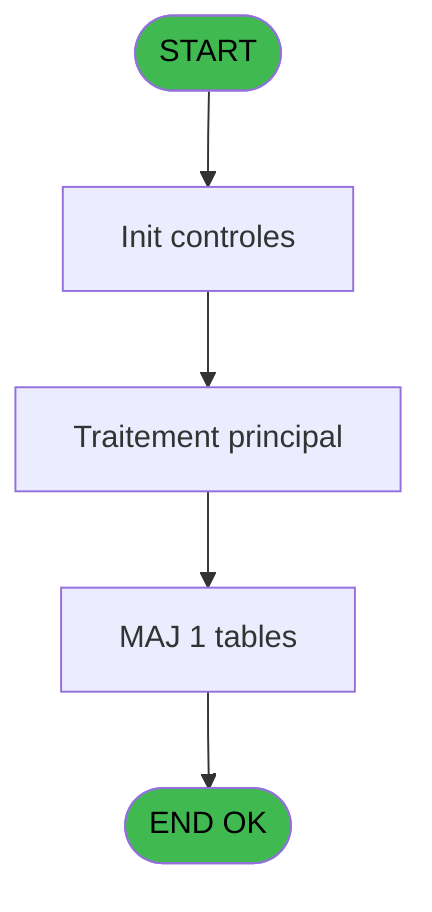
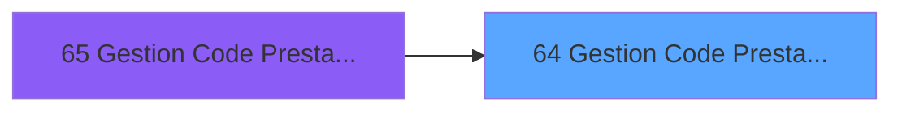
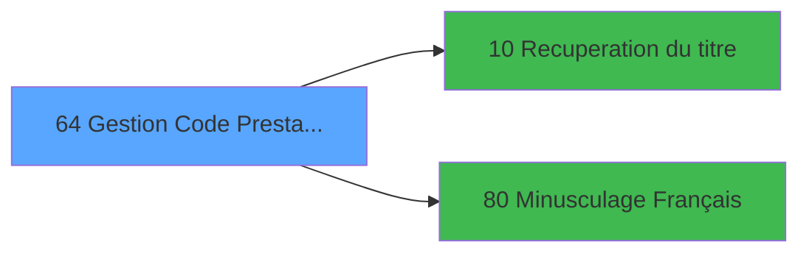

# PBS IDE 64 - Gestion Code Prestation

> **Analyse**: Phases 1-4 2026-02-03 17:22 -> 17:22 (16s) | Assemblage 17:22
> **Pipeline**: V7.2 Enrichi
> **Structure**: 4 onglets (Resume | Ecrans | Donnees | Connexions)

<!-- TAB:Resume -->

## 1. FICHE D'IDENTITE

| Attribut | Valeur |
|----------|--------|
| Projet | PBS |
| IDE Position | 64 |
| Nom Programme | Gestion Code Prestation |
| Fichier source | `Prg_64.xml` |
| Dossier IDE | Utilitaires |
| Taches | 1 (1 ecrans visibles) |
| Tables modifiees | 1 |
| Programmes appeles | 2 |

## 2. DESCRIPTION FONCTIONNELLE

**Gestion Code Prestation** assure la gestion complete de ce processus, accessible depuis [Gestion Code Prestat° PMS-623 (IDE 65)](PBS-IDE-65.md).

Le flux de traitement s'organise en **1 blocs fonctionnels** :

- **Traitement** (1 tache) : traitements metier divers

**Donnees modifiees** : 1 tables en ecriture (libelle_prestation).

**Logique metier** : 1 regles identifiees couvrant conditions metier.

## 3. BLOCS FONCTIONNELS

### 3.1 Traitement (1 tache)

Traitements internes.

---

#### 64 - Êcran [[ECRAN]](#ecran-t1)

**Role** : Traitement : Êcran.
**Ecran** : 659 x 220 DLU (MDI) | [Voir mockup](#ecran-t1)
**Delegue a** : [Recuperation du titre (IDE 10)](PBS-IDE-10.md), [Minusculage Français (IDE 80)](PBS-IDE-80.md)

## 5. REGLES METIER

1 regles identifiees:

### Autres (1 regles)

#### [RM-001] Si VG16 alors '[F]'FORM sinon IF(VG6,'[C]'FORM,'v.contrôle [B]'FORM))

| Element | Detail |
|---------|--------|
| **Condition** | `VG16` |
| **Si vrai** | '[F]'FORM |
| **Si faux** | IF(VG6,'[C]'FORM,'v.contrôle [B]'FORM)) |
| **Variables** | B (v.contrôle) |
| **Expression source** | Expression 11 : `IF(VG16,'[F]'FORM,IF(VG6,'[C]'FORM,'v.contrôle [B]'FORM))` |
| **Exemple** | Si VG16 → '[F]'FORM. Sinon → IF(VG6,'[C]'FORM,'v.contrôle [B]'FORM)) |

## 6. CONTEXTE

- **Appele par**: [Gestion Code Prestat° PMS-623 (IDE 65)](PBS-IDE-65.md)
- **Appelle**: 2 programmes | **Tables**: 1 (W:1 R:0 L:0) | **Taches**: 1 | **Expressions**: 14

<!-- TAB:Ecrans -->

## 8. ECRANS

### 8.1 Forms visibles (1 / 1)

| # | Position | Tache | Nom | Type | Largeur | Hauteur | Bloc |
|---|----------|-------|-----|------|---------|---------|------|
| 1 | 64 | 64 | Êcran | MDI | 659 | 220 | Traitement |

### 8.2 Mockups Ecrans

---

#### 64 - Êcran
**Tache** : [64](#t1) | **Type** : MDI | **Dimensions** : 659 x 220 DLU
**Bloc** : Traitement | **Titre IDE** : Êcran

<!-- FORM-DATA:
{
    "width":  659,
    "vFactor":  8,
    "type":  "MDI",
    "hFactor":  8,
    "controls":  [
                     {
                         "x":  0,
                         "type":  "label",
                         "var":  "",
                         "y":  1,
                         "w":  654,
                         "fmt":  "",
                         "name":  "",
                         "h":  20,
                         "color":  "",
                         "text":  "",
                         "parent":  null
                     },
                     {
                         "x":  26,
                         "type":  "table",
                         "var":  "",
                         "name":  "",
                         "titleH":  12,
                         "color":  "110",
                         "w":  400,
                         "y":  36,
                         "fmt":  "",
                         "parent":  null,
                         "text":  "",
                         "rowH":  13,
                         "h":  144,
                         "cols":  [
                                      {
                                          "title":  "Code",
                                          "layer":  1,
                                          "w":  120
                                      },
                                      {
                                          "title":  "Libellé",
                                          "layer":  2,
                                          "w":  248
                                      }
                                  ],
                         "rows":  2
                     },
                     {
                         "x":  455,
                         "type":  "label",
                         "var":  "",
                         "y":  80,
                         "w":  177,
                         "fmt":  "",
                         "name":  "",
                         "h":  99,
                         "color":  "",
                         "text":  "",
                         "parent":  null
                     },
                     {
                         "x":  1,
                         "type":  "label",
                         "var":  "",
                         "y":  192,
                         "w":  651,
                         "fmt":  "",
                         "name":  "",
                         "h":  24,
                         "color":  "",
                         "text":  "",
                         "parent":  null
                     },
                     {
                         "x":  59,
                         "type":  "edit",
                         "var":  "",
                         "y":  51,
                         "w":  75,
                         "fmt":  "",
                         "name":  "",
                         "h":  8,
                         "color":  "110",
                         "text":  "",
                         "parent":  5
                     },
                     {
                         "x":  156,
                         "type":  "edit",
                         "var":  "",
                         "y":  51,
                         "w":  232,
                         "fmt":  "",
                         "name":  "LIBELLE",
                         "h":  8,
                         "color":  "110",
                         "text":  "",
                         "parent":  5
                     },
                     {
                         "x":  446,
                         "type":  "edit",
                         "var":  "",
                         "y":  6,
                         "w":  203,
                         "fmt":  "WWW DD MMM YYYYT",
                         "name":  "",
                         "h":  8,
                         "color":  "",
                         "text":  "",
                         "parent":  1
                     },
                     {
                         "x":  6,
                         "type":  "edit",
                         "var":  "",
                         "y":  7,
                         "w":  396,
                         "fmt":  "30",
                         "name":  "",
                         "h":  8,
                         "color":  "",
                         "text":  "",
                         "parent":  1
                     },
                     {
                         "x":  456,
                         "type":  "image",
                         "var":  "",
                         "y":  23,
                         "w":  179,
                         "fmt":  "",
                         "name":  "",
                         "h":  56,
                         "color":  "",
                         "text":  "",
                         "parent":  null
                     },
                     {
                         "x":  467,
                         "type":  "button",
                         "var":  "",
                         "y":  86,
                         "w":  154,
                         "fmt":  "\u0026Suppression",
                         "name":  "",
                         "h":  18,
                         "color":  "",
                         "text":  "",
                         "parent":  null
                     },
                     {
                         "x":  466,
                         "type":  "button",
                         "var":  "",
                         "y":  109,
                         "w":  154,
                         "fmt":  "\u0026Visualisation",
                         "name":  "",
                         "h":  18,
                         "color":  "",
                         "text":  "",
                         "parent":  null
                     },
                     {
                         "x":  466,
                         "type":  "button",
                         "var":  "",
                         "y":  132,
                         "w":  154,
                         "fmt":  "\u0026Modification",
                         "name":  "",
                         "h":  18,
                         "color":  "",
                         "text":  "",
                         "parent":  null
                     },
                     {
                         "x":  466,
                         "type":  "button",
                         "var":  "",
                         "y":  155,
                         "w":  154,
                         "fmt":  "\u0026Annulation",
                         "name":  "",
                         "h":  18,
                         "color":  "",
                         "text":  "",
                         "parent":  null
                     },
                     {
                         "x":  7,
                         "type":  "button",
                         "var":  "",
                         "y":  195,
                         "w":  154,
                         "fmt":  "\u0026Quitter",
                         "name":  "",
                         "h":  18,
                         "color":  "",
                         "text":  "",
                         "parent":  12
                     }
                 ],
    "taskId":  "64",
    "height":  220
}
-->

<strong>Champs : 4 champs</strong>

| Pos (x,y) | Nom | Variable | Type |
|-----------|-----|----------|------|
| 59,51 | (sans nom) | - | edit |
| 156,51 | LIBELLE | - | edit |
| 446,6 | WWW DD MMM YYYYT | - | edit |
| 6,7 | 30 | - | edit |

<strong>Boutons : 5 boutons</strong>

| Bouton | Pos (x,y) | Action |
|--------|-----------|--------|
| Suppression | 467,86 | Supprime l'element selectionne |
| Visualisation | 466,109 | Bouton fonctionnel |
| Modification | 466,132 | Modifie l'element |
| Annulation | 466,155 | Annule et retour au menu |
| Quitter | 7,195 | Quitte le programme |

## 9. NAVIGATION

Ecran unique: **Êcran**

### 9.3 Structure hierarchique (1 tache)

| Position | Tache | Type | Dimensions | Bloc |
|----------|-------|------|------------|------|
| **64.1** | [**Êcran** (64)](#t1) [mockup](#ecran-t1) | MDI | 659x220 | Traitement |

### 9.4 Algorigramme

> **Legende**: Vert = START/END OK | Rouge = END KO | Bleu = Decisions
> *Algorigramme auto-genere. Utiliser `/algorigramme` pour une synthese metier detaillee.*

<!-- TAB:Donnees -->

## 10. TABLES

### Tables utilisees (1)

| ID | Nom | Description | Type | R | W | L | Usages |
|----|-----|-------------|------|---|---|---|--------|
| 135 | libelle_prestation | Prestations/services vendus | DB |   | **W** |   | 1 |

### Colonnes par table (1 / 1 tables avec colonnes identifiees)

Table 135 - libelle_prestation (**W**) - 1 usages

| Lettre | Variable | Acces | Type |
|--------|----------|-------|------|
| A | v. titre | W | Alpha |
| B | v.contrôle | W | Logical |

## 11. VARIABLES

### 11.1 Variables de session (2)

Variables persistantes pendant toute la session.

| Lettre | Nom | Type | Usage dans |
|--------|-----|------|-----------|
| A | v. titre | Alpha | 1x session |
| B | v.contrôle | Logical | 1x session |

## 12. EXPRESSIONS

**14 / 14 expressions decodees (100%)**

### 12.1 Repartition par type

| Type | Expressions | Regles |
|------|-------------|--------|
| CONDITION | 3 | 5 |
| CONSTANTE | 2 | 0 |
| DATE | 1 | 0 |
| NEGATION | 2 | 0 |
| OTHER | 3 | 0 |
| REFERENCE_VG | 2 | 0 |
| STRING | 1 | 0 |

### 12.2 Expressions cles par type

#### CONDITION (3 expressions)

| Type | IDE | Expression | Regle |
|------|-----|------------|-------|
| CONDITION | 11 | `IF(VG16,'[F]'FORM,IF(VG6,'[C]'FORM,'v.contrôle [B]'FORM))` | [RM-001](#rm-RM-001) |
| CONDITION | 14 | `[N]='SKI'` | - |
| CONDITION | 9 | `[F]<>''` | - |

#### CONSTANTE (2 expressions)

| Type | IDE | Expression | Regle |
|------|-----|------------|-------|
| CONSTANTE | 12 | `'\ '` | - |
| CONSTANTE | 6 | `25` | - |

#### DATE (1 expressions)

| Type | IDE | Expression | Regle |
|------|-----|------------|-------|
| DATE | 4 | `Date ()` | - |

#### NEGATION (2 expressions)

| Type | IDE | Expression | Regle |
|------|-----|------------|-------|
| NEGATION | 8 | `NOT (Stat (0,'E'MODE))` | - |
| NEGATION | 1 | `NOT ([C])` | - |

#### OTHER (3 expressions)

| Type | IDE | Expression | Regle |
|------|-----|------------|-------|
| OTHER | 10 | `[F]` | - |
| OTHER | 7 | `Stat (0,'E'MODE)` | - |
| OTHER | 2 | `GetParam ('SOCIETE')` | - |

#### REFERENCE_VG (2 expressions)

| Type | IDE | Expression | Regle |
|------|-----|------------|-------|
| REFERENCE_VG | 13 | `VG16` | - |
| REFERENCE_VG | 5 | `VG3` | - |

#### STRING (1 expressions)

| Type | IDE | Expression | Regle |
|------|-----|------------|-------|
| STRING | 3 | `Trim (v. titre [A])` | - |

<!-- TAB:Connexions -->

## 13. GRAPHE D'APPELS

### 13.1 Chaine depuis Main (Callers)

Main -> ... -> [Gestion Code Prestat° PMS-623 (IDE 65)](PBS-IDE-65.md) -> **Gestion Code Prestation (IDE 64)**

### 13.2 Callers

| IDE | Nom Programme | Nb Appels |
|-----|---------------|-----------|
| [65](PBS-IDE-65.md) | Gestion Code Prestat° PMS-623 | 1 |

### 13.3 Callees (programmes appeles)

### 13.4 Detail Callees avec contexte

| IDE | Nom Programme | Appels | Contexte |
|-----|---------------|--------|----------|
| [10](PBS-IDE-10.md) | Recuperation du titre | 1 | Recuperation donnees |
| [80](PBS-IDE-80.md) | Minusculage Français | 1 | Sous-programme |

## 14. RECOMMANDATIONS MIGRATION

### 14.1 Profil du programme

| Metrique | Valeur | Impact migration |
|----------|--------|-----------------|
| Lignes de logique | 15 | Programme compact |
| Expressions | 14 | Peu de logique |
| Tables WRITE | 1 | Impact faible |
| Sous-programmes | 2 | Peu de dependances |
| Ecrans visibles | 1 | Ecran unique ou traitement batch |
| Code desactive | 13.3% (2 / 15) | A verifier |
| Regles metier | 1 | Quelques regles a preserver |

### 14.2 Plan de migration par bloc

#### Traitement (1 tache: 1 ecran, 0 traitement)

- **Strategie** : 1 composant(s) UI (Razor/React) avec formulaires et validation.
- 2 sous-programme(s) a migrer ou a reutiliser depuis les services existants.
- Decomposer les taches en services unitaires testables.

### 14.3 Dependances critiques

| Dependance | Type | Appels | Impact |
|------------|------|--------|--------|
| libelle_prestation | Table WRITE (Database) | 1x | Schema + repository |
| [Minusculage Français (IDE 80)](PBS-IDE-80.md) | Sous-programme | 1x | Normale - Sous-programme |
| [Recuperation du titre (IDE 10)](PBS-IDE-10.md) | Sous-programme | 1x | Normale - Recuperation donnees |

---
*Spec DETAILED generee par Pipeline V7.2 - 2026-02-03 17:22*
