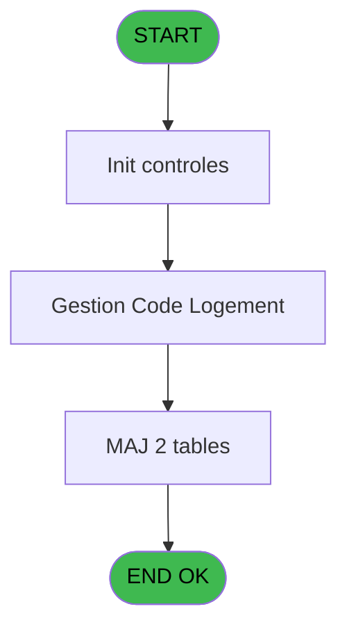
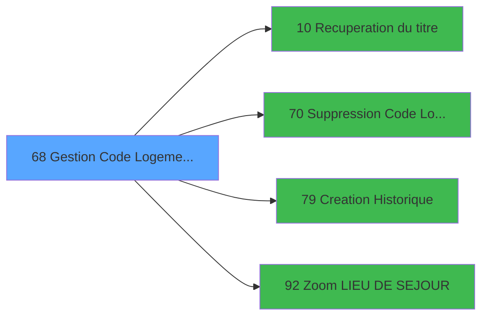

# PBS IDE 68 - Gestion Code Logement pms-626

> **Analyse**: Phases 1-4 2026-02-03 17:23 -> 17:24 (17s) | Assemblage 17:24
> **Pipeline**: V7.2 Enrichi
> **Structure**: 4 onglets (Resume | Ecrans | Donnees | Connexions)

<!-- TAB:Resume -->

## 1. FICHE D'IDENTITE

| Attribut | Valeur |
|----------|--------|
| Projet | PBS |
| IDE Position | 68 |
| Nom Programme | Gestion Code Logement pms-626 |
| Fichier source | `Prg_68.xml` |
| Dossier IDE | Utilitaires |
| Taches | 5 (1 ecrans visibles) |
| Tables modifiees | 2 |
| Programmes appeles | 4 |

## 2. DESCRIPTION FONCTIONNELLE

**Gestion Code Logement pms-626** assure la gestion complete de ce processus, accessible depuis [Gestion Code Logement (IDE 67)](PBS-IDE-67.md).

Le flux de traitement s'organise en **2 blocs fonctionnels** :

- **Traitement** (4 taches) : traitements metier divers
- **Consultation** (1 tache) : ecrans de recherche, selection et consultation

**Donnees modifiees** : 2 tables en ecriture (societe__________soc, code_logement____clo).

**Logique metier** : 1 regles identifiees couvrant conditions metier.

Detail : phases du traitement

#### Phase 1 : Traitement (4 taches)

- **68** - Êcran **[[ECRAN]](#ecran-t1)**
- **68.1** - Êcran **[[ECRAN]](#ecran-t2)**
- **68.2** - Récup Combo catégorie
- **68.3** - Êcran **[[ECRAN]](#ecran-t45)**

Delegue a : [Recuperation du titre (IDE 10)](PBS-IDE-10.md), [Suppression Code Logement (IDE 70)](PBS-IDE-70.md)

#### Phase 2 : Consultation (1 tache)

- **68.1.1** - Selection Lieu deSejour

Delegue a : [Recuperation du titre (IDE 10)](PBS-IDE-10.md), [Zoom LIEU DE SEJOUR (IDE 92)](PBS-IDE-92.md)

#### Tables impactees

| Table | Operations | Role metier |
|-------|-----------|-------------|
| code_logement____clo | **W**/L (2 usages) |  |
| societe__________soc | **W** (1 usages) |  |

## 3. BLOCS FONCTIONNELS

### 3.1 Traitement (4 taches)

Traitements internes.

---

#### 68 - Êcran [[ECRAN]](#ecran-t1)

**Role** : Traitement : Êcran.
**Ecran** : 166 x 22 DLU (MDI) | [Voir mockup](#ecran-t1)

3 sous-taches directes

| Tache | Nom | Bloc |
|-------|-----|------|
| [68.1](#t2) | Êcran **[[ECRAN]](#ecran-t2)** | Traitement |
| [68.2](#t42) | Récup Combo catégorie | Traitement |
| [68.3](#t45) | Êcran **[[ECRAN]](#ecran-t45)** | Traitement |

**Delegue a** : [Recuperation du titre (IDE 10)](PBS-IDE-10.md), [Suppression Code Logement (IDE 70)](PBS-IDE-70.md)

---

#### 68.1 - Êcran [[ECRAN]](#ecran-t2)

**Role** : Traitement : Êcran.
**Ecran** : 1567 x 228 DLU (MDI) | [Voir mockup](#ecran-t2)
**Delegue a** : [Recuperation du titre (IDE 10)](PBS-IDE-10.md), [Suppression Code Logement (IDE 70)](PBS-IDE-70.md)

---

#### 68.2 - Récup Combo catégorie

**Role** : Traitement : Récup Combo catégorie.
**Variables liees** : E (V.Combo valeurs Hébergement), F (V.Combo valeurs Catégorie), G (V.Combo label Hébergement), H (V.Combo label Catégorie)
**Delegue a** : [Recuperation du titre (IDE 10)](PBS-IDE-10.md), [Suppression Code Logement (IDE 70)](PBS-IDE-70.md)

---

#### 68.3 - Êcran [[ECRAN]](#ecran-t45)

**Role** : Traitement : Êcran.
**Ecran** : 1477 x 228 DLU (MDI) | [Voir mockup](#ecran-t45)
**Delegue a** : [Recuperation du titre (IDE 10)](PBS-IDE-10.md), [Suppression Code Logement (IDE 70)](PBS-IDE-70.md)

### 3.2 Consultation (1 tache)

Ecrans de recherche et consultation.

---

#### 68.1.1 - Selection Lieu deSejour

**Role** : Selection par l'operateur : Selection Lieu deSejour.
**Variables liees** : B (v.Code Lieu Sejour)
**Delegue a** : [Zoom LIEU DE SEJOUR (IDE 92)](PBS-IDE-92.md)

## 5. REGLES METIER

1 regles identifiees:

### Autres (1 regles)

#### [RM-001] Traitement si VG9 est non nul

| Element | Detail |
|---------|--------|
| **Condition** | `VG9<>0` |
| **Si vrai** | 'N12.'&Trim(Str(VG9 |
| **Si faux** | '#'))&'CZ','N12CZ') |
| **Expression source** | Expression 4 : `IF(VG9<>0,'N12.'&Trim(Str(VG9,'#'))&'CZ','N12CZ')` |
| **Exemple** | Si VG9<>0 → 'N12.'&Trim(Str(VG9. Sinon → '#'))&'CZ','N12CZ') |

## 6. CONTEXTE

- **Appele par**: [Gestion Code Logement (IDE 67)](PBS-IDE-67.md)
- **Appelle**: 4 programmes | **Tables**: 5 (W:2 R:1 L:3) | **Taches**: 5 | **Expressions**: 10

<!-- TAB:Ecrans -->

## 8. ECRANS

### 8.1 Forms visibles (1 / 5)

| # | Position | Tache | Nom | Type | Largeur | Hauteur | Bloc |
|---|----------|-------|-----|------|---------|---------|------|
| 1 | 68.1 | 68.1 | Êcran | MDI | 1567 | 228 | Traitement |

### 8.2 Mockups Ecrans

---

#### 68.1 - Êcran
**Tache** : [68.1](#t2) | **Type** : MDI | **Dimensions** : 1567 x 228 DLU
**Bloc** : Traitement | **Titre IDE** : Êcran

<!-- FORM-DATA:
{
    "width":  1567,
    "vFactor":  8,
    "type":  "MDI",
    "hFactor":  8,
    "controls":  [
                     {
                         "x":  0,
                         "type":  "label",
                         "var":  "",
                         "y":  1,
                         "w":  1565,
                         "fmt":  "",
                         "name":  "",
                         "h":  20,
                         "color":  "",
                         "text":  "",
                         "parent":  null
                     },
                     {
                         "x":  13,
                         "type":  "table",
                         "var":  "",
                         "name":  "",
                         "titleH":  12,
                         "color":  "110",
                         "w":  1118,
                         "y":  31,
                         "fmt":  "",
                         "parent":  null,
                         "text":  "",
                         "rowH":  15,
                         "h":  159,
                         "cols":  [
                                      {
                                          "title":  "Code",
                                          "layer":  1,
                                          "w":  95
                                      },
                                      {
                                          "title":  "Libellé",
                                          "layer":  2,
                                          "w":  459
                                      },
                                      {
                                          "title":  "Intervalle Ménage",
                                          "layer":  3,
                                          "w":  152
                                      },
                                      {
                                          "title":  "Hébergement",
                                          "layer":  4,
                                          "w":  145
                                      },
                                      {
                                          "title":  "Catégorie",
                                          "layer":  5,
                                          "w":  151
                                      },
                                      {
                                          "title":  "Chambre",
                                          "layer":  6,
                                          "w":  82
                                      }
                                  ],
                         "rows":  6
                     },
                     {
                         "x":  1182,
                         "type":  "label",
                         "var":  "",
                         "y":  33,
                         "w":  74,
                         "fmt":  "",
                         "name":  "",
                         "h":  8,
                         "color":  "7",
                         "text":  "Société",
                         "parent":  null
                     },
                     {
                         "x":  1182,
                         "type":  "label",
                         "var":  "",
                         "y":  47,
                         "w":  117,
                         "fmt":  "",
                         "name":  "",
                         "h":  8,
                         "color":  "7",
                         "text":  "Lieu de Séjour",
                         "parent":  null
                     },
                     {
                         "x":  1151,
                         "type":  "label",
                         "var":  "",
                         "y":  71,
                         "w":  404,
                         "fmt":  "",
                         "name":  "",
                         "h":  120,
                         "color":  "",
                         "text":  "",
                         "parent":  null
                     },
                     {
                         "x":  0,
                         "type":  "label",
                         "var":  "",
                         "y":  201,
                         "w":  1565,
                         "fmt":  "",
                         "name":  "",
                         "h":  24,
                         "color":  "",
                         "text":  "",
                         "parent":  null
                     },
                     {
                         "x":  1323,
                         "type":  "edit",
                         "var":  "",
                         "y":  33,
                         "w":  232,
                         "fmt":  "",
                         "name":  "",
                         "h":  8,
                         "color":  "7",
                         "text":  "",
                         "parent":  null
                     },
                     {
                         "x":  22,
                         "type":  "edit",
                         "var":  "",
                         "y":  46,
                         "w":  81,
                         "fmt":  "",
                         "name":  "CLO Code Logement",
                         "h":  8,
                         "color":  "110",
                         "text":  "",
                         "parent":  4
                     },
                     {
                         "x":  122,
                         "type":  "edit",
                         "var":  "",
                         "y":  46,
                         "w":  440,
                         "fmt":  "",
                         "name":  "CLO Libelle Logement",
                         "h":  8,
                         "color":  "110",
                         "text":  "",
                         "parent":  4
                     },
                     {
                         "x":  622,
                         "type":  "edit",
                         "var":  "",
                         "y":  46,
                         "w":  26,
                         "fmt":  "",
                         "name":  "Intervalle Menage",
                         "h":  10,
                         "color":  "110",
                         "text":  "",
                         "parent":  4
                     },
                     {
                         "x":  725,
                         "type":  "combobox",
                         "var":  "",
                         "y":  44,
                         "w":  136,
                         "fmt":  "",
                         "name":  "Hebergement",
                         "h":  12,
                         "color":  "110",
                         "text":  "",
                         "parent":  4
                     },
                     {
                         "x":  6,
                         "type":  "edit",
                         "var":  "",
                         "y":  7,
                         "w":  396,
                         "fmt":  "30",
                         "name":  "",
                         "h":  8,
                         "color":  "",
                         "text":  "",
                         "parent":  1
                     },
                     {
                         "x":  1355,
                         "type":  "edit",
                         "var":  "",
                         "y":  7,
                         "w":  203,
                         "fmt":  "WWW DD MMM YYYYT",
                         "name":  "",
                         "h":  8,
                         "color":  "",
                         "text":  "",
                         "parent":  1
                     },
                     {
                         "x":  1323,
                         "type":  "edit",
                         "var":  "",
                         "y":  47,
                         "w":  232,
                         "fmt":  "",
                         "name":  "",
                         "h":  8,
                         "color":  "7",
                         "text":  "",
                         "parent":  null
                     },
                     {
                         "x":  1164,
                         "type":  "button",
                         "var":  "",
                         "y":  77,
                         "w":  154,
                         "fmt":  "\u0026Visualisation",
                         "name":  "",
                         "h":  18,
                         "color":  "",
                         "text":  "",
                         "parent":  17
                     },
                     {
                         "x":  1335,
                         "type":  "image",
                         "var":  "",
                         "y":  84,
                         "w":  202,
                         "fmt":  "",
                         "name":  "",
                         "h":  95,
                         "color":  "",
                         "text":  "",
                         "parent":  16
                     },
                     {
                         "x":  1164,
                         "type":  "button",
                         "var":  "",
                         "y":  99,
                         "w":  154,
                         "fmt":  "\u0026Modification",
                         "name":  "",
                         "h":  18,
                         "color":  "",
                         "text":  "",
                         "parent":  17
                     },
                     {
                         "x":  1164,
                         "type":  "button",
                         "var":  "",
                         "y":  121,
                         "w":  154,
                         "fmt":  "\u0026Creation",
                         "name":  "",
                         "h":  18,
                         "color":  "",
                         "text":  "",
                         "parent":  17
                     },
                     {
                         "x":  1164,
                         "type":  "button",
                         "var":  "",
                         "y":  143,
                         "w":  154,
                         "fmt":  "\u0026Annulation",
                         "name":  "",
                         "h":  18,
                         "color":  "",
                         "text":  "",
                         "parent":  17
                     },
                     {
                         "x":  1164,
                         "type":  "button",
                         "var":  "",
                         "y":  165,
                         "w":  154,
                         "fmt":  "\u0026Suppression",
                         "name":  "",
                         "h":  18,
                         "color":  "",
                         "text":  "",
                         "parent":  17
                     },
                     {
                         "x":  6,
                         "type":  "button",
                         "var":  "",
                         "y":  204,
                         "w":  154,
                         "fmt":  "\u0026Quitter",
                         "name":  "",
                         "h":  18,
                         "color":  "",
                         "text":  "",
                         "parent":  18
                     },
                     {
                         "x":  1401,
                         "type":  "button",
                         "var":  "",
                         "y":  204,
                         "w":  154,
                         "fmt":  "\u0026Lieu de Séjour",
                         "name":  "",
                         "h":  18,
                         "color":  "",
                         "text":  "",
                         "parent":  18
                     },
                     {
                         "x":  870,
                         "type":  "combobox",
                         "var":  "",
                         "y":  44,
                         "w":  139,
                         "fmt":  "",
                         "name":  "Categorie",
                         "h":  12,
                         "color":  "110",
                         "text":  "",
                         "parent":  4
                     },
                     {
                         "x":  1021,
                         "type":  "edit",
                         "var":  "",
                         "y":  46,
                         "w":  45,
                         "fmt":  "",
                         "name":  "v.Nb Chambre/typ Logmt",
                         "h":  10,
                         "color":  "110",
                         "text":  "",
                         "parent":  4
                     }
                 ],
    "taskId":  "68.1",
    "height":  228
}
-->

<strong>Champs : 10 champs</strong>

| Pos (x,y) | Nom | Variable | Type |
|-----------|-----|----------|------|
| 1323,33 | (sans nom) | - | edit |
| 22,46 | CLO Code Logement | - | edit |
| 122,46 | CLO Libelle Logement | - | edit |
| 622,46 | Intervalle Menage | - | edit |
| 725,44 | Hebergement | - | combobox |
| 6,7 | 30 | - | edit |
| 1355,7 | WWW DD MMM YYYYT | - | edit |
| 1323,47 | (sans nom) | - | edit |
| 870,44 | Categorie | - | combobox |
| 1021,46 | v.Nb Chambre/typ Logmt | - | edit |

<strong>Boutons : 7 boutons</strong>

| Bouton | Pos (x,y) | Action |
|--------|-----------|--------|
| Visualisation | 1164,77 | Bouton fonctionnel |
| Modification | 1164,99 | Modifie l'element |
| Creation | 1164,121 | Appel [Creation Historique (IDE 79)](PBS-IDE-79.md) |
| Annulation | 1164,143 | Annule et retour au menu |
| Suppression | 1164,165 | Appel [Suppression Code Logement (IDE 70)](PBS-IDE-70.md) |
| Quitter | 6,204 | Quitte le programme |
| Lieu de Séjour | 1401,204 | Appel [Zoom LIEU DE SEJOUR (IDE 92)](PBS-IDE-92.md) |

## 9. NAVIGATION

Ecran unique: **Êcran**

### 9.3 Structure hierarchique (5 taches)

| Position | Tache | Type | Dimensions | Bloc |
|----------|-------|------|------------|------|
| **68.1** | [**Êcran** (68)](#t1) [mockup](#ecran-t1) | MDI | 166x22 | Traitement |
| 68.1.1 | [Êcran (68.1)](#t2) [mockup](#ecran-t2) | MDI | 1567x228 | |
| 68.1.2 | [Récup Combo catégorie (68.2)](#t42) | - | - | |
| 68.1.3 | [Êcran (68.3)](#t45) [mockup](#ecran-t45) | MDI | 1477x228 | |
| **68.2** | [**Selection Lieu deSejour** (68.1.1)](#t3) | MDI | - | Consultation |

### 9.4 Algorigramme

> **Legende**: Vert = START/END OK | Rouge = END KO | Bleu = Decisions
> *Algorigramme auto-genere. Utiliser `/algorigramme` pour une synthese metier detaillee.*

<!-- TAB:Donnees -->

## 10. TABLES

### Tables utilisees (5)

| ID | Nom | Description | Type | R | W | L | Usages |
|----|-----|-------------|------|---|---|---|--------|
| 81 | societe__________soc |  | DB |   | **W** |   | 1 |
| 108 | code_logement____clo |  | DB |   | **W** | L | 2 |
| 112 | tables_paris |  | DB | R |   |   | 1 |
| 113 | tables_village |  | DB |   |   | L | 1 |
| 347 | intervalle_menage |  | DB |   |   | L | 1 |

### Colonnes par table (4 / 3 tables avec colonnes identifiees)

Table 81 - societe__________soc (**W**) - 1 usages

| Lettre | Variable | Acces | Type |
|--------|----------|-------|------|
| A | > societe | W | Alpha |
| B | v. titre | W | Alpha |
| C | v.Nombre Lieu de Sejour | W | Numeric |
| D | v.contrôle1 | W | Logical |
| E | v.Contrôle2 | W | Logical |
| F | v.Nb Chambre/typ Logmt | W | Numeric |

Table 108 - code_logement____clo (**W**/L) - 2 usages

| Lettre | Variable | Acces | Type |
|--------|----------|-------|------|
| A | v.Code Operation | W | Alpha |
| B | v.Code Lieu Sejour | W | Alpha |

Table 112 - tables_paris (R) - 1 usages

| Lettre | Variable | Acces | Type |
|--------|----------|-------|------|
| A | P.I Code table | R | Alpha |
| B | P.I Combo Valeur | R | Alpha |
| C | P.I Comvo Label | R | Alpha |
| D | v.Retour lien villages | R | Logical |

## 11. VARIABLES

### 11.1 Variables de session (11)

Variables persistantes pendant toute la session.

| Lettre | Nom | Type | Usage dans |
|--------|-----|------|-----------|
| A | v.Code Operation | Alpha | 1x session |
| B | v.Code Lieu Sejour | Alpha | - |
| C | v.Nom Import | Alpha | - |
| D | V.Masque | Alpha | - |
| E | V.Combo valeurs Hébergement | Alpha | - |
| F | V.Combo valeurs Catégorie | Alpha | - |
| G | V.Combo label Hébergement | Alpha | - |
| H | V.Combo label Catégorie | Alpha | - |
| I | v.Existe chamb supéri à param ? | Logical | - |
| J | v.Existe suites à param ? | Logical | - |
| K | v.Réponse verify | Numeric | - |

## 12. EXPRESSIONS

**10 / 10 expressions decodees (100%)**

### 12.1 Repartition par type

| Type | Expressions | Regles |
|------|-------------|--------|
| CONDITION | 3 | 5 |
| CONSTANTE | 2 | 0 |
| OTHER | 3 | 0 |
| CAST_LOGIQUE | 2 | 0 |

### 12.2 Expressions cles par type

#### CONDITION (3 expressions)

| Type | IDE | Expression | Regle |
|------|-----|------------|-------|
| CONDITION | 4 | `IF(VG9<>0,'N12.'&Trim(Str(VG9,'#'))&'CZ','N12CZ')` | [RM-001](#rm-RM-001) |
| CONDITION | 10 | `[O]=6` | - |
| CONDITION | 1 | `v.Code Operation [A]=''` | - |

#### CONSTANTE (2 expressions)

| Type | IDE | Expression | Regle |
|------|-----|------------|-------|
| CONSTANTE | 6 | `'VLOGE'` | - |
| CONSTANTE | 5 | `'HEBER'` | - |

#### OTHER (3 expressions)

| Type | IDE | Expression | Regle |
|------|-----|------------|-------|
| OTHER | 9 | `[M] OR [N]` | - |
| OTHER | 3 | `GetParam ('NOM_IMPORT')` | - |
| OTHER | 2 | `GetParam ('CODE_LIEU_SEJOUR')` | - |

#### CAST_LOGIQUE (2 expressions)

| Type | IDE | Expression | Regle |
|------|-----|------------|-------|
| CAST_LOGIQUE | 8 | `'TRUE'LOG` | - |
| CAST_LOGIQUE | 7 | `'FALSE'LOG` | - |

<!-- TAB:Connexions -->

## 13. GRAPHE D'APPELS

### 13.1 Chaine depuis Main (Callers)

Main -> ... -> [Gestion Code Logement (IDE 67)](PBS-IDE-67.md) -> **Gestion Code Logement pms-626 (IDE 68)**

### 13.2 Callers

| IDE | Nom Programme | Nb Appels |
|-----|---------------|-----------|
| [67](PBS-IDE-67.md) | Gestion Code Logement | 1 |

### 13.3 Callees (programmes appeles)

### 13.4 Detail Callees avec contexte

| IDE | Nom Programme | Appels | Contexte |
|-----|---------------|--------|----------|
| [10](PBS-IDE-10.md) | Recuperation du titre | 1 | Recuperation donnees |
| [70](PBS-IDE-70.md) | Suppression Code Logement | 1 | Sous-programme |
| [79](PBS-IDE-79.md) | Creation Historique | 1 | Historique/consultation |
| [92](PBS-IDE-92.md) | Zoom LIEU DE SEJOUR | 1 | Selection/consultation |

## 14. RECOMMANDATIONS MIGRATION

### 14.1 Profil du programme

| Metrique | Valeur | Impact migration |
|----------|--------|-----------------|
| Lignes de logique | 124 | Programme compact |
| Expressions | 10 | Peu de logique |
| Tables WRITE | 2 | Impact faible |
| Sous-programmes | 4 | Peu de dependances |
| Ecrans visibles | 1 | Ecran unique ou traitement batch |
| Code desactive | 0% (0 / 124) | Code sain |
| Regles metier | 1 | Quelques regles a preserver |

### 14.2 Plan de migration par bloc

#### Traitement (4 taches: 3 ecrans, 1 traitement)

- **Strategie** : Orchestrateur avec 3 ecrans (Razor/React) et 1 traitements backend (services).
- Les ecrans deviennent des composants UI, les traitements invisibles deviennent des services injectables.
- 4 sous-programme(s) a migrer ou a reutiliser depuis les services existants.
- Decomposer les taches en services unitaires testables.

#### Consultation (1 tache: 0 ecran, 1 traitement)

- **Strategie** : Composants de recherche/selection en modales.

### 14.3 Dependances critiques

| Dependance | Type | Appels | Impact |
|------------|------|--------|--------|
| societe__________soc | Table WRITE (Database) | 1x | Schema + repository |
| code_logement____clo | Table WRITE (Database) | 1x | Schema + repository |
| [Creation Historique (IDE 79)](PBS-IDE-79.md) | Sous-programme | 1x | Normale - Historique/consultation |
| [Zoom LIEU DE SEJOUR (IDE 92)](PBS-IDE-92.md) | Sous-programme | 1x | Normale - Selection/consultation |
| [Recuperation du titre (IDE 10)](PBS-IDE-10.md) | Sous-programme | 1x | Normale - Recuperation donnees |
| [Suppression Code Logement (IDE 70)](PBS-IDE-70.md) | Sous-programme | 1x | Normale - Sous-programme |

---
*Spec DETAILED generee par Pipeline V7.2 - 2026-02-03 17:24*
