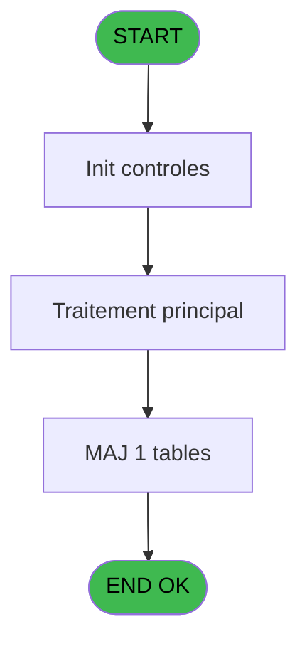

# PBS IDE 7 - Browse - Tables NATIONALITE

> **Analyse**: Phases 1-4 2026-02-03 17:01 -> 17:01 (17s) | Assemblage 17:01
> **Pipeline**: V7.2 Enrichi
> **Structure**: 4 onglets (Resume | Ecrans | Donnees | Connexions)

<!-- TAB:Resume -->

## 1. FICHE D'IDENTITE

| Attribut | Valeur |
|----------|--------|
| Projet | PBS |
| IDE Position | 7 |
| Nom Programme | Browse - Tables NATIONALITE |
| Fichier source | `Prg_7.xml` |
| Dossier IDE | Client |
| Taches | 1 (1 ecrans visibles) |
| Tables modifiees | 1 |
| Programmes appeles | 0 |
| :warning: Statut | **ORPHELIN_POTENTIEL** |

## 2. DESCRIPTION FONCTIONNELLE

**Browse - Tables NATIONALITE** assure la gestion complete de ce processus.

Le flux de traitement s'organise en **1 blocs fonctionnels** :

- **Traitement** (1 tache) : traitements metier divers

**Donnees modifiees** : 1 tables en ecriture (pms_footer_comment).

**Logique metier** : 1 regles identifiees couvrant conditions metier.

## 3. BLOCS FONCTIONNELS

### 3.1 Traitement (1 tache)

Traitements internes.

---

#### 7 - Browse - Tables NATIONALITE [[ECRAN]](#ecran-t1)

**Role** : Traitement : Browse - Tables NATIONALITE.
**Ecran** : 950 x 202 DLU (MDI) | [Voir mockup](#ecran-t1)

## 5. REGLES METIER

1 regles identifiees:

### Autres (1 regles)

#### [RM-001] Si [K] alors 'MERCOSUL' sinon '')

| Element | Detail |
|---------|--------|
| **Condition** | `[K]` |
| **Si vrai** | 'MERCOSUL' |
| **Si faux** | '') |
| **Expression source** | Expression 4 : `IF([K],'MERCOSUL', '')` |
| **Exemple** | Si [K] → 'MERCOSUL'. Sinon → '') |

## 6. CONTEXTE

- **Appele par**: (aucun)
- **Appelle**: 0 programmes | **Tables**: 1 (W:1 R:0 L:0) | **Taches**: 1 | **Expressions**: 12

<!-- TAB:Ecrans -->

## 8. ECRANS

### 8.1 Forms visibles (1 / 1)

| # | Position | Tache | Nom | Type | Largeur | Hauteur | Bloc |
|---|----------|-------|-----|------|---------|---------|------|
| 1 | 7 | 7 | Browse - Tables NATIONALITE | MDI | 950 | 202 | Traitement |

### 8.2 Mockups Ecrans

---

#### 7 - Browse - Tables NATIONALITE
**Tache** : [7](#t1) | **Type** : MDI | **Dimensions** : 950 x 202 DLU
**Bloc** : Traitement | **Titre IDE** : Browse - Tables NATIONALITE

<!-- FORM-DATA:
{
    "width":  950,
    "vFactor":  8,
    "type":  "MDI",
    "hFactor":  8,
    "controls":  [
                     {
                         "x":  32,
                         "type":  "table",
                         "var":  "",
                         "name":  "",
                         "titleH":  12,
                         "color":  "110",
                         "w":  909,
                         "y":  8,
                         "fmt":  "",
                         "parent":  null,
                         "text":  "",
                         "rowH":  13,
                         "h":  146,
                         "cols":  [
                                      {
                                          "title":  "Code pays",
                                          "layer":  1,
                                          "w":  122
                                      },
                                      {
                                          "title":  "Libellé",
                                          "layer":  2,
                                          "w":  306
                                      },
                                      {
                                          "title":  "Continent",
                                          "layer":  3,
                                          "w":  122
                                      },
                                      {
                                          "title":  "Banque du Brésil",
                                          "layer":  4,
                                          "w":  139
                                      },
                                      {
                                          "title":  "Mercosul",
                                          "layer":  5,
                                          "w":  110
                                      },
                                      {
                                          "title":  "Turquie",
                                          "layer":  6,
                                          "w":  73
                                      }
                                  ],
                         "rows":  6
                     },
                     {
                         "x":  40,
                         "type":  "label",
                         "var":  "",
                         "y":  10,
                         "w":  106,
                         "fmt":  "",
                         "name":  "",
                         "h":  8,
                         "color":  "",
                         "text":  "CODE PAYS",
                         "parent":  null
                     },
                     {
                         "x":  162,
                         "type":  "label",
                         "var":  "",
                         "y":  10,
                         "w":  76,
                         "fmt":  "",
                         "name":  "",
                         "h":  8,
                         "color":  "",
                         "text":  "LIBELLE",
                         "parent":  null
                     },
                     {
                         "x":  472,
                         "type":  "label",
                         "var":  "",
                         "y":  10,
                         "w":  106,
                         "fmt":  "",
                         "name":  "",
                         "h":  8,
                         "color":  "",
                         "text":  "CONTINENT",
                         "parent":  null
                     },
                     {
                         "x":  23,
                         "type":  "label",
                         "var":  "",
                         "y":  159,
                         "w":  917,
                         "fmt":  "",
                         "name":  "",
                         "h":  37,
                         "color":  "",
                         "text":  "",
                         "parent":  null
                     },
                     {
                         "x":  42,
                         "type":  "label",
                         "var":  "",
                         "y":  168,
                         "w":  104,
                         "fmt":  "",
                         "name":  "",
                         "h":  8,
                         "color":  "",
                         "text":  "Continent",
                         "parent":  8
                     },
                     {
                         "x":  191,
                         "type":  "label",
                         "var":  "",
                         "y":  168,
                         "w":  152,
                         "fmt":  "",
                         "name":  "",
                         "h":  8,
                         "color":  "",
                         "text":  "1 : GRECE",
                         "parent":  8
                     },
                     {
                         "x":  348,
                         "type":  "label",
                         "var":  "",
                         "y":  168,
                         "w":  152,
                         "fmt":  "",
                         "name":  "",
                         "h":  8,
                         "color":  "",
                         "text":  "5 : ASIE",
                         "parent":  8
                     },
                     {
                         "x":  191,
                         "type":  "label",
                         "var":  "",
                         "y":  176,
                         "w":  152,
                         "fmt":  "",
                         "name":  "",
                         "h":  8,
                         "color":  "",
                         "text":  "3 : EUROPE",
                         "parent":  8
                     },
                     {
                         "x":  348,
                         "type":  "label",
                         "var":  "",
                         "y":  176,
                         "w":  152,
                         "fmt":  "",
                         "name":  "",
                         "h":  8,
                         "color":  "",
                         "text":  "6 : AFRIQUE",
                         "parent":  8
                     },
                     {
                         "x":  191,
                         "type":  "label",
                         "var":  "",
                         "y":  184,
                         "w":  152,
                         "fmt":  "",
                         "name":  "",
                         "h":  8,
                         "color":  "",
                         "text":  "4 : AMERIQUE",
                         "parent":  8
                     },
                     {
                         "x":  348,
                         "type":  "label",
                         "var":  "",
                         "y":  184,
                         "w":  261,
                         "fmt":  "",
                         "name":  "",
                         "h":  8,
                         "color":  "",
                         "text":  "7 : AUSTRALIE / NEWZELAND",
                         "parent":  8
                     },
                     {
                         "x":  72,
                         "type":  "edit",
                         "var":  "",
                         "y":  22,
                         "w":  34,
                         "fmt":  "",
                         "name":  "",
                         "h":  10,
                         "color":  "110",
                         "text":  "",
                         "parent":  1
                     },
                     {
                         "x":  162,
                         "type":  "edit",
                         "var":  "",
                         "y":  22,
                         "w":  264,
                         "fmt":  "U20",
                         "name":  "",
                         "h":  10,
                         "color":  "110",
                         "text":  "",
                         "parent":  1
                     },
                     {
                         "x":  504,
                         "type":  "edit",
                         "var":  "",
                         "y":  22,
                         "w":  34,
                         "fmt":  "",
                         "name":  "",
                         "h":  10,
                         "color":  "110",
                         "text":  "",
                         "parent":  1
                     },
                     {
                         "x":  588,
                         "type":  "edit",
                         "var":  "",
                         "y":  22,
                         "w":  102,
                         "fmt":  "",
                         "name":  "pn_bresil_number",
                         "h":  10,
                         "color":  "110",
                         "text":  "",
                         "parent":  1
                     },
                     {
                         "x":  741,
                         "type":  "checkbox",
                         "var":  "",
                         "y":  22,
                         "w":  32,
                         "fmt":  "",
                         "name":  "v.Mercosul ?",
                         "h":  10,
                         "color":  "110",
                         "text":  "",
                         "parent":  1
                     },
                     {
                         "x":  837,
                         "type":  "edit",
                         "var":  "",
                         "y":  22,
                         "w":  51,
                         "fmt":  "3Z",
                         "name":  "pn_turkey_number",
                         "h":  10,
                         "color":  "110",
                         "text":  "",
                         "parent":  1
                     }
                 ],
    "taskId":  "7",
    "height":  202
}
-->

<strong>Champs : 6 champs</strong>

| Pos (x,y) | Nom | Variable | Type |
|-----------|-----|----------|------|
| 72,22 | (sans nom) | - | edit |
| 162,22 | U20 | - | edit |
| 504,22 | (sans nom) | - | edit |
| 588,22 | pn_bresil_number | - | edit |
| 741,22 | v.Mercosul ? | - | checkbox |
| 837,22 | pn_turkey_number | - | edit |

## 9. NAVIGATION

Ecran unique: **Browse - Tables NATIONALITE**

### 9.3 Structure hierarchique (1 tache)

| Position | Tache | Type | Dimensions | Bloc |
|----------|-------|------|------------|------|
| **7.1** | [**Browse - Tables NATIONALITE** (7)](#t1) [mockup](#ecran-t1) | MDI | 950x202 | Traitement |

### 9.4 Algorigramme

> **Legende**: Vert = START/END OK | Rouge = END KO | Bleu = Decisions
> *Algorigramme auto-genere. Utiliser `/algorigramme` pour une synthese metier detaillee.*

<!-- TAB:Donnees -->

## 10. TABLES

### Tables utilisees (1)

| ID | Nom | Description | Type | R | W | L | Usages |
|----|-----|-------------|------|---|---|---|--------|
| 364 | pms_footer_comment |  | DB |   | **W** |   | 1 |

### Colonnes par table (0 / 1 tables avec colonnes identifiees)

Table 364 - pms_footer_comment (**W**) - 1 usages

*Table utilisee uniquement en Link ou aucune colonne Real identifiee dans le DataView.*

## 11. VARIABLES

*(Programme sans variables locales mappees)*

## 12. EXPRESSIONS

**12 / 12 expressions decodees (100%)**

### 12.1 Repartition par type

| Type | Expressions | Regles |
|------|-------------|--------|
| CONDITION | 2 | 5 |
| CONSTANTE | 2 | 0 |
| OTHER | 8 | 0 |

### 12.2 Expressions cles par type

#### CONDITION (2 expressions)

| Type | IDE | Expression | Regle |
|------|-----|------------|-------|
| CONDITION | 4 | `IF([K],'MERCOSUL', '')` | [RM-001](#rm-RM-001) |
| CONDITION | 3 | `[J]='MERCOSUL'` | - |

#### CONSTANTE (2 expressions)

| Type | IDE | Expression | Regle |
|------|-----|------------|-------|
| CONSTANTE | 6 | `'G'` | - |
| CONSTANTE | 1 | `'F'` | - |

#### OTHER (8 expressions)

| Type | IDE | Expression | Regle |
|------|-----|------------|-------|
| OTHER | 10 | `[I]` | - |
| OTHER | 9 | `[D]` | - |
| OTHER | 12 | `[L]` | - |
| OTHER | 11 | `[J]` | - |
| OTHER | 5 | `[K]` | - |
| ... | | *+3 autres* | |

<!-- TAB:Connexions -->

## 13. GRAPHE D'APPELS

### 13.1 Chaine depuis Main (Callers)

**Chemin**: (pas de callers directs)

### 13.2 Callers

| IDE | Nom Programme | Nb Appels |
|-----|---------------|-----------|
| - | (aucun) | - |

### 13.3 Callees (programmes appeles)

### 13.4 Detail Callees avec contexte

| IDE | Nom Programme | Appels | Contexte |
|-----|---------------|--------|----------|
| - | (aucun) | - | - |

## 14. RECOMMANDATIONS MIGRATION

### 14.1 Profil du programme

| Metrique | Valeur | Impact migration |
|----------|--------|-----------------|
| Lignes de logique | 29 | Programme compact |
| Expressions | 12 | Peu de logique |
| Tables WRITE | 1 | Impact faible |
| Sous-programmes | 0 | Peu de dependances |
| Ecrans visibles | 1 | Ecran unique ou traitement batch |
| Code desactive | 0% (0 / 29) | Code sain |
| Regles metier | 1 | Quelques regles a preserver |

### 14.2 Plan de migration par bloc

#### Traitement (1 tache: 1 ecran, 0 traitement)

- **Strategie** : 1 composant(s) UI (Razor/React) avec formulaires et validation.
- Decomposer les taches en services unitaires testables.

### 14.3 Dependances critiques

| Dependance | Type | Appels | Impact |
|------------|------|--------|--------|
| pms_footer_comment | Table WRITE (Database) | 1x | Schema + repository |

---
*Spec DETAILED generee par Pipeline V7.2 - 2026-02-03 17:01*
