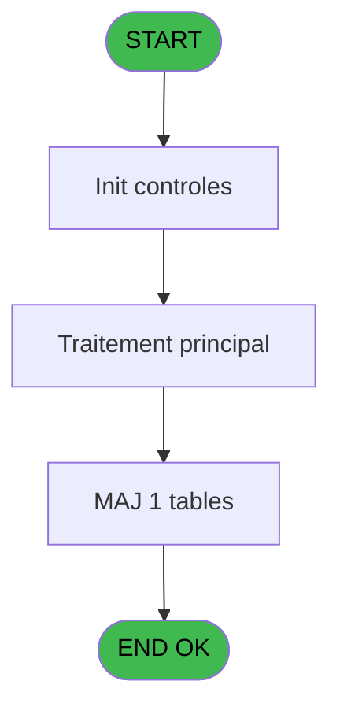
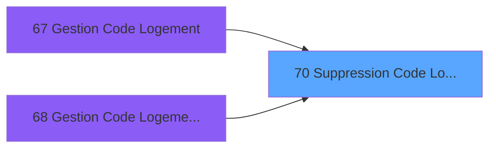
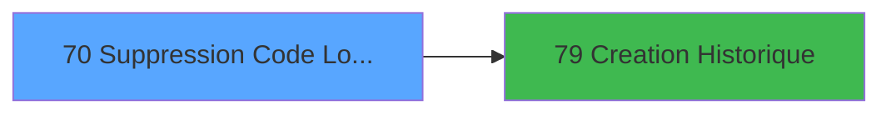

# PBS IDE 70 - Suppression Code Logement

> **Analyse**: Phases 1-4 2026-02-03 17:24 -> 17:24 (15s) | Assemblage 17:24
> **Pipeline**: V7.2 Enrichi
> **Structure**: 4 onglets (Resume | Ecrans | Donnees | Connexions)

<!-- TAB:Resume -->

## 1. FICHE D'IDENTITE

| Attribut | Valeur |
|----------|--------|
| Projet | PBS |
| IDE Position | 70 |
| Nom Programme | Suppression Code Logement |
| Fichier source | `Prg_70.xml` |
| Dossier IDE | Utilitaires |
| Taches | 4 (0 ecrans visibles) |
| Tables modifiees | 1 |
| Programmes appeles | 1 |

## 2. DESCRIPTION FONCTIONNELLE

**Suppression Code Logement** assure la gestion complete de ce processus, accessible depuis [Gestion Code Logement (IDE 67)](PBS-IDE-67.md), [Gestion Code Logement pms-626 (IDE 68)](PBS-IDE-68.md).

Le flux de traitement s'organise en **2 blocs fonctionnels** :

- **Validation** (2 taches) : controles et verifications de coherence
- **Traitement** (2 taches) : traitements metier divers

**Donnees modifiees** : 1 tables en ecriture (code_logement____clo).

Detail : phases du traitement

#### Phase 1 : Traitement (2 taches)

- **70** - Suppression Code Logement
- **70.3** - Suppression Code Logement

#### Phase 2 : Validation (2 taches)

- **70.1** - Verification 1
- **70.2** - Verification 2

#### Tables impactees

| Table | Operations | Role metier |
|-------|-----------|-------------|
| code_logement____clo | **W** (1 usages) |  |

## 3. BLOCS FONCTIONNELS

### 3.1 Traitement (2 taches)

Traitements internes.

---

#### 70 - Suppression Code Logement

**Role** : Traitement : Suppression Code Logement.
**Variables liees** : A (> Code Lieu de Sejour), B (> Code Logement), C (> Libelle Code Logement)

---

#### 70.3 - Suppression Code Logement

**Role** : Traitement : Suppression Code Logement.
**Variables liees** : A (> Code Lieu de Sejour), B (> Code Logement), C (> Libelle Code Logement)

### 3.2 Validation (2 taches)

Controles de coherence : 2 taches verifient les donnees et conditions.

---

#### 70.1 - Verification 1

**Role** : Verification : Verification 1.

---

#### 70.2 - Verification 2

**Role** : Verification : Verification 2.

## 5. REGLES METIER

*(Aucune regle metier identifiee)*

## 6. CONTEXTE

- **Appele par**: [Gestion Code Logement (IDE 67)](PBS-IDE-67.md), [Gestion Code Logement pms-626 (IDE 68)](PBS-IDE-68.md)
- **Appelle**: 1 programmes | **Tables**: 3 (W:1 R:2 L:0) | **Taches**: 4 | **Expressions**: 8

<!-- TAB:Ecrans -->

## 8. ECRANS

*(Programme sans ecran visible)*

## 9. NAVIGATION

### 9.3 Structure hierarchique (4 taches)

| Position | Tache | Type | Dimensions | Bloc |
|----------|-------|------|------------|------|
| **70.1** | [**Suppression Code Logement** (70)](#t1) | MDI | - | Traitement |
| 70.1.1 | [Suppression Code Logement (70.3)](#t4) | MDI | - | |
| **70.2** | [**Verification 1** (70.1)](#t2) | MDI | - | Validation |
| 70.2.1 | [Verification 2 (70.2)](#t3) | MDI | - | |

### 9.4 Algorigramme

> **Legende**: Vert = START/END OK | Rouge = END KO | Bleu = Decisions
> *Algorigramme auto-genere. Utiliser `/algorigramme` pour une synthese metier detaillee.*

<!-- TAB:Donnees -->

## 10. TABLES

### Tables utilisees (3)

| ID | Nom | Description | Type | R | W | L | Usages |
|----|-----|-------------|------|---|---|---|--------|
| 34 | hebergement______heb | Hebergement (chambres) | DB | R |   |   | 1 |
| 103 | logement_client__loc |  | DB | R |   |   | 1 |
| 108 | code_logement____clo |  | DB |   | **W** |   | 1 |

### Colonnes par table (2 / 3 tables avec colonnes identifiees)

Table 34 - hebergement______heb (R) - 1 usages

*Table utilisee uniquement en Link ou aucune colonne Real identifiee dans le DataView.*

Table 103 - logement_client__loc (R) - 1 usages

| Lettre | Variable | Acces | Type |
|--------|----------|-------|------|
| B | > Code Logement | R | Alpha |
| C | > Libelle Code Logement | R | Alpha |

Table 108 - code_logement____clo (**W**) - 1 usages

| Lettre | Variable | Acces | Type |
|--------|----------|-------|------|
| A | > Code Lieu de Sejour | W | Alpha |
| B | > Code Logement | W | Alpha |
| C | > Libelle Code Logement | W | Alpha |

## 11. VARIABLES

### 11.1 Variables de session (2)

Variables persistantes pendant toute la session.

| Lettre | Nom | Type | Usage dans |
|--------|-----|------|-----------|
| D | v.Autorisation | Logical | 2x session |
| E | v.Confirmation | Numeric | 2x session |

### 11.2 Autres (3)

Variables diverses.

| Lettre | Nom | Type | Usage dans |
|--------|-----|------|-----------|
| A | > Code Lieu de Sejour | Alpha | - |
| B | > Code Logement | Alpha | - |
| C | > Libelle Code Logement | Alpha | - |

## 12. EXPRESSIONS

**8 / 8 expressions decodees (100%)**

### 12.1 Repartition par type

| Type | Expressions | Regles |
|------|-------------|--------|
| CONSTANTE | 1 | 0 |
| NEGATION | 1 | 0 |
| CONDITION | 2 | 0 |
| CAST_LOGIQUE | 1 | 0 |
| OTHER | 3 | 0 |

### 12.2 Expressions cles par type

#### CONSTANTE (1 expressions)

| Type | IDE | Expression | Regle |
|------|-----|------------|-------|
| CONSTANTE | 8 | `'ACLO'` | - |

#### NEGATION (1 expressions)

| Type | IDE | Expression | Regle |
|------|-----|------------|-------|
| NEGATION | 1 | `NOT (v.Autorisation [D])` | - |

#### CONDITION (2 expressions)

| Type | IDE | Expression | Regle |
|------|-----|------------|-------|
| CONDITION | 4 | `v.Confirmation [E]=6` | - |
| CONDITION | 2 | `v.Autorisation [D] AND v.Confirmation [E]=6` | - |

#### CAST_LOGIQUE (1 expressions)

| Type | IDE | Expression | Regle |
|------|-----|------------|-------|
| CAST_LOGIQUE | 3 | `'FALSE'LOG` | - |

#### OTHER (3 expressions)

| Type | IDE | Expression | Regle |
|------|-----|------------|-------|
| OTHER | 7 | `GetParam ('SOCIETE')` | - |
| OTHER | 6 | `SetCrsr (1)` | - |
| OTHER | 5 | `SetCrsr (2)` | - |

<!-- TAB:Connexions -->

## 13. GRAPHE D'APPELS

### 13.1 Chaine depuis Main (Callers)

Main -> ... -> [Gestion Code Logement (IDE 67)](PBS-IDE-67.md) -> **Suppression Code Logement (IDE 70)**

Main -> ... -> [Gestion Code Logement pms-626 (IDE 68)](PBS-IDE-68.md) -> **Suppression Code Logement (IDE 70)**

### 13.2 Callers

| IDE | Nom Programme | Nb Appels |
|-----|---------------|-----------|
| [67](PBS-IDE-67.md) | Gestion Code Logement | 1 |
| [68](PBS-IDE-68.md) | Gestion Code Logement pms-626 | 1 |

### 13.3 Callees (programmes appeles)

### 13.4 Detail Callees avec contexte

| IDE | Nom Programme | Appels | Contexte |
|-----|---------------|--------|----------|
| [79](PBS-IDE-79.md) | Creation Historique | 1 | Historique/consultation |

## 14. RECOMMANDATIONS MIGRATION

### 14.1 Profil du programme

| Metrique | Valeur | Impact migration |
|----------|--------|-----------------|
| Lignes de logique | 45 | Programme compact |
| Expressions | 8 | Peu de logique |
| Tables WRITE | 1 | Impact faible |
| Sous-programmes | 1 | Peu de dependances |
| Ecrans visibles | 0 | Ecran unique ou traitement batch |
| Code desactive | 0% (0 / 45) | Code sain |
| Regles metier | 0 | Pas de regle identifiee |

### 14.2 Plan de migration par bloc

#### Traitement (2 taches: 0 ecran, 2 traitements)

- **Strategie** : 2 service(s) backend injectable(s) (Domain Services).
- 1 sous-programme(s) a migrer ou a reutiliser depuis les services existants.
- Decomposer les taches en services unitaires testables.

#### Validation (2 taches: 0 ecran, 2 traitements)

- **Strategie** : FluentValidation avec validators specifiques.
- Chaque tache de validation -> un validator injectable

### 14.3 Dependances critiques

| Dependance | Type | Appels | Impact |
|------------|------|--------|--------|
| code_logement____clo | Table WRITE (Database) | 1x | Schema + repository |
| [Creation Historique (IDE 79)](PBS-IDE-79.md) | Sous-programme | 1x | Normale - Historique/consultation |

---
*Spec DETAILED generee par Pipeline V7.2 - 2026-02-03 17:24*
