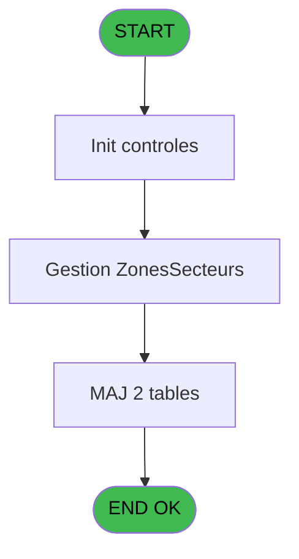
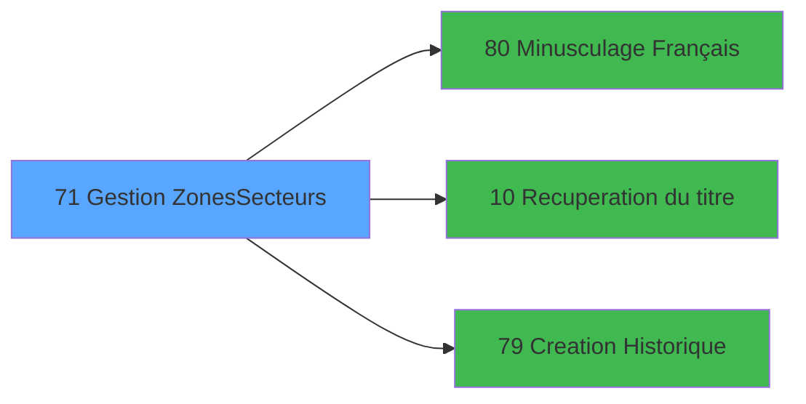

# PBS IDE 71 - Gestion Zones/Secteurs

> **Analyse**: Phases 1-4 2026-02-03 17:24 -> 17:25 (15s) | Assemblage 17:25
> **Pipeline**: V7.2 Enrichi
> **Structure**: 4 onglets (Resume | Ecrans | Donnees | Connexions)

<!-- TAB:Resume -->

## 1. FICHE D'IDENTITE

| Attribut | Valeur |
|----------|--------|
| Projet | PBS |
| IDE Position | 71 |
| Nom Programme | Gestion Zones/Secteurs |
| Fichier source | `Prg_71.xml` |
| Dossier IDE | Utilitaires |
| Taches | 4 (1 ecrans visibles) |
| Tables modifiees | 2 |
| Programmes appeles | 3 |
| :warning: Statut | **ORPHELIN_POTENTIEL** |

## 2. DESCRIPTION FONCTIONNELLE

**Gestion Zones/Secteurs** assure la gestion complete de ce processus.

Le flux de traitement s'organise en **1 blocs fonctionnels** :

- **Traitement** (4 taches) : traitements metier divers

**Donnees modifiees** : 2 tables en ecriture (logement_zone_menage, table_element_detail_session).

Detail : phases du traitement

#### Phase 1 : Traitement (4 taches)

- **71** - Êcran **[[ECRAN]](#ecran-t1)**
- **71.1** - Êcran **[[ECRAN]](#ecran-t2)**
- **71.1.1** - Refresh
- **71.1.2** - Modification Table Temp. 121

Delegue a : [Minusculage Français (IDE 80)](PBS-IDE-80.md), [Recuperation du titre (IDE 10)](PBS-IDE-10.md)

#### Tables impactees

| Table | Operations | Role metier |
|-------|-----------|-------------|
| table_element_detail_session | **W** (1 usages) | Sessions de caisse |
| logement_zone_menage | **W** (1 usages) |  |

## 3. BLOCS FONCTIONNELS

### 3.1 Traitement (4 taches)

Traitements internes.

---

#### 71 - Êcran [[ECRAN]](#ecran-t1)

**Role** : Traitement : Êcran.
**Ecran** : 206 x 124 DLU (MDI) | [Voir mockup](#ecran-t1)

3 sous-taches directes

| Tache | Nom | Bloc |
|-------|-----|------|
| [71.1](#t2) | Êcran **[[ECRAN]](#ecran-t2)** | Traitement |
| [71.1.1](#t3) | Refresh | Traitement |
| [71.1.2](#t4) | Modification Table Temp. 121 | Traitement |

**Delegue a** : [Minusculage Français (IDE 80)](PBS-IDE-80.md), [Recuperation du titre (IDE 10)](PBS-IDE-10.md)

---

#### 71.1 - Êcran [[ECRAN]](#ecran-t2)

**Role** : Traitement : Êcran.
**Ecran** : 926 x 217 DLU (MDI) | [Voir mockup](#ecran-t2)
**Delegue a** : [Minusculage Français (IDE 80)](PBS-IDE-80.md), [Recuperation du titre (IDE 10)](PBS-IDE-10.md)

---

#### 71.1.1 - Refresh

**Role** : Traitement : Refresh.
**Delegue a** : [Minusculage Français (IDE 80)](PBS-IDE-80.md), [Recuperation du titre (IDE 10)](PBS-IDE-10.md)

---

#### 71.1.2 - Modification Table Temp. 121

**Role** : Traitement : Modification Table Temp. 121.
**Delegue a** : [Minusculage Français (IDE 80)](PBS-IDE-80.md), [Recuperation du titre (IDE 10)](PBS-IDE-10.md)

## 5. REGLES METIER

*(Aucune regle metier identifiee)*

## 6. CONTEXTE

- **Appele par**: (aucun)
- **Appelle**: 3 programmes | **Tables**: 2 (W:2 R:0 L:0) | **Taches**: 4 | **Expressions**: 2

<!-- TAB:Ecrans -->

## 8. ECRANS

### 8.1 Forms visibles (1 / 4)

| # | Position | Tache | Nom | Type | Largeur | Hauteur | Bloc |
|---|----------|-------|-----|------|---------|---------|------|
| 1 | 71.1 | 71.1 | Êcran | MDI | 926 | 217 | Traitement |

### 8.2 Mockups Ecrans

---

#### 71.1 - Êcran
**Tache** : [71.1](#t2) | **Type** : MDI | **Dimensions** : 926 x 217 DLU
**Bloc** : Traitement | **Titre IDE** : Êcran

<!-- FORM-DATA:
{
    "width":  926,
    "vFactor":  8,
    "type":  "MDI",
    "hFactor":  8,
    "controls":  [
                     {
                         "x":  0,
                         "type":  "label",
                         "var":  "",
                         "y":  0,
                         "w":  922,
                         "fmt":  "",
                         "name":  "",
                         "h":  20,
                         "color":  "",
                         "text":  "",
                         "parent":  null
                     },
                     {
                         "x":  24,
                         "type":  "table",
                         "var":  "",
                         "name":  "",
                         "titleH":  12,
                         "color":  "110",
                         "w":  459,
                         "y":  38,
                         "fmt":  "",
                         "parent":  null,
                         "text":  "",
                         "rowH":  15,
                         "h":  137,
                         "cols":  [
                                      {
                                          "title":  "Code",
                                          "layer":  1,
                                          "w":  162
                                      },
                                      {
                                          "title":  "Libellé",
                                          "layer":  2,
                                          "w":  248
                                      }
                                  ],
                         "rows":  2
                     },
                     {
                         "x":  488,
                         "type":  "label",
                         "var":  "",
                         "y":  38,
                         "w":  410,
                         "fmt":  "",
                         "name":  "",
                         "h":  132,
                         "color":  "",
                         "text":  "",
                         "parent":  null
                     },
                     {
                         "x":  493,
                         "type":  "line",
                         "var":  "",
                         "y":  109,
                         "w":  402,
                         "fmt":  "",
                         "name":  "",
                         "h":  0,
                         "color":  "",
                         "text":  "",
                         "parent":  null
                     },
                     {
                         "x":  503,
                         "type":  "label",
                         "var":  "",
                         "y":  120,
                         "w":  134,
                         "fmt":  "",
                         "name":  "",
                         "h":  10,
                         "color":  "",
                         "text":  "Responsable",
                         "parent":  5
                     },
                     {
                         "x":  503,
                         "type":  "label",
                         "var":  "",
                         "y":  136,
                         "w":  82,
                         "fmt":  "",
                         "name":  "",
                         "h":  10,
                         "color":  "",
                         "text":  "Adjoint",
                         "parent":  5
                     },
                     {
                         "x":  503,
                         "type":  "label",
                         "var":  "",
                         "y":  152,
                         "w":  157,
                         "fmt":  "",
                         "name":  "",
                         "h":  10,
                         "color":  "",
                         "text":  "Nb Logement",
                         "parent":  5
                     },
                     {
                         "x":  1,
                         "type":  "label",
                         "var":  "",
                         "y":  191,
                         "w":  919,
                         "fmt":  "",
                         "name":  "",
                         "h":  24,
                         "color":  "",
                         "text":  "",
                         "parent":  null
                     },
                     {
                         "x":  57,
                         "type":  "edit",
                         "var":  "",
                         "y":  54,
                         "w":  120,
                         "fmt":  "",
                         "name":  "ZONE/SECTEUR",
                         "h":  8,
                         "color":  "110",
                         "text":  "",
                         "parent":  4
                     },
                     {
                         "x":  196,
                         "type":  "edit",
                         "var":  "",
                         "y":  54,
                         "w":  232,
                         "fmt":  "",
                         "name":  "NOM ZONE/SECTEUR",
                         "h":  8,
                         "color":  "110",
                         "text":  "",
                         "parent":  4
                     },
                     {
                         "x":  664,
                         "type":  "edit",
                         "var":  "",
                         "y":  120,
                         "w":  182,
                         "fmt":  "",
                         "name":  "RESPONSABLE",
                         "h":  10,
                         "color":  "110",
                         "text":  "",
                         "parent":  5
                     },
                     {
                         "x":  664,
                         "type":  "edit",
                         "var":  "",
                         "y":  136,
                         "w":  182,
                         "fmt":  "",
                         "name":  "ADJOINT",
                         "h":  10,
                         "color":  "110",
                         "text":  "",
                         "parent":  5
                     },
                     {
                         "x":  664,
                         "type":  "edit",
                         "var":  "",
                         "y":  152,
                         "w":  59,
                         "fmt":  "",
                         "name":  "",
                         "h":  10,
                         "color":  "",
                         "text":  "",
                         "parent":  5
                     },
                     {
                         "x":  519,
                         "type":  "radio",
                         "var":  "",
                         "y":  59,
                         "w":  162,
                         "fmt":  "",
                         "name":  "ZS",
                         "h":  30,
                         "color":  "",
                         "text":  "",
                         "parent":  null
                     },
                     {
                         "x":  712,
                         "type":  "edit",
                         "var":  "",
                         "y":  5,
                         "w":  203,
                         "fmt":  "WWW DD MMM YYYYT",
                         "name":  "",
                         "h":  8,
                         "color":  "",
                         "text":  "",
                         "parent":  1
                     },
                     {
                         "x":  6,
                         "type":  "edit",
                         "var":  "",
                         "y":  6,
                         "w":  396,
                         "fmt":  "30",
                         "name":  "",
                         "h":  8,
                         "color":  "",
                         "text":  "",
                         "parent":  1
                     },
                     {
                         "x":  711,
                         "type":  "image",
                         "var":  "",
                         "y":  43,
                         "w":  161,
                         "fmt":  "",
                         "name":  "",
                         "h":  61,
                         "color":  "",
                         "text":  "",
                         "parent":  null
                     },
                     {
                         "x":  10,
                         "type":  "button",
                         "var":  "",
                         "y":  194,
                         "w":  154,
                         "fmt":  "\u0026Quitter",
                         "name":  "",
                         "h":  18,
                         "color":  "",
                         "text":  "",
                         "parent":  19
                     },
                     {
                         "x":  422,
                         "type":  "button",
                         "var":  "",
                         "y":  194,
                         "w":  154,
                         "fmt":  "\u0026Visualisation",
                         "name":  "",
                         "h":  18,
                         "color":  "",
                         "text":  "",
                         "parent":  null
                     },
                     {
                         "x":  589,
                         "type":  "button",
                         "var":  "",
                         "y":  194,
                         "w":  154,
                         "fmt":  "\u0026Modification",
                         "name":  "",
                         "h":  18,
                         "color":  "",
                         "text":  "",
                         "parent":  null
                     },
                     {
                         "x":  756,
                         "type":  "button",
                         "var":  "",
                         "y":  194,
                         "w":  154,
                         "fmt":  "\u0026Annulation",
                         "name":  "",
                         "h":  18,
                         "color":  "",
                         "text":  "",
                         "parent":  null
                     }
                 ],
    "taskId":  "71.1",
    "height":  217
}
-->

<strong>Champs : 7 champs</strong>

| Pos (x,y) | Nom | Variable | Type |
|-----------|-----|----------|------|
| 57,54 | ZONE/SECTEUR | - | edit |
| 196,54 | NOM ZONE/SECTEUR | - | edit |
| 664,120 | RESPONSABLE | - | edit |
| 664,136 | ADJOINT | - | edit |
| 664,152 | (sans nom) | - | edit |
| 712,5 | WWW DD MMM YYYYT | - | edit |
| 6,6 | 30 | - | edit |

<strong>Boutons : 4 boutons</strong>

| Bouton | Pos (x,y) | Action |
|--------|-----------|--------|
| Quitter | 10,194 | Quitte le programme |
| Visualisation | 422,194 | Bouton fonctionnel |
| Modification | 589,194 | Modifie l'element |
| Annulation | 756,194 | Annule et retour au menu |

## 9. NAVIGATION

Ecran unique: **Êcran**

### 9.3 Structure hierarchique (4 taches)

| Position | Tache | Type | Dimensions | Bloc |
|----------|-------|------|------------|------|
| **71.1** | [**Êcran** (71)](#t1) [mockup](#ecran-t1) | MDI | 206x124 | Traitement |
| 71.1.1 | [Êcran (71.1)](#t2) [mockup](#ecran-t2) | MDI | 926x217 | |
| 71.1.2 | [Refresh (71.1.1)](#t3) | MDI | - | |
| 71.1.3 | [Modification Table Temp. 121 (71.1.2)](#t4) | MDI | - | |

### 9.4 Algorigramme

> **Legende**: Vert = START/END OK | Rouge = END KO | Bleu = Decisions
> *Algorigramme auto-genere. Utiliser `/algorigramme` pour une synthese metier detaillee.*

<!-- TAB:Donnees -->

## 10. TABLES

### Tables utilisees (2)

| ID | Nom | Description | Type | R | W | L | Usages |
|----|-----|-------------|------|---|---|---|--------|
| 107 | logement_zone_menage |  | DB |   | **W** |   | 1 |
| 673 | table_element_detail_session | Sessions de caisse | DB |   | **W** |   | 1 |

### Colonnes par table (1 / 2 tables avec colonnes identifiees)

Table 107 - logement_zone_menage (**W**) - 1 usages

| Lettre | Variable | Acces | Type |
|--------|----------|-------|------|
| A | > societe | W | Alpha |
| B | v. titre | W | Alpha |
| C | v. code | W | Alpha |
| D | v.contrôle1 | W | Logical |
| E | v.Contrôle2 | W | Logical |
| F | v.Ancien Nom Zone/Secteur | W | Alpha |
| G | v.Selection ZS | W | Alpha |

Table 673 - table_element_detail_session (**W**) - 1 usages

*Table utilisee uniquement en Link ou aucune colonne Real identifiee dans le DataView.*

## 11. VARIABLES

### 11.1 Variables de session (7)

Variables persistantes pendant toute la session.

| Lettre | Nom | Type | Usage dans |
|--------|-----|------|-----------|
| A | v.Code Operation | Alpha | 1x session |
| B | v.Zone/Secteur | Alpha | - |
| C | v. code | Alpha | - |
| D | v.contrôle1 | Logical | - |
| E | v.Contrôle2 | Logical | - |
| F | v.Ancien Nom Zone/Secteur | Alpha | - |
| G | v.Selection ZS | Alpha | - |

## 12. EXPRESSIONS

**2 / 2 expressions decodees (100%)**

### 12.1 Repartition par type

| Type | Expressions | Regles |
|------|-------------|--------|
| CONSTANTE | 1 | 0 |
| CONDITION | 1 | 0 |

### 12.2 Expressions cles par type

#### CONSTANTE (1 expressions)

| Type | IDE | Expression | Regle |
|------|-----|------------|-------|
| CONSTANTE | 2 | `'Z'` | - |

#### CONDITION (1 expressions)

| Type | IDE | Expression | Regle |
|------|-----|------------|-------|
| CONDITION | 1 | `v.Code Operation [A]=''` | - |

<!-- TAB:Connexions -->

## 13. GRAPHE D'APPELS

### 13.1 Chaine depuis Main (Callers)

**Chemin**: (pas de callers directs)

### 13.2 Callers

| IDE | Nom Programme | Nb Appels |
|-----|---------------|-----------|
| - | (aucun) | - |

### 13.3 Callees (programmes appeles)

### 13.4 Detail Callees avec contexte

| IDE | Nom Programme | Appels | Contexte |
|-----|---------------|--------|----------|
| [80](PBS-IDE-80.md) | Minusculage Français | 3 | Sous-programme |
| [10](PBS-IDE-10.md) | Recuperation du titre | 1 | Recuperation donnees |
| [79](PBS-IDE-79.md) | Creation Historique | 1 | Historique/consultation |

## 14. RECOMMANDATIONS MIGRATION

### 14.1 Profil du programme

| Metrique | Valeur | Impact migration |
|----------|--------|-----------------|
| Lignes de logique | 75 | Programme compact |
| Expressions | 2 | Peu de logique |
| Tables WRITE | 2 | Impact faible |
| Sous-programmes | 3 | Peu de dependances |
| Ecrans visibles | 1 | Ecran unique ou traitement batch |
| Code desactive | 0% (0 / 75) | Code sain |
| Regles metier | 0 | Pas de regle identifiee |

### 14.2 Plan de migration par bloc

#### Traitement (4 taches: 2 ecrans, 2 traitements)

- **Strategie** : Orchestrateur avec 2 ecrans (Razor/React) et 2 traitements backend (services).
- Les ecrans deviennent des composants UI, les traitements invisibles deviennent des services injectables.
- 3 sous-programme(s) a migrer ou a reutiliser depuis les services existants.
- Decomposer les taches en services unitaires testables.

### 14.3 Dependances critiques

| Dependance | Type | Appels | Impact |
|------------|------|--------|--------|
| logement_zone_menage | Table WRITE (Database) | 1x | Schema + repository |
| table_element_detail_session | Table WRITE (Database) | 1x | Schema + repository |
| [Minusculage Français (IDE 80)](PBS-IDE-80.md) | Sous-programme | 3x | **CRITIQUE** - Sous-programme |
| [Creation Historique (IDE 79)](PBS-IDE-79.md) | Sous-programme | 1x | Normale - Historique/consultation |
| [Recuperation du titre (IDE 10)](PBS-IDE-10.md) | Sous-programme | 1x | Normale - Recuperation donnees |

---
*Spec DETAILED generee par Pipeline V7.2 - 2026-02-03 17:25*
