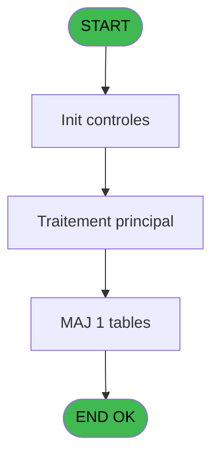
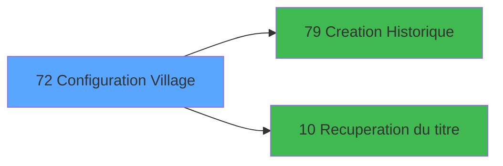

# PBS IDE 72 - Configuration Village

> **Analyse**: Phases 1-4 2026-02-03 17:25 -> 17:25 (15s) | Assemblage 17:25
> **Pipeline**: V7.2 Enrichi
> **Structure**: 4 onglets (Resume | Ecrans | Donnees | Connexions)

<!-- TAB:Resume -->

## 1. FICHE D'IDENTITE

| Attribut | Valeur |
|----------|--------|
| Projet | PBS |
| IDE Position | 72 |
| Nom Programme | Configuration Village |
| Fichier source | `Prg_72.xml` |
| Dossier IDE | Utilitaires |
| Taches | 5 (1 ecrans visibles) |
| Tables modifiees | 1 |
| Programmes appeles | 2 |
| :warning: Statut | **ORPHELIN_POTENTIEL** |

## 2. DESCRIPTION FONCTIONNELLE

**Configuration Village** assure la gestion complete de ce processus.

Le flux de traitement s'organise en **3 blocs fonctionnels** :

- **Initialisation** (2 taches) : reinitialisation d'etats et de variables de travail
- **Traitement** (2 taches) : traitements metier divers
- **Validation** (1 tache) : controles et verifications de coherence

**Donnees modifiees** : 1 tables en ecriture (societe__________soc).

**Logique metier** : 2 regles identifiees couvrant conditions metier.

Detail : phases du traitement

#### Phase 1 : Traitement (2 taches)

- **72** - Ecran **[[ECRAN]](#ecran-t1)**
- **72.3** - Récup. Service/Prestations **[[ECRAN]](#ecran-t5)**

Delegue a : [Recuperation du titre (IDE 10)](PBS-IDE-10.md)

#### Phase 2 : Validation (1 tache)

- **72.1** - Verification Demarrage

#### Phase 3 : Initialisation (2 taches)

- **72.1.1** - Initialisation Ages
- **72.2** - Initialisation Societe Vide

#### Tables impactees

| Table | Operations | Role metier |
|-------|-----------|-------------|
| societe__________soc | **W** (2 usages) |  |

## 3. BLOCS FONCTIONNELS

### 3.1 Traitement (2 taches)

Traitements internes.

---

#### 72 - Ecran [[ECRAN]](#ecran-t1)

**Role** : Traitement : Ecran.
**Ecran** : 899 x 283 DLU (MDI) | [Voir mockup](#ecran-t1)
**Delegue a** : [Recuperation du titre (IDE 10)](PBS-IDE-10.md)

---

#### 72.3 - Récup. Service/Prestations [[ECRAN]](#ecran-t5)

**Role** : Traitement : Récup. Service/Prestations.
**Ecran** : 123 x 195 DLU | [Voir mockup](#ecran-t5)
**Delegue a** : [Recuperation du titre (IDE 10)](PBS-IDE-10.md)

### 3.2 Validation (1 tache)

Controles de coherence : 1 tache verifie les donnees et conditions.

---

#### 72.1 - Verification Demarrage

**Role** : Verification : Verification Demarrage.

### 3.3 Initialisation (2 taches)

Reinitialisation d'etats et variables de travail.

---

#### 72.1.1 - Initialisation Ages

**Role** : Reinitialisation : Initialisation Ages.

---

#### 72.2 - Initialisation Societe Vide

**Role** : Reinitialisation : Initialisation Societe Vide.

## 5. REGLES METIER

2 regles identifiees:

### Autres (2 regles)

#### [RM-001] Si [FF] alors 'BABY' sinon IF([FG], 'ESTH', [EJ]))

| Element | Detail |
|---------|--------|
| **Condition** | `[FF]` |
| **Si vrai** | 'BABY' |
| **Si faux** | IF([FG], 'ESTH', [EJ])) |
| **Expression source** | Expression 67 : `IF([FF], 'BABY', IF([FG], 'ESTH', [EJ]))` |
| **Exemple** | Si [FF] → 'BABY'. Sinon → IF([FG], 'ESTH', [EJ])) |

#### [RM-002] Si [FG] AND [EJ]<>'ESTH' alors 'ESTH' sinon [EP])

| Element | Detail |
|---------|--------|
| **Condition** | `[FG] AND [EJ]<>'ESTH'` |
| **Si vrai** | 'ESTH' |
| **Si faux** | [EP]) |
| **Expression source** | Expression 68 : `IF([FG] AND [EJ]<>'ESTH', 'ESTH', [EP])` |
| **Exemple** | Si [FG] AND [EJ]<>'ESTH' → 'ESTH'. Sinon → [EP]) |

## 6. CONTEXTE

- **Appele par**: (aucun)
- **Appelle**: 2 programmes | **Tables**: 3 (W:1 R:2 L:1) | **Taches**: 5 | **Expressions**: 70

<!-- TAB:Ecrans -->

## 8. ECRANS

### 8.1 Forms visibles (1 / 5)

| # | Position | Tache | Nom | Type | Largeur | Hauteur | Bloc |
|---|----------|-------|-----|------|---------|---------|------|
| 1 | 72 | 72 | Ecran | MDI | 899 | 283 | Traitement |

### 8.2 Mockups Ecrans

---

#### 72 - Ecran
**Tache** : [72](#t1) | **Type** : MDI | **Dimensions** : 899 x 283 DLU
**Bloc** : Traitement | **Titre IDE** : Ecran

<!-- FORM-DATA:
{
    "width":  899,
    "vFactor":  8,
    "type":  "MDI",
    "hFactor":  8,
    "controls":  [
                     {
                         "x":  3,
                         "type":  "label",
                         "var":  "",
                         "y":  2,
                         "w":  889,
                         "fmt":  "",
                         "name":  "",
                         "h":  19,
                         "color":  "",
                         "text":  "",
                         "parent":  null
                     },
                     {
                         "x":  3,
                         "type":  "label",
                         "var":  "",
                         "y":  28,
                         "w":  430,
                         "fmt":  "",
                         "name":  "",
                         "h":  166,
                         "color":  "195",
                         "text":  "Village",
                         "parent":  null
                     },
                     {
                         "x":  441,
                         "type":  "label",
                         "var":  "",
                         "y":  28,
                         "w":  452,
                         "fmt":  "",
                         "name":  "",
                         "h":  118,
                         "color":  "195",
                         "text":  "Ages",
                         "parent":  null
                     },
                     {
                         "x":  12,
                         "type":  "label",
                         "var":  "",
                         "y":  41,
                         "w":  106,
                         "fmt":  "",
                         "name":  "",
                         "h":  10,
                         "color":  "",
                         "text":  "Société",
                         "parent":  4
                     },
                     {
                         "x":  448,
                         "type":  "label",
                         "var":  "",
                         "y":  44,
                         "w":  202,
                         "fmt":  "",
                         "name":  "",
                         "h":  10,
                         "color":  "",
                         "text":  "Age Bébé Planning",
                         "parent":  5
                     },
                     {
                         "x":  772,
                         "type":  "label",
                         "var":  "",
                         "y":  44,
                         "w":  18,
                         "fmt":  "",
                         "name":  "",
                         "h":  10,
                         "color":  "",
                         "text":  "à",
                         "parent":  5
                     },
                     {
                         "x":  448,
                         "type":  "label",
                         "var":  "",
                         "y":  56,
                         "w":  190,
                         "fmt":  "",
                         "name":  "",
                         "h":  10,
                         "color":  "",
                         "text":  "Age Bébé Trafic",
                         "parent":  5
                     },
                     {
                         "x":  772,
                         "type":  "label",
                         "var":  "",
                         "y":  56,
                         "w":  18,
                         "fmt":  "",
                         "name":  "",
                         "h":  10,
                         "color":  "",
                         "text":  "à",
                         "parent":  5
                     },
                     {
                         "x":  12,
                         "type":  "label",
                         "var":  "",
                         "y":  54,
                         "w":  101,
                         "fmt":  "",
                         "name":  "",
                         "h":  10,
                         "color":  "",
                         "text":  "Nom Village",
                         "parent":  4
                     },
                     {
                         "x":  448,
                         "type":  "label",
                         "var":  "",
                         "y":  68,
                         "w":  228,
                         "fmt":  "",
                         "name":  "",
                         "h":  10,
                         "color":  "",
                         "text":  "Age Bébé M.de Maison",
                         "parent":  5
                     },
                     {
                         "x":  772,
                         "type":  "label",
                         "var":  "",
                         "y":  68,
                         "w":  18,
                         "fmt":  "",
                         "name":  "",
                         "h":  10,
                         "color":  "",
                         "text":  "à",
                         "parent":  5
                     },
                     {
                         "x":  12,
                         "type":  "label",
                         "var":  "",
                         "y":  72,
                         "w":  140,
                         "fmt":  "",
                         "name":  "",
                         "h":  10,
                         "color":  "",
                         "text":  "Capacité Midi",
                         "parent":  4
                     },
                     {
                         "x":  448,
                         "type":  "label",
                         "var":  "",
                         "y":  80,
                         "w":  225,
                         "fmt":  "",
                         "name":  "",
                         "h":  10,
                         "color":  "",
                         "text":  "Age Bébé Police",
                         "parent":  5
                     },
                     {
                         "x":  772,
                         "type":  "label",
                         "var":  "",
                         "y":  80,
                         "w":  18,
                         "fmt":  "",
                         "name":  "",
                         "h":  10,
                         "color":  "",
                         "text":  "à",
                         "parent":  5
                     },
                     {
                         "x":  12,
                         "type":  "label",
                         "var":  "",
                         "y":  84,
                         "w":  141,
                         "fmt":  "",
                         "name":  "",
                         "h":  10,
                         "color":  "",
                         "text":  "Capacité Soir",
                         "parent":  4
                     },
                     {
                         "x":  448,
                         "type":  "label",
                         "var":  "",
                         "y":  96,
                         "w":  205,
                         "fmt":  "",
                         "name":  "",
                         "h":  10,
                         "color":  "",
                         "text":  "Age Enfant Planning",
                         "parent":  5
                     },
                     {
                         "x":  772,
                         "type":  "label",
                         "var":  "",
                         "y":  96,
                         "w":  18,
                         "fmt":  "",
                         "name":  "",
                         "h":  10,
                         "color":  "",
                         "text":  "à",
                         "parent":  5
                     },
                     {
                         "x":  12,
                         "type":  "label",
                         "var":  "",
                         "y":  97,
                         "w":  176,
                         "fmt":  "",
                         "name":  "",
                         "h":  10,
                         "color":  "",
                         "text":  "Interval Menage",
                         "parent":  4
                     },
                     {
                         "x":  448,
                         "type":  "label",
                         "var":  "",
                         "y":  108,
                         "w":  205,
                         "fmt":  "",
                         "name":  "",
                         "h":  10,
                         "color":  "",
                         "text":  "Age Enfant Trafic",
                         "parent":  5
                     },
                     {
                         "x":  772,
                         "type":  "label",
                         "var":  "",
                         "y":  108,
                         "w":  18,
                         "fmt":  "",
                         "name":  "",
                         "h":  10,
                         "color":  "",
                         "text":  "à",
                         "parent":  5
                     },
                     {
                         "x":  12,
                         "type":  "label",
                         "var":  "",
                         "y":  114,
                         "w":  106,
                         "fmt":  "",
                         "name":  "",
                         "h":  10,
                         "color":  "",
                         "text":  "Honey Moon",
                         "parent":  4
                     },
                     {
                         "x":  273,
                         "type":  "label",
                         "var":  "",
                         "y":  115,
                         "w":  18,
                         "fmt":  "",
                         "name":  "",
                         "h":  10,
                         "color":  "",
                         "text":  "/",
                         "parent":  4
                     },
                     {
                         "x":  448,
                         "type":  "label",
                         "var":  "",
                         "y":  120,
                         "w":  234,
                         "fmt":  "",
                         "name":  "",
                         "h":  10,
                         "color":  "",
                         "text":  "Age Enfant M.de Maison",
                         "parent":  5
                     },
                     {
                         "x":  772,
                         "type":  "label",
                         "var":  "",
                         "y":  120,
                         "w":  18,
                         "fmt":  "",
                         "name":  "",
                         "h":  10,
                         "color":  "",
                         "text":  "à",
                         "parent":  5
                     },
                     {
                         "x":  273,
                         "type":  "label",
                         "var":  "",
                         "y":  129,
                         "w":  18,
                         "fmt":  "",
                         "name":  "",
                         "h":  10,
                         "color":  "",
                         "text":  "/",
                         "parent":  4
                     },
                     {
                         "x":  448,
                         "type":  "label",
                         "var":  "",
                         "y":  132,
                         "w":  227,
                         "fmt":  "",
                         "name":  "",
                         "h":  10,
                         "color":  "",
                         "text":  "Age Enfant Police",
                         "parent":  5
                     },
                     {
                         "x":  772,
                         "type":  "label",
                         "var":  "",
                         "y":  132,
                         "w":  18,
                         "fmt":  "",
                         "name":  "",
                         "h":  10,
                         "color":  "",
                         "text":  "à",
                         "parent":  5
                     },
                     {
                         "x":  359,
                         "type":  "label",
                         "var":  "",
                         "y":  205,
                         "w":  210,
                         "fmt":  "",
                         "name":  "",
                         "h":  45,
                         "color":  "195",
                         "text":  "Heure diff.",
                         "parent":  null
                     },
                     {
                         "x":  374,
                         "type":  "label",
                         "var":  "",
                         "y":  217,
                         "w":  77,
                         "fmt":  "",
                         "name":  "",
                         "h":  10,
                         "color":  "",
                         "text":  "Aller",
                         "parent":  57
                     },
                     {
                         "x":  373,
                         "type":  "label",
                         "var":  "",
                         "y":  233,
                         "w":  80,
                         "fmt":  "",
                         "name":  "",
                         "h":  10,
                         "color":  "",
                         "text":  "Retour",
                         "parent":  57
                     },
                     {
                         "x":  0,
                         "type":  "label",
                         "var":  "",
                         "y":  259,
                         "w":  894,
                         "fmt":  "",
                         "name":  "",
                         "h":  24,
                         "color":  "",
                         "text":  "",
                         "parent":  null
                     },
                     {
                         "x":  12,
                         "type":  "label",
                         "var":  "",
                         "y":  149,
                         "w":  197,
                         "fmt":  "",
                         "name":  "",
                         "h":  12,
                         "color":  "",
                         "text":  "Lieu de séjour par defaut",
                         "parent":  4
                     },
                     {
                         "x":  12,
                         "type":  "label",
                         "var":  "",
                         "y":  168,
                         "w":  197,
                         "fmt":  "",
                         "name":  "",
                         "h":  12,
                         "color":  "",
                         "text":  "Etat effectif par lieu séjour",
                         "parent":  4
                     },
                     {
                         "x":  443,
                         "type":  "label",
                         "var":  "",
                         "y":  152,
                         "w":  450,
                         "fmt":  "",
                         "name":  "",
                         "h":  42,
                         "color":  "195",
                         "text":  "Proximité",
                         "parent":  null
                     },
                     {
                         "x":  188,
                         "type":  "edit",
                         "var":  "",
                         "y":  41,
                         "w":  26,
                         "fmt":  "",
                         "name":  "SOC Societe",
                         "h":  10,
                         "color":  "",
                         "text":  "",
                         "parent":  4
                     },
                     {
                         "x":  188,
                         "type":  "edit",
                         "var":  "",
                         "y":  55,
                         "w":  238,
                         "fmt":  "",
                         "name":  "SOC Installation",
                         "h":  10,
                         "color":  "110",
                         "text":  "",
                         "parent":  4
                     },
                     {
                         "x":  188,
                         "type":  "edit",
                         "var":  "",
                         "y":  72,
                         "w":  37,
                         "fmt":  "",
                         "name":  "SOC Capacite Midi",
                         "h":  10,
                         "color":  "110",
                         "text":  "",
                         "parent":  4
                     },
                     {
                         "x":  188,
                         "type":  "edit",
                         "var":  "",
                         "y":  84,
                         "w":  37,
                         "fmt":  "",
                         "name":  "SOC Capacite Soir",
                         "h":  10,
                         "color":  "110",
                         "text":  "",
                         "parent":  4
                     },
                     {
                         "x":  188,
                         "type":  "edit",
                         "var":  "",
                         "y":  97,
                         "w":  37,
                         "fmt":  "",
                         "name":  "SOC Interval Menage",
                         "h":  10,
                         "color":  "110",
                         "text":  "",
                         "parent":  4
                     },
                     {
                         "x":  171,
                         "type":  "edit",
                         "var":  "",
                         "y":  115,
                         "w":  98,
                         "fmt":  "",
                         "name":  "Honey Moon1",
                         "h":  10,
                         "color":  "110",
                         "text":  "",
                         "parent":  4
                     },
                     {
                         "x":  292,
                         "type":  "edit",
                         "var":  "",
                         "y":  115,
                         "w":  98,
                         "fmt":  "",
                         "name":  "Honey Moon2",
                         "h":  10,
                         "color":  "110",
                         "text":  "",
                         "parent":  4
                     },
                     {
                         "x":  171,
                         "type":  "edit",
                         "var":  "",
                         "y":  129,
                         "w":  98,
                         "fmt":  "",
                         "name":  "Honey Moon3",
                         "h":  10,
                         "color":  "110",
                         "text":  "",
                         "parent":  4
                     },
                     {
                         "x":  292,
                         "type":  "edit",
                         "var":  "",
                         "y":  129,
                         "w":  98,
                         "fmt":  "",
                         "name":  "Honey Moon4",
                         "h":  10,
                         "color":  "110",
                         "text":  "",
                         "parent":  4
                     },
                     {
                         "x":  810,
                         "type":  "edit",
                         "var":  "",
                         "y":  44,
                         "w":  70,
                         "fmt":  "",
                         "name":  "CODE NUMERIQUE",
                         "h":  10,
                         "color":  "110",
                         "text":  "",
                         "parent":  5
                     },
                     {
                         "x":  810,
                         "type":  "edit",
                         "var":  "",
                         "y":  56,
                         "w":  70,
                         "fmt":  "",
                         "name":  "CODE NUMERIQUE_001",
                         "h":  10,
                         "color":  "110",
                         "text":  "",
                         "parent":  5
                     },
                     {
                         "x":  810,
                         "type":  "edit",
                         "var":  "",
                         "y":  68,
                         "w":  70,
                         "fmt":  "",
                         "name":  "CODE NUMERIQUE_002",
                         "h":  10,
                         "color":  "110",
                         "text":  "",
                         "parent":  5
                     },
                     {
                         "x":  810,
                         "type":  "edit",
                         "var":  "",
                         "y":  80,
                         "w":  70,
                         "fmt":  "",
                         "name":  "CODE NUMERIQUE_003",
                         "h":  10,
                         "color":  "110",
                         "text":  "",
                         "parent":  5
                     },
                     {
                         "x":  810,
                         "type":  "edit",
                         "var":  "",
                         "y":  96,
                         "w":  70,
                         "fmt":  "",
                         "name":  "CODE NUMERIQUE_004",
                         "h":  10,
                         "color":  "110",
                         "text":  "",
                         "parent":  5
                     },
                     {
                         "x":  810,
                         "type":  "edit",
                         "var":  "",
                         "y":  108,
                         "w":  70,
                         "fmt":  "",
                         "name":  "CODE NUMERIQUE_005",
                         "h":  10,
                         "color":  "110",
                         "text":  "",
                         "parent":  5
                     },
                     {
                         "x":  810,
                         "type":  "edit",
                         "var":  "",
                         "y":  120,
                         "w":  70,
                         "fmt":  "",
                         "name":  "CODE NUMERIQUE_006",
                         "h":  10,
                         "color":  "110",
                         "text":  "",
                         "parent":  5
                     },
                     {
                         "x":  810,
                         "type":  "edit",
                         "var":  "",
                         "y":  132,
                         "w":  70,
                         "fmt":  "",
                         "name":  "CODE NUMERIQUE_007",
                         "h":  10,
                         "color":  "110",
                         "text":  "",
                         "parent":  5
                     },
                     {
                         "x":  682,
                         "type":  "combobox",
                         "var":  "",
                         "y":  163,
                         "w":  200,
                         "fmt":  "",
                         "name":  "Prox_1",
                         "h":  12,
                         "color":  "",
                         "text":  "1,2",
                         "parent":  null
                     },
                     {
                         "x":  462,
                         "type":  "edit",
                         "var":  "",
                         "y":  217,
                         "w":  70,
                         "fmt":  "",
                         "name":  "CODE NUMERIQUE_008",
                         "h":  10,
                         "color":  "6",
                         "text":  "",
                         "parent":  57
                     },
                     {
                         "x":  462,
                         "type":  "edit",
                         "var":  "",
                         "y":  233,
                         "w":  70,
                         "fmt":  "",
                         "name":  "CODE NUMERIQUE_009",
                         "h":  10,
                         "color":  "6",
                         "text":  "",
                         "parent":  57
                     },
                     {
                         "x":  21,
                         "type":  "edit",
                         "var":  "",
                         "y":  7,
                         "w":  395,
                         "fmt":  "30",
                         "name":  "",
                         "h":  8,
                         "color":  "",
                         "text":  "",
                         "parent":  1
                     },
                     {
                         "x":  684,
                         "type":  "edit",
                         "var":  "",
                         "y":  7,
                         "w":  203,
                         "fmt":  "WWW DD MMM YYYYT",
                         "name":  "",
                         "h":  8,
                         "color":  "",
                         "text":  "",
                         "parent":  1
                     },
                     {
                         "x":  687,
                         "type":  "edit",
                         "var":  "",
                         "y":  44,
                         "w":  70,
                         "fmt":  "#5",
                         "name":  "",
                         "h":  10,
                         "color":  "",
                         "text":  "",
                         "parent":  5
                     },
                     {
                         "x":  687,
                         "type":  "edit",
                         "var":  "",
                         "y":  56,
                         "w":  70,
                         "fmt":  "#5",
                         "name":  "",
                         "h":  10,
                         "color":  "",
                         "text":  "",
                         "parent":  5
                     },
                     {
                         "x":  687,
                         "type":  "edit",
                         "var":  "",
                         "y":  68,
                         "w":  70,
                         "fmt":  "#5",
                         "name":  "",
                         "h":  10,
                         "color":  "",
                         "text":  "",
                         "parent":  5
                     },
                     {
                         "x":  687,
                         "type":  "edit",
                         "var":  "",
                         "y":  80,
                         "w":  70,
                         "fmt":  "#5",
                         "name":  "",
                         "h":  10,
                         "color":  "",
                         "text":  "",
                         "parent":  5
                     },
                     {
                         "x":  687,
                         "type":  "edit",
                         "var":  "",
                         "y":  96,
                         "w":  70,
                         "fmt":  "#5",
                         "name":  "",
                         "h":  10,
                         "color":  "",
                         "text":  "",
                         "parent":  5
                     },
                     {
                         "x":  687,
                         "type":  "edit",
                         "var":  "",
                         "y":  108,
                         "w":  70,
                         "fmt":  "#5",
                         "name":  "",
                         "h":  10,
                         "color":  "",
                         "text":  "",
                         "parent":  5
                     },
                     {
                         "x":  687,
                         "type":  "edit",
                         "var":  "",
                         "y":  120,
                         "w":  70,
                         "fmt":  "#5",
                         "name":  "",
                         "h":  10,
                         "color":  "",
                         "text":  "",
                         "parent":  5
                     },
                     {
                         "x":  687,
                         "type":  "edit",
                         "var":  "",
                         "y":  132,
                         "w":  70,
                         "fmt":  "#5",
                         "name":  "",
                         "h":  10,
                         "color":  "",
                         "text":  "",
                         "parent":  5
                     },
                     {
                         "x":  671,
                         "type":  "image",
                         "var":  "",
                         "y":  202,
                         "w":  147,
                         "fmt":  "",
                         "name":  "",
                         "h":  54,
                         "color":  "",
                         "text":  "",
                         "parent":  null
                     },
                     {
                         "x":  107,
                         "type":  "image",
                         "var":  "",
                         "y":  203,
                         "w":  147,
                         "fmt":  "",
                         "name":  "",
                         "h":  53,
                         "color":  "",
                         "text":  "",
                         "parent":  null
                     },
                     {
                         "x":  10,
                         "type":  "button",
                         "var":  "",
                         "y":  262,
                         "w":  154,
                         "fmt":  "\u0026Quitter",
                         "name":  "",
                         "h":  18,
                         "color":  "",
                         "text":  "",
                         "parent":  62
                     },
                     {
                         "x":  400,
                         "type":  "button",
                         "var":  "",
                         "y":  262,
                         "w":  154,
                         "fmt":  "\u0026Visualiser",
                         "name":  "",
                         "h":  18,
                         "color":  "",
                         "text":  "",
                         "parent":  62
                     },
                     {
                         "x":  563,
                         "type":  "button",
                         "var":  "",
                         "y":  262,
                         "w":  154,
                         "fmt":  "\u0026Modifier",
                         "name":  "",
                         "h":  18,
                         "color":  "",
                         "text":  "",
                         "parent":  62
                     },
                     {
                         "x":  726,
                         "type":  "button",
                         "var":  "",
                         "y":  262,
                         "w":  154,
                         "fmt":  "\u0026Annuler",
                         "name":  "",
                         "h":  18,
                         "color":  "",
                         "text":  "",
                         "parent":  62
                     },
                     {
                         "x":  218,
                         "type":  "combobox",
                         "var":  "",
                         "y":  149,
                         "w":  181,
                         "fmt":  "",
                         "name":  "soc_lieu_sejour_defaut",
                         "h":  12,
                         "color":  "",
                         "text":  "",
                         "parent":  4
                     },
                     {
                         "x":  218,
                         "type":  "combobox",
                         "var":  "",
                         "y":  167,
                         "w":  181,
                         "fmt":  "",
                         "name":  "soc_etat_eff_par_lieusejour",
                         "h":  12,
                         "color":  "",
                         "text":  "Oui,Non",
                         "parent":  5
                     },
                     {
                         "x":  448,
                         "type":  "edit",
                         "var":  "",
                         "y":  163,
                         "w":  234,
                         "fmt":  "30",
                         "name":  "libelle_vingt",
                         "h":  12,
                         "color":  "",
                         "text":  "",
                         "parent":  140
                     },
                     {
                         "x":  448,
                         "type":  "edit",
                         "var":  "",
                         "y":  177,
                         "w":  234,
                         "fmt":  "30",
                         "name":  "libelle_vingt_0001",
                         "h":  10,
                         "color":  "",
                         "text":  "",
                         "parent":  140
                     },
                     {
                         "x":  680,
                         "type":  "combobox",
                         "var":  "",
                         "y":  177,
                         "w":  200,
                         "fmt":  "",
                         "name":  "Prox_2",
                         "h":  12,
                         "color":  "",
                         "text":  "1,2",
                         "parent":  null
                     }
                 ],
    "taskId":  "72",
    "height":  283
}
-->

<strong>Champs : 35 champs</strong>

| Pos (x,y) | Nom | Variable | Type |
|-----------|-----|----------|------|
| 188,41 | SOC Societe | - | edit |
| 188,55 | SOC Installation | - | edit |
| 188,72 | SOC Capacite Midi | - | edit |
| 188,84 | SOC Capacite Soir | - | edit |
| 188,97 | SOC Interval Menage | - | edit |
| 171,115 | Honey Moon1 | - | edit |
| 292,115 | Honey Moon2 | - | edit |
| 171,129 | Honey Moon3 | - | edit |
| 292,129 | Honey Moon4 | - | edit |
| 810,44 | CODE NUMERIQUE | - | edit |
| 810,56 | CODE NUMERIQUE_001 | - | edit |
| 810,68 | CODE NUMERIQUE_002 | - | edit |
| 810,80 | CODE NUMERIQUE_003 | - | edit |
| 810,96 | CODE NUMERIQUE_004 | - | edit |
| 810,108 | CODE NUMERIQUE_005 | - | edit |
| 810,120 | CODE NUMERIQUE_006 | - | edit |
| 810,132 | CODE NUMERIQUE_007 | - | edit |
| 682,163 | Prox_1 | - | combobox |
| 462,217 | CODE NUMERIQUE_008 | - | edit |
| 462,233 | CODE NUMERIQUE_009 | - | edit |
| 21,7 | 30 | - | edit |
| 684,7 | WWW DD MMM YYYYT | - | edit |
| 687,44 | #5 | - | edit |
| 687,56 | #5 | - | edit |
| 687,68 | #5 | - | edit |
| 687,80 | #5 | - | edit |
| 687,96 | #5 | - | edit |
| 687,108 | #5 | - | edit |
| 687,120 | #5 | - | edit |
| 687,132 | #5 | - | edit |
| 218,149 | soc_lieu_sejour_defaut | - | combobox |
| 218,167 | soc_etat_eff_par_lieusejour | - | combobox |
| 448,163 | libelle_vingt | - | edit |
| 448,177 | libelle_vingt_0001 | - | edit |
| 680,177 | Prox_2 | - | combobox |

<strong>Boutons : 4 boutons</strong>

| Bouton | Pos (x,y) | Action |
|--------|-----------|--------|
| Quitter | 10,262 | Quitte le programme |
| Visualiser | 400,262 | Bouton fonctionnel |
| Modifier | 563,262 | Modifie l'element |
| Annuler | 726,262 | Annule et retour au menu |

## 9. NAVIGATION

Ecran unique: **Ecran**

### 9.3 Structure hierarchique (5 taches)

| Position | Tache | Type | Dimensions | Bloc |
|----------|-------|------|------------|------|
| **72.1** | [**Ecran** (72)](#t1) [mockup](#ecran-t1) | MDI | 899x283 | Traitement |
| 72.1.1 | [Récup. Service/Prestations (72.3)](#t5) [mockup](#ecran-t5) | - | 123x195 | |
| **72.2** | [**Verification Demarrage** (72.1)](#t2) | MDI | - | Validation |
| **72.3** | [**Initialisation Ages** (72.1.1)](#t3) | MDI | - | Initialisation |
| 72.3.1 | [Initialisation Societe Vide (72.2)](#t4) | MDI | - | |

### 9.4 Algorigramme

> **Legende**: Vert = START/END OK | Rouge = END KO | Bleu = Decisions
> *Algorigramme auto-genere. Utiliser `/algorigramme` pour une synthese metier detaillee.*

<!-- TAB:Donnees -->

## 10. TABLES

### Tables utilisees (3)

| ID | Nom | Description | Type | R | W | L | Usages |
|----|-----|-------------|------|---|---|---|--------|
| 81 | societe__________soc |  | DB |   | **W** |   | 2 |
| 112 | tables_paris |  | DB | R |   |   | 1 |
| 113 | tables_village |  | DB | R |   | L | 3 |

### Colonnes par table (1 / 3 tables avec colonnes identifiees)

Table 81 - societe__________soc (**W**) - 2 usages

| Lettre | Variable | Acces | Type |
|--------|----------|-------|------|
| A | v.titre | W | Alpha |
| B | Honey Moon1 | W | Alpha |
| C | Honey Moon2 | W | Alpha |
| D | Honey Moon3 | W | Alpha |
| E | Honey Moon4 | W | Alpha |
| F | v.Combo item service | W | Alpha |
| G | v.Combo display service | W | Alpha |
| H | v.Service enfant dispo ? | W | Logical |
| I | v.Service spa dispo ? | W | Logical |

Table 112 - tables_paris (R) - 1 usages

*Table utilisee uniquement en Link ou aucune colonne Real identifiee dans le DataView.*

Table 113 - tables_village (R/L) - 3 usages

*Table utilisee uniquement en Link ou aucune colonne Real identifiee dans le DataView.*

## 11. VARIABLES

### 11.1 Variables de session (5)

Variables persistantes pendant toute la session.

| Lettre | Nom | Type | Usage dans |
|--------|-----|------|-----------|
| A | v.titre | Alpha | 1x session |
| F | v.Combo item service | Alpha | [72.3](#t5) |
| G | v.Combo display service | Alpha | [72.3](#t5) |
| H | v.Service enfant dispo ? | Logical | 2x session |
| I | v.Service spa dispo ? | Logical | 1x session |

### 11.2 Autres (4)

Variables diverses.

| Lettre | Nom | Type | Usage dans |
|--------|-----|------|-----------|
| B | Honey Moon1 | Alpha | - |
| C | Honey Moon2 | Alpha | 1x refs |
| D | Honey Moon3 | Alpha | 1x refs |
| E | Honey Moon4 | Alpha | 1x refs |

## 12. EXPRESSIONS

**70 / 70 expressions decodees (100%)**

### 12.1 Repartition par type

| Type | Expressions | Regles |
|------|-------------|--------|
| CONDITION | 22 | 2 |
| CONCATENATION | 2 | 0 |
| CONSTANTE | 20 | 0 |
| DATE | 1 | 0 |
| NEGATION | 4 | 0 |
| REFERENCE_VG | 2 | 0 |
| OTHER | 12 | 0 |
| STRING | 5 | 0 |
| FORMAT | 2 | 0 |

### 12.2 Expressions cles par type

#### CONDITION (22 expressions)

| Type | IDE | Expression | Regle |
|------|-----|------------|-------|
| CONDITION | 67 | `IF([FF], 'BABY', IF([FG], 'ESTH', [EJ]))` | [RM-001](#rm-RM-001) |
| CONDITION | 68 | `IF([FG] AND [EJ]<>'ESTH', 'ESTH', [EP])` | [RM-002](#rm-RM-002) |
| CONDITION | 47 | `VG17 AND GetParam('NB_LIEU_SEJOUR')>1` | - |
| CONDITION | 35 | `[BL]>23` | - |
| CONDITION | 28 | `[AA]<1 OR [AA]>9` | - |
| ... | | *+17 autres* | |

#### CONCATENATION (2 expressions)

| Type | IDE | Expression | Regle |
|------|-----|------------|-------|
| CONCATENATION | 41 | `[K]&Fill (' ',6-Len ([K]))&[L]` | - |
| CONCATENATION | 40 | `v.Service spa dispo ? [I]&Fill (' ',6-Len (v.Service spa dispo ? [I]))&[J]` | - |

#### CONSTANTE (20 expressions)

| Type | IDE | Expression | Regle |
|------|-----|------------|-------|
| CONSTANTE | 46 | `'Nb Heures Dif.Retour'` | - |
| CONSTANTE | 48 | `'N'` | - |
| CONSTANTE | 45 | `'Nb Heures Dif.Aller'` | - |
| CONSTANTE | 43 | `'A'` | - |
| CONSTANTE | 44 | `'R'` | - |
| ... | | *+15 autres* | |

#### DATE (1 expressions)

| Type | IDE | Expression | Regle |
|------|-----|------------|-------|
| DATE | 5 | `Date ()` | - |

#### NEGATION (4 expressions)

| Type | IDE | Expression | Regle |
|------|-----|------------|-------|
| NEGATION | 69 | `NOT [FF] AND NOT [FG]` | - |
| NEGATION | 70 | `NOT ([FF] AND [FG])` | - |
| NEGATION | 1 | `NOT (Stat (0,'E'MODE))` | - |
| NEGATION | 2 | `NOT (Stat (0,'M'MODE))` | - |

#### REFERENCE_VG (2 expressions)

| Type | IDE | Expression | Regle |
|------|-----|------------|-------|
| REFERENCE_VG | 56 | `VG28` | - |
| REFERENCE_VG | 4 | `VG3` | - |

#### OTHER (12 expressions)

| Type | IDE | Expression | Regle |
|------|-----|------------|-------|
| OTHER | 37 | `MID (v.Combo display service [G],7,6)` | - |
| OTHER | 36 | `Left (v.Combo display service [G],6)` | - |
| OTHER | 21 | `[AF]` | - |
| OTHER | 49 | `GetParam('CSEJOU')` | - |
| OTHER | 39 | `MID (v.Service enfant dispo ? [H],7,6)` | - |
| ... | | *+7 autres* | |

#### STRING (5 expressions)

| Type | IDE | Expression | Regle |
|------|-----|------------|-------|
| STRING | 63 | `MlsTrans(Trim([EI]))` | - |
| STRING | 64 | `MlsTrans(Trim([EO]))` | - |
| STRING | 58 | `RTrim([EU])` | - |
| STRING | 3 | `Trim (v.titre [A])` | - |
| STRING | 57 | `RTrim([ES])` | - |

#### FORMAT (2 expressions)

| Type | IDE | Expression | Regle |
|------|-----|------------|-------|
| FORMAT | 66 | `InStr([ES], 'ESTH')>0` | - |
| FORMAT | 65 | `InStr([ES], 'BABY')>0` | - |

### 12.3 Toutes les expressions (70)

Voir les 70 expressions

#### CONDITION (22)

| IDE | Expression Decodee |
|-----|-------------------|
| 30 | `[AK]<[Q]+1 OR [AK]>18` |
| 31 | `[AP]<[V]+1 OR [AP]>18` |
| 32 | `[AU]<[AA]+1 OR [AU]>18` |
| 33 | `[AZ]<[AF]+1 OR [AZ]>18` |
| 67 | `IF([FF], 'BABY', IF([FG], 'ESTH', [EJ]))` |
| 68 | `IF([FG] AND [EJ]<>'ESTH', 'ESTH', [EP])` |
| 22 | `Honey Moon2 [C]=''` |
| 23 | `Honey Moon3 [D]<2 OR Honey Moon3 [D]>30` |
| 24 | `Honey Moon4 [E]<2 OR Honey Moon4 [E]>30` |
| 25 | `v.Combo item service [F]<2 OR v.Combo item service [F]>15` |
| 26 | `[Q]<1 OR [Q]>9` |
| 27 | `[V]<1 OR [V]>9` |
| 28 | `[AA]<1 OR [AA]>9` |
| 29 | `[AF]<1 OR [AF]>9` |
| 34 | `[BF]>23` |
| 35 | `[BL]>23` |
| 47 | `VG17 AND GetParam('NB_LIEU_SEJOUR')>1` |
| 50 | `VG17 AND GetParam('NB_LIEU_SEJOUR')>1 AND [EA]='' AND Stat(0,'M'MODE)` |
| 59 | `VG28 AND [EJ]<>'' AND [EJ]=[EP] AND Stat(0,'M'MODE)` |
| 60 | `VG28 AND [EP]<>'' AND [EJ]=[EP] AND Stat(0,'M'MODE)` |
| 61 | `[EI]<>ExpCalc('68'EXP)` |
| 62 | `[EO]<>ExpCalc('60'EXP)` |

#### CONCATENATION (2)

| IDE | Expression Decodee |
|-----|-------------------|
| 40 | `v.Service spa dispo ? [I]&Fill (' ',6-Len (v.Service spa dispo ? [I]))&[J]` |
| 41 | `[K]&Fill (' ',6-Len ([K]))&[L]` |

#### CONSTANTE (20)

| IDE | Expression Decodee |
|-----|-------------------|
| 7 | `'VBEBE'` |
| 8 | `'VENFA'` |
| 10 | `'PL'` |
| 11 | `'TR'` |
| 12 | `'MM'` |
| 13 | `'PO'` |
| 14 | `'MCFG'` |
| 16 | `35` |
| 17 | `0` |
| 42 | `'VHDIF'` |
| 43 | `'A'` |
| 44 | `'R'` |
| 45 | `'Nb Heures Dif.Aller'` |
| 46 | `'Nb Heures Dif.Retour'` |
| 48 | `'N'` |
| 51 | `'SVPRO'` |
| 52 | `'PROX1'` |
| 53 | `'PROX2'` |
| 54 | `'Service 1'` |
| 55 | `'Service 2'` |

#### DATE (1)

| IDE | Expression Decodee |
|-----|-------------------|
| 5 | `Date ()` |

#### NEGATION (4)

| IDE | Expression Decodee |
|-----|-------------------|
| 1 | `NOT (Stat (0,'E'MODE))` |
| 2 | `NOT (Stat (0,'M'MODE))` |
| 69 | `NOT [FF] AND NOT [FG]` |
| 70 | `NOT ([FF] AND [FG])` |

#### REFERENCE_VG (2)

| IDE | Expression Decodee |
|-----|-------------------|
| 4 | `VG3` |
| 56 | `VG28` |

#### OTHER (12)

| IDE | Expression Decodee |
|-----|-------------------|
| 6 | `GetParam ('SOCIETE')` |
| 9 | `GetParam ('LANGUE')` |
| 15 | `Stat (0,'C'MODE)` |
| 18 | `[Q]` |
| 19 | `[V]` |
| 20 | `[AA]` |
| 21 | `[AF]` |
| 36 | `Left (v.Combo display service [G],6)` |
| 37 | `MID (v.Combo display service [G],7,6)` |
| 38 | `Left (v.Service enfant dispo ? [H],6)` |
| 39 | `MID (v.Service enfant dispo ? [H],7,6)` |
| 49 | `GetParam('CSEJOU')` |

#### STRING (5)

| IDE | Expression Decodee |
|-----|-------------------|
| 3 | `Trim (v.titre [A])` |
| 57 | `RTrim([ES])` |
| 58 | `RTrim([EU])` |
| 63 | `MlsTrans(Trim([EI]))` |
| 64 | `MlsTrans(Trim([EO]))` |

#### FORMAT (2)

| IDE | Expression Decodee |
|-----|-------------------|
| 65 | `InStr([ES], 'BABY')>0` |
| 66 | `InStr([ES], 'ESTH')>0` |

<!-- TAB:Connexions -->

## 13. GRAPHE D'APPELS

### 13.1 Chaine depuis Main (Callers)

**Chemin**: (pas de callers directs)

### 13.2 Callers

| IDE | Nom Programme | Nb Appels |
|-----|---------------|-----------|
| - | (aucun) | - |

### 13.3 Callees (programmes appeles)

### 13.4 Detail Callees avec contexte

| IDE | Nom Programme | Appels | Contexte |
|-----|---------------|--------|----------|
| [79](PBS-IDE-79.md) | Creation Historique | 2 | Historique/consultation |
| [10](PBS-IDE-10.md) | Recuperation du titre | 1 | Recuperation donnees |

## 14. RECOMMANDATIONS MIGRATION

### 14.1 Profil du programme

| Metrique | Valeur | Impact migration |
|----------|--------|-----------------|
| Lignes de logique | 278 | Taille moyenne |
| Expressions | 70 | Logique moderee |
| Tables WRITE | 1 | Impact faible |
| Sous-programmes | 2 | Peu de dependances |
| Ecrans visibles | 1 | Ecran unique ou traitement batch |
| Code desactive | 0% (0 / 278) | Code sain |
| Regles metier | 2 | Quelques regles a preserver |

### 14.2 Plan de migration par bloc

#### Traitement (2 taches: 2 ecrans, 0 traitement)

- **Strategie** : 2 composant(s) UI (Razor/React) avec formulaires et validation.
- 2 sous-programme(s) a migrer ou a reutiliser depuis les services existants.
- Decomposer les taches en services unitaires testables.

#### Validation (1 tache: 0 ecran, 1 traitement)

- **Strategie** : FluentValidation avec validators specifiques.
- Chaque tache de validation -> un validator injectable

#### Initialisation (2 taches: 0 ecran, 2 traitements)

- **Strategie** : Constructeur/methode `InitAsync()` dans l'orchestrateur.

### 14.3 Dependances critiques

| Dependance | Type | Appels | Impact |
|------------|------|--------|--------|
| societe__________soc | Table WRITE (Database) | 2x | Schema + repository |
| [Creation Historique (IDE 79)](PBS-IDE-79.md) | Sous-programme | 2x | Haute - Historique/consultation |
| [Recuperation du titre (IDE 10)](PBS-IDE-10.md) | Sous-programme | 1x | Normale - Recuperation donnees |

---
*Spec DETAILED generee par Pipeline V7.2 - 2026-02-03 17:25*
