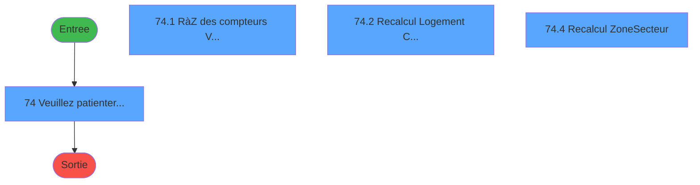
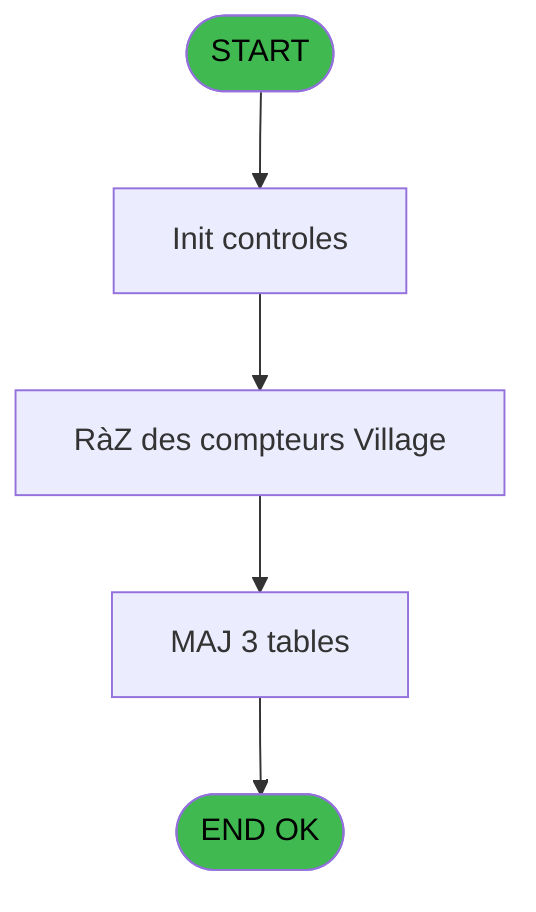

# PBS IDE 74 - Recalcul Compteurs Village

> **Analyse**: Phases 1-4 2026-02-03 17:26 -> 17:26 (13s) | Assemblage 17:26
> **Pipeline**: V7.2 Enrichi
> **Structure**: 4 onglets (Resume | Ecrans | Donnees | Connexions)

<!-- TAB:Resume -->

## 1. FICHE D'IDENTITE

| Attribut | Valeur |
|----------|--------|
| Projet | PBS |
| IDE Position | 74 |
| Nom Programme | Recalcul Compteurs Village |
| Fichier source | `Prg_74.xml` |
| Dossier IDE | Utilitaires |
| Taches | 7 (4 ecrans visibles) |
| Tables modifiees | 3 |
| Programmes appeles | 0 |
| :warning: Statut | **ORPHELIN_POTENTIEL** |

## 2. DESCRIPTION FONCTIONNELLE

**Recalcul Compteurs Village** assure la gestion complete de ce processus.

Le flux de traitement s'organise en **2 blocs fonctionnels** :

- **Calcul** (4 taches) : calculs de montants, stocks ou compteurs
- **Traitement** (3 taches) : traitements metier divers

**Donnees modifiees** : 3 tables en ecriture (fichier_menage, logement_zone_menage, tables_village).

Detail : phases du traitement

#### Phase 1 : Traitement (3 taches)

- **74** - Veuillez patienter... **[[ECRAN]](#ecran-t1)**
- **74.2.1** - MàJ Table VILLAGE
- **74.4.1** - MàJ Nouveau Zone

#### Phase 2 : Calcul (4 taches)

- **74.1** - RàZ des compteurs Village **[[ECRAN]](#ecran-t2)**
- **74.2** - Recalcul Logement CLient **[[ECRAN]](#ecran-t3)**
- **74.3** - RàZ des compteurs Menage
- **74.4** - Recalcul Zone/Secteur **[[ECRAN]](#ecran-t6)**

#### Tables impactees

| Table | Operations | Role metier |
|-------|-----------|-------------|
| logement_zone_menage | **W** (2 usages) |  |
| tables_village | **W** (2 usages) |  |
| fichier_menage | **W** (1 usages) |  |

## 3. BLOCS FONCTIONNELS

### 3.1 Traitement (3 taches)

Traitements internes.

---

#### 74 - Veuillez patienter... [[ECRAN]](#ecran-t1)

**Role** : Traitement : Veuillez patienter....
**Ecran** : 426 x 58 DLU (MDI) | [Voir mockup](#ecran-t1)

---

#### 74.2.1 - MàJ Table VILLAGE

**Role** : Traitement : MàJ Table VILLAGE.
**Variables liees** : B (> Table)

---

#### 74.4.1 - MàJ Nouveau Zone

**Role** : Creation d'enregistrement : MàJ Nouveau Zone.

### 3.2 Calcul (4 taches)

Calculs metier : montants, stocks, compteurs.

---

#### 74.1 - RàZ des compteurs Village [[ECRAN]](#ecran-t2)

**Role** : Calcul : RàZ des compteurs Village.
**Ecran** : 342 x 20 DLU (Modal) | [Voir mockup](#ecran-t2)

---

#### 74.2 - Recalcul Logement CLient [[ECRAN]](#ecran-t3)

**Role** : Calcul : Recalcul Logement CLient.
**Ecran** : 330 x 19 DLU (Modal) | [Voir mockup](#ecran-t3)

---

#### 74.3 - RàZ des compteurs Menage

**Role** : Calcul : RàZ des compteurs Menage.

---

#### 74.4 - Recalcul Zone/Secteur [[ECRAN]](#ecran-t6)

**Role** : Calcul : Recalcul Zone/Secteur.
**Ecran** : 330 x 19 DLU (Modal) | [Voir mockup](#ecran-t6)

## 5. REGLES METIER

*(Aucune regle metier identifiee)*

## 6. CONTEXTE

- **Appele par**: (aucun)
- **Appelle**: 0 programmes | **Tables**: 4 (W:3 R:1 L:0) | **Taches**: 7 | **Expressions**: 7

<!-- TAB:Ecrans -->

## 8. ECRANS

### 8.1 Forms visibles (4 / 7)

| # | Position | Tache | Nom | Type | Largeur | Hauteur | Bloc |
|---|----------|-------|-----|------|---------|---------|------|
| 1 | 74 | 74 | Veuillez patienter... | MDI | 426 | 58 | Traitement |
| 2 | 74.1 | 74.1 | RàZ des compteurs Village | Modal | 342 | 20 | Calcul |
| 3 | 74.2 | 74.2 | Recalcul Logement CLient | Modal | 330 | 19 | Calcul |
| 4 | 74.4 | 74.4 | Recalcul Zone/Secteur | Modal | 330 | 19 | Calcul |

### 8.2 Mockups Ecrans

---

#### 74 - Veuillez patienter...
**Tache** : [74](#t1) | **Type** : MDI | **Dimensions** : 426 x 58 DLU
**Bloc** : Traitement | **Titre IDE** : Veuillez patienter...

<!-- FORM-DATA:
{
    "width":  426,
    "vFactor":  8,
    "type":  "MDI",
    "hFactor":  8,
    "controls":  [
                     {
                         "x":  1,
                         "type":  "label",
                         "var":  "",
                         "y":  0,
                         "w":  423,
                         "fmt":  "",
                         "name":  "",
                         "h":  29,
                         "color":  "",
                         "text":  "",
                         "parent":  null
                     },
                     {
                         "x":  99,
                         "type":  "label",
                         "var":  "",
                         "y":  10,
                         "w":  275,
                         "fmt":  "",
                         "name":  "",
                         "h":  8,
                         "color":  "7",
                         "text":  "Recalcul compteurs",
                         "parent":  null
                     },
                     {
                         "x":  1,
                         "type":  "label",
                         "var":  "",
                         "y":  29,
                         "w":  423,
                         "fmt":  "",
                         "name":  "",
                         "h":  27,
                         "color":  "",
                         "text":  "",
                         "parent":  null
                     },
                     {
                         "x":  100,
                         "type":  "label",
                         "var":  "",
                         "y":  39,
                         "w":  233,
                         "fmt":  "",
                         "name":  "",
                         "h":  8,
                         "color":  "",
                         "text":  "Initialisation",
                         "parent":  null
                     },
                     {
                         "x":  2,
                         "type":  "image",
                         "var":  "",
                         "y":  2,
                         "w":  72,
                         "fmt":  "",
                         "name":  "",
                         "h":  25,
                         "color":  "",
                         "text":  "",
                         "parent":  null
                     }
                 ],
    "taskId":  "74",
    "height":  58
}
-->

---

#### 74.1 - RàZ des compteurs Village
**Tache** : [74.1](#t2) | **Type** : Modal | **Dimensions** : 342 x 20 DLU
**Bloc** : Calcul | **Titre IDE** : RàZ des compteurs Village

<!-- FORM-DATA:
{
    "width":  342,
    "vFactor":  8,
    "type":  "Modal",
    "hFactor":  8,
    "controls":  [
                     {
                         "x":  48,
                         "type":  "label",
                         "var":  "",
                         "y":  7,
                         "w":  233,
                         "fmt":  "",
                         "name":  "",
                         "h":  8,
                         "color":  "",
                         "text":  "Remise à Zero",
                         "parent":  null
                     }
                 ],
    "taskId":  "74.1",
    "height":  20
}
-->

---

#### 74.2 - Recalcul Logement CLient
**Tache** : [74.2](#t3) | **Type** : Modal | **Dimensions** : 330 x 19 DLU
**Bloc** : Calcul | **Titre IDE** : Recalcul Logement CLient

<!-- FORM-DATA:
{
    "width":  330,
    "vFactor":  8,
    "type":  "Modal",
    "hFactor":  8,
    "controls":  [
                     {
                         "x":  32,
                         "type":  "label",
                         "var":  "",
                         "y":  4,
                         "w":  166,
                         "fmt":  "",
                         "name":  "",
                         "h":  10,
                         "color":  "",
                         "text":  "Logement Client",
                         "parent":  null
                     },
                     {
                         "x":  221,
                         "type":  "edit",
                         "var":  "",
                         "y":  4,
                         "w":  82,
                         "fmt":  "",
                         "name":  "",
                         "h":  10,
                         "color":  "",
                         "text":  "",
                         "parent":  null
                     }
                 ],
    "taskId":  "74.2",
    "height":  19
}
-->

<strong>Champs : 1 champs</strong>

| Pos (x,y) | Nom | Variable | Type |
|-----------|-----|----------|------|
| 221,4 | (sans nom) | - | edit |

---

#### 74.4 - Recalcul Zone/Secteur
**Tache** : [74.4](#t6) | **Type** : Modal | **Dimensions** : 330 x 19 DLU
**Bloc** : Calcul | **Titre IDE** : Recalcul Zone/Secteur

<!-- FORM-DATA:
{
    "width":  330,
    "vFactor":  8,
    "type":  "Modal",
    "hFactor":  8,
    "controls":  [
                     {
                         "x":  32,
                         "type":  "label",
                         "var":  "",
                         "y":  4,
                         "w":  166,
                         "fmt":  "",
                         "name":  "",
                         "h":  10,
                         "color":  "",
                         "text":  "Menage",
                         "parent":  null
                     },
                     {
                         "x":  221,
                         "type":  "edit",
                         "var":  "",
                         "y":  4,
                         "w":  82,
                         "fmt":  "",
                         "name":  "",
                         "h":  10,
                         "color":  "",
                         "text":  "",
                         "parent":  null
                     }
                 ],
    "taskId":  "74.4",
    "height":  19
}
-->

<strong>Champs : 1 champs</strong>

| Pos (x,y) | Nom | Variable | Type |
|-----------|-----|----------|------|
| 221,4 | (sans nom) | - | edit |

## 9. NAVIGATION

### 9.1 Enchainement des ecrans

**Detail par enchainement :**

| Depuis | Action | Vers | Retour |
|--------|--------|------|--------|

### 9.3 Structure hierarchique (7 taches)

| Position | Tache | Type | Dimensions | Bloc |
|----------|-------|------|------------|------|
| **74.1** | [**Veuillez patienter...** (74)](#t1) [mockup](#ecran-t1) | MDI | 426x58 | Traitement |
| 74.1.1 | [MàJ Table VILLAGE (74.2.1)](#t4) | MDI | - | |
| 74.1.2 | [MàJ Nouveau Zone (74.4.1)](#t7) | MDI | - | |
| **74.2** | [**RàZ des compteurs Village** (74.1)](#t2) [mockup](#ecran-t2) | Modal | 342x20 | Calcul |
| 74.2.1 | [Recalcul Logement CLient (74.2)](#t3) [mockup](#ecran-t3) | Modal | 330x19 | |
| 74.2.2 | [RàZ des compteurs Menage (74.3)](#t5) | MDI | - | |
| 74.2.3 | [Recalcul Zone/Secteur (74.4)](#t6) [mockup](#ecran-t6) | Modal | 330x19 | |

### 9.4 Algorigramme

> **Legende**: Vert = START/END OK | Rouge = END KO | Bleu = Decisions
> *Algorigramme auto-genere. Utiliser `/algorigramme` pour une synthese metier detaillee.*

<!-- TAB:Donnees -->

## 10. TABLES

### Tables utilisees (4)

| ID | Nom | Description | Type | R | W | L | Usages |
|----|-----|-------------|------|---|---|---|--------|
| 103 | logement_client__loc |  | DB | R |   |   | 1 |
| 104 | fichier_menage |  | DB |   | **W** |   | 1 |
| 107 | logement_zone_menage |  | DB |   | **W** |   | 2 |
| 113 | tables_village |  | DB |   | **W** |   | 2 |

### Colonnes par table (2 / 4 tables avec colonnes identifiees)

Table 103 - logement_client__loc (R) - 1 usages

*Table utilisee uniquement en Link ou aucune colonne Real identifiee dans le DataView.*

Table 104 - fichier_menage (**W**) - 1 usages

*Table utilisee uniquement en Link ou aucune colonne Real identifiee dans le DataView.*

Table 107 - logement_zone_menage (**W**) - 2 usages

| Lettre | Variable | Acces | Type |
|--------|----------|-------|------|
| A | >Zone/secteur | W | Alpha |
| B | Code Zone/Secteur | W | Alpha |

Table 113 - tables_village (**W**) - 2 usages

| Lettre | Variable | Acces | Type |
|--------|----------|-------|------|
| A | v.Nom Table | W | Alpha |
| B | > Table | W | Alpha |
| C | > Operateur | W | Alpha |

## 11. VARIABLES

### 11.1 Variables de session (1)

Variables persistantes pendant toute la session.

| Lettre | Nom | Type | Usage dans |
|--------|-----|------|-----------|
| A | v.Reponse | Numeric | 1x session |

### 11.2 Autres (2)

Variables diverses.

| Lettre | Nom | Type | Usage dans |
|--------|-----|------|-----------|
| B | > Table | Alpha | - |
| C | > Operateur | Alpha | - |

## 12. EXPRESSIONS

**7 / 7 expressions decodees (100%)**

### 12.1 Repartition par type

| Type | Expressions | Regles |
|------|-------------|--------|
| CONSTANTE | 4 | 0 |
| OTHER | 2 | 0 |
| CONDITION | 1 | 0 |

### 12.2 Expressions cles par type

#### CONSTANTE (4 expressions)

| Type | IDE | Expression | Regle |
|------|-----|------------|-------|
| CONSTANTE | 4 | `'VBATI'` | - |
| CONSTANTE | 5 | `'VVUES'` | - |
| CONSTANTE | 2 | `'VENSE'` | - |
| CONSTANTE | 3 | `'VLOGE'` | - |

#### OTHER (2 expressions)

| Type | IDE | Expression | Regle |
|------|-----|------------|-------|
| OTHER | 7 | `SetCrsr (1)` | - |
| OTHER | 1 | `SetCrsr (2)` | - |

#### CONDITION (1 expressions)

| Type | IDE | Expression | Regle |
|------|-----|------------|-------|
| CONDITION | 6 | `v.Reponse [A]=6` | - |

<!-- TAB:Connexions -->

## 13. GRAPHE D'APPELS

### 13.1 Chaine depuis Main (Callers)

**Chemin**: (pas de callers directs)

### 13.2 Callers

| IDE | Nom Programme | Nb Appels |
|-----|---------------|-----------|
| - | (aucun) | - |

### 13.3 Callees (programmes appeles)

### 13.4 Detail Callees avec contexte

| IDE | Nom Programme | Appels | Contexte |
|-----|---------------|--------|----------|
| - | (aucun) | - | - |

## 14. RECOMMANDATIONS MIGRATION

### 14.1 Profil du programme

| Metrique | Valeur | Impact migration |
|----------|--------|-----------------|
| Lignes de logique | 81 | Programme compact |
| Expressions | 7 | Peu de logique |
| Tables WRITE | 3 | Impact modere |
| Sous-programmes | 0 | Peu de dependances |
| Ecrans visibles | 4 | Quelques ecrans |
| Code desactive | 0% (0 / 81) | Code sain |
| Regles metier | 0 | Pas de regle identifiee |

### 14.2 Plan de migration par bloc

#### Traitement (3 taches: 1 ecran, 2 traitements)

- **Strategie** : Orchestrateur avec 1 ecrans (Razor/React) et 2 traitements backend (services).
- Les ecrans deviennent des composants UI, les traitements invisibles deviennent des services injectables.
- Decomposer les taches en services unitaires testables.

#### Calcul (4 taches: 3 ecrans, 1 traitement)

- **Strategie** : Services de calcul purs (Domain Services).
- Migrer la logique de calcul (stock, compteurs, montants)

### 14.3 Dependances critiques

| Dependance | Type | Appels | Impact |
|------------|------|--------|--------|
| fichier_menage | Table WRITE (Database) | 1x | Schema + repository |
| logement_zone_menage | Table WRITE (Database) | 2x | Schema + repository |
| tables_village | Table WRITE (Database) | 2x | Schema + repository |

---
*Spec DETAILED generee par Pipeline V7.2 - 2026-02-03 17:26*
