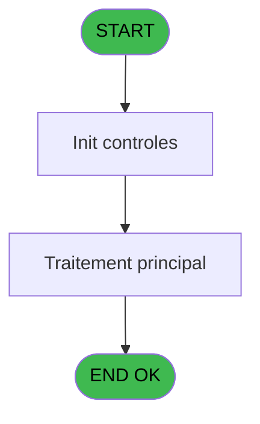
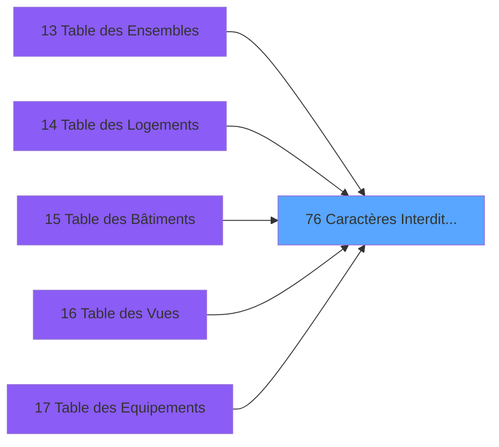

# PBS IDE 76 - Caractères Interdits (A6)

> **Analyse**: Phases 1-4 2026-02-03 17:26 -> 17:27 (15s) | Assemblage 17:27
> **Pipeline**: V7.2 Enrichi
> **Structure**: 4 onglets (Resume | Ecrans | Donnees | Connexions)

<!-- TAB:Resume -->

## 1. FICHE D'IDENTITE

| Attribut | Valeur |
|----------|--------|
| Projet | PBS |
| IDE Position | 76 |
| Nom Programme | Caractères Interdits (A6) |
| Fichier source | `Prg_76.xml` |
| Dossier IDE | Utilitaires |
| Taches | 2 (0 ecrans visibles) |
| Tables modifiees | 0 |
| Programmes appeles | 0 |

## 2. DESCRIPTION FONCTIONNELLE

**Caractères Interdits (A6)** assure la gestion complete de ce processus, accessible depuis [ Duplication Logement Client (IDE 29)](PBS-IDE-29.md), [ Duplication Logement Perso (IDE 35)](PBS-IDE-35.md), [Duplication Logement Exterieur (IDE 39)](PBS-IDE-39.md), [Table des Ensembles (IDE 13)](PBS-IDE-13.md), [Table des Logements (IDE 14)](PBS-IDE-14.md), [Table des Bâtiments (IDE 15)](PBS-IDE-15.md), [Table des Vues (IDE 16)](PBS-IDE-16.md), [Table des Equipements (IDE 17)](PBS-IDE-17.md), [Table des Ensembles (IDE 95)](PBS-IDE-95.md), [Table des Logements (IDE 96)](PBS-IDE-96.md), [Table des Bâtiments (IDE 97)](PBS-IDE-97.md), [Table des Catégorie (IDE 98)](PBS-IDE-98.md).

Le flux de traitement s'organise en **2 blocs fonctionnels** :

- **Validation** (1 tache) : controles et verifications de coherence
- **Traitement** (1 tache) : traitements metier divers

Detail : phases du traitement

#### Phase 1 : Traitement (1 tache)

- **76** - Caractères Interdits

#### Phase 2 : Validation (1 tache)

- **76.1** - Verification Chaine

## 3. BLOCS FONCTIONNELS

### 3.1 Traitement (1 tache)

Traitements internes.

---

#### 76 - Caractères Interdits

**Role** : Traitement : Caractères Interdits.

### 3.2 Validation (1 tache)

Controles de coherence : 1 tache verifie les donnees et conditions.

---

#### 76.1 - Verification Chaine

**Role** : Verification : Verification Chaine.

## 5. REGLES METIER

*(Aucune regle metier identifiee)*

## 6. CONTEXTE

- **Appele par**: [ Duplication Logement Client (IDE 29)](PBS-IDE-29.md), [ Duplication Logement Perso (IDE 35)](PBS-IDE-35.md), [Duplication Logement Exterieur (IDE 39)](PBS-IDE-39.md), [Table des Ensembles (IDE 13)](PBS-IDE-13.md), [Table des Logements (IDE 14)](PBS-IDE-14.md), [Table des Bâtiments (IDE 15)](PBS-IDE-15.md), [Table des Vues (IDE 16)](PBS-IDE-16.md), [Table des Equipements (IDE 17)](PBS-IDE-17.md), [Table des Ensembles (IDE 95)](PBS-IDE-95.md), [Table des Logements (IDE 96)](PBS-IDE-96.md), [Table des Bâtiments (IDE 97)](PBS-IDE-97.md), [Table des Catégorie (IDE 98)](PBS-IDE-98.md)
- **Appelle**: 0 programmes | **Tables**: 0 (W:0 R:0 L:0) | **Taches**: 2 | **Expressions**: 8

<!-- TAB:Ecrans -->

## 8. ECRANS

*(Programme sans ecran visible)*

## 9. NAVIGATION

### 9.3 Structure hierarchique (2 taches)

| Position | Tache | Type | Dimensions | Bloc |
|----------|-------|------|------------|------|
| **76.1** | [**Caractères Interdits** (76)](#t1) | MDI | - | Traitement |
| **76.2** | [**Verification Chaine** (76.1)](#t2) | MDI | - | Validation |

### 9.4 Algorigramme

> **Legende**: Vert = START/END OK | Rouge = END KO | Bleu = Decisions
> *Algorigramme auto-genere. Utiliser `/algorigramme` pour une synthese metier detaillee.*

<!-- TAB:Donnees -->

## 10. TABLES

### Tables utilisees (0)

| ID | Nom | Description | Type | R | W | L | Usages |
|----|-----|-------------|------|---|---|---|--------|

### Colonnes par table (0 / 0 tables avec colonnes identifiees)

## 11. VARIABLES

### 11.1 Autres (2)

Variables diverses.

| Lettre | Nom | Type | Usage dans |
|--------|-----|------|-----------|
| A | > Code | Alpha | 1x refs |
| B | < Valide | Logical | 3x refs |

## 12. EXPRESSIONS

**8 / 8 expressions decodees (100%)**

### 12.1 Repartition par type

| Type | Expressions | Regles |
|------|-------------|--------|
| CONDITION | 3 | 0 |
| CONSTANTE | 1 | 0 |
| CAST_LOGIQUE | 4 | 0 |

### 12.2 Expressions cles par type

#### CONDITION (3 expressions)

| Type | IDE | Expression | Regle |
|------|-----|------------|-------|
| CONDITION | 8 | `< Valide [B]>Len ({1,1})` | - |
| CONDITION | 7 | `< Valide [B]+1` | - |
| CONDITION | 6 | `InStr ('ABCDEFGHIJKLMNOPQRSTUVWXYZ0123456789+'&ASCIIChr (32),MID ({1,1},< Valide [B],1))=0` | - |

#### CONSTANTE (1 expressions)

| Type | IDE | Expression | Regle |
|------|-----|------------|-------|
| CONSTANTE | 3 | `1` | - |

#### CAST_LOGIQUE (4 expressions)

| Type | IDE | Expression | Regle |
|------|-----|------------|-------|
| CAST_LOGIQUE | 4 | `'TRUE'LOG` | - |
| CAST_LOGIQUE | 5 | `'FALSE'LOG` | - |
| CAST_LOGIQUE | 1 | `'TRUE'LOG` | - |
| CAST_LOGIQUE | 2 | `> Code [A]='TRUE'LOG` | - |

<!-- TAB:Connexions -->

## 13. GRAPHE D'APPELS

### 13.1 Chaine depuis Main (Callers)

Main -> ... -> [ Duplication Logement Client (IDE 29)](PBS-IDE-29.md) -> **Caractères Interdits (A6) (IDE 76)**

Main -> ... -> [ Duplication Logement Perso (IDE 35)](PBS-IDE-35.md) -> **Caractères Interdits (A6) (IDE 76)**

Main -> ... -> [Duplication Logement Exterieur (IDE 39)](PBS-IDE-39.md) -> **Caractères Interdits (A6) (IDE 76)**

Main -> ... -> [Table des Ensembles (IDE 13)](PBS-IDE-13.md) -> **Caractères Interdits (A6) (IDE 76)**

Main -> ... -> [Table des Logements (IDE 14)](PBS-IDE-14.md) -> **Caractères Interdits (A6) (IDE 76)**

Main -> ... -> [Table des Bâtiments (IDE 15)](PBS-IDE-15.md) -> **Caractères Interdits (A6) (IDE 76)**

Main -> ... -> [Table des Vues (IDE 16)](PBS-IDE-16.md) -> **Caractères Interdits (A6) (IDE 76)**

Main -> ... -> [Table des Equipements (IDE 17)](PBS-IDE-17.md) -> **Caractères Interdits (A6) (IDE 76)**

Main -> ... -> [Table des Ensembles (IDE 95)](PBS-IDE-95.md) -> **Caractères Interdits (A6) (IDE 76)**

Main -> ... -> [Table des Logements (IDE 96)](PBS-IDE-96.md) -> **Caractères Interdits (A6) (IDE 76)**

Main -> ... -> [Table des Bâtiments (IDE 97)](PBS-IDE-97.md) -> **Caractères Interdits (A6) (IDE 76)**

Main -> ... -> [Table des Catégorie (IDE 98)](PBS-IDE-98.md) -> **Caractères Interdits (A6) (IDE 76)**

### 13.2 Callers

| IDE | Nom Programme | Nb Appels |
|-----|---------------|-----------|
| [29](PBS-IDE-29.md) |  Duplication Logement Client | 2 |
| [35](PBS-IDE-35.md) |  Duplication Logement Perso | 2 |
| [39](PBS-IDE-39.md) | Duplication Logement Exterieur | 2 |
| [13](PBS-IDE-13.md) | Table des Ensembles | 1 |
| [14](PBS-IDE-14.md) | Table des Logements | 1 |
| [15](PBS-IDE-15.md) | Table des Bâtiments | 1 |
| [16](PBS-IDE-16.md) | Table des Vues | 1 |
| [17](PBS-IDE-17.md) | Table des Equipements | 1 |
| [95](PBS-IDE-95.md) | Table des Ensembles | 1 |
| [96](PBS-IDE-96.md) | Table des Logements | 1 |
| [97](PBS-IDE-97.md) | Table des Bâtiments | 1 |
| [98](PBS-IDE-98.md) | Table des Catégorie | 1 |

### 13.3 Callees (programmes appeles)

### 13.4 Detail Callees avec contexte

| IDE | Nom Programme | Appels | Contexte |
|-----|---------------|--------|----------|
| - | (aucun) | - | - |

## 14. RECOMMANDATIONS MIGRATION

### 14.1 Profil du programme

| Metrique | Valeur | Impact migration |
|----------|--------|-----------------|
| Lignes de logique | 21 | Programme compact |
| Expressions | 8 | Peu de logique |
| Tables WRITE | 0 | Impact faible |
| Sous-programmes | 0 | Peu de dependances |
| Ecrans visibles | 0 | Ecran unique ou traitement batch |
| Code desactive | 0% (0 / 21) | Code sain |
| Regles metier | 0 | Pas de regle identifiee |

### 14.2 Plan de migration par bloc

#### Traitement (1 tache: 0 ecran, 1 traitement)

- **Strategie** : 1 service(s) backend injectable(s) (Domain Services).
- Decomposer les taches en services unitaires testables.

#### Validation (1 tache: 0 ecran, 1 traitement)

- **Strategie** : FluentValidation avec validators specifiques.
- Chaque tache de validation -> un validator injectable

### 14.3 Dependances critiques

| Dependance | Type | Appels | Impact |
|------------|------|--------|--------|

---
*Spec DETAILED generee par Pipeline V7.2 - 2026-02-03 17:27*
