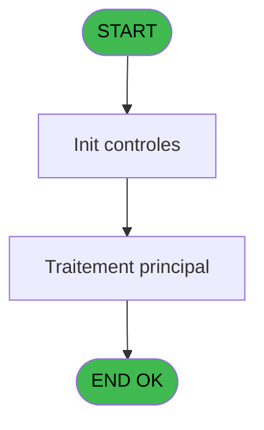
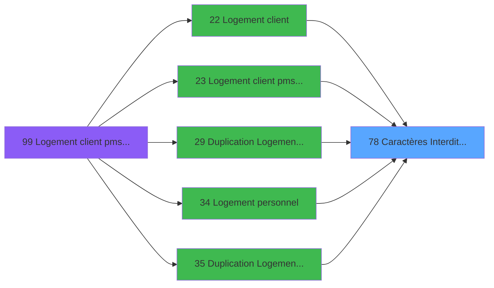

# PBS IDE 78 - Caractères Interdits (TEL)

> **Analyse**: Phases 1-4 2026-02-03 17:27 -> 17:27 (14s) | Assemblage 17:27
> **Pipeline**: V7.2 Enrichi
> **Structure**: 4 onglets (Resume | Ecrans | Donnees | Connexions)

<!-- TAB:Resume -->

## 1. FICHE D'IDENTITE

| Attribut | Valeur |
|----------|--------|
| Projet | PBS |
| IDE Position | 78 |
| Nom Programme | Caractères Interdits (TEL) |
| Fichier source | `Prg_78.xml` |
| Dossier IDE | Utilitaires |
| Taches | 2 (0 ecrans visibles) |
| Tables modifiees | 0 |
| Programmes appeles | 0 |

## 2. DESCRIPTION FONCTIONNELLE

**Caractères Interdits (TEL)** assure la gestion complete de ce processus, accessible depuis [Logement client (IDE 22)](PBS-IDE-22.md), [Logement client pms-626 evo (IDE 23)](PBS-IDE-23.md), [ Duplication Logement Client (IDE 29)](PBS-IDE-29.md), [Logement personnel (IDE 34)](PBS-IDE-34.md), [ Duplication Logement Perso (IDE 35)](PBS-IDE-35.md), [Logement exterieur (IDE 38)](PBS-IDE-38.md), [Duplication Logement Exterieur (IDE 39)](PBS-IDE-39.md), [Logement client pms-626 (IDE 99)](PBS-IDE-99.md).

Le flux de traitement s'organise en **2 blocs fonctionnels** :

- **Validation** (1 tache) : controles et verifications de coherence
- **Traitement** (1 tache) : traitements metier divers

Detail : phases du traitement

#### Phase 1 : Traitement (1 tache)

- **78** - Caractères Interdits

#### Phase 2 : Validation (1 tache)

- **78.1** - Verification Chaine

## 3. BLOCS FONCTIONNELS

### 3.1 Traitement (1 tache)

Traitements internes.

---

#### 78 - Caractères Interdits

**Role** : Traitement : Caractères Interdits.

### 3.2 Validation (1 tache)

Controles de coherence : 1 tache verifie les donnees et conditions.

---

#### 78.1 - Verification Chaine

**Role** : Verification : Verification Chaine.

## 5. REGLES METIER

*(Aucune regle metier identifiee)*

## 6. CONTEXTE

- **Appele par**: [Logement client (IDE 22)](PBS-IDE-22.md), [Logement client pms-626 evo (IDE 23)](PBS-IDE-23.md), [ Duplication Logement Client (IDE 29)](PBS-IDE-29.md), [Logement personnel (IDE 34)](PBS-IDE-34.md), [ Duplication Logement Perso (IDE 35)](PBS-IDE-35.md), [Logement exterieur (IDE 38)](PBS-IDE-38.md), [Duplication Logement Exterieur (IDE 39)](PBS-IDE-39.md), [Logement client pms-626 (IDE 99)](PBS-IDE-99.md)
- **Appelle**: 0 programmes | **Tables**: 0 (W:0 R:0 L:0) | **Taches**: 2 | **Expressions**: 8

<!-- TAB:Ecrans -->

## 8. ECRANS

*(Programme sans ecran visible)*

## 9. NAVIGATION

### 9.3 Structure hierarchique (2 taches)

| Position | Tache | Type | Dimensions | Bloc |
|----------|-------|------|------------|------|
| **78.1** | [**Caractères Interdits** (78)](#t1) | MDI | - | Traitement |
| **78.2** | [**Verification Chaine** (78.1)](#t2) | MDI | - | Validation |

### 9.4 Algorigramme

> **Legende**: Vert = START/END OK | Rouge = END KO | Bleu = Decisions
> *Algorigramme auto-genere. Utiliser `/algorigramme` pour une synthese metier detaillee.*

<!-- TAB:Donnees -->

## 10. TABLES

### Tables utilisees (0)

| ID | Nom | Description | Type | R | W | L | Usages |
|----|-----|-------------|------|---|---|---|--------|

### Colonnes par table (0 / 0 tables avec colonnes identifiees)

## 11. VARIABLES

### 11.1 Autres (2)

Variables diverses.

| Lettre | Nom | Type | Usage dans |
|--------|-----|------|-----------|
| A | > Code Tel | Alpha | 1x refs |
| B | < Controle | Logical | 3x refs |

## 12. EXPRESSIONS

**8 / 8 expressions decodees (100%)**

### 12.1 Repartition par type

| Type | Expressions | Regles |
|------|-------------|--------|
| CONDITION | 4 | 0 |
| CONSTANTE | 1 | 0 |
| CAST_LOGIQUE | 3 | 0 |

### 12.2 Expressions cles par type

#### CONDITION (4 expressions)

| Type | IDE | Expression | Regle |
|------|-----|------------|-------|
| CONDITION | 6 | `InStr ('0123456789',MID ({1,1},< Controle [B],1))=0` | - |
| CONDITION | 8 | `< Controle [B]>Len (LTrim (RTrim ({1,1})))` | - |
| CONDITION | 7 | `< Controle [B]+1` | - |
| CONDITION | 2 | `> Code Tel [A]` | - |

#### CONSTANTE (1 expressions)

| Type | IDE | Expression | Regle |
|------|-----|------------|-------|
| CONSTANTE | 3 | `1` | - |

#### CAST_LOGIQUE (3 expressions)

| Type | IDE | Expression | Regle |
|------|-----|------------|-------|
| CAST_LOGIQUE | 5 | `'FALSE'LOG` | - |
| CAST_LOGIQUE | 4 | `'TRUE'LOG` | - |
| CAST_LOGIQUE | 1 | `'TRUE'LOG` | - |

<!-- TAB:Connexions -->

## 13. GRAPHE D'APPELS

### 13.1 Chaine depuis Main (Callers)

Main -> ... -> [Logement client (IDE 22)](PBS-IDE-22.md) -> **Caractères Interdits (TEL) (IDE 78)**

Main -> ... -> [Logement client pms-626 evo (IDE 23)](PBS-IDE-23.md) -> **Caractères Interdits (TEL) (IDE 78)**

Main -> ... -> [ Duplication Logement Client (IDE 29)](PBS-IDE-29.md) -> **Caractères Interdits (TEL) (IDE 78)**

Main -> ... -> [Logement personnel (IDE 34)](PBS-IDE-34.md) -> **Caractères Interdits (TEL) (IDE 78)**

Main -> ... -> [ Duplication Logement Perso (IDE 35)](PBS-IDE-35.md) -> **Caractères Interdits (TEL) (IDE 78)**

Main -> ... -> [Logement exterieur (IDE 38)](PBS-IDE-38.md) -> **Caractères Interdits (TEL) (IDE 78)**

Main -> ... -> [Duplication Logement Exterieur (IDE 39)](PBS-IDE-39.md) -> **Caractères Interdits (TEL) (IDE 78)**

Main -> ... -> [Logement client pms-626 (IDE 99)](PBS-IDE-99.md) -> **Caractères Interdits (TEL) (IDE 78)**

### 13.2 Callers

| IDE | Nom Programme | Nb Appels |
|-----|---------------|-----------|
| [22](PBS-IDE-22.md) | Logement client | 1 |
| [23](PBS-IDE-23.md) | Logement client pms-626 evo | 1 |
| [29](PBS-IDE-29.md) |  Duplication Logement Client | 1 |
| [34](PBS-IDE-34.md) | Logement personnel | 1 |
| [35](PBS-IDE-35.md) |  Duplication Logement Perso | 1 |
| [38](PBS-IDE-38.md) | Logement exterieur | 1 |
| [39](PBS-IDE-39.md) | Duplication Logement Exterieur | 1 |
| [99](PBS-IDE-99.md) | Logement client pms-626 | 1 |

### 13.3 Callees (programmes appeles)

### 13.4 Detail Callees avec contexte

| IDE | Nom Programme | Appels | Contexte |
|-----|---------------|--------|----------|
| - | (aucun) | - | - |

## 14. RECOMMANDATIONS MIGRATION

### 14.1 Profil du programme

| Metrique | Valeur | Impact migration |
|----------|--------|-----------------|
| Lignes de logique | 12 | Programme compact |
| Expressions | 8 | Peu de logique |
| Tables WRITE | 0 | Impact faible |
| Sous-programmes | 0 | Peu de dependances |
| Ecrans visibles | 0 | Ecran unique ou traitement batch |
| Code desactive | 0% (0 / 12) | Code sain |
| Regles metier | 0 | Pas de regle identifiee |

### 14.2 Plan de migration par bloc

#### Traitement (1 tache: 0 ecran, 1 traitement)

- **Strategie** : 1 service(s) backend injectable(s) (Domain Services).
- Decomposer les taches en services unitaires testables.

#### Validation (1 tache: 0 ecran, 1 traitement)

- **Strategie** : FluentValidation avec validators specifiques.
- Chaque tache de validation -> un validator injectable

### 14.3 Dependances critiques

| Dependance | Type | Appels | Impact |
|------------|------|--------|--------|

---
*Spec DETAILED generee par Pipeline V7.2 - 2026-02-03 17:27*
