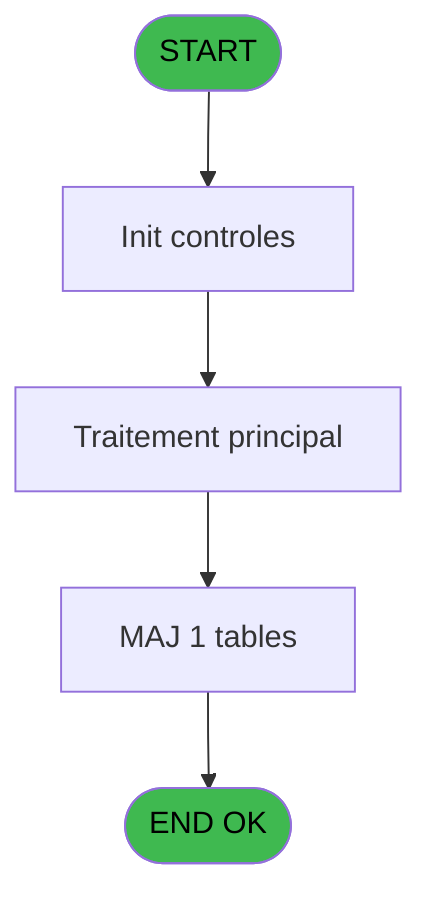
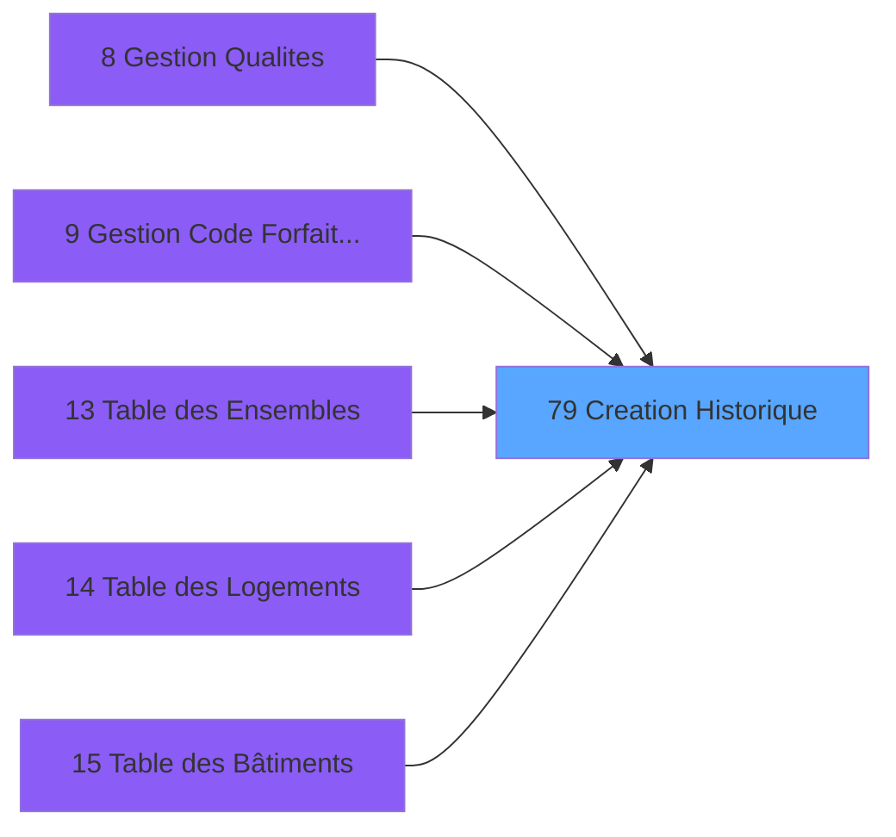

# PBS IDE 79 - Creation Historique

> **Analyse**: Phases 1-4 2026-02-03 17:27 -> 17:28 (16s) | Assemblage 17:28
> **Pipeline**: V7.2 Enrichi
> **Structure**: 4 onglets (Resume | Ecrans | Donnees | Connexions)

<!-- TAB:Resume -->

## 1. FICHE D'IDENTITE

| Attribut | Valeur |
|----------|--------|
| Projet | PBS |
| IDE Position | 79 |
| Nom Programme | Creation Historique |
| Fichier source | `Prg_79.xml` |
| Dossier IDE | Utilitaires |
| Taches | 1 (0 ecrans visibles) |
| Tables modifiees | 1 |
| Programmes appeles | 0 |

## 2. DESCRIPTION FONCTIONNELLE

**Creation Historique** assure la gestion complete de ce processus, accessible depuis [Configuration Village (IDE 72)](PBS-IDE-72.md), [Gestion Qualites (IDE 8)](PBS-IDE-8.md), [Gestion Code Forfait TAI (IDE 9)](PBS-IDE-9.md), [Table des Ensembles (IDE 13)](PBS-IDE-13.md), [Table des Logements (IDE 14)](PBS-IDE-14.md), [Table des Bâtiments (IDE 15)](PBS-IDE-15.md), [Table des Vues (IDE 16)](PBS-IDE-16.md), [Table des Equipements (IDE 17)](PBS-IDE-17.md), [Table des Lits (IDE 18)](PBS-IDE-18.md), [Gestion Qualites (IDE 45)](PBS-IDE-45.md), [Gestion des Imports ########## (IDE 61)](PBS-IDE-61.md), [  Suppression Import ######### (IDE 63)](PBS-IDE-63.md), [Gestion Code Logement (IDE 67)](PBS-IDE-67.md), [Gestion Code Logement pms-626 (IDE 68)](PBS-IDE-68.md), [Suppression Code Logement (IDE 70)](PBS-IDE-70.md), [Gestion Zones/Secteurs (IDE 71)](PBS-IDE-71.md), [Table des Ensembles (IDE 95)](PBS-IDE-95.md), [Table des Logements (IDE 96)](PBS-IDE-96.md), [Table des Bâtiments (IDE 97)](PBS-IDE-97.md), [Table des Catégorie (IDE 98)](PBS-IDE-98.md).

Le flux de traitement s'organise en **1 blocs fonctionnels** :

- **Creation** (1 tache) : insertion d'enregistrements en base (mouvements, prestations)

**Donnees modifiees** : 1 tables en ecriture (historik_station).

## 3. BLOCS FONCTIONNELS

### 3.1 Creation (1 tache)

Insertion de nouveaux enregistrements en base.

---

#### 79 - Creation Historique

**Role** : Consultation/chargement : Creation Historique.
**Variables liees** : B (P0-Code Historique)

## 5. REGLES METIER

*(Aucune regle metier identifiee)*

## 6. CONTEXTE

- **Appele par**: [Configuration Village (IDE 72)](PBS-IDE-72.md), [Gestion Qualites (IDE 8)](PBS-IDE-8.md), [Gestion Code Forfait TAI (IDE 9)](PBS-IDE-9.md), [Table des Ensembles (IDE 13)](PBS-IDE-13.md), [Table des Logements (IDE 14)](PBS-IDE-14.md), [Table des Bâtiments (IDE 15)](PBS-IDE-15.md), [Table des Vues (IDE 16)](PBS-IDE-16.md), [Table des Equipements (IDE 17)](PBS-IDE-17.md), [Table des Lits (IDE 18)](PBS-IDE-18.md), [Gestion Qualites (IDE 45)](PBS-IDE-45.md), [Gestion des Imports ########## (IDE 61)](PBS-IDE-61.md), [  Suppression Import ######### (IDE 63)](PBS-IDE-63.md), [Gestion Code Logement (IDE 67)](PBS-IDE-67.md), [Gestion Code Logement pms-626 (IDE 68)](PBS-IDE-68.md), [Suppression Code Logement (IDE 70)](PBS-IDE-70.md), [Gestion Zones/Secteurs (IDE 71)](PBS-IDE-71.md), [Table des Ensembles (IDE 95)](PBS-IDE-95.md), [Table des Logements (IDE 96)](PBS-IDE-96.md), [Table des Bâtiments (IDE 97)](PBS-IDE-97.md), [Table des Catégorie (IDE 98)](PBS-IDE-98.md)
- **Appelle**: 0 programmes | **Tables**: 1 (W:1 R:0 L:0) | **Taches**: 1 | **Expressions**: 6

<!-- TAB:Ecrans -->

## 8. ECRANS

*(Programme sans ecran visible)*

## 9. NAVIGATION

### 9.3 Structure hierarchique (1 tache)

| Position | Tache | Type | Dimensions | Bloc |
|----------|-------|------|------------|------|
| **79.1** | [**Creation Historique** (79)](#t1) | MDI | - | Creation |

### 9.4 Algorigramme

> **Legende**: Vert = START/END OK | Rouge = END KO | Bleu = Decisions
> *Algorigramme auto-genere. Utiliser `/algorigramme` pour une synthese metier detaillee.*

<!-- TAB:Donnees -->

## 10. TABLES

### Tables utilisees (1)

| ID | Nom | Description | Type | R | W | L | Usages |
|----|-----|-------------|------|---|---|---|--------|
| 88 | historik_station | Historique / journal | DB |   | **W** |   | 1 |

### Colonnes par table (1 / 1 tables avec colonnes identifiees)

Table 88 - historik_station (**W**) - 1 usages

| Lettre | Variable | Acces | Type |
|--------|----------|-------|------|
| A | P0-Societe | W | Alpha |
| B | P0-Code Historique | W | Alpha |
| C | P0-Libelle | W | Alpha |

## 11. VARIABLES

### 11.1 Autres (3)

Variables diverses.

| Lettre | Nom | Type | Usage dans |
|--------|-----|------|-----------|
| A | P0-Societe | Alpha | 1x refs |
| B | P0-Code Historique | Alpha | [79](#t1) |
| C | P0-Libelle | Alpha | 1x refs |

## 12. EXPRESSIONS

**6 / 6 expressions decodees (100%)**

### 12.1 Repartition par type

| Type | Expressions | Regles |
|------|-------------|--------|
| DATE | 1 | 0 |
| OTHER | 4 | 0 |
| REFERENCE_VG | 1 | 0 |

### 12.2 Expressions cles par type

#### DATE (1 expressions)

| Type | IDE | Expression | Regle |
|------|-----|------------|-------|
| DATE | 4 | `Date ()` | - |

#### OTHER (4 expressions)

| Type | IDE | Expression | Regle |
|------|-----|------------|-------|
| OTHER | 5 | `Time ()` | - |
| OTHER | 6 | `P0-Libelle [C]` | - |
| OTHER | 1 | `P0-Societe [A]` | - |
| OTHER | 3 | `P0-Code Historique [B]` | - |

#### REFERENCE_VG (1 expressions)

| Type | IDE | Expression | Regle |
|------|-----|------------|-------|
| REFERENCE_VG | 2 | `VG3` | - |

<!-- TAB:Connexions -->

## 13. GRAPHE D'APPELS

### 13.1 Chaine depuis Main (Callers)

Main -> ... -> [Configuration Village (IDE 72)](PBS-IDE-72.md) -> **Creation Historique (IDE 79)**

Main -> ... -> [Gestion Qualites (IDE 8)](PBS-IDE-8.md) -> **Creation Historique (IDE 79)**

Main -> ... -> [Gestion Code Forfait TAI (IDE 9)](PBS-IDE-9.md) -> **Creation Historique (IDE 79)**

Main -> ... -> [Table des Ensembles (IDE 13)](PBS-IDE-13.md) -> **Creation Historique (IDE 79)**

Main -> ... -> [Table des Logements (IDE 14)](PBS-IDE-14.md) -> **Creation Historique (IDE 79)**

Main -> ... -> [Table des Bâtiments (IDE 15)](PBS-IDE-15.md) -> **Creation Historique (IDE 79)**

Main -> ... -> [Table des Vues (IDE 16)](PBS-IDE-16.md) -> **Creation Historique (IDE 79)**

Main -> ... -> [Table des Equipements (IDE 17)](PBS-IDE-17.md) -> **Creation Historique (IDE 79)**

Main -> ... -> [Table des Lits (IDE 18)](PBS-IDE-18.md) -> **Creation Historique (IDE 79)**

Main -> ... -> [Gestion Qualites (IDE 45)](PBS-IDE-45.md) -> **Creation Historique (IDE 79)**

Main -> ... -> [Gestion des Imports ########## (IDE 61)](PBS-IDE-61.md) -> **Creation Historique (IDE 79)**

Main -> ... -> [  Suppression Import ######### (IDE 63)](PBS-IDE-63.md) -> **Creation Historique (IDE 79)**

Main -> ... -> [Gestion Code Logement (IDE 67)](PBS-IDE-67.md) -> **Creation Historique (IDE 79)**

Main -> ... -> [Gestion Code Logement pms-626 (IDE 68)](PBS-IDE-68.md) -> **Creation Historique (IDE 79)**

Main -> ... -> [Suppression Code Logement (IDE 70)](PBS-IDE-70.md) -> **Creation Historique (IDE 79)**

Main -> ... -> [Gestion Zones/Secteurs (IDE 71)](PBS-IDE-71.md) -> **Creation Historique (IDE 79)**

Main -> ... -> [Table des Ensembles (IDE 95)](PBS-IDE-95.md) -> **Creation Historique (IDE 79)**

Main -> ... -> [Table des Logements (IDE 96)](PBS-IDE-96.md) -> **Creation Historique (IDE 79)**

Main -> ... -> [Table des Bâtiments (IDE 97)](PBS-IDE-97.md) -> **Creation Historique (IDE 79)**

Main -> ... -> [Table des Catégorie (IDE 98)](PBS-IDE-98.md) -> **Creation Historique (IDE 79)**

### 13.2 Callers

| IDE | Nom Programme | Nb Appels |
|-----|---------------|-----------|
| [72](PBS-IDE-72.md) | Configuration Village | 2 |
| [8](PBS-IDE-8.md) | Gestion Qualites | 1 |
| [9](PBS-IDE-9.md) | Gestion Code Forfait TAI | 1 |
| [13](PBS-IDE-13.md) | Table des Ensembles | 1 |
| [14](PBS-IDE-14.md) | Table des Logements | 1 |
| [15](PBS-IDE-15.md) | Table des Bâtiments | 1 |
| [16](PBS-IDE-16.md) | Table des Vues | 1 |
| [17](PBS-IDE-17.md) | Table des Equipements | 1 |
| [18](PBS-IDE-18.md) | Table des Lits | 1 |
| [45](PBS-IDE-45.md) | Gestion Qualites | 1 |
| [61](PBS-IDE-61.md) | Gestion des Imports ########## | 1 |
| [63](PBS-IDE-63.md) |   Suppression Import ######### | 1 |
| [67](PBS-IDE-67.md) | Gestion Code Logement | 1 |
| [68](PBS-IDE-68.md) | Gestion Code Logement pms-626 | 1 |
| [70](PBS-IDE-70.md) | Suppression Code Logement | 1 |
| [71](PBS-IDE-71.md) | Gestion Zones/Secteurs | 1 |
| [95](PBS-IDE-95.md) | Table des Ensembles | 1 |
| [96](PBS-IDE-96.md) | Table des Logements | 1 |
| [97](PBS-IDE-97.md) | Table des Bâtiments | 1 |
| [98](PBS-IDE-98.md) | Table des Catégorie | 1 |

### 13.3 Callees (programmes appeles)

### 13.4 Detail Callees avec contexte

| IDE | Nom Programme | Appels | Contexte |
|-----|---------------|--------|----------|
| - | (aucun) | - | - |

## 14. RECOMMANDATIONS MIGRATION

### 14.1 Profil du programme

| Metrique | Valeur | Impact migration |
|----------|--------|-----------------|
| Lignes de logique | 21 | Programme compact |
| Expressions | 6 | Peu de logique |
| Tables WRITE | 1 | Impact faible |
| Sous-programmes | 0 | Peu de dependances |
| Ecrans visibles | 0 | Ecran unique ou traitement batch |
| Code desactive | 0% (0 / 21) | Code sain |
| Regles metier | 0 | Pas de regle identifiee |

### 14.2 Plan de migration par bloc

#### Creation (1 tache: 0 ecran, 1 traitement)

- **Strategie** : Repository pattern avec Entity Framework Core.
- Insertion via `IRepository<T>.CreateAsync()`

### 14.3 Dependances critiques

| Dependance | Type | Appels | Impact |
|------------|------|--------|--------|
| historik_station | Table WRITE (Database) | 1x | Schema + repository |

---
*Spec DETAILED generee par Pipeline V7.2 - 2026-02-03 17:28*
