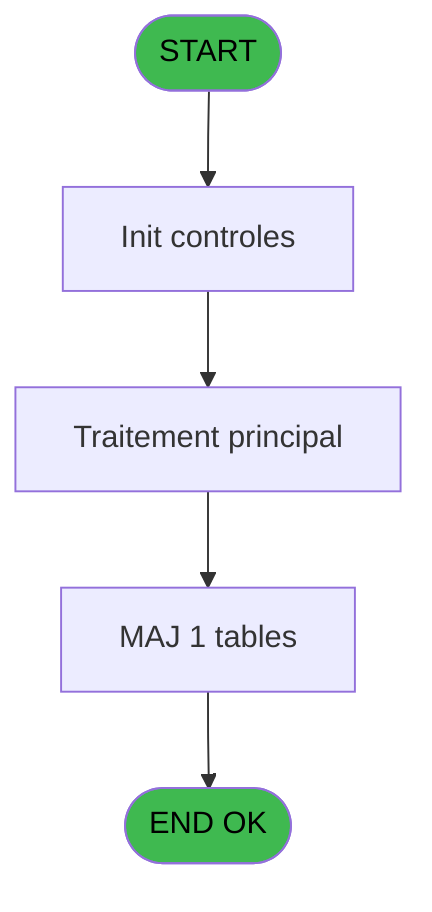
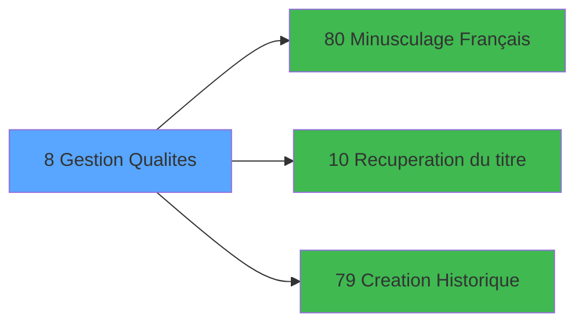

# PBS IDE 8 - Gestion Qualites

> **Analyse**: Phases 1-4 2026-02-03 17:01 -> 17:02 (21s) | Assemblage 17:02
> **Pipeline**: V7.2 Enrichi
> **Structure**: 4 onglets (Resume | Ecrans | Donnees | Connexions)

<!-- TAB:Resume -->

## 1. FICHE D'IDENTITE

| Attribut | Valeur |
|----------|--------|
| Projet | PBS |
| IDE Position | 8 |
| Nom Programme | Gestion Qualites |
| Fichier source | `Prg_8.xml` |
| Dossier IDE | Divers |
| Taches | 3 (1 ecrans visibles) |
| Tables modifiees | 1 |
| Programmes appeles | 3 |
| :warning: Statut | **ORPHELIN_POTENTIEL** |

## 2. DESCRIPTION FONCTIONNELLE

**Gestion Qualites** assure la gestion complete de ce processus.

Le flux de traitement s'organise en **3 blocs fonctionnels** :

- **Creation** (1 tache) : insertion d'enregistrements en base (mouvements, prestations)
- **Consultation** (1 tache) : ecrans de recherche, selection et consultation
- **Traitement** (1 tache) : traitements metier divers

**Donnees modifiees** : 1 tables en ecriture (tables_qualites__qua).

**Logique metier** : 3 regles identifiees couvrant conditions metier.

Detail : phases du traitement

#### Phase 1 : Traitement (1 tache)

- **8** - Êcran old **[[ECRAN]](#ecran-t1)**

Delegue a : [Minusculage Français (IDE 80)](PBS-IDE-80.md), [Recuperation du titre (IDE 10)](PBS-IDE-10.md)

#### Phase 2 : Consultation (1 tache)

- **8.1** - Recherche Code Tri

Delegue a : [Recuperation du titre (IDE 10)](PBS-IDE-10.md)

#### Phase 3 : Creation (1 tache)

- **8.2** - Limite à 15 Creations

Delegue a : [Creation Historique (IDE 79)](PBS-IDE-79.md)

#### Tables impactees

| Table | Operations | Role metier |
|-------|-----------|-------------|
| tables_qualites__qua | R/**W** (3 usages) |  |

## 3. BLOCS FONCTIONNELS

### 3.1 Traitement (1 tache)

Traitements internes.

---

#### 8 - Êcran old [[ECRAN]](#ecran-t1)

**Role** : Traitement : Êcran old.
**Ecran** : 890 x 182 DLU (MDI) | [Voir mockup](#ecran-t1)
**Delegue a** : [Minusculage Français (IDE 80)](PBS-IDE-80.md), [Recuperation du titre (IDE 10)](PBS-IDE-10.md)

### 3.2 Consultation (1 tache)

Ecrans de recherche et consultation.

---

#### 8.1 - Recherche Code Tri

**Role** : Traitement : Recherche Code Tri.

### 3.3 Creation (1 tache)

Insertion de nouveaux enregistrements en base.

---

#### 8.2 - Limite à 15 Creations

**Role** : Creation d'enregistrement : Limite à 15 Creations.
**Delegue a** : [Creation Historique (IDE 79)](PBS-IDE-79.md)

## 5. REGLES METIER

3 regles identifiees:

### Autres (3 regles)

#### [RM-001] Si Stat (0 alors 'C'MODE) sinon 'CQUC','MQUC')

| Element | Detail |
|---------|--------|
| **Condition** | `Stat (0` |
| **Si vrai** | 'C'MODE) |
| **Si faux** | 'CQUC','MQUC') |
| **Expression source** | Expression 2 : `IF (Stat (0,'C'MODE),'CQUC','MQUC')` |
| **Exemple** | Si Stat (0 → 'C'MODE). Sinon → 'CQUC','MQUC') |

#### [RM-002] Condition toujours vraie (flag actif)

| Element | Detail |
|---------|--------|
| **Condition** | `[L]='1'` |
| **Si vrai** | 'TRUE'LOG |
| **Si faux** | 'FALSE'LOG) |
| **Expression source** | Expression 22 : `IF ([L]='1','TRUE'LOG,'FALSE'LOG)` |
| **Exemple** | Si [L]='1' → 'TRUE'LOG. Sinon → 'FALSE'LOG) |

#### [RM-003] Si [M] alors '1' sinon '0')

| Element | Detail |
|---------|--------|
| **Condition** | `[M]` |
| **Si vrai** | '1' |
| **Si faux** | '0') |
| **Expression source** | Expression 23 : `IF ([M],'1','0')` |
| **Exemple** | Si [M] → '1'. Sinon → '0') |

## 6. CONTEXTE

- **Appele par**: (aucun)
- **Appelle**: 3 programmes | **Tables**: 1 (W:1 R:1 L:0) | **Taches**: 3 | **Expressions**: 34

<!-- TAB:Ecrans -->

## 8. ECRANS

### 8.1 Forms visibles (1 / 3)

| # | Position | Tache | Nom | Type | Largeur | Hauteur | Bloc |
|---|----------|-------|-----|------|---------|---------|------|
| 1 | 8 | 8 | Êcran old | MDI | 890 | 182 | Traitement |

### 8.2 Mockups Ecrans

---

#### 8 - Êcran old
**Tache** : [8](#t1) | **Type** : MDI | **Dimensions** : 890 x 182 DLU
**Bloc** : Traitement | **Titre IDE** : Êcran old

<!-- FORM-DATA:
{
    "width":  890,
    "vFactor":  8,
    "type":  "MDI",
    "hFactor":  8,
    "controls":  [
                     {
                         "x":  0,
                         "type":  "label",
                         "var":  "",
                         "y":  1,
                         "w":  886,
                         "fmt":  "",
                         "name":  "",
                         "h":  20,
                         "color":  "",
                         "text":  "",
                         "parent":  null
                     },
                     {
                         "x":  32,
                         "type":  "table",
                         "var":  "",
                         "name":  "",
                         "titleH":  12,
                         "color":  "110",
                         "w":  655,
                         "y":  27,
                         "fmt":  "",
                         "parent":  null,
                         "text":  "",
                         "rowH":  14,
                         "h":  122,
                         "cols":  [
                                      {
                                          "title":  "Qualité",
                                          "layer":  1,
                                          "w":  176
                                      },
                                      {
                                          "title":  "Libellé",
                                          "layer":  2,
                                          "w":  300
                                      },
                                      {
                                          "title":  "Liste Mécano",
                                          "layer":  3,
                                          "w":  141
                                      }
                                  ],
                         "rows":  3
                     },
                     {
                         "x":  708,
                         "type":  "label",
                         "var":  "",
                         "y":  34,
                         "w":  178,
                         "fmt":  "",
                         "name":  "",
                         "h":  98,
                         "color":  "",
                         "text":  "",
                         "parent":  null
                     },
                     {
                         "x":  133,
                         "type":  "label",
                         "var":  "",
                         "y":  43,
                         "w":  21,
                         "fmt":  "",
                         "name":  "",
                         "h":  8,
                         "color":  "110",
                         "text":  "-",
                         "parent":  4
                     },
                     {
                         "x":  0,
                         "type":  "label",
                         "var":  "",
                         "y":  154,
                         "w":  886,
                         "fmt":  "",
                         "name":  "",
                         "h":  24,
                         "color":  "",
                         "text":  "",
                         "parent":  null
                     },
                     {
                         "x":  85,
                         "type":  "edit",
                         "var":  "",
                         "y":  43,
                         "w":  42,
                         "fmt":  "",
                         "name":  "",
                         "h":  8,
                         "color":  "110",
                         "text":  "",
                         "parent":  4
                     },
                     {
                         "x":  149,
                         "type":  "edit",
                         "var":  "",
                         "y":  43,
                         "w":  53,
                         "fmt":  "",
                         "name":  "QUA Compl. Qualite",
                         "h":  8,
                         "color":  "110",
                         "text":  "",
                         "parent":  4
                     },
                     {
                         "x":  222,
                         "type":  "edit",
                         "var":  "",
                         "y":  43,
                         "w":  277,
                         "fmt":  "",
                         "name":  "QUA Libelle",
                         "h":  8,
                         "color":  "110",
                         "text":  "",
                         "parent":  4
                     },
                     {
                         "x":  571,
                         "type":  "checkbox",
                         "var":  "",
                         "y":  41,
                         "w":  29,
                         "fmt":  "",
                         "name":  "v.liste mecano",
                         "h":  12,
                         "color":  "110",
                         "text":  "",
                         "parent":  4
                     },
                     {
                         "x":  6,
                         "type":  "edit",
                         "var":  "",
                         "y":  7,
                         "w":  396,
                         "fmt":  "30",
                         "name":  "",
                         "h":  8,
                         "color":  "",
                         "text":  "",
                         "parent":  1
                     },
                     {
                         "x":  672,
                         "type":  "edit",
                         "var":  "",
                         "y":  7,
                         "w":  203,
                         "fmt":  "WWW DD MMM YYYYT",
                         "name":  "",
                         "h":  8,
                         "color":  "",
                         "text":  "",
                         "parent":  1
                     },
                     {
                         "x":  720,
                         "type":  "button",
                         "var":  "",
                         "y":  40,
                         "w":  154,
                         "fmt":  "\u0026Visualisation",
                         "name":  "",
                         "h":  18,
                         "color":  "",
                         "text":  "",
                         "parent":  8
                     },
                     {
                         "x":  720,
                         "type":  "button",
                         "var":  "",
                         "y":  63,
                         "w":  154,
                         "fmt":  "\u0026Modification",
                         "name":  "",
                         "h":  18,
                         "color":  "",
                         "text":  "",
                         "parent":  8
                     },
                     {
                         "x":  720,
                         "type":  "button",
                         "var":  "",
                         "y":  86,
                         "w":  154,
                         "fmt":  "\u0026Creation",
                         "name":  "Creation",
                         "h":  18,
                         "color":  "",
                         "text":  "",
                         "parent":  8
                     },
                     {
                         "x":  720,
                         "type":  "button",
                         "var":  "",
                         "y":  109,
                         "w":  154,
                         "fmt":  "\u0026Annulation",
                         "name":  "",
                         "h":  18,
                         "color":  "",
                         "text":  "",
                         "parent":  8
                     },
                     {
                         "x":  5,
                         "type":  "button",
                         "var":  "",
                         "y":  157,
                         "w":  154,
                         "fmt":  "\u0026Quitter",
                         "name":  "",
                         "h":  18,
                         "color":  "",
                         "text":  "",
                         "parent":  14
                     }
                 ],
    "taskId":  "8",
    "height":  182
}
-->

<strong>Champs : 6 champs</strong>

| Pos (x,y) | Nom | Variable | Type |
|-----------|-----|----------|------|
| 85,43 | (sans nom) | - | edit |
| 149,43 | QUA Compl. Qualite | - | edit |
| 222,43 | QUA Libelle | - | edit |
| 571,41 | v.liste mecano | - | checkbox |
| 6,7 | 30 | - | edit |
| 672,7 | WWW DD MMM YYYYT | - | edit |

<strong>Boutons : 5 boutons</strong>

| Bouton | Pos (x,y) | Action |
|--------|-----------|--------|
| Visualisation | 720,40 | Bouton fonctionnel |
| Modification | 720,63 | Modifie l'element |
| Creation | 720,86 | Appel [Creation Historique (IDE 79)](PBS-IDE-79.md) |
| Annulation | 720,109 | Annule et retour au menu |
| Quitter | 5,157 | Quitte le programme |

## 9. NAVIGATION

Ecran unique: **Êcran old**

### 9.3 Structure hierarchique (3 taches)

| Position | Tache | Type | Dimensions | Bloc |
|----------|-------|------|------------|------|
| **8.1** | [**Êcran old** (8)](#t1) [mockup](#ecran-t1) | MDI | 890x182 | Traitement |
| **8.2** | [**Recherche Code Tri** (8.1)](#t2) | MDI | - | Consultation |
| **8.3** | [**Limite à 15 Creations** (8.2)](#t3) | MDI | - | Creation |

### 9.4 Algorigramme

> **Legende**: Vert = START/END OK | Rouge = END KO | Bleu = Decisions
> *Algorigramme auto-genere. Utiliser `/algorigramme` pour une synthese metier detaillee.*

<!-- TAB:Donnees -->

## 10. TABLES

### Tables utilisees (1)

| ID | Nom | Description | Type | R | W | L | Usages |
|----|-----|-------------|------|---|---|---|--------|
| 120 | tables_qualites__qua |  | DB | R | **W** |   | 3 |

### Colonnes par table (1 / 1 tables avec colonnes identifiees)

Table 120 - tables_qualites__qua (R/**W**) - 3 usages

| Lettre | Variable | Acces | Type |
|--------|----------|-------|------|
| A | v. titre | W | Alpha |
| B | v.contrôle | W | Logical |
| C | v.valeur Tri | W | Alpha |
| D | v.compteur | W | Numeric |
| E | v.liste mecano | W | Logical |

## 11. VARIABLES

### 11.1 Variables de session (5)

Variables persistantes pendant toute la session.

| Lettre | Nom | Type | Usage dans |
|--------|-----|------|-----------|
| A | v. titre | Alpha | 1x session |
| B | v.contrôle | Logical | - |
| C | v.valeur Tri | Alpha | 2x session |
| D | v.compteur | Numeric | 1x session |
| E | v.liste mecano | Logical | - |

## 12. EXPRESSIONS

**34 / 34 expressions decodees (100%)**

### 12.1 Repartition par type

| Type | Expressions | Regles |
|------|-------------|--------|
| CONDITION | 10 | 2 |
| CAST_LOGIQUE | 1 | 5 |
| CONSTANTE | 5 | 0 |
| DATE | 1 | 0 |
| NEGATION | 6 | 0 |
| OTHER | 5 | 0 |
| REFERENCE_VG | 3 | 0 |
| FORMAT | 1 | 0 |
| STRING | 2 | 0 |

### 12.2 Expressions cles par type

#### CONDITION (10 expressions)

| Type | IDE | Expression | Regle |
|------|-----|------------|-------|
| CONDITION | 23 | `IF ([M],'1','0')` | [RM-003](#rm-RM-003) |
| CONDITION | 2 | `IF (Stat (0,'C'MODE),'CQUC','MQUC')` | [RM-001](#rm-RM-001) |
| CONDITION | 21 | `[N]<>'N'` | - |
| CONDITION | 18 | `[AH]=''` | - |
| CONDITION | 34 | `GetParam ('CODELANGUE') <> 'FRA'` | - |
| ... | | *+5 autres* | |

#### CAST_LOGIQUE (1 expressions)

| Type | IDE | Expression | Regle |
|------|-----|------------|-------|
| CAST_LOGIQUE | 22 | `IF ([L]='1','TRUE'LOG,'FALSE'LOG)` | [RM-002](#rm-RM-002) |

#### CONSTANTE (5 expressions)

| Type | IDE | Expression | Regle |
|------|-----|------------|-------|
| CONSTANTE | 19 | `'1'` | - |
| CONSTANTE | 20 | `'O'` | - |
| CONSTANTE | 13 | `21` | - |
| CONSTANTE | 7 | `'C'` | - |
| CONSTANTE | 9 | `'GM'` | - |

#### DATE (1 expressions)

| Type | IDE | Expression | Regle |
|------|-----|------------|-------|
| DATE | 11 | `Date ()` | - |

#### NEGATION (6 expressions)

| Type | IDE | Expression | Regle |
|------|-----|------------|-------|
| NEGATION | 27 | `NOT VG10` | - |
| NEGATION | 28 | `NOT Stat(0,'E'MODE) AND NOT VG10` | - |
| NEGATION | 30 | `NOT Stat(0,'E'MODE)` | - |
| NEGATION | 1 | `NOT (Stat (0,'E'MODE))` | - |
| NEGATION | 3 | `NOT (v.valeur Tri [C])` | - |
| ... | | *+1 autres* | |

#### OTHER (5 expressions)

| Type | IDE | Expression | Regle |
|------|-----|------------|-------|
| OTHER | 24 | `ExpCalc('4'EXP)` | - |
| OTHER | 29 | `Stat(0,'E'MODE)` | - |
| OTHER | 8 | `v.compteur [D]` | - |
| OTHER | 4 | `Stat (0,'C'MODE)` | - |
| OTHER | 6 | `GetParam ('SOCIETE')` | - |

#### REFERENCE_VG (3 expressions)

| Type | IDE | Expression | Regle |
|------|-----|------------|-------|
| REFERENCE_VG | 32 | `VG8` | - |
| REFERENCE_VG | 31 | `VG12` | - |
| REFERENCE_VG | 25 | `VG6` | - |

#### FORMAT (1 expressions)

| Type | IDE | Expression | Regle |
|------|-----|------------|-------|
| FORMAT | 26 | `'v.valeur Tri [C]'FORM` | - |

#### STRING (2 expressions)

| Type | IDE | Expression | Regle |
|------|-----|------------|-------|
| STRING | 12 | `Trim(VG3)` | - |
| STRING | 10 | `Trim (v. titre [A])` | - |

### 12.3 Toutes les expressions (34)

Voir les 34 expressions

#### CONDITION (10)

| IDE | Expression Decodee |
|-----|-------------------|
| 2 | `IF (Stat (0,'C'MODE),'CQUC','MQUC')` |
| 23 | `IF ([M],'1','0')` |
| 5 | `[J]=''` |
| 15 | `[K]<>''` |
| 16 | `[AH]<>''` |
| 17 | `[K]=''` |
| 18 | `[AH]=''` |
| 21 | `[N]<>'N'` |
| 33 | `GetParam ('CODELANGUE') = 'FRA'` |
| 34 | `GetParam ('CODELANGUE') <> 'FRA'` |

#### CAST_LOGIQUE (1)

| IDE | Expression Decodee |
|-----|-------------------|
| 22 | `IF ([L]='1','TRUE'LOG,'FALSE'LOG)` |

#### CONSTANTE (5)

| IDE | Expression Decodee |
|-----|-------------------|
| 7 | `'C'` |
| 9 | `'GM'` |
| 13 | `21` |
| 19 | `'1'` |
| 20 | `'O'` |

#### DATE (1)

| IDE | Expression Decodee |
|-----|-------------------|
| 11 | `Date ()` |

#### NEGATION (6)

| IDE | Expression Decodee |
|-----|-------------------|
| 1 | `NOT (Stat (0,'E'MODE))` |
| 3 | `NOT (v.valeur Tri [C])` |
| 14 | `NOT (Stat (0,'E'MODE))` |
| 27 | `NOT VG10` |
| 28 | `NOT Stat(0,'E'MODE) AND NOT VG10` |
| 30 | `NOT Stat(0,'E'MODE)` |

#### OTHER (5)

| IDE | Expression Decodee |
|-----|-------------------|
| 4 | `Stat (0,'C'MODE)` |
| 6 | `GetParam ('SOCIETE')` |
| 8 | `v.compteur [D]` |
| 24 | `ExpCalc('4'EXP)` |
| 29 | `Stat(0,'E'MODE)` |

#### REFERENCE_VG (3)

| IDE | Expression Decodee |
|-----|-------------------|
| 25 | `VG6` |
| 31 | `VG12` |
| 32 | `VG8` |

#### FORMAT (1)

| IDE | Expression Decodee |
|-----|-------------------|
| 26 | `'v.valeur Tri [C]'FORM` |

#### STRING (2)

| IDE | Expression Decodee |
|-----|-------------------|
| 10 | `Trim (v. titre [A])` |
| 12 | `Trim(VG3)` |

<!-- TAB:Connexions -->

## 13. GRAPHE D'APPELS

### 13.1 Chaine depuis Main (Callers)

**Chemin**: (pas de callers directs)

### 13.2 Callers

| IDE | Nom Programme | Nb Appels |
|-----|---------------|-----------|
| - | (aucun) | - |

### 13.3 Callees (programmes appeles)

### 13.4 Detail Callees avec contexte

| IDE | Nom Programme | Appels | Contexte |
|-----|---------------|--------|----------|
| [80](PBS-IDE-80.md) | Minusculage Français | 2 | Sous-programme |
| [10](PBS-IDE-10.md) | Recuperation du titre | 1 | Recuperation donnees |
| [79](PBS-IDE-79.md) | Creation Historique | 1 | Historique/consultation |

## 14. RECOMMANDATIONS MIGRATION

### 14.1 Profil du programme

| Metrique | Valeur | Impact migration |
|----------|--------|-----------------|
| Lignes de logique | 75 | Programme compact |
| Expressions | 34 | Peu de logique |
| Tables WRITE | 1 | Impact faible |
| Sous-programmes | 3 | Peu de dependances |
| Ecrans visibles | 1 | Ecran unique ou traitement batch |
| Code desactive | 0% (0 / 75) | Code sain |
| Regles metier | 3 | Quelques regles a preserver |

### 14.2 Plan de migration par bloc

#### Traitement (1 tache: 1 ecran, 0 traitement)

- **Strategie** : 1 composant(s) UI (Razor/React) avec formulaires et validation.
- 3 sous-programme(s) a migrer ou a reutiliser depuis les services existants.
- Decomposer les taches en services unitaires testables.

#### Consultation (1 tache: 0 ecran, 1 traitement)

- **Strategie** : Composants de recherche/selection en modales.

#### Creation (1 tache: 0 ecran, 1 traitement)

- **Strategie** : Repository pattern avec Entity Framework Core.
- Insertion via `IRepository<T>.CreateAsync()`

### 14.3 Dependances critiques

| Dependance | Type | Appels | Impact |
|------------|------|--------|--------|
| tables_qualites__qua | Table WRITE (Database) | 1x | Schema + repository |
| [Minusculage Français (IDE 80)](PBS-IDE-80.md) | Sous-programme | 2x | Haute - Sous-programme |
| [Creation Historique (IDE 79)](PBS-IDE-79.md) | Sous-programme | 1x | Normale - Historique/consultation |
| [Recuperation du titre (IDE 10)](PBS-IDE-10.md) | Sous-programme | 1x | Normale - Recuperation donnees |

---
*Spec DETAILED generee par Pipeline V7.2 - 2026-02-03 17:02*
