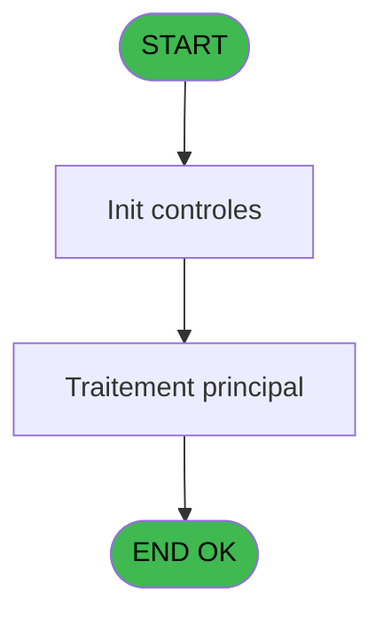
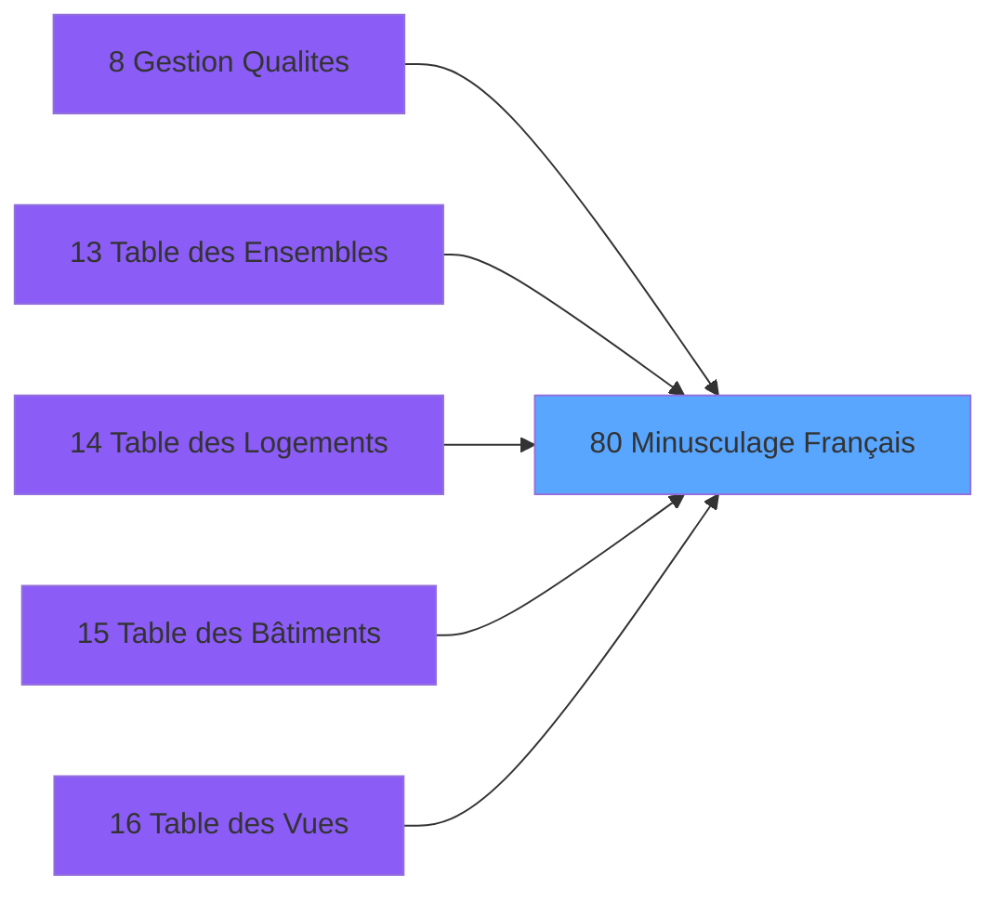

# PBS IDE 80 - Minusculage Français

> **Analyse**: Phases 1-4 2026-02-03 17:28 -> 17:28 (14s) | Assemblage 17:28
> **Pipeline**: V7.2 Enrichi
> **Structure**: 4 onglets (Resume | Ecrans | Donnees | Connexions)

<!-- TAB:Resume -->

## 1. FICHE D'IDENTITE

| Attribut | Valeur |
|----------|--------|
| Projet | PBS |
| IDE Position | 80 |
| Nom Programme | Minusculage Français |
| Fichier source | `Prg_80.xml` |
| Dossier IDE | Utilitaires |
| Taches | 4 (0 ecrans visibles) |
| Tables modifiees | 0 |
| Programmes appeles | 0 |

## 2. DESCRIPTION FONCTIONNELLE

**Minusculage Français** assure la gestion complete de ce processus, accessible depuis [Gestion Zones/Secteurs (IDE 71)](PBS-IDE-71.md), [Gestion Qualites (IDE 8)](PBS-IDE-8.md), [Gestion Qualites (IDE 45)](PBS-IDE-45.md), [Table des Ensembles (IDE 13)](PBS-IDE-13.md), [Table des Logements (IDE 14)](PBS-IDE-14.md), [Table des Bâtiments (IDE 15)](PBS-IDE-15.md), [Table des Vues (IDE 16)](PBS-IDE-16.md), [Table des Equipements (IDE 17)](PBS-IDE-17.md), [Gestion des Imports ########## (IDE 61)](PBS-IDE-61.md), [Gestion Code Prestation (IDE 64)](PBS-IDE-64.md), [Gestion Code Prestat° PMS-623 (IDE 65)](PBS-IDE-65.md), [Table des Ensembles (IDE 95)](PBS-IDE-95.md), [Table des Logements (IDE 96)](PBS-IDE-96.md), [Table des Bâtiments (IDE 97)](PBS-IDE-97.md), [Table des Catégorie (IDE 98)](PBS-IDE-98.md).

Le flux de traitement s'organise en **2 blocs fonctionnels** :

- **Traitement** (3 taches) : traitements metier divers
- **Validation** (1 tache) : controles et verifications de coherence

Detail : phases du traitement

#### Phase 1 : Traitement (3 taches)

- **80** - Minusculage Français
- **80.2** - Trimmage Interieur
- **80.3** - Minusculage Interieur

#### Phase 2 : Validation (1 tache)

- **80.1** - Verification Caractères

## 3. BLOCS FONCTIONNELS

### 3.1 Traitement (3 taches)

Traitements internes.

---

#### 80 - Minusculage Français

**Role** : Traitement : Minusculage Français.

---

#### 80.2 - Trimmage Interieur

**Role** : Traitement : Trimmage Interieur.

---

#### 80.3 - Minusculage Interieur

**Role** : Traitement : Minusculage Interieur.

### 3.2 Validation (1 tache)

Controles de coherence : 1 tache verifie les donnees et conditions.

---

#### 80.1 - Verification Caractères

**Role** : Verification : Verification Caractères.

## 5. REGLES METIER

*(Aucune regle metier identifiee)*

## 6. CONTEXTE

- **Appele par**: [Gestion Zones/Secteurs (IDE 71)](PBS-IDE-71.md), [Gestion Qualites (IDE 8)](PBS-IDE-8.md), [Gestion Qualites (IDE 45)](PBS-IDE-45.md), [Table des Ensembles (IDE 13)](PBS-IDE-13.md), [Table des Logements (IDE 14)](PBS-IDE-14.md), [Table des Bâtiments (IDE 15)](PBS-IDE-15.md), [Table des Vues (IDE 16)](PBS-IDE-16.md), [Table des Equipements (IDE 17)](PBS-IDE-17.md), [Gestion des Imports ########## (IDE 61)](PBS-IDE-61.md), [Gestion Code Prestation (IDE 64)](PBS-IDE-64.md), [Gestion Code Prestat° PMS-623 (IDE 65)](PBS-IDE-65.md), [Table des Ensembles (IDE 95)](PBS-IDE-95.md), [Table des Logements (IDE 96)](PBS-IDE-96.md), [Table des Bâtiments (IDE 97)](PBS-IDE-97.md), [Table des Catégorie (IDE 98)](PBS-IDE-98.md)
- **Appelle**: 0 programmes | **Tables**: 0 (W:0 R:0 L:0) | **Taches**: 4 | **Expressions**: 6

<!-- TAB:Ecrans -->

## 8. ECRANS

*(Programme sans ecran visible)*

## 9. NAVIGATION

### 9.3 Structure hierarchique (4 taches)

| Position | Tache | Type | Dimensions | Bloc |
|----------|-------|------|------------|------|
| **80.1** | [**Minusculage Français** (80)](#t1) | MDI | - | Traitement |
| 80.1.1 | [Trimmage Interieur (80.2)](#t3) | MDI | - | |
| 80.1.2 | [Minusculage Interieur (80.3)](#t4) | MDI | - | |
| **80.2** | [**Verification Caractères** (80.1)](#t2) | MDI | - | Validation |

### 9.4 Algorigramme

> **Legende**: Vert = START/END OK | Rouge = END KO | Bleu = Decisions
> *Algorigramme auto-genere. Utiliser `/algorigramme` pour une synthese metier detaillee.*

<!-- TAB:Donnees -->

## 10. TABLES

### Tables utilisees (0)

| ID | Nom | Description | Type | R | W | L | Usages |
|----|-----|-------------|------|---|---|---|--------|

### Colonnes par table (0 / 0 tables avec colonnes identifiees)

## 11. VARIABLES

### 11.1 Variables de session (2)

Variables persistantes pendant toute la session.

| Lettre | Nom | Type | Usage dans |
|--------|-----|------|-----------|
| C | v.Accord Suite | Logical | 1x session |
| D | v.Chaine Deux | Alpha | - |

### 11.2 Autres (2)

Variables diverses.

| Lettre | Nom | Type | Usage dans |
|--------|-----|------|-----------|
| A | > Chaine | Alpha | 2x refs |
| B | > Accord Suite | Logical | - |

## 12. EXPRESSIONS

**6 / 6 expressions decodees (100%)**

### 12.1 Repartition par type

| Type | Expressions | Regles |
|------|-------------|--------|
| CAST_LOGIQUE | 3 | 0 |
| OTHER | 1 | 0 |
| CONDITION | 2 | 0 |

### 12.2 Expressions cles par type

#### CAST_LOGIQUE (3 expressions)

| Type | IDE | Expression | Regle |
|------|-----|------------|-------|
| CAST_LOGIQUE | 6 | `'TRUE'LOG` | - |
| CAST_LOGIQUE | 4 | `'TRUE'LOG` | - |
| CAST_LOGIQUE | 1 | `'FALSE'LOG` | - |

#### OTHER (1 expressions)

| Type | IDE | Expression | Regle |
|------|-----|------------|-------|
| OTHER | 3 | `v.Accord Suite [C]` | - |

#### CONDITION (2 expressions)

| Type | IDE | Expression | Regle |
|------|-----|------------|-------|
| CONDITION | 2 | `LTrim (RTrim (> Chaine [A]))` | - |
| CONDITION | 5 | `> Chaine [A]>Len ({1,1})` | - |

<!-- TAB:Connexions -->

## 13. GRAPHE D'APPELS

### 13.1 Chaine depuis Main (Callers)

Main -> ... -> [Gestion Zones/Secteurs (IDE 71)](PBS-IDE-71.md) -> **Minusculage Français (IDE 80)**

Main -> ... -> [Gestion Qualites (IDE 8)](PBS-IDE-8.md) -> **Minusculage Français (IDE 80)**

Main -> ... -> [Gestion Qualites (IDE 45)](PBS-IDE-45.md) -> **Minusculage Français (IDE 80)**

Main -> ... -> [Table des Ensembles (IDE 13)](PBS-IDE-13.md) -> **Minusculage Français (IDE 80)**

Main -> ... -> [Table des Logements (IDE 14)](PBS-IDE-14.md) -> **Minusculage Français (IDE 80)**

Main -> ... -> [Table des Bâtiments (IDE 15)](PBS-IDE-15.md) -> **Minusculage Français (IDE 80)**

Main -> ... -> [Table des Vues (IDE 16)](PBS-IDE-16.md) -> **Minusculage Français (IDE 80)**

Main -> ... -> [Table des Equipements (IDE 17)](PBS-IDE-17.md) -> **Minusculage Français (IDE 80)**

Main -> ... -> [Gestion des Imports ########## (IDE 61)](PBS-IDE-61.md) -> **Minusculage Français (IDE 80)**

Main -> ... -> [Gestion Code Prestation (IDE 64)](PBS-IDE-64.md) -> **Minusculage Français (IDE 80)**

Main -> ... -> [Gestion Code Prestat° PMS-623 (IDE 65)](PBS-IDE-65.md) -> **Minusculage Français (IDE 80)**

Main -> ... -> [Table des Ensembles (IDE 95)](PBS-IDE-95.md) -> **Minusculage Français (IDE 80)**

Main -> ... -> [Table des Logements (IDE 96)](PBS-IDE-96.md) -> **Minusculage Français (IDE 80)**

Main -> ... -> [Table des Bâtiments (IDE 97)](PBS-IDE-97.md) -> **Minusculage Français (IDE 80)**

Main -> ... -> [Table des Catégorie (IDE 98)](PBS-IDE-98.md) -> **Minusculage Français (IDE 80)**

### 13.2 Callers

| IDE | Nom Programme | Nb Appels |
|-----|---------------|-----------|
| [71](PBS-IDE-71.md) | Gestion Zones/Secteurs | 3 |
| [8](PBS-IDE-8.md) | Gestion Qualites | 2 |
| [45](PBS-IDE-45.md) | Gestion Qualites | 2 |
| [13](PBS-IDE-13.md) | Table des Ensembles | 1 |
| [14](PBS-IDE-14.md) | Table des Logements | 1 |
| [15](PBS-IDE-15.md) | Table des Bâtiments | 1 |
| [16](PBS-IDE-16.md) | Table des Vues | 1 |
| [17](PBS-IDE-17.md) | Table des Equipements | 1 |
| [61](PBS-IDE-61.md) | Gestion des Imports ########## | 1 |
| [64](PBS-IDE-64.md) | Gestion Code Prestation | 1 |
| [65](PBS-IDE-65.md) | Gestion Code Prestat° PMS-623 | 1 |
| [95](PBS-IDE-95.md) | Table des Ensembles | 1 |
| [96](PBS-IDE-96.md) | Table des Logements | 1 |
| [97](PBS-IDE-97.md) | Table des Bâtiments | 1 |
| [98](PBS-IDE-98.md) | Table des Catégorie | 1 |

### 13.3 Callees (programmes appeles)

### 13.4 Detail Callees avec contexte

| IDE | Nom Programme | Appels | Contexte |
|-----|---------------|--------|----------|
| - | (aucun) | - | - |

## 14. RECOMMANDATIONS MIGRATION

### 14.1 Profil du programme

| Metrique | Valeur | Impact migration |
|----------|--------|-----------------|
| Lignes de logique | 96 | Programme compact |
| Expressions | 6 | Peu de logique |
| Tables WRITE | 0 | Impact faible |
| Sous-programmes | 0 | Peu de dependances |
| Ecrans visibles | 0 | Ecran unique ou traitement batch |
| Code desactive | 0% (0 / 96) | Code sain |
| Regles metier | 0 | Pas de regle identifiee |

### 14.2 Plan de migration par bloc

#### Traitement (3 taches: 0 ecran, 3 traitements)

- **Strategie** : 3 service(s) backend injectable(s) (Domain Services).
- Decomposer les taches en services unitaires testables.

#### Validation (1 tache: 0 ecran, 1 traitement)

- **Strategie** : FluentValidation avec validators specifiques.
- Chaque tache de validation -> un validator injectable

### 14.3 Dependances critiques

| Dependance | Type | Appels | Impact |
|------------|------|--------|--------|

---
*Spec DETAILED generee par Pipeline V7.2 - 2026-02-03 17:28*
