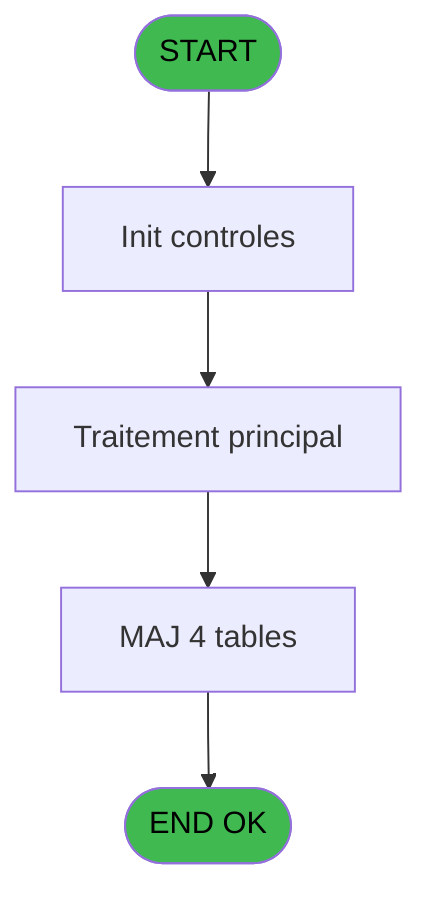
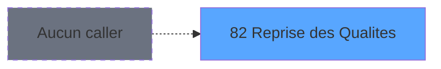
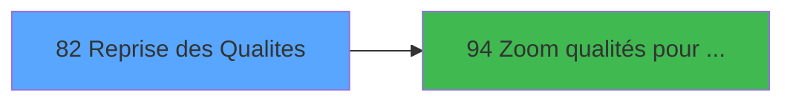

# PBS IDE 82 - Reprise des Qualites

> **Analyse**: Phases 1-4 2026-02-03 17:28 -> 17:29 (13s) | Assemblage 17:29
> **Pipeline**: V7.2 Enrichi
> **Structure**: 4 onglets (Resume | Ecrans | Donnees | Connexions)

<!-- TAB:Resume -->

## 1. FICHE D'IDENTITE

| Attribut | Valeur |
|----------|--------|
| Projet | PBS |
| IDE Position | 82 |
| Nom Programme | Reprise des Qualites |
| Fichier source | `Prg_82.xml` |
| Dossier IDE | Utilitaires |
| Taches | 5 (1 ecrans visibles) |
| Tables modifiees | 4 |
| Programmes appeles | 1 |
| :warning: Statut | **ORPHELIN_POTENTIEL** |

## 2. DESCRIPTION FONCTIONNELLE

**Reprise des Qualites** assure la gestion complete de ce processus.

Le flux de traitement s'organise en **1 blocs fonctionnels** :

- **Traitement** (5 taches) : traitements metier divers

**Donnees modifiees** : 4 tables en ecriture (voyages__________voy, hebergement______heb, compte_gm________cgm, wording_mention_legal).

Detail : phases du traitement

#### Phase 1 : Traitement (5 taches)

- **82** - Êcran **[[ECRAN]](#ecran-t1)**
- **82.1** - Reprise heb
- **82.1.1** - hebergement
- **82.1.2** - hebergement
- **82.1.3** - hebergement

#### Tables impactees

| Table | Operations | Role metier |
|-------|-----------|-------------|
| wording_mention_legal | **W** (2 usages) |  |
| voyages__________voy | **W** (1 usages) |  |
| hebergement______heb | **W** (1 usages) | Hebergement (chambres) |
| compte_gm________cgm | **W** (1 usages) | Comptes GM (generaux) |

## 3. BLOCS FONCTIONNELS

### 3.1 Traitement (5 taches)

Traitements internes.

---

#### 82 - Êcran [[ECRAN]](#ecran-t1)

**Role** : Traitement : Êcran.
**Ecran** : 733 x 310 DLU (MDI) | [Voir mockup](#ecran-t1)

4 sous-taches directes

| Tache | Nom | Bloc |
|-------|-----|------|
| [82.1](#t4) | Reprise heb | Traitement |
| [82.1.1](#t5) | hebergement | Traitement |
| [82.1.2](#t8) | hebergement | Traitement |
| [82.1.3](#t11) | hebergement | Traitement |

---

#### 82.1 - Reprise heb

**Role** : Traitement : Reprise heb.

---

#### 82.1.1 - hebergement

**Role** : Traitement : hebergement.

---

#### 82.1.2 - hebergement

**Role** : Traitement : hebergement.

---

#### 82.1.3 - hebergement

**Role** : Traitement : hebergement.

## 5. REGLES METIER

*(Aucune regle metier identifiee)*

## 6. CONTEXTE

- **Appele par**: (aucun)
- **Appelle**: 1 programmes | **Tables**: 4 (W:4 R:0 L:0) | **Taches**: 5 | **Expressions**: 12

<!-- TAB:Ecrans -->

## 8. ECRANS

### 8.1 Forms visibles (1 / 5)

| # | Position | Tache | Nom | Type | Largeur | Hauteur | Bloc |
|---|----------|-------|-----|------|---------|---------|------|
| 1 | 82 | 82 | Êcran | MDI | 733 | 310 | Traitement |

### 8.2 Mockups Ecrans

---

#### 82 - Êcran
**Tache** : [82](#t1) | **Type** : MDI | **Dimensions** : 733 x 310 DLU
**Bloc** : Traitement | **Titre IDE** : Êcran

<!-- FORM-DATA:
{
    "width":  733,
    "vFactor":  8,
    "type":  "MDI",
    "hFactor":  8,
    "controls":  [
                     {
                         "x":  0,
                         "type":  "label",
                         "var":  "",
                         "y":  1,
                         "w":  723,
                         "fmt":  "",
                         "name":  "",
                         "h":  20,
                         "color":  "",
                         "text":  "",
                         "parent":  null
                     },
                     {
                         "x":  14,
                         "type":  "table",
                         "var":  "",
                         "name":  "",
                         "titleH":  12,
                         "color":  "110",
                         "w":  707,
                         "y":  25,
                         "fmt":  "",
                         "parent":  null,
                         "text":  "",
                         "rowH":  17,
                         "h":  254,
                         "cols":  [
                                      {
                                          "title":  "Ancienne qualité",
                                          "layer":  1,
                                          "w":  176
                                      },
                                      {
                                          "title":  "Libellé",
                                          "layer":  2,
                                          "w":  300
                                      },
                                      {
                                          "title":  "Nouvelle qualité",
                                          "layer":  3,
                                          "w":  196
                                      }
                                  ],
                         "rows":  3
                     },
                     {
                         "x":  85,
                         "type":  "label",
                         "var":  "",
                         "y":  41,
                         "w":  21,
                         "fmt":  "",
                         "name":  "",
                         "h":  10,
                         "color":  "110",
                         "text":  "-",
                         "parent":  4
                     },
                     {
                         "x":  0,
                         "type":  "label",
                         "var":  "",
                         "y":  284,
                         "w":  724,
                         "fmt":  "",
                         "name":  "",
                         "h":  24,
                         "color":  "",
                         "text":  "",
                         "parent":  null
                     },
                     {
                         "x":  560,
                         "type":  "label",
                         "var":  "",
                         "y":  41,
                         "w":  21,
                         "fmt":  "",
                         "name":  "",
                         "h":  10,
                         "color":  "110",
                         "text":  "-",
                         "parent":  4
                     },
                     {
                         "x":  34,
                         "type":  "edit",
                         "var":  "",
                         "y":  41,
                         "w":  42,
                         "fmt":  "",
                         "name":  "qur_code_qualite",
                         "h":  10,
                         "color":  "110",
                         "text":  "",
                         "parent":  4
                     },
                     {
                         "x":  118,
                         "type":  "edit",
                         "var":  "",
                         "y":  41,
                         "w":  53,
                         "fmt":  "",
                         "name":  "QUA Compl. Qualite",
                         "h":  10,
                         "color":  "110",
                         "text":  "",
                         "parent":  4
                     },
                     {
                         "x":  205,
                         "type":  "edit",
                         "var":  "",
                         "y":  41,
                         "w":  277,
                         "fmt":  "",
                         "name":  "QUA Libelle",
                         "h":  10,
                         "color":  "110",
                         "text":  "",
                         "parent":  4
                     },
                     {
                         "x":  6,
                         "type":  "edit",
                         "var":  "",
                         "y":  7,
                         "w":  396,
                         "fmt":  "30",
                         "name":  "",
                         "h":  8,
                         "color":  "",
                         "text":  "",
                         "parent":  1
                     },
                     {
                         "x":  496,
                         "type":  "edit",
                         "var":  "",
                         "y":  7,
                         "w":  203,
                         "fmt":  "WWW DD MMM YYYYT",
                         "name":  "",
                         "h":  8,
                         "color":  "",
                         "text":  "",
                         "parent":  1
                     },
                     {
                         "x":  5,
                         "type":  "button",
                         "var":  "",
                         "y":  287,
                         "w":  154,
                         "fmt":  "\u0026Quitter",
                         "name":  "",
                         "h":  18,
                         "color":  "",
                         "text":  "",
                         "parent":  14
                     },
                     {
                         "x":  553,
                         "type":  "button",
                         "var":  "",
                         "y":  288,
                         "w":  154,
                         "fmt":  "\u0026Valider",
                         "name":  "",
                         "h":  18,
                         "color":  "",
                         "text":  "",
                         "parent":  14
                     },
                     {
                         "x":  499,
                         "type":  "edit",
                         "var":  "",
                         "y":  41,
                         "w":  54,
                         "fmt":  "",
                         "name":  "qur_new_qualite",
                         "h":  10,
                         "color":  "110",
                         "text":  "",
                         "parent":  4
                     },
                     {
                         "x":  640,
                         "type":  "button",
                         "var":  "",
                         "y":  40,
                         "w":  43,
                         "fmt":  "...",
                         "name":  "Bt.Zoom nouvelle qualite",
                         "h":  12,
                         "color":  "",
                         "text":  "",
                         "parent":  4
                     },
                     {
                         "x":  586,
                         "type":  "edit",
                         "var":  "",
                         "y":  41,
                         "w":  53,
                         "fmt":  "",
                         "name":  "qur_new_compl_qualite_0001",
                         "h":  10,
                         "color":  "110",
                         "text":  "",
                         "parent":  4
                     }
                 ],
    "taskId":  "82",
    "height":  310
}
-->

<strong>Champs : 7 champs</strong>

| Pos (x,y) | Nom | Variable | Type |
|-----------|-----|----------|------|
| 34,41 | qur_code_qualite | - | edit |
| 118,41 | QUA Compl. Qualite | - | edit |
| 205,41 | QUA Libelle | - | edit |
| 6,7 | 30 | - | edit |
| 496,7 | WWW DD MMM YYYYT | - | edit |
| 499,41 | qur_new_qualite | - | edit |
| 586,41 | qur_new_compl_qualite_0001 | - | edit |

<strong>Boutons : 3 boutons</strong>

| Bouton | Pos (x,y) | Action |
|--------|-----------|--------|
| Quitter | 5,287 | Quitte le programme |
| Valider | 553,288 | Valide la saisie et enregistre |
| ... | 640,40 | Bouton fonctionnel |

## 9. NAVIGATION

Ecran unique: **Êcran**

### 9.3 Structure hierarchique (5 taches)

| Position | Tache | Type | Dimensions | Bloc |
|----------|-------|------|------------|------|
| **82.1** | [**Êcran** (82)](#t1) [mockup](#ecran-t1) | MDI | 733x310 | Traitement |
| 82.1.1 | [Reprise heb (82.1)](#t4) | - | - | |
| 82.1.2 | [hebergement (82.1.1)](#t5) | - | - | |
| 82.1.3 | [hebergement (82.1.2)](#t8) | - | - | |
| 82.1.4 | [hebergement (82.1.3)](#t11) | - | - | |

### 9.4 Algorigramme

> **Legende**: Vert = START/END OK | Rouge = END KO | Bleu = Decisions
> *Algorigramme auto-genere. Utiliser `/algorigramme` pour une synthese metier detaillee.*

<!-- TAB:Donnees -->

## 10. TABLES

### Tables utilisees (4)

| ID | Nom | Description | Type | R | W | L | Usages |
|----|-----|-------------|------|---|---|---|--------|
| 29 | voyages__________voy |  | DB |   | **W** |   | 1 |
| 34 | hebergement______heb | Hebergement (chambres) | DB |   | **W** |   | 1 |
| 47 | compte_gm________cgm | Comptes GM (generaux) | DB |   | **W** |   | 1 |
| 826 | wording_mention_legal |  | DB |   | **W** |   | 2 |

### Colonnes par table (0 / 4 tables avec colonnes identifiees)

Table 29 - voyages__________voy (**W**) - 1 usages

*Table utilisee uniquement en Link ou aucune colonne Real identifiee dans le DataView.*

Table 34 - hebergement______heb (**W**) - 1 usages

*Table utilisee uniquement en Link ou aucune colonne Real identifiee dans le DataView.*

Table 47 - compte_gm________cgm (**W**) - 1 usages

*Table utilisee uniquement en Link ou aucune colonne Real identifiee dans le DataView.*

Table 826 - wording_mention_legal (**W**) - 2 usages

*Table utilisee uniquement en Link ou aucune colonne Real identifiee dans le DataView.*

## 11. VARIABLES

*(Programme sans variables locales mappees)*

## 12. EXPRESSIONS

**12 / 12 expressions decodees (100%)**

### 12.1 Repartition par type

| Type | Expressions | Regles |
|------|-------------|--------|
| DATE | 1 | 0 |
| OTHER | 5 | 0 |
| NEGATION | 1 | 0 |
| CAST_LOGIQUE | 3 | 0 |
| CONDITION | 1 | 0 |
| STRING | 1 | 0 |

### 12.2 Expressions cles par type

#### DATE (1 expressions)

| Type | IDE | Expression | Regle |
|------|-----|------------|-------|
| DATE | 3 | `Date ()` | - |

#### OTHER (5 expressions)

| Type | IDE | Expression | Regle |
|------|-----|------------|-------|
| OTHER | 8 | `SetCrsr(1)` | - |
| OTHER | 9 | `GetParam('SOCIETE')` | - |
| OTHER | 7 | `SetCrsr(2)` | - |
| OTHER | 1 | `GetParam ('SOCIETE')` | - |
| OTHER | 2 | `MlsTrans('Reprise des qualités')` | - |

#### NEGATION (1 expressions)

| Type | IDE | Expression | Regle |
|------|-----|------------|-------|
| NEGATION | 5 | `NOT VG10` | - |

#### CAST_LOGIQUE (3 expressions)

| Type | IDE | Expression | Regle |
|------|-----|------------|-------|
| CAST_LOGIQUE | 11 | `'TRUE'LOG` | - |
| CAST_LOGIQUE | 10 | `'FALSE'LOG` | - |
| CAST_LOGIQUE | 6 | `'FALSE'LOG` | - |

#### CONDITION (1 expressions)

| Type | IDE | Expression | Regle |
|------|-----|------------|-------|
| CONDITION | 12 | `[D]<>'' AND [E]<>''` | - |

#### STRING (1 expressions)

| Type | IDE | Expression | Regle |
|------|-----|------------|-------|
| STRING | 4 | `Trim(VG3)` | - |

<!-- TAB:Connexions -->

## 13. GRAPHE D'APPELS

### 13.1 Chaine depuis Main (Callers)

**Chemin**: (pas de callers directs)

### 13.2 Callers

| IDE | Nom Programme | Nb Appels |
|-----|---------------|-----------|
| - | (aucun) | - |

### 13.3 Callees (programmes appeles)

### 13.4 Detail Callees avec contexte

| IDE | Nom Programme | Appels | Contexte |
|-----|---------------|--------|----------|
| [94](PBS-IDE-94.md) | Zoom qualités pour reprise | 1 | Selection/consultation |

## 14. RECOMMANDATIONS MIGRATION

### 14.1 Profil du programme

| Metrique | Valeur | Impact migration |
|----------|--------|-----------------|
| Lignes de logique | 44 | Programme compact |
| Expressions | 12 | Peu de logique |
| Tables WRITE | 4 | Impact modere |
| Sous-programmes | 1 | Peu de dependances |
| Ecrans visibles | 1 | Ecran unique ou traitement batch |
| Code desactive | 0% (0 / 44) | Code sain |
| Regles metier | 0 | Pas de regle identifiee |

### 14.2 Plan de migration par bloc

#### Traitement (5 taches: 1 ecran, 4 traitements)

- **Strategie** : Orchestrateur avec 1 ecrans (Razor/React) et 4 traitements backend (services).
- Les ecrans deviennent des composants UI, les traitements invisibles deviennent des services injectables.
- 1 sous-programme(s) a migrer ou a reutiliser depuis les services existants.
- Decomposer les taches en services unitaires testables.

### 14.3 Dependances critiques

| Dependance | Type | Appels | Impact |
|------------|------|--------|--------|
| voyages__________voy | Table WRITE (Database) | 1x | Schema + repository |
| hebergement______heb | Table WRITE (Database) | 1x | Schema + repository |
| compte_gm________cgm | Table WRITE (Database) | 1x | Schema + repository |
| wording_mention_legal | Table WRITE (Database) | 2x | Schema + repository |
| [Zoom qualités pour reprise (IDE 94)](PBS-IDE-94.md) | Sous-programme | 1x | Normale - Selection/consultation |

---
*Spec DETAILED generee par Pipeline V7.2 - 2026-02-03 17:29*
