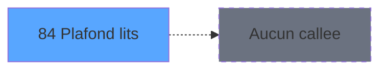

# PBS IDE 84 - Plafond lits

> **Analyse**: Phases 1-4 2026-02-03 17:29 -> 17:29 (15s) | Assemblage 17:29
> **Pipeline**: V7.2 Enrichi
> **Structure**: 4 onglets (Resume | Ecrans | Donnees | Connexions)

<!-- TAB:Resume -->

## 1. FICHE D'IDENTITE

| Attribut | Valeur |
|----------|--------|
| Projet | PBS |
| IDE Position | 84 |
| Nom Programme | Plafond lits |
| Fichier source | `Prg_84.xml` |
| Dossier IDE | Utilitaires |
| Taches | 1 (1 ecrans visibles) |
| Tables modifiees | 0 |
| Programmes appeles | 0 |
| :warning: Statut | **ORPHELIN_POTENTIEL** |

## 2. DESCRIPTION FONCTIONNELLE

**Plafond lits** assure la gestion complete de ce processus.

Le flux de traitement s'organise en **1 blocs fonctionnels** :

- **Traitement** (1 tache) : traitements metier divers

**Logique metier** : 1 regles identifiees couvrant conditions metier.

## 3. BLOCS FONCTIONNELS

### 3.1 Traitement (1 tache)

Traitements internes.

---

#### 84 - Plafond lit [[ECRAN]](#ecran-t1)

**Role** : Traitement : Plafond lit.
**Ecran** : 691 x 222 DLU (MDI) | [Voir mockup](#ecran-t1)
**Variables liees** : B (V.Existe plafond ?)

## 5. REGLES METIER

1 regles identifiees:

### Autres (1 regles)

#### [RM-001] Si [Y] alors [X] sinon V Lieu sejour [C])

| Element | Detail |
|---------|--------|
| **Condition** | `[Y]` |
| **Si vrai** | [X] |
| **Si faux** | V Lieu sejour [C]) |
| **Variables** | C (V Lieu sejour) |
| **Expression source** | Expression 8 : `IF([Y],[X],V Lieu sejour [C])` |
| **Exemple** | Si [Y] → [X]. Sinon → V Lieu sejour [C]) |

## 6. CONTEXTE

- **Appele par**: (aucun)
- **Appelle**: 0 programmes | **Tables**: 3 (W:0 R:1 L:2) | **Taches**: 1 | **Expressions**: 14

<!-- TAB:Ecrans -->

## 8. ECRANS

### 8.1 Forms visibles (1 / 1)

| # | Position | Tache | Nom | Type | Largeur | Hauteur | Bloc |
|---|----------|-------|-----|------|---------|---------|------|
| 1 | 84 | 84 | Plafond lit | MDI | 691 | 222 | Traitement |

### 8.2 Mockups Ecrans

---

#### 84 - Plafond lit
**Tache** : [84](#t1) | **Type** : MDI | **Dimensions** : 691 x 222 DLU
**Bloc** : Traitement | **Titre IDE** : Plafond lit

<!-- FORM-DATA:
{
    "width":  691,
    "vFactor":  8,
    "type":  "MDI",
    "hFactor":  8,
    "controls":  [
                     {
                         "x":  0,
                         "type":  "label",
                         "var":  "",
                         "y":  1,
                         "w":  688,
                         "fmt":  "",
                         "name":  "",
                         "h":  20,
                         "color":  "",
                         "text":  "",
                         "parent":  null
                     },
                     {
                         "x":  1,
                         "type":  "label",
                         "var":  "",
                         "y":  195,
                         "w":  688,
                         "fmt":  "",
                         "name":  "",
                         "h":  24,
                         "color":  "",
                         "text":  "",
                         "parent":  null
                     },
                     {
                         "x":  457,
                         "type":  "label",
                         "var":  "",
                         "y":  40,
                         "w":  177,
                         "fmt":  "",
                         "name":  "",
                         "h":  148,
                         "color":  "",
                         "text":  "",
                         "parent":  null
                     },
                     {
                         "x":  8,
                         "type":  "table",
                         "var":  "",
                         "name":  "",
                         "titleH":  12,
                         "color":  "110",
                         "w":  296,
                         "y":  44,
                         "fmt":  "",
                         "parent":  null,
                         "text":  "",
                         "rowH":  13,
                         "h":  150,
                         "cols":  [
                                      {
                                          "title":  "Date",
                                          "layer":  1,
                                          "w":  162
                                      },
                                      {
                                          "title":  "Plafond",
                                          "layer":  2,
                                          "w":  99
                                      }
                                  ],
                         "rows":  2
                     },
                     {
                         "x":  121,
                         "type":  "label",
                         "var":  "",
                         "y":  26,
                         "w":  135,
                         "fmt":  "",
                         "name":  "",
                         "h":  9,
                         "color":  "1",
                         "text":  "Lieu de séjour",
                         "parent":  null
                     },
                     {
                         "x":  470,
                         "type":  "edit",
                         "var":  "",
                         "y":  7,
                         "w":  203,
                         "fmt":  "WWW DD MMM YYYYT",
                         "name":  "",
                         "h":  8,
                         "color":  "",
                         "text":  "",
                         "parent":  1
                     },
                     {
                         "x":  6,
                         "type":  "edit",
                         "var":  "",
                         "y":  7,
                         "w":  396,
                         "fmt":  "30",
                         "name":  "",
                         "h":  8,
                         "color":  "",
                         "text":  "",
                         "parent":  1
                     },
                     {
                         "x":  469,
                         "type":  "button",
                         "var":  "",
                         "y":  104,
                         "w":  154,
                         "fmt":  "\u0026Creation",
                         "name":  "",
                         "h":  18,
                         "color":  "",
                         "text":  "",
                         "parent":  5
                     },
                     {
                         "x":  469,
                         "type":  "button",
                         "var":  "",
                         "y":  77,
                         "w":  154,
                         "fmt":  "\u0026Modification",
                         "name":  "",
                         "h":  18,
                         "color":  "",
                         "text":  "",
                         "parent":  5
                     },
                     {
                         "x":  469,
                         "type":  "button",
                         "var":  "",
                         "y":  158,
                         "w":  154,
                         "fmt":  "\u0026Annulation",
                         "name":  "",
                         "h":  18,
                         "color":  "",
                         "text":  "",
                         "parent":  5
                     },
                     {
                         "x":  7,
                         "type":  "button",
                         "var":  "",
                         "y":  198,
                         "w":  154,
                         "fmt":  "\u0026Quitter",
                         "name":  "",
                         "h":  18,
                         "color":  "",
                         "text":  "",
                         "parent":  4
                     },
                     {
                         "x":  14,
                         "type":  "edit",
                         "var":  "",
                         "y":  59,
                         "w":  150,
                         "fmt":  "##/##/####Z",
                         "name":  "Date_plafond",
                         "h":  10,
                         "color":  "110",
                         "text":  "",
                         "parent":  11
                     },
                     {
                         "x":  176,
                         "type":  "edit",
                         "var":  "",
                         "y":  59,
                         "w":  91,
                         "fmt":  "5Z",
                         "name":  "pll_plafond",
                         "h":  10,
                         "color":  "110",
                         "text":  "",
                         "parent":  11
                     },
                     {
                         "x":  469,
                         "type":  "button",
                         "var":  "",
                         "y":  131,
                         "w":  154,
                         "fmt":  "\u0026Suppression",
                         "name":  "",
                         "h":  18,
                         "color":  "",
                         "text":  "",
                         "parent":  5
                     },
                     {
                         "x":  469,
                         "type":  "button",
                         "var":  "",
                         "y":  50,
                         "w":  154,
                         "fmt":  "\u0026Visualisation",
                         "name":  "",
                         "h":  18,
                         "color":  "",
                         "text":  "",
                         "parent":  5
                     },
                     {
                         "x":  273,
                         "type":  "combobox",
                         "var":  "",
                         "y":  24,
                         "w":  296,
                         "fmt":  "",
                         "name":  "v_lieu_sejour",
                         "h":  12,
                         "color":  "",
                         "text":  "",
                         "parent":  null
                     }
                 ],
    "taskId":  "84",
    "height":  222
}
-->

<strong>Champs : 5 champs</strong>

| Pos (x,y) | Nom | Variable | Type |
|-----------|-----|----------|------|
| 470,7 | WWW DD MMM YYYYT | - | edit |
| 6,7 | 30 | - | edit |
| 14,59 | Date_plafond | - | edit |
| 176,59 | pll_plafond | - | edit |
| 273,24 | v_lieu_sejour | - | combobox |

<strong>Boutons : 6 boutons</strong>

| Bouton | Pos (x,y) | Action |
|--------|-----------|--------|
| Creation | 469,104 | Bouton fonctionnel |
| Modification | 469,77 | Modifie l'element |
| Annulation | 469,158 | Annule et retour au menu |
| Quitter | 7,198 | Quitte le programme |
| Suppression | 469,131 | Supprime l'element selectionne |
| Visualisation | 469,50 | Bouton fonctionnel |

## 9. NAVIGATION

Ecran unique: **Plafond lit**

### 9.3 Structure hierarchique (1 tache)

| Position | Tache | Type | Dimensions | Bloc |
|----------|-------|------|------------|------|
| **84.1** | [**Plafond lit** (84)](#t1) [mockup](#ecran-t1) | MDI | 691x222 | Traitement |

### 9.4 Algorigramme

> **Legende**: Vert = START/END OK | Rouge = END KO | Bleu = Decisions
> *Algorigramme auto-genere. Utiliser `/algorigramme` pour une synthese metier detaillee.*

<!-- TAB:Donnees -->

## 10. TABLES

### Tables utilisees (3)

| ID | Nom | Description | Type | R | W | L | Usages |
|----|-----|-------------|------|---|---|---|--------|
| 81 | societe__________soc |  | DB | R |   |   | 1 |
| 118 | tables_imports |  | DB |   |   | L | 1 |
| 847 | stat_lieu_vente_date | Statistiques point de vente | TMP |   |   | L | 1 |

### Colonnes par table (2 / 1 tables avec colonnes identifiees)

Table 81 - societe__________soc (R) - 1 usages

| Lettre | Variable | Acces | Type |
|--------|----------|-------|------|
| A | v Retour lieu de sejour | R | Logical |
| B | V.Existe plafond ? | R | Logical |
| C | V Lieu sejour | R | Unicode |
| D | CHG_REASON_v lieu sejour | R | Numeric |
| E | CHG_PRV_v lieu sejour | R | Unicode |

## 11. VARIABLES

### 11.1 Variables de session (3)

Variables persistantes pendant toute la session.

| Lettre | Nom | Type | Usage dans |
|--------|-----|------|-----------|
| A | v Retour lieu de sejour | Logical | 2x session |
| B | V.Existe plafond ? | Logical | - |
| C | V Lieu sejour | Unicode | 1x session |

### 11.2 Autres (2)

Variables diverses.

| Lettre | Nom | Type | Usage dans |
|--------|-----|------|-----------|
| D | CHG_REASON_v lieu sejour | Numeric | - |
| E | CHG_PRV_v lieu sejour | Unicode | - |

## 12. EXPRESSIONS

**14 / 14 expressions decodees (100%)**

### 12.1 Repartition par type

| Type | Expressions | Regles |
|------|-------------|--------|
| CONDITION | 4 | 5 |
| CONSTANTE | 1 | 0 |
| DATE | 1 | 0 |
| REFERENCE_VG | 2 | 0 |
| OTHER | 5 | 0 |
| NEGATION | 1 | 0 |

### 12.2 Expressions cles par type

#### CONDITION (4 expressions)

| Type | IDE | Expression | Regle |
|------|-----|------------|-------|
| CONDITION | 8 | `IF([Y],[X],V Lieu sejour [C])` | [RM-001](#rm-RM-001) |
| CONDITION | 9 | `GetParam('NB_LIEU_SEJOUR')>1` | - |
| CONDITION | 13 | `v Retour lieu de sejour [A]<>'00/00/0000'DATE` | - |
| CONDITION | 14 | `Stat(0,'C'MODE) AND v Retour lieu de sejour [A]='00/00/0000'DATE` | - |

#### CONSTANTE (1 expressions)

| Type | IDE | Expression | Regle |
|------|-----|------------|-------|
| CONSTANTE | 7 | `'C'` | - |

#### DATE (1 expressions)

| Type | IDE | Expression | Regle |
|------|-----|------------|-------|
| DATE | 1 | `Date ()` | - |

#### REFERENCE_VG (2 expressions)

| Type | IDE | Expression | Regle |
|------|-----|------------|-------|
| REFERENCE_VG | 12 | `VG20` | - |
| REFERENCE_VG | 2 | `VG3` | - |

#### OTHER (5 expressions)

| Type | IDE | Expression | Regle |
|------|-----|------------|-------|
| OTHER | 10 | `GetParam('CSEJOU')` | - |
| OTHER | 11 | `Left([L],1)` | - |
| OTHER | 6 | `Stat(0,'C'MODE)` | - |
| OTHER | 3 | `Stat (0,'E'MODE)` | - |
| OTHER | 5 | `MlsTrans('Paramétrer les types d''états des statistiques à produire')` | - |

#### NEGATION (1 expressions)

| Type | IDE | Expression | Regle |
|------|-----|------------|-------|
| NEGATION | 4 | `NOT (Stat (0,'E'MODE))` | - |

<!-- TAB:Connexions -->

## 13. GRAPHE D'APPELS

### 13.1 Chaine depuis Main (Callers)

**Chemin**: (pas de callers directs)

### 13.2 Callers

| IDE | Nom Programme | Nb Appels |
|-----|---------------|-----------|
| - | (aucun) | - |

### 13.3 Callees (programmes appeles)

### 13.4 Detail Callees avec contexte

| IDE | Nom Programme | Appels | Contexte |
|-----|---------------|--------|----------|
| - | (aucun) | - | - |

## 14. RECOMMANDATIONS MIGRATION

### 14.1 Profil du programme

| Metrique | Valeur | Impact migration |
|----------|--------|-----------------|
| Lignes de logique | 35 | Programme compact |
| Expressions | 14 | Peu de logique |
| Tables WRITE | 0 | Impact faible |
| Sous-programmes | 0 | Peu de dependances |
| Ecrans visibles | 1 | Ecran unique ou traitement batch |
| Code desactive | 0% (0 / 35) | Code sain |
| Regles metier | 1 | Quelques regles a preserver |

### 14.2 Plan de migration par bloc

#### Traitement (1 tache: 1 ecran, 0 traitement)

- **Strategie** : 1 composant(s) UI (Razor/React) avec formulaires et validation.
- Decomposer les taches en services unitaires testables.

### 14.3 Dependances critiques

| Dependance | Type | Appels | Impact |
|------------|------|--------|--------|

---
*Spec DETAILED generee par Pipeline V7.2 - 2026-02-03 17:29*
