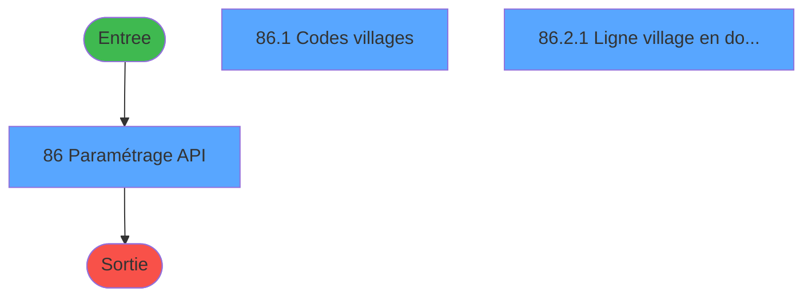
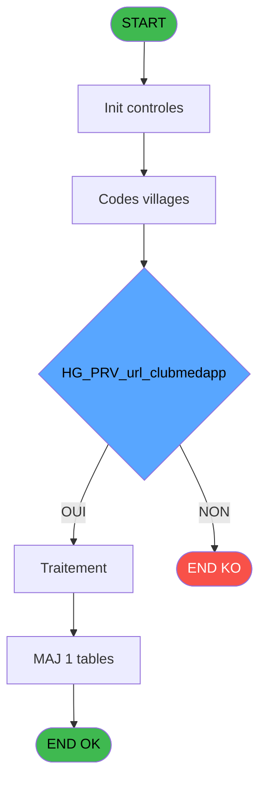
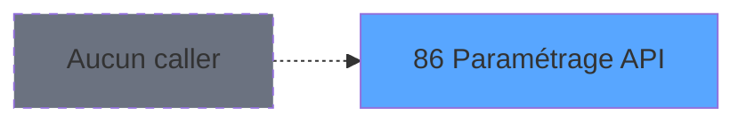
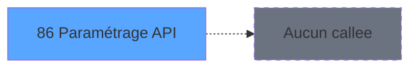

# PBS IDE 86 - Paramétrage API

> **Analyse**: Phases 1-4 2026-02-03 17:30 -> 17:30 (18s) | Assemblage 17:30
> **Pipeline**: V7.2 Enrichi
> **Structure**: 4 onglets (Resume | Ecrans | Donnees | Connexions)

<!-- TAB:Resume -->

## 1. FICHE D'IDENTITE

| Attribut | Valeur |
|----------|--------|
| Projet | PBS |
| IDE Position | 86 |
| Nom Programme | Paramétrage API |
| Fichier source | `Prg_86.xml` |
| Dossier IDE | Utilitaires |
| Taches | 6 (3 ecrans visibles) |
| Tables modifiees | 1 |
| Programmes appeles | 0 |
| :warning: Statut | **ORPHELIN_POTENTIEL** |

## 2. DESCRIPTION FONCTIONNELLE

**Paramétrage API** assure la gestion complete de ce processus.

Le flux de traitement s'organise en **1 blocs fonctionnels** :

- **Traitement** (6 taches) : traitements metier divers

**Donnees modifiees** : 1 tables en ecriture (pv_budget).

**Logique metier** : 5 regles identifiees couvrant conditions metier, valeurs par defaut.

Detail : phases du traitement

#### Phase 1 : Traitement (6 taches)

- **86** - Paramétrage API **[[ECRAN]](#ecran-t1)**
- **86.1** - Codes villages **[[ECRAN]](#ecran-t2)**
- **86.2** - Liste pms_village
- **86.2.1** - Ligne village en double **[[ECRAN]](#ecran-t7)**
- **86.2.1.1** - Supprimer doublon
- **86.3** - Lecture xml fdp Brésil

#### Tables impactees

| Table | Operations | Role metier |
|-------|-----------|-------------|
| pv_budget | **W** (3 usages) |  |

## 3. BLOCS FONCTIONNELS

### 3.1 Traitement (6 taches)

Traitements internes.

---

#### 86 - Paramétrage API [[ECRAN]](#ecran-t1)

**Role** : Tache d'orchestration : point d'entree du programme (6 sous-taches). Coordonne l'enchainement des traitements.
**Ecran** : 648 x 455 DLU | [Voir mockup](#ecran-t1)

5 sous-taches directes

| Tache | Nom | Bloc |
|-------|-----|------|
| [86.1](#t2) | Codes villages **[[ECRAN]](#ecran-t2)** | Traitement |
| [86.2](#t6) | Liste pms_village | Traitement |
| [86.2.1](#t7) | Ligne village en double **[[ECRAN]](#ecran-t7)** | Traitement |
| [86.2.1.1](#t8) | Supprimer doublon | Traitement |
| [86.3](#t9) | Lecture xml fdp Brésil | Traitement |

---

#### 86.1 - Codes villages [[ECRAN]](#ecran-t2)

**Role** : Traitement : Codes villages.
**Ecran** : 625 x 85 DLU | [Voir mockup](#ecran-t2)

---

#### 86.2 - Liste pms_village

**Role** : Traitement : Liste pms_village.

---

#### 86.2.1 - Ligne village en double [[ECRAN]](#ecran-t7)

**Role** : Traitement : Ligne village en double.
**Ecran** : 488 x 126 DLU | [Voir mockup](#ecran-t7)

---

#### 86.2.1.1 - Supprimer doublon

**Role** : Traitement : Supprimer doublon.

---

#### 86.3 - Lecture xml fdp Brésil

**Role** : Traitement : Lecture xml fdp Brésil.

## 5. REGLES METIER

5 regles identifiees:

### Autres (5 regles)

#### [RM-001] Si v.Taille chaine [T]<CHG_PRV_url_clubmedapp [E] alors 221 sinon 2)

| Element | Detail |
|---------|--------|
| **Condition** | `v.Taille chaine [T]<CHG_PRV_url_clubmedapp [E]` |
| **Si vrai** | 221 |
| **Si faux** | 2) |
| **Variables** | T (v.Taille chaine), E (CHG_PRV_url_clubmedapp) |
| **Expression source** | Expression 7 : `IF (v.Taille chaine [T]<CHG_PRV_url_clubmedapp [E], 221, 2)` |
| **Exemple** | Si v.Taille chaine [T]<CHG_PRV_url_clubmedapp [E] → 221. Sinon → 2) |

#### [RM-002] Si ExpCalc('27'EXP) alors 'OK' sinon 'ERR')

| Element | Detail |
|---------|--------|
| **Condition** | `ExpCalc('27'EXP)` |
| **Si vrai** | 'OK' |
| **Si faux** | 'ERR') |
| **Expression source** | Expression 17 : `IF(ExpCalc('27'EXP), 'OK', 'ERR')` |
| **Exemple** | Si ExpCalc('27'EXP) → 'OK'. Sinon → 'ERR') |

#### [RM-003] Valeur par defaut si INIGet('HTTPProxyAddress') est vide

| Element | Detail |
|---------|--------|
| **Condition** | `INIGet('HTTPProxyAddress')=''` |
| **Si vrai** | MlsTrans('(Non renseignée)') |
| **Si faux** | INIGet('HTTPProxyAddress')) |
| **Expression source** | Expression 39 : `IF(INIGet('HTTPProxyAddress')='',MlsTrans('(Non renseignée)'` |
| **Exemple** | Si INIGet('HTTPProxyAddress')='' → MlsTrans('(Non renseignée)'). Sinon → INIGet('HTTPProxyAddress')) |

#### [RM-004] Si InStr(Upper(v.XML out [B]) alors 'PROD')>0 sinon '→ Qualif', '→ Prod')

| Element | Detail |
|---------|--------|
| **Condition** | `InStr(Upper(v.XML out [B])` |
| **Si vrai** | 'PROD')>0 |
| **Si faux** | '→ Qualif', '→ Prod') |
| **Variables** | B (v.XML out) |
| **Expression source** | Expression 68 : `IF(InStr(Upper(v.XML out [B]), 'PROD')>0, '→ Qualif', '→ Pro` |
| **Exemple** | Si InStr(Upper(v.XML out [B]) → 'PROD')>0. Sinon → '→ Qualif', '→ Prod') |

#### [RM-005] Traitement conditionnel si InStr(Upper(v.Lettres accentuées [O]), 'STAGING') est a zero

| Element | Detail |
|---------|--------|
| **Condition** | `InStr(Upper(v.Lettres accentuées [O])` |
| **Si vrai** | 'STAGING')=0 |
| **Si faux** | '→ Staging', '→ Prod') |
| **Variables** | O (v.Lettres accentuées) |
| **Expression source** | Expression 69 : `IF(InStr(Upper(v.Lettres accentuées [O]), 'STAGING')=0, '→ S` |
| **Exemple** | Si InStr(Upper(v.Lettres accentuées [O]) → 'STAGING')=0. Sinon → '→ Staging', '→ Prod') |

## 6. CONTEXTE

- **Appele par**: (aucun)
- **Appelle**: 0 programmes | **Tables**: 3 (W:1 R:1 L:1) | **Taches**: 6 | **Expressions**: 79

<!-- TAB:Ecrans -->

## 8. ECRANS

### 8.1 Forms visibles (3 / 6)

| # | Position | Tache | Nom | Type | Largeur | Hauteur | Bloc |
|---|----------|-------|-----|------|---------|---------|------|
| 1 | 86 | 86 | Paramétrage API | Type0 | 648 | 455 | Traitement |
| 2 | 86.1 | 86.1 | Codes villages | Type0 | 625 | 85 | Traitement |
| 3 | 86.2.1 | 86.2.1 | Ligne village en double | Type0 | 488 | 126 | Traitement |

### 8.2 Mockups Ecrans

---

#### 86 - Paramétrage API
**Tache** : [86](#t1) | **Type** : Type0 | **Dimensions** : 648 x 455 DLU
**Bloc** : Traitement | **Titre IDE** : Paramétrage API

<!-- FORM-DATA:
{
    "width":  648,
    "vFactor":  8,
    "type":  "Type0",
    "hFactor":  4,
    "controls":  [
                     {
                         "x":  14,
                         "type":  "label",
                         "var":  "",
                         "y":  156,
                         "w":  141,
                         "fmt":  "",
                         "name":  "",
                         "h":  9,
                         "color":  "",
                         "text":  "URL de l\u0027API",
                         "parent":  19
                     },
                     {
                         "x":  14,
                         "type":  "label",
                         "var":  "",
                         "y":  200,
                         "w":  141,
                         "fmt":  "",
                         "name":  "",
                         "h":  12,
                         "color":  "",
                         "text":  "Autoriser les notifications entre",
                         "parent":  25
                     },
                     {
                         "x":  2,
                         "type":  "label",
                         "var":  "",
                         "y":  140,
                         "w":  640,
                         "fmt":  "",
                         "name":  "",
                         "h":  48,
                         "color":  "",
                         "text":  "Club Med App",
                         "parent":  null
                     },
                     {
                         "x":  2,
                         "type":  "label",
                         "var":  "",
                         "y":  4,
                         "w":  640,
                         "fmt":  "",
                         "name":  "",
                         "h":  104,
                         "color":  "",
                         "text":  "Identification village pour l\u0027API",
                         "parent":  null
                     },
                     {
                         "x":  2,
                         "type":  "label",
                         "var":  "",
                         "y":  190,
                         "w":  640,
                         "fmt":  "",
                         "name":  "",
                         "h":  26,
                         "color":  "",
                         "text":  "Room ready",
                         "parent":  null
                     },
                     {
                         "x":  2,
                         "type":  "label",
                         "var":  "",
                         "y":  290,
                         "w":  640,
                         "fmt":  "",
                         "name":  "",
                         "h":  108,
                         "color":  "",
                         "text":  "ETIS House Keeping",
                         "parent":  null
                     },
                     {
                         "x":  14,
                         "type":  "label",
                         "var":  "",
                         "y":  306,
                         "w":  141,
                         "fmt":  "",
                         "name":  "",
                         "h":  9,
                         "color":  "",
                         "text":  "URL de l\u0027API",
                         "parent":  26
                     },
                     {
                         "x":  14,
                         "type":  "label",
                         "var":  "",
                         "y":  172,
                         "w":  141,
                         "fmt":  "",
                         "name":  "",
                         "h":  9,
                         "color":  "",
                         "text":  "Clé",
                         "parent":  19
                     },
                     {
                         "x":  212,
                         "type":  "label",
                         "var":  "",
                         "y":  200,
                         "w":  18,
                         "fmt":  "",
                         "name":  "",
                         "h":  12,
                         "color":  "",
                         "text":  "Et",
                         "parent":  25
                     },
                     {
                         "x":  14,
                         "type":  "label",
                         "var":  "",
                         "y":  318,
                         "w":  141,
                         "fmt":  "",
                         "name":  "",
                         "h":  9,
                         "color":  "",
                         "text":  "Utilisateur",
                         "parent":  26
                     },
                     {
                         "x":  14,
                         "type":  "label",
                         "var":  "",
                         "y":  330,
                         "w":  141,
                         "fmt":  "",
                         "name":  "",
                         "h":  9,
                         "color":  "",
                         "text":  "Mot de passe",
                         "parent":  26
                     },
                     {
                         "x":  14,
                         "type":  "label",
                         "var":  "",
                         "y":  358,
                         "w":  141,
                         "fmt":  "",
                         "name":  "",
                         "h":  10,
                         "color":  "",
                         "text":  "Libellé ménage à blanc",
                         "parent":  26
                     },
                     {
                         "x":  14,
                         "type":  "label",
                         "var":  "",
                         "y":  370,
                         "w":  141,
                         "fmt":  "",
                         "name":  "",
                         "h":  10,
                         "color":  "",
                         "text":  "Libellé changement de chambre",
                         "parent":  26
                     },
                     {
                         "x":  458,
                         "type":  "label",
                         "var":  "",
                         "y":  358,
                         "w":  101,
                         "fmt":  "",
                         "name":  "",
                         "h":  20,
                         "color":  "2",
                         "text":  "Seuls les caractères non accentués sont autorisés.",
                         "parent":  26
                     },
                     {
                         "x":  2,
                         "type":  "label",
                         "var":  "",
                         "y":  112,
                         "w":  640,
                         "fmt":  "",
                         "name":  "",
                         "h":  26,
                         "color":  "",
                         "text":  "Variable d\u0027environement  HTTPProxyAddress",
                         "parent":  null
                     },
                     {
                         "x":  2,
                         "type":  "label",
                         "var":  "",
                         "y":  402,
                         "w":  640,
                         "fmt":  "",
                         "name":  "",
                         "h":  30,
                         "color":  "",
                         "text":  "Fiche de police Brésil",
                         "parent":  null
                     },
                     {
                         "x":  14,
                         "type":  "label",
                         "var":  "",
                         "y":  416,
                         "w":  23,
                         "fmt":  "",
                         "name":  "",
                         "h":  10,
                         "color":  "",
                         "text":  "URL",
                         "parent":  54
                     },
                     {
                         "x":  332,
                         "type":  "label",
                         "var":  "",
                         "y":  416,
                         "w":  64,
                         "fmt":  "",
                         "name":  "",
                         "h":  10,
                         "color":  "",
                         "text":  "Code d\u0027accès",
                         "parent":  54
                     },
                     {
                         "x":  14,
                         "type":  "label",
                         "var":  "",
                         "y":  384,
                         "w":  141,
                         "fmt":  "",
                         "name":  "",
                         "h":  10,
                         "color":  "",
                         "text":  "Libellé ménage standard",
                         "parent":  26
                     },
                     {
                         "x":  2,
                         "type":  "label",
                         "var":  "",
                         "y":  218,
                         "w":  640,
                         "fmt":  "",
                         "name":  "",
                         "h":  70,
                         "color":  "",
                         "text":  "Club Med API",
                         "parent":  null
                     },
                     {
                         "x":  14,
                         "type":  "label",
                         "var":  "",
                         "y":  228,
                         "w":  141,
                         "fmt":  "",
                         "name":  "",
                         "h":  10,
                         "color":  "",
                         "text":  "Client ID",
                         "parent":  66
                     },
                     {
                         "x":  14,
                         "type":  "label",
                         "var":  "",
                         "y":  239,
                         "w":  141,
                         "fmt":  "",
                         "name":  "",
                         "h":  10,
                         "color":  "",
                         "text":  "Client secret",
                         "parent":  66
                     },
                     {
                         "x":  14,
                         "type":  "label",
                         "var":  "",
                         "y":  250,
                         "w":  141,
                         "fmt":  "",
                         "name":  "",
                         "h":  10,
                         "color":  "",
                         "text":  "Login URL",
                         "parent":  66
                     },
                     {
                         "x":  14,
                         "type":  "label",
                         "var":  "",
                         "y":  261,
                         "w":  141,
                         "fmt":  "",
                         "name":  "",
                         "h":  10,
                         "color":  "",
                         "text":  "API key",
                         "parent":  66
                     },
                     {
                         "x":  14,
                         "type":  "label",
                         "var":  "",
                         "y":  272,
                         "w":  141,
                         "fmt":  "",
                         "name":  "",
                         "h":  10,
                         "color":  "",
                         "text":  "API URL prefix",
                         "parent":  66
                     },
                     {
                         "x":  10,
                         "type":  "subform",
                         "var":  "",
                         "y":  16,
                         "w":  628,
                         "fmt":  "",
                         "name":  "CodesVillage",
                         "h":  88,
                         "color":  "",
                         "text":  "",
                         "parent":  20
                     },
                     {
                         "x":  224,
                         "type":  "edit",
                         "var":  "",
                         "y":  122,
                         "w":  291,
                         "fmt":  "100",
                         "name":  "",
                         "h":  10,
                         "color":  "",
                         "text":  "",
                         "parent":  51
                     },
                     {
                         "x":  482,
                         "type":  "button",
                         "var":  "",
                         "y":  154,
                         "w":  46,
                         "fmt":  "Défaut",
                         "name":  "",
                         "h":  14,
                         "color":  "",
                         "text":  "",
                         "parent":  19
                     },
                     {
                         "x":  566,
                         "type":  "button",
                         "var":  "",
                         "y":  154,
                         "w":  70,
                         "fmt":  "30",
                         "name":  "",
                         "h":  14,
                         "color":  "",
                         "text":  "",
                         "parent":  19
                     },
                     {
                         "x":  158,
                         "type":  "edit",
                         "var":  "",
                         "y":  156,
                         "w":  316,
                         "fmt":  "",
                         "name":  "url_clubmedapp",
                         "h":  10,
                         "color":  "",
                         "text":  "",
                         "parent":  19
                     },
                     {
                         "x":  566,
                         "type":  "button",
                         "var":  "",
                         "y":  170,
                         "w":  70,
                         "fmt":  "Test",
                         "name":  "",
                         "h":  14,
                         "color":  "",
                         "text":  "",
                         "parent":  19
                     },
                     {
                         "x":  158,
                         "type":  "edit",
                         "var":  "",
                         "y":  172,
                         "w":  380,
                         "fmt":  "",
                         "name":  "key_clubmedapp_0001",
                         "h":  10,
                         "color":  "",
                         "text":  "",
                         "parent":  19
                     },
                     {
                         "x":  158,
                         "type":  "edit",
                         "var":  "",
                         "y":  200,
                         "w":  46,
                         "fmt":  "HH:MMZ",
                         "name":  "room_ready_heure_debut_notif",
                         "h":  12,
                         "color":  "",
                         "text":  "",
                         "parent":  25
                     },
                     {
                         "x":  236,
                         "type":  "edit",
                         "var":  "",
                         "y":  200,
                         "w":  46,
                         "fmt":  "HH:MMZ",
                         "name":  "room_ready_heure_fin_notif",
                         "h":  12,
                         "color":  "",
                         "text":  "",
                         "parent":  25
                     },
                     {
                         "x":  292,
                         "type":  "edit",
                         "var":  "",
                         "y":  200,
                         "w":  334,
                         "fmt":  "100",
                         "name":  "",
                         "h":  12,
                         "color":  "2",
                         "text":  "",
                         "parent":  25
                     },
                     {
                         "x":  158,
                         "type":  "edit",
                         "var":  "",
                         "y":  228,
                         "w":  316,
                         "fmt":  "",
                         "name":  "api_clud_med_client_id",
                         "h":  10,
                         "color":  "",
                         "text":  "",
                         "parent":  66
                     },
                     {
                         "x":  158,
                         "type":  "edit",
                         "var":  "",
                         "y":  239,
                         "w":  316,
                         "fmt":  "",
                         "name":  "api_clud_med_client_secret",
                         "h":  10,
                         "color":  "",
                         "text":  "",
                         "parent":  66
                     },
                     {
                         "x":  158,
                         "type":  "edit",
                         "var":  "",
                         "y":  250,
                         "w":  316,
                         "fmt":  "",
                         "name":  "api_clud_med_login_url_0001",
                         "h":  10,
                         "color":  "",
                         "text":  "",
                         "parent":  66
                     },
                     {
                         "x":  158,
                         "type":  "edit",
                         "var":  "",
                         "y":  261,
                         "w":  316,
                         "fmt":  "",
                         "name":  "api_clud_med_api_key_0001",
                         "h":  10,
                         "color":  "",
                         "text":  "",
                         "parent":  66
                     },
                     {
                         "x":  158,
                         "type":  "edit",
                         "var":  "",
                         "y":  272,
                         "w":  316,
                         "fmt":  "",
                         "name":  "api_clud_med_url_0001",
                         "h":  10,
                         "color":  "",
                         "text":  "",
                         "parent":  66
                     },
                     {
                         "x":  551,
                         "type":  "button",
                         "var":  "",
                         "y":  304,
                         "w":  46,
                         "fmt":  "Défaut",
                         "name":  "",
                         "h":  14,
                         "color":  "",
                         "text":  "",
                         "parent":  26
                     },
                     {
                         "x":  158,
                         "type":  "edit",
                         "var":  "",
                         "y":  306,
                         "w":  388,
                         "fmt":  "",
                         "name":  "url_etis_housekeeping_0001",
                         "h":  10,
                         "color":  "",
                         "text":  "",
                         "parent":  26
                     },
                     {
                         "x":  158,
                         "type":  "edit",
                         "var":  "",
                         "y":  318,
                         "w":  452,
                         "fmt":  "",
                         "name":  "login_etis_housekeeping_0001",
                         "h":  10,
                         "color":  "",
                         "text":  "",
                         "parent":  26
                     },
                     {
                         "x":  158,
                         "type":  "edit",
                         "var":  "",
                         "y":  330,
                         "w":  452,
                         "fmt":  "",
                         "name":  "pwd_etis_housekeeping_0001",
                         "h":  10,
                         "color":  "",
                         "text":  "",
                         "parent":  26
                     },
                     {
                         "x":  14,
                         "type":  "checkbox",
                         "var":  "",
                         "y":  342,
                         "w":  488,
                         "fmt":  "",
                         "name":  "menage_standard_etis",
                         "h":  12,
                         "color":  "",
                         "text":  "Envoyer les demandes de ménage standard",
                         "parent":  26
                     },
                     {
                         "x":  566,
                         "type":  "button",
                         "var":  "",
                         "y":  344,
                         "w":  70,
                         "fmt":  "30",
                         "name":  "",
                         "h":  14,
                         "color":  "",
                         "text":  "",
                         "parent":  26
                     },
                     {
                         "x":  158,
                         "type":  "edit",
                         "var":  "",
                         "y":  358,
                         "w":  283,
                         "fmt":  "",
                         "name":  "libelle_menage_blanc_etis",
                         "h":  10,
                         "color":  "",
                         "text":  "",
                         "parent":  26
                     },
                     {
                         "x":  566,
                         "type":  "button",
                         "var":  "",
                         "y":  360,
                         "w":  70,
                         "fmt":  "Test",
                         "name":  "",
                         "h":  14,
                         "color":  "",
                         "text":  "",
                         "parent":  26
                     },
                     {
                         "x":  158,
                         "type":  "edit",
                         "var":  "",
                         "y":  370,
                         "w":  283,
                         "fmt":  "",
                         "name":  "libelle_menage_changement_0001",
                         "h":  10,
                         "color":  "",
                         "text":  "",
                         "parent":  26
                     },
                     {
                         "x":  158,
                         "type":  "edit",
                         "var":  "",
                         "y":  384,
                         "w":  283,
                         "fmt":  "",
                         "name":  "libelle_menage_standard_etis",
                         "h":  10,
                         "color":  "",
                         "text":  "",
                         "parent":  26
                     },
                     {
                         "x":  280,
                         "type":  "button",
                         "var":  "",
                         "y":  414,
                         "w":  46,
                         "fmt":  "Défaut",
                         "name":  "",
                         "h":  14,
                         "color":  "",
                         "text":  "",
                         "parent":  54
                     },
                     {
                         "x":  566,
                         "type":  "button",
                         "var":  "",
                         "y":  414,
                         "w":  70,
                         "fmt":  "Test",
                         "name":  "",
                         "h":  14,
                         "color":  "",
                         "text":  "",
                         "parent":  54
                     },
                     {
                         "x":  57,
                         "type":  "edit",
                         "var":  "",
                         "y":  416,
                         "w":  218,
                         "fmt":  "",
                         "name":  "endpoint_ws_police_bresil",
                         "h":  10,
                         "color":  "",
                         "text":  "",
                         "parent":  54
                     },
                     {
                         "x":  400,
                         "type":  "edit",
                         "var":  "",
                         "y":  416,
                         "w":  161,
                         "fmt":  "",
                         "name":  "code_acces_ws_police_bresil",
                         "h":  10,
                         "color":  "",
                         "text":  "",
                         "parent":  54
                     },
                     {
                         "x":  554,
                         "type":  "button",
                         "var":  "",
                         "y":  436,
                         "w":  88,
                         "fmt":  "\u0026\\Fermer",
                         "name":  "b.Fermer",
                         "h":  14,
                         "color":  "",
                         "text":  "",
                         "parent":  null
                     }
                 ],
    "taskId":  "86",
    "height":  455
}
-->

<strong>Champs : 20 champs</strong>

| Pos (x,y) | Nom | Variable | Type |
|-----------|-----|----------|------|
| 224,122 | 100 | - | edit |
| 158,156 | url_clubmedapp | - | edit |
| 158,172 | key_clubmedapp_0001 | - | edit |
| 158,200 | room_ready_heure_debut_notif | - | edit |
| 236,200 | room_ready_heure_fin_notif | - | edit |
| 292,200 | 100 | - | edit |
| 158,228 | api_clud_med_client_id | - | edit |
| 158,239 | api_clud_med_client_secret | - | edit |
| 158,250 | api_clud_med_login_url_0001 | - | edit |
| 158,261 | api_clud_med_api_key_0001 | - | edit |
| 158,272 | api_clud_med_url_0001 | - | edit |
| 158,306 | url_etis_housekeeping_0001 | - | edit |
| 158,318 | login_etis_housekeeping_0001 | - | edit |
| 158,330 | pwd_etis_housekeeping_0001 | - | edit |
| 14,342 | menage_standard_etis | - | checkbox |
| 158,358 | libelle_menage_blanc_etis | - | edit |
| 158,370 | libelle_menage_changement_0001 | - | edit |
| 158,384 | libelle_menage_standard_etis | - | edit |
| 57,416 | endpoint_ws_police_bresil | - | edit |
| 400,416 | code_acces_ws_police_bresil | - | edit |

<strong>Boutons : 9 boutons</strong>

| Bouton | Pos (x,y) | Action |
|--------|-----------|--------|
| Défaut | 482,154 | Bouton fonctionnel |
| 30 | 566,154 | Bouton fonctionnel |
| Test | 566,170 | Bouton fonctionnel |
| Défaut | 551,304 | Bouton fonctionnel |
| 30 | 566,344 | Bouton fonctionnel |
| Test | 566,360 | Bouton fonctionnel |
| Défaut | 280,414 | Bouton fonctionnel |
| Test | 566,414 | Bouton fonctionnel |
| \Fermer | 554,436 | Ouvre ou ferme la session |

---

#### 86.1 - Codes villages
**Tache** : [86.1](#t2) | **Type** : Type0 | **Dimensions** : 625 x 85 DLU
**Bloc** : Traitement | **Titre IDE** : Codes villages

<!-- FORM-DATA:
{
    "width":  625,
    "vFactor":  8,
    "type":  "Type0",
    "hFactor":  4,
    "controls":  [
                     {
                         "x":  0,
                         "type":  "table",
                         "var":  "",
                         "name":  "",
                         "titleH":  12,
                         "color":  "18",
                         "w":  622,
                         "y":  0,
                         "fmt":  "",
                         "parent":  null,
                         "text":  "",
                         "rowH":  17,
                         "h":  84,
                         "cols":  [
                                      {
                                          "title":  "Code",
                                          "layer":  1,
                                          "w":  33
                                      },
                                      {
                                          "title":  "Lieu de séjour",
                                          "layer":  2,
                                          "w":  123
                                      },
                                      {
                                          "title":  "Par défaut",
                                          "layer":  3,
                                          "w":  79
                                      },
                                      {
                                          "title":  "API si différent",
                                          "layer":  4,
                                          "w":  103
                                      },
                                      {
                                          "title":  "Suffixe été/hiver",
                                          "layer":  5,
                                          "w":  104
                                      },
                                      {
                                          "title":  "Code pour l\u0027API",
                                          "layer":  6,
                                          "w":  151
                                      }
                                  ],
                         "rows":  6
                     },
                     {
                         "x":  4,
                         "type":  "edit",
                         "var":  "",
                         "y":  15,
                         "w":  14,
                         "fmt":  "",
                         "name":  "code_lieu_de_sejour",
                         "h":  10,
                         "color":  "",
                         "text":  "",
                         "parent":  1
                     },
                     {
                         "x":  37,
                         "type":  "edit",
                         "var":  "",
                         "y":  15,
                         "w":  118,
                         "fmt":  "",
                         "name":  "nom_import",
                         "h":  10,
                         "color":  "",
                         "text":  "",
                         "parent":  1
                     },
                     {
                         "x":  160,
                         "type":  "edit",
                         "var":  "",
                         "y":  15,
                         "w":  70,
                         "fmt":  "",
                         "name":  "export",
                         "h":  10,
                         "color":  "",
                         "text":  "",
                         "parent":  1
                     },
                     {
                         "x":  237,
                         "type":  "edit",
                         "var":  "",
                         "y":  15,
                         "w":  102,
                         "fmt":  "",
                         "name":  "code_village_api",
                         "h":  10,
                         "color":  "",
                         "text":  "",
                         "parent":  1
                     },
                     {
                         "x":  361,
                         "type":  "checkbox",
                         "var":  "",
                         "y":  15,
                         "w":  16,
                         "fmt":  "",
                         "name":  "code_village_api_suffixe",
                         "h":  9,
                         "color":  "",
                         "text":  "",
                         "parent":  1
                     },
                     {
                         "x":  446,
                         "type":  "edit",
                         "var":  "",
                         "y":  15,
                         "w":  152,
                         "fmt":  "",
                         "name":  "v.Code village API effectif",
                         "h":  10,
                         "color":  "",
                         "text":  "",
                         "parent":  1
                     }
                 ],
    "taskId":  "86.1",
    "height":  85
}
-->

<strong>Champs : 6 champs</strong>

| Pos (x,y) | Nom | Variable | Type |
|-----------|-----|----------|------|
| 4,15 | code_lieu_de_sejour | - | edit |
| 37,15 | nom_import | - | edit |
| 160,15 | export | - | edit |
| 237,15 | code_village_api | - | edit |
| 361,15 | code_village_api_suffixe | - | checkbox |
| 446,15 | v.Code village API effectif | - | edit |

---

#### 86.2.1 - Ligne village en double
**Tache** : [86.2.1](#t7) | **Type** : Type0 | **Dimensions** : 488 x 126 DLU
**Bloc** : Traitement | **Titre IDE** : Ligne village en double

<!-- FORM-DATA:
{
    "width":  488,
    "vFactor":  8,
    "type":  "Type0",
    "hFactor":  4,
    "controls":  [
                     {
                         "x":  20,
                         "type":  "listbox",
                         "var":  "",
                         "y":  16,
                         "w":  456,
                         "fmt":  "",
                         "name":  "v.Village à supprimer",
                         "h":  64,
                         "color":  "",
                         "text":  "1,2",
                         "parent":  null
                     },
                     {
                         "x":  252,
                         "type":  "button",
                         "var":  "",
                         "y":  96,
                         "w":  96,
                         "fmt":  "Supprimer",
                         "name":  "",
                         "h":  14,
                         "color":  "",
                         "text":  "",
                         "parent":  null
                     },
                     {
                         "x":  364,
                         "type":  "button",
                         "var":  "",
                         "y":  96,
                         "w":  96,
                         "fmt":  "Annuler",
                         "name":  "",
                         "h":  14,
                         "color":  "",
                         "text":  "",
                         "parent":  null
                     }
                 ],
    "taskId":  "86.2.1",
    "height":  126
}
-->

<strong>Boutons : 2 boutons</strong>

| Bouton | Pos (x,y) | Action |
|--------|-----------|--------|
| Supprimer | 252,96 | Supprime l'element selectionne |
| Annuler | 364,96 | Annule et retour au menu |

## 9. NAVIGATION

### 9.1 Enchainement des ecrans

**Detail par enchainement :**

| Depuis | Action | Vers | Retour |
|--------|--------|------|--------|

### 9.3 Structure hierarchique (6 taches)

| Position | Tache | Type | Dimensions | Bloc |
|----------|-------|------|------------|------|
| **86.1** | [**Paramétrage API** (86)](#t1) [mockup](#ecran-t1) | - | 648x455 | Traitement |
| 86.1.1 | [Codes villages (86.1)](#t2) [mockup](#ecran-t2) | - | 625x85 | |
| 86.1.2 | [Liste pms_village (86.2)](#t6) | - | - | |
| 86.1.3 | [Ligne village en double (86.2.1)](#t7) [mockup](#ecran-t7) | - | 488x126 | |
| 86.1.4 | [Supprimer doublon (86.2.1.1)](#t8) | - | - | |
| 86.1.5 | [Lecture xml fdp Brésil (86.3)](#t9) | - | - | |

### 9.4 Algorigramme

> **Legende**: Vert = START/END OK | Rouge = END KO | Bleu = Decisions
> *Algorigramme auto-genere. Utiliser `/algorigramme` pour une synthese metier detaillee.*

<!-- TAB:Donnees -->

## 10. TABLES

### Tables utilisees (3)

| ID | Nom | Description | Type | R | W | L | Usages |
|----|-----|-------------|------|---|---|---|--------|
| 118 | tables_imports |  | DB | R |   |   | 1 |
| 372 | pv_budget |  | DB |   | **W** |   | 3 |
| 715 | tpe_par_terminal old |  | DB |   |   | L | 1 |

### Colonnes par table (1 / 2 tables avec colonnes identifiees)

Table 118 - tables_imports (R) - 1 usages

*Table utilisee uniquement en Link ou aucune colonne Real identifiee dans le DataView.*

Table 372 - pv_budget (**W**) - 3 usages

| Lettre | Variable | Acces | Type |
|--------|----------|-------|------|
| B | v.XML out | W | Blob |
| K | v.JSon response MyClubMed | W | Blob |

## 11. VARIABLES

### 11.1 Parametres entrants (1)

Variables recues en parametre.

| Lettre | Nom | Type | Usage dans |
|--------|-----|------|-----------|
| N | p.i.o.Chaine | Unicode | - |

### 11.2 Variables de session (17)

Variables persistantes pendant toute la session.

| Lettre | Nom | Type | Usage dans |
|--------|-----|------|-----------|
| A | v.Eté ? | Logical | - |
| B | v.XML out | Blob | 6x session |
| F | v.Test ETIS OK | Logical | - |
| I | v.Success MyClubMed App | Logical | - |
| J | v.Error MyClubMed | Alpha | - |
| K | v.JSon response MyClubMed | Blob | - |
| L | v.URL MyClubMed | Alpha | - |
| M | v.Proxy | Unicode | - |
| O | v.Lettres accentuées | Unicode | 6x session |
| P | v.Lettres désaccentuées | Unicode | - |
| Q | v.Lettres autorisée | Unicode | - |
| R | v.Caractère | Unicode | - |
| S | v.Sortie | Unicode | 1x session |
| T | v.Taille chaine | Numeric | 2x session |
| BA | v.XML in | Unicode | - |
| BB | v.Statut | Unicode | 3x session |
| BC | v.Statut détail | Unicode | 3x session |

### 11.3 Autres (11)

Variables diverses.

| Lettre | Nom | Type | Usage dans |
|--------|-----|------|-----------|
| C | b.Fermer | Alpha | - |
| D | CHG_REASON_url_clubmedapp | Numeric | - |
| E | CHG_PRV_url_clubmedapp | Unicode | 2x refs |
| G | CHG_REASON_url_etis_housekeepi | Numeric | - |
| H | CHG_PRV_url_etis_housekeeping | Unicode | - |
| U | CHG_REASON_libelle_menage_blan | Numeric | - |
| V | CHG_PRV_libelle_menage_blanc_e | Unicode | - |
| W | CHG_REASON_libelle_menage_chan | Numeric | - |
| X | CHG_PRV_libelle_menage_changem | Unicode | - |
| Y | CHG_REASON_libelle_menage_stan | Numeric | - |
| Z | CHG_PRV_libelle_menage_standar | Unicode | - |

Toutes les 29 variables (liste complete)

| Cat | Lettre | Nom Variable | Type |
|-----|--------|--------------|------|
| P0 | **N** | p.i.o.Chaine | Unicode |
| V. | **A** | v.Eté ? | Logical |
| V. | **B** | v.XML out | Blob |
| V. | **F** | v.Test ETIS OK | Logical |
| V. | **I** | v.Success MyClubMed App | Logical |
| V. | **J** | v.Error MyClubMed | Alpha |
| V. | **K** | v.JSon response MyClubMed | Blob |
| V. | **L** | v.URL MyClubMed | Alpha |
| V. | **M** | v.Proxy | Unicode |
| V. | **O** | v.Lettres accentuées | Unicode |
| V. | **P** | v.Lettres désaccentuées | Unicode |
| V. | **Q** | v.Lettres autorisée | Unicode |
| V. | **R** | v.Caractère | Unicode |
| V. | **S** | v.Sortie | Unicode |
| V. | **T** | v.Taille chaine | Numeric |
| V. | **BA** | v.XML in | Unicode |
| V. | **BB** | v.Statut | Unicode |
| V. | **BC** | v.Statut détail | Unicode |
| Autre | **C** | b.Fermer | Alpha |
| Autre | **D** | CHG_REASON_url_clubmedapp | Numeric |
| Autre | **E** | CHG_PRV_url_clubmedapp | Unicode |
| Autre | **G** | CHG_REASON_url_etis_housekeepi | Numeric |
| Autre | **H** | CHG_PRV_url_etis_housekeeping | Unicode |
| Autre | **U** | CHG_REASON_libelle_menage_blan | Numeric |
| Autre | **V** | CHG_PRV_libelle_menage_blanc_e | Unicode |
| Autre | **W** | CHG_REASON_libelle_menage_chan | Numeric |
| Autre | **X** | CHG_PRV_libelle_menage_changem | Unicode |
| Autre | **Y** | CHG_REASON_libelle_menage_stan | Numeric |
| Autre | **Z** | CHG_PRV_libelle_menage_standar | Unicode |

## 12. EXPRESSIONS

**79 / 79 expressions decodees (100%)**

### 12.1 Repartition par type

| Type | Expressions | Regles |
|------|-------------|--------|
| CALCULATION | 5 | 0 |
| CONDITION | 18 | 5 |
| CONCATENATION | 1 | 0 |
| CONSTANTE | 20 | 0 |
| FORMAT | 8 | 0 |
| REFERENCE_VG | 5 | 0 |
| OTHER | 21 | 0 |
| STRING | 1 | 0 |

### 12.2 Expressions cles par type

#### CALCULATION (5 expressions)

| Type | IDE | Expression | Regle |
|------|-----|------------|-------|
| CALCULATION | 33 | `Left([AT], LoopCounter()-1) & [AS]` | - |
| CALCULATION | 63 | `'http://' & Trim([BN])` | - |
| CALCULATION | 21 | `RTrim(v.Lettres accentuées [O]) &'/'` | - |
| CALCULATION | 12 | `Trim(v.XML out [B]) & 'clubmed/room-ready'` | - |
| CALCULATION | 20 | `RTrim(v.XML out [B]) &'/'` | - |

#### CONDITION (18 expressions)

| Type | IDE | Expression | Regle |
|------|-----|------------|-------|
| CONDITION | 7 | `IF (v.Taille chaine [T]<CHG_PRV_url_clubmedapp [E], 221, 2)` | [RM-001](#rm-RM-001) |
| CONDITION | 69 | `IF(InStr(Upper(v.Lettres accentuées [O]), 'STAGING')=0, '→ Staging', '→ Prod')` | [RM-005](#rm-RM-005) |
| CONDITION | 68 | `IF(InStr(Upper(v.XML out [B]), 'PROD')>0, '→ Qualif', '→ Prod')` | [RM-004](#rm-RM-004) |
| CONDITION | 17 | `IF(ExpCalc('27'EXP), 'OK', 'ERR')` | [RM-002](#rm-RM-002) |
| CONDITION | 39 | `IF(INIGet('HTTPProxyAddress')='',MlsTrans('(Non renseignée)'), INIGet('HTTPProxyAddress'))` | [RM-003](#rm-RM-003) |
| ... | | *+13 autres* | |

#### CONCATENATION (1 expressions)

| Type | IDE | Expression | Regle |
|------|-----|------------|-------|
| CONCATENATION | 66 | `RTrim([BN])&'/'` | - |

#### CONSTANTE (20 expressions)

| Type | IDE | Expression | Regle |
|------|-----|------------|-------|
| CONSTANTE | 55 | `'Test'` | - |
| CONSTANTE | 57 | `'ROOM READY'` | - |
| CONSTANTE | 54 | `'SNRHos'` | - |
| CONSTANTE | 47 | `'http://fnrhws.hospedagem.turismo.gov.br/FnrhWs/FnrhWs'` | - |
| CONSTANTE | 53 | `'xml'` | - |
| ... | | *+15 autres* | |

#### FORMAT (8 expressions)

| Type | IDE | Expression | Regle |
|------|-----|------------|-------|
| FORMAT | 64 | `InStr([BN], 'http')=0` | - |
| FORMAT | 34 | `InStr([AR], [AS])>0` | - |
| FORMAT | 73 | `InStr(Upper(v.Lettres accentuées [O]), 'STAGING')=0` | - |
| FORMAT | 70 | `InStr(Upper(v.XML out [B]), 'PROD')>0` | - |
| FORMAT | 16 | `InStr([AC], '404')>0` | - |
| ... | | *+3 autres* | |

#### REFERENCE_VG (5 expressions)

| Type | IDE | Expression | Regle |
|------|-----|------------|-------|
| REFERENCE_VG | 78 | `VG5` | - |
| REFERENCE_VG | 79 | `VG31` | - |
| REFERENCE_VG | 46 | `VG25` | - |
| REFERENCE_VG | 2 | `VG23` | - |
| REFERENCE_VG | 4 | `VG24` | - |

#### OTHER (21 expressions)

| Type | IDE | Expression | Regle |
|------|-----|------------|-------|
| OTHER | 58 | `MlsTrans('Test connexion')` | - |
| OTHER | 59 | `StrBuild(MlsTrans('Test connexion de @1@ via @2@'), VG3, [BN])` | - |
| OTHER | 56 | `v.Statut détail [BC]` | - |
| OTHER | 50 | `SetCrsr (2)` | - |
| OTHER | 51 | `SetCrsr (1)` | - |
| ... | | *+16 autres* | |

#### STRING (1 expressions)

| Type | IDE | Expression | Regle |
|------|-----|------------|-------|
| STRING | 24 | `Len(RTrim([AN]))` | - |

### 12.3 Toutes les expressions (79)

Voir les 79 expressions

#### CALCULATION (5)

| IDE | Expression Decodee |
|-----|-------------------|
| 12 | `Trim(v.XML out [B]) & 'clubmed/room-ready'` |
| 20 | `RTrim(v.XML out [B]) &'/'` |
| 21 | `RTrim(v.Lettres accentuées [O]) &'/'` |
| 33 | `Left([AT], LoopCounter()-1) & [AS]` |
| 63 | `'http://' & Trim([BN])` |

#### CONDITION (18)

| IDE | Expression Decodee |
|-----|-------------------|
| 22 | `Right(RTrim(v.XML out [B]), 1)<>'/'` |
| 23 | `Right(RTrim(v.Lettres accentuées [O]), 1)<>'/'` |
| 48 | `HTTPCall('POST',  Trim(v.Statut détail [BC]),Trim([BE]),'Accept-Encoding: gzip,deflate','Content-Type: text/xml;charset=UTF-8')` |
| 49 | `StrBuild('<soapenv:Envelope xmlns:soapenv="http://schemas.xmlsoap.org/soap/envelope/" xmlns:web="http://webservice.ws.snrhos.id2.inf.br/">
   <soapenv:Header/>
   <soapenv:Body>
      <web:fnrhCheckin>
         <chaveAcesso>@1@</chaveAcesso>
         <snNum>Connection test</snNum>
         <dataCheckin>1972-03-11</dataCheckin>

      </web:fnrhCheckin>
   </soapenv:Body>
</soapenv:Envelope>',
[BD])` |
| 65 | `Right(Trim([BN]),1)<>'/'` |
| 6 | `IF(CHG_PRV_url_clubmedapp [E]='00:00:00'TIME AND v.Taille chaine [T]='00:00:00'TIME, 
   MlsTrans('Les notifications sont autorisées à toute heure du jour et de la nuit.'),
   StrBuild(MlsTrans('Les notification sont autorisées de @1@ à @2@ @3@.'), 
               TStr(CHG_PRV_url_clubmedapp [E], 'HH:MM'), 
               TStr(v.Taille chaine [T], 'HH:MM'),
               IF (v.Taille chaine [T]<CHG_PRV_url_clubmedapp [E], MlsTrans('le lendemain'), '')
            )
   )` |
| 7 | `IF (v.Taille chaine [T]<CHG_PRV_url_clubmedapp [E], 221, 2)` |
| 17 | `IF(ExpCalc('27'EXP), 'OK', 'ERR')` |
| 39 | `IF(INIGet('HTTPProxyAddress')='',MlsTrans('(Non renseignée)'), INIGet('HTTPProxyAddress'))` |
| 68 | `IF(InStr(Upper(v.XML out [B]), 'PROD')>0, '→ Qualif', '→ Prod')` |
| 69 | `IF(InStr(Upper(v.Lettres accentuées [O]), 'STAGING')=0, '→ Staging', '→ Prod')` |
| 28 | `LoopCounter()<=[AO]` |
| 36 | `[AU]=0` |
| 37 | `[BL]=0` |
| 38 | `[AW]=0` |
| 42 | `v.Lettres accentuées [O]<>ExpCalc('44'EXP)` |
| 45 | `v.XML out [B]<>ExpCalc('46'EXP)` |
| 52 | `v.Statut détail [BC]<>ExpCalc('49'EXP)` |

#### CONCATENATION (1)

| IDE | Expression Decodee |
|-----|-------------------|
| 66 | `RTrim([BN])&'/'` |

#### CONSTANTE (20)

| IDE | Expression Decodee |
|-----|-------------------|
| 13 | `'POST'` |
| 14 | `'{ "resortCode": "TEST", "tripId": 1234567890123, "room": "TEST",  "status": "R"}'` |
| 25 | `'àáâãäåçðèéêëìíîïñòóôõöøùúûüýÿÀÁÂÃÄÅÇÐÈÉÊËÌÍÎÏÑÒÓÔÕÖØÙÚÛÜÝ'` |
| 26 | `'aaaaaacoeeeeiiiinoooooouuuuyyAAAAAACOEEEEIIIINOOOOOOUUUUY'` |
| 27 | `'ABCDEFGHIJKLMNOPQRSTUVWXYZ.- _0123456789abcdefghijklmnopqrstuvwxyz'` |
| 30 | `''` |
| 40 | `'https://pms-api.clubmed.maintotel.net/api/v1/'` |
| 41 | `'https://staging.pms-api.clubmed.maintotel.net/api/v1/'` |
| 43 | `'https://api-v1.b2c.clubmed.prod.eurelis.info/'` |
| 44 | `'https://api-v1.b2c.clubmed.qual.eurelis.info/'` |
| 47 | `'http://fnrhws.hospedagem.turismo.gov.br/FnrhWs/FnrhWs'` |
| 53 | `'xml'` |
| 54 | `'SNRHos'` |
| 55 | `'Test'` |
| 57 | `'ROOM READY'` |
| 60 | `'json'` |
| 71 | `'L7TDrFWJ3U4lQWmKjI4hU1ldk9kSMtHT9Wom0iYo'` |
| 72 | `'thEK8Pd9zB5XniViqAMEi4dD9RvMp5Nq1FE44Qv8'` |
| 74 | `'adminPms'` |
| 75 | `'adminPms01102020*'` |

#### FORMAT (8)

| IDE | Expression Decodee |
|-----|-------------------|
| 1 | `Range(DStr(Date(), 'MM-DD'), '05-01', '10-31')` |
| 16 | `InStr([AC], '404')>0` |
| 31 | `MID([AQ], InStr([BH], [AS]), 1)` |
| 32 | `InStr([BH], [AS])>0` |
| 34 | `InStr([AR], [AS])>0` |
| 64 | `InStr([BN], 'http')=0` |
| 70 | `InStr(Upper(v.XML out [B]), 'PROD')>0` |
| 73 | `InStr(Upper(v.Lettres accentuées [O]), 'STAGING')=0` |

#### REFERENCE_VG (5)

| IDE | Expression Decodee |
|-----|-------------------|
| 2 | `VG23` |
| 4 | `VG24` |
| 46 | `VG25` |
| 78 | `VG5` |
| 79 | `VG31` |

#### OTHER (21)

| IDE | Expression Decodee |
|-----|-------------------|
| 3 | `VG23 AND NOT VG32` |
| 5 | `VG24 AND [AJ]` |
| 8 | `v.Lettres accentuées [O]` |
| 9 | `CHG_PRV_libelle_menage... [X]` |
| 10 | `CHG_REASON_libelle_men... [Y]` |
| 11 | `CHG_PRV_libelle_menage... [Z]` |
| 15 | `v.Sortie [S]` |
| 18 | `[AC]` |
| 19 | `[AE]` |
| 29 | `MID([AN], LoopCounter(), 1)` |
| 35 | `[AT]` |
| 50 | `SetCrsr (2)` |
| 51 | `SetCrsr (1)` |
| 56 | `v.Statut détail [BC]` |
| 58 | `MlsTrans('Test connexion')` |
| 59 | `StrBuild(MlsTrans('Test connexion de @1@ via @2@'), VG3, [BN])` |
| 61 | `[AD]` |
| 62 | `INIGet('HTTPProxyAddress')` |
| 67 | `[BN]` |
| 76 | `SetCrsr (2)` |
| 77 | `SetCrsr (1)` |

#### STRING (1)

| IDE | Expression Decodee |
|-----|-------------------|
| 24 | `Len(RTrim([AN]))` |

<!-- TAB:Connexions -->

## 13. GRAPHE D'APPELS

### 13.1 Chaine depuis Main (Callers)

**Chemin**: (pas de callers directs)

### 13.2 Callers

| IDE | Nom Programme | Nb Appels |
|-----|---------------|-----------|
| - | (aucun) | - |

### 13.3 Callees (programmes appeles)

### 13.4 Detail Callees avec contexte

| IDE | Nom Programme | Appels | Contexte |
|-----|---------------|--------|----------|
| - | (aucun) | - | - |

## 14. RECOMMANDATIONS MIGRATION

### 14.1 Profil du programme

| Metrique | Valeur | Impact migration |
|----------|--------|-----------------|
| Lignes de logique | 234 | Taille moyenne |
| Expressions | 79 | Logique moderee |
| Tables WRITE | 1 | Impact faible |
| Sous-programmes | 0 | Peu de dependances |
| Ecrans visibles | 3 | Quelques ecrans |
| Code desactive | 0% (0 / 234) | Code sain |
| Regles metier | 5 | Quelques regles a preserver |

### 14.2 Plan de migration par bloc

#### Traitement (6 taches: 3 ecrans, 3 traitements)

- **Strategie** : Orchestrateur avec 3 ecrans (Razor/React) et 3 traitements backend (services).
- Les ecrans deviennent des composants UI, les traitements invisibles deviennent des services injectables.
- Decomposer les taches en services unitaires testables.

### 14.3 Dependances critiques

| Dependance | Type | Appels | Impact |
|------------|------|--------|--------|
| pv_budget | Table WRITE (Database) | 3x | Schema + repository |

---
*Spec DETAILED generee par Pipeline V7.2 - 2026-02-03 17:30*
