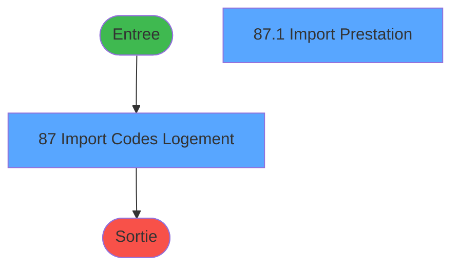
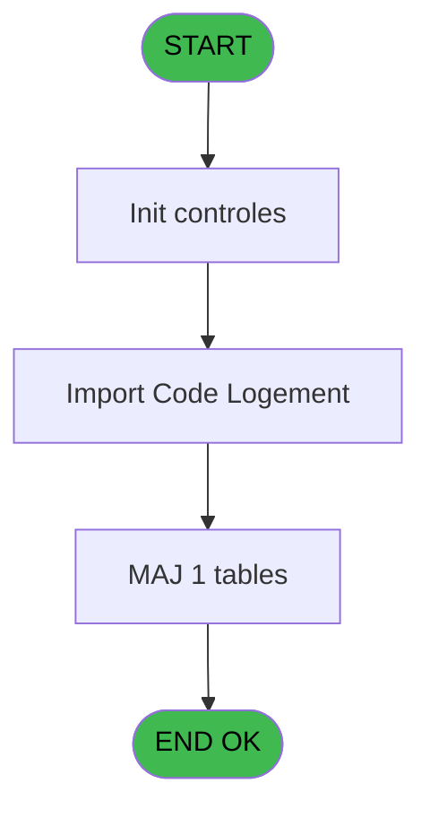

# PBS IDE 87 - Import Codes Logement

> **Analyse**: Phases 1-4 2026-02-03 17:30 -> 17:31 (14s) | Assemblage 17:31
> **Pipeline**: V7.2 Enrichi
> **Structure**: 4 onglets (Resume | Ecrans | Donnees | Connexions)

<!-- TAB:Resume -->

## 1. FICHE D'IDENTITE

| Attribut | Valeur |
|----------|--------|
| Projet | PBS |
| IDE Position | 87 |
| Nom Programme | Import Codes Logement |
| Fichier source | `Prg_87.xml` |
| Dossier IDE | Zoom |
| Taches | 2 (2 ecrans visibles) |
| Tables modifiees | 1 |
| Programmes appeles | 0 |
| :warning: Statut | **ORPHELIN_POTENTIEL** |

## 2. DESCRIPTION FONCTIONNELLE

**Import Codes Logement** assure la gestion complete de ce processus.

Le flux de traitement s'organise en **1 blocs fonctionnels** :

- **Traitement** (2 taches) : traitements metier divers

**Donnees modifiees** : 1 tables en ecriture (code_logement____clo).

## 3. BLOCS FONCTIONNELS

### 3.1 Traitement (2 taches)

Traitements internes.

---

#### 87 - Import Codes Logement [[ECRAN]](#ecran-t2)

**Role** : Traitement : Import Codes Logement.
**Ecran** : 674 x 62 DLU | [Voir mockup](#ecran-t2)

---

#### 87.1 - Import Prestation [[ECRAN]](#ecran-t9)

**Role** : Traitement : Import Prestation.
**Ecran** : 788 x 0 DLU | [Voir mockup](#ecran-t9)

## 5. REGLES METIER

*(Aucune regle metier identifiee)*

## 6. CONTEXTE

- **Appele par**: (aucun)
- **Appelle**: 0 programmes | **Tables**: 1 (W:1 R:0 L:0) | **Taches**: 2 | **Expressions**: 1

<!-- TAB:Ecrans -->

## 8. ECRANS

### 8.1 Forms visibles (2 / 2)

| # | Position | Tache | Nom | Type | Largeur | Hauteur | Bloc |
|---|----------|-------|-----|------|---------|---------|------|
| 1 | 87.1 | 87 | Import Codes Logement | Type0 | 674 | 62 | Traitement |
| 2 | 87.1.1 | 87.1 | Import Prestation | Type0 | 788 | 0 | Traitement |

### 8.2 Mockups Ecrans

---

#### 87.1 - Import Codes Logement
**Tache** : [87](#t2) | **Type** : Type0 | **Dimensions** : 674 x 62 DLU
**Bloc** : Traitement | **Titre IDE** : Import Codes Logement

<!-- FORM-DATA:
{
    "width":  674,
    "vFactor":  8,
    "type":  "Type0",
    "hFactor":  4,
    "controls":  [
                     {
                         "x":  0,
                         "type":  "label",
                         "var":  "",
                         "y":  16,
                         "w":  42,
                         "fmt":  "",
                         "name":  "",
                         "h":  9,
                         "color":  "",
                         "text":  "File name",
                         "parent":  null
                     },
                     {
                         "x":  52,
                         "type":  "edit",
                         "var":  "",
                         "y":  16,
                         "w":  596,
                         "fmt":  "",
                         "name":  "v.file name",
                         "h":  10,
                         "color":  "",
                         "text":  "",
                         "parent":  null
                     },
                     {
                         "x":  652,
                         "type":  "button",
                         "var":  "",
                         "y":  16,
                         "w":  20,
                         "fmt":  "...",
                         "name":  "",
                         "h":  10,
                         "color":  "",
                         "text":  "",
                         "parent":  null
                     },
                     {
                         "x":  307,
                         "type":  "button",
                         "var":  "",
                         "y":  40,
                         "w":  60,
                         "fmt":  "Importer",
                         "name":  "",
                         "h":  14,
                         "color":  "",
                         "text":  "",
                         "parent":  null
                     }
                 ],
    "taskId":  "87.1",
    "height":  62
}
-->

<strong>Champs : 1 champs</strong>

| Pos (x,y) | Nom | Variable | Type |
|-----------|-----|----------|------|
| 52,16 | v.file name | - | edit |

<strong>Boutons : 2 boutons</strong>

| Bouton | Pos (x,y) | Action |
|--------|-----------|--------|
| ... | 652,16 | Bouton fonctionnel |
| Importer | 307,40 | Bouton fonctionnel |

---

#### 87.1.1 - Import Prestation
**Tache** : [87.1](#t9) | **Type** : Type0 | **Dimensions** : 788 x 0 DLU
**Bloc** : Traitement | **Titre IDE** : Import Prestation

<!-- FORM-DATA:
{
    "width":  788,
    "vFactor":  8,
    "type":  "Type0",
    "hFactor":  4,
    "controls":  [
                     {
                         "x":  8,
                         "type":  "table",
                         "var":  "",
                         "name":  "",
                         "titleH":  12,
                         "color":  "",
                         "w":  776,
                         "y":  8,
                         "fmt":  "",
                         "parent":  null,
                         "text":  "",
                         "rowH":  13,
                         "h":  184,
                         "cols":  [
                                      {
                                          "title":  "clo_societe",
                                          "layer":  1,
                                          "w":  46
                                      },
                                      {
                                          "title":  "clo_code_lieu_sejour",
                                          "layer":  2,
                                          "w":  83
                                      },
                                      {
                                          "title":  "clo_code_logement",
                                          "layer":  3,
                                          "w":  78
                                      },
                                      {
                                          "title":  "clo_libelle",
                                          "layer":  4,
                                          "w":  458
                                      },
                                      {
                                          "title":  "clo_elligible_affec_auto",
                                          "layer":  5,
                                          "w":  92
                                      }
                                  ],
                         "rows":  5
                     },
                     {
                         "x":  12,
                         "type":  "edit",
                         "var":  "",
                         "y":  23,
                         "w":  9,
                         "fmt":  "",
                         "name":  "clo_societe",
                         "h":  10,
                         "color":  "",
                         "text":  "",
                         "parent":  8
                     },
                     {
                         "x":  58,
                         "type":  "edit",
                         "var":  "",
                         "y":  23,
                         "w":  9,
                         "fmt":  "",
                         "name":  "clo_code_lieu_sejour",
                         "h":  10,
                         "color":  "",
                         "text":  "",
                         "parent":  8
                     },
                     {
                         "x":  141,
                         "type":  "edit",
                         "var":  "",
                         "y":  23,
                         "w":  37,
                         "fmt":  "",
                         "name":  "clo_code_logement",
                         "h":  10,
                         "color":  "",
                         "text":  "",
                         "parent":  8
                     },
                     {
                         "x":  219,
                         "type":  "edit",
                         "var":  "",
                         "y":  23,
                         "w":  451,
                         "fmt":  "",
                         "name":  "clo_libelle",
                         "h":  10,
                         "color":  "",
                         "text":  "",
                         "parent":  8
                     },
                     {
                         "x":  677,
                         "type":  "edit",
                         "var":  "",
                         "y":  23,
                         "w":  9,
                         "fmt":  "",
                         "name":  "clo_elligible_affec_auto",
                         "h":  10,
                         "color":  "",
                         "text":  "",
                         "parent":  8
                     }
                 ],
    "taskId":  "87.1.1",
    "height":  0
}
-->

<strong>Champs : 5 champs</strong>

| Pos (x,y) | Nom | Variable | Type |
|-----------|-----|----------|------|
| 12,23 | clo_societe | - | edit |
| 58,23 | clo_code_lieu_sejour | - | edit |
| 141,23 | clo_code_logement | - | edit |
| 219,23 | clo_libelle | - | edit |
| 677,23 | clo_elligible_affec_auto | - | edit |

## 9. NAVIGATION

### 9.1 Enchainement des ecrans

**Detail par enchainement :**

| Depuis | Action | Vers | Retour |
|--------|--------|------|--------|

### 9.3 Structure hierarchique (2 taches)

| Position | Tache | Type | Dimensions | Bloc |
|----------|-------|------|------------|------|
| **87.1** | [**Import Codes Logement** (87)](#t2) [mockup](#ecran-t2) | - | 674x62 | Traitement |
| 87.1.1 | [Import Prestation (87.1)](#t9) [mockup](#ecran-t9) | - | 788x0 | |

### 9.4 Algorigramme

> **Legende**: Vert = START/END OK | Rouge = END KO | Bleu = Decisions
> *Algorigramme auto-genere. Utiliser `/algorigramme` pour une synthese metier detaillee.*

<!-- TAB:Donnees -->

## 10. TABLES

### Tables utilisees (1)

| ID | Nom | Description | Type | R | W | L | Usages |
|----|-----|-------------|------|---|---|---|--------|
| 108 | code_logement____clo |  | DB |   | **W** |   | 1 |

### Colonnes par table (0 / 1 tables avec colonnes identifiees)

Table 108 - code_logement____clo (**W**) - 1 usages

*Table utilisee uniquement en Link ou aucune colonne Real identifiee dans le DataView.*

## 11. VARIABLES

*(Programme sans variables locales mappees)*

## 12. EXPRESSIONS

**1 / 1 expressions decodees (100%)**

### 12.1 Repartition par type

| Type | Expressions | Regles |
|------|-------------|--------|
| CALCULATION | 1 | 0 |

### 12.2 Expressions cles par type

#### CALCULATION (1 expressions)

| Type | IDE | Expression | Regle |
|------|-----|------------|-------|
| CALCULATION | 1 | `FileDlg('Import Files','*.csv')` | - |

<!-- TAB:Connexions -->

## 13. GRAPHE D'APPELS

### 13.1 Chaine depuis Main (Callers)

**Chemin**: (pas de callers directs)

### 13.2 Callers

| IDE | Nom Programme | Nb Appels |
|-----|---------------|-----------|
| - | (aucun) | - |

### 13.3 Callees (programmes appeles)

### 13.4 Detail Callees avec contexte

| IDE | Nom Programme | Appels | Contexte |
|-----|---------------|--------|----------|
| - | (aucun) | - | - |

## 14. RECOMMANDATIONS MIGRATION

### 14.1 Profil du programme

| Metrique | Valeur | Impact migration |
|----------|--------|-----------------|
| Lignes de logique | 14 | Programme compact |
| Expressions | 1 | Peu de logique |
| Tables WRITE | 1 | Impact faible |
| Sous-programmes | 0 | Peu de dependances |
| Ecrans visibles | 2 | Quelques ecrans |
| Code desactive | 0% (0 / 14) | Code sain |
| Regles metier | 0 | Pas de regle identifiee |

### 14.2 Plan de migration par bloc

#### Traitement (2 taches: 2 ecrans, 0 traitement)

- **Strategie** : 2 composant(s) UI (Razor/React) avec formulaires et validation.
- Decomposer les taches en services unitaires testables.

### 14.3 Dependances critiques

| Dependance | Type | Appels | Impact |
|------------|------|--------|--------|
| code_logement____clo | Table WRITE (Database) | 1x | Schema + repository |

---
*Spec DETAILED generee par Pipeline V7.2 - 2026-02-03 17:31*
