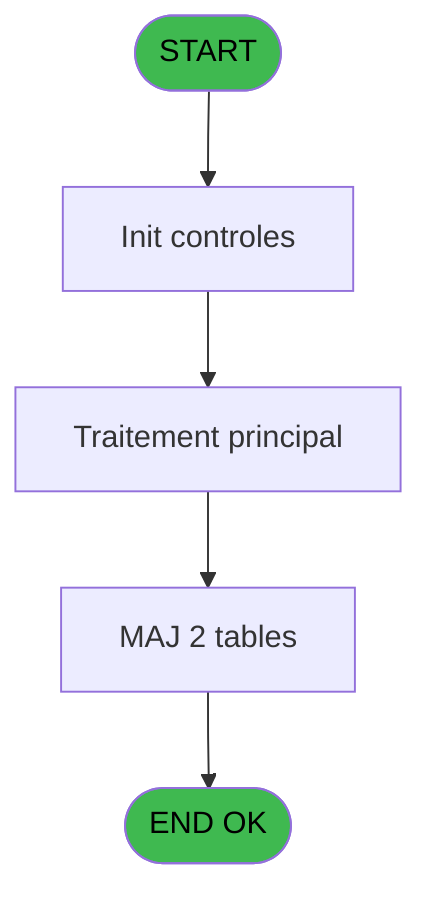
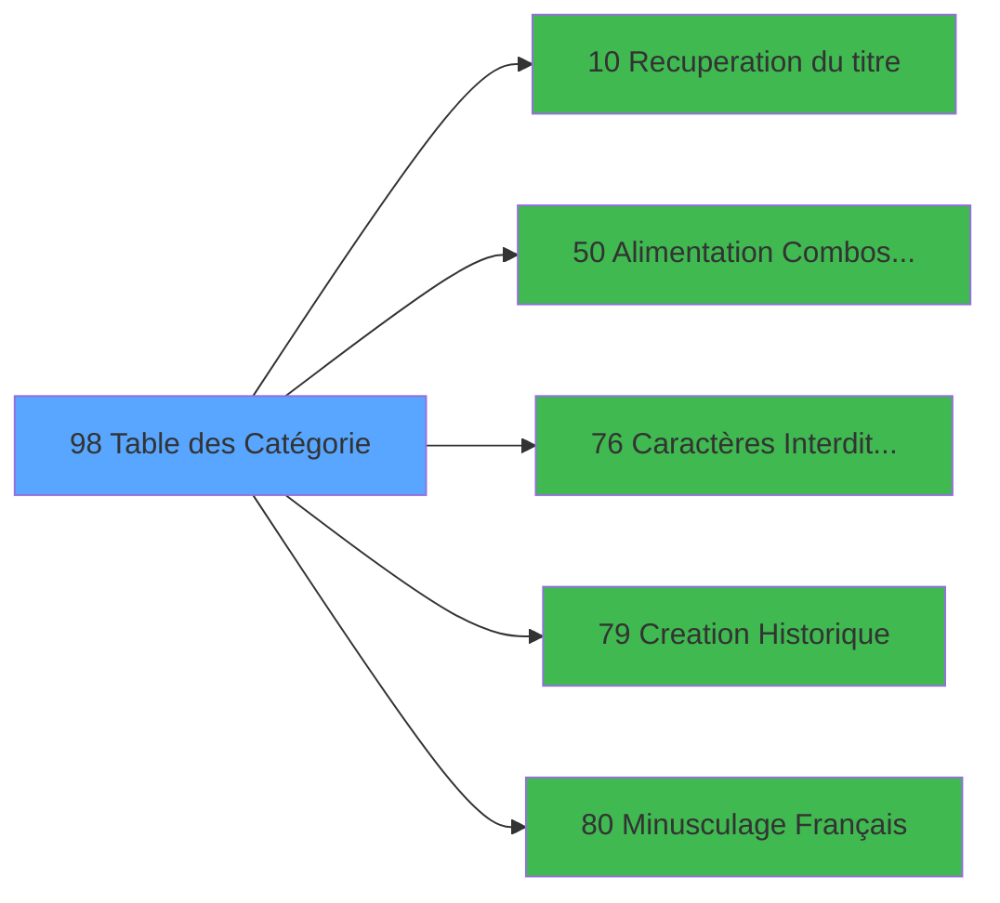

# PBS IDE 98 - Table des Catégorie

> **Analyse**: Phases 1-4 2026-02-03 17:34 -> 17:34 (12s) | Assemblage 17:34
> **Pipeline**: V7.2 Enrichi
> **Structure**: 4 onglets (Resume | Ecrans | Donnees | Connexions)

<!-- TAB:Resume -->

## 1. FICHE D'IDENTITE

| Attribut | Valeur |
|----------|--------|
| Projet | PBS |
| IDE Position | 98 |
| Nom Programme | Table des Catégorie |
| Fichier source | `Prg_98.xml` |
| Dossier IDE | Suppr |
| Taches | 3 (1 ecrans visibles) |
| Tables modifiees | 2 |
| Programmes appeles | 5 |
| :warning: Statut | **ORPHELIN_POTENTIEL** |

## 2. DESCRIPTION FONCTIONNELLE

**Table des Catégorie** assure la gestion complete de ce processus.

Le flux de traitement s'organise en **2 blocs fonctionnels** :

- **Traitement** (2 taches) : traitements metier divers
- **Initialisation** (1 tache) : reinitialisation d'etats et de variables de travail

**Donnees modifiees** : 2 tables en ecriture (tables_paris, tables_village).

**Logique metier** : 2 regles identifiees couvrant conditions metier.

Detail : phases du traitement

#### Phase 1 : Traitement (2 taches)

- **98** - Êcran **[[ECRAN]](#ecran-t1)**
- **98.1** - Mise à Jour Combo

Delegue a : [Recuperation du titre (IDE 10)](PBS-IDE-10.md), [  Alimentation Combos VILLAGE (IDE 50)](PBS-IDE-50.md), [Caractères Interdits (A6) (IDE 76)](PBS-IDE-76.md), [Minusculage Français (IDE 80)](PBS-IDE-80.md)

#### Phase 2 : Initialisation (1 tache)

- **98.2** - RAZ Catégorie inactive

#### Tables impactees

| Table | Operations | Role metier |
|-------|-----------|-------------|
| tables_village | **W**/L (2 usages) |  |
| tables_paris | **W** (1 usages) |  |

## 3. BLOCS FONCTIONNELS

### 3.1 Traitement (2 taches)

Traitements internes.

---

#### 98 - Êcran [[ECRAN]](#ecran-t1)

**Role** : Traitement : Êcran.
**Ecran** : 851 x 252 DLU (MDI) | [Voir mockup](#ecran-t1)
**Delegue a** : [Recuperation du titre (IDE 10)](PBS-IDE-10.md), [  Alimentation Combos VILLAGE (IDE 50)](PBS-IDE-50.md), [Caractères Interdits (A6) (IDE 76)](PBS-IDE-76.md)

---

#### 98.1 - Mise à Jour Combo

**Role** : Traitement : Mise à Jour Combo.
**Delegue a** : [Recuperation du titre (IDE 10)](PBS-IDE-10.md), [  Alimentation Combos VILLAGE (IDE 50)](PBS-IDE-50.md), [Caractères Interdits (A6) (IDE 76)](PBS-IDE-76.md)

### 3.2 Initialisation (1 tache)

Reinitialisation d'etats et variables de travail.

---

#### 98.2 - RAZ Catégorie inactive

**Role** : Reinitialisation : RAZ Catégorie inactive.
**Variables liees** : C (v.Catégorie active)

## 5. REGLES METIER

2 regles identifiees:

### Autres (2 regles)

#### [RM-001] Si Stat (0 alors 'C'MODE) sinon 'CCATEG',IF (Stat (0,'M'MODE),'MCATEG','ACATEG'))

| Element | Detail |
|---------|--------|
| **Condition** | `Stat (0` |
| **Si vrai** | 'C'MODE) |
| **Si faux** | 'CCATEG',IF (Stat (0,'M'MODE),'MCATEG','ACATEG')) |
| **Expression source** | Expression 2 : `IF (Stat (0,'C'MODE),'CCATEG',IF (Stat (0,'M'MODE),'MCATEG',` |
| **Exemple** | Si Stat (0 → 'C'MODE). Sinon → 'CCATEG',IF (Stat (0,'M'MODE),'MCATEG','ACATEG')) |

#### [RM-002] Si [AC] alors 0 sinon 1)

| Element | Detail |
|---------|--------|
| **Condition** | `[AC]` |
| **Si vrai** | 0 |
| **Si faux** | 1) |
| **Expression source** | Expression 20 : `IF([AC],0,1)` |
| **Exemple** | Si [AC] → 0. Sinon → 1) |

## 6. CONTEXTE

- **Appele par**: (aucun)
- **Appelle**: 5 programmes | **Tables**: 2 (W:2 R:0 L:1) | **Taches**: 3 | **Expressions**: 20

<!-- TAB:Ecrans -->

## 8. ECRANS

### 8.1 Forms visibles (1 / 3)

| # | Position | Tache | Nom | Type | Largeur | Hauteur | Bloc |
|---|----------|-------|-----|------|---------|---------|------|
| 1 | 98 | 98 | Êcran | MDI | 851 | 252 | Traitement |

### 8.2 Mockups Ecrans

---

#### 98 - Êcran
**Tache** : [98](#t1) | **Type** : MDI | **Dimensions** : 851 x 252 DLU
**Bloc** : Traitement | **Titre IDE** : Êcran

<!-- FORM-DATA:
{
    "width":  851,
    "vFactor":  8,
    "type":  "MDI",
    "hFactor":  8,
    "controls":  [
                     {
                         "x":  0,
                         "type":  "label",
                         "var":  "",
                         "y":  1,
                         "w":  846,
                         "fmt":  "",
                         "name":  "",
                         "h":  20,
                         "color":  "",
                         "text":  "",
                         "parent":  null
                     },
                     {
                         "x":  26,
                         "type":  "table",
                         "var":  "",
                         "name":  "",
                         "titleH":  12,
                         "color":  "110",
                         "w":  578,
                         "y":  32,
                         "fmt":  "",
                         "parent":  null,
                         "text":  "",
                         "rowH":  12,
                         "h":  180,
                         "cols":  [
                                      {
                                          "title":  "Code",
                                          "layer":  1,
                                          "w":  135
                                      },
                                      {
                                          "title":  "Libellé",
                                          "layer":  2,
                                          "w":  325
                                      },
                                      {
                                          "title":  "Actif",
                                          "layer":  3,
                                          "w":  84
                                      }
                                  ],
                         "rows":  3
                     },
                     {
                         "x":  640,
                         "type":  "label",
                         "var":  "",
                         "y":  95,
                         "w":  178,
                         "fmt":  "",
                         "name":  "",
                         "h":  116,
                         "color":  "",
                         "text":  "",
                         "parent":  null
                     },
                     {
                         "x":  1,
                         "type":  "label",
                         "var":  "",
                         "y":  225,
                         "w":  846,
                         "fmt":  "",
                         "name":  "",
                         "h":  24,
                         "color":  "",
                         "text":  "",
                         "parent":  null
                     },
                     {
                         "x":  83,
                         "type":  "edit",
                         "var":  "",
                         "y":  47,
                         "w":  30,
                         "fmt":  "UA",
                         "name":  "CODE ALPHA6",
                         "h":  9,
                         "color":  "110",
                         "text":  "",
                         "parent":  4
                     },
                     {
                         "x":  178,
                         "type":  "edit",
                         "var":  "",
                         "y":  47,
                         "w":  299,
                         "fmt":  "",
                         "name":  "Libelle",
                         "h":  9,
                         "color":  "110",
                         "text":  "",
                         "parent":  4
                     },
                     {
                         "x":  6,
                         "type":  "edit",
                         "var":  "",
                         "y":  7,
                         "w":  396,
                         "fmt":  "30",
                         "name":  "",
                         "h":  8,
                         "color":  "",
                         "text":  "",
                         "parent":  1
                     },
                     {
                         "x":  637,
                         "type":  "edit",
                         "var":  "",
                         "y":  7,
                         "w":  203,
                         "fmt":  "WWW DD MMM YYYYT",
                         "name":  "",
                         "h":  8,
                         "color":  "",
                         "text":  "",
                         "parent":  1
                     },
                     {
                         "x":  642,
                         "type":  "image",
                         "var":  "",
                         "y":  36,
                         "w":  170,
                         "fmt":  "",
                         "name":  "",
                         "h":  59,
                         "color":  "",
                         "text":  "",
                         "parent":  null
                     },
                     {
                         "x":  652,
                         "type":  "button",
                         "var":  "",
                         "y":  100,
                         "w":  154,
                         "fmt":  "\u0026Visualisation",
                         "name":  "",
                         "h":  18,
                         "color":  "",
                         "text":  "",
                         "parent":  null
                     },
                     {
                         "x":  652,
                         "type":  "button",
                         "var":  "",
                         "y":  122,
                         "w":  154,
                         "fmt":  "\u0026Modification",
                         "name":  "",
                         "h":  18,
                         "color":  "",
                         "text":  "",
                         "parent":  null
                     },
                     {
                         "x":  652,
                         "type":  "button",
                         "var":  "",
                         "y":  144,
                         "w":  154,
                         "fmt":  "\u0026Creation",
                         "name":  "Création",
                         "h":  18,
                         "color":  "",
                         "text":  "",
                         "parent":  null
                     },
                     {
                         "x":  652,
                         "type":  "button",
                         "var":  "",
                         "y":  166,
                         "w":  154,
                         "fmt":  "\u0026Annulation",
                         "name":  "",
                         "h":  18,
                         "color":  "",
                         "text":  "",
                         "parent":  null
                     },
                     {
                         "x":  652,
                         "type":  "button",
                         "var":  "",
                         "y":  188,
                         "w":  154,
                         "fmt":  "\u0026Suppression",
                         "name":  "",
                         "h":  18,
                         "color":  "",
                         "text":  "",
                         "parent":  null
                     },
                     {
                         "x":  516,
                         "type":  "checkbox",
                         "var":  "",
                         "y":  47,
                         "w":  32,
                         "fmt":  "",
                         "name":  "Actif",
                         "h":  9,
                         "color":  "110",
                         "text":  "",
                         "parent":  4
                     },
                     {
                         "x":  8,
                         "type":  "button",
                         "var":  "",
                         "y":  230,
                         "w":  154,
                         "fmt":  "\u0026Quitter",
                         "name":  "",
                         "h":  18,
                         "color":  "",
                         "text":  "",
                         "parent":  null
                     },
                     {
                         "x":  648,
                         "type":  "edit",
                         "var":  "",
                         "y":  26,
                         "w":  18,
                         "fmt":  "30",
                         "name":  "P.I. Société",
                         "h":  10,
                         "color":  "",
                         "text":  "",
                         "parent":  null
                     }
                 ],
    "taskId":  "98",
    "height":  252
}
-->

<strong>Champs : 6 champs</strong>

| Pos (x,y) | Nom | Variable | Type |
|-----------|-----|----------|------|
| 83,47 | CODE ALPHA6 | - | edit |
| 178,47 | Libelle | - | edit |
| 6,7 | 30 | - | edit |
| 637,7 | WWW DD MMM YYYYT | - | edit |
| 516,47 | Actif | - | checkbox |
| 648,26 | P.I. Société | - | edit |

<strong>Boutons : 6 boutons</strong>

| Bouton | Pos (x,y) | Action |
|--------|-----------|--------|
| Visualisation | 652,100 | Bouton fonctionnel |
| Modification | 652,122 | Modifie l'element |
| Creation | 652,144 | Appel [Creation Historique (IDE 79)](PBS-IDE-79.md) |
| Annulation | 652,166 | Annule et retour au menu |
| Suppression | 652,188 | Supprime l'element selectionne |
| Quitter | 8,230 | Quitte le programme |

## 9. NAVIGATION

Ecran unique: **Êcran**

### 9.3 Structure hierarchique (3 taches)

| Position | Tache | Type | Dimensions | Bloc |
|----------|-------|------|------------|------|
| **98.1** | [**Êcran** (98)](#t1) [mockup](#ecran-t1) | MDI | 851x252 | Traitement |
| 98.1.1 | [Mise à Jour Combo (98.1)](#t2) | MDI | - | |
| **98.2** | [**RAZ Catégorie inactive** (98.2)](#t3) | - | - | Initialisation |

### 9.4 Algorigramme

> **Legende**: Vert = START/END OK | Rouge = END KO | Bleu = Decisions
> *Algorigramme auto-genere. Utiliser `/algorigramme` pour une synthese metier detaillee.*

<!-- TAB:Donnees -->

## 10. TABLES

### Tables utilisees (2)

| ID | Nom | Description | Type | R | W | L | Usages |
|----|-----|-------------|------|---|---|---|--------|
| 112 | tables_paris |  | DB |   | **W** |   | 1 |
| 113 | tables_village |  | DB |   | **W** | L | 2 |

### Colonnes par table (1 / 2 tables avec colonnes identifiees)

Table 112 - tables_paris (**W**) - 1 usages

| Lettre | Variable | Acces | Type |
|--------|----------|-------|------|
| A | v. titre | W | Alpha |
| B | v.contrôle | W | Logical |
| C | v.Catégorie active | W | Logical |

Table 113 - tables_village (**W**/L) - 2 usages

*Table utilisee uniquement en Link ou aucune colonne Real identifiee dans le DataView.*

## 11. VARIABLES

### 11.1 Variables de session (3)

Variables persistantes pendant toute la session.

| Lettre | Nom | Type | Usage dans |
|--------|-----|------|-----------|
| A | v. titre | Alpha | - |
| B | v.contrôle | Logical | 1x session |
| C | v.Catégorie active | Logical | - |

## 12. EXPRESSIONS

**20 / 20 expressions decodees (100%)**

### 12.1 Repartition par type

| Type | Expressions | Regles |
|------|-------------|--------|
| CONDITION | 4 | 2 |
| CONSTANTE | 3 | 0 |
| DATE | 1 | 0 |
| NEGATION | 3 | 0 |
| OTHER | 7 | 0 |
| REFERENCE_VG | 1 | 0 |
| STRING | 1 | 0 |

### 12.2 Expressions cles par type

#### CONDITION (4 expressions)

| Type | IDE | Expression | Regle |
|------|-----|------------|-------|
| CONDITION | 20 | `IF([AC],0,1)` | [RM-002](#rm-RM-002) |
| CONDITION | 2 | `IF (Stat (0,'C'MODE),'CCATEG',IF (Stat (0,'M'MODE),'MCATEG','ACATEG'))` | [RM-001](#rm-RM-001) |
| CONDITION | 18 | `[AI]=0` | - |
| CONDITION | 14 | `[I]<>''` | - |

#### CONSTANTE (3 expressions)

| Type | IDE | Expression | Regle |
|------|-----|------------|-------|
| CONSTANTE | 9 | `261` | - |
| CONSTANTE | 6 | `'F'` | - |
| CONSTANTE | 5 | `'VLOGE'` | - |

#### DATE (1 expressions)

| Type | IDE | Expression | Regle |
|------|-----|------------|-------|
| DATE | 8 | `Date ()` | - |

#### NEGATION (3 expressions)

| Type | IDE | Expression | Regle |
|------|-----|------------|-------|
| NEGATION | 12 | `NOT (Stat (0,'E'MODE))` | - |
| NEGATION | 3 | `NOT ([D])` | - |
| NEGATION | 1 | `NOT (Stat (0,'E'MODE))` | - |

#### OTHER (7 expressions)

| Type | IDE | Expression | Regle |
|------|-----|------------|-------|
| OTHER | 16 | `GetParam('SOCIETE')` | - |
| OTHER | 17 | `[H]` | - |
| OTHER | 19 | `[I]` | - |
| OTHER | 15 | `ExpCalc('4'EXP)` | - |
| OTHER | 4 | `Stat (0,'C'MODE)` | - |
| ... | | *+2 autres* | |

#### REFERENCE_VG (1 expressions)

| Type | IDE | Expression | Regle |
|------|-----|------------|-------|
| REFERENCE_VG | 13 | `VG3` | - |

#### STRING (1 expressions)

| Type | IDE | Expression | Regle |
|------|-----|------------|-------|
| STRING | 7 | `Trim (v.contrôle [B])` | - |

<!-- TAB:Connexions -->

## 13. GRAPHE D'APPELS

### 13.1 Chaine depuis Main (Callers)

**Chemin**: (pas de callers directs)

### 13.2 Callers

| IDE | Nom Programme | Nb Appels |
|-----|---------------|-----------|
| - | (aucun) | - |

### 13.3 Callees (programmes appeles)

### 13.4 Detail Callees avec contexte

| IDE | Nom Programme | Appels | Contexte |
|-----|---------------|--------|----------|
| [10](PBS-IDE-10.md) | Recuperation du titre | 1 | Recuperation donnees |
| [50](PBS-IDE-50.md) |   Alimentation Combos VILLAGE | 1 | Sous-programme |
| [76](PBS-IDE-76.md) | Caractères Interdits (A6) | 1 | Validation saisie |
| [79](PBS-IDE-79.md) | Creation Historique | 1 | Historique/consultation |
| [80](PBS-IDE-80.md) | Minusculage Français | 1 | Sous-programme |

## 14. RECOMMANDATIONS MIGRATION

### 14.1 Profil du programme

| Metrique | Valeur | Impact migration |
|----------|--------|-----------------|
| Lignes de logique | 42 | Programme compact |
| Expressions | 20 | Peu de logique |
| Tables WRITE | 2 | Impact faible |
| Sous-programmes | 5 | Peu de dependances |
| Ecrans visibles | 1 | Ecran unique ou traitement batch |
| Code desactive | 0% (0 / 42) | Code sain |
| Regles metier | 2 | Quelques regles a preserver |

### 14.2 Plan de migration par bloc

#### Traitement (2 taches: 1 ecran, 1 traitement)

- **Strategie** : Orchestrateur avec 1 ecrans (Razor/React) et 1 traitements backend (services).
- Les ecrans deviennent des composants UI, les traitements invisibles deviennent des services injectables.
- 5 sous-programme(s) a migrer ou a reutiliser depuis les services existants.
- Decomposer les taches en services unitaires testables.

#### Initialisation (1 tache: 0 ecran, 1 traitement)

- **Strategie** : Constructeur/methode `InitAsync()` dans l'orchestrateur.

### 14.3 Dependances critiques

| Dependance | Type | Appels | Impact |
|------------|------|--------|--------|
| tables_paris | Table WRITE (Database) | 1x | Schema + repository |
| tables_village | Table WRITE (Database) | 1x | Schema + repository |
| [Creation Historique (IDE 79)](PBS-IDE-79.md) | Sous-programme | 1x | Normale - Historique/consultation |
| [Minusculage Français (IDE 80)](PBS-IDE-80.md) | Sous-programme | 1x | Normale - Sous-programme |
| [Caractères Interdits (A6) (IDE 76)](PBS-IDE-76.md) | Sous-programme | 1x | Normale - Validation saisie |
| [Recuperation du titre (IDE 10)](PBS-IDE-10.md) | Sous-programme | 1x | Normale - Recuperation donnees |
| [  Alimentation Combos VILLAGE (IDE 50)](PBS-IDE-50.md) | Sous-programme | 1x | Normale - Sous-programme |

---
*Spec DETAILED generee par Pipeline V7.2 - 2026-02-03 17:34*
