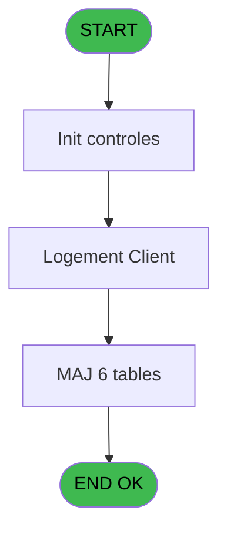
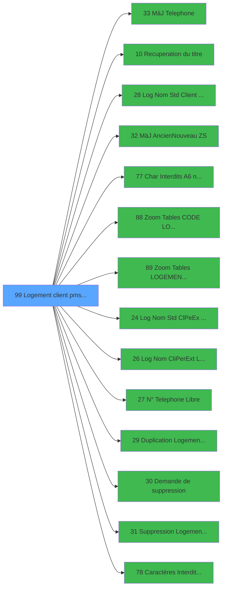

# PBS IDE 99 - Logement client pms-626

> **Analyse**: Phases 1-4 2026-02-03 17:35 -> 17:35 (11s) | Assemblage 17:35
> **Pipeline**: V7.2 Enrichi
> **Structure**: 4 onglets (Resume | Ecrans | Donnees | Connexions)

<!-- TAB:Resume -->

## 1. FICHE D'IDENTITE

| Attribut | Valeur |
|----------|--------|
| Projet | PBS |
| IDE Position | 99 |
| Nom Programme | Logement client pms-626 |
| Fichier source | `Prg_99.xml` |
| Dossier IDE | General |
| Taches | 33 (7 ecrans visibles) |
| Tables modifiees | 6 |
| Programmes appeles | 14 |
| :warning: Statut | **ORPHELIN_POTENTIEL** |

## 2. DESCRIPTION FONCTIONNELLE

**Logement client pms-626** assure la gestion complete de ce processus.

Le flux de traitement s'organise en **5 blocs fonctionnels** :

- **Traitement** (24 taches) : traitements metier divers
- **Calcul** (4 taches) : calculs de montants, stocks ou compteurs
- **Consultation** (2 taches) : ecrans de recherche, selection et consultation
- **Creation** (2 taches) : insertion d'enregistrements en base (mouvements, prestations)
- **Validation** (1 tache) : controles et verifications de coherence

**Donnees modifiees** : 6 tables en ecriture (logement_client__loc, logement_complement, table_utilisateurs, tables_paris, tables_village, Table_1030).

Detail : phases du traitement

#### Phase 1 : Traitement (24 taches)

- **99** - Logement client pms-626 **[[ECRAN]](#ecran-t1)**
- **99.4** - Ecran avec chambres pickables **[[ECRAN]](#ecran-t5)**
- **99.4.1** - Lire fichier coord GPS
- **99.4.1.1** - Mise à jour
- **99.4.2** - Communicante **[[ECRAN]](#ecran-t8)**
- **99.4.2.2** - MaJ Logemt lie **[[ECRAN]](#ecran-t10)**
- **99.4.2.3** - Suppr. Communiqu.
- **99.4.2.3.1** - Suppr. Liens
- **99.4.4** - MàJ Table VILLAGE
- **99.4.5** - Proximite **[[ECRAN]](#ecran-t16)**
- **99.4.5.1** - Suppr. Proximite
- **99.4.5.1.1** - Suppr. Liens
- **99.4.7** - Photos Logement **[[ECRAN]](#ecran-t21)**
- **99.4.7.1** - Compression photo
- **99.4.8** - Equipement. Couchage **[[ECRAN]](#ecran-t23)**
- **99.4.9** - Check équipement
- **99.5** - Récup Combo catégorie
- **99.4.8.1** - Récup Lit /Largeur
- **99.4.10** - Recup Unité
- **99.4.8.2** - Maj param Unit
- **99.6** - Récup service proximité
- **99.4.11** - Check Lit Zip
- **99.4.12** - Commentaire Qualité **[[ECRAN]](#ecran-t32)**
- **99.4.13** - Recup Photos

Delegue a : [MàJ Telephone (IDE 33)](PBS-IDE-33.md), [Recuperation du titre (IDE 10)](PBS-IDE-10.md), [ Log Nom Std (Client) Existe ? (IDE 28)](PBS-IDE-28.md), [MàJ Ancien/Nouveau (ZS) (IDE 32)](PBS-IDE-32.md), [Char Interdits (A6) no space (IDE 77)](PBS-IDE-77.md), [ Log Nom Std (Cl/Pe/Ex) Libre? (IDE 24)](PBS-IDE-24.md), [ Log Nom (Cli/Per/Ext) Libre ? (IDE 26)](PBS-IDE-26.md), [ N° Telephone Libre ? (IDE 27)](PBS-IDE-27.md), [ Duplication Logement Client (IDE 29)](PBS-IDE-29.md), [ Demande de suppression (IDE 30)](PBS-IDE-30.md), [ Suppression Logement Client (IDE 31)](PBS-IDE-31.md), [Caractères Interdits (TEL) (IDE 78)](PBS-IDE-78.md)

#### Phase 2 : Calcul (4 taches)

- **99.1** - Calcul Combo Code Logement
- **99.2** - Calcul Combo Etage **[[ECRAN]](#ecran-t3)**
- **99.3** - Calcul Combo Zone
- **99.7** - Calcul Combo Zone

#### Phase 3 : Creation (2 taches)

- **99.4.2.1** - Creation Lien **[[ECRAN]](#ecran-t9)**
- **99.4.5.2** - Creation Lien **[[ECRAN]](#ecran-t19)**

#### Phase 4 : Validation (1 tache)

- **99.4.2.3.2** - Verif si Vide

Delegue a : [Char Interdits (A6) no space (IDE 77)](PBS-IDE-77.md), [Caractères Interdits (TEL) (IDE 78)](PBS-IDE-78.md)

#### Phase 5 : Consultation (2 taches)

- **99.4.3** - Rechercher **[[ECRAN]](#ecran-t14)**
- **99.4.6** - Update Pickable Selection

Delegue a : [Recuperation du titre (IDE 10)](PBS-IDE-10.md), [Zoom Tables CODE LOGEMENT (IDE 88)](PBS-IDE-88.md), [Zoom Tables LOGEMENT CLIENT (IDE 89)](PBS-IDE-89.md)

#### Tables impactees

| Table | Operations | Role metier |
|-------|-----------|-------------|
| logement_complement | **W**/L (10 usages) |  |
| logement_client__loc | **W** (5 usages) |  |
| Table_1030 | R/**W**/L (4 usages) |  |
| tables_village | **W**/L (3 usages) |  |
| tables_paris | R/**W**/L (3 usages) |  |
| table_utilisateurs | **W** (2 usages) |  |

## 3. BLOCS FONCTIONNELS

### 3.1 Traitement (24 taches)

Traitements internes.

---

#### 99 - Logement client pms-626 [[ECRAN]](#ecran-t1)

**Role** : Tache d'orchestration : point d'entree du programme (24 sous-taches). Coordonne l'enchainement des traitements.
**Ecran** : 83 x 0 DLU (MDI) | [Voir mockup](#ecran-t1)

23 sous-taches directes

| Tache | Nom | Bloc |
|-------|-----|------|
| [99.4](#t5) | Ecran avec chambres pickables **[[ECRAN]](#ecran-t5)** | Traitement |
| [99.4.1](#t6) | Lire fichier coord GPS | Traitement |
| [99.4.1.1](#t7) | Mise à jour | Traitement |
| [99.4.2](#t8) | Communicante **[[ECRAN]](#ecran-t8)** | Traitement |
| [99.4.2.2](#t10) | MaJ Logemt lie **[[ECRAN]](#ecran-t10)** | Traitement |
| [99.4.2.3](#t11) | Suppr. Communiqu. | Traitement |
| [99.4.2.3.1](#t12) | Suppr. Liens | Traitement |
| [99.4.4](#t15) | MàJ Table VILLAGE | Traitement |
| [99.4.5](#t16) | Proximite **[[ECRAN]](#ecran-t16)** | Traitement |
| [99.4.5.1](#t17) | Suppr. Proximite | Traitement |
| [99.4.5.1.1](#t18) | Suppr. Liens | Traitement |
| [99.4.7](#t21) | Photos Logement **[[ECRAN]](#ecran-t21)** | Traitement |
| [99.4.7.1](#t22) | Compression photo | Traitement |
| [99.4.8](#t23) | Equipement. Couchage **[[ECRAN]](#ecran-t23)** | Traitement |
| [99.4.9](#t24) | Check équipement | Traitement |
| [99.5](#t25) | Récup Combo catégorie | Traitement |
| [99.4.8.1](#t26) | Récup Lit /Largeur | Traitement |
| [99.4.10](#t27) | Recup Unité | Traitement |
| [99.4.8.2](#t28) | Maj param Unit | Traitement |
| [99.6](#t30) | Récup service proximité | Traitement |
| [99.4.11](#t31) | Check Lit Zip | Traitement |
| [99.4.12](#t32) | Commentaire Qualité **[[ECRAN]](#ecran-t32)** | Traitement |
| [99.4.13](#t36) | Recup Photos | Traitement |

**Variables liees** : E (v.search combo code logement), S (v.logement communicant), V (v. zoom code logement), W (v.Ancien Logement), BO (CHG_REASON_loc_code_logement_u)

---

#### 99.4 - Ecran avec chambres pickables [[ECRAN]](#ecran-t5)

**Role** : Traitement : Ecran avec chambres pickables.
**Ecran** : 1732 x 388 DLU (MDI) | [Voir mockup](#ecran-t5)

---

#### 99.4.1 - Lire fichier coord GPS

**Role** : Traitement : Lire fichier coord GPS.

---

#### 99.4.1.1 - Mise à jour

**Role** : Traitement : Mise à jour.

---

#### 99.4.2 - Communicante [[ECRAN]](#ecran-t8)

**Role** : Traitement : Communicante.
**Ecran** : 164 x 92 DLU (Modal) | [Voir mockup](#ecran-t8)

---

#### 99.4.2.2 - MaJ Logemt lie [[ECRAN]](#ecran-t10)

**Role** : Traitement : MaJ Logemt lie.
**Ecran** : 158 x 75 DLU (MDI) | [Voir mockup](#ecran-t10)

---

#### 99.4.2.3 - Suppr. Communiqu.

**Role** : Traitement : Suppr. Communiqu..

---

#### 99.4.2.3.1 - Suppr. Liens

**Role** : Traitement : Suppr. Liens.

---

#### 99.4.4 - MàJ Table VILLAGE

**Role** : Traitement : MàJ Table VILLAGE.

---

#### 99.4.5 - Proximite [[ECRAN]](#ecran-t16)

**Role** : Traitement : Proximite.
**Ecran** : 175 x 94 DLU (Modal) | [Voir mockup](#ecran-t16)

---

#### 99.4.5.1 - Suppr. Proximite

**Role** : Traitement : Suppr. Proximite.

---

#### 99.4.5.1.1 - Suppr. Liens

**Role** : Traitement : Suppr. Liens.

---

#### 99.4.7 - Photos Logement [[ECRAN]](#ecran-t21)

**Role** : Traitement : Photos Logement.
**Ecran** : 1479 x 238 DLU | [Voir mockup](#ecran-t21)
**Variables liees** : E (v.search combo code logement), S (v.logement communicant), V (v. zoom code logement), W (v.Ancien Logement), BO (CHG_REASON_loc_code_logement_u)

---

#### 99.4.7.1 - Compression photo

**Role** : Traitement : Compression photo.
**Variables liees** : BN (v.Flag Maj photo), BG (loc_photo_chambre), BH (loc_photo_vue)

---

#### 99.4.8 - Equipement. Couchage [[ECRAN]](#ecran-t23)

**Role** : Traitement : Equipement. Couchage.
**Ecran** : 594 x 110 DLU | [Voir mockup](#ecran-t23)

---

#### 99.4.9 - Check équipement

**Role** : Traitement : Check équipement.
**Variables liees** : K (v.Flag verif équipement)

---

#### 99.5 - Récup Combo catégorie

**Role** : Traitement : Récup Combo catégorie.
**Variables liees** : E (v.search combo code logement), F (v.search combo etage), G (v.search combo zone), H (v.search combo secteur), I (v.Combo catégorie valeur)

---

#### 99.4.8.1 - Récup Lit /Largeur

**Role** : Traitement : Récup Lit /Largeur.

---

#### 99.4.10 - Recup Unité

**Role** : Consultation/chargement : Recup Unité.
**Variables liees** : BK (v.Unité lit cm,inch)

---

#### 99.4.8.2 - Maj param Unit

**Role** : Traitement : Maj param Unit.
**Variables liees** : T (v.Confirmation maj log.unit), BE (v.Type de lit paramétré ?), BK (v.Unité lit cm,inch), BP (CHG_PRV_loc_code_logement_unit)

---

#### 99.6 - Récup service proximité

**Role** : Traitement : Récup service proximité.

---

#### 99.4.11 - Check Lit Zip

**Role** : Traitement : Check Lit Zip.

---

#### 99.4.12 - Commentaire Qualité [[ECRAN]](#ecran-t32)

**Role** : Traitement : Commentaire Qualité.
**Ecran** : 574 x 218 DLU | [Voir mockup](#ecran-t32)

---

#### 99.4.13 - Recup Photos

**Role** : Consultation/chargement : Recup Photos.

### 3.2 Calcul (4 taches)

Calculs metier : montants, stocks, compteurs.

---

#### 99.1 - Calcul Combo Code Logement

**Role** : Calcul : Calcul Combo Code Logement.
**Variables liees** : B (v. code nom standard), E (v.search combo code logement), F (v.search combo etage), G (v.search combo zone), H (v.search combo secteur)

---

#### 99.2 - Calcul Combo Etage [[ECRAN]](#ecran-t3)

**Role** : Calcul : Calcul Combo Etage.
**Ecran** : 283 x 195 DLU | [Voir mockup](#ecran-t3)
**Variables liees** : E (v.search combo code logement), F (v.search combo etage), G (v.search combo zone), H (v.search combo secteur), I (v.Combo catégorie valeur)

---

#### 99.3 - Calcul Combo Zone

**Role** : Calcul : Calcul Combo Zone.
**Variables liees** : E (v.search combo code logement), F (v.search combo etage), G (v.search combo zone), H (v.search combo secteur), I (v.Combo catégorie valeur)

---

#### 99.7 - Calcul Combo Zone

**Role** : Calcul : Calcul Combo Zone.
**Variables liees** : E (v.search combo code logement), F (v.search combo etage), G (v.search combo zone), H (v.search combo secteur), I (v.Combo catégorie valeur)

### 3.3 Creation (2 taches)

Insertion de nouveaux enregistrements en base.

---

#### 99.4.2.1 - Creation Lien [[ECRAN]](#ecran-t9)

**Role** : Creation d'enregistrement : Creation Lien.
**Ecran** : 158 x 75 DLU (MDI) | [Voir mockup](#ecran-t9)

---

#### 99.4.5.2 - Creation Lien [[ECRAN]](#ecran-t19)

**Role** : Creation d'enregistrement : Creation Lien.
**Ecran** : 158 x 75 DLU (MDI) | [Voir mockup](#ecran-t19)

### 3.4 Validation (1 tache)

Controles de coherence : 1 tache verifie les donnees et conditions.

---

#### 99.4.2.3.2 - Verif si Vide

**Role** : Verification : Verif si Vide.
**Variables liees** : K (v.Flag verif équipement)

### 3.5 Consultation (2 taches)

Ecrans de recherche et consultation.

---

#### 99.4.3 - Rechercher [[ECRAN]](#ecran-t14)

**Role** : Traitement : Rechercher.
**Ecran** : 413 x 78 DLU (MDI) | [Voir mockup](#ecran-t14)
**Delegue a** : [Zoom Tables CODE LOGEMENT (IDE 88)](PBS-IDE-88.md), [Zoom Tables LOGEMENT CLIENT (IDE 89)](PBS-IDE-89.md)

---

#### 99.4.6 - Update Pickable Selection

**Role** : Selection par l'operateur : Update Pickable Selection.
**Variables liees** : R (v.pickable ?), BF (v.pickable room)
**Delegue a** : [Zoom Tables CODE LOGEMENT (IDE 88)](PBS-IDE-88.md), [Zoom Tables LOGEMENT CLIENT (IDE 89)](PBS-IDE-89.md)

## 5. REGLES METIER

*(Aucune regle metier identifiee)*

## 6. CONTEXTE

- **Appele par**: (aucun)
- **Appelle**: 14 programmes | **Tables**: 11 (W:6 R:4 L:8) | **Taches**: 33 | **Expressions**: 6

<!-- TAB:Ecrans -->

## 8. ECRANS

### 8.1 Forms visibles (7 / 33)

| # | Position | Tache | Nom | Type | Largeur | Hauteur | Bloc |
|---|----------|-------|-----|------|---------|---------|------|
| 1 | 99.5 | 99.4 | Ecran avec chambres pickables | MDI | 1732 | 388 | Traitement |
| 2 | 99.5.2 | 99.4.2 | Communicante | Modal | 164 | 92 | Traitement |
| 3 | 99.5.3 | 99.4.3 | Rechercher | MDI | 413 | 78 | Consultation |
| 4 | 99.5.5 | 99.4.5 | Proximite | Modal | 175 | 94 | Traitement |
| 5 | 99.5.7 | 99.4.7 | Photos Logement | Type0 | 1479 | 238 | Traitement |
| 6 | 99.5.8 | 99.4.8 | Equipement. Couchage | Type0 | 594 | 110 | Traitement |
| 7 | 99.5.12 | 99.4.12 | Commentaire Qualité | Type0 | 574 | 218 | Traitement |

### 8.2 Mockups Ecrans

---

#### 99.5 - Ecran avec chambres pickables
**Tache** : [99.4](#t5) | **Type** : MDI | **Dimensions** : 1732 x 388 DLU
**Bloc** : Traitement | **Titre IDE** : Ecran avec chambres pickables

<!-- FORM-DATA:
{
    "width":  1732,
    "vFactor":  8,
    "type":  "MDI",
    "hFactor":  8,
    "controls":  [
                     {
                         "x":  233,
                         "type":  "label",
                         "var":  "",
                         "y":  320,
                         "w":  708,
                         "fmt":  "",
                         "name":  "",
                         "h":  40,
                         "color":  "122",
                         "text":  "Bateau",
                         "parent":  null
                     },
                     {
                         "x":  246,
                         "type":  "label",
                         "var":  "",
                         "y":  332,
                         "w":  81,
                         "fmt":  "",
                         "name":  "",
                         "h":  12,
                         "color":  "",
                         "text":  "Abandon",
                         "parent":  1
                     },
                     {
                         "x":  462,
                         "type":  "label",
                         "var":  "",
                         "y":  345,
                         "w":  54,
                         "fmt":  "",
                         "name":  "",
                         "h":  12,
                         "color":  "",
                         "text":  "Cote",
                         "parent":  1
                     },
                     {
                         "x":  246,
                         "type":  "label",
                         "var":  "",
                         "y":  345,
                         "w":  66,
                         "fmt":  "",
                         "name":  "",
                         "h":  12,
                         "color":  "",
                         "text":  "Pont",
                         "parent":  1
                     },
                     {
                         "x":  614,
                         "type":  "label",
                         "var":  "",
                         "y":  345,
                         "w":  68,
                         "fmt":  "",
                         "name":  "",
                         "h":  12,
                         "color":  "",
                         "text":  "Zone",
                         "parent":  1
                     },
                     {
                         "x":  233,
                         "type":  "label",
                         "var":  "",
                         "y":  116,
                         "w":  359,
                         "fmt":  "",
                         "name":  "",
                         "h":  124,
                         "color":  "122",
                         "text":  "Localisation",
                         "parent":  null
                     },
                     {
                         "x":  246,
                         "type":  "label",
                         "var":  "",
                         "y":  139,
                         "w":  151,
                         "fmt":  "",
                         "name":  "",
                         "h":  12,
                         "color":  "",
                         "text":  "Bâtiment",
                         "parent":  10
                     },
                     {
                         "x":  246,
                         "type":  "label",
                         "var":  "",
                         "y":  154,
                         "w":  151,
                         "fmt":  "",
                         "name":  "",
                         "h":  12,
                         "color":  "",
                         "text":  "Etage",
                         "parent":  10
                     },
                     {
                         "x":  246,
                         "type":  "label",
                         "var":  "",
                         "y":  168,
                         "w":  151,
                         "fmt":  "",
                         "name":  "",
                         "h":  12,
                         "color":  "",
                         "text":  "Vue",
                         "parent":  10
                     },
                     {
                         "x":  246,
                         "type":  "label",
                         "var":  "",
                         "y":  197,
                         "w":  151,
                         "fmt":  "",
                         "name":  "",
                         "h":  12,
                         "color":  "",
                         "text":  "Occupation",
                         "parent":  10
                     },
                     {
                         "x":  246,
                         "type":  "label",
                         "var":  "",
                         "y":  128,
                         "w":  151,
                         "fmt":  "",
                         "name":  "",
                         "h":  10,
                         "color":  "",
                         "text":  "Type hébergement",
                         "parent":  10
                     },
                     {
                         "x":  246,
                         "type":  "label",
                         "var":  "",
                         "y":  225,
                         "w":  151,
                         "fmt":  "",
                         "name":  "",
                         "h":  12,
                         "color":  "",
                         "text":  "Secteur Ménage",
                         "parent":  10
                     },
                     {
                         "x":  246,
                         "type":  "label",
                         "var":  "",
                         "y":  211,
                         "w":  151,
                         "fmt":  "",
                         "name":  "",
                         "h":  12,
                         "color":  "",
                         "text":  "Zone Ménage",
                         "parent":  10
                     },
                     {
                         "x":  246,
                         "type":  "label",
                         "var":  "",
                         "y":  182,
                         "w":  151,
                         "fmt":  "",
                         "name":  "",
                         "h":  12,
                         "color":  "",
                         "text":  "Orientation",
                         "parent":  10
                     },
                     {
                         "x":  601,
                         "type":  "label",
                         "var":  "",
                         "y":  243,
                         "w":  342,
                         "fmt":  "",
                         "name":  "",
                         "h":  71,
                         "color":  "122",
                         "text":  "Equipement",
                         "parent":  null
                     },
                     {
                         "x":  613,
                         "type":  "label",
                         "var":  "",
                         "y":  269,
                         "w":  147,
                         "fmt":  "",
                         "name":  "",
                         "h":  12,
                         "color":  "",
                         "text":  "Extérieur",
                         "parent":  28
                     },
                     {
                         "x":  613,
                         "type":  "label",
                         "var":  "",
                         "y":  255,
                         "w":  147,
                         "fmt":  "",
                         "name":  "",
                         "h":  12,
                         "color":  "",
                         "text":  "Salle de bain",
                         "parent":  28
                     },
                     {
                         "x":  613,
                         "type":  "label",
                         "var":  "",
                         "y":  299,
                         "w":  147,
                         "fmt":  "",
                         "name":  "",
                         "h":  12,
                         "color":  "",
                         "text":  "Séparation lit enfant",
                         "parent":  28
                     },
                     {
                         "x":  613,
                         "type":  "label",
                         "var":  "",
                         "y":  284,
                         "w":  147,
                         "fmt":  "",
                         "name":  "",
                         "h":  12,
                         "color":  "",
                         "text":  "PMR",
                         "parent":  28
                     },
                     {
                         "x":  233,
                         "type":  "label",
                         "var":  "",
                         "y":  243,
                         "w":  359,
                         "fmt":  "",
                         "name":  "",
                         "h":  71,
                         "color":  "122",
                         "text":  "Autres",
                         "parent":  null
                     },
                     {
                         "x":  246,
                         "type":  "label",
                         "var":  "",
                         "y":  255,
                         "w":  108,
                         "fmt":  "",
                         "name":  "",
                         "h":  12,
                         "color":  "",
                         "text":  "Superficie",
                         "parent":  37
                     },
                     {
                         "x":  360,
                         "type":  "label",
                         "var":  "",
                         "y":  255,
                         "w":  26,
                         "fmt":  "",
                         "name":  "",
                         "h":  12,
                         "color":  "2",
                         "text":  "m²",
                         "parent":  37
                     },
                     {
                         "x":  246,
                         "type":  "label",
                         "var":  "",
                         "y":  269,
                         "w":  108,
                         "fmt":  "",
                         "name":  "",
                         "h":  12,
                         "color":  "",
                         "text":  "Bagage",
                         "parent":  37
                     },
                     {
                         "x":  246,
                         "type":  "label",
                         "var":  "",
                         "y":  284,
                         "w":  108,
                         "fmt":  "",
                         "name":  "",
                         "h":  12,
                         "color":  "",
                         "text":  "Latitude",
                         "parent":  37
                     },
                     {
                         "x":  246,
                         "type":  "label",
                         "var":  "",
                         "y":  299,
                         "w":  108,
                         "fmt":  "",
                         "name":  "",
                         "h":  12,
                         "color":  "",
                         "text":  "Longitude",
                         "parent":  37
                     },
                     {
                         "x":  601,
                         "type":  "label",
                         "var":  "",
                         "y":  116,
                         "w":  342,
                         "fmt":  "",
                         "name":  "",
                         "h":  124,
                         "color":  "122",
                         "text":  "Qualité du logement",
                         "parent":  null
                     },
                     {
                         "x":  613,
                         "type":  "label",
                         "var":  "",
                         "y":  139,
                         "w":  147,
                         "fmt":  "",
                         "name":  "",
                         "h":  13,
                         "color":  "",
                         "text":  "Standing global",
                         "parent":  47
                     },
                     {
                         "x":  613,
                         "type":  "label",
                         "var":  "",
                         "y":  154,
                         "w":  147,
                         "fmt":  "",
                         "name":  "",
                         "h":  13,
                         "color":  "",
                         "text":  "Qualité de la vue",
                         "parent":  47
                     },
                     {
                         "x":  613,
                         "type":  "label",
                         "var":  "",
                         "y":  168,
                         "w":  147,
                         "fmt":  "",
                         "name":  "",
                         "h":  13,
                         "color":  "",
                         "text":  "Prox coeur Village",
                         "parent":  47
                     },
                     {
                         "x":  613,
                         "type":  "label",
                         "var":  "",
                         "y":  128,
                         "w":  147,
                         "fmt":  "",
                         "name":  "",
                         "h":  10,
                         "color":  "",
                         "text":  "Catégorie",
                         "parent":  47
                     },
                     {
                         "x":  613,
                         "type":  "label",
                         "var":  "",
                         "y":  182,
                         "w":  147,
                         "fmt":  "",
                         "name":  "",
                         "h":  13,
                         "color":  "",
                         "text":  "Qualité superficie",
                         "parent":  47
                     },
                     {
                         "x":  2,
                         "type":  "label",
                         "var":  "",
                         "y":  1,
                         "w":  1722,
                         "fmt":  "",
                         "name":  "",
                         "h":  20,
                         "color":  "",
                         "text":  "",
                         "parent":  null
                     },
                     {
                         "x":  235,
                         "type":  "label",
                         "var":  "",
                         "y":  75,
                         "w":  393,
                         "fmt":  "",
                         "name":  "",
                         "h":  38,
                         "color":  "",
                         "text":  "",
                         "parent":  null
                     },
                     {
                         "x":  644,
                         "type":  "label",
                         "var":  "",
                         "y":  75,
                         "w":  520,
                         "fmt":  "",
                         "name":  "",
                         "h":  38,
                         "color":  "",
                         "text":  "",
                         "parent":  null
                     },
                     {
                         "x":  251,
                         "type":  "label",
                         "var":  "",
                         "y":  80,
                         "w":  212,
                         "fmt":  "",
                         "name":  "",
                         "h":  12,
                         "color":  "",
                         "text":  "Nom Complet",
                         "parent":  64
                     },
                     {
                         "x":  659,
                         "type":  "label",
                         "var":  "",
                         "y":  80,
                         "w":  130,
                         "fmt":  "",
                         "name":  "",
                         "h":  12,
                         "color":  "",
                         "text":  "Lieu Séjour",
                         "parent":  65
                     },
                     {
                         "x":  488,
                         "type":  "label",
                         "var":  "",
                         "y":  80,
                         "w":  103,
                         "fmt":  "",
                         "name":  "",
                         "h":  12,
                         "color":  "",
                         "text":  "N° Poste",
                         "parent":  64
                     },
                     {
                         "x":  814,
                         "type":  "label",
                         "var":  "",
                         "y":  80,
                         "w":  138,
                         "fmt":  "",
                         "name":  "",
                         "h":  10,
                         "color":  "",
                         "text":  "Code Logement",
                         "parent":  65
                     },
                     {
                         "x":  990,
                         "type":  "label",
                         "var":  "",
                         "y":  122,
                         "w":  177,
                         "fmt":  "",
                         "name":  "",
                         "h":  107,
                         "color":  "",
                         "text":  "",
                         "parent":  null
                     },
                     {
                         "x":  992,
                         "type":  "label",
                         "var":  "",
                         "y":  121,
                         "w":  169,
                         "fmt":  "",
                         "name":  "",
                         "h":  8,
                         "color":  "7",
                         "text":  "Communicante",
                         "parent":  73
                     },
                     {
                         "x":  1287,
                         "type":  "label",
                         "var":  "",
                         "y":  122,
                         "w":  180,
                         "fmt":  "",
                         "name":  "",
                         "h":  107,
                         "color":  "",
                         "text":  "",
                         "parent":  null
                     },
                     {
                         "x":  1288,
                         "type":  "label",
                         "var":  "",
                         "y":  122,
                         "w":  175,
                         "fmt":  "",
                         "name":  "",
                         "h":  8,
                         "color":  "7",
                         "text":  "Proximité",
                         "parent":  75
                     },
                     {
                         "x":  2,
                         "type":  "label",
                         "var":  "",
                         "y":  362,
                         "w":  1722,
                         "fmt":  "",
                         "name":  "",
                         "h":  24,
                         "color":  "",
                         "text":  "",
                         "parent":  null
                     },
                     {
                         "x":  2,
                         "type":  "table",
                         "var":  "",
                         "name":  "",
                         "titleH":  12,
                         "color":  "110",
                         "w":  224,
                         "y":  76,
                         "fmt":  "",
                         "parent":  null,
                         "text":  "",
                         "rowH":  13,
                         "h":  285,
                         "cols":  [
                                      {
                                          "title":  "Nom Std",
                                          "layer":  1,
                                          "w":  85
                                      },
                                      {
                                          "title":  "Pickable",
                                          "layer":  2,
                                          "w":  105
                                      }
                                  ],
                         "rows":  2
                     },
                     {
                         "x":  2,
                         "type":  "label",
                         "var":  "",
                         "y":  25,
                         "w":  1726,
                         "fmt":  "",
                         "name":  "",
                         "h":  47,
                         "color":  "42",
                         "text":  "Recherche",
                         "parent":  null
                     },
                     {
                         "x":  22,
                         "type":  "label",
                         "var":  "",
                         "y":  36,
                         "w":  117,
                         "fmt":  "",
                         "name":  "",
                         "h":  12,
                         "color":  "",
                         "text":  "Lieu Séjour",
                         "parent":  98
                     },
                     {
                         "x":  22,
                         "type":  "label",
                         "var":  "",
                         "y":  53,
                         "w":  161,
                         "fmt":  "",
                         "name":  "",
                         "h":  12,
                         "color":  "",
                         "text":  "Code Logement",
                         "parent":  98
                     },
                     {
                         "x":  442,
                         "type":  "label",
                         "var":  "",
                         "y":  36,
                         "w":  74,
                         "fmt":  "",
                         "name":  "",
                         "h":  12,
                         "color":  "",
                         "text":  "Bâtiment",
                         "parent":  98
                     },
                     {
                         "x":  442,
                         "type":  "label",
                         "var":  "",
                         "y":  53,
                         "w":  74,
                         "fmt":  "",
                         "name":  "",
                         "h":  12,
                         "color":  "",
                         "text":  "Etage",
                         "parent":  98
                     },
                     {
                         "x":  785,
                         "type":  "label",
                         "var":  "",
                         "y":  36,
                         "w":  74,
                         "fmt":  "",
                         "name":  "",
                         "h":  12,
                         "color":  "",
                         "text":  "Zone",
                         "parent":  98
                     },
                     {
                         "x":  785,
                         "type":  "label",
                         "var":  "",
                         "y":  53,
                         "w":  74,
                         "fmt":  "",
                         "name":  "",
                         "h":  12,
                         "color":  "",
                         "text":  "Secteur",
                         "parent":  98
                     },
                     {
                         "x":  1120,
                         "type":  "label",
                         "var":  "",
                         "y":  36,
                         "w":  146,
                         "fmt":  "",
                         "name":  "",
                         "h":  12,
                         "color":  "",
                         "text":  "Standing global",
                         "parent":  98
                     },
                     {
                         "x":  1120,
                         "type":  "label",
                         "var":  "",
                         "y":  53,
                         "w":  146,
                         "fmt":  "",
                         "name":  "",
                         "h":  12,
                         "color":  "",
                         "text":  "Prox coeur Village",
                         "parent":  98
                     },
                     {
                         "x":  1546,
                         "type":  "label",
                         "var":  "",
                         "y":  36,
                         "w":  80,
                         "fmt":  "",
                         "name":  "",
                         "h":  12,
                         "color":  "",
                         "text":  "PMR",
                         "parent":  98
                     },
                     {
                         "x":  975,
                         "type":  "label",
                         "var":  "",
                         "y":  80,
                         "w":  138,
                         "fmt":  "",
                         "name":  "",
                         "h":  10,
                         "color":  "",
                         "text":  "Code Log. unitaire",
                         "parent":  65
                     },
                     {
                         "x":  11,
                         "type":  "edit",
                         "var":  "",
                         "y":  92,
                         "w":  75,
                         "fmt":  "",
                         "name":  "LOC Nom Standard",
                         "h":  8,
                         "color":  "110",
                         "text":  "",
                         "parent":  89
                     },
                     {
                         "x":  128,
                         "type":  "checkbox",
                         "var":  "",
                         "y":  91,
                         "w":  32,
                         "fmt":  "",
                         "name":  "v.pickable room",
                         "h":  9,
                         "color":  "6",
                         "text":  "",
                         "parent":  89
                     },
                     {
                         "x":  252,
                         "type":  "edit",
                         "var":  "",
                         "y":  94,
                         "w":  212,
                         "fmt":  "",
                         "name":  "LOC Nom Complet",
                         "h":  12,
                         "color":  "110",
                         "text":  "",
                         "parent":  64
                     },
                     {
                         "x":  488,
                         "type":  "edit",
                         "var":  "",
                         "y":  94,
                         "w":  103,
                         "fmt":  "",
                         "name":  "LOC Tel Interieur",
                         "h":  12,
                         "color":  "110",
                         "text":  "",
                         "parent":  64
                     },
                     {
                         "x":  659,
                         "type":  "combobox",
                         "var":  "",
                         "y":  96,
                         "w":  139,
                         "fmt":  "",
                         "name":  "LOC Lieu Sejour",
                         "h":  12,
                         "color":  "110",
                         "text":  "1,2",
                         "parent":  65
                     },
                     {
                         "x":  837,
                         "type":  "edit",
                         "var":  "",
                         "y":  96,
                         "w":  82,
                         "fmt":  "",
                         "name":  "LOC Code Logement",
                         "h":  12,
                         "color":  "110",
                         "text":  "",
                         "parent":  65
                     },
                     {
                         "x":  926,
                         "type":  "button",
                         "var":  "",
                         "y":  96,
                         "w":  27,
                         "fmt":  "...",
                         "name":  "v. zoom code logement",
                         "h":  12,
                         "color":  "",
                         "text":  "",
                         "parent":  65
                     },
                     {
                         "x":  394,
                         "type":  "combobox",
                         "var":  "",
                         "y":  139,
                         "w":  192,
                         "fmt":  "",
                         "name":  "LOC Batiment",
                         "h":  12,
                         "color":  "110",
                         "text":  "11,22",
                         "parent":  10
                     },
                     {
                         "x":  394,
                         "type":  "combobox",
                         "var":  "",
                         "y":  154,
                         "w":  192,
                         "fmt":  "",
                         "name":  "LOC Etage",
                         "h":  12,
                         "color":  "110",
                         "text":  "11,22,Sous\\-sol",
                         "parent":  10
                     },
                     {
                         "x":  394,
                         "type":  "combobox",
                         "var":  "",
                         "y":  168,
                         "w":  192,
                         "fmt":  "",
                         "name":  "LOC Vue",
                         "h":  12,
                         "color":  "110",
                         "text":  "11,22",
                         "parent":  10
                     },
                     {
                         "x":  394,
                         "type":  "combobox",
                         "var":  "",
                         "y":  182,
                         "w":  192,
                         "fmt":  "",
                         "name":  "LOC Orientation",
                         "h":  12,
                         "color":  "110",
                         "text":  "11,22",
                         "parent":  10
                     },
                     {
                         "x":  394,
                         "type":  "combobox",
                         "var":  "",
                         "y":  197,
                         "w":  192,
                         "fmt":  "",
                         "name":  "v.Occupation Std",
                         "h":  12,
                         "color":  "110",
                         "text":  "11,22",
                         "parent":  10
                     },
                     {
                         "x":  394,
                         "type":  "combobox",
                         "var":  "",
                         "y":  211,
                         "w":  192,
                         "fmt":  "",
                         "name":  "v.Code Zone Reduit",
                         "h":  12,
                         "color":  "110",
                         "text":  "11,22",
                         "parent":  10
                     },
                     {
                         "x":  394,
                         "type":  "combobox",
                         "var":  "",
                         "y":  225,
                         "w":  192,
                         "fmt":  "",
                         "name":  "v.Code Secteur Reduit",
                         "h":  12,
                         "color":  "110",
                         "text":  "11,22",
                         "parent":  10
                     },
                     {
                         "x":  759,
                         "type":  "combobox",
                         "var":  "",
                         "y":  139,
                         "w":  177,
                         "fmt":  "",
                         "name":  "loc_standing_global",
                         "h":  12,
                         "color":  "110",
                         "text":  "",
                         "parent":  47
                     },
                     {
                         "x":  759,
                         "type":  "combobox",
                         "var":  "",
                         "y":  154,
                         "w":  177,
                         "fmt":  "",
                         "name":  "loc_qualite_vue_0001",
                         "h":  12,
                         "color":  "110",
                         "text":  "",
                         "parent":  47
                     },
                     {
                         "x":  759,
                         "type":  "combobox",
                         "var":  "",
                         "y":  168,
                         "w":  177,
                         "fmt":  "",
                         "name":  "loc_prox_coeur_vil_0001",
                         "h":  12,
                         "color":  "110",
                         "text":  "",
                         "parent":  47
                     },
                     {
                         "x":  759,
                         "type":  "combobox",
                         "var":  "",
                         "y":  182,
                         "w":  177,
                         "fmt":  "",
                         "name":  "loc_qualite_surface",
                         "h":  12,
                         "color":  "110",
                         "text":  "",
                         "parent":  47
                     },
                     {
                         "x":  759,
                         "type":  "combobox",
                         "var":  "",
                         "y":  197,
                         "w":  177,
                         "fmt":  "",
                         "name":  "loc_prox_enfant_0001",
                         "h":  12,
                         "color":  "110",
                         "text":  "",
                         "parent":  47
                     },
                     {
                         "x":  759,
                         "type":  "combobox",
                         "var":  "",
                         "y":  211,
                         "w":  177,
                         "fmt":  "",
                         "name":  "loc_prox_spa_0001",
                         "h":  12,
                         "color":  "110",
                         "text":  "",
                         "parent":  47
                     },
                     {
                         "x":  394,
                         "type":  "edit",
                         "var":  "",
                         "y":  255,
                         "w":  192,
                         "fmt":  "",
                         "name":  "LOC Surface",
                         "h":  12,
                         "color":  "110",
                         "text":  "",
                         "parent":  37
                     },
                     {
                         "x":  394,
                         "type":  "edit",
                         "var":  "",
                         "y":  269,
                         "w":  192,
                         "fmt":  "",
                         "name":  "POINT BAGAGE",
                         "h":  12,
                         "color":  "110",
                         "text":  "",
                         "parent":  37
                     },
                     {
                         "x":  394,
                         "type":  "edit",
                         "var":  "",
                         "y":  284,
                         "w":  192,
                         "fmt":  "N3.15",
                         "name":  "loc_latitude",
                         "h":  12,
                         "color":  "110",
                         "text":  "",
                         "parent":  37
                     },
                     {
                         "x":  394,
                         "type":  "edit",
                         "var":  "",
                         "y":  299,
                         "w":  192,
                         "fmt":  "N3.15",
                         "name":  "loc_longitude",
                         "h":  12,
                         "color":  "110",
                         "text":  "",
                         "parent":  37
                     },
                     {
                         "x":  759,
                         "type":  "combobox",
                         "var":  "",
                         "y":  255,
                         "w":  177,
                         "fmt":  "",
                         "name":  "loc_sdb",
                         "h":  12,
                         "color":  "110",
                         "text":  "1,2,3",
                         "parent":  28
                     },
                     {
                         "x":  759,
                         "type":  "combobox",
                         "var":  "",
                         "y":  269,
                         "w":  177,
                         "fmt":  "",
                         "name":  "loc_exterieur",
                         "h":  12,
                         "color":  "110",
                         "text":  "0,1,2,3",
                         "parent":  28
                     },
                     {
                         "x":  759,
                         "type":  "combobox",
                         "var":  "",
                         "y":  284,
                         "w":  177,
                         "fmt":  "",
                         "name":  "LOC Handicapes",
                         "h":  12,
                         "color":  "110",
                         "text":  "Oui,Non",
                         "parent":  28
                     },
                     {
                         "x":  759,
                         "type":  "combobox",
                         "var":  "",
                         "y":  299,
                         "w":  177,
                         "fmt":  "",
                         "name":  "loc_separation_lit",
                         "h":  12,
                         "color":  "110",
                         "text":  "1,2,3,4",
                         "parent":  28
                     },
                     {
                         "x":  394,
                         "type":  "edit",
                         "var":  "",
                         "y":  332,
                         "w":  192,
                         "fmt":  "",
                         "name":  "ABANDON",
                         "h":  12,
                         "color":  "110",
                         "text":  "",
                         "parent":  1
                     },
                     {
                         "x":  394,
                         "type":  "edit",
                         "var":  "",
                         "y":  345,
                         "w":  26,
                         "fmt":  "",
                         "name":  "PONT",
                         "h":  12,
                         "color":  "110",
                         "text":  "",
                         "parent":  1
                     },
                     {
                         "x":  538,
                         "type":  "edit",
                         "var":  "",
                         "y":  345,
                         "w":  48,
                         "fmt":  "",
                         "name":  "COTE",
                         "h":  12,
                         "color":  "110",
                         "text":  "",
                         "parent":  1
                     },
                     {
                         "x":  759,
                         "type":  "edit",
                         "var":  "",
                         "y":  345,
                         "w":  175,
                         "fmt":  "",
                         "name":  "ZONE",
                         "h":  12,
                         "color":  "110",
                         "text":  "",
                         "parent":  1
                     },
                     {
                         "x":  22,
                         "type":  "edit",
                         "var":  "",
                         "y":  7,
                         "w":  267,
                         "fmt":  "20",
                         "name":  "",
                         "h":  8,
                         "color":  "",
                         "text":  "",
                         "parent":  61
                     },
                     {
                         "x":  1509,
                         "type":  "edit",
                         "var":  "",
                         "y":  7,
                         "w":  203,
                         "fmt":  "WWW DD MMM YYYYT",
                         "name":  "",
                         "h":  8,
                         "color":  "",
                         "text":  "",
                         "parent":  61
                     },
                     {
                         "x":  1546,
                         "type":  "button",
                         "var":  "",
                         "y":  85,
                         "w":  184,
                         "fmt":  "\u0026Visualisation",
                         "name":  "",
                         "h":  18,
                         "color":  "",
                         "text":  "",
                         "parent":  null
                     },
                     {
                         "x":  1546,
                         "type":  "button",
                         "var":  "",
                         "y":  106,
                         "w":  184,
                         "fmt":  "\u0026Modification",
                         "name":  "",
                         "h":  18,
                         "color":  "",
                         "text":  "",
                         "parent":  null
                     },
                     {
                         "x":  1546,
                         "type":  "button",
                         "var":  "",
                         "y":  127,
                         "w":  184,
                         "fmt":  "\u0026Creation",
                         "name":  "Création",
                         "h":  18,
                         "color":  "",
                         "text":  "",
                         "parent":  null
                     },
                     {
                         "x":  1546,
                         "type":  "button",
                         "var":  "",
                         "y":  148,
                         "w":  184,
                         "fmt":  "\u0026Annulation",
                         "name":  "",
                         "h":  18,
                         "color":  "",
                         "text":  "",
                         "parent":  null
                     },
                     {
                         "x":  1546,
                         "type":  "button",
                         "var":  "",
                         "y":  169,
                         "w":  184,
                         "fmt":  "\u0026Suppression",
                         "name":  "",
                         "h":  18,
                         "color":  "",
                         "text":  "",
                         "parent":  null
                     },
                     {
                         "x":  1559,
                         "type":  "image",
                         "var":  "",
                         "y":  238,
                         "w":  159,
                         "fmt":  "",
                         "name":  "",
                         "h":  50,
                         "color":  "",
                         "text":  "",
                         "parent":  null
                     },
                     {
                         "x":  1546,
                         "type":  "button",
                         "var":  "",
                         "y":  301,
                         "w":  184,
                         "fmt":  "C\u0026ommunicante",
                         "name":  "",
                         "h":  18,
                         "color":  "",
                         "text":  "",
                         "parent":  null
                     },
                     {
                         "x":  1546,
                         "type":  "button",
                         "var":  "",
                         "y":  321,
                         "w":  184,
                         "fmt":  "\u0026Proximité",
                         "name":  "",
                         "h":  18,
                         "color":  "",
                         "text":  "",
                         "parent":  null
                     },
                     {
                         "x":  8,
                         "type":  "button",
                         "var":  "",
                         "y":  365,
                         "w":  154,
                         "fmt":  "\u0026Quitter",
                         "name":  "",
                         "h":  18,
                         "color":  "",
                         "text":  "",
                         "parent":  77
                     },
                     {
                         "x":  169,
                         "type":  "button",
                         "var":  "",
                         "y":  365,
                         "w":  154,
                         "fmt":  "\u0026Rechercher",
                         "name":  "",
                         "h":  18,
                         "color":  "",
                         "text":  "",
                         "parent":  77
                     },
                     {
                         "x":  1546,
                         "type":  "button",
                         "var":  "",
                         "y":  190,
                         "w":  184,
                         "fmt":  "\u0026Dupliquer",
                         "name":  "",
                         "h":  18,
                         "color":  "",
                         "text":  "",
                         "parent":  null
                     },
                     {
                         "x":  1546,
                         "type":  "button",
                         "var":  "",
                         "y":  211,
                         "w":  184,
                         "fmt":  "\u0026Import coord. GPS",
                         "name":  "",
                         "h":  18,
                         "color":  "",
                         "text":  "",
                         "parent":  null
                     },
                     {
                         "x":  195,
                         "type":  "combobox",
                         "var":  "",
                         "y":  36,
                         "w":  216,
                         "fmt":  "",
                         "name":  "v.search lieu sejour_0001",
                         "h":  12,
                         "color":  "110",
                         "text":  "1,2",
                         "parent":  98
                     },
                     {
                         "x":  532,
                         "type":  "combobox",
                         "var":  "",
                         "y":  36,
                         "w":  216,
                         "fmt":  "",
                         "name":  "v.search batiment_0001",
                         "h":  12,
                         "color":  "110",
                         "text":  "11,22",
                         "parent":  98
                     },
                     {
                         "x":  532,
                         "type":  "combobox",
                         "var":  "",
                         "y":  53,
                         "w":  216,
                         "fmt":  "",
                         "name":  "v.search etage_0001",
                         "h":  12,
                         "color":  "110",
                         "text":  "11,22,Sous\\-sol",
                         "parent":  98
                     },
                     {
                         "x":  853,
                         "type":  "combobox",
                         "var":  "",
                         "y":  36,
                         "w":  216,
                         "fmt":  "",
                         "name":  "v.search zone_0001",
                         "h":  12,
                         "color":  "110",
                         "text":  "11,22",
                         "parent":  98
                     },
                     {
                         "x":  853,
                         "type":  "combobox",
                         "var":  "",
                         "y":  53,
                         "w":  216,
                         "fmt":  "",
                         "name":  "v.search secteur_0001",
                         "h":  12,
                         "color":  "110",
                         "text":  "11,22",
                         "parent":  98
                     },
                     {
                         "x":  1633,
                         "type":  "combobox",
                         "var":  "",
                         "y":  36,
                         "w":  82,
                         "fmt":  "",
                         "name":  "v.search handicapés_0001",
                         "h":  12,
                         "color":  "110",
                         "text":  "Tout,Oui,Non",
                         "parent":  98
                     },
                     {
                         "x":  1546,
                         "type":  "button",
                         "var":  "",
                         "y":  53,
                         "w":  179,
                         "fmt":  "Filtrer",
                         "name":  "",
                         "h":  13,
                         "color":  "",
                         "text":  "",
                         "parent":  98
                     },
                     {
                         "x":  1546,
                         "type":  "button",
                         "var":  "",
                         "y":  342,
                         "w":  184,
                         "fmt":  "\u0026Photos",
                         "name":  "Photos",
                         "h":  18,
                         "color":  "",
                         "text":  "",
                         "parent":  null
                     },
                     {
                         "x":  946,
                         "type":  "subform",
                         "var":  "",
                         "y":  238,
                         "w":  596,
                         "fmt":  "",
                         "name":  "Equipement",
                         "h":  122,
                         "color":  "",
                         "text":  "",
                         "parent":  null
                     },
                     {
                         "x":  164,
                         "type":  "button",
                         "var":  "",
                         "y":  79,
                         "w":  30,
                         "fmt":  "",
                         "name":  "",
                         "h":  10,
                         "color":  "",
                         "text":  "",
                         "parent":  null
                     },
                     {
                         "x":  394,
                         "type":  "edit",
                         "var":  "",
                         "y":  128,
                         "w":  192,
                         "fmt":  "30",
                         "name":  "LOC Tel Interieur",
                         "h":  10,
                         "color":  "118",
                         "text":  "",
                         "parent":  10
                     },
                     {
                         "x":  759,
                         "type":  "edit",
                         "var":  "",
                         "y":  128,
                         "w":  175,
                         "fmt":  "30",
                         "name":  "LOC Tel Interieur",
                         "h":  10,
                         "color":  "118",
                         "text":  "",
                         "parent":  47
                     },
                     {
                         "x":  984,
                         "type":  "combobox",
                         "var":  "",
                         "y":  96,
                         "w":  131,
                         "fmt":  "",
                         "name":  "loc_code_logement_unit_pick",
                         "h":  12,
                         "color":  "110",
                         "text":  "",
                         "parent":  65
                     },
                     {
                         "x":  1278,
                         "type":  "combobox",
                         "var":  "",
                         "y":  53,
                         "w":  146,
                         "fmt":  "",
                         "name":  "v.search Prox coeur de village",
                         "h":  12,
                         "color":  "110",
                         "text":  "",
                         "parent":  98
                     },
                     {
                         "x":  1278,
                         "type":  "combobox",
                         "var":  "",
                         "y":  36,
                         "w":  146,
                         "fmt":  "",
                         "name":  "v.search Standing global_0001",
                         "h":  12,
                         "color":  "110",
                         "text":  "",
                         "parent":  null
                     },
                     {
                         "x":  195,
                         "type":  "combobox",
                         "var":  "",
                         "y":  53,
                         "w":  216,
                         "fmt":  "",
                         "name":  "v.search code logement_0001",
                         "h":  12,
                         "color":  "110",
                         "text":  "1,2",
                         "parent":  98
                     },
                     {
                         "x":  613,
                         "type":  "edit",
                         "var":  "",
                         "y":  197,
                         "w":  147,
                         "fmt":  "30",
                         "name":  "",
                         "h":  12,
                         "color":  "",
                         "text":  "",
                         "parent":  47
                     },
                     {
                         "x":  613,
                         "type":  "edit",
                         "var":  "",
                         "y":  211,
                         "w":  147,
                         "fmt":  "30",
                         "name":  "",
                         "h":  12,
                         "color":  "",
                         "text":  "",
                         "parent":  47
                     },
                     {
                         "x":  898,
                         "type":  "button",
                         "var":  "",
                         "y":  224,
                         "w":  38,
                         "fmt":  "X",
                         "name":  "Comment_qualite",
                         "h":  14,
                         "color":  "158",
                         "text":  "",
                         "parent":  null
                     }
                 ],
    "taskId":  "99.5",
    "height":  388
}
-->

<strong>Champs : 47 champs</strong>

| Pos (x,y) | Nom | Variable | Type |
|-----------|-----|----------|------|
| 11,92 | LOC Nom Standard | - | edit |
| 128,91 | v.pickable room | - | checkbox |
| 252,94 | LOC Nom Complet | - | edit |
| 488,94 | LOC Tel Interieur | - | edit |
| 659,96 | LOC Lieu Sejour | - | combobox |
| 837,96 | LOC Code Logement | - | edit |
| 394,139 | LOC Batiment | - | combobox |
| 394,154 | LOC Etage | - | combobox |
| 394,168 | LOC Vue | - | combobox |
| 394,182 | LOC Orientation | - | combobox |
| 394,197 | v.Occupation Std | - | combobox |
| 394,211 | v.Code Zone Reduit | - | combobox |
| 394,225 | v.Code Secteur Reduit | - | combobox |
| 759,139 | loc_standing_global | - | combobox |
| 759,154 | loc_qualite_vue_0001 | - | combobox |
| 759,168 | loc_prox_coeur_vil_0001 | - | combobox |
| 759,182 | loc_qualite_surface | - | combobox |
| 759,197 | loc_prox_enfant_0001 | - | combobox |
| 759,211 | loc_prox_spa_0001 | - | combobox |
| 394,255 | LOC Surface | - | edit |
| 394,269 | POINT BAGAGE | - | edit |
| 394,284 | loc_latitude | - | edit |
| 394,299 | loc_longitude | - | edit |
| 759,255 | loc_sdb | - | combobox |
| 759,269 | loc_exterieur | - | combobox |
| 759,284 | LOC Handicapes | - | combobox |
| 759,299 | loc_separation_lit | - | combobox |
| 394,332 | ABANDON | - | edit |
| 394,345 | PONT | - | edit |
| 538,345 | COTE | - | edit |
| 759,345 | ZONE | - | edit |
| 22,7 | 20 | - | edit |
| 1509,7 | WWW DD MMM YYYYT | - | edit |
| 195,36 | v.search lieu sejour_0001 | - | combobox |
| 532,36 | v.search batiment_0001 | - | combobox |
| 532,53 | v.search etage_0001 | - | combobox |
| 853,36 | v.search zone_0001 | - | combobox |
| 853,53 | v.search secteur_0001 | - | combobox |
| 1633,36 | v.search handicapés_0001 | - | combobox |
| 394,128 | LOC Tel Interieur | - | edit |
| 759,128 | LOC Tel Interieur | - | edit |
| 984,96 | loc_code_logement_unit_pick | - | combobox |
| 1278,53 | v.search Prox coeur de village | - | combobox |
| 1278,36 | v.search Standing global_0001 | - | combobox |
| 195,53 | v.search code logement_0001 | - | combobox |
| 613,197 | 30 | - | edit |
| 613,211 | 30 | - | edit |

<strong>Boutons : 16 boutons</strong>

| Bouton | Pos (x,y) | Action |
|--------|-----------|--------|
| ... | 926,96 | Bouton fonctionnel |
| Visualisation | 1546,85 | Bouton fonctionnel |
| Modification | 1546,106 | Modifie l'element |
| Creation | 1546,127 | Bouton fonctionnel |
| Annulation | 1546,148 | Annule et retour au menu |
| Suppression | 1546,169 | Appel [ Demande de suppression (IDE 30)](PBS-IDE-30.md) |
| Communicante | 1546,301 | Bouton fonctionnel |
| Proximité | 1546,321 | Bouton fonctionnel |
| Quitter | 8,365 | Quitte le programme |
| Rechercher | 169,365 | Ouvre la selection |
| Dupliquer | 1546,190 | Appel [ Duplication Logement Client (IDE 29)](PBS-IDE-29.md) |
| Import coord. GPS | 1546,211 | Bouton fonctionnel |
| Filtrer | 1546,53 | Bouton fonctionnel |
| Photos | 1546,342 | Bouton fonctionnel |
| (sans nom) | 164,79 | Action declenchee |
| X | 898,224 | Bouton fonctionnel |

---

#### 99.5.2 - Communicante
**Tache** : [99.4.2](#t8) | **Type** : Modal | **Dimensions** : 164 x 92 DLU
**Bloc** : Traitement | **Titre IDE** : Communicante

<!-- FORM-DATA:
{
    "width":  164,
    "vFactor":  8,
    "type":  "Modal",
    "hFactor":  8,
    "controls":  [
                     {
                         "x":  0,
                         "type":  "table",
                         "var":  "",
                         "name":  "",
                         "titleH":  12,
                         "color":  "110",
                         "w":  162,
                         "y":  0,
                         "fmt":  "",
                         "parent":  null,
                         "text":  "",
                         "rowH":  14,
                         "h":  88,
                         "cols":  [
                                      {
                                          "title":  "",
                                          "layer":  1,
                                          "w":  120
                                      }
                                  ],
                         "rows":  1
                     },
                     {
                         "x":  9,
                         "type":  "edit",
                         "var":  "",
                         "y":  3,
                         "w":  102,
                         "fmt":  "",
                         "name":  "LIBELLE COMPLEMENT",
                         "h":  8,
                         "color":  "110",
                         "text":  "",
                         "parent":  1
                     },
                     {
                         "x":  125,
                         "type":  "button",
                         "var":  "",
                         "y":  3,
                         "w":  25,
                         "fmt":  "",
                         "name":  "v.Bouton Zoom",
                         "h":  10,
                         "color":  "",
                         "text":  "",
                         "parent":  1
                     }
                 ],
    "taskId":  "99.5.2",
    "height":  92
}
-->

<strong>Champs : 1 champs</strong>

| Pos (x,y) | Nom | Variable | Type |
|-----------|-----|----------|------|
| 9,3 | LIBELLE COMPLEMENT | - | edit |

<strong>Boutons : 1 boutons</strong>

| Bouton | Pos (x,y) | Action |
|--------|-----------|--------|
| v.Bouton Zoom | 125,3 | Ouvre la selection |

---

#### 99.5.3 - Rechercher
**Tache** : [99.4.3](#t14) | **Type** : MDI | **Dimensions** : 413 x 78 DLU
**Bloc** : Consultation | **Titre IDE** : Rechercher

<!-- FORM-DATA:
{
    "width":  413,
    "vFactor":  8,
    "type":  "MDI",
    "hFactor":  8,
    "controls":  [
                     {
                         "x":  0,
                         "type":  "label",
                         "var":  "",
                         "y":  51,
                         "w":  408,
                         "fmt":  "",
                         "name":  "",
                         "h":  24,
                         "color":  "",
                         "text":  "",
                         "parent":  null
                     },
                     {
                         "x":  8,
                         "type":  "label",
                         "var":  "",
                         "y":  1,
                         "w":  394,
                         "fmt":  "",
                         "name":  "",
                         "h":  46,
                         "color":  "",
                         "text":  "",
                         "parent":  null
                     },
                     {
                         "x":  23,
                         "type":  "label",
                         "var":  "",
                         "y":  11,
                         "w":  224,
                         "fmt":  "",
                         "name":  "",
                         "h":  8,
                         "color":  "",
                         "text":  "Entrez votre commande",
                         "parent":  3
                     },
                     {
                         "x":  76,
                         "type":  "edit",
                         "var":  "",
                         "y":  25,
                         "w":  82,
                         "fmt":  "",
                         "name":  "",
                         "h":  10,
                         "color":  "110",
                         "text":  "",
                         "parent":  3
                     },
                     {
                         "x":  12,
                         "type":  "button",
                         "var":  "",
                         "y":  54,
                         "w":  154,
                         "fmt":  "",
                         "name":  "",
                         "h":  18,
                         "color":  "",
                         "text":  "",
                         "parent":  null
                     },
                     {
                         "x":  245,
                         "type":  "button",
                         "var":  "",
                         "y":  54,
                         "w":  154,
                         "fmt":  "\u0026Abandonner",
                         "name":  "",
                         "h":  18,
                         "color":  "",
                         "text":  "",
                         "parent":  null
                     },
                     {
                         "x":  288,
                         "type":  "image",
                         "var":  "",
                         "y":  3,
                         "w":  99,
                         "fmt":  "",
                         "name":  "",
                         "h":  40,
                         "color":  "",
                         "text":  "",
                         "parent":  null
                     }
                 ],
    "taskId":  "99.5.3",
    "height":  78
}
-->

<strong>Champs : 1 champs</strong>

| Pos (x,y) | Nom | Variable | Type |
|-----------|-----|----------|------|
| 76,25 | (sans nom) | - | edit |

<strong>Boutons : 2 boutons</strong>

| Bouton | Pos (x,y) | Action |
|--------|-----------|--------|
| (sans nom) | 12,54 | Action declenchee |
| Abandonner | 245,54 | Annule et retour au menu |

---

#### 99.5.5 - Proximite
**Tache** : [99.4.5](#t16) | **Type** : Modal | **Dimensions** : 175 x 94 DLU
**Bloc** : Traitement | **Titre IDE** : Proximite

<!-- FORM-DATA:
{
    "width":  175,
    "vFactor":  8,
    "type":  "Modal",
    "hFactor":  8,
    "controls":  [
                     {
                         "x":  0,
                         "type":  "table",
                         "var":  "",
                         "name":  "",
                         "titleH":  12,
                         "color":  "110",
                         "w":  170,
                         "y":  0,
                         "fmt":  "",
                         "parent":  null,
                         "text":  "",
                         "rowH":  14,
                         "h":  87,
                         "cols":  [
                                      {
                                          "title":  "",
                                          "layer":  1,
                                          "w":  124
                                      }
                                  ],
                         "rows":  1
                     },
                     {
                         "x":  8,
                         "type":  "edit",
                         "var":  "",
                         "y":  4,
                         "w":  75,
                         "fmt":  "",
                         "name":  "LIBELLE COMPLEMENT",
                         "h":  8,
                         "color":  "110",
                         "text":  "",
                         "parent":  1
                     },
                     {
                         "x":  93,
                         "type":  "button",
                         "var":  "",
                         "y":  3,
                         "w":  27,
                         "fmt":  "",
                         "name":  "v.Bouton Zoom",
                         "h":  9,
                         "color":  "",
                         "text":  "",
                         "parent":  1
                     }
                 ],
    "taskId":  "99.5.5",
    "height":  94
}
-->

<strong>Champs : 1 champs</strong>

| Pos (x,y) | Nom | Variable | Type |
|-----------|-----|----------|------|
| 8,4 | LIBELLE COMPLEMENT | - | edit |

<strong>Boutons : 1 boutons</strong>

| Bouton | Pos (x,y) | Action |
|--------|-----------|--------|
| v.Bouton Zoom | 93,3 | Ouvre la selection |

---

#### 99.5.7 - Photos Logement
**Tache** : [99.4.7](#t21) | **Type** : Type0 | **Dimensions** : 1479 x 238 DLU
**Bloc** : Traitement | **Titre IDE** : Photos Logement

<!-- FORM-DATA:
{
    "width":  1479,
    "vFactor":  8,
    "type":  "Type0",
    "hFactor":  8,
    "controls":  [
                     {
                         "x":  267,
                         "type":  "label",
                         "var":  "",
                         "y":  0,
                         "w":  165,
                         "fmt":  "",
                         "name":  "",
                         "h":  13,
                         "color":  "",
                         "text":  "Photo Chambre",
                         "parent":  null
                     },
                     {
                         "x":  992,
                         "type":  "label",
                         "var":  "",
                         "y":  0,
                         "w":  157,
                         "fmt":  "",
                         "name":  "",
                         "h":  13,
                         "color":  "",
                         "text":  "Photo Vue",
                         "parent":  null
                     },
                     {
                         "x":  0,
                         "type":  "label",
                         "var":  "",
                         "y":  14,
                         "w":  736,
                         "fmt":  "",
                         "name":  "",
                         "h":  203,
                         "color":  "",
                         "text":  "",
                         "parent":  null
                     },
                     {
                         "x":  738,
                         "type":  "label",
                         "var":  "",
                         "y":  15,
                         "w":  736,
                         "fmt":  "",
                         "name":  "",
                         "h":  203,
                         "color":  "",
                         "text":  "",
                         "parent":  null
                     },
                     {
                         "x":  437,
                         "type":  "edit",
                         "var":  "",
                         "y":  0,
                         "w":  115,
                         "fmt":  "6 Ko",
                         "name":  "",
                         "h":  13,
                         "color":  "",
                         "text":  "",
                         "parent":  null
                     },
                     {
                         "x":  1157,
                         "type":  "edit",
                         "var":  "",
                         "y":  0,
                         "w":  115,
                         "fmt":  "6 Ko",
                         "name":  "",
                         "h":  13,
                         "color":  "",
                         "text":  "",
                         "parent":  null
                     },
                     {
                         "x":  7,
                         "type":  "image",
                         "var":  "",
                         "y":  16,
                         "w":  719,
                         "fmt":  "",
                         "name":  "Photo_chambre",
                         "h":  200,
                         "color":  "",
                         "text":  "",
                         "parent":  5
                     },
                     {
                         "x":  745,
                         "type":  "image",
                         "var":  "",
                         "y":  17,
                         "w":  719,
                         "fmt":  "",
                         "name":  "Photo_chambre",
                         "h":  200,
                         "color":  "",
                         "text":  "",
                         "parent":  6
                     },
                     {
                         "x":  0,
                         "type":  "button",
                         "var":  "",
                         "y":  219,
                         "w":  155,
                         "fmt":  "\u0026Chargement",
                         "name":  "chargement_photo_chambre",
                         "h":  18,
                         "color":  "",
                         "text":  "",
                         "parent":  null
                     },
                     {
                         "x":  166,
                         "type":  "button",
                         "var":  "",
                         "y":  219,
                         "w":  155,
                         "fmt":  "\u0026Suppression",
                         "name":  "RAZ_photo_chambre",
                         "h":  18,
                         "color":  "",
                         "text":  "",
                         "parent":  null
                     },
                     {
                         "x":  738,
                         "type":  "button",
                         "var":  "",
                         "y":  220,
                         "w":  155,
                         "fmt":  "\u0026Chargement",
                         "name":  "chargement_photo_vue",
                         "h":  18,
                         "color":  "",
                         "text":  "",
                         "parent":  null
                     },
                     {
                         "x":  904,
                         "type":  "button",
                         "var":  "",
                         "y":  220,
                         "w":  155,
                         "fmt":  "\u0026Suppression",
                         "name":  "RAZ_photo_vue",
                         "h":  18,
                         "color":  "",
                         "text":  "",
                         "parent":  null
                     },
                     {
                         "x":  1317,
                         "type":  "button",
                         "var":  "",
                         "y":  220,
                         "w":  155,
                         "fmt":  "\u0026Quitter",
                         "name":  "Quitter",
                         "h":  18,
                         "color":  "",
                         "text":  "",
                         "parent":  null
                     }
                 ],
    "taskId":  "99.5.7",
    "height":  238
}
-->

<strong>Champs : 2 champs</strong>

| Pos (x,y) | Nom | Variable | Type |
|-----------|-----|----------|------|
| 437,0 | 6 Ko | - | edit |
| 1157,0 | 6 Ko | - | edit |

<strong>Boutons : 5 boutons</strong>

| Bouton | Pos (x,y) | Action |
|--------|-----------|--------|
| Chargement | 0,219 | Bouton fonctionnel |
| Suppression | 166,219 | Appel [ Demande de suppression (IDE 30)](PBS-IDE-30.md) |
| Chargement | 738,220 | Bouton fonctionnel |
| Suppression | 904,220 | Appel [ Demande de suppression (IDE 30)](PBS-IDE-30.md) |
| Quitter | 1317,220 | Quitte le programme |

---

#### 99.5.8 - Equipement. Couchage
**Tache** : [99.4.8](#t23) | **Type** : Type0 | **Dimensions** : 594 x 110 DLU
**Bloc** : Traitement | **Titre IDE** : Equipement. Couchage

<!-- FORM-DATA:
{
    "width":  594,
    "vFactor":  8,
    "type":  "Type0",
    "hFactor":  8,
    "controls":  [
                     {
                         "x":  0,
                         "type":  "table",
                         "var":  "",
                         "name":  "",
                         "titleH":  12,
                         "color":  "",
                         "w":  590,
                         "y":  0,
                         "fmt":  "",
                         "parent":  null,
                         "text":  "",
                         "rowH":  16,
                         "h":  109,
                         "cols":  [
                                      {
                                          "title":  "Type de Lit",
                                          "layer":  1,
                                          "w":  229
                                      },
                                      {
                                          "title":  "Larg.",
                                          "layer":  2,
                                          "w":  50
                                      },
                                      {
                                          "title":  "Long.",
                                          "layer":  3,
                                          "w":  51
                                      },
                                      {
                                          "title":  "",
                                          "layer":  4,
                                          "w":  76
                                      },
                                      {
                                          "title":  "Zippable",
                                          "layer":  5,
                                          "w":  73
                                      },
                                      {
                                          "title":  "Age",
                                          "layer":  6,
                                          "w":  46
                                      },
                                      {
                                          "title":  "",
                                          "layer":  7,
                                          "w":  34
                                      }
                                  ],
                         "rows":  7
                     },
                     {
                         "x":  0,
                         "type":  "edit",
                         "var":  "",
                         "y":  13,
                         "w":  140,
                         "fmt":  "",
                         "name":  "tyl_libelle",
                         "h":  12,
                         "color":  "25",
                         "text":  "",
                         "parent":  1
                     },
                     {
                         "x":  0,
                         "type":  "combobox",
                         "var":  "",
                         "y":  13,
                         "w":  224,
                         "fmt":  "",
                         "name":  "loe_code_equipement",
                         "h":  14,
                         "color":  "25",
                         "text":  "\\",
                         "parent":  1
                     },
                     {
                         "x":  230,
                         "type":  "edit",
                         "var":  "",
                         "y":  13,
                         "w":  41,
                         "fmt":  "3Z",
                         "name":  "v_larg",
                         "h":  13,
                         "color":  "25",
                         "text":  "",
                         "parent":  1
                     },
                     {
                         "x":  282,
                         "type":  "edit",
                         "var":  "",
                         "y":  13,
                         "w":  41,
                         "fmt":  "3Z",
                         "name":  "Longueur",
                         "h":  13,
                         "color":  "25",
                         "text":  "",
                         "parent":  1
                     },
                     {
                         "x":  337,
                         "type":  "edit",
                         "var":  "",
                         "y":  13,
                         "w":  70,
                         "fmt":  "4",
                         "name":  "",
                         "h":  13,
                         "color":  "35",
                         "text":  "",
                         "parent":  1
                     },
                     {
                         "x":  431,
                         "type":  "checkbox",
                         "var":  "",
                         "y":  13,
                         "w":  32,
                         "fmt":  "",
                         "name":  "loe_zippable",
                         "h":  13,
                         "color":  "25",
                         "text":  "",
                         "parent":  1
                     },
                     {
                         "x":  482,
                         "type":  "edit",
                         "var":  "",
                         "y":  13,
                         "w":  33,
                         "fmt":  "3Z",
                         "name":  "Age",
                         "h":  13,
                         "color":  "25",
                         "text":  "",
                         "parent":  1
                     },
                     {
                         "x":  531,
                         "type":  "button",
                         "var":  "",
                         "y":  13,
                         "w":  22,
                         "fmt":  "5",
                         "name":  "Supp",
                         "h":  13,
                         "color":  "43",
                         "text":  "",
                         "parent":  1
                     },
                     {
                         "x":  327,
                         "type":  "button",
                         "var":  "",
                         "y":  0,
                         "w":  75,
                         "fmt":  "10",
                         "name":  "Unit",
                         "h":  12,
                         "color":  "",
                         "text":  "",
                         "parent":  null
                     },
                     {
                         "x":  66,
                         "type":  "button",
                         "var":  "",
                         "y":  54,
                         "w":  428,
                         "fmt":  "Cliquer ici",
                         "name":  "",
                         "h":  22,
                         "color":  "",
                         "text":  "",
                         "parent":  null
                     }
                 ],
    "taskId":  "99.5.8",
    "height":  110
}
-->

<strong>Champs : 7 champs</strong>

| Pos (x,y) | Nom | Variable | Type |
|-----------|-----|----------|------|
| 0,13 | tyl_libelle | - | edit |
| 0,13 | loe_code_equipement | - | combobox |
| 230,13 | v_larg | - | edit |
| 282,13 | Longueur | - | edit |
| 337,13 | 4 | - | edit |
| 431,13 | loe_zippable | - | checkbox |
| 482,13 | Age | - | edit |

<strong>Boutons : 3 boutons</strong>

| Bouton | Pos (x,y) | Action |
|--------|-----------|--------|
| 5 | 531,13 | Bouton fonctionnel |
| 10 | 327,0 | Bouton fonctionnel |
| Cliquer ici | 66,54 | Bouton fonctionnel |

---

#### 99.5.12 - Commentaire Qualité
**Tache** : [99.4.12](#t32) | **Type** : Type0 | **Dimensions** : 574 x 218 DLU
**Bloc** : Traitement | **Titre IDE** : Commentaire Qualité

<!-- FORM-DATA:
{
    "width":  574,
    "vFactor":  8,
    "type":  "Type0",
    "hFactor":  8,
    "controls":  [
                     {
                         "x":  0,
                         "type":  "edit",
                         "var":  "",
                         "y":  4,
                         "w":  569,
                         "fmt":  "",
                         "name":  "Commenatire_qualite",
                         "h":  182,
                         "color":  "25",
                         "text":  "",
                         "parent":  null
                     },
                     {
                         "x":  2,
                         "type":  "button",
                         "var":  "",
                         "y":  198,
                         "w":  168,
                         "fmt":  "\u0026Annuler",
                         "name":  "",
                         "h":  18,
                         "color":  "",
                         "text":  "",
                         "parent":  null
                     },
                     {
                         "x":  403,
                         "type":  "button",
                         "var":  "",
                         "y":  199,
                         "w":  168,
                         "fmt":  "\u0026Ok",
                         "name":  "",
                         "h":  18,
                         "color":  "",
                         "text":  "",
                         "parent":  null
                     }
                 ],
    "taskId":  "99.5.12",
    "height":  218
}
-->

<strong>Champs : 1 champs</strong>

| Pos (x,y) | Nom | Variable | Type |
|-----------|-----|----------|------|
| 0,4 | Commenatire_qualite | - | edit |

<strong>Boutons : 2 boutons</strong>

| Bouton | Pos (x,y) | Action |
|--------|-----------|--------|
| Annuler | 2,198 | Annule et retour au menu |
| Ok | 403,199 | Valide la saisie et enregistre |

## 9. NAVIGATION

### 9.1 Enchainement des ecrans

```mermaid
flowchart TD
    START([Entree])
    style START fill:#3fb950
    VF5[99.4 Ecran avec chambres...]
    style VF5 fill:#58a6ff
    VF8[99.4.2 Communicante]
    style VF8 fill:#58a6ff
    VF14[99.4.3 Rechercher]
    style VF14 fill:#58a6ff
    VF16[99.4.5 Proximite]
    style VF16 fill:#58a6ff
    VF21[99.4.7 Photos Logement]
    style VF21 fill:#58a6ff
    VF23[99.4.8 Equipement. Couchage]
    style VF23 fill:#58a6ff
    VF32[99.4.12 Commentaire Qualité]
    style VF32 fill:#58a6ff
    EXT33[IDE 33 MàJ Telephone]
    style EXT33 fill:#3fb950
    EXT10[IDE 10 Recuperation du...]
    style EXT10 fill:#3fb950
    EXT28[IDE 28 Log Nom Std Cli...]
    style EXT28 fill:#3fb950
    EXT32[IDE 32 MàJ AncienNouve...]
    style EXT32 fill:#3fb950
    EXT77[IDE 77 Char Interdits ...]
    style EXT77 fill:#3fb950
    EXT88[IDE 88 Zoom Tables COD...]
    style EXT88 fill:#3fb950
    EXT89[IDE 89 Zoom Tables LOG...]
    style EXT89 fill:#3fb950
    EXT24[IDE 24 Log Nom Std ClP...]
    style EXT24 fill:#3fb950
    EXT26[IDE 26 Log Nom CliPerE...]
    style EXT26 fill:#3fb950
    EXT27[IDE 27 N° Telephone Libre]
    style EXT27 fill:#3fb950
    EXT29[IDE 29 Duplication Log...]
    style EXT29 fill:#3fb950
    EXT30[IDE 30 Demande de supp...]
    style EXT30 fill:#3fb950
    EXT31[IDE 31 Suppression Log...]
    style EXT31 fill:#3fb950
    EXT78[IDE 78 Caractères Inte...]
    style EXT78 fill:#3fb950
    FIN([Sortie])
    style FIN fill:#f85149
    START --> VF5
    VF5 -->|Sous-programme| EXT33
    VF5 -->|Recuperation donnees| EXT10
    VF5 -->|Sous-programme| EXT28
    VF5 -->|Sous-programme| EXT32
    VF5 -->|Validation saisie| EXT77
    VF5 -->|Selection/consultation| EXT88
    VF5 -->|Selection/consultation| EXT89
    VF5 -->|Sous-programme| EXT24
    EXT78 --> FIN
```

**Detail par enchainement :**

| Depuis | Action | Vers | Retour |
|--------|--------|------|--------|
| Ecran avec chambres pickables | Sous-programme | [MàJ Telephone (IDE 33)](PBS-IDE-33.md) | Retour ecran |
| Ecran avec chambres pickables | Recuperation donnees | [Recuperation du titre (IDE 10)](PBS-IDE-10.md) | Retour ecran |
| Ecran avec chambres pickables | Sous-programme | [ Log Nom Std (Client) Existe ? (IDE 28)](PBS-IDE-28.md) | Retour ecran |
| Ecran avec chambres pickables | Sous-programme | [MàJ Ancien/Nouveau (ZS) (IDE 32)](PBS-IDE-32.md) | Retour ecran |
| Ecran avec chambres pickables | Validation saisie | [Char Interdits (A6) no space (IDE 77)](PBS-IDE-77.md) | Retour ecran |
| Ecran avec chambres pickables | Selection/consultation | [Zoom Tables CODE LOGEMENT (IDE 88)](PBS-IDE-88.md) | Retour ecran |
| Ecran avec chambres pickables | Selection/consultation | [Zoom Tables LOGEMENT CLIENT (IDE 89)](PBS-IDE-89.md) | Retour ecran |
| Ecran avec chambres pickables | Sous-programme | [ Log Nom Std (Cl/Pe/Ex) Libre? (IDE 24)](PBS-IDE-24.md) | Retour ecran |
| Ecran avec chambres pickables | Sous-programme | [ Log Nom (Cli/Per/Ext) Libre ? (IDE 26)](PBS-IDE-26.md) | Retour ecran |
| Ecran avec chambres pickables | Sous-programme | [ N° Telephone Libre ? (IDE 27)](PBS-IDE-27.md) | Retour ecran |
| Ecran avec chambres pickables | Sous-programme | [ Duplication Logement Client (IDE 29)](PBS-IDE-29.md) | Retour ecran |
| Ecran avec chambres pickables | Sous-programme | [ Demande de suppression (IDE 30)](PBS-IDE-30.md) | Retour ecran |
| Ecran avec chambres pickables | Sous-programme | [ Suppression Logement Client (IDE 31)](PBS-IDE-31.md) | Retour ecran |
| Ecran avec chambres pickables | Validation saisie | [Caractères Interdits (TEL) (IDE 78)](PBS-IDE-78.md) | Retour ecran |

### 9.3 Structure hierarchique (33 taches)

| Position | Tache | Type | Dimensions | Bloc |
|----------|-------|------|------------|------|
| **99.1** | [**Logement client pms-626** (99)](#t1) [mockup](#ecran-t1) | MDI | 83x0 | Traitement |
| 99.1.1 | [Ecran avec chambres pickables (99.4)](#t5) [mockup](#ecran-t5) | MDI | 1732x388 | |
| 99.1.2 | [Lire fichier coord GPS (99.4.1)](#t6) | - | - | |
| 99.1.3 | [Mise à jour (99.4.1.1)](#t7) | - | - | |
| 99.1.4 | [Communicante (99.4.2)](#t8) [mockup](#ecran-t8) | Modal | 164x92 | |
| 99.1.5 | [MaJ Logemt lie (99.4.2.2)](#t10) [mockup](#ecran-t10) | MDI | 158x75 | |
| 99.1.6 | [Suppr. Communiqu. (99.4.2.3)](#t11) | MDI | - | |
| 99.1.7 | [Suppr. Liens (99.4.2.3.1)](#t12) | MDI | - | |
| 99.1.8 | [MàJ Table VILLAGE (99.4.4)](#t15) | MDI | - | |
| 99.1.9 | [Proximite (99.4.5)](#t16) [mockup](#ecran-t16) | Modal | 175x94 | |
| 99.1.10 | [Suppr. Proximite (99.4.5.1)](#t17) | MDI | - | |
| 99.1.11 | [Suppr. Liens (99.4.5.1.1)](#t18) | MDI | - | |
| 99.1.12 | [Photos Logement (99.4.7)](#t21) [mockup](#ecran-t21) | - | 1479x238 | |
| 99.1.13 | [Compression photo (99.4.7.1)](#t22) | - | - | |
| 99.1.14 | [Equipement. Couchage (99.4.8)](#t23) [mockup](#ecran-t23) | - | 594x110 | |
| 99.1.15 | [Check équipement (99.4.9)](#t24) | - | - | |
| 99.1.16 | [Récup Combo catégorie (99.5)](#t25) | - | - | |
| 99.1.17 | [Récup Lit /Largeur (99.4.8.1)](#t26) | - | - | |
| 99.1.18 | [Recup Unité (99.4.10)](#t27) | - | - | |
| 99.1.19 | [Maj param Unit (99.4.8.2)](#t28) | - | - | |
| 99.1.20 | [Récup service proximité (99.6)](#t30) | - | - | |
| 99.1.21 | [Check Lit Zip (99.4.11)](#t31) | - | - | |
| 99.1.22 | [Commentaire Qualité (99.4.12)](#t32) [mockup](#ecran-t32) | - | 574x218 | |
| 99.1.23 | [Recup Photos (99.4.13)](#t36) | - | - | |
| **99.2** | [**Calcul Combo Code Logement** (99.1)](#t2) | - | - | Calcul |
| 99.2.1 | [Calcul Combo Etage (99.2)](#t3) [mockup](#ecran-t3) | - | 283x195 | |
| 99.2.2 | [Calcul Combo Zone (99.3)](#t4) | - | - | |
| 99.2.3 | [Calcul Combo Zone (99.7)](#t35) | - | - | |
| **99.3** | [**Creation Lien** (99.4.2.1)](#t9) [mockup](#ecran-t9) | MDI | 158x75 | Creation |
| 99.3.1 | [Creation Lien (99.4.5.2)](#t19) [mockup](#ecran-t19) | MDI | 158x75 | |
| **99.4** | [**Verif si Vide** (99.4.2.3.2)](#t13) | MDI | - | Validation |
| **99.5** | [**Rechercher** (99.4.3)](#t14) [mockup](#ecran-t14) | MDI | 413x78 | Consultation |
| 99.5.1 | [Update Pickable Selection (99.4.6)](#t20) | - | - | |

### 9.4 Algorigramme

> **Legende**: Vert = START/END OK | Rouge = END KO | Bleu = Decisions
> *Algorigramme auto-genere. Utiliser `/algorigramme` pour une synthese metier detaillee.*

<!-- TAB:Donnees -->

## 10. TABLES

### Tables utilisees (11)

| ID | Nom | Description | Type | R | W | L | Usages |
|----|-----|-------------|------|---|---|---|--------|
| 67 | tables___________tab |  | DB | R |   |   | 1 |
| 103 | logement_client__loc |  | DB |   | **W** |   | 5 |
| 104 | fichier_menage |  | DB |   |   | L | 1 |
| 105 | logement_complement |  | DB |   | **W** | L | 10 |
| 108 | code_logement____clo |  | DB |   |   | L | 1 |
| 109 | table_utilisateurs |  | DB |   | **W** |   | 2 |
| 112 | tables_paris |  | DB | R | **W** | L | 3 |
| 113 | tables_village |  | DB |   | **W** | L | 3 |
| 689 | sous_imputation_par_service | Services / filieres | DB |   |   | L | 1 |
| 1030 | Table_1030 |  | MEM | R | **W** | L | 4 |
| 1035 | Table_1035 |  | MEM | R |   | L | 4 |

### Colonnes par table (10 / 8 tables avec colonnes identifiees)

Table 67 - tables___________tab (R) - 1 usages

| Lettre | Variable | Acces | Type |
|--------|----------|-------|------|
| A | v.Lien service proximité 1 | R | Logical |
| B | v.Lien service proximité 2 | R | Logical |

Table 103 - logement_client__loc (**W**) - 5 usages

| Lettre | Variable | Acces | Type |
|--------|----------|-------|------|
| BG | loc_photo_chambre | W | Blob |
| BH | loc_photo_vue | W | Blob |

Table 105 - logement_complement (**W**/L) - 10 usages

| Lettre | Variable | Acces | Type |
|--------|----------|-------|------|
| A | v.controle | W | Logical |
| B | v.Reponse | W | Numeric |
| C | v.Bouton Zoom | W | Alpha |

Table 109 - table_utilisateurs (**W**) - 2 usages

| Lettre | Variable | Acces | Type |
|--------|----------|-------|------|
| B | > Table | W | Alpha |

Table 112 - tables_paris (R/**W**/L) - 3 usages

*Table utilisee uniquement en Link ou aucune colonne Real identifiee dans le DataView.*

Table 113 - tables_village (**W**/L) - 3 usages

| Lettre | Variable | Acces | Type |
|--------|----------|-------|------|
| A | > Ancien code | W | Alpha |
| B | > Table | W | Alpha |
| C | > Operateur | W | Alpha |

Table 1030 - Table_1030 (R/**W**/L) - 4 usages

| Lettre | Variable | Acces | Type |
|--------|----------|-------|------|
| A | P.I.Code Chambre | W | Unicode |
| B | P.I flag message | W | Logical |
| C | v.Flag bouton masqué | W | Logical |
| D | v.Largeur cm/inch | W | Numeric |
| E | v.Longeur cm/inch | W | Numeric |
| F | v.Flag retour type lit | W | Logical |
| G | v.Lien Type lit existant | W | Logical |
| H | CHG_REASON_loe_code_equipement | W | Numeric |
| I | CHG_PRV_loe_code_equipement | W | Unicode |
| J | CHG_REASON_v.Largeur cm/inch | W | Numeric |
| K | CHG_PRV_v.Largeur cm/inch | W | Numeric |

Table 1035 - Table_1035 (R/L) - 4 usages

| Lettre | Variable | Acces | Type |
|--------|----------|-------|------|
| B | > Table | R | Alpha |

## 11. VARIABLES

### 11.1 Variables de session (38)

Variables persistantes pendant toute la session.

| Lettre | Nom | Type | Usage dans |
|--------|-----|------|-----------|
| A | v. flag type action | Alpha | 2x session |
| B | v. code nom standard | Alpha | - |
| C | v.Recherche | Alpha | - |
| D | v. titre | Alpha | - |
| E | v.search combo code logement | Alpha | - |
| F | v.search combo etage | Alpha | - |
| G | v.search combo zone | Alpha | - |
| H | v.search combo secteur | Alpha | - |
| I | v.Combo catégorie valeur | Alpha | - |
| J | v.Combo Catégorie libellé | Alpha | - |
| K | v.Flag verif équipement | Logical | - |
| L | v.Libellé prox srv1 | Alpha | - |
| M | v.Libellé prox srv2 | Alpha | - |
| N | v.Item list étolies | Unicode | - |
| O | v.Display list étoiles | Unicode | - |
| P | v.search handicapés | Unicode | - |
| Q | v.where clause | Alpha | - |
| R | v.pickable ? | Logical | - |
| S | v.logement communicant | Logical | - |
| T | v.Confirmation maj log.unit | Numeric | - |
| U | v.Ancien N° Telephone | Alpha | - |
| V | v. zoom code logement | Alpha | - |
| W | v.Ancien Logement | Alpha | - |
| X | v.Ancien Batiment | Alpha | - |
| Y | v.Ancienne Vue | Alpha | - |
| Z | v.Occupation Std | Alpha | - |
| BA | v.Ancienne Zone Menage | Alpha | - |
| BB | v.Code Zone Reduit | Alpha | - |
| BC | v.Ancien Secteur Menage | Alpha | - |
| BD | v.Code Secteur Reduit | Alpha | - |
| BE | v.Type de lit paramétré ? | Logical | - |
| BF | v.pickable room | Logical | - |
| BI | v.file path | Alpha | - |
| BJ | v.Message critéres non saisie | Alpha | - |
| BK | v.Unité lit cm,inch | Alpha | - |
| BL | v.Nb lits zippables | Numeric | - |
| BM | v.Nb lits zippés | Numeric | - |
| BN | v.Flag Maj photo | Logical | - |

### 11.2 Autres (4)

Variables diverses.

| Lettre | Nom | Type | Usage dans |
|--------|-----|------|-----------|
| BG | loc_photo_chambre | Blob | - |
| BH | loc_photo_vue | Blob | - |
| BO | CHG_REASON_loc_code_logement_u | Numeric | - |
| BP | CHG_PRV_loc_code_logement_unit | Unicode | - |

Toutes les 42 variables (liste complete)

| Cat | Lettre | Nom Variable | Type |
|-----|--------|--------------|------|
| V. | **A** | v. flag type action | Alpha |
| V. | **B** | v. code nom standard | Alpha |
| V. | **C** | v.Recherche | Alpha |
| V. | **D** | v. titre | Alpha |
| V. | **E** | v.search combo code logement | Alpha |
| V. | **F** | v.search combo etage | Alpha |
| V. | **G** | v.search combo zone | Alpha |
| V. | **H** | v.search combo secteur | Alpha |
| V. | **I** | v.Combo catégorie valeur | Alpha |
| V. | **J** | v.Combo Catégorie libellé | Alpha |
| V. | **K** | v.Flag verif équipement | Logical |
| V. | **L** | v.Libellé prox srv1 | Alpha |
| V. | **M** | v.Libellé prox srv2 | Alpha |
| V. | **N** | v.Item list étolies | Unicode |
| V. | **O** | v.Display list étoiles | Unicode |
| V. | **P** | v.search handicapés | Unicode |
| V. | **Q** | v.where clause | Alpha |
| V. | **R** | v.pickable ? | Logical |
| V. | **S** | v.logement communicant | Logical |
| V. | **T** | v.Confirmation maj log.unit | Numeric |
| V. | **U** | v.Ancien N° Telephone | Alpha |
| V. | **V** | v. zoom code logement | Alpha |
| V. | **W** | v.Ancien Logement | Alpha |
| V. | **X** | v.Ancien Batiment | Alpha |
| V. | **Y** | v.Ancienne Vue | Alpha |
| V. | **Z** | v.Occupation Std | Alpha |
| V. | **BA** | v.Ancienne Zone Menage | Alpha |
| V. | **BB** | v.Code Zone Reduit | Alpha |
| V. | **BC** | v.Ancien Secteur Menage | Alpha |
| V. | **BD** | v.Code Secteur Reduit | Alpha |
| V. | **BE** | v.Type de lit paramétré ? | Logical |
| V. | **BF** | v.pickable room | Logical |
| V. | **BI** | v.file path | Alpha |
| V. | **BJ** | v.Message critéres non saisie | Alpha |
| V. | **BK** | v.Unité lit cm,inch | Alpha |
| V. | **BL** | v.Nb lits zippables | Numeric |
| V. | **BM** | v.Nb lits zippés | Numeric |
| V. | **BN** | v.Flag Maj photo | Logical |
| Autre | **BG** | loc_photo_chambre | Blob |
| Autre | **BH** | loc_photo_vue | Blob |
| Autre | **BO** | CHG_REASON_loc_code_logement_u | Numeric |
| Autre | **BP** | CHG_PRV_loc_code_logement_unit | Unicode |

## 12. EXPRESSIONS

**6 / 6 expressions decodees (100%)**

### 12.1 Repartition par type

| Type | Expressions | Regles |
|------|-------------|--------|
| CONSTANTE | 3 | 0 |
| CONDITION | 2 | 0 |
| CAST_LOGIQUE | 1 | 0 |

### 12.2 Expressions cles par type

#### CONSTANTE (3 expressions)

| Type | IDE | Expression | Regle |
|------|-----|------------|-------|
| CONSTANTE | 5 | `'S'` | - |
| CONSTANTE | 4 | `'Z'` | - |
| CONSTANTE | 1 | `''` | - |

#### CONDITION (2 expressions)

| Type | IDE | Expression | Regle |
|------|-----|------------|-------|
| CONDITION | 3 | `v. flag type action [A]='S'` | - |
| CONDITION | 2 | `v. flag type action [A]=''` | - |

#### CAST_LOGIQUE (1 expressions)

| Type | IDE | Expression | Regle |
|------|-----|------------|-------|
| CAST_LOGIQUE | 6 | `INIPut('AllowUpdateInQuery=Y','FALSE'LOG)` | - |

<!-- TAB:Connexions -->

## 13. GRAPHE D'APPELS

### 13.1 Chaine depuis Main (Callers)

**Chemin**: (pas de callers directs)

### 13.2 Callers

| IDE | Nom Programme | Nb Appels |
|-----|---------------|-----------|
| - | (aucun) | - |

### 13.3 Callees (programmes appeles)

### 13.4 Detail Callees avec contexte

| IDE | Nom Programme | Appels | Contexte |
|-----|---------------|--------|----------|
| [33](PBS-IDE-33.md) | MàJ Telephone | 3 | Sous-programme |
| [10](PBS-IDE-10.md) | Recuperation du titre | 2 | Recuperation donnees |
| [28](PBS-IDE-28.md) |  Log Nom Std (Client) Existe ? | 2 | Sous-programme |
| [32](PBS-IDE-32.md) | MàJ Ancien/Nouveau (ZS) | 2 | Sous-programme |
| [77](PBS-IDE-77.md) | Char Interdits (A6) no space | 2 | Validation saisie |
| [88](PBS-IDE-88.md) | Zoom Tables CODE LOGEMENT | 2 | Selection/consultation |
| [89](PBS-IDE-89.md) | Zoom Tables LOGEMENT CLIENT | 2 | Selection/consultation |
| [24](PBS-IDE-24.md) |  Log Nom Std (Cl/Pe/Ex) Libre? | 1 | Sous-programme |
| [26](PBS-IDE-26.md) |  Log Nom (Cli/Per/Ext) Libre ? | 1 | Sous-programme |
| [27](PBS-IDE-27.md) |  N° Telephone Libre ? | 1 | Sous-programme |
| [29](PBS-IDE-29.md) |  Duplication Logement Client | 1 | Sous-programme |
| [30](PBS-IDE-30.md) |  Demande de suppression | 1 | Sous-programme |
| [31](PBS-IDE-31.md) |  Suppression Logement Client | 1 | Sous-programme |
| [78](PBS-IDE-78.md) | Caractères Interdits (TEL) | 1 | Validation saisie |

## 14. RECOMMANDATIONS MIGRATION

### 14.1 Profil du programme

| Metrique | Valeur | Impact migration |
|----------|--------|-----------------|
| Lignes de logique | 975 | Programme volumineux |
| Expressions | 6 | Peu de logique |
| Tables WRITE | 6 | Fort impact donnees |
| Sous-programmes | 14 | Forte dependance |
| Ecrans visibles | 7 | Interface complexe multi-ecrans |
| Code desactive | 0.8% (8 / 975) | Code sain |
| Regles metier | 0 | Pas de regle identifiee |

### 14.2 Plan de migration par bloc

#### Traitement (24 taches: 8 ecrans, 16 traitements)

- **Strategie** : Orchestrateur avec 8 ecrans (Razor/React) et 16 traitements backend (services).
- Les ecrans deviennent des composants UI, les traitements invisibles deviennent des services injectables.
- 14 sous-programme(s) a migrer ou a reutiliser depuis les services existants.
- Decomposer les taches en services unitaires testables.

#### Calcul (4 taches: 1 ecran, 3 traitements)

- **Strategie** : Services de calcul purs (Domain Services).
- Migrer la logique de calcul (stock, compteurs, montants)

#### Creation (2 taches: 2 ecrans, 0 traitement)

- **Strategie** : Repository pattern avec Entity Framework Core.
- Insertion via `IRepository<T>.CreateAsync()`

#### Validation (1 tache: 0 ecran, 1 traitement)

- **Strategie** : FluentValidation avec validators specifiques.
- Chaque tache de validation -> un validator injectable

#### Consultation (2 taches: 1 ecran, 1 traitement)

- **Strategie** : Composants de recherche/selection en modales.
- 1 ecran : Rechercher

### 14.3 Dependances critiques

| Dependance | Type | Appels | Impact |
|------------|------|--------|--------|
| logement_client__loc | Table WRITE (Database) | 5x | Schema + repository |
| logement_complement | Table WRITE (Database) | 8x | Schema + repository |
| table_utilisateurs | Table WRITE (Database) | 2x | Schema + repository |
| tables_paris | Table WRITE (Database) | 1x | Schema + repository |
| tables_village | Table WRITE (Database) | 1x | Schema + repository |
| Table_1030 | Table WRITE (Memory) | 1x | Schema + repository |
| [MàJ Telephone (IDE 33)](PBS-IDE-33.md) | Sous-programme | 3x | **CRITIQUE** - Sous-programme |
| [Char Interdits (A6) no space (IDE 77)](PBS-IDE-77.md) | Sous-programme | 2x | Haute - Validation saisie |
| [Zoom Tables CODE LOGEMENT (IDE 88)](PBS-IDE-88.md) | Sous-programme | 2x | Haute - Selection/consultation |
| [Zoom Tables LOGEMENT CLIENT (IDE 89)](PBS-IDE-89.md) | Sous-programme | 2x | Haute - Selection/consultation |
| [Recuperation du titre (IDE 10)](PBS-IDE-10.md) | Sous-programme | 2x | Haute - Recuperation donnees |
| [ Log Nom Std (Client) Existe ? (IDE 28)](PBS-IDE-28.md) | Sous-programme | 2x | Haute - Sous-programme |
| [MàJ Ancien/Nouveau (ZS) (IDE 32)](PBS-IDE-32.md) | Sous-programme | 2x | Haute - Sous-programme |
| [ Demande de suppression (IDE 30)](PBS-IDE-30.md) | Sous-programme | 1x | Normale - Sous-programme |
| [ Suppression Logement Client (IDE 31)](PBS-IDE-31.md) | Sous-programme | 1x | Normale - Sous-programme |
| [Caractères Interdits (TEL) (IDE 78)](PBS-IDE-78.md) | Sous-programme | 1x | Normale - Validation saisie |

---
*Spec DETAILED generee par Pipeline V7.2 - 2026-02-03 17:35*
