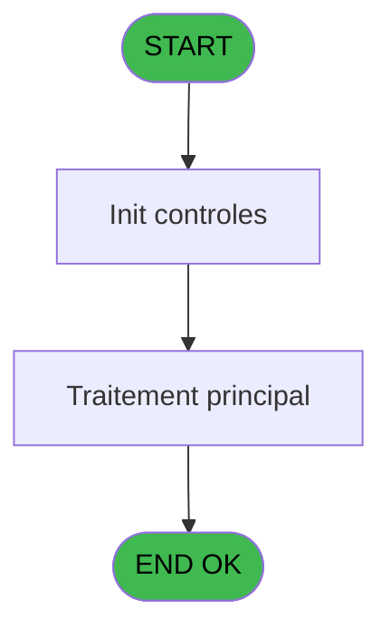
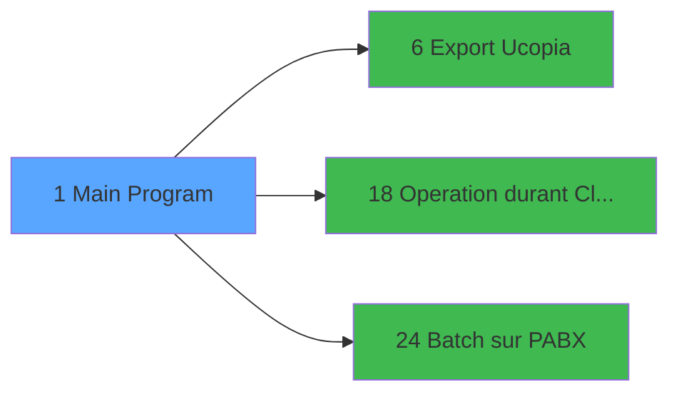

# POO IDE 1 - Main Program

> **Analyse**: Phases 1-4 2026-02-03 17:35 -> 17:35 (10s) | Assemblage 17:35
> **Pipeline**: V7.2 Enrichi
> **Structure**: 4 onglets (Resume | Ecrans | Donnees | Connexions)

<!-- TAB:Resume -->

## 1. FICHE D'IDENTITE

| Attribut | Valeur |
|----------|--------|
| Projet | POO |
| IDE Position | 1 |
| Nom Programme | Main Program |
| Fichier source | `Prg_1.xml` |
| Dossier IDE | General |
| Taches | 1 (1 ecrans visibles) |
| Tables modifiees | 0 |
| Programmes appeles | 3 |
| :warning: Statut | **ORPHELIN_POTENTIEL** |

## 2. DESCRIPTION FONCTIONNELLE

**Main Program** assure la gestion complete de ce processus.

Le flux de traitement s'organise en **1 blocs fonctionnels** :

- **Saisie** (1 tache) : ecrans de saisie utilisateur (formulaires, champs, donnees)

## 3. BLOCS FONCTIONNELS

### 3.1 Saisie (1 tache)

L'operateur saisit les donnees de la transaction via 1 ecran (Pooling Téléphonique et Ventes).

---

#### 1 - Pooling Téléphonique et Ventes [[ECRAN]](#ecran-t1)

**Role** : Saisie des donnees : Pooling Téléphonique et Ventes.
**Ecran** : 320 x 200 DLU (Type11) | [Voir mockup](#ecran-t1)

## 5. REGLES METIER

*(Aucune regle metier identifiee)*

## 6. CONTEXTE

- **Appele par**: (aucun)
- **Appelle**: 3 programmes | **Tables**: 0 (W:0 R:0 L:0) | **Taches**: 1 | **Expressions**: 17

<!-- TAB:Ecrans -->

## 8. ECRANS

### 8.1 Forms visibles (1 / 1)

| # | Position | Tache | Nom | Type | Largeur | Hauteur | Bloc |
|---|----------|-------|-----|------|---------|---------|------|
| 1 | 1 | 1 | Pooling Téléphonique et Ventes | Type11 | 320 | 200 | Saisie |

### 8.2 Mockups Ecrans

## 9. NAVIGATION

Ecran unique: **Pooling Téléphonique et Ventes**

### 9.3 Structure hierarchique (1 tache)

| Position | Tache | Type | Dimensions | Bloc |
|----------|-------|------|------------|------|
| **1.1** | [**Pooling Téléphonique et Ventes** (1)](#t1) [mockup](#ecran-t1) | Type11 | 320x200 | Saisie |

### 9.4 Algorigramme

> **Legende**: Vert = START/END OK | Rouge = END KO | Bleu = Decisions
> *Algorigramme auto-genere. Utiliser `/algorigramme` pour une synthese metier detaillee.*

<!-- TAB:Donnees -->

## 10. TABLES

### Tables utilisees (0)

| ID | Nom | Description | Type | R | W | L | Usages |
|----|-----|-------------|------|---|---|---|--------|

### Colonnes par table (0 / 0 tables avec colonnes identifiees)

## 11. VARIABLES

### 11.1 Variables globales (10)

Variables globales partagees entre programmes.

| Lettre | Nom | Type | Usage dans |
|--------|-----|------|-----------|
| A | VG.LOGIN | Unicode | - |
| B | VG.USER | Unicode | - |
| C | VG.USE CIA PACK? | Logical | - |
| D | VG.Version | Alpha | - |
| E | VG.Date | Alpha | - |
| F | VG. NEW FID? | Logical | - |
| G | VG.Interfaces Boutique? | Logical | - |
| H | VG.LEX V2.00 | Logical | - |
| I | VG.HOSTNAME AU LIEU DE TERM | Logical | - |
| J | VG.Numéro pseudo terminal | Numeric | - |

## 12. EXPRESSIONS

**17 / 17 expressions decodees (100%)**

### 12.1 Repartition par type

| Type | Expressions | Regles |
|------|-------------|--------|
| CONCATENATION | 1 | 0 |
| CONSTANTE | 9 | 0 |
| CONDITION | 3 | 0 |
| OTHER | 3 | 0 |
| NEGATION | 1 | 0 |

### 12.2 Expressions cles par type

#### CONCATENATION (1 expressions)

| Type | IDE | Expression | Regle |
|------|-----|------------|-------|
| CONCATENATION | 8 | `'POO -V '&Trim(ExpCalc('3'EXP))&' - '&Trim(ExpCalc('4'EXP))` | - |

#### CONSTANTE (9 expressions)

| Type | IDE | Expression | Regle |
|------|-----|------------|-------|
| CONSTANTE | 9 | `'LEX'` | - |
| CONSTANTE | 7 | `'1.00'` | - |
| CONSTANTE | 13 | `'T2H'` | - |
| CONSTANTE | 10 | `'2.00'` | - |
| CONSTANTE | 6 | `'INB'` | - |
| ... | | *+4 autres* | |

#### CONDITION (3 expressions)

| Type | IDE | Expression | Regle |
|------|-----|------------|-------|
| CONDITION | 12 | `Translate('%ForceUcopiaExport%')='Y'` | - |
| CONDITION | 11 | `Translate('%ForceUcopiaExport%')<>'Y'` | - |
| CONDITION | 1 | `RunMode ()<=2` | - |

#### OTHER (3 expressions)

| Type | IDE | Expression | Regle |
|------|-----|------------|-------|
| OTHER | 17 | `[M]` | - |
| OTHER | 15 | `GetPseudoTerminal ()` | - |
| OTHER | 14 | `Term ()` | - |

#### NEGATION (1 expressions)

| Type | IDE | Expression | Regle |
|------|-----|------------|-------|
| NEGATION | 16 | `NOT [M]` | - |

<!-- TAB:Connexions -->

## 13. GRAPHE D'APPELS

### 13.1 Chaine depuis Main (Callers)

**Chemin**: (pas de callers directs)

### 13.2 Callers

| IDE | Nom Programme | Nb Appels |
|-----|---------------|-----------|
| - | (aucun) | - |

### 13.3 Callees (programmes appeles)

### 13.4 Detail Callees avec contexte

| IDE | Nom Programme | Appels | Contexte |
|-----|---------------|--------|----------|
| [6](POO-IDE-6.md) | Export Ucopia | 1 | Sous-programme |
| [18](POO-IDE-18.md) | Operation durant Cloture | 1 | Fermeture session |
| [24](POO-IDE-24.md) | Batch sur PABX | 1 | Sous-programme |

## 14. RECOMMANDATIONS MIGRATION

### 14.1 Profil du programme

| Metrique | Valeur | Impact migration |
|----------|--------|-----------------|
| Lignes de logique | 37 | Programme compact |
| Expressions | 17 | Peu de logique |
| Tables WRITE | 0 | Impact faible |
| Sous-programmes | 3 | Peu de dependances |
| Ecrans visibles | 1 | Ecran unique ou traitement batch |
| Code desactive | 0% (0 / 37) | Code sain |
| Regles metier | 0 | Pas de regle identifiee |

### 14.2 Plan de migration par bloc

#### Saisie (1 tache: 1 ecran, 0 traitement)

- **Strategie** : Formulaire React/Blazor avec validation Zod/FluentValidation.
- Reproduire 1 ecran : Pooling Téléphonique et Ventes
- Validation temps reel cote client + serveur

### 14.3 Dependances critiques

| Dependance | Type | Appels | Impact |
|------------|------|--------|--------|
| [Batch sur PABX (IDE 24)](POO-IDE-24.md) | Sous-programme | 1x | Normale - Sous-programme |
| [Operation durant Cloture (IDE 18)](POO-IDE-18.md) | Sous-programme | 1x | Normale - Fermeture session |
| [Export Ucopia (IDE 6)](POO-IDE-6.md) | Sous-programme | 1x | Normale - Sous-programme |

---
*Spec DETAILED generee par Pipeline V7.2 - 2026-02-03 17:35*
