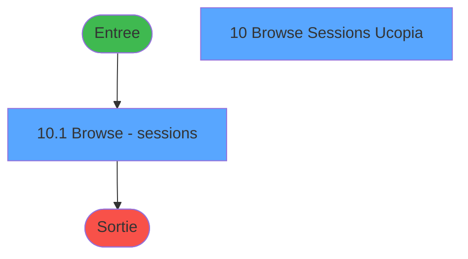
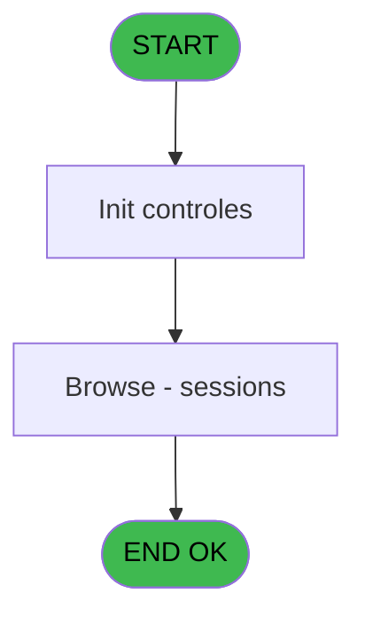
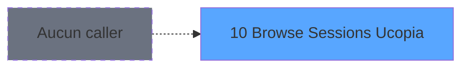

# POO IDE 10 - Browse Sessions Ucopia

> **Analyse**: Phases 1-4 2026-02-03 17:38 -> 17:38 (15s) | Assemblage 17:38
> **Pipeline**: V7.2 Enrichi
> **Structure**: 4 onglets (Resume | Ecrans | Donnees | Connexions)

<!-- TAB:Resume -->

## 1. FICHE D'IDENTITE

| Attribut | Valeur |
|----------|--------|
| Projet | POO |
| IDE Position | 10 |
| Nom Programme | Browse Sessions Ucopia |
| Fichier source | `Prg_10.xml` |
| Dossier IDE | Export |
| Taches | 2 (2 ecrans visibles) |
| Tables modifiees | 0 |
| Programmes appeles | 0 |
| :warning: Statut | **ORPHELIN_POTENTIEL** |

## 2. DESCRIPTION FONCTIONNELLE

**Browse Sessions Ucopia** assure la gestion complete de ce processus.

Le flux de traitement s'organise en **1 blocs fonctionnels** :

- **Traitement** (2 taches) : traitements metier divers

## 3. BLOCS FONCTIONNELS

### 3.1 Traitement (2 taches)

Traitements internes.

---

#### 10.1 - Browse - sessions [[ECRAN]](#ecran-t1)

**Role** : Traitement : Browse - sessions.
**Ecran** : 906 x 274 DLU | [Voir mockup](#ecran-t1)

---

#### 10 - Browse Sessions Ucopia [[ECRAN]](#ecran-t2)

**Role** : Traitement : Browse Sessions Ucopia.
**Ecran** : 640 x 140 DLU | [Voir mockup](#ecran-t2)

## 5. REGLES METIER

*(Aucune regle metier identifiee)*

## 6. CONTEXTE

- **Appele par**: (aucun)
- **Appelle**: 0 programmes | **Tables**: 1 (W:0 R:1 L:0) | **Taches**: 2 | **Expressions**: 3

<!-- TAB:Ecrans -->

## 8. ECRANS

### 8.1 Forms visibles (2 / 2)

| # | Position | Tache | Nom | Type | Largeur | Hauteur | Bloc |
|---|----------|-------|-----|------|---------|---------|------|
| 1 | 10 | 10.1 | Browse - sessions | Type0 | 906 | 274 | Traitement |
| 2 | 10.1 | 10 | Browse Sessions Ucopia | Type0 | 640 | 140 | Traitement |

### 8.2 Mockups Ecrans

---

#### 10 - Browse - sessions
**Tache** : [10.1](#t1) | **Type** : Type0 | **Dimensions** : 906 x 274 DLU
**Bloc** : Traitement | **Titre IDE** : Browse - sessions

<!-- FORM-DATA:
{
    "width":  906,
    "vFactor":  8,
    "type":  "Type0",
    "hFactor":  4,
    "controls":  [
                     {
                         "x":  4,
                         "type":  "table",
                         "var":  "",
                         "name":  "",
                         "titleH":  12,
                         "color":  "",
                         "w":  1994,
                         "y":  8,
                         "fmt":  "",
                         "parent":  null,
                         "text":  "",
                         "rowH":  13,
                         "h":  256,
                         "cols":  [
                                      {
                                          "title":  "sessionId",
                                          "layer":  1,
                                          "w":  58
                                      },
                                      {
                                          "title":  "userId",
                                          "layer":  2,
                                          "w":  183
                                      },
                                      {
                                          "title":  "initTime",
                                          "layer":  3,
                                          "w":  58
                                      },
                                      {
                                          "title":  "userFirst",
                                          "layer":  4,
                                          "w":  183
                                      },
                                      {
                                          "title":  "userLast",
                                          "layer":  5,
                                          "w":  183
                                      },
                                      {
                                          "title":  "fieldtitle1",
                                          "layer":  6,
                                          "w":  183
                                      },
                                      {
                                          "title":  "fieldvalue1",
                                          "layer":  7,
                                          "w":  183
                                      },
                                      {
                                          "title":  "fieldtitle2",
                                          "layer":  8,
                                          "w":  183
                                      },
                                      {
                                          "title":  "fieldvalue2",
                                          "layer":  9,
                                          "w":  183
                                      },
                                      {
                                          "title":  "emailAd",
                                          "layer":  10,
                                          "w":  290
                                      },
                                      {
                                          "title":  "countryName",
                                          "layer":  11,
                                          "w":  290
                                      }
                                  ],
                         "rows":  11
                     },
                     {
                         "x":  8,
                         "type":  "edit",
                         "var":  "",
                         "y":  23,
                         "w":  51,
                         "fmt":  "",
                         "name":  "sessionId",
                         "h":  10,
                         "color":  "",
                         "text":  "",
                         "parent":  194
                     },
                     {
                         "x":  66,
                         "type":  "edit",
                         "var":  "",
                         "y":  23,
                         "w":  176,
                         "fmt":  "",
                         "name":  "userId",
                         "h":  10,
                         "color":  "",
                         "text":  "",
                         "parent":  194
                     },
                     {
                         "x":  249,
                         "type":  "edit",
                         "var":  "",
                         "y":  23,
                         "w":  51,
                         "fmt":  "",
                         "name":  "initTime",
                         "h":  10,
                         "color":  "",
                         "text":  "",
                         "parent":  194
                     },
                     {
                         "x":  307,
                         "type":  "edit",
                         "var":  "",
                         "y":  23,
                         "w":  176,
                         "fmt":  "",
                         "name":  "userFirst",
                         "h":  10,
                         "color":  "",
                         "text":  "",
                         "parent":  194
                     },
                     {
                         "x":  490,
                         "type":  "edit",
                         "var":  "",
                         "y":  23,
                         "w":  176,
                         "fmt":  "",
                         "name":  "userLast",
                         "h":  10,
                         "color":  "",
                         "text":  "",
                         "parent":  194
                     },
                     {
                         "x":  673,
                         "type":  "edit",
                         "var":  "",
                         "y":  23,
                         "w":  176,
                         "fmt":  "",
                         "name":  "fieldtitle1",
                         "h":  10,
                         "color":  "",
                         "text":  "",
                         "parent":  194
                     },
                     {
                         "x":  856,
                         "type":  "edit",
                         "var":  "",
                         "y":  23,
                         "w":  176,
                         "fmt":  "",
                         "name":  "fieldvalue1",
                         "h":  10,
                         "color":  "",
                         "text":  "",
                         "parent":  194
                     },
                     {
                         "x":  1039,
                         "type":  "edit",
                         "var":  "",
                         "y":  23,
                         "w":  176,
                         "fmt":  "",
                         "name":  "fieldtitle2",
                         "h":  10,
                         "color":  "",
                         "text":  "",
                         "parent":  194
                     },
                     {
                         "x":  1222,
                         "type":  "edit",
                         "var":  "",
                         "y":  23,
                         "w":  176,
                         "fmt":  "",
                         "name":  "fieldvalue2",
                         "h":  10,
                         "color":  "",
                         "text":  "",
                         "parent":  194
                     },
                     {
                         "x":  1405,
                         "type":  "edit",
                         "var":  "",
                         "y":  23,
                         "w":  283,
                         "fmt":  "",
                         "name":  "emailAd",
                         "h":  10,
                         "color":  "",
                         "text":  "",
                         "parent":  194
                     },
                     {
                         "x":  1695,
                         "type":  "edit",
                         "var":  "",
                         "y":  23,
                         "w":  283,
                         "fmt":  "",
                         "name":  "countryName",
                         "h":  10,
                         "color":  "",
                         "text":  "",
                         "parent":  194
                     }
                 ],
    "taskId":  "10",
    "height":  274
}
-->

<strong>Champs : 11 champs</strong>

| Pos (x,y) | Nom | Variable | Type |
|-----------|-----|----------|------|
| 8,23 | sessionId | - | edit |
| 66,23 | userId | - | edit |
| 249,23 | initTime | - | edit |
| 307,23 | userFirst | - | edit |
| 490,23 | userLast | - | edit |
| 673,23 | fieldtitle1 | - | edit |
| 856,23 | fieldvalue1 | - | edit |
| 1039,23 | fieldtitle2 | - | edit |
| 1222,23 | fieldvalue2 | - | edit |
| 1405,23 | emailAd | - | edit |
| 1695,23 | countryName | - | edit |

---

#### 10.1 - Browse Sessions Ucopia
**Tache** : [10](#t2) | **Type** : Type0 | **Dimensions** : 640 x 140 DLU
**Bloc** : Traitement | **Titre IDE** : Browse Sessions Ucopia

<!-- FORM-DATA:
{
    "width":  640,
    "vFactor":  8,
    "type":  "Type0",
    "hFactor":  8,
    "controls":  [
                     {
                         "x":  109,
                         "type":  "label",
                         "var":  "",
                         "y":  29,
                         "w":  119,
                         "fmt":  "",
                         "name":  "",
                         "h":  9,
                         "color":  "",
                         "text":  "Timestamp 1",
                         "parent":  null
                     },
                     {
                         "x":  109,
                         "type":  "label",
                         "var":  "",
                         "y":  49,
                         "w":  119,
                         "fmt":  "",
                         "name":  "",
                         "h":  9,
                         "color":  "",
                         "text":  "Timestamp 2",
                         "parent":  null
                     },
                     {
                         "x":  109,
                         "type":  "label",
                         "var":  "",
                         "y":  69,
                         "w":  119,
                         "fmt":  "",
                         "name":  "",
                         "h":  9,
                         "color":  "",
                         "text":  "User Id",
                         "parent":  null
                     },
                     {
                         "x":  305,
                         "type":  "edit",
                         "var":  "",
                         "y":  28,
                         "w":  227,
                         "fmt":  "",
                         "name":  "Timestamp",
                         "h":  10,
                         "color":  "",
                         "text":  "",
                         "parent":  null
                     },
                     {
                         "x":  305,
                         "type":  "edit",
                         "var":  "",
                         "y":  48,
                         "w":  227,
                         "fmt":  "",
                         "name":  "Timestamp 2_0001",
                         "h":  10,
                         "color":  "",
                         "text":  "",
                         "parent":  null
                     },
                     {
                         "x":  305,
                         "type":  "edit",
                         "var":  "",
                         "y":  68,
                         "w":  227,
                         "fmt":  "",
                         "name":  "User Id",
                         "h":  10,
                         "color":  "",
                         "text":  "",
                         "parent":  null
                     },
                     {
                         "x":  66,
                         "type":  "button",
                         "var":  "",
                         "y":  113,
                         "w":  99,
                         "fmt":  "View",
                         "name":  "",
                         "h":  14,
                         "color":  "",
                         "text":  "",
                         "parent":  null
                     },
                     {
                         "x":  475,
                         "type":  "button",
                         "var":  "",
                         "y":  113,
                         "w":  99,
                         "fmt":  "Exit",
                         "name":  "",
                         "h":  14,
                         "color":  "",
                         "text":  "",
                         "parent":  null
                     }
                 ],
    "taskId":  "10.1",
    "height":  140
}
-->

<strong>Champs : 3 champs</strong>

| Pos (x,y) | Nom | Variable | Type |
|-----------|-----|----------|------|
| 305,28 | Timestamp | - | edit |
| 305,48 | Timestamp 2_0001 | - | edit |
| 305,68 | User Id | - | edit |

<strong>Boutons : 2 boutons</strong>

| Bouton | Pos (x,y) | Action |
|--------|-----------|--------|
| View | 66,113 | Bouton fonctionnel |
| Exit | 475,113 | Quitte le programme |

## 9. NAVIGATION

### 9.1 Enchainement des ecrans

**Detail par enchainement :**

| Depuis | Action | Vers | Retour |
|--------|--------|------|--------|

### 9.3 Structure hierarchique (2 taches)

| Position | Tache | Type | Dimensions | Bloc |
|----------|-------|------|------------|------|
| **10.1** | [**Browse - sessions** (10.1)](#t1) [mockup](#ecran-t1) | - | 906x274 | Traitement |
| 10.1.1 | [Browse Sessions Ucopia (10)](#t2) [mockup](#ecran-t2) | - | 640x140 | |

### 9.4 Algorigramme

> **Legende**: Vert = START/END OK | Rouge = END KO | Bleu = Decisions
> *Algorigramme auto-genere. Utiliser `/algorigramme` pour une synthese metier detaillee.*

<!-- TAB:Donnees -->

## 10. TABLES

### Tables utilisees (1)

| ID | Nom | Description | Type | R | W | L | Usages |
|----|-----|-------------|------|---|---|---|--------|
| 2 | parametre_workgroup |  | DB | R |   |   | 1 |

### Colonnes par table (0 / 1 tables avec colonnes identifiees)

Table 2 - parametre_workgroup (R) - 1 usages

*Table utilisee uniquement en Link ou aucune colonne Real identifiee dans le DataView.*

## 11. VARIABLES

### 11.1 Autres (4)

Variables diverses.

| Lettre | Nom | Type | Usage dans |
|--------|-----|------|-----------|
| A | Type interrogation | Alpha | - |
| B | Timestamp 1 | Numeric | - |
| C | Timestamp 2 | Numeric | - |
| D | User Id | Alpha | - |

## 12. EXPRESSIONS

**3 / 3 expressions decodees (100%)**

### 12.1 Repartition par type

| Type | Expressions | Regles |
|------|-------------|--------|
| CONDITION | 3 | 0 |

### 12.2 Expressions cles par type

#### CONDITION (3 expressions)

| Type | IDE | Expression | Regle |
|------|-----|------------|-------|
| CONDITION | 1 | `CndRange(Trim({1,4})<>'',Trim({1,4}))` | - |
| CONDITION | 3 | `CndRange({1,3}<>0,{1,3})` | - |
| CONDITION | 2 | `CndRange({1,2}<>0,{1,2})` | - |

<!-- TAB:Connexions -->

## 13. GRAPHE D'APPELS

### 13.1 Chaine depuis Main (Callers)

**Chemin**: (pas de callers directs)

### 13.2 Callers

| IDE | Nom Programme | Nb Appels |
|-----|---------------|-----------|
| - | (aucun) | - |

### 13.3 Callees (programmes appeles)

### 13.4 Detail Callees avec contexte

| IDE | Nom Programme | Appels | Contexte |
|-----|---------------|--------|----------|
| - | (aucun) | - | - |

## 14. RECOMMANDATIONS MIGRATION

### 14.1 Profil du programme

| Metrique | Valeur | Impact migration |
|----------|--------|-----------------|
| Lignes de logique | 18 | Programme compact |
| Expressions | 3 | Peu de logique |
| Tables WRITE | 0 | Impact faible |
| Sous-programmes | 0 | Peu de dependances |
| Ecrans visibles | 2 | Quelques ecrans |
| Code desactive | 0% (0 / 18) | Code sain |
| Regles metier | 0 | Pas de regle identifiee |

### 14.2 Plan de migration par bloc

#### Traitement (2 taches: 2 ecrans, 0 traitement)

- **Strategie** : 2 composant(s) UI (Razor/React) avec formulaires et validation.
- Decomposer les taches en services unitaires testables.

### 14.3 Dependances critiques

| Dependance | Type | Appels | Impact |
|------------|------|--------|--------|

---
*Spec DETAILED generee par Pipeline V7.2 - 2026-02-03 17:38*
