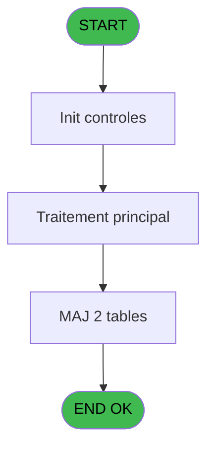

# POO IDE 11 - Export Ucopia initial

> **Analyse**: Phases 1-4 2026-02-03 17:38 -> 17:38 (20s) | Assemblage 17:38
> **Pipeline**: V7.2 Enrichi
> **Structure**: 4 onglets (Resume | Ecrans | Donnees | Connexions)

<!-- TAB:Resume -->

## 1. FICHE D'IDENTITE

| Attribut | Valeur |
|----------|--------|
| Projet | POO |
| IDE Position | 11 |
| Nom Programme | Export Ucopia initial |
| Fichier source | `Prg_11.xml` |
| Dossier IDE | Export |
| Taches | 3 (0 ecrans visibles) |
| Tables modifiees | 2 |
| Programmes appeles | 1 |
| :warning: Statut | **ORPHELIN_POTENTIEL** |

## 2. DESCRIPTION FONCTIONNELLE

**Export Ucopia initial** assure la gestion complete de ce processus.

Le flux de traitement s'organise en **2 blocs fonctionnels** :

- **Traitement** (2 taches) : traitements metier divers
- **Initialisation** (1 tache) : reinitialisation d'etats et de variables de travail

**Donnees modifiees** : 2 tables en ecriture (parametre_workgroup, saisie_autorisations).

Detail : phases du traitement

#### Phase 1 : Initialisation (1 tache)

- **11** - Export Ucopia initial

#### Phase 2 : Traitement (2 taches)

- **11.1** - Export
- **11.2** - Write Log

Delegue a : [Convert Timestamp (IDE 8)](POO-IDE-8.md)

#### Tables impactees

| Table | Operations | Role metier |
|-------|-----------|-------------|
| saisie_autorisations | R/**W** (2 usages) |  |
| parametre_workgroup | **W** (1 usages) |  |

## 3. BLOCS FONCTIONNELS

### 3.1 Initialisation (1 tache)

Reinitialisation d'etats et variables de travail.

---

#### 11 - Export Ucopia initial

**Role** : Reinitialisation : Export Ucopia initial.

### 3.2 Traitement (2 taches)

Traitements internes.

---

#### 11.1 - Export

**Role** : Traitement : Export.
**Delegue a** : [Convert Timestamp (IDE 8)](POO-IDE-8.md)

---

#### 11.2 - Write Log

**Role** : Traitement : Write Log.
**Delegue a** : [Convert Timestamp (IDE 8)](POO-IDE-8.md)

## 5. REGLES METIER

*(Aucune regle metier identifiee)*

## 6. CONTEXTE

- **Appele par**: (aucun)
- **Appelle**: 1 programmes | **Tables**: 2 (W:2 R:1 L:0) | **Taches**: 3 | **Expressions**: 2

<!-- TAB:Ecrans -->

## 8. ECRANS

*(Programme sans ecran visible)*

## 9. NAVIGATION

### 9.3 Structure hierarchique (3 taches)

| Position | Tache | Type | Dimensions | Bloc |
|----------|-------|------|------------|------|
| **11.1** | [**Export Ucopia initial** (11)](#t1) | - | - | Initialisation |
| **11.2** | [**Export** (11.1)](#t2) | - | - | Traitement |
| 11.2.1 | [Write Log (11.2)](#t3) | - | - | |

### 9.4 Algorigramme

> **Legende**: Vert = START/END OK | Rouge = END KO | Bleu = Decisions
> *Algorigramme auto-genere. Utiliser `/algorigramme` pour une synthese metier detaillee.*

<!-- TAB:Donnees -->

## 10. TABLES

### Tables utilisees (2)

| ID | Nom | Description | Type | R | W | L | Usages |
|----|-----|-------------|------|---|---|---|--------|
| 2 | parametre_workgroup |  | DB |   | **W** |   | 1 |
| 6 | saisie_autorisations |  | TMP | R | **W** |   | 2 |

### Colonnes par table (2 / 2 tables avec colonnes identifiees)

Table 2 - parametre_workgroup (**W**) - 1 usages

| Lettre | Variable | Acces | Type |
|--------|----------|-------|------|
| A | v.date time | W | Alpha |
| B | v.ligne export | W | Alpha |

Table 6 - saisie_autorisations (R/**W**) - 2 usages

| Lettre | Variable | Acces | Type |
|--------|----------|-------|------|
| A | v.retour log | W | Logical |
| B | v.nb enreg lus | W | Numeric |
| C | v.nb adresses | W | Numeric |
| D | v.lieu de séjour | W | Alpha |
| E | v.date time | W | Alpha |
| F | v.last time | W | Numeric |

## 11. VARIABLES

### 11.1 Variables de session (6)

Variables persistantes pendant toute la session.

| Lettre | Nom | Type | Usage dans |
|--------|-----|------|-----------|
| A | v.retour log | Logical | - |
| B | v.nb enreg lus | Numeric | - |
| C | v.nb adresses | Numeric | - |
| D | v.lieu de séjour | Alpha | - |
| E | v.date time | Alpha | - |
| F | v.last time | Numeric | - |

## 12. EXPRESSIONS

**2 / 2 expressions decodees (100%)**

### 12.1 Repartition par type

| Type | Expressions | Regles |
|------|-------------|--------|
| FORMAT | 1 | 0 |
| OTHER | 1 | 0 |

### 12.2 Expressions cles par type

#### FORMAT (1 expressions)

| Type | IDE | Expression | Regle |
|------|-----|------------|-------|
| FORMAT | 2 | `DStr(Date(),'DD/MM/YYYY')&' '&TStr(Time(),'HHMM')` | - |

#### OTHER (1 expressions)

| Type | IDE | Expression | Regle |
|------|-----|------------|-------|
| OTHER | 1 | `Translate('%pool_lieu_sejour%')` | - |

<!-- TAB:Connexions -->

## 13. GRAPHE D'APPELS

### 13.1 Chaine depuis Main (Callers)

**Chemin**: (pas de callers directs)

### 13.2 Callers

| IDE | Nom Programme | Nb Appels |
|-----|---------------|-----------|
| - | (aucun) | - |

### 13.3 Callees (programmes appeles)

### 13.4 Detail Callees avec contexte

| IDE | Nom Programme | Appels | Contexte |
|-----|---------------|--------|----------|
| [8](POO-IDE-8.md) | Convert Timestamp | 1 | Sous-programme |

## 14. RECOMMANDATIONS MIGRATION

### 14.1 Profil du programme

| Metrique | Valeur | Impact migration |
|----------|--------|-----------------|
| Lignes de logique | 52 | Programme compact |
| Expressions | 2 | Peu de logique |
| Tables WRITE | 2 | Impact faible |
| Sous-programmes | 1 | Peu de dependances |
| Ecrans visibles | 0 | Ecran unique ou traitement batch |
| Code desactive | 0% (0 / 52) | Code sain |
| Regles metier | 0 | Pas de regle identifiee |

### 14.2 Plan de migration par bloc

#### Initialisation (1 tache: 0 ecran, 1 traitement)

- **Strategie** : Constructeur/methode `InitAsync()` dans l'orchestrateur.

#### Traitement (2 taches: 0 ecran, 2 traitements)

- **Strategie** : 2 service(s) backend injectable(s) (Domain Services).
- 1 sous-programme(s) a migrer ou a reutiliser depuis les services existants.
- Decomposer les taches en services unitaires testables.

### 14.3 Dependances critiques

| Dependance | Type | Appels | Impact |
|------------|------|--------|--------|
| parametre_workgroup | Table WRITE (Database) | 1x | Schema + repository |
| saisie_autorisations | Table WRITE (Temp) | 1x | Schema + repository |
| [Convert Timestamp (IDE 8)](POO-IDE-8.md) | Sous-programme | 1x | Normale - Sous-programme |

---
*Spec DETAILED generee par Pipeline V7.2 - 2026-02-03 17:38*
