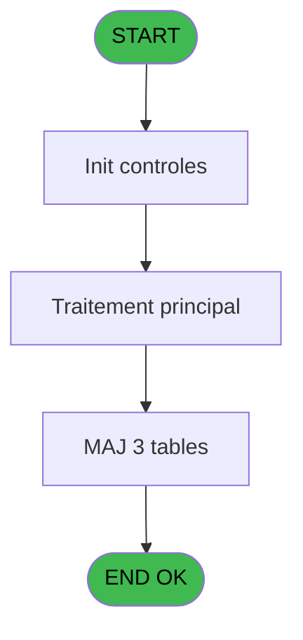

# POO IDE 12 - Exp Ucopia bck 09/10

> **Analyse**: Phases 1-4 2026-02-03 17:38 -> 17:39 (18s) | Assemblage 17:39
> **Pipeline**: V7.2 Enrichi
> **Structure**: 4 onglets (Resume | Ecrans | Donnees | Connexions)

<!-- TAB:Resume -->

## 1. FICHE D'IDENTITE

| Attribut | Valeur |
|----------|--------|
| Projet | POO |
| IDE Position | 12 |
| Nom Programme | Exp Ucopia bck 09/10 |
| Fichier source | `Prg_12.xml` |
| Dossier IDE | Export |
| Taches | 6 (0 ecrans visibles) |
| Tables modifiees | 3 |
| Programmes appeles | 1 |
| :warning: Statut | **ORPHELIN_POTENTIEL** |

## 2. DESCRIPTION FONCTIONNELLE

**Exp Ucopia bck 09/10** assure la gestion complete de ce processus.

Le flux de traitement s'organise en **2 blocs fonctionnels** :

- **Traitement** (4 taches) : traitements metier divers
- **Initialisation** (2 taches) : reinitialisation d'etats et de variables de travail

**Donnees modifiees** : 3 tables en ecriture (parametre_workgroup, saisie_autorisations, recap_devise_cloture).

Detail : phases du traitement

#### Phase 1 : Traitement (4 taches)

- **12** - Exp Ucopia bck 09/10
- **12.1** - Export
- **12.2** - Write Log
- **12.5** - Log Prog

Delegue a : [Convert Timestamp (IDE 8)](POO-IDE-8.md)

#### Phase 2 : Initialisation (2 taches)

- **12.3** - Init Table Tempo
- **12.4** - Init Table Tempo

#### Tables impactees

| Table | Operations | Role metier |
|-------|-----------|-------------|
| recap_devise_cloture | **W**/L (3 usages) | Donnees reseau/cloture |
| parametre_workgroup | R/**W** (2 usages) |  |
| saisie_autorisations | R/**W** (2 usages) |  |

## 3. BLOCS FONCTIONNELS

### 3.1 Traitement (4 taches)

Traitements internes.

---

#### 12 - Exp Ucopia bck 09/10

**Role** : Traitement : Exp Ucopia bck 09/10.

3 sous-taches directes

| Tache | Nom | Bloc |
|-------|-----|------|
| [12.1](#t2) | Export | Traitement |
| [12.2](#t3) | Write Log | Traitement |
| [12.5](#t8) | Log Prog | Traitement |

**Delegue a** : [Convert Timestamp (IDE 8)](POO-IDE-8.md)

---

#### 12.1 - Export

**Role** : Traitement : Export.
**Delegue a** : [Convert Timestamp (IDE 8)](POO-IDE-8.md)

---

#### 12.2 - Write Log

**Role** : Traitement : Write Log.
**Delegue a** : [Convert Timestamp (IDE 8)](POO-IDE-8.md)

---

#### 12.5 - Log Prog

**Role** : Traitement : Log Prog.
**Delegue a** : [Convert Timestamp (IDE 8)](POO-IDE-8.md)

### 3.2 Initialisation (2 taches)

Reinitialisation d'etats et variables de travail.

---

#### 12.3 - Init Table Tempo

**Role** : Reinitialisation : Init Table Tempo.

---

#### 12.4 - Init Table Tempo

**Role** : Reinitialisation : Init Table Tempo.

## 5. REGLES METIER

*(Aucune regle metier identifiee)*

## 6. CONTEXTE

- **Appele par**: (aucun)
- **Appelle**: 1 programmes | **Tables**: 3 (W:3 R:2 L:1) | **Taches**: 6 | **Expressions**: 11

<!-- TAB:Ecrans -->

## 8. ECRANS

*(Programme sans ecran visible)*

## 9. NAVIGATION

### 9.3 Structure hierarchique (6 taches)

| Position | Tache | Type | Dimensions | Bloc |
|----------|-------|------|------------|------|
| **12.1** | [**Exp Ucopia bck 09/10** (12)](#t1) | - | - | Traitement |
| 12.1.1 | [Export (12.1)](#t2) | - | - | |
| 12.1.2 | [Write Log (12.2)](#t3) | - | - | |
| 12.1.3 | [Log Prog (12.5)](#t8) | - | - | |
| **12.2** | [**Init Table Tempo** (12.3)](#t4) | - | - | Initialisation |
| 12.2.1 | [Init Table Tempo (12.4)](#t7) | - | - | |

### 9.4 Algorigramme

> **Legende**: Vert = START/END OK | Rouge = END KO | Bleu = Decisions
> *Algorigramme auto-genere. Utiliser `/algorigramme` pour une synthese metier detaillee.*

<!-- TAB:Donnees -->

## 10. TABLES

### Tables utilisees (3)

| ID | Nom | Description | Type | R | W | L | Usages |
|----|-----|-------------|------|---|---|---|--------|
| 2 | parametre_workgroup |  | DB | R | **W** |   | 2 |
| 6 | saisie_autorisations |  | TMP | R | **W** |   | 2 |
| 7 | recap_devise_cloture | Donnees reseau/cloture | TMP |   | **W** | L | 3 |

### Colonnes par table (2 / 3 tables avec colonnes identifiees)

Table 2 - parametre_workgroup (R/**W**) - 2 usages

*Table utilisee uniquement en Link ou aucune colonne Real identifiee dans le DataView.*

Table 6 - saisie_autorisations (R/**W**) - 2 usages

| Lettre | Variable | Acces | Type |
|--------|----------|-------|------|
| A | v.retour log | W | Logical |
| B | v.nb enreg lus | W | Numeric |
| C | v.nb adresses | W | Numeric |
| D | v.lieu de séjour | W | Alpha |
| E | v.date time | W | Alpha |
| F | v.last time | W | Numeric |

Table 7 - recap_devise_cloture (**W**/L) - 3 usages

| Lettre | Variable | Acces | Type |
|--------|----------|-------|------|
| A | v.date time | W | Alpha |
| B | v.ligne export | W | Alpha |

## 11. VARIABLES

### 11.1 Variables de session (6)

Variables persistantes pendant toute la session.

| Lettre | Nom | Type | Usage dans |
|--------|-----|------|-----------|
| A | v.retour log | Logical | - |
| B | v.nb enreg lus | Numeric | 1x session |
| C | v.nb adresses | Numeric | - |
| D | v.lieu de séjour | Alpha | - |
| E | v.date time | Alpha | - |
| F | v.last time | Numeric | - |

## 12. EXPRESSIONS

**11 / 11 expressions decodees (100%)**

### 12.1 Repartition par type

| Type | Expressions | Regles |
|------|-------------|--------|
| CALCULATION | 1 | 0 |
| CONSTANTE | 4 | 0 |
| FORMAT | 1 | 0 |
| CONDITION | 1 | 0 |
| OTHER | 3 | 0 |
| CONCATENATION | 1 | 0 |

### 12.2 Expressions cles par type

#### CALCULATION (1 expressions)

| Type | IDE | Expression | Regle |
|------|-----|------------|-------|
| CALCULATION | 3 | `DbDel('{7,-1}'DSOURCE,'')` | - |

#### CONSTANTE (4 expressions)

| Type | IDE | Expression | Regle |
|------|-----|------------|-------|
| CONSTANTE | 6 | `'EXPORT TABLE'` | - |
| CONSTANTE | 7 | `'WRITE LOG'` | - |
| CONSTANTE | 4 | `'INIT TABLE PRIM'` | - |
| CONSTANTE | 5 | `'INIT TABLE IDX3'` | - |

#### FORMAT (1 expressions)

| Type | IDE | Expression | Regle |
|------|-----|------------|-------|
| FORMAT | 2 | `DStr(Date(),'DD/MM/YYYY')&' '&TStr(Time(),'HHMM')` | - |

#### CONDITION (1 expressions)

| Type | IDE | Expression | Regle |
|------|-----|------------|-------|
| CONDITION | 8 | `DOW(Date())=1` | - |

#### OTHER (3 expressions)

| Type | IDE | Expression | Regle |
|------|-----|------------|-------|
| OTHER | 11 | `v.nb enreg lus [B]` | - |
| OTHER | 9 | `FileDelete(Translate('%env%')&'Log_Prog_Exp_Ucp_LW.txt')` | - |
| OTHER | 1 | `Translate('%pool_lieu_sejour%')` | - |

#### CONCATENATION (1 expressions)

| Type | IDE | Expression | Regle |
|------|-----|------------|-------|
| CONCATENATION | 10 | `FileRename(Translate('%env%')&'Log_Prog_Exp_Ucp.txt',Translate('%env%')&'Log_Prog_Exp_Ucp_LW.txt')` | - |

<!-- TAB:Connexions -->

## 13. GRAPHE D'APPELS

### 13.1 Chaine depuis Main (Callers)

**Chemin**: (pas de callers directs)

### 13.2 Callers

| IDE | Nom Programme | Nb Appels |
|-----|---------------|-----------|
| - | (aucun) | - |

### 13.3 Callees (programmes appeles)

### 13.4 Detail Callees avec contexte

| IDE | Nom Programme | Appels | Contexte |
|-----|---------------|--------|----------|
| [8](POO-IDE-8.md) | Convert Timestamp | 2 | Sous-programme |

## 14. RECOMMANDATIONS MIGRATION

### 14.1 Profil du programme

| Metrique | Valeur | Impact migration |
|----------|--------|-----------------|
| Lignes de logique | 126 | Programme compact |
| Expressions | 11 | Peu de logique |
| Tables WRITE | 3 | Impact modere |
| Sous-programmes | 1 | Peu de dependances |
| Ecrans visibles | 0 | Ecran unique ou traitement batch |
| Code desactive | 0.8% (1 / 126) | Code sain |
| Regles metier | 0 | Pas de regle identifiee |

### 14.2 Plan de migration par bloc

#### Traitement (4 taches: 0 ecran, 4 traitements)

- **Strategie** : 4 service(s) backend injectable(s) (Domain Services).
- 1 sous-programme(s) a migrer ou a reutiliser depuis les services existants.
- Decomposer les taches en services unitaires testables.

#### Initialisation (2 taches: 0 ecran, 2 traitements)

- **Strategie** : Constructeur/methode `InitAsync()` dans l'orchestrateur.

### 14.3 Dependances critiques

| Dependance | Type | Appels | Impact |
|------------|------|--------|--------|
| parametre_workgroup | Table WRITE (Database) | 1x | Schema + repository |
| saisie_autorisations | Table WRITE (Temp) | 1x | Schema + repository |
| recap_devise_cloture | Table WRITE (Temp) | 1x | Schema + repository |
| [Convert Timestamp (IDE 8)](POO-IDE-8.md) | Sous-programme | 2x | Haute - Sous-programme |

---
*Spec DETAILED generee par Pipeline V7.2 - 2026-02-03 17:39*
