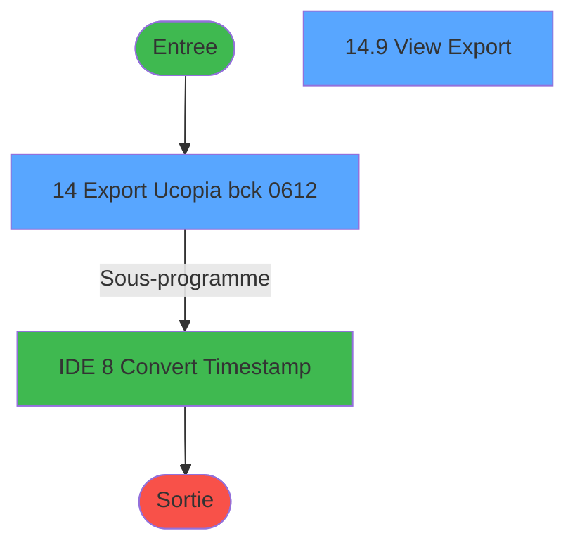
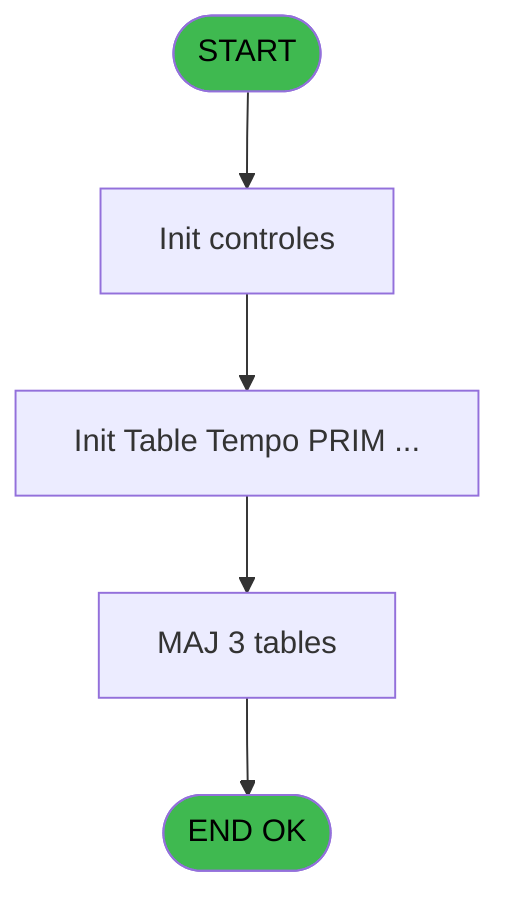
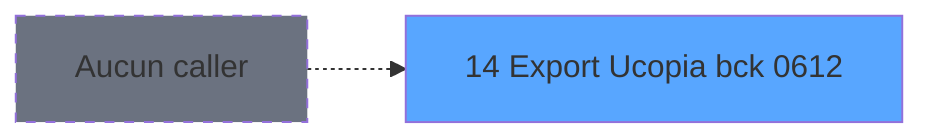

# POO IDE 14 - Export Ucopia bck 06/12

> **Analyse**: Phases 1-4 2026-02-03 17:39 -> 17:40 (16s) | Assemblage 17:40
> **Pipeline**: V7.2 Enrichi
> **Structure**: 4 onglets (Resume | Ecrans | Donnees | Connexions)

<!-- TAB:Resume -->

## 1. FICHE D'IDENTITE

| Attribut | Valeur |
|----------|--------|
| Projet | POO |
| IDE Position | 14 |
| Nom Programme | Export Ucopia bck 06/12 |
| Fichier source | `Prg_14.xml` |
| Dossier IDE | Export |
| Taches | 11 (2 ecrans visibles) |
| Tables modifiees | 3 |
| Programmes appeles | 1 |
| :warning: Statut | **ORPHELIN_POTENTIEL** |

## 2. DESCRIPTION FONCTIONNELLE

**Export Ucopia bck 06/12** assure la gestion complete de ce processus.

Le flux de traitement s'organise en **3 blocs fonctionnels** :

- **Traitement** (6 taches) : traitements metier divers
- **Initialisation** (3 taches) : reinitialisation d'etats et de variables de travail
- **Creation** (2 taches) : insertion d'enregistrements en base (mouvements, prestations)

**Donnees modifiees** : 3 tables en ecriture (parametre_workgroup, saisie_autorisations, recap_devise_cloture).

**Logique metier** : 1 regles identifiees couvrant conditions metier.

Detail : phases du traitement

#### Phase 1 : Traitement (6 taches)

- **14** - Export Ucopia bck 06/12 **[[ECRAN]](#ecran-t1)**
- **14.1** - Export
- **14.2** - Write Log
- **14.5** - Log Prog
- **14.8** - Drop Tempdb
- **14.9** - View Export **[[ECRAN]](#ecran-t24)**

Delegue a : [Convert Timestamp (IDE 8)](POO-IDE-8.md)

#### Phase 2 : Initialisation (3 taches)

- **14.3** - Init Table Tempo **[[ECRAN]](#ecran-t4)**
- **14.4** - Init Table Tempo
- **14.6** - Init Table Tempo

#### Phase 3 : Creation (2 taches)

- **14.7** - Create Temdb
- **14.7.1** - Create Index

#### Tables impactees

| Table | Operations | Role metier |
|-------|-----------|-------------|
| recap_devise_cloture | **W**/L (4 usages) | Donnees reseau/cloture |
| parametre_workgroup | R/**W** (3 usages) |  |
| saisie_autorisations | R/**W** (2 usages) |  |

## 3. BLOCS FONCTIONNELS

### 3.1 Traitement (6 taches)

Traitements internes.

---

#### 14 - Export Ucopia bck 06/12 [[ECRAN]](#ecran-t1)

**Role** : Tache d'orchestration : point d'entree du programme (6 sous-taches). Coordonne l'enchainement des traitements.
**Ecran** : 480 x 74 DLU | [Voir mockup](#ecran-t1)

5 sous-taches directes

| Tache | Nom | Bloc |
|-------|-----|------|
| [14.1](#t2) | Export | Traitement |
| [14.2](#t3) | Write Log | Traitement |
| [14.5](#t8) | Log Prog | Traitement |
| [14.8](#t13) | Drop Tempdb | Traitement |
| [14.9](#t24) | View Export **[[ECRAN]](#ecran-t24)** | Traitement |

**Variables liees** : H (v.export iteratif)
**Delegue a** : [Convert Timestamp (IDE 8)](POO-IDE-8.md)

---

#### 14.1 - Export

**Role** : Traitement : Export.
**Variables liees** : H (v.export iteratif)
**Delegue a** : [Convert Timestamp (IDE 8)](POO-IDE-8.md)

---

#### 14.2 - Write Log

**Role** : Traitement : Write Log.
**Delegue a** : [Convert Timestamp (IDE 8)](POO-IDE-8.md)

---

#### 14.5 - Log Prog

**Role** : Traitement : Log Prog.
**Delegue a** : [Convert Timestamp (IDE 8)](POO-IDE-8.md)

---

#### 14.8 - Drop Tempdb

**Role** : Traitement : Drop Tempdb.
**Delegue a** : [Convert Timestamp (IDE 8)](POO-IDE-8.md)

---

#### 14.9 - View Export [[ECRAN]](#ecran-t24)

**Role** : Traitement : View Export.
**Ecran** : 1285 x 325 DLU | [Voir mockup](#ecran-t24)
**Variables liees** : H (v.export iteratif)
**Delegue a** : [Convert Timestamp (IDE 8)](POO-IDE-8.md)

### 3.2 Initialisation (3 taches)

Reinitialisation d'etats et variables de travail.

---

#### 14.3 - Init Table Tempo [[ECRAN]](#ecran-t4)

**Role** : Reinitialisation : Init Table Tempo.
**Ecran** : 750 x 277 DLU | [Voir mockup](#ecran-t4)

---

#### 14.4 - Init Table Tempo

**Role** : Reinitialisation : Init Table Tempo.

---

#### 14.6 - Init Table Tempo

**Role** : Reinitialisation : Init Table Tempo.

### 3.3 Creation (2 taches)

Insertion de nouveaux enregistrements en base.

---

#### 14.7 - Create Temdb

**Role** : Traitement : Create Temdb.

---

#### 14.7.1 - Create Index

**Role** : Traitement : Create Index.

## 5. REGLES METIER

1 regles identifiees:

### Autres (1 regles)

#### [RM-001] Si v.borne min timestamp [K] alors 'Export Iteratif' sinon 'Export Delta')

| Element | Detail |
|---------|--------|
| **Condition** | `v.borne min timestamp [K]` |
| **Si vrai** | 'Export Iteratif' |
| **Si faux** | 'Export Delta') |
| **Variables** | K (v.borne min timestamp) |
| **Expression source** | Expression 28 : `IF(v.borne min timestamp [K],'Export Iteratif','Export Delta` |
| **Exemple** | Si v.borne min timestamp [K] → 'Export Iteratif'. Sinon → 'Export Delta') |
| **Impact** | [14 - Export Ucopia bck 06/12](#t1) |

## 6. CONTEXTE

- **Appele par**: (aucun)
- **Appelle**: 1 programmes | **Tables**: 3 (W:3 R:2 L:1) | **Taches**: 11 | **Expressions**: 30

<!-- TAB:Ecrans -->

## 8. ECRANS

### 8.1 Forms visibles (2 / 11)

| # | Position | Tache | Nom | Type | Largeur | Hauteur | Bloc |
|---|----------|-------|-----|------|---------|---------|------|
| 1 | 14 | 14 | Export Ucopia bck 06/12 | Type0 | 480 | 74 | Traitement |
| 2 | 14.9 | 14.9 | View Export | Type0 | 1285 | 325 | Traitement |

### 8.2 Mockups Ecrans

---

#### 14 - Export Ucopia bck 06/12
**Tache** : [14](#t1) | **Type** : Type0 | **Dimensions** : 480 x 74 DLU
**Bloc** : Traitement | **Titre IDE** : Export Ucopia bck 06/12

<!-- FORM-DATA:
{
    "width":  480,
    "vFactor":  8,
    "type":  "Type0",
    "hFactor":  4,
    "controls":  [
                     {
                         "x":  8,
                         "type":  "label",
                         "var":  "",
                         "y":  23,
                         "w":  72,
                         "fmt":  "",
                         "name":  "",
                         "h":  9,
                         "color":  "",
                         "text":  "v.nb boucles while",
                         "parent":  null
                     },
                     {
                         "x":  84,
                         "type":  "edit",
                         "var":  "",
                         "y":  23,
                         "w":  52,
                         "fmt":  "",
                         "name":  "v.nb boucles while",
                         "h":  10,
                         "color":  "",
                         "text":  "",
                         "parent":  null
                     },
                     {
                         "x":  8,
                         "type":  "edit",
                         "var":  "",
                         "y":  39,
                         "w":  468,
                         "fmt":  "50",
                         "name":  "",
                         "h":  10,
                         "color":  "",
                         "text":  "",
                         "parent":  null
                     }
                 ],
    "taskId":  "14",
    "height":  74
}
-->

<strong>Champs : 2 champs</strong>

| Pos (x,y) | Nom | Variable | Type |
|-----------|-----|----------|------|
| 84,23 | v.nb boucles while | - | edit |
| 8,39 | 50 | - | edit |

---

#### 14.9 - View Export
**Tache** : [14.9](#t24) | **Type** : Type0 | **Dimensions** : 1285 x 325 DLU
**Bloc** : Traitement | **Titre IDE** : View Export

<!-- FORM-DATA:
{
    "width":  1285,
    "vFactor":  8,
    "type":  "Type0",
    "hFactor":  4,
    "controls":  [
                     {
                         "x":  4,
                         "type":  "table",
                         "var":  "",
                         "name":  "",
                         "titleH":  12,
                         "color":  "",
                         "w":  1638,
                         "y":  8,
                         "fmt":  "",
                         "parent":  null,
                         "text":  "",
                         "rowH":  13,
                         "h":  312,
                         "cols":  [
                                      {
                                          "title":  "Session Id",
                                          "layer":  1,
                                          "w":  53
                                      },
                                      {
                                          "title":  "User Id",
                                          "layer":  2,
                                          "w":  151
                                      },
                                      {
                                          "title":  "Timestamp",
                                          "layer":  3,
                                          "w":  58
                                      },
                                      {
                                          "title":  "Date Alpha",
                                          "layer":  4,
                                          "w":  151
                                      },
                                      {
                                          "title":  "Last Name",
                                          "layer":  5,
                                          "w":  151
                                      },
                                      {
                                          "title":  "First Name",
                                          "layer":  6,
                                          "w":  151
                                      },
                                      {
                                          "title":  "Field Title 1",
                                          "layer":  7,
                                          "w":  151
                                      },
                                      {
                                          "title":  "Field Value 1",
                                          "layer":  8,
                                          "w":  151
                                      },
                                      {
                                          "title":  "Field Title 2",
                                          "layer":  9,
                                          "w":  151
                                      },
                                      {
                                          "title":  "Field Value 2",
                                          "layer":  10,
                                          "w":  151
                                      },
                                      {
                                          "title":  "Email",
                                          "layer":  11,
                                          "w":  151
                                      },
                                      {
                                          "title":  "Nationality",
                                          "layer":  12,
                                          "w":  151
                                      }
                                  ],
                         "rows":  12
                     },
                     {
                         "x":  8,
                         "type":  "edit",
                         "var":  "",
                         "y":  23,
                         "w":  46,
                         "fmt":  "",
                         "name":  "Session Id",
                         "h":  10,
                         "color":  "",
                         "text":  "",
                         "parent":  29
                     },
                     {
                         "x":  61,
                         "type":  "edit",
                         "var":  "",
                         "y":  23,
                         "w":  144,
                         "fmt":  "",
                         "name":  "User Id",
                         "h":  10,
                         "color":  "",
                         "text":  "",
                         "parent":  29
                     },
                     {
                         "x":  212,
                         "type":  "edit",
                         "var":  "",
                         "y":  23,
                         "w":  51,
                         "fmt":  "",
                         "name":  "Timestamp",
                         "h":  10,
                         "color":  "",
                         "text":  "",
                         "parent":  29
                     },
                     {
                         "x":  270,
                         "type":  "edit",
                         "var":  "",
                         "y":  23,
                         "w":  144,
                         "fmt":  "",
                         "name":  "Date Alpha",
                         "h":  10,
                         "color":  "",
                         "text":  "",
                         "parent":  29
                     },
                     {
                         "x":  421,
                         "type":  "edit",
                         "var":  "",
                         "y":  23,
                         "w":  144,
                         "fmt":  "",
                         "name":  "Last Name",
                         "h":  10,
                         "color":  "",
                         "text":  "",
                         "parent":  29
                     },
                     {
                         "x":  572,
                         "type":  "edit",
                         "var":  "",
                         "y":  23,
                         "w":  144,
                         "fmt":  "",
                         "name":  "First Name",
                         "h":  10,
                         "color":  "",
                         "text":  "",
                         "parent":  29
                     },
                     {
                         "x":  723,
                         "type":  "edit",
                         "var":  "",
                         "y":  23,
                         "w":  144,
                         "fmt":  "",
                         "name":  "Field Title 1",
                         "h":  10,
                         "color":  "",
                         "text":  "",
                         "parent":  29
                     },
                     {
                         "x":  874,
                         "type":  "edit",
                         "var":  "",
                         "y":  23,
                         "w":  144,
                         "fmt":  "",
                         "name":  "Field Value 1",
                         "h":  10,
                         "color":  "",
                         "text":  "",
                         "parent":  29
                     },
                     {
                         "x":  1025,
                         "type":  "edit",
                         "var":  "",
                         "y":  23,
                         "w":  144,
                         "fmt":  "",
                         "name":  "Field Title 2",
                         "h":  10,
                         "color":  "",
                         "text":  "",
                         "parent":  29
                     },
                     {
                         "x":  1176,
                         "type":  "edit",
                         "var":  "",
                         "y":  23,
                         "w":  144,
                         "fmt":  "",
                         "name":  "Field Value 2",
                         "h":  10,
                         "color":  "",
                         "text":  "",
                         "parent":  29
                     },
                     {
                         "x":  1327,
                         "type":  "edit",
                         "var":  "",
                         "y":  23,
                         "w":  144,
                         "fmt":  "",
                         "name":  "Email",
                         "h":  10,
                         "color":  "",
                         "text":  "",
                         "parent":  29
                     },
                     {
                         "x":  1478,
                         "type":  "edit",
                         "var":  "",
                         "y":  23,
                         "w":  144,
                         "fmt":  "",
                         "name":  "Nationality",
                         "h":  10,
                         "color":  "",
                         "text":  "",
                         "parent":  29
                     }
                 ],
    "taskId":  "14.9",
    "height":  325
}
-->

<strong>Champs : 12 champs</strong>

| Pos (x,y) | Nom | Variable | Type |
|-----------|-----|----------|------|
| 8,23 | Session Id | - | edit |
| 61,23 | User Id | - | edit |
| 212,23 | Timestamp | - | edit |
| 270,23 | Date Alpha | - | edit |
| 421,23 | Last Name | - | edit |
| 572,23 | First Name | - | edit |
| 723,23 | Field Title 1 | - | edit |
| 874,23 | Field Value 1 | - | edit |
| 1025,23 | Field Title 2 | - | edit |
| 1176,23 | Field Value 2 | - | edit |
| 1327,23 | Email | - | edit |
| 1478,23 | Nationality | - | edit |

## 9. NAVIGATION

### 9.1 Enchainement des ecrans

**Detail par enchainement :**

| Depuis | Action | Vers | Retour |
|--------|--------|------|--------|
| Export Ucopia bck 06/12 | Sous-programme | [Convert Timestamp (IDE 8)](POO-IDE-8.md) | Retour ecran |

### 9.3 Structure hierarchique (11 taches)

| Position | Tache | Type | Dimensions | Bloc |
|----------|-------|------|------------|------|
| **14.1** | [**Export Ucopia bck 06/12** (14)](#t1) [mockup](#ecran-t1) | - | 480x74 | Traitement |
| 14.1.1 | [Export (14.1)](#t2) | - | - | |
| 14.1.2 | [Write Log (14.2)](#t3) | - | - | |
| 14.1.3 | [Log Prog (14.5)](#t8) | - | - | |
| 14.1.4 | [Drop Tempdb (14.8)](#t13) | - | - | |
| 14.1.5 | [View Export (14.9)](#t24) [mockup](#ecran-t24) | - | 1285x325 | |
| **14.2** | [**Init Table Tempo** (14.3)](#t4) [mockup](#ecran-t4) | - | 750x277 | Initialisation |
| 14.2.1 | [Init Table Tempo (14.4)](#t7) | - | - | |
| 14.2.2 | [Init Table Tempo (14.6)](#t11) | - | - | |
| **14.3** | [**Create Temdb** (14.7)](#t12) | - | - | Creation |
| 14.3.1 | [Create Index (14.7.1)](#t23) | - | - | |

### 9.4 Algorigramme

> **Legende**: Vert = START/END OK | Rouge = END KO | Bleu = Decisions
> *Algorigramme auto-genere. Utiliser `/algorigramme` pour une synthese metier detaillee.*

<!-- TAB:Donnees -->

## 10. TABLES

### Tables utilisees (3)

| ID | Nom | Description | Type | R | W | L | Usages |
|----|-----|-------------|------|---|---|---|--------|
| 2 | parametre_workgroup |  | DB | R | **W** |   | 3 |
| 6 | saisie_autorisations |  | TMP | R | **W** |   | 2 |
| 7 | recap_devise_cloture | Donnees reseau/cloture | TMP |   | **W** | L | 4 |

### Colonnes par table (3 / 3 tables avec colonnes identifiees)

Table 2 - parametre_workgroup (R/**W**) - 3 usages

| Lettre | Variable | Acces | Type |
|--------|----------|-------|------|
| A | p.Borne min timestamp | W | Numeric |
| B | p.Borne max timestamp | W | Numeric |
| C | v.date alpha | W | Alpha |

Table 6 - saisie_autorisations (R/**W**) - 2 usages

| Lettre | Variable | Acces | Type |
|--------|----------|-------|------|
| A | p. Test | W | Logical |
| B | v.retour log | W | Logical |
| C | v.nb enreg lus | W | Numeric |
| D | v.nb adresses | W | Numeric |
| E | v.lieu de séjour | W | Alpha |
| F | v.date time | W | Alpha |
| G | v.last time | W | Numeric |
| H | v.export iteratif | W | Logical |
| I | v.timestamp actuel alpha | W | Alpha |
| J | v.timestamp actuel numerique | W | Numeric |
| K | v.borne min timestamp | W | Numeric |
| L | v.borne max timestamp | W | Numeric |
| M | v.intervalle | W | Numeric |
| N | v.arret while | W | Logical |
| O | v.nb boucles while | W | Numeric |

Table 7 - recap_devise_cloture (**W**/L) - 4 usages

| Lettre | Variable | Acces | Type |
|--------|----------|-------|------|
| A | v.date time | W | Alpha |
| B | v.ligne export | W | Alpha |

## 11. VARIABLES

### 11.1 Parametres entrants (1)

Variables recues en parametre.

| Lettre | Nom | Type | Usage dans |
|--------|-----|------|-----------|
| A | p. Test | Logical | - |

### 11.2 Variables de session (14)

Variables persistantes pendant toute la session.

| Lettre | Nom | Type | Usage dans |
|--------|-----|------|-----------|
| B | v.retour log | Logical | 3x session |
| C | v.nb enreg lus | Numeric | - |
| D | v.nb adresses | Numeric | - |
| E | v.lieu de séjour | Alpha | - |
| F | v.date time | Alpha | - |
| G | v.last time | Numeric | - |
| H | v.export iteratif | Logical | - |
| I | v.timestamp actuel alpha | Alpha | 1x session |
| J | v.timestamp actuel numerique | Numeric | - |
| K | v.borne min timestamp | Numeric | 2x session |
| L | v.borne max timestamp | Numeric | 2x session |
| M | v.intervalle | Numeric | 1x session |
| N | v.arret while | Logical | 3x session |
| O | v.nb boucles while | Numeric | 3x session |

## 12. EXPRESSIONS

**30 / 30 expressions decodees (100%)**

### 12.1 Repartition par type

| Type | Expressions | Regles |
|------|-------------|--------|
| CALCULATION | 3 | 0 |
| FORMAT | 3 | 0 |
| CONDITION | 4 | 5 |
| CONSTANTE | 5 | 0 |
| DATE | 1 | 0 |
| OTHER | 12 | 0 |
| CONCATENATION | 1 | 0 |
| STRING | 1 | 0 |

### 12.2 Expressions cles par type

#### CALCULATION (3 expressions)

| Type | IDE | Expression | Regle |
|------|-----|------------|-------|
| CALCULATION | 30 | `[V]+1` | - |
| CALCULATION | 11 | `v.arret while [N]+[Q]` | - |
| CALCULATION | 3 | `DbDel('{7,-1}'DSOURCE,'')` | - |

#### FORMAT (3 expressions)

| Type | IDE | Expression | Regle |
|------|-----|------------|-------|
| FORMAT | 2 | `DStr(Date(),'DD/MM/YYYY')&' '&TStr(Time(),'HHMM')` | - |
| FORMAT | 20 | `'INIT TABLE PRIM :'&Trim(Str(v.arret while [N],'10'))&'-EOT'` | - |
| FORMAT | 18 | `'INIT TABLE PRIM :'&Trim(Str(v.arret while [N],'10'))&'-'&Trim(Str(v.nb boucles while [O],'10'))` | - |

#### CONDITION (4 expressions)

| Type | IDE | Expression | Regle |
|------|-----|------------|-------|
| CONDITION | 28 | `IF(v.borne min timestamp [K],'Export Iteratif','Export Delta')` | [RM-001](#rm-RM-001) |
| CONDITION | 16 | `v.nb boucles while [O]>v.intervalle [M]` | - |
| CONDITION | 4 | `NOT(v.timestamp actuel alpha [I]) OR v.retour log [B]=0` | - |
| CONDITION | 24 | `DOW(Date())=1` | - |

#### CONSTANTE (5 expressions)

| Type | IDE | Expression | Regle |
|------|-----|------------|-------|
| CONSTANTE | 22 | `'EXPORT TABLE'` | - |
| CONSTANTE | 23 | `'WRITE LOG'` | - |
| CONSTANTE | 21 | `'FIN INIT TABLE'` | - |
| CONSTANTE | 9 | `1504216800` | - |
| CONSTANTE | 10 | `432000` | - |

#### DATE (1 expressions)

| Type | IDE | Expression | Regle |
|------|-----|------------|-------|
| DATE | 6 | `Date()` | - |

#### OTHER (12 expressions)

| Type | IDE | Expression | Regle |
|------|-----|------------|-------|
| OTHER | 19 | `v.retour log [B]` | - |
| OTHER | 17 | `v.nb boucles while [O]` | - |
| OTHER | 15 | `DbDiscnt('Ucp ODBC')` | - |
| OTHER | 29 | `'Timestamp actuel : '&Left(v.borne max timestamp [L],10)` | - |
| OTHER | 27 | `v.retour log [B]` | - |
| ... | | *+7 autres* | |

#### CONCATENATION (1 expressions)

| Type | IDE | Expression | Regle |
|------|-----|------------|-------|
| CONCATENATION | 26 | `FileRename(Translate('%env%')&'Log_Prog_Exp_Ucp.txt',Translate('%env%')&'Log_Prog_Exp_Ucp_LW.txt')` | - |

#### STRING (1 expressions)

| Type | IDE | Expression | Regle |
|------|-----|------------|-------|
| STRING | 8 | `Val(Left(v.borne max timestamp [L],10),'10')` | - |

### 12.3 Toutes les expressions (30)

Voir les 30 expressions

#### CALCULATION (3)

| IDE | Expression Decodee |
|-----|-------------------|
| 3 | `DbDel('{7,-1}'DSOURCE,'')` |
| 11 | `v.arret while [N]+[Q]` |
| 30 | `[V]+1` |

#### FORMAT (3)

| IDE | Expression Decodee |
|-----|-------------------|
| 18 | `'INIT TABLE PRIM :'&Trim(Str(v.arret while [N],'10'))&'-'&Trim(Str(v.nb boucles while [O],'10'))` |
| 20 | `'INIT TABLE PRIM :'&Trim(Str(v.arret while [N],'10'))&'-EOT'` |
| 2 | `DStr(Date(),'DD/MM/YYYY')&' '&TStr(Time(),'HHMM')` |

#### CONDITION (4)

| IDE | Expression Decodee |
|-----|-------------------|
| 28 | `IF(v.borne min timestamp [K],'Export Iteratif','Export Delta')` |
| 24 | `DOW(Date())=1` |
| 4 | `NOT(v.timestamp actuel alpha [I]) OR v.retour log [B]=0` |
| 16 | `v.nb boucles while [O]>v.intervalle [M]` |

#### CONSTANTE (5)

| IDE | Expression Decodee |
|-----|-------------------|
| 9 | `1504216800` |
| 10 | `432000` |
| 21 | `'FIN INIT TABLE'` |
| 22 | `'EXPORT TABLE'` |
| 23 | `'WRITE LOG'` |

#### DATE (1)

| IDE | Expression Decodee |
|-----|-------------------|
| 6 | `Date()` |

#### OTHER (12)

| IDE | Expression Decodee |
|-----|-------------------|
| 1 | `Translate('%pool_lieu_sejour%')` |
| 5 | `v.borne min timestamp [K]` |
| 7 | `Time()` |
| 12 | `NOT([R])` |
| 13 | `NOT([S])` |
| 14 | `[S]` |
| 15 | `DbDiscnt('Ucp ODBC')` |
| 17 | `v.nb boucles while [O]` |
| 19 | `v.retour log [B]` |
| 25 | `FileDelete(Translate('%env%')&'Log_Prog_Exp_Ucp_LW.txt')` |
| 27 | `v.retour log [B]` |
| 29 | `'Timestamp actuel : '&Left(v.borne max timestamp [L],10)` |

#### CONCATENATION (1)

| IDE | Expression Decodee |
|-----|-------------------|
| 26 | `FileRename(Translate('%env%')&'Log_Prog_Exp_Ucp.txt',Translate('%env%')&'Log_Prog_Exp_Ucp_LW.txt')` |

#### STRING (1)

| IDE | Expression Decodee |
|-----|-------------------|
| 8 | `Val(Left(v.borne max timestamp [L],10),'10')` |

<!-- TAB:Connexions -->

## 13. GRAPHE D'APPELS

### 13.1 Chaine depuis Main (Callers)

**Chemin**: (pas de callers directs)

### 13.2 Callers

| IDE | Nom Programme | Nb Appels |
|-----|---------------|-----------|
| - | (aucun) | - |

### 13.3 Callees (programmes appeles)

### 13.4 Detail Callees avec contexte

| IDE | Nom Programme | Appels | Contexte |
|-----|---------------|--------|----------|
| [8](POO-IDE-8.md) | Convert Timestamp | 3 | Sous-programme |

## 14. RECOMMANDATIONS MIGRATION

### 14.1 Profil du programme

| Metrique | Valeur | Impact migration |
|----------|--------|-----------------|
| Lignes de logique | 221 | Taille moyenne |
| Expressions | 30 | Peu de logique |
| Tables WRITE | 3 | Impact modere |
| Sous-programmes | 1 | Peu de dependances |
| Ecrans visibles | 2 | Quelques ecrans |
| Code desactive | 3.6% (8 / 221) | Code sain |
| Regles metier | 1 | Quelques regles a preserver |

### 14.2 Plan de migration par bloc

#### Traitement (6 taches: 2 ecrans, 4 traitements)

- **Strategie** : Orchestrateur avec 2 ecrans (Razor/React) et 4 traitements backend (services).
- Les ecrans deviennent des composants UI, les traitements invisibles deviennent des services injectables.
- 1 sous-programme(s) a migrer ou a reutiliser depuis les services existants.
- Decomposer les taches en services unitaires testables.

#### Initialisation (3 taches: 1 ecran, 2 traitements)

- **Strategie** : Constructeur/methode `InitAsync()` dans l'orchestrateur.

#### Creation (2 taches: 0 ecran, 2 traitements)

- **Strategie** : Repository pattern avec Entity Framework Core.
- Insertion via `IRepository<T>.CreateAsync()`

### 14.3 Dependances critiques

| Dependance | Type | Appels | Impact |
|------------|------|--------|--------|
| parametre_workgroup | Table WRITE (Database) | 1x | Schema + repository |
| saisie_autorisations | Table WRITE (Temp) | 1x | Schema + repository |
| recap_devise_cloture | Table WRITE (Temp) | 2x | Schema + repository |
| [Convert Timestamp (IDE 8)](POO-IDE-8.md) | Sous-programme | 3x | **CRITIQUE** - Sous-programme |

---
*Spec DETAILED generee par Pipeline V7.2 - 2026-02-03 17:40*
