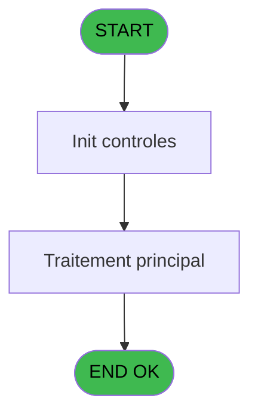
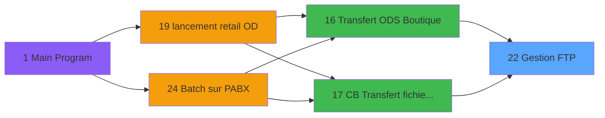

# POO IDE 22 - Gestion FTP

> **Analyse**: Phases 1-4 2026-02-03 17:42 -> 17:43 (17s) | Assemblage 17:43
> **Pipeline**: V7.2 Enrichi
> **Structure**: 4 onglets (Resume | Ecrans | Donnees | Connexions)

<!-- TAB:Resume -->

## 1. FICHE D'IDENTITE

| Attribut | Valeur |
|----------|--------|
| Projet | POO |
| IDE Position | 22 |
| Nom Programme | Gestion FTP |
| Fichier source | `Prg_22.xml` |
| Dossier IDE | Pooling |
| Taches | 3 (0 ecrans visibles) |
| Tables modifiees | 0 |
| Programmes appeles | 0 |

## 2. DESCRIPTION FONCTIONNELLE

**Gestion FTP** assure la gestion complete de ce processus, accessible depuis [Transfert ODS Boutique (IDE 16)](POO-IDE-16.md), [CB Transfert fichiers GM (IDE 17)](POO-IDE-17.md).

Le flux de traitement s'organise en **2 blocs fonctionnels** :

- **Traitement** (2 taches) : traitements metier divers
- **Creation** (1 tache) : insertion d'enregistrements en base (mouvements, prestations)

Detail : phases du traitement

#### Phase 1 : Traitement (2 taches)

- **22** - Gestion FTP
- **22.2** - Boucle Attente

#### Phase 2 : Creation (1 tache)

- **22.1** - Ajout Commandes

## 3. BLOCS FONCTIONNELS

### 3.1 Traitement (2 taches)

Traitements internes.

---

#### 22 - Gestion FTP

**Role** : Gestion du moyen de paiement : Gestion FTP.

---

#### 22.2 - Boucle Attente

**Role** : Traitement : Boucle Attente.

### 3.2 Creation (1 tache)

Insertion de nouveaux enregistrements en base.

---

#### 22.1 - Ajout Commandes

**Role** : Creation d'enregistrement : Ajout Commandes.

## 5. REGLES METIER

*(Aucune regle metier identifiee)*

## 6. CONTEXTE

- **Appele par**: [Transfert ODS Boutique (IDE 16)](POO-IDE-16.md), [CB Transfert fichiers GM (IDE 17)](POO-IDE-17.md)
- **Appelle**: 0 programmes | **Tables**: 0 (W:0 R:0 L:0) | **Taches**: 3 | **Expressions**: 7

<!-- TAB:Ecrans -->

## 8. ECRANS

*(Programme sans ecran visible)*

## 9. NAVIGATION

### 9.3 Structure hierarchique (3 taches)

| Position | Tache | Type | Dimensions | Bloc |
|----------|-------|------|------------|------|
| **22.1** | [**Gestion FTP** (22)](#t1) | MDI | - | Traitement |
| 22.1.1 | [Boucle Attente (22.2)](#t3) | MDI | - | |
| **22.2** | [**Ajout Commandes** (22.1)](#t2) | MDI | - | Creation |

### 9.4 Algorigramme

> **Legende**: Vert = START/END OK | Rouge = END KO | Bleu = Decisions
> *Algorigramme auto-genere. Utiliser `/algorigramme` pour une synthese metier detaillee.*

<!-- TAB:Donnees -->

## 10. TABLES

### Tables utilisees (0)

| ID | Nom | Description | Type | R | W | L | Usages |
|----|-----|-------------|------|---|---|---|--------|

### Colonnes par table (0 / 0 tables avec colonnes identifiees)

## 11. VARIABLES

### 11.1 Parametres entrants (2)

Variables recues du programme appelant ([Transfert ODS Boutique (IDE 16)](POO-IDE-16.md)).

| Lettre | Nom | Type | Usage dans |
|--------|-----|------|-----------|
| A | p. Commande | Alpha | [22.1](#t2) |
| B | p. Nom Fichier | Alpha | 1x parametre entrant |

### 11.2 Variables de session (1)

Variables persistantes pendant toute la session.

| Lettre | Nom | Type | Usage dans |
|--------|-----|------|-----------|
| C | v.nom script | Alpha | 2x session |

## 12. EXPRESSIONS

**7 / 7 expressions decodees (100%)**

### 12.1 Repartition par type

| Type | Expressions | Regles |
|------|-------------|--------|
| CALCULATION | 1 | 0 |
| CONSTANTE | 1 | 0 |
| CONCATENATION | 2 | 0 |
| NEGATION | 1 | 0 |
| CONDITION | 1 | 0 |
| STRING | 1 | 0 |

### 12.2 Expressions cles par type

#### CALCULATION (1 expressions)

| Type | IDE | Expression | Regle |
|------|-----|------------|-------|
| CALCULATION | 7 | `'ftp -s:c:\temp\'&Trim (v.nom script [C])` | - |

#### CONSTANTE (1 expressions)

| Type | IDE | Expression | Regle |
|------|-----|------------|-------|
| CONSTANTE | 1 | `'cmd /c mkdir c:\temp'` | - |

#### CONCATENATION (2 expressions)

| Type | IDE | Expression | Regle |
|------|-----|------------|-------|
| CONCATENATION | 6 | `FileCopy (INIGet ('[MAGIC_LOGICAL_NAMES]club_nt_homedir')&'comm_ftp.txt','c:\temp\'&Trim (v.nom script [C]))` | - |
| CONCATENATION | 3 | `'transftp_'&DStr (Date (),'YYYYMMDD')&TStr (Time (),'HHMMSS')&'.txt'` | - |

#### NEGATION (1 expressions)

| Type | IDE | Expression | Regle |
|------|-----|------------|-------|
| NEGATION | 2 | `NOT (FileExist ('c:\temp'))` | - |

#### CONDITION (1 expressions)

| Type | IDE | Expression | Regle |
|------|-----|------------|-------|
| CONDITION | 5 | `p. Commande [A]='G'` | - |

#### STRING (1 expressions)

| Type | IDE | Expression | Regle |
|------|-----|------------|-------|
| STRING | 4 | `FileDelete ('c:\temp\'&Trim (p. Nom Fichier [B]))` | - |

<!-- TAB:Connexions -->

## 13. GRAPHE D'APPELS

### 13.1 Chaine depuis Main (Callers)

Main -> ... -> [Transfert ODS Boutique (IDE 16)](POO-IDE-16.md) -> **Gestion FTP (IDE 22)**

Main -> ... -> [CB Transfert fichiers GM (IDE 17)](POO-IDE-17.md) -> **Gestion FTP (IDE 22)**

### 13.2 Callers

| IDE | Nom Programme | Nb Appels |
|-----|---------------|-----------|
| [16](POO-IDE-16.md) | Transfert ODS Boutique | 4 |
| [17](POO-IDE-17.md) | CB Transfert fichiers GM | 2 |

### 13.3 Callees (programmes appeles)

### 13.4 Detail Callees avec contexte

| IDE | Nom Programme | Appels | Contexte |
|-----|---------------|--------|----------|
| - | (aucun) | - | - |

## 14. RECOMMANDATIONS MIGRATION

### 14.1 Profil du programme

| Metrique | Valeur | Impact migration |
|----------|--------|-----------------|
| Lignes de logique | 24 | Programme compact |
| Expressions | 7 | Peu de logique |
| Tables WRITE | 0 | Impact faible |
| Sous-programmes | 0 | Peu de dependances |
| Ecrans visibles | 0 | Ecran unique ou traitement batch |
| Code desactive | 0% (0 / 24) | Code sain |
| Regles metier | 0 | Pas de regle identifiee |

### 14.2 Plan de migration par bloc

#### Traitement (2 taches: 0 ecran, 2 traitements)

- **Strategie** : 2 service(s) backend injectable(s) (Domain Services).
- Decomposer les taches en services unitaires testables.

#### Creation (1 tache: 0 ecran, 1 traitement)

- **Strategie** : Repository pattern avec Entity Framework Core.
- Insertion via `IRepository<T>.CreateAsync()`

### 14.3 Dependances critiques

| Dependance | Type | Appels | Impact |
|------------|------|--------|--------|

---
*Spec DETAILED generee par Pipeline V7.2 - 2026-02-03 17:43*
