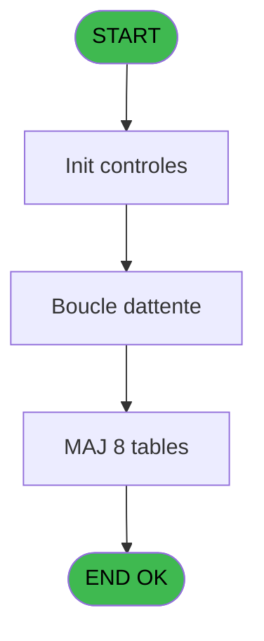
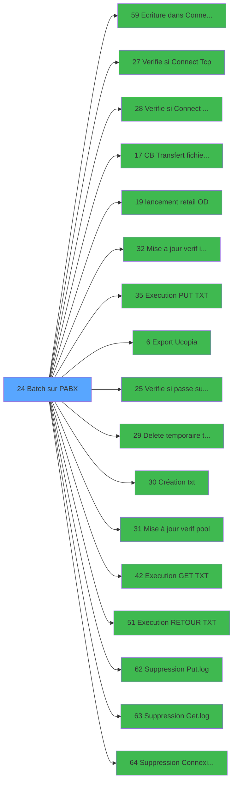

# POO IDE 24 - Batch sur PABX

> **Analyse**: Phases 1-4 2026-02-03 17:43 -> 17:43 (18s) | Assemblage 17:43
> **Pipeline**: V7.2 Enrichi
> **Structure**: 4 onglets (Resume | Ecrans | Donnees | Connexions)

<!-- TAB:Resume -->

## 1. FICHE D'IDENTITE

| Attribut | Valeur |
|----------|--------|
| Projet | POO |
| IDE Position | 24 |
| Nom Programme | Batch sur PABX |
| Fichier source | `Prg_24.xml` |
| Dossier IDE | Pooling |
| Taches | 35 (4 ecrans visibles) |
| Tables modifiees | 8 |
| Programmes appeles | 17 |

## 2. DESCRIPTION FONCTIONNELLE

**Batch sur PABX** assure la gestion complete de ce processus, accessible depuis [Main Program (IDE 1)](POO-IDE-1.md).

Le flux de traitement s'organise en **5 blocs fonctionnels** :

- **Traitement** (29 taches) : traitements metier divers
- **Initialisation** (3 taches) : reinitialisation d'etats et de variables de travail
- **Impression** (1 tache) : generation de tickets et documents
- **Validation** (1 tache) : controles et verifications de coherence
- **Consultation** (1 tache) : ecrans de recherche, selection et consultation

**Donnees modifiees** : 8 tables en ecriture (fichier_tampon_pabx, comptable________cte, compte_gm________cgm, commande_autocom_cot, historique_pabx, erreur_pabx, intermed__gratuititg, intermed_compta__ite).

**Logique metier** : 9 regles identifiees couvrant conditions metier.

Detail : phases du traitement

#### Phase 1 : Traitement (29 taches)

- **24** - En cours  ... **[[ECRAN]](#ecran-t1)**
- **24.1** - Lecture de PARAMETRE
- **24.2** - Lecture de PARAMETRE
- **24.5** - Boucle d'attente **[[ECRAN]](#ecran-t8)**
- **24.6** - Traitement après GETTRS **[[ECRAN]](#ecran-t9)**
- **24.7** - Lecture TAMPON pour non traite
- **24.8** - (sans nom) **[[ECRAN]](#ecran-t11)**
- **24.8.1** - Traitement après GETTRS **[[ECRAN]](#ecran-t12)**
- **24.8.1.1** - Ecriture dans TAMPON **[[ECRAN]](#ecran-t13)**
- **24.8.2** - Contrôle Zones / Traitements **[[ECRAN]](#ecran-t14)**
- **24.8.2.1** - Gestion des Erreurs
- **24.8.2.2** - Gestion des Erreurs
- **24.8.2.3** - Gestion des Erreurs
- **24.8.2.5** - (sans nom)
- **24.8.2.5.1** - Ecriture dans CTE
- **24.8.2.5.1.1** - Ecriture dans CTE
- **24.8.2.5.2** - Ecriture dans CTE
- **24.8.2.6** - (sans nom)
- **24.8.2.6.1** - Ecriture dans CTE
- **24.8.2.6.2** - Ecriture dans CTE
- **24.8.2.7** - Ecriture dans CTE
- **24.8.2.8** - Traitement chambre prête
- **24.8.2.9** - Traitement chambre prête
- **24.9** - Traitement des PUTTRS **[[ECRAN]](#ecran-t29)**
- **24.9.1** - Lecture du Fichier STATUS **[[ECRAN]](#ecran-t30)**
- **24.9.1.1** - Gestion des Erreurs **[[ECRAN]](#ecran-t31)**
- **24.9.2** - Destruction des dejà traites
- **24.9.3** - TEST HEURE
- **24.12** - view

Delegue a : [Ecriture dans Connexion.log (IDE 59)](POO-IDE-59.md), [lancement retail OD (IDE 19)](POO-IDE-19.md), [Execution PUT TXT (IDE 35)](POO-IDE-35.md), [Export Ucopia (IDE 6)](POO-IDE-6.md), [Création txt (IDE 30)](POO-IDE-30.md), [Execution GET TXT (IDE 42)](POO-IDE-42.md), [Execution RETOUR TXT (IDE 51)](POO-IDE-51.md), [Suppression Put.log (IDE 62)](POO-IDE-62.md), [Suppression Get.log (IDE 63)](POO-IDE-63.md), [Suppression Connexion.log (IDE 64)](POO-IDE-64.md)

#### Phase 2 : Initialisation (3 taches)

- **24.3** - Lecture Initialisation Village
- **24.4** - Lecture Initialisation Village
- **24.10** - Init

#### Phase 3 : Consultation (1 tache)

- **24.8.2.4** - Recherche Gratuite GAC

Delegue a : [Execution GET TXT (IDE 42)](POO-IDE-42.md), [Suppression Get.log (IDE 63)](POO-IDE-63.md)

#### Phase 4 : Validation (1 tache)

- **24.11** - Verif tempon

Delegue a : [  Verifie si Connect Tcp (IDE 27)](POO-IDE-27.md), [  Verifie si Connect Tcp b (IDE 28)](POO-IDE-28.md), [Mise a jour verif informatel (IDE 32)](POO-IDE-32.md), [  Verifie si passe sur histo (IDE 25)](POO-IDE-25.md), [Mise à jour verif pool (IDE 31)](POO-IDE-31.md)

#### Phase 5 : Impression (1 tache)

- **24.11.1** - Delete tempon tickets

Delegue a : [  Delete temporaire ticket (IDE 29)](POO-IDE-29.md)

#### Tables impactees

| Table | Operations | Role metier |
|-------|-----------|-------------|
| fichier_tampon_pabx | R/**W**/L (4 usages) |  |
| commande_autocom_cot | **W** (3 usages) |  |
| erreur_pabx | **W** (2 usages) |  |
| compte_gm________cgm | **W** (2 usages) | Comptes GM (generaux) |
| intermed_compta__ite | **W** (1 usages) |  |
| comptable________cte | **W** (1 usages) |  |
| historique_pabx | **W** (1 usages) | Historique / journal |
| intermed__gratuititg | **W** (1 usages) |  |

## 3. BLOCS FONCTIONNELS

### 3.1 Traitement (29 taches)

Traitements internes.

---

#### 24 - En cours  ... [[ECRAN]](#ecran-t1)

**Role** : Tache d'orchestration : point d'entree du programme (29 sous-taches). Coordonne l'enchainement des traitements.
**Ecran** : 773 x 246 DLU (MDI) | [Voir mockup](#ecran-t1)

28 sous-taches directes

| Tache | Nom | Bloc |
|-------|-----|------|
| [24.1](#t3) | Lecture de PARAMETRE | Traitement |
| [24.2](#t5) | Lecture de PARAMETRE | Traitement |
| [24.5](#t8) | Boucle d'attente **[[ECRAN]](#ecran-t8)** | Traitement |
| [24.6](#t9) | Traitement après GETTRS **[[ECRAN]](#ecran-t9)** | Traitement |
| [24.7](#t10) | Lecture TAMPON pour non traite | Traitement |
| [24.8](#t11) | (sans nom) **[[ECRAN]](#ecran-t11)** | Traitement |
| [24.8.1](#t12) | Traitement après GETTRS **[[ECRAN]](#ecran-t12)** | Traitement |
| [24.8.1.1](#t13) | Ecriture dans TAMPON **[[ECRAN]](#ecran-t13)** | Traitement |
| [24.8.2](#t14) | Contrôle Zones / Traitements **[[ECRAN]](#ecran-t14)** | Traitement |
| [24.8.2.1](#t15) | Gestion des Erreurs | Traitement |
| [24.8.2.2](#t16) | Gestion des Erreurs | Traitement |
| [24.8.2.3](#t17) | Gestion des Erreurs | Traitement |
| [24.8.2.5](#t19) | (sans nom) | Traitement |
| [24.8.2.5.1](#t20) | Ecriture dans CTE | Traitement |
| [24.8.2.5.1.1](#t21) | Ecriture dans CTE | Traitement |
| [24.8.2.5.2](#t22) | Ecriture dans CTE | Traitement |
| [24.8.2.6](#t23) | (sans nom) | Traitement |
| [24.8.2.6.1](#t24) | Ecriture dans CTE | Traitement |
| [24.8.2.6.2](#t25) | Ecriture dans CTE | Traitement |
| [24.8.2.7](#t26) | Ecriture dans CTE | Traitement |
| [24.8.2.8](#t27) | Traitement chambre prête | Traitement |
| [24.8.2.9](#t28) | Traitement chambre prête | Traitement |
| [24.9](#t29) | Traitement des PUTTRS **[[ECRAN]](#ecran-t29)** | Traitement |
| [24.9.1](#t30) | Lecture du Fichier STATUS **[[ECRAN]](#ecran-t30)** | Traitement |
| [24.9.1.1](#t31) | Gestion des Erreurs **[[ECRAN]](#ecran-t31)** | Traitement |
| [24.9.2](#t32) | Destruction des dejà traites | Traitement |
| [24.9.3](#t33) | TEST HEURE | Traitement |
| [24.12](#t37) | view | Traitement |

**Variables liees** : BE (W0 Type en cours)

---

#### 24.1 - Lecture de PARAMETRE

**Role** : Traitement : Lecture de PARAMETRE.

---

#### 24.2 - Lecture de PARAMETRE

**Role** : Traitement : Lecture de PARAMETRE.

---

#### 24.5 - Boucle d'attente [[ECRAN]](#ecran-t8)

**Role** : Traitement : Boucle d'attente.
**Ecran** : 107 x 12 DLU (Modal) | [Voir mockup](#ecran-t8)
**Variables liees** : B (W0 Nombre de Boucles), CJ (v. demande sortie (boucle)), CK (v. boucle verif)

---

#### 24.6 - Traitement après GETTRS [[ECRAN]](#ecran-t9)

**Role** : Consultation/chargement : Traitement après GETTRS.
**Ecran** : 96 x 40 DLU (MDI) | [Voir mockup](#ecran-t9)
**Variables liees** : R (W0 Type Traitement 1), U (W0 Type Traitement 2)

---

#### 24.7 - Lecture TAMPON pour non traite

**Role** : Traitement : Lecture TAMPON pour non traite.
**Variables liees** : H (W0 GETTEL A traiter), Q (W0 1 non traite au -), R (W0 Type Traitement 1), U (W0 Type Traitement 2), Y (W0 Detruit TAMPON)

---

#### 24.8 - (sans nom) [[ECRAN]](#ecran-t11)

**Role** : Traitement interne.
**Ecran** : 51 x 10 DLU (Modal) | [Voir mockup](#ecran-t11)

---

#### 24.8.1 - Traitement après GETTRS [[ECRAN]](#ecran-t12)

**Role** : Consultation/chargement : Traitement après GETTRS.
**Ecran** : 120 x 48 DLU (MDI) | [Voir mockup](#ecran-t12)
**Variables liees** : R (W0 Type Traitement 1), U (W0 Type Traitement 2)

---

#### 24.8.1.1 - Ecriture dans TAMPON [[ECRAN]](#ecran-t13)

**Role** : Traitement : Ecriture dans TAMPON.
**Ecran** : 104 x 24 DLU (MDI) | [Voir mockup](#ecran-t13)
**Variables liees** : Y (W0 Detruit TAMPON), CB (W0 non ecriture log d), CC (W0 non ecriture log c), CL (v. verifie si ecrit dans histo)

---

#### 24.8.2 - Contrôle Zones / Traitements [[ECRAN]](#ecran-t14)

**Role** : Traitement : Contrôle Zones / Traitements.
**Ecran** : 1315 x 332 DLU (MDI) | [Voir mockup](#ecran-t14)

---

#### 24.8.2.1 - Gestion des Erreurs

**Role** : Gestion du moyen de paiement : Gestion des Erreurs.

---

#### 24.8.2.2 - Gestion des Erreurs

**Role** : Gestion du moyen de paiement : Gestion des Erreurs.

---

#### 24.8.2.3 - Gestion des Erreurs

**Role** : Gestion du moyen de paiement : Gestion des Erreurs.

---

#### 24.8.2.5 - (sans nom)

**Role** : Traitement interne.

---

#### 24.8.2.5.1 - Ecriture dans CTE

**Role** : Traitement : Ecriture dans CTE.
**Variables liees** : CB (W0 non ecriture log d), CC (W0 non ecriture log c), CL (v. verifie si ecrit dans histo)

---

#### 24.8.2.5.1.1 - Ecriture dans CTE

**Role** : Traitement : Ecriture dans CTE.
**Variables liees** : CB (W0 non ecriture log d), CC (W0 non ecriture log c), CL (v. verifie si ecrit dans histo)

---

#### 24.8.2.5.2 - Ecriture dans CTE

**Role** : Traitement : Ecriture dans CTE.
**Variables liees** : CB (W0 non ecriture log d), CC (W0 non ecriture log c), CL (v. verifie si ecrit dans histo)

---

#### 24.8.2.6 - (sans nom)

**Role** : Traitement interne.

---

#### 24.8.2.6.1 - Ecriture dans CTE

**Role** : Traitement : Ecriture dans CTE.
**Variables liees** : CB (W0 non ecriture log d), CC (W0 non ecriture log c), CL (v. verifie si ecrit dans histo)

---

#### 24.8.2.6.2 - Ecriture dans CTE

**Role** : Traitement : Ecriture dans CTE.
**Variables liees** : CB (W0 non ecriture log d), CC (W0 non ecriture log c), CL (v. verifie si ecrit dans histo)

---

#### 24.8.2.7 - Ecriture dans CTE

**Role** : Traitement : Ecriture dans CTE.
**Variables liees** : CB (W0 non ecriture log d), CC (W0 non ecriture log c), CL (v. verifie si ecrit dans histo)

---

#### 24.8.2.8 - Traitement chambre prête

**Role** : Traitement : Traitement chambre prête.
**Variables liees** : R (W0 Type Traitement 1), U (W0 Type Traitement 2)

---

#### 24.8.2.9 - Traitement chambre prête

**Role** : Traitement : Traitement chambre prête.
**Variables liees** : R (W0 Type Traitement 1), U (W0 Type Traitement 2)

---

#### 24.9 - Traitement des PUTTRS [[ECRAN]](#ecran-t29)

**Role** : Traitement : Traitement des PUTTRS.
**Ecran** : 26 x 8 DLU (Modal) | [Voir mockup](#ecran-t29)
**Variables liees** : R (W0 Type Traitement 1), U (W0 Type Traitement 2)

---

#### 24.9.1 - Lecture du Fichier STATUS [[ECRAN]](#ecran-t30)

**Role** : Traitement : Lecture du Fichier STATUS.
**Ecran** : 4 x 8 DLU (Modal) | [Voir mockup](#ecran-t30)

---

#### 24.9.1.1 - Gestion des Erreurs [[ECRAN]](#ecran-t31)

**Role** : Gestion du moyen de paiement : Gestion des Erreurs.
**Ecran** : 4 x 8 DLU (Modal) | [Voir mockup](#ecran-t31)

---

#### 24.9.2 - Destruction des dejà traites

**Role** : Traitement : Destruction des dejà traites.

---

#### 24.9.3 - TEST HEURE

**Role** : Verification : TEST HEURE.
**Variables liees** : X (W0 Test ou Exploit.), BF (W0 Heure Debut), BG (W0 Heure Fin), BO (W0 heure)

---

#### 24.12 - view

**Role** : Traitement : view.

### 3.2 Initialisation (3 taches)

Reinitialisation d'etats et variables de travail.

---

#### 24.3 - Lecture Initialisation Village

**Role** : Reinitialisation : Lecture Initialisation Village.

---

#### 24.4 - Lecture Initialisation Village

**Role** : Reinitialisation : Lecture Initialisation Village.

---

#### 24.10 - Init

**Role** : Reinitialisation : Init.

### 3.3 Consultation (1 tache)

Ecrans de recherche et consultation.

---

#### 24.8.2.4 - Recherche Gratuite GAC

**Role** : Traitement : Recherche Gratuite GAC.

### 3.4 Validation (1 tache)

Controles de coherence : 1 tache verifie les donnees et conditions.

---

#### 24.11 - Verif tempon

**Role** : Verification : Verif tempon.
**Variables liees** : CK (v. boucle verif), CL (v. verifie si ecrit dans histo)
**Delegue a** : [  Verifie si Connect Tcp (IDE 27)](POO-IDE-27.md), [  Verifie si Connect Tcp b (IDE 28)](POO-IDE-28.md), [Mise a jour verif informatel (IDE 32)](POO-IDE-32.md)

### 3.5 Impression (1 tache)

Generation des documents et tickets.

---

#### 24.11.1 - Delete tempon tickets

**Role** : Generation du document : Delete tempon tickets.
**Variables liees** : CD (W0 edition tickets ?)
**Delegue a** : [  Delete temporaire ticket (IDE 29)](POO-IDE-29.md)

## 5. REGLES METIER

9 regles identifiees:

### Autres (9 regles)

#### [RM-001] Si W0 Nombre de Boucles [B]>999999999999999 alors 1 sinon W0 Nombre de Boucles [B]+1)

| Element | Detail |
|---------|--------|
| **Condition** | `W0 Nombre de Boucles [B]>999999999999999` |
| **Si vrai** | 1 |
| **Si faux** | W0 Nombre de Boucles [B]+1) |
| **Variables** | B (W0 Nombre de Boucles) |
| **Expression source** | Expression 5 : `IF (W0 Nombre de Boucles [B]>999999999999999,1,W0 Nombre de ` |
| **Exemple** | Si W0 Nombre de Boucles [B]>999999999999999 → 1. Sinon → W0 Nombre de Boucles [B]+1) |
| **Impact** | [24.5 - Boucle d'attente](#t8) |

#### [RM-002] Si [AE]=1 alors 7 sinon 1)

| Element | Detail |
|---------|--------|
| **Condition** | `[AE]=1` |
| **Si vrai** | 7 |
| **Si faux** | 1) |
| **Expression source** | Expression 24 : `IF ([AE]=1,7,1)` |
| **Exemple** | Si [AE]=1 → 7. Sinon → 1) |

#### [RM-003] Si [AE]=2 alors 7 sinon 1)

| Element | Detail |
|---------|--------|
| **Condition** | `[AE]=2` |
| **Si vrai** | 7 |
| **Si faux** | 1) |
| **Expression source** | Expression 25 : `IF ([AE]=2,7,1)` |
| **Exemple** | Si [AE]=2 → 7. Sinon → 1) |

#### [RM-004] Si W0 Test ou Exploit. [X]='E' alors '' sinon 'Test')

| Element | Detail |
|---------|--------|
| **Condition** | `W0 Test ou Exploit. [X]='E'` |
| **Si vrai** | '' |
| **Si faux** | 'Test') |
| **Variables** | X (W0 Test ou Exploit.) |
| **Expression source** | Expression 39 : `IF (W0 Test ou Exploit. [X]='E','','Test')` |
| **Exemple** | Si W0 Test ou Exploit. [X]='E' → ''. Sinon → 'Test') |
| **Impact** | [24.9.3 - TEST HEURE](#t33) |

#### [RM-005] Si W0 Detruit TAMPON [Y]='O' alors '' sinon 'Garde TAMPON')

| Element | Detail |
|---------|--------|
| **Condition** | `W0 Detruit TAMPON [Y]='O'` |
| **Si vrai** | '' |
| **Si faux** | 'Garde TAMPON') |
| **Variables** | Y (W0 Detruit TAMPON) |
| **Expression source** | Expression 40 : `IF (W0 Detruit TAMPON [Y]='O','','Garde TAMPON')` |
| **Exemple** | Si W0 Detruit TAMPON [Y]='O' → ''. Sinon → 'Garde TAMPON') |

#### [RM-006] Si W0 Detruit ASCII [Z]='O' alors '' sinon 'Garde ASCII')

| Element | Detail |
|---------|--------|
| **Condition** | `W0 Detruit ASCII [Z]='O'` |
| **Si vrai** | '' |
| **Si faux** | 'Garde ASCII') |
| **Variables** | Z (W0 Detruit ASCII) |
| **Expression source** | Expression 41 : `IF (W0 Detruit ASCII [Z]='O','','Garde ASCII')` |
| **Exemple** | Si W0 Detruit ASCII [Z]='O' → ''. Sinon → 'Garde ASCII') |

#### [RM-007] Si [AA]='O' alors '' sinon 'Garde AFAIRE')

| Element | Detail |
|---------|--------|
| **Condition** | `[AA]='O'` |
| **Si vrai** | '' |
| **Si faux** | 'Garde AFAIRE') |
| **Expression source** | Expression 42 : `IF ([AA]='O','','Garde AFAIRE')` |
| **Exemple** | Si [AA]='O' → ''. Sinon → 'Garde AFAIRE') |

#### [RM-008] Si [AS] alors 7 sinon 11)

| Element | Detail |
|---------|--------|
| **Condition** | `[AS]` |
| **Si vrai** | 7 |
| **Si faux** | 11) |
| **Expression source** | Expression 43 : `IF ([AS],7,11)` |
| **Exemple** | Si [AS] → 7. Sinon → 11) |

#### [RM-009] Si Trim (INIGet ('[MAGIC_LOGICAL_NAMES]club_pool_phone'))='Y' alors W0 Nombre de Boucles [B] MOD 12=0 sinon W0 Nombre de Boucles [B] MOD 150=0)

| Element | Detail |
|---------|--------|
| **Condition** | `Trim (INIGet ('[MAGIC_LOGICAL_NAMES]club_pool_phone'))='Y'` |
| **Si vrai** | W0 Nombre de Boucles [B] MOD 12=0 |
| **Si faux** | W0 Nombre de Boucles [B] MOD 150=0) |
| **Variables** | B (W0 Nombre de Boucles) |
| **Expression source** | Expression 82 : `IF (Trim (INIGet ('[MAGIC_LOGICAL_NAMES]club_pool_phone'))='` |
| **Exemple** | Si Trim (INIGet ('[MAGIC_LOGICAL_NAMES]club_pool_phone'))='Y' → W0 Nombre de Boucles [B] MOD 12=0. Sinon → W0 Nombre de Boucles [B] MOD 150=0) |
| **Impact** | [24.5 - Boucle d'attente](#t8) |

## 6. CONTEXTE

- **Appele par**: [Main Program (IDE 1)](POO-IDE-1.md)
- **Appelle**: 17 programmes | **Tables**: 25 (W:8 R:9 L:11) | **Taches**: 35 | **Expressions**: 94

<!-- TAB:Ecrans -->

## 8. ECRANS

### 8.1 Forms visibles (4 / 35)

| # | Position | Tache | Nom | Type | Largeur | Hauteur | Bloc |
|---|----------|-------|-----|------|---------|---------|------|
| 1 | 24 | 24 | En cours  ... | MDI | 773 | 246 | Traitement |
| 2 | 24.5 | 24.5 | Boucle d'attente | Modal | 107 | 12 | Traitement |
| 3 | 24.8 | 24.8 | (sans nom) | Modal | 51 | 10 | Traitement |
| 4 | 24.8.1 | 24.8.1 | Traitement après GETTRS | MDI | 120 | 48 | Traitement |

### 8.2 Mockups Ecrans

---

#### 24 - En cours  ...
**Tache** : [24](#t1) | **Type** : MDI | **Dimensions** : 773 x 246 DLU
**Bloc** : Traitement | **Titre IDE** : En cours  ...

<!-- FORM-DATA:
{
    "width":  773,
    "vFactor":  8,
    "type":  "MDI",
    "hFactor":  8,
    "controls":  [
                     {
                         "x":  573,
                         "type":  "label",
                         "var":  "",
                         "y":  2,
                         "w":  200,
                         "fmt":  "",
                         "name":  "",
                         "h":  8,
                         "color":  "143",
                         "text":  "V.3.19 du 26/08/2014",
                         "parent":  null
                     },
                     {
                         "x":  242,
                         "type":  "label",
                         "var":  "",
                         "y":  9,
                         "w":  290,
                         "fmt":  "",
                         "name":  "",
                         "h":  8,
                         "color":  "7",
                         "text":  " COLLECTE PABX",
                         "parent":  null
                     },
                     {
                         "x":  4,
                         "type":  "line",
                         "var":  "",
                         "y":  27,
                         "w":  757,
                         "fmt":  "",
                         "name":  "",
                         "h":  0,
                         "color":  "",
                         "text":  "",
                         "parent":  null
                     },
                     {
                         "x":  8,
                         "type":  "label",
                         "var":  "",
                         "y":  33,
                         "w":  759,
                         "fmt":  "",
                         "name":  "",
                         "h":  167,
                         "color":  "",
                         "text":  "",
                         "parent":  null
                     },
                     {
                         "x":  10,
                         "type":  "label",
                         "var":  "",
                         "y":  34,
                         "w":  754,
                         "fmt":  "",
                         "name":  "",
                         "h":  64,
                         "color":  "",
                         "text":  "",
                         "parent":  null
                     },
                     {
                         "x":  21,
                         "type":  "label",
                         "var":  "",
                         "y":  37,
                         "w":  72,
                         "fmt":  "",
                         "name":  "",
                         "h":  8,
                         "color":  "",
                         "text":  "Boucles",
                         "parent":  6
                     },
                     {
                         "x":  21,
                         "type":  "label",
                         "var":  "",
                         "y":  47,
                         "w":  120,
                         "fmt":  "",
                         "name":  "",
                         "h":  8,
                         "color":  "",
                         "text":  "Debut Session",
                         "parent":  6
                     },
                     {
                         "x":  21,
                         "type":  "label",
                         "var":  "",
                         "y":  57,
                         "w":  154,
                         "fmt":  "",
                         "name":  "",
                         "h":  8,
                         "color":  "",
                         "text":  "Transac Telephone",
                         "parent":  6
                     },
                     {
                         "x":  21,
                         "type":  "label",
                         "var":  "",
                         "y":  70,
                         "w":  154,
                         "fmt":  "",
                         "name":  "",
                         "h":  8,
                         "color":  "",
                         "text":  "Transac Boutique",
                         "parent":  6
                     },
                     {
                         "x":  21,
                         "type":  "label",
                         "var":  "",
                         "y":  83,
                         "w":  154,
                         "fmt":  "",
                         "name":  "",
                         "h":  8,
                         "color":  "",
                         "text":  "Transac Vin",
                         "parent":  6
                     },
                     {
                         "x":  10,
                         "type":  "label",
                         "var":  "",
                         "y":  98,
                         "w":  165,
                         "fmt":  "",
                         "name":  "",
                         "h":  86,
                         "color":  "",
                         "text":  "",
                         "parent":  null
                     },
                     {
                         "x":  175,
                         "type":  "label",
                         "var":  "",
                         "y":  98,
                         "w":  154,
                         "fmt":  "",
                         "name":  "",
                         "h":  86,
                         "color":  "",
                         "text":  "",
                         "parent":  null
                     },
                     {
                         "x":  329,
                         "type":  "label",
                         "var":  "",
                         "y":  98,
                         "w":  321,
                         "fmt":  "",
                         "name":  "",
                         "h":  86,
                         "color":  "",
                         "text":  "",
                         "parent":  null
                     },
                     {
                         "x":  649,
                         "type":  "label",
                         "var":  "",
                         "y":  98,
                         "w":  116,
                         "fmt":  "",
                         "name":  "",
                         "h":  86,
                         "color":  "",
                         "text":  "",
                         "parent":  null
                     },
                     {
                         "x":  43,
                         "type":  "label",
                         "var":  "",
                         "y":  100,
                         "w":  112,
                         "fmt":  "",
                         "name":  "",
                         "h":  8,
                         "color":  "",
                         "text":  "Paramètres",
                         "parent":  24
                     },
                     {
                         "x":  192,
                         "type":  "label",
                         "var":  "",
                         "y":  100,
                         "w":  120,
                         "fmt":  "",
                         "name":  "",
                         "h":  8,
                         "color":  "",
                         "text":  " Boucle Att.",
                         "parent":  25
                     },
                     {
                         "x":  333,
                         "type":  "label",
                         "var":  "",
                         "y":  100,
                         "w":  128,
                         "fmt":  "",
                         "name":  "",
                         "h":  8,
                         "color":  "",
                         "text":  " Traitement",
                         "parent":  26
                     },
                     {
                         "x":  477,
                         "type":  "label",
                         "var":  "",
                         "y":  100,
                         "w":  154,
                         "fmt":  "",
                         "name":  "",
                         "h":  8,
                         "color":  "",
                         "text":  "Lecture/Ecriture",
                         "parent":  26
                     },
                     {
                         "x":  666,
                         "type":  "label",
                         "var":  "",
                         "y":  100,
                         "w":  83,
                         "fmt":  "",
                         "name":  "",
                         "h":  8,
                         "color":  "",
                         "text":  "Divers",
                         "parent":  27
                     },
                     {
                         "x":  182,
                         "type":  "label",
                         "var":  "",
                         "y":  116,
                         "w":  26,
                         "fmt":  "",
                         "name":  "",
                         "h":  8,
                         "color":  "7",
                         "text":  " D",
                         "parent":  25
                     },
                     {
                         "x":  333,
                         "type":  "label",
                         "var":  "",
                         "y":  116,
                         "w":  85,
                         "fmt":  "",
                         "name":  "",
                         "h":  8,
                         "color":  "7",
                         "text":  " GETTEL",
                         "parent":  26
                     },
                     {
                         "x":  422,
                         "type":  "label",
                         "var":  "",
                         "y":  116,
                         "w":  21,
                         "fmt":  "",
                         "name":  "",
                         "h":  8,
                         "color":  "",
                         "text":  "è",
                         "parent":  26
                     },
                     {
                         "x":  441,
                         "type":  "label",
                         "var":  "",
                         "y":  116,
                         "w":  86,
                         "fmt":  "",
                         "name":  "",
                         "h":  8,
                         "color":  "7",
                         "text":  " Header",
                         "parent":  26
                     },
                     {
                         "x":  441,
                         "type":  "label",
                         "var":  "",
                         "y":  125,
                         "w":  86,
                         "fmt":  "",
                         "name":  "",
                         "h":  8,
                         "color":  "7",
                         "text":  " Record",
                         "parent":  26
                     },
                     {
                         "x":  182,
                         "type":  "label",
                         "var":  "",
                         "y":  127,
                         "w":  26,
                         "fmt":  "",
                         "name":  "",
                         "h":  8,
                         "color":  "7",
                         "text":  " H",
                         "parent":  25
                     },
                     {
                         "x":  333,
                         "type":  "label",
                         "var":  "",
                         "y":  132,
                         "w":  85,
                         "fmt":  "",
                         "name":  "",
                         "h":  8,
                         "color":  "7",
                         "text":  " PUTTEL",
                         "parent":  26
                     },
                     {
                         "x":  441,
                         "type":  "label",
                         "var":  "",
                         "y":  134,
                         "w":  86,
                         "fmt":  "",
                         "name":  "",
                         "h":  8,
                         "color":  "7",
                         "text":  " Relecture",
                         "parent":  26
                     },
                     {
                         "x":  182,
                         "type":  "label",
                         "var":  "",
                         "y":  140,
                         "w":  22,
                         "fmt":  "",
                         "name":  "",
                         "h":  8,
                         "color":  "7",
                         "text":  " F",
                         "parent":  25
                     },
                     {
                         "x":  441,
                         "type":  "label",
                         "var":  "",
                         "y":  143,
                         "w":  86,
                         "fmt":  "",
                         "name":  "",
                         "h":  8,
                         "color":  "7",
                         "text":  " Erreur",
                         "parent":  26
                     },
                     {
                         "x":  368,
                         "type":  "label",
                         "var":  "",
                         "y":  145,
                         "w":  18,
                         "fmt":  "",
                         "name":  "",
                         "h":  8,
                         "color":  "",
                         "text":  "ê",
                         "parent":  26
                     },
                     {
                         "x":  441,
                         "type":  "label",
                         "var":  "",
                         "y":  152,
                         "w":  86,
                         "fmt":  "",
                         "name":  "",
                         "h":  8,
                         "color":  "7",
                         "text":  " Trailer",
                         "parent":  26
                     },
                     {
                         "x":  441,
                         "type":  "label",
                         "var":  "",
                         "y":  161,
                         "w":  86,
                         "fmt":  "",
                         "name":  "",
                         "h":  8,
                         "color":  "7",
                         "text":  " Article",
                         "parent":  26
                     },
                     {
                         "x":  441,
                         "type":  "label",
                         "var":  "",
                         "y":  169,
                         "w":  86,
                         "fmt":  "",
                         "name":  "",
                         "h":  8,
                         "color":  "7",
                         "text":  " Tampon",
                         "parent":  26
                     },
                     {
                         "x":  10,
                         "type":  "label",
                         "var":  "",
                         "y":  184,
                         "w":  754,
                         "fmt":  "",
                         "name":  "",
                         "h":  18,
                         "color":  "",
                         "text":  "",
                         "parent":  null
                     },
                     {
                         "x":  11,
                         "type":  "label",
                         "var":  "",
                         "y":  207,
                         "w":  751,
                         "fmt":  "",
                         "name":  "",
                         "h":  12,
                         "color":  "143",
                         "text":  "PROBLEME SUR LA CONNEXION PMS (appeler le support)",
                         "parent":  null
                     },
                     {
                         "x":  0,
                         "type":  "label",
                         "var":  "",
                         "y":  222,
                         "w":  773,
                         "fmt":  "",
                         "name":  "",
                         "h":  23,
                         "color":  "",
                         "text":  "",
                         "parent":  null
                     },
                     {
                         "x":  4,
                         "type":  "image",
                         "var":  "",
                         "y":  2,
                         "w":  72,
                         "fmt":  "",
                         "name":  "",
                         "h":  25,
                         "color":  "",
                         "text":  "",
                         "parent":  null
                     },
                     {
                         "x":  168,
                         "type":  "edit",
                         "var":  "",
                         "y":  35,
                         "w":  176,
                         "fmt":  "",
                         "name":  "",
                         "h":  8,
                         "color":  "",
                         "text":  "",
                         "parent":  6
                     },
                     {
                         "x":  363,
                         "type":  "edit",
                         "var":  "",
                         "y":  35,
                         "w":  30,
                         "fmt":  "",
                         "name":  "",
                         "h":  8,
                         "color":  "",
                         "text":  "",
                         "parent":  6
                     },
                     {
                         "x":  557,
                         "type":  "edit",
                         "var":  "",
                         "y":  35,
                         "w":  200,
                         "fmt":  "30",
                         "name":  "",
                         "h":  8,
                         "color":  "152",
                         "text":  "",
                         "parent":  6
                     },
                     {
                         "x":  557,
                         "type":  "edit",
                         "var":  "",
                         "y":  43,
                         "w":  200,
                         "fmt":  "30",
                         "name":  "",
                         "h":  8,
                         "color":  "152",
                         "text":  "",
                         "parent":  6
                     },
                     {
                         "x":  242,
                         "type":  "edit",
                         "var":  "",
                         "y":  45,
                         "w":  120,
                         "fmt":  "",
                         "name":  "",
                         "h":  8,
                         "color":  "",
                         "text":  "",
                         "parent":  6
                     },
                     {
                         "x":  368,
                         "type":  "edit",
                         "var":  "",
                         "y":  45,
                         "w":  98,
                         "fmt":  "",
                         "name":  "",
                         "h":  8,
                         "color":  "",
                         "text":  "",
                         "parent":  6
                     },
                     {
                         "x":  189,
                         "type":  "edit",
                         "var":  "",
                         "y":  57,
                         "w":  155,
                         "fmt":  "",
                         "name":  "",
                         "h":  8,
                         "color":  "",
                         "text":  "",
                         "parent":  6
                     },
                     {
                         "x":  557,
                         "type":  "edit",
                         "var":  "",
                         "y":  57,
                         "w":  200,
                         "fmt":  "30",
                         "name":  "",
                         "h":  8,
                         "color":  "150",
                         "text":  "",
                         "parent":  6
                     },
                     {
                         "x":  189,
                         "type":  "edit",
                         "var":  "",
                         "y":  70,
                         "w":  155,
                         "fmt":  "",
                         "name":  "",
                         "h":  8,
                         "color":  "",
                         "text":  "",
                         "parent":  6
                     },
                     {
                         "x":  557,
                         "type":  "edit",
                         "var":  "",
                         "y":  70,
                         "w":  200,
                         "fmt":  "30",
                         "name":  "",
                         "h":  8,
                         "color":  "150",
                         "text":  "",
                         "parent":  6
                     },
                     {
                         "x":  189,
                         "type":  "edit",
                         "var":  "",
                         "y":  83,
                         "w":  155,
                         "fmt":  "",
                         "name":  "",
                         "h":  8,
                         "color":  "",
                         "text":  "",
                         "parent":  6
                     },
                     {
                         "x":  557,
                         "type":  "edit",
                         "var":  "",
                         "y":  83,
                         "w":  200,
                         "fmt":  "30",
                         "name":  "",
                         "h":  8,
                         "color":  "150",
                         "text":  "",
                         "parent":  6
                     },
                     {
                         "x":  17,
                         "type":  "edit",
                         "var":  "",
                         "y":  116,
                         "w":  22,
                         "fmt":  "",
                         "name":  "",
                         "h":  9,
                         "color":  "2",
                         "text":  "",
                         "parent":  24
                     },
                     {
                         "x":  46,
                         "type":  "edit",
                         "var":  "",
                         "y":  116,
                         "w":  101,
                         "fmt":  "",
                         "name":  "",
                         "h":  9,
                         "color":  "2",
                         "text":  "",
                         "parent":  24
                     },
                     {
                         "x":  149,
                         "type":  "edit",
                         "var":  "",
                         "y":  116,
                         "w":  22,
                         "fmt":  "",
                         "name":  "",
                         "h":  9,
                         "color":  "",
                         "text":  "",
                         "parent":  24
                     },
                     {
                         "x":  222,
                         "type":  "edit",
                         "var":  "",
                         "y":  116,
                         "w":  101,
                         "fmt":  "",
                         "name":  "",
                         "h":  9,
                         "color":  "",
                         "text":  "",
                         "parent":  25
                     },
                     {
                         "x":  17,
                         "type":  "edit",
                         "var":  "",
                         "y":  125,
                         "w":  22,
                         "fmt":  "",
                         "name":  "",
                         "h":  9,
                         "color":  "2",
                         "text":  "",
                         "parent":  24
                     },
                     {
                         "x":  46,
                         "type":  "edit",
                         "var":  "",
                         "y":  125,
                         "w":  101,
                         "fmt":  "",
                         "name":  "",
                         "h":  9,
                         "color":  "2",
                         "text":  "",
                         "parent":  24
                     },
                     {
                         "x":  149,
                         "type":  "edit",
                         "var":  "",
                         "y":  125,
                         "w":  22,
                         "fmt":  "",
                         "name":  "",
                         "h":  9,
                         "color":  "",
                         "text":  "",
                         "parent":  24
                     },
                     {
                         "x":  222,
                         "type":  "edit",
                         "var":  "",
                         "y":  126,
                         "w":  101,
                         "fmt":  "",
                         "name":  "",
                         "h":  9,
                         "color":  "",
                         "text":  "",
                         "parent":  25
                     },
                     {
                         "x":  17,
                         "type":  "edit",
                         "var":  "",
                         "y":  135,
                         "w":  142,
                         "fmt":  "12",
                         "name":  "",
                         "h":  8,
                         "color":  "152",
                         "text":  "",
                         "parent":  24
                     },
                     {
                         "x":  17,
                         "type":  "edit",
                         "var":  "",
                         "y":  144,
                         "w":  142,
                         "fmt":  "12",
                         "name":  "",
                         "h":  8,
                         "color":  "152",
                         "text":  "",
                         "parent":  24
                     },
                     {
                         "x":  17,
                         "type":  "edit",
                         "var":  "",
                         "y":  153,
                         "w":  142,
                         "fmt":  "12",
                         "name":  "",
                         "h":  8,
                         "color":  "152",
                         "text":  "",
                         "parent":  24
                     },
                     {
                         "x":  17,
                         "type":  "edit",
                         "var":  "",
                         "y":  162,
                         "w":  142,
                         "fmt":  "12",
                         "name":  "",
                         "h":  8,
                         "color":  "152",
                         "text":  "",
                         "parent":  24
                     },
                     {
                         "x":  31,
                         "type":  "edit",
                         "var":  "",
                         "y":  189,
                         "w":  713,
                         "fmt":  "",
                         "name":  "",
                         "h":  9,
                         "color":  "",
                         "text":  "",
                         "parent":  59
                     },
                     {
                         "x":  8,
                         "type":  "button",
                         "var":  "",
                         "y":  225,
                         "w":  177,
                         "fmt":  "\u0026Quitter Pooling",
                         "name":  "",
                         "h":  18,
                         "color":  "",
                         "text":  "",
                         "parent":  null
                     },
                     {
                         "x":  192,
                         "type":  "button",
                         "var":  "",
                         "y":  225,
                         "w":  177,
                         "fmt":  "Quitter \u0026Traitement",
                         "name":  "",
                         "h":  18,
                         "color":  "",
                         "text":  "",
                         "parent":  null
                     }
                 ],
    "taskId":  "24",
    "height":  246
}
-->

<strong>Champs : 25 champs</strong>

| Pos (x,y) | Nom | Variable | Type |
|-----------|-----|----------|------|
| 168,35 | (sans nom) | - | edit |
| 363,35 | (sans nom) | - | edit |
| 557,35 | 30 | - | edit |
| 557,43 | 30 | - | edit |
| 242,45 | (sans nom) | - | edit |
| 368,45 | (sans nom) | - | edit |
| 189,57 | (sans nom) | - | edit |
| 557,57 | 30 | - | edit |
| 189,70 | (sans nom) | - | edit |
| 557,70 | 30 | - | edit |
| 189,83 | (sans nom) | - | edit |
| 557,83 | 30 | - | edit |
| 17,116 | (sans nom) | - | edit |
| 46,116 | (sans nom) | - | edit |
| 149,116 | (sans nom) | - | edit |
| 222,116 | (sans nom) | - | edit |
| 17,125 | (sans nom) | - | edit |
| 46,125 | (sans nom) | - | edit |
| 149,125 | (sans nom) | - | edit |
| 222,126 | (sans nom) | - | edit |
| 17,135 | 12 | - | edit |
| 17,144 | 12 | - | edit |
| 17,153 | 12 | - | edit |
| 17,162 | 12 | - | edit |
| 31,189 | (sans nom) | - | edit |

<strong>Boutons : 2 boutons</strong>

| Bouton | Pos (x,y) | Action |
|--------|-----------|--------|
| Quitter Pooling | 8,225 | Quitte le programme |
| Quitter Traitement | 192,225 | Quitte le programme |

---

#### 24.5 - Boucle d'attente
**Tache** : [24.5](#t8) | **Type** : Modal | **Dimensions** : 107 x 12 DLU
**Bloc** : Traitement | **Titre IDE** : Boucle d'attente

<!-- FORM-DATA:
{
    "width":  107,
    "vFactor":  8,
    "type":  "Modal",
    "hFactor":  8,
    "controls":  [
                     {
                         "x":  4,
                         "type":  "edit",
                         "var":  "",
                         "y":  1,
                         "w":  100,
                         "fmt":  "HH:MM:SS",
                         "name":  "",
                         "h":  9,
                         "color":  "6",
                         "text":  "",
                         "parent":  null
                     }
                 ],
    "taskId":  "24.5",
    "height":  12
}
-->

<strong>Champs : 1 champs</strong>

| Pos (x,y) | Nom | Variable | Type |
|-----------|-----|----------|------|
| 4,1 | HH:MM:SS | - | edit |

---

#### 24.8 - (sans nom)
**Tache** : [24.8](#t11) | **Type** : Modal | **Dimensions** : 51 x 10 DLU
**Bloc** : Traitement | **Titre IDE** : (sans nom)

<!-- FORM-DATA:
{
    "width":  51,
    "vFactor":  8,
    "type":  "Modal",
    "hFactor":  4,
    "controls":  [
                     {
                         "x":  0,
                         "type":  "edit",
                         "var":  "",
                         "y":  0,
                         "w":  50,
                         "fmt":  "",
                         "name":  "",
                         "h":  9,
                         "color":  "168",
                         "text":  "",
                         "parent":  null
                     }
                 ],
    "taskId":  "24.8",
    "height":  10
}
-->

<strong>Champs : 1 champs</strong>

| Pos (x,y) | Nom | Variable | Type |
|-----------|-----|----------|------|
| 0,0 | (sans nom) | - | edit |

---

#### 24.8.1 - Traitement après GETTRS
**Tache** : [24.8.1](#t12) | **Type** : MDI | **Dimensions** : 120 x 48 DLU
**Bloc** : Traitement | **Titre IDE** : Traitement après GETTRS

<!-- FORM-DATA:
{
    "width":  120,
    "vFactor":  8,
    "type":  "MDI",
    "hFactor":  8,
    "controls":  [
                     {
                         "x":  0,
                         "type":  "edit",
                         "var":  "",
                         "y":  0,
                         "w":  116,
                         "fmt":  "",
                         "name":  "",
                         "h":  10,
                         "color":  "168",
                         "text":  "",
                         "parent":  null
                     },
                     {
                         "x":  0,
                         "type":  "edit",
                         "var":  "",
                         "y":  38,
                         "w":  116,
                         "fmt":  "",
                         "name":  "",
                         "h":  10,
                         "color":  "168",
                         "text":  "",
                         "parent":  null
                     },
                     {
                         "x":  0,
                         "type":  "edit",
                         "var":  "",
                         "y":  9,
                         "w":  116,
                         "fmt":  "",
                         "name":  "",
                         "h":  10,
                         "color":  "168",
                         "text":  "",
                         "parent":  null
                     },
                     {
                         "x":  0,
                         "type":  "edit",
                         "var":  "",
                         "y":  19,
                         "w":  116,
                         "fmt":  "",
                         "name":  "",
                         "h":  10,
                         "color":  "168",
                         "text":  "",
                         "parent":  null
                     },
                     {
                         "x":  0,
                         "type":  "edit",
                         "var":  "",
                         "y":  29,
                         "w":  116,
                         "fmt":  "",
                         "name":  "",
                         "h":  10,
                         "color":  "168",
                         "text":  "",
                         "parent":  null
                     }
                 ],
    "taskId":  "24.8.1",
    "height":  48
}
-->

<strong>Champs : 5 champs</strong>

| Pos (x,y) | Nom | Variable | Type |
|-----------|-----|----------|------|
| 0,0 | (sans nom) | - | edit |
| 0,38 | (sans nom) | - | edit |
| 0,9 | (sans nom) | - | edit |
| 0,19 | (sans nom) | - | edit |
| 0,29 | (sans nom) | - | edit |

## 9. NAVIGATION

### 9.1 Enchainement des ecrans

```mermaid
flowchart TD
    START([Entree])
    style START fill:#3fb950
    VF1[24 En cours ...]
    style VF1 fill:#58a6ff
    VF8[24.5 Boucle dattente]
    style VF8 fill:#58a6ff
    VF11[24.8 sans nom]
    style VF11 fill:#58a6ff
    VF12[24.8.1 Traitement après G...]
    style VF12 fill:#58a6ff
    EXT59[IDE 59 Ecriture dans C...]
    style EXT59 fill:#3fb950
    EXT27[IDE 27 Verifie si Conn...]
    style EXT27 fill:#3fb950
    EXT28[IDE 28 Verifie si Conn...]
    style EXT28 fill:#3fb950
    EXT17[IDE 17 CB Transfert fi...]
    style EXT17 fill:#3fb950
    EXT19[IDE 19 lancement retai...]
    style EXT19 fill:#3fb950
    EXT32[IDE 32 Mise a jour ver...]
    style EXT32 fill:#3fb950
    EXT35[IDE 35 Execution PUT TXT]
    style EXT35 fill:#3fb950
    EXT6[IDE 6 Export Ucopia]
    style EXT6 fill:#3fb950
    EXT25[IDE 25 Verifie si pass...]
    style EXT25 fill:#3fb950
    EXT29[IDE 29 Delete temporai...]
    style EXT29 fill:#3fb950
    EXT30[IDE 30 Création txt]
    style EXT30 fill:#3fb950
    EXT31[IDE 31 Mise à jour ver...]
    style EXT31 fill:#3fb950
    EXT42[IDE 42 Execution GET TXT]
    style EXT42 fill:#3fb950
    EXT51[IDE 51 Execution RETOU...]
    style EXT51 fill:#3fb950
    EXT62[IDE 62 Suppression Put...]
    style EXT62 fill:#3fb950
    EXT63[IDE 63 Suppression Get...]
    style EXT63 fill:#3fb950
    EXT64[IDE 64 Suppression Con...]
    style EXT64 fill:#3fb950
    FIN([Sortie])
    style FIN fill:#f85149
    START --> VF1
    VF1 -->|Sous-programme| EXT59
    VF1 -->|Controle/validation| EXT27
    VF1 -->|Controle/validation| EXT28
    VF1 -->|Transfert donnees| EXT17
    VF1 -->|Sous-programme| EXT19
    VF1 -->|Mise a jour donnees| EXT32
    VF1 -->|Sous-programme| EXT35
    VF1 -->|Sous-programme| EXT6
    EXT64 --> FIN
```

**Detail par enchainement :**

| Depuis | Action | Vers | Retour |
|--------|--------|------|--------|
| En cours  ... | Sous-programme | [Ecriture dans Connexion.log (IDE 59)](POO-IDE-59.md) | Retour ecran |
| En cours  ... | Controle/validation | [  Verifie si Connect Tcp (IDE 27)](POO-IDE-27.md) | Retour ecran |
| En cours  ... | Controle/validation | [  Verifie si Connect Tcp b (IDE 28)](POO-IDE-28.md) | Retour ecran |
| En cours  ... | Transfert donnees | [CB Transfert fichiers GM (IDE 17)](POO-IDE-17.md) | Retour ecran |
| En cours  ... | Sous-programme | [lancement retail OD (IDE 19)](POO-IDE-19.md) | Retour ecran |
| En cours  ... | Mise a jour donnees | [Mise a jour verif informatel (IDE 32)](POO-IDE-32.md) | Retour ecran |
| En cours  ... | Sous-programme | [Execution PUT TXT (IDE 35)](POO-IDE-35.md) | Retour ecran |
| En cours  ... | Sous-programme | [Export Ucopia (IDE 6)](POO-IDE-6.md) | Retour ecran |
| En cours  ... | Controle/validation | [  Verifie si passe sur histo (IDE 25)](POO-IDE-25.md) | Retour ecran |
| En cours  ... | Impression ticket/document | [  Delete temporaire ticket (IDE 29)](POO-IDE-29.md) | Retour ecran |
| En cours  ... | Sous-programme | [Création txt (IDE 30)](POO-IDE-30.md) | Retour ecran |
| En cours  ... | Mise a jour donnees | [Mise à jour verif pool (IDE 31)](POO-IDE-31.md) | Retour ecran |
| En cours  ... | Recuperation donnees | [Execution GET TXT (IDE 42)](POO-IDE-42.md) | Retour ecran |
| En cours  ... | Sous-programme | [Execution RETOUR TXT (IDE 51)](POO-IDE-51.md) | Retour ecran |
| En cours  ... | Sous-programme | [Suppression Put.log (IDE 62)](POO-IDE-62.md) | Retour ecran |
| En cours  ... | Recuperation donnees | [Suppression Get.log (IDE 63)](POO-IDE-63.md) | Retour ecran |
| En cours  ... | Sous-programme | [Suppression Connexion.log (IDE 64)](POO-IDE-64.md) | Retour ecran |

### 9.3 Structure hierarchique (35 taches)

| Position | Tache | Type | Dimensions | Bloc |
|----------|-------|------|------------|------|
| **24.1** | [**En cours  ...** (24)](#t1) [mockup](#ecran-t1) | MDI | 773x246 | Traitement |
| 24.1.1 | [Lecture de PARAMETRE (24.1)](#t3) | MDI | - | |
| 24.1.2 | [Lecture de PARAMETRE (24.2)](#t5) | MDI | - | |
| 24.1.3 | [Boucle d'attente (24.5)](#t8) [mockup](#ecran-t8) | Modal | 107x12 | |
| 24.1.4 | [Traitement après GETTRS (24.6)](#t9) [mockup](#ecran-t9) | MDI | 96x40 | |
| 24.1.5 | [Lecture TAMPON pour non traite (24.7)](#t10) | MDI | - | |
| 24.1.6 | [(sans nom) (24.8)](#t11) [mockup](#ecran-t11) | Modal | 51x10 | |
| 24.1.7 | [Traitement après GETTRS (24.8.1)](#t12) [mockup](#ecran-t12) | MDI | 120x48 | |
| 24.1.8 | [Ecriture dans TAMPON (24.8.1.1)](#t13) [mockup](#ecran-t13) | MDI | 104x24 | |
| 24.1.9 | [Contrôle Zones / Traitements (24.8.2)](#t14) [mockup](#ecran-t14) | MDI | 1315x332 | |
| 24.1.10 | [Gestion des Erreurs (24.8.2.1)](#t15) | MDI | - | |
| 24.1.11 | [Gestion des Erreurs (24.8.2.2)](#t16) | MDI | - | |
| 24.1.12 | [Gestion des Erreurs (24.8.2.3)](#t17) | MDI | - | |
| 24.1.13 | [(sans nom) (24.8.2.5)](#t19) | MDI | - | |
| 24.1.14 | [Ecriture dans CTE (24.8.2.5.1)](#t20) | MDI | - | |
| 24.1.15 | [Ecriture dans CTE (24.8.2.5.1.1)](#t21) | MDI | - | |
| 24.1.16 | [Ecriture dans CTE (24.8.2.5.2)](#t22) | MDI | - | |
| 24.1.17 | [(sans nom) (24.8.2.6)](#t23) | MDI | - | |
| 24.1.18 | [Ecriture dans CTE (24.8.2.6.1)](#t24) | MDI | - | |
| 24.1.19 | [Ecriture dans CTE (24.8.2.6.2)](#t25) | MDI | - | |
| 24.1.20 | [Ecriture dans CTE (24.8.2.7)](#t26) | MDI | - | |
| 24.1.21 | [Traitement chambre prête (24.8.2.8)](#t27) | MDI | - | |
| 24.1.22 | [Traitement chambre prête (24.8.2.9)](#t28) | MDI | - | |
| 24.1.23 | [Traitement des PUTTRS (24.9)](#t29) [mockup](#ecran-t29) | Modal | 26x8 | |
| 24.1.24 | [Lecture du Fichier STATUS (24.9.1)](#t30) [mockup](#ecran-t30) | Modal | 4x8 | |
| 24.1.25 | [Gestion des Erreurs (24.9.1.1)](#t31) [mockup](#ecran-t31) | Modal | 4x8 | |
| 24.1.26 | [Destruction des dejà traites (24.9.2)](#t32) | MDI | - | |
| 24.1.27 | [TEST HEURE (24.9.3)](#t33) | MDI | - | |
| 24.1.28 | [view (24.12)](#t37) | MDI | - | |
| **24.2** | [**Lecture Initialisation Village** (24.3)](#t6) | MDI | - | Initialisation |
| 24.2.1 | [Lecture Initialisation Village (24.4)](#t7) | MDI | - | |
| 24.2.2 | [Init (24.10)](#t34) | MDI | - | |
| **24.3** | [**Recherche Gratuite GAC** (24.8.2.4)](#t18) | MDI | - | Consultation |
| **24.4** | [**Verif tempon** (24.11)](#t35) | MDI | - | Validation |
| **24.5** | [**Delete tempon tickets** (24.11.1)](#t36) | MDI | - | Impression |

### 9.4 Algorigramme

> **Legende**: Vert = START/END OK | Rouge = END KO | Bleu = Decisions
> *Algorigramme auto-genere. Utiliser `/algorigramme` pour une synthese metier detaillee.*

<!-- TAB:Donnees -->

## 10. TABLES

### Tables utilisees (25)

| ID | Nom | Description | Type | R | W | L | Usages |
|----|-----|-------------|------|---|---|---|--------|
| 2 | parametre_workgroup |  | DB | R |   |   | 1 |
| 3 | fichier_tampon_pabx |  | DB | R | **W** | L | 4 |
| 23 | reseau_cloture___rec | Donnees reseau/cloture | DB | R |   |   | 2 |
| 30 | gm-recherche_____gmr | Index de recherche | DB |   |   | L | 1 |
| 38 | comptable_gratuite |  | DB |   |   | L | 1 |
| 40 | comptable________cte |  | DB |   | **W** |   | 1 |
| 47 | compte_gm________cgm | Comptes GM (generaux) | DB |   | **W** |   | 2 |
| 60 | table_code_acces_tca |  | DB |   |   | L | 1 |
| 63 | parametres___par |  | DB | R |   |   | 1 |
| 69 | initialisation___ini |  | DB |   |   | L | 1 |
| 70 | date_comptable___dat |  | DB | R |   | L | 2 |
| 75 | commande_autocom_cot |  | DB |   | **W** |   | 3 |
| 77 | articles_________art | Articles et stock | DB |   |   | L | 1 |
| 78 | param__telephone_tel |  | DB | R |   |   | 1 |
| 79 | gratuites________gra |  | DB | R |   |   | 1 |
| 80 | codes_autocom____aut |  | DB |   |   | L | 1 |
| 102 | logement_go______lop |  | DB |   |   | L | 2 |
| 103 | logement_client__loc |  | DB |   |   | L | 2 |
| 104 | fichier_menage |  | DB | R |   |   | 2 |
| 152 | parametres_pour_pabx |  | DB | R |   |   | 1 |
| 155 | historique_pabx | Historique / journal | DB |   | **W** |   | 1 |
| 156 | erreur_pabx |  | DB |   | **W** |   | 2 |
| 157 | coef__telephone__coe |  | DB |   |   | L | 1 |
| 172 | intermed__gratuititg |  | DB |   | **W** |   | 1 |
| 173 | intermed_compta__ite |  | DB |   | **W** |   | 1 |

### Colonnes par table (13 / 16 tables avec colonnes identifiees)

Table 2 - parametre_workgroup (R) - 1 usages

*Table utilisee uniquement en Link ou aucune colonne Real identifiee dans le DataView.*

Table 3 - fichier_tampon_pabx (R/**W**/L) - 4 usages

| Lettre | Variable | Acces | Type |
|--------|----------|-------|------|
| A | W3 recup date sys | W | Alpha |
| B | W3 recup heure sys | W | Alpha |

Table 23 - reseau_cloture___rec (R) - 2 usages

| Lettre | Variable | Acces | Type |
|--------|----------|-------|------|
| A | W3 cloture en cours | R | Numeric |

Table 40 - comptable________cte (**W**) - 1 usages

*Table utilisee uniquement en Link ou aucune colonne Real identifiee dans le DataView.*

Table 47 - compte_gm________cgm (**W**) - 2 usages

| Lettre | Variable | Acces | Type |
|--------|----------|-------|------|
| A | W2 Nom ASCII(Afaire) | W | Alpha |
| B | W2 Numero Erreur | W | Numeric |
| C | W2 Opposition O/N | W | Alpha |
| D | W2 GenerationCTE/CTG | W | Alpha |
| E | W2 Generation HISTO | W | Alpha |
| F | W2 MK3 Status à 'O' | W | Alpha |
| G | W2 Gratuite 0/1 | W | Numeric |
| H | W2 motif gratuite | W | Alpha |
| I | W2 tarif telephone | W | Numeric |
| J | W2 ret code acces | W | Numeric |
| K | W2 ret code autocom | W | Numeric |
| L | W2 ret compte | W | Numeric |
| M | W2 ret GM | W | Numeric |

Table 63 - parametres___par (R) - 1 usages

*Table utilisee uniquement en Link ou aucune colonne Real identifiee dans le DataView.*

Table 70 - date_comptable___dat (R/L) - 2 usages

| Lettre | Variable | Acces | Type |
|--------|----------|-------|------|
| A | W3 recup date sys | R | Alpha |
| B | v. Date | R | Date |
| F | W0 Date debut de scession | R | Date |
| H | W2 Date Debut     JJ | R | Alpha |
| I | W2 Date Debut     MM | R | Alpha |
| J | W2 Date Debut     AA | R | Alpha |

Table 75 - commande_autocom_cot (**W**) - 3 usages

| Lettre | Variable | Acces | Type |
|--------|----------|-------|------|
| A | W1 A faire ? | W | Alpha |
| B | W1 A supprimer | W | Alpha |

Table 78 - param__telephone_tel (R) - 1 usages

| Lettre | Variable | Acces | Type |
|--------|----------|-------|------|
| I | W2 tarif telephone | R | Numeric |

Table 79 - gratuites________gra (R) - 1 usages

*Table utilisee uniquement en Link ou aucune colonne Real identifiee dans le DataView.*

Table 104 - fichier_menage (R) - 2 usages

| Lettre | Variable | Acces | Type |
|--------|----------|-------|------|
| A | W3 ret lien GO | R | Numeric |
| B | W3 ret lien GM | R | Numeric |

Table 152 - parametres_pour_pabx (R) - 1 usages

*Table utilisee uniquement en Link ou aucune colonne Real identifiee dans le DataView.*

Table 155 - historique_pabx (**W**) - 1 usages

| Lettre | Variable | Acces | Type |
|--------|----------|-------|------|
| A | W3 recup date sys | W | Alpha |
| B | W3 recup heure sys | W | Alpha |

Table 156 - erreur_pabx (**W**) - 2 usages

| Lettre | Variable | Acces | Type |
|--------|----------|-------|------|
| A | W3 recup date sys | W | Alpha |
| B | W3 recup heure sys | W | Alpha |

Table 172 - intermed__gratuititg (**W**) - 1 usages

*Table utilisee uniquement en Link ou aucune colonne Real identifiee dans le DataView.*

Table 173 - intermed_compta__ite (**W**) - 1 usages

*Table utilisee uniquement en Link ou aucune colonne Real identifiee dans le DataView.*

## 11. VARIABLES

### 11.1 Variables de session (6)

Variables persistantes pendant toute la session.

| Lettre | Nom | Type | Usage dans |
|--------|-----|------|-----------|
| CH | v. connection | Logical | - |
| CI | v. demande sortie (esc) | Logical | - |
| CJ | v. demande sortie (boucle) | Logical | - |
| CK | v. boucle verif | Logical | - |
| CL | v. verifie si ecrit dans histo | Logical | - |
| CM | v. relance interface | Logical | - |

### 11.2 Variables de travail (59)

Variables internes au programme.

| Lettre | Nom | Type | Usage dans |
|--------|-----|------|-----------|
| A | W0 Fdp | Numeric | 4x calcul interne |
| B | W0 Nombre de Boucles | Numeric | 3x calcul interne |
| C | W0 Tel Transac Lue | Numeric | - |
| D | W0 Bout Transac Lue | Numeric | - |
| E | W0 Vin Transac Lue | Numeric | - |
| F | W0 Date debut de scession | Date | - |
| G | W0 Debut de Session | Time | - |
| H | W0 GETTEL A traiter | Alpha | 9x calcul interne |
| I | W0 GETTEL Log | Alpha | 8x calcul interne |
| J | W0 PUTTEL Resultat | Alpha | - |
| K | W0 PUTTEL Log | Alpha | - |
| L | W0 PUTTEL Directory | Alpha | 1x calcul interne |
| M | W0 Noir ou Blanc | Alpha | 8x calcul interne |
| N | W0 Vitesse Transmiss | Numeric | 8x calcul interne |
| O | W0 Erreur  [O/N] | Alpha | [24.8.2.1](#t15), [24.8.2.2](#t16), [24.8.2.3](#t17) |
| P | W0 ASCII existe ? | Numeric | 1x calcul interne |
| Q | W0 1 non traite au - | Numeric | [24.6](#t9), [24.7](#t10), [24.8.1](#t12) |
| R | W0 Type Traitement 1 | Alpha | [24.6](#t9), [24.8.1](#t12), [24.8.2](#t14) |
| S | W0 Attente 1 | Time | - |
| T | W0 A faire 1 | Alpha | 1x calcul interne |
| U | W0 Type Traitement 2 | Alpha | - |
| V | W0 Attente 2 | Time | - |
| W | W0 A faire 2 | Alpha | 1x calcul interne |
| X | W0 Test ou Exploit. | Alpha | [24.9.3](#t33) |
| Y | W0 Detruit TAMPON | Alpha | [24.7](#t10), [24.8.1.1](#t13) |
| Z | W0 Detruit ASCII | Alpha | 2x calcul interne |
| BA | W0 Detruit AFAIRE | Alpha | 1x calcul interne |
| BB | W0 Imputation Tel | Numeric | - |
| BC | W0 Ss Imputation Tel | Numeric | - |
| BD | W0 libelle article | Alpha | - |
| BE | W0 Type en cours | Numeric | - |
| BF | W0 Heure Debut | Time | - |
| BG | W0 Heure Fin | Time | [24.9.3](#t33) |
| BH | W0 Nombre decimales | Numeric | 2x calcul interne |
| BI | W0 tel a CAM | Alpha | - |
| BJ | W0 type de triplet | Alpha | - |
| BK | W0 interface | Alpha | 2x calcul interne |
| BL | W0 Longueur Poste | Numeric | - |
| BM | W0 Message | Alpha | - |
| BN | W0 Reponse INT60 | Alpha | - |
| BO | W0 heure | Time | [24.9.3](#t33) |
| BP | W0 sauvegarde | Alpha | - |
| BQ | W0 debut sauvegarde | Time | - |
| BR | W0 fin sauvegarde | Time | - |
| BS | W0  code tva | Numeric | - |
| BT | W0 référence article | Numeric | - |
| BU | W0 passage put | Logical | - |
| BV | W0 compte disconnect | Numeric | - |
| BW | W0 disconnect ? | Logical | - |
| BX | W0 interface serie | Logical | - |
| BY | W0 Temps Fin | Time | - |
| BZ | W0 effacement | Logical | - |
| CA | W0 Connection serveur | Logical | - |
| CB | W0 non ecriture log d | Logical | - |
| CC | W0 non ecriture log c | Logical | - |
| CD | W0 edition tickets ? | Alpha | - |
| CE | W0 volume share | Alpha | - |
| CF | W0 time | Time | - |
| CG | W0 CIA pack limit | Numeric | - |

Toutes les 65 variables (liste complete)

| Cat | Lettre | Nom Variable | Type |
|-----|--------|--------------|------|
| W0 | **A** | W0 Fdp | Numeric |
| W0 | **B** | W0 Nombre de Boucles | Numeric |
| W0 | **C** | W0 Tel Transac Lue | Numeric |
| W0 | **D** | W0 Bout Transac Lue | Numeric |
| W0 | **E** | W0 Vin Transac Lue | Numeric |
| W0 | **F** | W0 Date debut de scession | Date |
| W0 | **G** | W0 Debut de Session | Time |
| W0 | **H** | W0 GETTEL A traiter | Alpha |
| W0 | **I** | W0 GETTEL Log | Alpha |
| W0 | **J** | W0 PUTTEL Resultat | Alpha |
| W0 | **K** | W0 PUTTEL Log | Alpha |
| W0 | **L** | W0 PUTTEL Directory | Alpha |
| W0 | **M** | W0 Noir ou Blanc | Alpha |
| W0 | **N** | W0 Vitesse Transmiss | Numeric |
| W0 | **O** | W0 Erreur  [O/N] | Alpha |
| W0 | **P** | W0 ASCII existe ? | Numeric |
| W0 | **Q** | W0 1 non traite au - | Numeric |
| W0 | **R** | W0 Type Traitement 1 | Alpha |
| W0 | **S** | W0 Attente 1 | Time |
| W0 | **T** | W0 A faire 1 | Alpha |
| W0 | **U** | W0 Type Traitement 2 | Alpha |
| W0 | **V** | W0 Attente 2 | Time |
| W0 | **W** | W0 A faire 2 | Alpha |
| W0 | **X** | W0 Test ou Exploit. | Alpha |
| W0 | **Y** | W0 Detruit TAMPON | Alpha |
| W0 | **Z** | W0 Detruit ASCII | Alpha |
| W0 | **BA** | W0 Detruit AFAIRE | Alpha |
| W0 | **BB** | W0 Imputation Tel | Numeric |
| W0 | **BC** | W0 Ss Imputation Tel | Numeric |
| W0 | **BD** | W0 libelle article | Alpha |
| W0 | **BE** | W0 Type en cours | Numeric |
| W0 | **BF** | W0 Heure Debut | Time |
| W0 | **BG** | W0 Heure Fin | Time |
| W0 | **BH** | W0 Nombre decimales | Numeric |
| W0 | **BI** | W0 tel a CAM | Alpha |
| W0 | **BJ** | W0 type de triplet | Alpha |
| W0 | **BK** | W0 interface | Alpha |
| W0 | **BL** | W0 Longueur Poste | Numeric |
| W0 | **BM** | W0 Message | Alpha |
| W0 | **BN** | W0 Reponse INT60 | Alpha |
| W0 | **BO** | W0 heure | Time |
| W0 | **BP** | W0 sauvegarde | Alpha |
| W0 | **BQ** | W0 debut sauvegarde | Time |
| W0 | **BR** | W0 fin sauvegarde | Time |
| W0 | **BS** | W0  code tva | Numeric |
| W0 | **BT** | W0 référence article | Numeric |
| W0 | **BU** | W0 passage put | Logical |
| W0 | **BV** | W0 compte disconnect | Numeric |
| W0 | **BW** | W0 disconnect ? | Logical |
| W0 | **BX** | W0 interface serie | Logical |
| W0 | **BY** | W0 Temps Fin | Time |
| W0 | **BZ** | W0 effacement | Logical |
| W0 | **CA** | W0 Connection serveur | Logical |
| W0 | **CB** | W0 non ecriture log d | Logical |
| W0 | **CC** | W0 non ecriture log c | Logical |
| W0 | **CD** | W0 edition tickets ? | Alpha |
| W0 | **CE** | W0 volume share | Alpha |
| W0 | **CF** | W0 time | Time |
| W0 | **CG** | W0 CIA pack limit | Numeric |
| V. | **CH** | v. connection | Logical |
| V. | **CI** | v. demande sortie (esc) | Logical |
| V. | **CJ** | v. demande sortie (boucle) | Logical |
| V. | **CK** | v. boucle verif | Logical |
| V. | **CL** | v. verifie si ecrit dans histo | Logical |
| V. | **CM** | v. relance interface | Logical |

## 12. EXPRESSIONS

**94 / 94 expressions decodees (100%)**

### 12.1 Repartition par type

| Type | Expressions | Regles |
|------|-------------|--------|
| CONCATENATION | 9 | 0 |
| CALCULATION | 1 | 0 |
| CONDITION | 40 | 9 |
| CONSTANTE | 10 | 0 |
| DATE | 1 | 0 |
| OTHER | 14 | 0 |
| NEGATION | 9 | 0 |
| CAST_LOGIQUE | 5 | 0 |
| REFERENCE_VG | 1 | 0 |
| STRING | 4 | 0 |

### 12.2 Expressions cles par type

#### CONCATENATION (9 expressions)

| Type | IDE | Expression | Regle |
|------|-----|------------|-------|
| CONCATENATION | 17 | `Translate('%club_exe%GETTELFC -S')&Str (W0 Vitesse Transmiss [N],'#P0')&' '&RTrim (LTrim (W0 GETTEL A traiter [H]))&' '&RTrim (LTrim (W0 GETTEL Log [I]))` | - |
| CONCATENATION | 16 | `Translate('%club_exe%GETTELIN -B -S')&Str (W0 Vitesse Transmiss [N],'#P0')&' '&RTrim (LTrim (W0 GETTEL A traiter [H]))&' '&RTrim (LTrim (W0 GETTEL Log [I]))` | - |
| CONCATENATION | 91 | `'V.'&Trim(VG5)&' du '&Trim(VG6)` | - |
| CONCATENATION | 18 | `Translate('%club_exe%GETTELFC -B -S')&Str (W0 Vitesse Transmiss [N],'#P0')&' '&RTrim (LTrim (W0 GETTEL A traiter [H]))&' '&RTrim (LTrim (W0 GETTEL Log [I]))` | - |
| CONCATENATION | 15 | `Translate('%club_exe%GETTELIN -S')&Str (W0 Vitesse Transmiss [N],'#P0')&' '&RTrim (LTrim (W0 GETTEL A traiter [H]))&' '&RTrim (LTrim (W0 GETTEL Log [I]))` | - |
| ... | | *+4 autres* | |

#### CALCULATION (1 expressions)

| Type | IDE | Expression | Regle |
|------|-----|------------|-------|
| CALCULATION | 47 | `[AT]+1` | - |

#### CONDITION (40 expressions)

| Type | IDE | Expression | Regle |
|------|-----|------------|-------|
| CONDITION | 41 | `IF (W0 Detruit ASCII [Z]='O','','Garde ASCII')` | [RM-006](#rm-RM-006) |
| CONDITION | 40 | `IF (W0 Detruit TAMPON [Y]='O','','Garde TAMPON')` | [RM-005](#rm-RM-005) |
| CONDITION | 82 | `IF (Trim (INIGet ('[MAGIC_LOGICAL_NAMES]club_pool_phone'))='Y',W0 Nombre de Boucles [B] MOD 12=0,W0 Nombre de Boucles [B] MOD 150=0)` | [RM-009](#rm-RM-009) |
| CONDITION | 43 | `IF ([AS],7,11)` | [RM-008](#rm-RM-008) |
| CONDITION | 39 | `IF (W0 Test ou Exploit. [X]='E','','Test')` | [RM-004](#rm-RM-004) |
| ... | | *+35 autres* | |

#### CONSTANTE (10 expressions)

| Type | IDE | Expression | Regle |
|------|-----|------------|-------|
| CONSTANTE | 66 | `1` | - |
| CONSTANTE | 48 | `1` | - |
| CONSTANTE | 67 | `2` | - |
| CONSTANTE | 69 | `4` | - |
| CONSTANTE | 68 | `3` | - |
| ... | | *+5 autres* | |

#### DATE (1 expressions)

| Type | IDE | Expression | Regle |
|------|-----|------------|-------|
| DATE | 19 | `Date ()` | - |

#### OTHER (14 expressions)

| Type | IDE | Expression | Regle |
|------|-----|------------|-------|
| OTHER | 71 | `[AY]` | - |
| OTHER | 62 | `[AY]` | - |
| OTHER | 59 | `DbDel('{3,2}'DSOURCE,'')` | - |
| OTHER | 73 | `[AY] AND NOT (W0 Detruit AFAIRE [BA])` | - |
| OTHER | 90 | `W0 Heure Fin [BG]` | - |
| ... | | *+9 autres* | |

#### NEGATION (9 expressions)

| Type | IDE | Expression | Regle |
|------|-----|------------|-------|
| NEGATION | 74 | `NOT ([AY])` | - |
| NEGATION | 72 | `NOT ([AY]) AND NOT ([AZ])` | - |
| NEGATION | 55 | `NOT ([AV]) AND TVal (INIGet ('[MAGIC_LOGICAL_NAMES]club_pool_stop'),'HH:MM')<>'00:00:00'TIME` | - |
| NEGATION | 75 | `NOT (W0 Nombre decimales [BH]) AND NOT (W0 Heure Fin [BG])` | - |
| NEGATION | 70 | `NOT ([AY])` | - |
| ... | | *+4 autres* | |

#### CAST_LOGIQUE (5 expressions)

| Type | IDE | Expression | Regle |
|------|-----|------------|-------|
| CAST_LOGIQUE | 93 | `INIPut('BatchPaintTime=30000','FALSE'LOG)` | - |
| CAST_LOGIQUE | 94 | `INIPut('BatchPaintTime=1000','FALSE'LOG)` | - |
| CAST_LOGIQUE | 88 | `'TRUE'LOG` | - |
| CAST_LOGIQUE | 50 | `'TRUE'LOG` | - |
| CAST_LOGIQUE | 52 | `'FALSE'LOG` | - |

#### REFERENCE_VG (1 expressions)

| Type | IDE | Expression | Regle |
|------|-----|------------|-------|
| REFERENCE_VG | 85 | `VG10` | - |

#### STRING (4 expressions)

| Type | IDE | Expression | Regle |
|------|-----|------------|-------|
| STRING | 58 | `'Système relance à '&TStr (AddTime ([AW],0,10,0),'HH:MM')` | - |
| STRING | 65 | `Trim (W0 PUTTEL Directory [L])&'\Connexion.log'` | - |
| STRING | 28 | `FileDelete (Trim (W0 GETTEL A traiter [H]))` | - |
| STRING | 57 | `'Système s''arrête à '&TStr ([AW],'HH:MM')` | - |

### 12.3 Toutes les expressions (94)

Voir les 94 expressions

#### CONCATENATION (9)

| IDE | Expression Decodee |
|-----|-------------------|
| 11 | `Translate('%club_exe%GETTEL -S')&Str (W0 Vitesse Transmiss [N],'#P0')&' '&RTrim (LTrim (W0 GETTEL A traiter [H]))&' '&RTrim (LTrim (W0 GETTEL Log [I]))` |
| 12 | `Translate('%club_exe%GETTEL -B -S')&Str (W0 Vitesse Transmiss [N],'#P0')&' '&RTrim (LTrim (W0 GETTEL A traiter [H]))&' '&RTrim (LTrim (W0 GETTEL Log [I]))` |
| 13 | `Translate('%club_exe%GETTELSP -S')&Str (W0 Vitesse Transmiss [N],'#P0')&' '&RTrim (LTrim (W0 GETTEL A traiter [H]))&' '&RTrim (LTrim (W0 GETTEL Log [I]))` |
| 14 | `Translate('%club_exe%GETTELSP -B -S')&Str (W0 Vitesse Transmiss [N],'#P0')&' '&RTrim (LTrim (W0 GETTEL A traiter [H]))&' '&RTrim (LTrim (W0 GETTEL Log [I]))` |
| 15 | `Translate('%club_exe%GETTELIN -S')&Str (W0 Vitesse Transmiss [N],'#P0')&' '&RTrim (LTrim (W0 GETTEL A traiter [H]))&' '&RTrim (LTrim (W0 GETTEL Log [I]))` |
| 16 | `Translate('%club_exe%GETTELIN -B -S')&Str (W0 Vitesse Transmiss [N],'#P0')&' '&RTrim (LTrim (W0 GETTEL A traiter [H]))&' '&RTrim (LTrim (W0 GETTEL Log [I]))` |
| 17 | `Translate('%club_exe%GETTELFC -S')&Str (W0 Vitesse Transmiss [N],'#P0')&' '&RTrim (LTrim (W0 GETTEL A traiter [H]))&' '&RTrim (LTrim (W0 GETTEL Log [I]))` |
| 18 | `Translate('%club_exe%GETTELFC -B -S')&Str (W0 Vitesse Transmiss [N],'#P0')&' '&RTrim (LTrim (W0 GETTEL A traiter [H]))&' '&RTrim (LTrim (W0 GETTEL Log [I]))` |
| 91 | `'V.'&Trim(VG5)&' du '&Trim(VG6)` |

#### CALCULATION (1)

| IDE | Expression Decodee |
|-----|-------------------|
| 47 | `[AT]+1` |

#### CONDITION (40)

| IDE | Expression Decodee |
|-----|-------------------|
| 56 | `[AG]>=[AW] AND [AW]>'00:00:00'TIME AND [AG]<[AW]+'00:10:00'TIME` |
| 5 | `IF (W0 Nombre de Boucles [B]>999999999999999,1,W0 Nombre de Boucles [B]+1)` |
| 24 | `IF ([AE]=1,7,1)` |
| 25 | `IF ([AE]=2,7,1)` |
| 39 | `IF (W0 Test ou Exploit. [X]='E','','Test')` |
| 40 | `IF (W0 Detruit TAMPON [Y]='O','','Garde TAMPON')` |
| 41 | `IF (W0 Detruit ASCII [Z]='O','','Garde ASCII')` |
| 42 | `IF ([AA]='O','','Garde AFAIRE')` |
| 43 | `IF ([AS],7,11)` |
| 44 | `IF ([AS],11,7)` |
| 82 | `IF (Trim (INIGet ('[MAGIC_LOGICAL_NAMES]club_pool_phone'))='Y',W0 Nombre de Boucles [B] MOD 12=0,W0 Nombre de Boucles [B] MOD 150=0)` |
| 60 | `DOW (Date ())=1 AND NOT ([AX])` |
| 61 | `DOW (Date ())<>1` |
| 4 | `W0 Fdp [A]=1 OR W0 Nombre decimales [BH] OR W0 Heure Fin [BG] OR W0 interface [BK]` |
| 6 | `W0 Type Traitement 1 [R]='P' AND W0 Fdp [A]=0` |
| 7 | `W0 Type Traitement 1 [R]='G' AND W0 Fdp [A]=0 AND [AY]` |
| 8 | `W0 A faire 1 [T]='O'` |
| 9 | `W0 A faire 2 [W]='O'` |
| 26 | `W0 Fdp [A]=0 AND [AY]` |
| 29 | `W0 1 non traite au - [Q]=0 AND W0 Detruit TAMPON [Y]='O'` |
| 30 | `W0 Erreur  [O/N] [O]='N' AND W0 ASCII existe ? [P]=1 AND W0 Detruit ASCII [Z]='O'` |
| 31 | `W0 Test ou Exploit. [X]='E' AND W0 Noir ou Blanc [M]='C' AND [AK]='CIEME'` |
| 32 | `W0 Test ou Exploit. [X]='E' AND W0 Noir ou Blanc [M]='N' AND [AK]='CIEME'` |
| 33 | `W0 Test ou Exploit. [X]='E' AND W0 Noir ou Blanc [M]='C' AND [AK]='XIOX'` |
| 34 | `W0 Test ou Exploit. [X]='E' AND W0 Noir ou Blanc [M]='N' AND [AK]='XIOX'` |
| 35 | `W0 Test ou Exploit. [X]='E' AND W0 Noir ou Blanc [M]='C' AND [AK]='INGEN'` |
| 36 | `W0 Test ou Exploit. [X]='E' AND W0 Noir ou Blanc [M]='N' AND [AK]='INGEN'` |
| 37 | `W0 Test ou Exploit. [X]='E' AND W0 Noir ou Blanc [M]='C' AND [AK]='FCS'` |
| 38 | `W0 Test ou Exploit. [X]='E' AND W0 Noir ou Blanc [M]='N' AND [AK]='FCS'` |
| 49 | `[AT]=1000` |
| 92 | `Translate('%club_pool_ucp%')='Y'` |
| 77 | `Trim (INIGet ('[MAGIC_LOGICAL_NAMES]club_pool_phone'))='Y'` |
| 78 | `Trim (INIGet ('[MAGIC_LOGICAL_NAMES]club_pool_phone'))<>'Y'` |
| 79 | `Trim (INIGet ('[MAGIC_LOGICAL_NAMES]club_pool_store'))='Y' AND [AY]` |
| 80 | `'Phone Pooling :'&IF (Trim (INIGet ('[MAGIC_LOGICAL_NAMES]club_pool_phone'))<>'',Trim (INIGet ('[MAGIC_LOGICAL_NAMES]club_pool_phone')),'N')` |
| 81 | `'Retail Pooling :'&IF (Trim (INIGet ('[MAGIC_LOGICAL_NAMES]club_pool_store'))<>'',Trim (INIGet ('[MAGIC_LOGICAL_NAMES]club_pool_store')),'N')` |
| 83 | `W0 Nombre de Boucles [B] MOD IF (Trim (INIGet ('[MAGIC_LOGICAL_NAMES]club_pool_phone'))='Y',30,1500)=0` |
| 86 | `Trim (INIGet ('[MAGIC_LOGICAL_NAMES]club_pool_store'))='Y'` |
| 87 | `Trim (INIGet ('[MAGIC_LOGICAL_NAMES]club_pool_enomatic'))='Y' AND [AY]` |
| 89 | `'Enomatic Pooling :'&IF (Trim (INIGet ('[MAGIC_LOGICAL_NAMES]club_pool_enomatic'))<>'',Trim (INIGet ('[MAGIC_LOGICAL_NAMES]club_pool_enomatic')),'N')` |

#### CONSTANTE (10)

| IDE | Expression Decodee |
|-----|-------------------|
| 10 | `'Récuperation des tickets'` |
| 21 | `0` |
| 22 | `1` |
| 23 | `2` |
| 27 | `'N'` |
| 48 | `1` |
| 66 | `1` |
| 67 | `2` |
| 68 | `3` |
| 69 | `4` |

#### DATE (1)

| IDE | Expression Decodee |
|-----|-------------------|
| 19 | `Date ()` |

#### OTHER (14)

| IDE | Expression Decodee |
|-----|-------------------|
| 1 | `SetCrsr (4)` |
| 2 | `SetCrsr (1)` |
| 3 | `Time ()` |
| 20 | `Time ()` |
| 46 | `[AS]` |
| 51 | `[AU]` |
| 53 | `[AV]` |
| 59 | `DbDel('{3,2}'DSOURCE,'')` |
| 62 | `[AY]` |
| 71 | `[AY]` |
| 73 | `[AY] AND NOT (W0 Detruit AFAIRE [BA])` |
| 76 | `W0 interface [BK]` |
| 84 | `NOT(VG10)` |
| 90 | `W0 Heure Fin [BG]` |

#### NEGATION (9)

| IDE | Expression Decodee |
|-----|-------------------|
| 45 | `NOT ([AS])` |
| 54 | `NOT ([AV])` |
| 63 | `NOT ([AY])` |
| 64 | `NOT ([AY])` |
| 70 | `NOT ([AY])` |
| 72 | `NOT ([AY]) AND NOT ([AZ])` |
| 74 | `NOT ([AY])` |
| 75 | `NOT (W0 Nombre decimales [BH]) AND NOT (W0 Heure Fin [BG])` |
| 55 | `NOT ([AV]) AND TVal (INIGet ('[MAGIC_LOGICAL_NAMES]club_pool_stop'),'HH:MM')<>'00:00:00'TIME` |

#### CAST_LOGIQUE (5)

| IDE | Expression Decodee |
|-----|-------------------|
| 50 | `'TRUE'LOG` |
| 52 | `'FALSE'LOG` |
| 88 | `'TRUE'LOG` |
| 93 | `INIPut('BatchPaintTime=30000','FALSE'LOG)` |
| 94 | `INIPut('BatchPaintTime=1000','FALSE'LOG)` |

#### REFERENCE_VG (1)

| IDE | Expression Decodee |
|-----|-------------------|
| 85 | `VG10` |

#### STRING (4)

| IDE | Expression Decodee |
|-----|-------------------|
| 28 | `FileDelete (Trim (W0 GETTEL A traiter [H]))` |
| 57 | `'Système s''arrête à '&TStr ([AW],'HH:MM')` |
| 58 | `'Système relance à '&TStr (AddTime ([AW],0,10,0),'HH:MM')` |
| 65 | `Trim (W0 PUTTEL Directory [L])&'\Connexion.log'` |

<!-- TAB:Connexions -->

## 13. GRAPHE D'APPELS

### 13.1 Chaine depuis Main (Callers)

Main -> ... -> [Main Program (IDE 1)](POO-IDE-1.md) -> **Batch sur PABX (IDE 24)**

### 13.2 Callers

| IDE | Nom Programme | Nb Appels |
|-----|---------------|-----------|
| [1](POO-IDE-1.md) | Main Program | 1 |

### 13.3 Callees (programmes appeles)

### 13.4 Detail Callees avec contexte

| IDE | Nom Programme | Appels | Contexte |
|-----|---------------|--------|----------|
| [59](POO-IDE-59.md) | Ecriture dans Connexion.log | 4 | Sous-programme |
| [27](POO-IDE-27.md) |   Verifie si Connect Tcp | 3 | Controle/validation |
| [28](POO-IDE-28.md) |   Verifie si Connect Tcp b | 3 | Controle/validation |
| [17](POO-IDE-17.md) | CB Transfert fichiers GM | 2 | Transfert donnees |
| [19](POO-IDE-19.md) | lancement retail OD | 2 | Sous-programme |
| [32](POO-IDE-32.md) | Mise a jour verif informatel | 2 | Mise a jour donnees |
| [35](POO-IDE-35.md) | Execution PUT TXT | 2 | Sous-programme |
| [6](POO-IDE-6.md) | Export Ucopia | 1 | Sous-programme |
| [25](POO-IDE-25.md) |   Verifie si passe sur histo | 1 | Controle/validation |
| [29](POO-IDE-29.md) |   Delete temporaire ticket | 1 | Impression ticket/document |
| [30](POO-IDE-30.md) | Création txt | 1 | Sous-programme |
| [31](POO-IDE-31.md) | Mise à jour verif pool | 1 | Mise a jour donnees |
| [42](POO-IDE-42.md) | Execution GET TXT | 1 | Recuperation donnees |
| [51](POO-IDE-51.md) | Execution RETOUR TXT | 1 | Sous-programme |
| [62](POO-IDE-62.md) | Suppression Put.log | 1 | Sous-programme |
| [63](POO-IDE-63.md) | Suppression Get.log | 1 | Recuperation donnees |
| [64](POO-IDE-64.md) | Suppression Connexion.log | 1 | Sous-programme |

## 14. RECOMMANDATIONS MIGRATION

### 14.1 Profil du programme

| Metrique | Valeur | Impact migration |
|----------|--------|-----------------|
| Lignes de logique | 1145 | Programme volumineux |
| Expressions | 94 | Logique moderee |
| Tables WRITE | 8 | Fort impact donnees |
| Sous-programmes | 17 | Forte dependance |
| Ecrans visibles | 4 | Quelques ecrans |
| Code desactive | 0.6% (7 / 1145) | Code sain |
| Regles metier | 9 | Quelques regles a preserver |

### 14.2 Plan de migration par bloc

#### Traitement (29 taches: 10 ecrans, 19 traitements)

- **Strategie** : Orchestrateur avec 10 ecrans (Razor/React) et 19 traitements backend (services).
- Les ecrans deviennent des composants UI, les traitements invisibles deviennent des services injectables.
- 17 sous-programme(s) a migrer ou a reutiliser depuis les services existants.
- Decomposer les taches en services unitaires testables.

#### Initialisation (3 taches: 0 ecran, 3 traitements)

- **Strategie** : Constructeur/methode `InitAsync()` dans l'orchestrateur.

#### Consultation (1 tache: 0 ecran, 1 traitement)

- **Strategie** : Composants de recherche/selection en modales.

#### Validation (1 tache: 0 ecran, 1 traitement)

- **Strategie** : FluentValidation avec validators specifiques.
- Chaque tache de validation -> un validator injectable

#### Impression (1 tache: 0 ecran, 1 traitement)

- **Strategie** : Templates HTML -> PDF via wkhtmltopdf ou Puppeteer.
- `PrintService` injectable avec choix imprimante

### 14.3 Dependances critiques

| Dependance | Type | Appels | Impact |
|------------|------|--------|--------|
| fichier_tampon_pabx | Table WRITE (Database) | 2x | Schema + repository |
| comptable________cte | Table WRITE (Database) | 1x | Schema + repository |
| compte_gm________cgm | Table WRITE (Database) | 2x | Schema + repository |
| commande_autocom_cot | Table WRITE (Database) | 3x | Schema + repository |
| historique_pabx | Table WRITE (Database) | 1x | Schema + repository |
| erreur_pabx | Table WRITE (Database) | 2x | Schema + repository |
| intermed__gratuititg | Table WRITE (Database) | 1x | Schema + repository |
| intermed_compta__ite | Table WRITE (Database) | 1x | Schema + repository |
| [Ecriture dans Connexion.log (IDE 59)](POO-IDE-59.md) | Sous-programme | 4x | **CRITIQUE** - Sous-programme |
| [  Verifie si Connect Tcp b (IDE 28)](POO-IDE-28.md) | Sous-programme | 3x | **CRITIQUE** - Controle/validation |
| [  Verifie si Connect Tcp (IDE 27)](POO-IDE-27.md) | Sous-programme | 3x | **CRITIQUE** - Controle/validation |
| [Mise a jour verif informatel (IDE 32)](POO-IDE-32.md) | Sous-programme | 2x | Haute - Mise a jour donnees |
| [Execution PUT TXT (IDE 35)](POO-IDE-35.md) | Sous-programme | 2x | Haute - Sous-programme |
| [CB Transfert fichiers GM (IDE 17)](POO-IDE-17.md) | Sous-programme | 2x | Haute - Transfert donnees |
| [lancement retail OD (IDE 19)](POO-IDE-19.md) | Sous-programme | 2x | Haute - Sous-programme |
| [Execution RETOUR TXT (IDE 51)](POO-IDE-51.md) | Sous-programme | 1x | Normale - Sous-programme |
| [Execution GET TXT (IDE 42)](POO-IDE-42.md) | Sous-programme | 1x | Normale - Recuperation donnees |
| [Suppression Put.log (IDE 62)](POO-IDE-62.md) | Sous-programme | 1x | Normale - Sous-programme |

---
*Spec DETAILED generee par Pipeline V7.2 - 2026-02-03 17:44*
