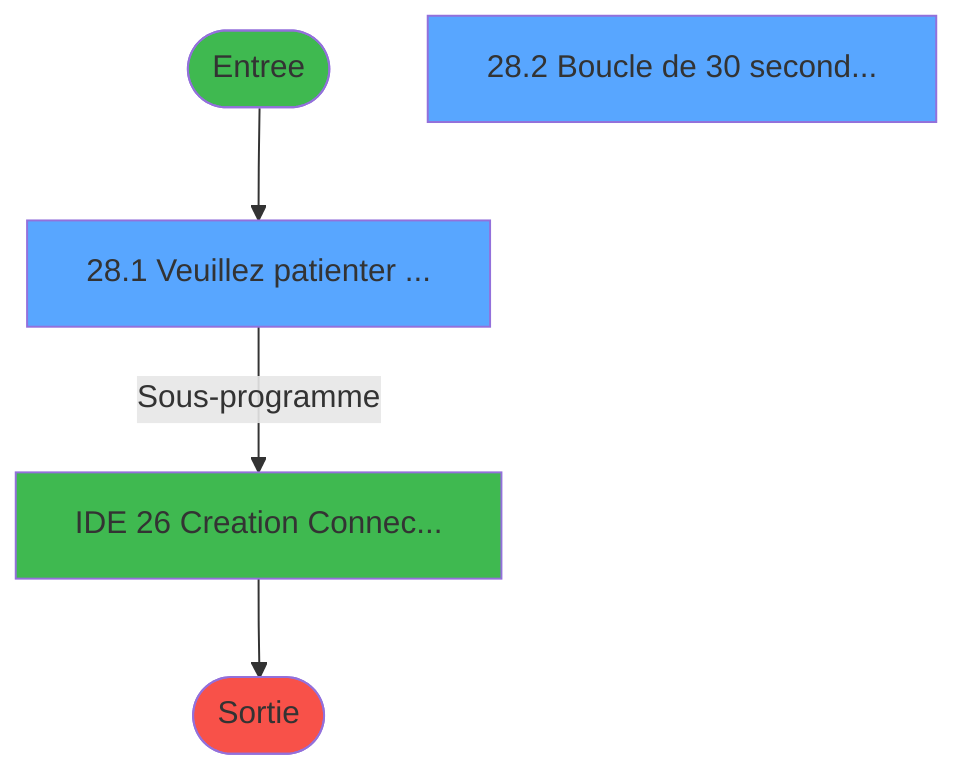
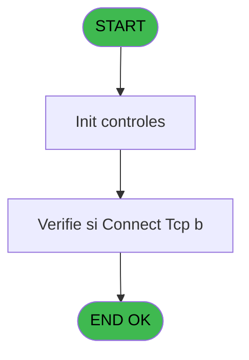

# POO IDE 28 - Verifie si Connect Tcp b

> **Analyse**: Phases 1-4 2026-02-03 17:45 -> 17:45 (18s) | Assemblage 17:45
> **Pipeline**: V7.2 Enrichi
> **Structure**: 4 onglets (Resume | Ecrans | Donnees | Connexions)

<!-- TAB:Resume -->

## 1. FICHE D'IDENTITE

| Attribut | Valeur |
|----------|--------|
| Projet | POO |
| IDE Position | 28 |
| Nom Programme | Verifie si Connect Tcp b |
| Fichier source | `Prg_28.xml` |
| Dossier IDE | Pooling |
| Taches | 3 (2 ecrans visibles) |
| Tables modifiees | 0 |
| Programmes appeles | 1 |

## 2. DESCRIPTION FONCTIONNELLE

**Verifie si Connect Tcp b** assure la gestion complete de ce processus, accessible depuis [Batch sur PABX (IDE 24)](POO-IDE-24.md).

Le flux de traitement s'organise en **2 blocs fonctionnels** :

- **Traitement** (2 taches) : traitements metier divers
- **Validation** (1 tache) : controles et verifications de coherence

Detail : phases du traitement

#### Phase 1 : Validation (1 tache)

- **28** - Verifie si Connect Tcp b **[[ECRAN]](#ecran-t1)**

#### Phase 2 : Traitement (2 taches)

- **28.1** - Veuillez patienter ... **[[ECRAN]](#ecran-t2)**
- **28.2** - Boucle de 30 secondes (TCP) **[[ECRAN]](#ecran-t3)**

## 3. BLOCS FONCTIONNELS

### 3.1 Validation (1 tache)

Controles de coherence : 1 tache verifie les donnees et conditions.

---

#### 28 - Verifie si Connect Tcp b [[ECRAN]](#ecran-t1)

**Role** : Verification : Verifie si Connect Tcp b.
**Ecran** : 141 x 46 DLU (MDI) | [Voir mockup](#ecran-t1)
**Variables liees** : A (> retour connection)

### 3.2 Traitement (2 taches)

Traitements internes.

---

#### 28.1 - Veuillez patienter ... [[ECRAN]](#ecran-t2)

**Role** : Traitement : Veuillez patienter ....
**Ecran** : 477 x 46 DLU (MDI) | [Voir mockup](#ecran-t2)

---

#### 28.2 - Boucle de 30 secondes (TCP) [[ECRAN]](#ecran-t3)

**Role** : Traitement : Boucle de 30 secondes (TCP).
**Ecran** : 514 x 77 DLU (MDI) | [Voir mockup](#ecran-t3)

## 5. REGLES METIER

*(Aucune regle metier identifiee)*

## 6. CONTEXTE

- **Appele par**: [Batch sur PABX (IDE 24)](POO-IDE-24.md)
- **Appelle**: 1 programmes | **Tables**: 0 (W:0 R:0 L:0) | **Taches**: 3 | **Expressions**: 2

<!-- TAB:Ecrans -->

## 8. ECRANS

### 8.1 Forms visibles (2 / 3)

| # | Position | Tache | Nom | Type | Largeur | Hauteur | Bloc |
|---|----------|-------|-----|------|---------|---------|------|
| 1 | 28.1 | 28.1 | Veuillez patienter ... | MDI | 477 | 46 | Traitement |
| 2 | 28.2 | 28.2 | Boucle de 30 secondes (TCP) | MDI | 514 | 77 | Traitement |

### 8.2 Mockups Ecrans

---

#### 28.1 - Veuillez patienter ...
**Tache** : [28.1](#t2) | **Type** : MDI | **Dimensions** : 477 x 46 DLU
**Bloc** : Traitement | **Titre IDE** : Veuillez patienter ...

<!-- FORM-DATA:
{
    "width":  477,
    "vFactor":  8,
    "type":  "MDI",
    "hFactor":  8,
    "controls":  [
                     {
                         "x":  176,
                         "type":  "label",
                         "var":  "",
                         "y":  7,
                         "w":  173,
                         "fmt":  "",
                         "name":  "",
                         "h":  8,
                         "color":  "7",
                         "text":  "Connexion",
                         "parent":  null
                     },
                     {
                         "x":  75,
                         "type":  "line",
                         "var":  "",
                         "y":  24,
                         "w":  398,
                         "fmt":  "",
                         "name":  "",
                         "h":  0,
                         "color":  "",
                         "text":  "",
                         "parent":  null
                     },
                     {
                         "x":  74,
                         "type":  "label",
                         "var":  "",
                         "y":  32,
                         "w":  362,
                         "fmt":  "",
                         "name":  "",
                         "h":  8,
                         "color":  "",
                         "text":  "Attente de connexion sur le serveur",
                         "parent":  null
                     },
                     {
                         "x":  0,
                         "type":  "image",
                         "var":  "",
                         "y":  0,
                         "w":  72,
                         "fmt":  "",
                         "name":  "",
                         "h":  25,
                         "color":  "",
                         "text":  "",
                         "parent":  null
                     }
                 ],
    "taskId":  "28.1",
    "height":  46
}
-->

---

#### 28.2 - Boucle de 30 secondes (TCP)
**Tache** : [28.2](#t3) | **Type** : MDI | **Dimensions** : 514 x 77 DLU
**Bloc** : Traitement | **Titre IDE** : Boucle de 30 secondes (TCP)

<!-- FORM-DATA:
{
    "width":  514,
    "vFactor":  8,
    "type":  "MDI",
    "hFactor":  8,
    "controls":  [
                     {
                         "x":  0,
                         "type":  "label",
                         "var":  "",
                         "y":  0,
                         "w":  514,
                         "fmt":  "",
                         "name":  "",
                         "h":  51,
                         "color":  "",
                         "text":  "",
                         "parent":  null
                     },
                     {
                         "x":  202,
                         "type":  "label",
                         "var":  "",
                         "y":  20,
                         "w":  244,
                         "fmt":  "",
                         "name":  "",
                         "h":  22,
                         "color":  "",
                         "text":  "",
                         "parent":  1
                     },
                     {
                         "x":  255,
                         "type":  "label",
                         "var":  "",
                         "y":  27,
                         "w":  139,
                         "fmt":  "",
                         "name":  "",
                         "h":  8,
                         "color":  "142",
                         "text":  "Temps ecoule",
                         "parent":  1
                     },
                     {
                         "x":  0,
                         "type":  "label",
                         "var":  "",
                         "y":  53,
                         "w":  514,
                         "fmt":  "",
                         "name":  "",
                         "h":  24,
                         "color":  "",
                         "text":  "",
                         "parent":  null
                     },
                     {
                         "x":  6,
                         "type":  "image",
                         "var":  "",
                         "y":  3,
                         "w":  123,
                         "fmt":  "",
                         "name":  "",
                         "h":  46,
                         "color":  "",
                         "text":  "",
                         "parent":  1
                     },
                     {
                         "x":  204,
                         "type":  "edit",
                         "var":  "",
                         "y":  21,
                         "w":  240,
                         "fmt":  "30",
                         "name":  "",
                         "h":  20,
                         "color":  "179",
                         "text":  "",
                         "parent":  null
                     },
                     {
                         "x":  9,
                         "type":  "button",
                         "var":  "",
                         "y":  57,
                         "w":  154,
                         "fmt":  "\u0026Abandonner",
                         "name":  "",
                         "h":  18,
                         "color":  "",
                         "text":  "",
                         "parent":  null
                     },
                     {
                         "x":  176,
                         "type":  "button",
                         "var":  "",
                         "y":  57,
                         "w":  175,
                         "fmt":  "\u0026Creation Connect",
                         "name":  "",
                         "h":  18,
                         "color":  "",
                         "text":  "",
                         "parent":  null
                     }
                 ],
    "taskId":  "28.2",
    "height":  77
}
-->

<strong>Champs : 1 champs</strong>

| Pos (x,y) | Nom | Variable | Type |
|-----------|-----|----------|------|
| 204,21 | 30 | - | edit |

<strong>Boutons : 2 boutons</strong>

| Bouton | Pos (x,y) | Action |
|--------|-----------|--------|
| Abandonner | 9,57 | Annule et retour au menu |
| Creation Connect | 176,57 | Appel [  Creation Connect.dat (IDE 26)](POO-IDE-26.md) |

## 9. NAVIGATION

### 9.1 Enchainement des ecrans

**Detail par enchainement :**

| Depuis | Action | Vers | Retour |
|--------|--------|------|--------|
| Veuillez patienter ... | Sous-programme | [  Creation Connect.dat (IDE 26)](POO-IDE-26.md) | Retour ecran |

### 9.3 Structure hierarchique (3 taches)

| Position | Tache | Type | Dimensions | Bloc |
|----------|-------|------|------------|------|
| **28.1** | [**Verifie si Connect Tcp b** (28)](#t1) [mockup](#ecran-t1) | MDI | 141x46 | Validation |
| **28.2** | [**Veuillez patienter ...** (28.1)](#t2) [mockup](#ecran-t2) | MDI | 477x46 | Traitement |
| 28.2.1 | [Boucle de 30 secondes (TCP) (28.2)](#t3) [mockup](#ecran-t3) | MDI | 514x77 | |

### 9.4 Algorigramme

> **Legende**: Vert = START/END OK | Rouge = END KO | Bleu = Decisions
> *Algorigramme auto-genere. Utiliser `/algorigramme` pour une synthese metier detaillee.*

<!-- TAB:Donnees -->

## 10. TABLES

### Tables utilisees (0)

| ID | Nom | Description | Type | R | W | L | Usages |
|----|-----|-------------|------|---|---|---|--------|

### Colonnes par table (0 / 0 tables avec colonnes identifiees)

## 11. VARIABLES

### 11.1 Variables de session (2)

Variables persistantes pendant toute la session.

| Lettre | Nom | Type | Usage dans |
|--------|-----|------|-----------|
| C | v. fin | Logical | 1x session |
| D | v. ok | Logical | - |

### 11.2 Autres (2)

Variables diverses.

| Lettre | Nom | Type | Usage dans |
|--------|-----|------|-----------|
| A | > retour connection | Logical | 1x refs |
| B | < etop system | Logical | - |

## 12. EXPRESSIONS

**2 / 2 expressions decodees (100%)**

### 12.1 Repartition par type

| Type | Expressions | Regles |
|------|-------------|--------|
| OTHER | 1 | 0 |
| NEGATION | 1 | 0 |

### 12.2 Expressions cles par type

#### OTHER (1 expressions)

| Type | IDE | Expression | Regle |
|------|-----|------------|-------|
| OTHER | 1 | `v. fin [C]` | - |

#### NEGATION (1 expressions)

| Type | IDE | Expression | Regle |
|------|-----|------------|-------|
| NEGATION | 2 | `NOT (> retour connection [A])` | - |

<!-- TAB:Connexions -->

## 13. GRAPHE D'APPELS

### 13.1 Chaine depuis Main (Callers)

Main -> ... -> [Batch sur PABX (IDE 24)](POO-IDE-24.md) -> **Verifie si Connect Tcp b (IDE 28)**

### 13.2 Callers

| IDE | Nom Programme | Nb Appels |
|-----|---------------|-----------|
| [24](POO-IDE-24.md) | Batch sur PABX | 3 |

### 13.3 Callees (programmes appeles)

### 13.4 Detail Callees avec contexte

| IDE | Nom Programme | Appels | Contexte |
|-----|---------------|--------|----------|
| [26](POO-IDE-26.md) |   Creation Connect.dat | 1 | Sous-programme |

## 14. RECOMMANDATIONS MIGRATION

### 14.1 Profil du programme

| Metrique | Valeur | Impact migration |
|----------|--------|-----------------|
| Lignes de logique | 32 | Programme compact |
| Expressions | 2 | Peu de logique |
| Tables WRITE | 0 | Impact faible |
| Sous-programmes | 1 | Peu de dependances |
| Ecrans visibles | 2 | Quelques ecrans |
| Code desactive | 0% (0 / 32) | Code sain |
| Regles metier | 0 | Pas de regle identifiee |

### 14.2 Plan de migration par bloc

#### Validation (1 tache: 1 ecran, 0 traitement)

- **Strategie** : FluentValidation avec validators specifiques.
- Chaque tache de validation -> un validator injectable

#### Traitement (2 taches: 2 ecrans, 0 traitement)

- **Strategie** : 2 composant(s) UI (Razor/React) avec formulaires et validation.
- 1 sous-programme(s) a migrer ou a reutiliser depuis les services existants.
- Decomposer les taches en services unitaires testables.

### 14.3 Dependances critiques

| Dependance | Type | Appels | Impact |
|------------|------|--------|--------|
| [  Creation Connect.dat (IDE 26)](POO-IDE-26.md) | Sous-programme | 1x | Normale - Sous-programme |

---
*Spec DETAILED generee par Pipeline V7.2 - 2026-02-03 17:45*
