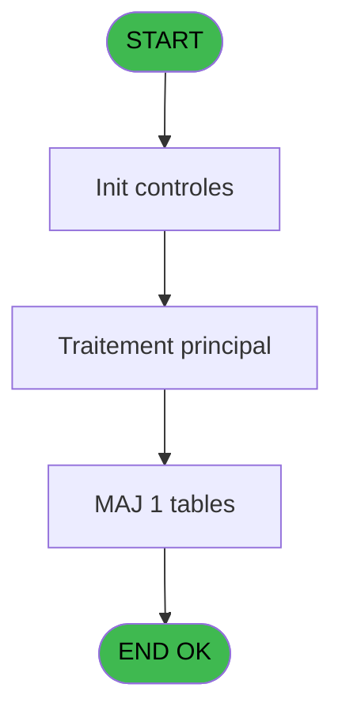
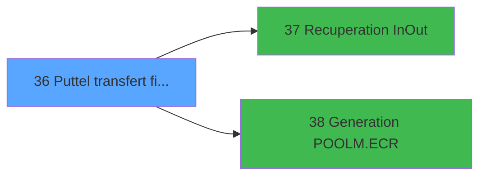

# POO IDE 36 - Puttel transfert fichier

> **Analyse**: Phases 1-4 2026-02-03 17:48 -> 17:48 (13s) | Assemblage 17:48
> **Pipeline**: V7.2 Enrichi
> **Structure**: 4 onglets (Resume | Ecrans | Donnees | Connexions)

<!-- TAB:Resume -->

## 1. FICHE D'IDENTITE

| Attribut | Valeur |
|----------|--------|
| Projet | POO |
| IDE Position | 36 |
| Nom Programme | Puttel transfert fichier |
| Fichier source | `Prg_36.xml` |
| Dossier IDE | Pooling |
| Taches | 1 (0 ecrans visibles) |
| Tables modifiees | 1 |
| Programmes appeles | 2 |

## 2. DESCRIPTION FONCTIONNELLE

**Puttel transfert fichier** assure la gestion complete de ce processus, accessible depuis [Execution PUT TXT (IDE 35)](POO-IDE-35.md).

Le flux de traitement s'organise en **1 blocs fonctionnels** :

- **Transfert** (1 tache) : transferts de donnees entre modules ou deversements

**Donnees modifiees** : 1 tables en ecriture (commande_autocom_cot).

## 3. BLOCS FONCTIONNELS

### 3.1 Transfert (1 tache)

Transfert de donnees entre modules.

---

#### 36 - Puttel transfert fichier

**Role** : Transfert de donnees : Puttel transfert fichier.
**Variables liees** : C (v. fichier txt ok)

## 5. REGLES METIER

*(Aucune regle metier identifiee)*

## 6. CONTEXTE

- **Appele par**: [Execution PUT TXT (IDE 35)](POO-IDE-35.md)
- **Appelle**: 2 programmes | **Tables**: 1 (W:1 R:0 L:0) | **Taches**: 1 | **Expressions**: 2

<!-- TAB:Ecrans -->

## 8. ECRANS

*(Programme sans ecran visible)*

## 9. NAVIGATION

### 9.3 Structure hierarchique (1 tache)

| Position | Tache | Type | Dimensions | Bloc |
|----------|-------|------|------------|------|
| **36.1** | [**Puttel transfert fichier** (36)](#t1) | MDI | - | Transfert |

### 9.4 Algorigramme

> **Legende**: Vert = START/END OK | Rouge = END KO | Bleu = Decisions
> *Algorigramme auto-genere. Utiliser `/algorigramme` pour une synthese metier detaillee.*

<!-- TAB:Donnees -->

## 10. TABLES

### Tables utilisees (1)

| ID | Nom | Description | Type | R | W | L | Usages |
|----|-----|-------------|------|---|---|---|--------|
| 75 | commande_autocom_cot |  | DB |   | **W** |   | 1 |

### Colonnes par table (1 / 1 tables avec colonnes identifiees)

Table 75 - commande_autocom_cot (**W**) - 1 usages

| Lettre | Variable | Acces | Type |
|--------|----------|-------|------|
| A | > chemin pabx local | W | Alpha |
| B | > chemin put.log | W | Alpha |
| C | v. fichier txt ok | W | Logical |
| D | v. chaine | W | Alpha |

## 11. VARIABLES

### 11.1 Variables de session (2)

Variables persistantes pendant toute la session.

| Lettre | Nom | Type | Usage dans |
|--------|-----|------|-----------|
| C | v. fichier txt ok | Logical | - |
| D | v. chaine | Alpha | - |

### 11.2 Autres (2)

Variables diverses.

| Lettre | Nom | Type | Usage dans |
|--------|-----|------|-----------|
| A | > chemin pabx local | Alpha | - |
| B | > chemin put.log | Alpha | - |

## 12. EXPRESSIONS

**2 / 2 expressions decodees (100%)**

### 12.1 Repartition par type

| Type | Expressions | Regles |
|------|-------------|--------|
| CONSTANTE | 1 | 0 |
| CONDITION | 1 | 0 |

### 12.2 Expressions cles par type

#### CONSTANTE (1 expressions)

| Type | IDE | Expression | Regle |
|------|-----|------------|-------|
| CONSTANTE | 1 | `'0'` | - |

#### CONDITION (1 expressions)

| Type | IDE | Expression | Regle |
|------|-----|------------|-------|
| CONDITION | 2 | `Trim([Q])<>'' AND NOT (Stat (0,'D'MODE))` | - |

<!-- TAB:Connexions -->

## 13. GRAPHE D'APPELS

### 13.1 Chaine depuis Main (Callers)

Main -> ... -> [Execution PUT TXT (IDE 35)](POO-IDE-35.md) -> **Puttel transfert fichier (IDE 36)**

### 13.2 Callers

| IDE | Nom Programme | Nb Appels |
|-----|---------------|-----------|
| [35](POO-IDE-35.md) | Execution PUT TXT | 1 |

### 13.3 Callees (programmes appeles)

### 13.4 Detail Callees avec contexte

| IDE | Nom Programme | Appels | Contexte |
|-----|---------------|--------|----------|
| [37](POO-IDE-37.md) |    Recuperation In/Out | 1 | Recuperation donnees |
| [38](POO-IDE-38.md) |    Generation POOLM.ECR | 1 | Sous-programme |

## 14. RECOMMANDATIONS MIGRATION

### 14.1 Profil du programme

| Metrique | Valeur | Impact migration |
|----------|--------|-----------------|
| Lignes de logique | 15 | Programme compact |
| Expressions | 2 | Peu de logique |
| Tables WRITE | 1 | Impact faible |
| Sous-programmes | 2 | Peu de dependances |
| Ecrans visibles | 0 | Ecran unique ou traitement batch |
| Code desactive | 0% (0 / 15) | Code sain |
| Regles metier | 0 | Pas de regle identifiee |

### 14.2 Plan de migration par bloc

#### Transfert (1 tache: 0 ecran, 1 traitement)

- **Strategie** : Service `ITransfertService` avec logique de deversement.

### 14.3 Dependances critiques

| Dependance | Type | Appels | Impact |
|------------|------|--------|--------|
| commande_autocom_cot | Table WRITE (Database) | 1x | Schema + repository |
| [   Generation POOLM.ECR (IDE 38)](POO-IDE-38.md) | Sous-programme | 1x | Normale - Sous-programme |
| [   Recuperation In/Out (IDE 37)](POO-IDE-37.md) | Sous-programme | 1x | Normale - Recuperation donnees |

---
*Spec DETAILED generee par Pipeline V7.2 - 2026-02-03 17:48*
