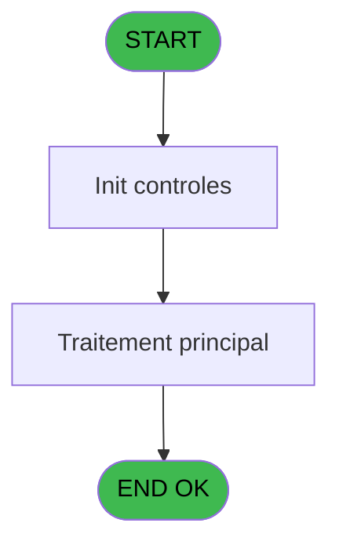
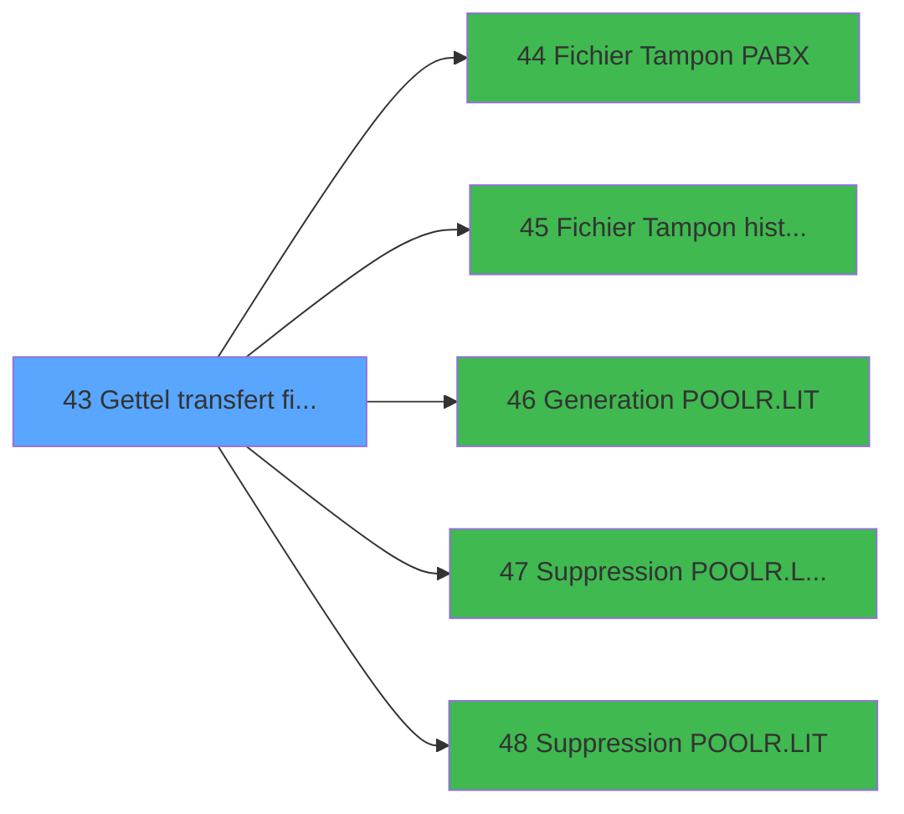

# POO IDE 43 - Gettel transfert fichier

> **Analyse**: Phases 1-4 2026-02-03 17:51 -> 17:51 (13s) | Assemblage 17:51
> **Pipeline**: V7.2 Enrichi
> **Structure**: 4 onglets (Resume | Ecrans | Donnees | Connexions)

<!-- TAB:Resume -->

## 1. FICHE D'IDENTITE

| Attribut | Valeur |
|----------|--------|
| Projet | POO |
| IDE Position | 43 |
| Nom Programme | Gettel transfert fichier |
| Fichier source | `Prg_43.xml` |
| Dossier IDE | Pooling |
| Taches | 1 (0 ecrans visibles) |
| Tables modifiees | 0 |
| Programmes appeles | 5 |

## 2. DESCRIPTION FONCTIONNELLE

**Gettel transfert fichier** assure la gestion complete de ce processus, accessible depuis [Execution GET TXT (IDE 42)](POO-IDE-42.md).

Le flux de traitement s'organise en **1 blocs fonctionnels** :

- **Transfert** (1 tache) : transferts de donnees entre modules ou deversements

## 3. BLOCS FONCTIONNELS

### 3.1 Transfert (1 tache)

Transfert de donnees entre modules.

---

#### 43 - Gettel transfert fichier

**Role** : Transfert de donnees : Gettel transfert fichier.

## 5. REGLES METIER

*(Aucune regle metier identifiee)*

## 6. CONTEXTE

- **Appele par**: [Execution GET TXT (IDE 42)](POO-IDE-42.md)
- **Appelle**: 5 programmes | **Tables**: 0 (W:0 R:0 L:0) | **Taches**: 1 | **Expressions**: 1

<!-- TAB:Ecrans -->

## 8. ECRANS

*(Programme sans ecran visible)*

## 9. NAVIGATION

### 9.3 Structure hierarchique (1 tache)

| Position | Tache | Type | Dimensions | Bloc |
|----------|-------|------|------------|------|
| **43.1** | [**Gettel transfert fichier** (43)](#t1) | MDI | - | Transfert |

### 9.4 Algorigramme

> **Legende**: Vert = START/END OK | Rouge = END KO | Bleu = Decisions
> *Algorigramme auto-genere. Utiliser `/algorigramme` pour une synthese metier detaillee.*

<!-- TAB:Donnees -->

## 10. TABLES

### Tables utilisees (0)

| ID | Nom | Description | Type | R | W | L | Usages |
|----|-----|-------------|------|---|---|---|--------|

### Colonnes par table (0 / 0 tables avec colonnes identifiees)

## 11. VARIABLES

### 11.1 Autres (3)

Variables diverses.

| Lettre | Nom | Type | Usage dans |
|--------|-----|------|-----------|
| A | < Compteur | Numeric | - |
| B | > chemin get.log | Alpha | - |
| C | > edition ? | Alpha | - |

## 12. EXPRESSIONS

**1 / 1 expressions decodees (100%)**

### 12.1 Repartition par type

| Type | Expressions | Regles |
|------|-------------|--------|
| STRING | 1 | 0 |

### 12.2 Expressions cles par type

#### STRING (1 expressions)

| Type | IDE | Expression | Regle |
|------|-----|------------|-------|
| STRING | 1 | `FileExist (Trim (INIGet ('[MAGIC_LOGICAL_NAMES]club_tf_pabx'))&'RESULTAT.TCK')` | - |

<!-- TAB:Connexions -->

## 13. GRAPHE D'APPELS

### 13.1 Chaine depuis Main (Callers)

Main -> ... -> [Execution GET TXT (IDE 42)](POO-IDE-42.md) -> **Gettel transfert fichier (IDE 43)**

### 13.2 Callers

| IDE | Nom Programme | Nb Appels |
|-----|---------------|-----------|
| [42](POO-IDE-42.md) | Execution GET TXT | 1 |

### 13.3 Callees (programmes appeles)

### 13.4 Detail Callees avec contexte

| IDE | Nom Programme | Appels | Contexte |
|-----|---------------|--------|----------|
| [44](POO-IDE-44.md) |    Fichier Tampon PABX | 1 | Sous-programme |
| [45](POO-IDE-45.md) |    Fichier Tampon histo PABX | 1 | Historique/consultation |
| [46](POO-IDE-46.md) |    Generation POOLR.LIT | 1 | Sous-programme |
| [47](POO-IDE-47.md) |    Suppression POOLR.LIT&RESUL | 1 | Sous-programme |
| [48](POO-IDE-48.md) |    Suppression POOLR.LIT | 1 | Sous-programme |

## 14. RECOMMANDATIONS MIGRATION

### 14.1 Profil du programme

| Metrique | Valeur | Impact migration |
|----------|--------|-----------------|
| Lignes de logique | 10 | Programme compact |
| Expressions | 1 | Peu de logique |
| Tables WRITE | 0 | Impact faible |
| Sous-programmes | 5 | Peu de dependances |
| Ecrans visibles | 0 | Ecran unique ou traitement batch |
| Code desactive | 0% (0 / 10) | Code sain |
| Regles metier | 0 | Pas de regle identifiee |

### 14.2 Plan de migration par bloc

#### Transfert (1 tache: 0 ecran, 1 traitement)

- **Strategie** : Service `ITransfertService` avec logique de deversement.

### 14.3 Dependances critiques

| Dependance | Type | Appels | Impact |
|------------|------|--------|--------|
| [   Suppression POOLR.LIT&RESUL (IDE 47)](POO-IDE-47.md) | Sous-programme | 1x | Normale - Sous-programme |
| [   Suppression POOLR.LIT (IDE 48)](POO-IDE-48.md) | Sous-programme | 1x | Normale - Sous-programme |
| [   Generation POOLR.LIT (IDE 46)](POO-IDE-46.md) | Sous-programme | 1x | Normale - Sous-programme |
| [   Fichier Tampon PABX (IDE 44)](POO-IDE-44.md) | Sous-programme | 1x | Normale - Sous-programme |
| [   Fichier Tampon histo PABX (IDE 45)](POO-IDE-45.md) | Sous-programme | 1x | Normale - Historique/consultation |

---
*Spec DETAILED generee par Pipeline V7.2 - 2026-02-03 17:51*
