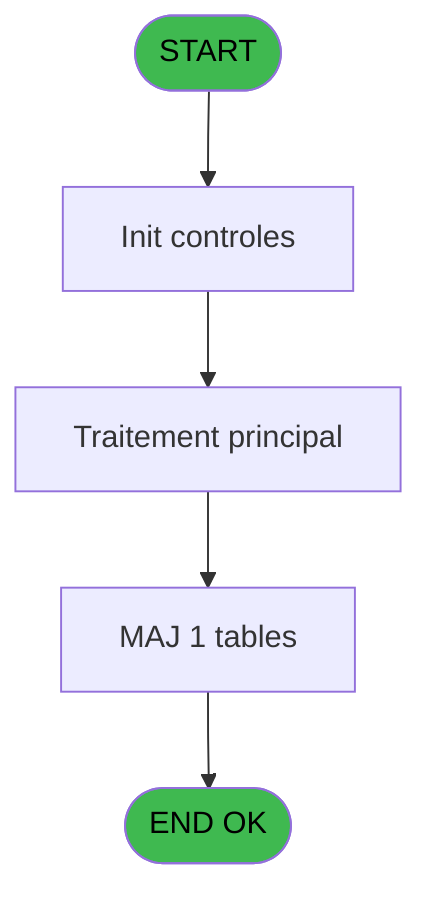

# POO IDE 44 - Fichier Tampon PABX

> **Analyse**: Phases 1-4 2026-02-03 17:51 -> 17:51 (19s) | Assemblage 17:51
> **Pipeline**: V7.2 Enrichi
> **Structure**: 4 onglets (Resume | Ecrans | Donnees | Connexions)

<!-- TAB:Resume -->

## 1. FICHE D'IDENTITE

| Attribut | Valeur |
|----------|--------|
| Projet | POO |
| IDE Position | 44 |
| Nom Programme | Fichier Tampon PABX |
| Fichier source | `Prg_44.xml` |
| Dossier IDE | Pooling |
| Taches | 3 (0 ecrans visibles) |
| Tables modifiees | 1 |
| Programmes appeles | 1 |

## 2. DESCRIPTION FONCTIONNELLE

**Fichier Tampon PABX** assure la gestion complete de ce processus, accessible depuis [ Gettel transfert fichier (IDE 43)](POO-IDE-43.md).

Le flux de traitement s'organise en **2 blocs fonctionnels** :

- **Traitement** (2 taches) : traitements metier divers
- **Impression** (1 tache) : generation de tickets et documents

**Donnees modifiees** : 1 tables en ecriture (fichier_tampon_pabx).

Detail : phases du traitement

#### Phase 1 : Traitement (2 taches)

- **44** - Fichier Tampon PABX
- **44.1** - delete enregistrement vide

#### Phase 2 : Impression (1 tache)

- **44.2** - Edition au fil de l'eau

Delegue a : [Tickets (IDE 70)](POO-IDE-70.md)

#### Tables impactees

| Table | Operations | Role metier |
|-------|-----------|-------------|
| fichier_tampon_pabx | **W** (2 usages) |  |

## 3. BLOCS FONCTIONNELS

### 3.1 Traitement (2 taches)

Traitements internes.

---

#### 44 - Fichier Tampon PABX

**Role** : Traitement : Fichier Tampon PABX.

---

#### 44.1 - delete enregistrement vide

**Role** : Traitement : delete enregistrement vide.

### 3.2 Impression (1 tache)

Generation des documents et tickets.

---

#### 44.2 - Edition au fil de l'eau

**Role** : Generation du document : Edition au fil de l'eau.
**Variables liees** : C (> edition ?)
**Delegue a** : [Tickets (IDE 70)](POO-IDE-70.md)

## 5. REGLES METIER

*(Aucune regle metier identifiee)*

## 6. CONTEXTE

- **Appele par**: [ Gettel transfert fichier (IDE 43)](POO-IDE-43.md)
- **Appelle**: 1 programmes | **Tables**: 2 (W:1 R:1 L:0) | **Taches**: 3 | **Expressions**: 12

<!-- TAB:Ecrans -->

## 8. ECRANS

*(Programme sans ecran visible)*

## 9. NAVIGATION

### 9.3 Structure hierarchique (3 taches)

| Position | Tache | Type | Dimensions | Bloc |
|----------|-------|------|------------|------|
| **44.1** | [**Fichier Tampon PABX** (44)](#t1) | MDI | - | Traitement |
| 44.1.1 | [delete enregistrement vide (44.1)](#t2) | MDI | - | |
| **44.2** | [**Edition au fil de l'eau** (44.2)](#t3) | MDI | - | Impression |

### 9.4 Algorigramme

> **Legende**: Vert = START/END OK | Rouge = END KO | Bleu = Decisions
> *Algorigramme auto-genere. Utiliser `/algorigramme` pour une synthese metier detaillee.*

<!-- TAB:Donnees -->

## 10. TABLES

### Tables utilisees (2)

| ID | Nom | Description | Type | R | W | L | Usages |
|----|-----|-------------|------|---|---|---|--------|
| 3 | fichier_tampon_pabx |  | DB |   | **W** |   | 2 |
| 60 | table_code_acces_tca |  | DB | R |   |   | 1 |

### Colonnes par table (1 / 2 tables avec colonnes identifiees)

Table 3 - fichier_tampon_pabx (**W**) - 2 usages

| Lettre | Variable | Acces | Type |
|--------|----------|-------|------|
| A | < Compteur | W | Numeric |
| B | > chemin Get.log | W | Alpha |
| C | > edition ? | W | Alpha |
| D | v. date sys | W | Date |
| E | v. time sys | W | Time |
| F | v. nbre ticket | W | Numeric |

Table 60 - table_code_acces_tca (R) - 1 usages

*Table utilisee uniquement en Link ou aucune colonne Real identifiee dans le DataView.*

## 11. VARIABLES

### 11.1 Variables de session (3)

Variables persistantes pendant toute la session.

| Lettre | Nom | Type | Usage dans |
|--------|-----|------|-----------|
| D | v. date sys | Date | 1x session |
| E | v. time sys | Time | 1x session |
| F | v. nbre ticket | Numeric | - |

### 11.2 Autres (3)

Variables diverses.

| Lettre | Nom | Type | Usage dans |
|--------|-----|------|-----------|
| A | < Compteur | Numeric | 1x refs |
| B | > chemin Get.log | Alpha | 1x refs |
| C | > edition ? | Alpha | [44.2](#t3) |

## 12. EXPRESSIONS

**12 / 12 expressions decodees (100%)**

### 12.1 Repartition par type

| Type | Expressions | Regles |
|------|-------------|--------|
| CONDITION | 4 | 0 |
| CALCULATION | 1 | 0 |
| CONSTANTE | 2 | 0 |
| DATE | 1 | 0 |
| OTHER | 4 | 0 |

### 12.2 Expressions cles par type

#### CONDITION (4 expressions)

| Type | IDE | Expression | Regle |
|------|-----|------------|-------|
| CONDITION | 11 | `> edition ? [C]='O'` | - |
| CONDITION | 5 | `Trim (> chemin Get.log [B])` | - |
| CONDITION | 9 | `< Compteur [A]+1` | - |
| CONDITION | 12 | `[Q]+[R]+[S]<>0` | - |

#### CALCULATION (1 expressions)

| Type | IDE | Expression | Regle |
|------|-----|------------|-------|
| CALCULATION | 10 | `[Y]+1` | - |

#### CONSTANTE (2 expressions)

| Type | IDE | Expression | Regle |
|------|-----|------------|-------|
| CONSTANTE | 6 | `'N'` | - |
| CONSTANTE | 4 | `'%club_tf_pabx%RESULTAT.TCK'` | - |

#### DATE (1 expressions)

| Type | IDE | Expression | Regle |
|------|-----|------------|-------|
| DATE | 1 | `Date ()` | - |

#### OTHER (4 expressions)

| Type | IDE | Expression | Regle |
|------|-----|------------|-------|
| OTHER | 7 | `v. date sys [D]` | - |
| OTHER | 8 | `v. time sys [E]` | - |
| OTHER | 2 | `Time ()` | - |
| OTHER | 3 | `EOF (0,1)` | - |

<!-- TAB:Connexions -->

## 13. GRAPHE D'APPELS

### 13.1 Chaine depuis Main (Callers)

Main -> ... -> [ Gettel transfert fichier (IDE 43)](POO-IDE-43.md) -> **Fichier Tampon PABX (IDE 44)**

### 13.2 Callers

| IDE | Nom Programme | Nb Appels |
|-----|---------------|-----------|
| [43](POO-IDE-43.md) |  Gettel transfert fichier | 1 |

### 13.3 Callees (programmes appeles)

### 13.4 Detail Callees avec contexte

| IDE | Nom Programme | Appels | Contexte |
|-----|---------------|--------|----------|
| [70](POO-IDE-70.md) | Tickets | 1 | Impression ticket/document |

## 14. RECOMMANDATIONS MIGRATION

### 14.1 Profil du programme

| Metrique | Valeur | Impact migration |
|----------|--------|-----------------|
| Lignes de logique | 60 | Programme compact |
| Expressions | 12 | Peu de logique |
| Tables WRITE | 1 | Impact faible |
| Sous-programmes | 1 | Peu de dependances |
| Ecrans visibles | 0 | Ecran unique ou traitement batch |
| Code desactive | 0% (0 / 60) | Code sain |
| Regles metier | 0 | Pas de regle identifiee |

### 14.2 Plan de migration par bloc

#### Traitement (2 taches: 0 ecran, 2 traitements)

- **Strategie** : 2 service(s) backend injectable(s) (Domain Services).
- 1 sous-programme(s) a migrer ou a reutiliser depuis les services existants.
- Decomposer les taches en services unitaires testables.

#### Impression (1 tache: 0 ecran, 1 traitement)

- **Strategie** : Templates HTML -> PDF via wkhtmltopdf ou Puppeteer.
- `PrintService` injectable avec choix imprimante

### 14.3 Dependances critiques

| Dependance | Type | Appels | Impact |
|------------|------|--------|--------|
| fichier_tampon_pabx | Table WRITE (Database) | 2x | Schema + repository |
| [Tickets (IDE 70)](POO-IDE-70.md) | Sous-programme | 1x | Normale - Impression ticket/document |

---
*Spec DETAILED generee par Pipeline V7.2 - 2026-02-03 17:51*
