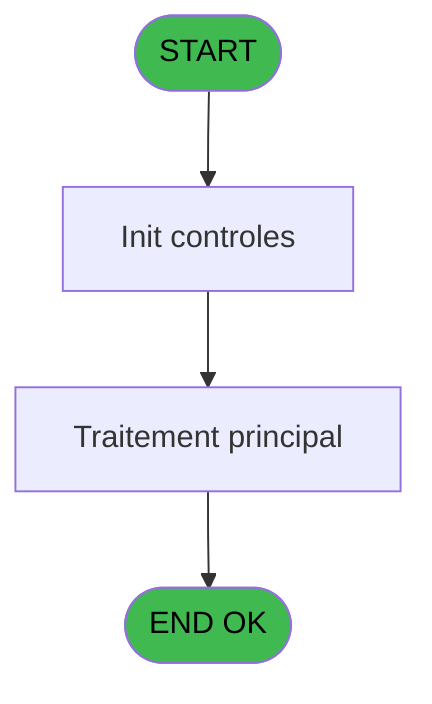
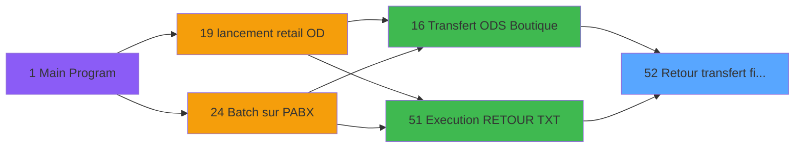
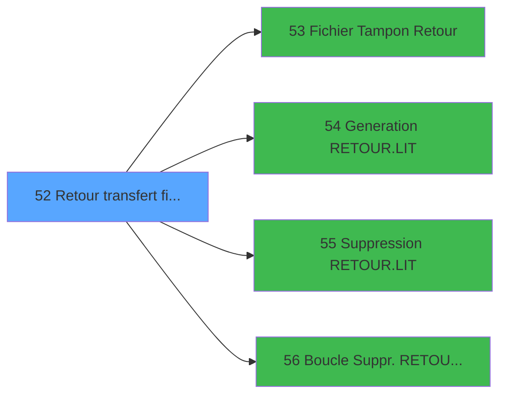

# POO IDE 52 - Retour transfert fichier

> **Analyse**: Phases 1-4 2026-02-03 17:55 -> 17:55 (20s) | Assemblage 17:55
> **Pipeline**: V7.2 Enrichi
> **Structure**: 4 onglets (Resume | Ecrans | Donnees | Connexions)

<!-- TAB:Resume -->

## 1. FICHE D'IDENTITE

| Attribut | Valeur |
|----------|--------|
| Projet | POO |
| IDE Position | 52 |
| Nom Programme | Retour transfert fichier |
| Fichier source | `Prg_52.xml` |
| Dossier IDE | Pooling |
| Taches | 1 (0 ecrans visibles) |
| Tables modifiees | 0 |
| Programmes appeles | 4 |

## 2. DESCRIPTION FONCTIONNELLE

**Retour transfert fichier** assure la gestion complete de ce processus, accessible depuis [Transfert ODS Boutique (IDE 16)](POO-IDE-16.md), [Execution RETOUR TXT (IDE 51)](POO-IDE-51.md).

Le flux de traitement s'organise en **1 blocs fonctionnels** :

- **Transfert** (1 tache) : transferts de donnees entre modules ou deversements

## 3. BLOCS FONCTIONNELS

### 3.1 Transfert (1 tache)

Transfert de donnees entre modules.

---

#### 52 - Gettel transfert fichier

**Role** : Transfert de donnees : Gettel transfert fichier.

## 5. REGLES METIER

*(Aucune regle metier identifiee)*

## 6. CONTEXTE

- **Appele par**: [Transfert ODS Boutique (IDE 16)](POO-IDE-16.md), [Execution RETOUR TXT (IDE 51)](POO-IDE-51.md)
- **Appelle**: 4 programmes | **Tables**: 0 (W:0 R:0 L:0) | **Taches**: 1 | **Expressions**: 1

<!-- TAB:Ecrans -->

## 8. ECRANS

*(Programme sans ecran visible)*

## 9. NAVIGATION

### 9.3 Structure hierarchique (1 tache)

| Position | Tache | Type | Dimensions | Bloc |
|----------|-------|------|------------|------|
| **52.1** | [**Gettel transfert fichier** (52)](#t1) | MDI | - | Transfert |

### 9.4 Algorigramme

> **Legende**: Vert = START/END OK | Rouge = END KO | Bleu = Decisions
> *Algorigramme auto-genere. Utiliser `/algorigramme` pour une synthese metier detaillee.*

<!-- TAB:Donnees -->

## 10. TABLES

### Tables utilisees (0)

| ID | Nom | Description | Type | R | W | L | Usages |
|----|-----|-------------|------|---|---|---|--------|

### Colonnes par table (0 / 0 tables avec colonnes identifiees)

## 11. VARIABLES

### 11.1 Autres (2)

Variables diverses.

| Lettre | Nom | Type | Usage dans |
|--------|-----|------|-----------|
| A | < Compteur | Numeric | - |
| B | > chemin get.log | Alpha | - |

## 12. EXPRESSIONS

**1 / 1 expressions decodees (100%)**

### 12.1 Repartition par type

| Type | Expressions | Regles |
|------|-------------|--------|
| STRING | 1 | 0 |

### 12.2 Expressions cles par type

#### STRING (1 expressions)

| Type | IDE | Expression | Regle |
|------|-----|------------|-------|
| STRING | 1 | `FileExist (Trim (INIGet ('[MAGIC_LOGICAL_NAMES]club_tf_pabx'))&'RETOUR.TCK')` | - |

<!-- TAB:Connexions -->

## 13. GRAPHE D'APPELS

### 13.1 Chaine depuis Main (Callers)

Main -> ... -> [Transfert ODS Boutique (IDE 16)](POO-IDE-16.md) -> **Retour transfert fichier (IDE 52)**

Main -> ... -> [Execution RETOUR TXT (IDE 51)](POO-IDE-51.md) -> **Retour transfert fichier (IDE 52)**

### 13.2 Callers

| IDE | Nom Programme | Nb Appels |
|-----|---------------|-----------|
| [16](POO-IDE-16.md) | Transfert ODS Boutique | 1 |
| [51](POO-IDE-51.md) | Execution RETOUR TXT | 1 |

### 13.3 Callees (programmes appeles)

### 13.4 Detail Callees avec contexte

| IDE | Nom Programme | Appels | Contexte |
|-----|---------------|--------|----------|
| [53](POO-IDE-53.md) |    Fichier Tampon Retour | 1 | Sous-programme |
| [54](POO-IDE-54.md) |    Generation RETOUR.LIT | 1 | Sous-programme |
| [55](POO-IDE-55.md) |    Suppression RETOUR.LIT | 1 | Sous-programme |
| [56](POO-IDE-56.md) |    Boucle Suppr. RETOUR.LIT | 1 | Sous-programme |

## 14. RECOMMANDATIONS MIGRATION

### 14.1 Profil du programme

| Metrique | Valeur | Impact migration |
|----------|--------|-----------------|
| Lignes de logique | 9 | Programme compact |
| Expressions | 1 | Peu de logique |
| Tables WRITE | 0 | Impact faible |
| Sous-programmes | 4 | Peu de dependances |
| Ecrans visibles | 0 | Ecran unique ou traitement batch |
| Code desactive | 0% (0 / 9) | Code sain |
| Regles metier | 0 | Pas de regle identifiee |

### 14.2 Plan de migration par bloc

#### Transfert (1 tache: 0 ecran, 1 traitement)

- **Strategie** : Service `ITransfertService` avec logique de deversement.

### 14.3 Dependances critiques

| Dependance | Type | Appels | Impact |
|------------|------|--------|--------|
| [   Suppression RETOUR.LIT (IDE 55)](POO-IDE-55.md) | Sous-programme | 1x | Normale - Sous-programme |
| [   Boucle Suppr. RETOUR.LIT (IDE 56)](POO-IDE-56.md) | Sous-programme | 1x | Normale - Sous-programme |
| [   Fichier Tampon Retour (IDE 53)](POO-IDE-53.md) | Sous-programme | 1x | Normale - Sous-programme |
| [   Generation RETOUR.LIT (IDE 54)](POO-IDE-54.md) | Sous-programme | 1x | Normale - Sous-programme |

---
*Spec DETAILED generee par Pipeline V7.2 - 2026-02-03 17:55*
