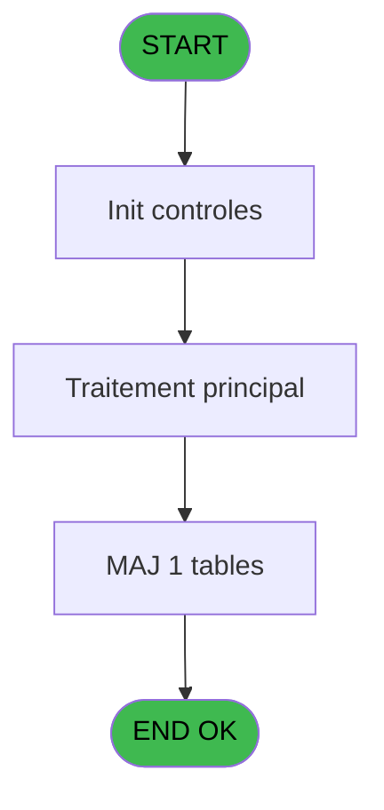

# POO IDE 67 - Browse - Fichier Tampon PABX

> **Analyse**: Phases 1-4 2026-02-03 18:01 -> 18:01 (20s) | Assemblage 18:01
> **Pipeline**: V7.2 Enrichi
> **Structure**: 4 onglets (Resume | Ecrans | Donnees | Connexions)

<!-- TAB:Resume -->

## 1. FICHE D'IDENTITE

| Attribut | Valeur |
|----------|--------|
| Projet | POO |
| IDE Position | 67 |
| Nom Programme | Browse - Fichier Tampon PABX |
| Fichier source | `Prg_67.xml` |
| Dossier IDE | Rebascule |
| Taches | 1 (1 ecrans visibles) |
| Tables modifiees | 1 |
| Programmes appeles | 0 |
| :warning: Statut | **ORPHELIN_POTENTIEL** |

## 2. DESCRIPTION FONCTIONNELLE

**Browse - Fichier Tampon PABX** assure la gestion complete de ce processus.

Le flux de traitement s'organise en **1 blocs fonctionnels** :

- **Traitement** (1 tache) : traitements metier divers

**Donnees modifiees** : 1 tables en ecriture (histoticket_dat).

## 3. BLOCS FONCTIONNELS

### 3.1 Traitement (1 tache)

Traitements internes.

---

#### 67 - Browse - Fichier Tampon PABX [[ECRAN]](#ecran-t1)

**Role** : Traitement : Browse - Fichier Tampon PABX.
**Ecran** : 574 x 0 DLU (MDI) | [Voir mockup](#ecran-t1)

## 5. REGLES METIER

*(Aucune regle metier identifiee)*

## 6. CONTEXTE

- **Appele par**: (aucun)
- **Appelle**: 0 programmes | **Tables**: 1 (W:1 R:0 L:0) | **Taches**: 1 | **Expressions**: 0

<!-- TAB:Ecrans -->

## 8. ECRANS

### 8.1 Forms visibles (1 / 1)

| # | Position | Tache | Nom | Type | Largeur | Hauteur | Bloc |
|---|----------|-------|-----|------|---------|---------|------|
| 1 | 67 | 67 | Browse - Fichier Tampon PABX | MDI | 574 | 0 | Traitement |

### 8.2 Mockups Ecrans

---

#### 67 - Browse - Fichier Tampon PABX
**Tache** : [67](#t1) | **Type** : MDI | **Dimensions** : 574 x 0 DLU
**Bloc** : Traitement | **Titre IDE** : Browse - Fichier Tampon PABX

<!-- FORM-DATA:
{
    "width":  574,
    "vFactor":  8,
    "type":  "MDI",
    "hFactor":  4,
    "controls":  [
                     {
                         "x":  8,
                         "type":  "table",
                         "var":  "",
                         "name":  "",
                         "titleH":  12,
                         "color":  "110",
                         "w":  1490,
                         "y":  8,
                         "fmt":  "",
                         "parent":  null,
                         "text":  "",
                         "rowH":  13,
                         "h":  182,
                         "cols":  [
                                      {
                                          "title":  "pbx_traite_status",
                                          "layer":  1,
                                          "w":  67
                                      },
                                      {
                                          "title":  "pbx_traite_date",
                                          "layer":  2,
                                          "w":  68
                                      },
                                      {
                                          "title":  "pbx_traite_heure",
                                          "layer":  3,
                                          "w":  66
                                      },
                                      {
                                          "title":  "pbx_prefixe_d_acces",
                                          "layer":  4,
                                          "w":  84
                                      },
                                      {
                                          "title":  "pbx_code_confident_",
                                          "layer":  5,
                                          "w":  86
                                      },
                                      {
                                          "title":  "pbx_date_debut",
                                          "layer":  6,
                                          "w":  68
                                      },
                                      {
                                          "title":  "pbx_heure_debut",
                                          "layer":  7,
                                          "w":  70
                                      },
                                      {
                                          "title":  "pbx_nbre_de_taxe",
                                          "layer":  8,
                                          "w":  74
                                      },
                                      {
                                          "title":  "pbx_num_ligne",
                                          "layer":  9,
                                          "w":  60
                                      },
                                      {
                                          "title":  "pbx_num_poste",
                                          "layer":  10,
                                          "w":  63
                                      },
                                      {
                                          "title":  "pbx_num_compose",
                                          "layer":  11,
                                          "w":  139
                                      },
                                      {
                                          "title":  "pbx_cout_taxe_1",
                                          "layer":  12,
                                          "w":  77
                                      },
                                      {
                                          "title":  "pbx_cout_taxe_2",
                                          "layer":  13,
                                          "w":  77
                                      },
                                      {
                                          "title":  "pbx_cout_taxe_3",
                                          "layer":  14,
                                          "w":  77
                                      },
                                      {
                                          "title":  "pbx_duree",
                                          "layer":  15,
                                          "w":  53
                                      },
                                      {
                                          "title":  "pbx_pays_appele",
                                          "layer":  16,
                                          "w":  122
                                      },
                                      {
                                          "title":  "pbx_centre_terrestre",
                                          "layer":  17,
                                          "w":  81
                                      },
                                      {
                                          "title":  "pbx_transfert",
                                          "layer":  18,
                                          "w":  52
                                      },
                                      {
                                          "title":  "pbx_champs_reserve",
                                          "layer":  19,
                                          "w":  89
                                      }
                                  ],
                         "rows":  19
                     },
                     {
                         "x":  12,
                         "type":  "edit",
                         "var":  "",
                         "y":  23,
                         "w":  9,
                         "fmt":  "",
                         "name":  "pbx_traite_status",
                         "h":  10,
                         "color":  "110",
                         "text":  "",
                         "parent":  117
                     },
                     {
                         "x":  79,
                         "type":  "edit",
                         "var":  "",
                         "y":  23,
                         "w":  61,
                         "fmt":  "",
                         "name":  "pbx_traite_date",
                         "h":  10,
                         "color":  "110",
                         "text":  "",
                         "parent":  117
                     },
                     {
                         "x":  147,
                         "type":  "edit",
                         "var":  "",
                         "y":  23,
                         "w":  46,
                         "fmt":  "",
                         "name":  "pbx_traite_heure",
                         "h":  10,
                         "color":  "110",
                         "text":  "",
                         "parent":  117
                     },
                     {
                         "x":  213,
                         "type":  "edit",
                         "var":  "",
                         "y":  23,
                         "w":  14,
                         "fmt":  "",
                         "name":  "pbx_prefixe_d_acces",
                         "h":  10,
                         "color":  "110",
                         "text":  "",
                         "parent":  117
                     },
                     {
                         "x":  297,
                         "type":  "edit",
                         "var":  "",
                         "y":  23,
                         "w":  32,
                         "fmt":  "",
                         "name":  "pbx_code_confident_",
                         "h":  10,
                         "color":  "110",
                         "text":  "",
                         "parent":  117
                     },
                     {
                         "x":  383,
                         "type":  "edit",
                         "var":  "",
                         "y":  23,
                         "w":  61,
                         "fmt":  "",
                         "name":  "pbx_date_debut",
                         "h":  10,
                         "color":  "110",
                         "text":  "",
                         "parent":  117
                     },
                     {
                         "x":  451,
                         "type":  "edit",
                         "var":  "",
                         "y":  23,
                         "w":  46,
                         "fmt":  "",
                         "name":  "pbx_heure_debut",
                         "h":  10,
                         "color":  "110",
                         "text":  "",
                         "parent":  117
                     },
                     {
                         "x":  521,
                         "type":  "edit",
                         "var":  "",
                         "y":  23,
                         "w":  27,
                         "fmt":  "",
                         "name":  "pbx_nbre_de_taxe",
                         "h":  10,
                         "color":  "110",
                         "text":  "",
                         "parent":  117
                     },
                     {
                         "x":  595,
                         "type":  "edit",
                         "var":  "",
                         "y":  23,
                         "w":  32,
                         "fmt":  "",
                         "name":  "pbx_num_ligne",
                         "h":  10,
                         "color":  "110",
                         "text":  "",
                         "parent":  117
                     },
                     {
                         "x":  655,
                         "type":  "edit",
                         "var":  "",
                         "y":  23,
                         "w":  32,
                         "fmt":  "",
                         "name":  "pbx_num_poste",
                         "h":  10,
                         "color":  "110",
                         "text":  "",
                         "parent":  117
                     },
                     {
                         "x":  718,
                         "type":  "edit",
                         "var":  "",
                         "y":  23,
                         "w":  132,
                         "fmt":  "",
                         "name":  "pbx_num_compose",
                         "h":  10,
                         "color":  "110",
                         "text":  "",
                         "parent":  117
                     },
                     {
                         "x":  857,
                         "type":  "edit",
                         "var":  "",
                         "y":  23,
                         "w":  70,
                         "fmt":  "",
                         "name":  "pbx_cout_taxe_1",
                         "h":  10,
                         "color":  "110",
                         "text":  "",
                         "parent":  117
                     },
                     {
                         "x":  934,
                         "type":  "edit",
                         "var":  "",
                         "y":  23,
                         "w":  70,
                         "fmt":  "",
                         "name":  "pbx_cout_taxe_2",
                         "h":  10,
                         "color":  "110",
                         "text":  "",
                         "parent":  117
                     },
                     {
                         "x":  1011,
                         "type":  "edit",
                         "var":  "",
                         "y":  23,
                         "w":  70,
                         "fmt":  "",
                         "name":  "pbx_cout_taxe_3",
                         "h":  10,
                         "color":  "110",
                         "text":  "",
                         "parent":  117
                     },
                     {
                         "x":  1088,
                         "type":  "edit",
                         "var":  "",
                         "y":  23,
                         "w":  46,
                         "fmt":  "",
                         "name":  "pbx_duree",
                         "h":  10,
                         "color":  "110",
                         "text":  "",
                         "parent":  117
                     },
                     {
                         "x":  1141,
                         "type":  "edit",
                         "var":  "",
                         "y":  23,
                         "w":  115,
                         "fmt":  "",
                         "name":  "pbx_pays_appele",
                         "h":  10,
                         "color":  "110",
                         "text":  "",
                         "parent":  117
                     },
                     {
                         "x":  1263,
                         "type":  "edit",
                         "var":  "",
                         "y":  23,
                         "w":  48,
                         "fmt":  "",
                         "name":  "pbx_centre_terrestre",
                         "h":  10,
                         "color":  "110",
                         "text":  "",
                         "parent":  117
                     },
                     {
                         "x":  1344,
                         "type":  "edit",
                         "var":  "",
                         "y":  23,
                         "w":  32,
                         "fmt":  "",
                         "name":  "pbx_transfert",
                         "h":  10,
                         "color":  "110",
                         "text":  "",
                         "parent":  117
                     },
                     {
                         "x":  1396,
                         "type":  "edit",
                         "var":  "",
                         "y":  23,
                         "w":  82,
                         "fmt":  "",
                         "name":  "pbx_champs_reserve",
                         "h":  10,
                         "color":  "110",
                         "text":  "",
                         "parent":  117
                     }
                 ],
    "taskId":  "67",
    "height":  0
}
-->

<strong>Champs : 19 champs</strong>

| Pos (x,y) | Nom | Variable | Type |
|-----------|-----|----------|------|
| 12,23 | pbx_traite_status | - | edit |
| 79,23 | pbx_traite_date | - | edit |
| 147,23 | pbx_traite_heure | - | edit |
| 213,23 | pbx_prefixe_d_acces | - | edit |
| 297,23 | pbx_code_confident_ | - | edit |
| 383,23 | pbx_date_debut | - | edit |
| 451,23 | pbx_heure_debut | - | edit |
| 521,23 | pbx_nbre_de_taxe | - | edit |
| 595,23 | pbx_num_ligne | - | edit |
| 655,23 | pbx_num_poste | - | edit |
| 718,23 | pbx_num_compose | - | edit |
| 857,23 | pbx_cout_taxe_1 | - | edit |
| 934,23 | pbx_cout_taxe_2 | - | edit |
| 1011,23 | pbx_cout_taxe_3 | - | edit |
| 1088,23 | pbx_duree | - | edit |
| 1141,23 | pbx_pays_appele | - | edit |
| 1263,23 | pbx_centre_terrestre | - | edit |
| 1344,23 | pbx_transfert | - | edit |
| 1396,23 | pbx_champs_reserve | - | edit |

## 9. NAVIGATION

Ecran unique: **Browse - Fichier Tampon PABX**

### 9.3 Structure hierarchique (1 tache)

| Position | Tache | Type | Dimensions | Bloc |
|----------|-------|------|------------|------|
| **67.1** | [**Browse - Fichier Tampon PABX** (67)](#t1) [mockup](#ecran-t1) | MDI | 574x0 | Traitement |

### 9.4 Algorigramme

> **Legende**: Vert = START/END OK | Rouge = END KO | Bleu = Decisions
> *Algorigramme auto-genere. Utiliser `/algorigramme` pour une synthese metier detaillee.*

<!-- TAB:Donnees -->

## 10. TABLES

### Tables utilisees (1)

| ID | Nom | Description | Type | R | W | L | Usages |
|----|-----|-------------|------|---|---|---|--------|
| 1 | histoticket_dat | Historique / journal | DB |   | **W** |   | 1 |

### Colonnes par table (0 / 1 tables avec colonnes identifiees)

Table 1 - histoticket_dat (**W**) - 1 usages

*Table utilisee uniquement en Link ou aucune colonne Real identifiee dans le DataView.*

## 11. VARIABLES

*(Programme sans variables locales mappees)*

## 12. EXPRESSIONS

**0 / 0 expressions decodees (0%)**

### 12.1 Repartition par type

| Type | Expressions | Regles |
|------|-------------|--------|

### 12.2 Expressions cles par type

<!-- TAB:Connexions -->

## 13. GRAPHE D'APPELS

### 13.1 Chaine depuis Main (Callers)

**Chemin**: (pas de callers directs)

### 13.2 Callers

| IDE | Nom Programme | Nb Appels |
|-----|---------------|-----------|
| - | (aucun) | - |

### 13.3 Callees (programmes appeles)

### 13.4 Detail Callees avec contexte

| IDE | Nom Programme | Appels | Contexte |
|-----|---------------|--------|----------|
| - | (aucun) | - | - |

## 14. RECOMMANDATIONS MIGRATION

### 14.1 Profil du programme

| Metrique | Valeur | Impact migration |
|----------|--------|-----------------|
| Lignes de logique | 20 | Programme compact |
| Expressions | 0 | Peu de logique |
| Tables WRITE | 1 | Impact faible |
| Sous-programmes | 0 | Peu de dependances |
| Ecrans visibles | 1 | Ecran unique ou traitement batch |
| Code desactive | 0% (0 / 20) | Code sain |
| Regles metier | 0 | Pas de regle identifiee |

### 14.2 Plan de migration par bloc

#### Traitement (1 tache: 1 ecran, 0 traitement)

- **Strategie** : 1 composant(s) UI (Razor/React) avec formulaires et validation.
- Decomposer les taches en services unitaires testables.

### 14.3 Dependances critiques

| Dependance | Type | Appels | Impact |
|------------|------|--------|--------|
| histoticket_dat | Table WRITE (Database) | 1x | Schema + repository |

---
*Spec DETAILED generee par Pipeline V7.2 - 2026-02-03 18:01*
