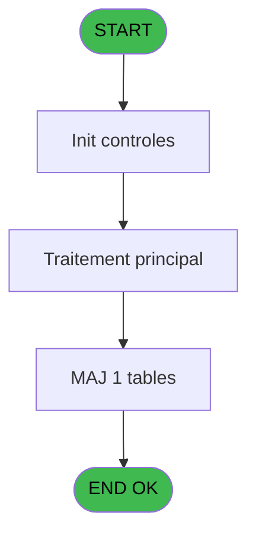
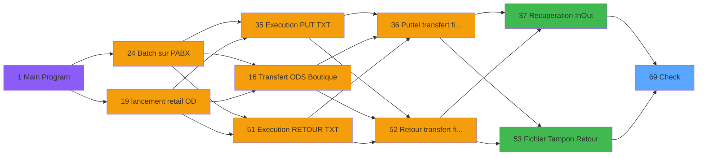

# POO IDE 69 - Check

> **Analyse**: Phases 1-4 2026-02-03 18:02 -> 18:02 (21s) | Assemblage 18:02
> **Pipeline**: V7.2 Enrichi
> **Structure**: 4 onglets (Resume | Ecrans | Donnees | Connexions)

<!-- TAB:Resume -->

## 1. FICHE D'IDENTITE

| Attribut | Valeur |
|----------|--------|
| Projet | POO |
| IDE Position | 69 |
| Nom Programme | Check |
| Fichier source | `Prg_69.xml` |
| Dossier IDE | Stats |
| Taches | 1 (0 ecrans visibles) |
| Tables modifiees | 1 |
| Programmes appeles | 0 |

## 2. DESCRIPTION FONCTIONNELLE

**Check** assure la gestion complete de ce processus, accessible depuis [   Recuperation In/Out (IDE 37)](POO-IDE-37.md), [   Fichier Tampon Retour (IDE 53)](POO-IDE-53.md).

Le flux de traitement s'organise en **1 blocs fonctionnels** :

- **Traitement** (1 tache) : traitements metier divers

**Donnees modifiees** : 1 tables en ecriture (table_generale).

## 3. BLOCS FONCTIONNELS

### 3.1 Traitement (1 tache)

Traitements internes.

---

#### 69 - Check

**Role** : Traitement : Check.
**Variables liees** : A (> Nbre Check In), B (> Nbre Check Out), C (> Nbre Check In Reussi), D (> Nbre Check In Erreur), E (> Nbre Check Out Reussi)

## 5. REGLES METIER

*(Aucune regle metier identifiee)*

## 6. CONTEXTE

- **Appele par**: [   Recuperation In/Out (IDE 37)](POO-IDE-37.md), [   Fichier Tampon Retour (IDE 53)](POO-IDE-53.md)
- **Appelle**: 0 programmes | **Tables**: 1 (W:1 R:0 L:0) | **Taches**: 1 | **Expressions**: 7

<!-- TAB:Ecrans -->

## 8. ECRANS

*(Programme sans ecran visible)*

## 9. NAVIGATION

### 9.3 Structure hierarchique (1 tache)

| Position | Tache | Type | Dimensions | Bloc |
|----------|-------|------|------------|------|
| **69.1** | [**Check** (69)](#t1) | MDI | - | Traitement |

### 9.4 Algorigramme

> **Legende**: Vert = START/END OK | Rouge = END KO | Bleu = Decisions
> *Algorigramme auto-genere. Utiliser `/algorigramme` pour une synthese metier detaillee.*

<!-- TAB:Donnees -->

## 10. TABLES

### Tables utilisees (1)

| ID | Nom | Description | Type | R | W | L | Usages |
|----|-----|-------------|------|---|---|---|--------|
| 459 | table_generale |  | DB |   | **W** |   | 1 |

### Colonnes par table (1 / 1 tables avec colonnes identifiees)

Table 459 - table_generale (**W**) - 1 usages

| Lettre | Variable | Acces | Type |
|--------|----------|-------|------|
| A | > Nbre Check In | W | Numeric |
| B | > Nbre Check Out | W | Numeric |
| C | > Nbre Check In Reussi | W | Numeric |
| D | > Nbre Check In Erreur | W | Numeric |
| E | > Nbre Check Out Reussi | W | Numeric |
| F | > Nbre Check Out Erreur | W | Numeric |

## 11. VARIABLES

### 11.1 Autres (6)

Variables diverses.

| Lettre | Nom | Type | Usage dans |
|--------|-----|------|-----------|
| A | > Nbre Check In | Numeric | [69](#t1) |
| B | > Nbre Check Out | Numeric | [69](#t1) |
| C | > Nbre Check In Reussi | Numeric | [69](#t1) |
| D | > Nbre Check In Erreur | Numeric | [69](#t1) |
| E | > Nbre Check Out Reussi | Numeric | [69](#t1) |
| F | > Nbre Check Out Erreur | Numeric | [69](#t1) |

## 12. EXPRESSIONS

**7 / 7 expressions decodees (100%)**

### 12.1 Repartition par type

| Type | Expressions | Regles |
|------|-------------|--------|
| CONDITION | 6 | 0 |
| DATE | 1 | 0 |

### 12.2 Expressions cles par type

#### CONDITION (6 expressions)

| Type | IDE | Expression | Regle |
|------|-----|------------|-------|
| CONDITION | 5 | `[K]+> Nbre Check Out Reussi [E]` | - |
| CONDITION | 6 | `[L]+> Nbre Check In Erreur [D]` | - |
| CONDITION | 7 | `[M]+> Nbre Check Out Erreur [F]` | - |
| CONDITION | 2 | `[H]+> Nbre Check In [A]` | - |
| CONDITION | 3 | `[I]+> Nbre Check Out [B]` | - |
| ... | | *+1 autres* | |

#### DATE (1 expressions)

| Type | IDE | Expression | Regle |
|------|-----|------------|-------|
| DATE | 1 | `Date ()` | - |

<!-- TAB:Connexions -->

## 13. GRAPHE D'APPELS

### 13.1 Chaine depuis Main (Callers)

Main -> ... -> [   Recuperation In/Out (IDE 37)](POO-IDE-37.md) -> **Check (IDE 69)**

Main -> ... -> [   Fichier Tampon Retour (IDE 53)](POO-IDE-53.md) -> **Check (IDE 69)**

### 13.2 Callers

| IDE | Nom Programme | Nb Appels |
|-----|---------------|-----------|
| [37](POO-IDE-37.md) |    Recuperation In/Out | 1 |
| [53](POO-IDE-53.md) |    Fichier Tampon Retour | 1 |

### 13.3 Callees (programmes appeles)

### 13.4 Detail Callees avec contexte

| IDE | Nom Programme | Appels | Contexte |
|-----|---------------|--------|----------|
| - | (aucun) | - | - |

## 14. RECOMMANDATIONS MIGRATION

### 14.1 Profil du programme

| Metrique | Valeur | Impact migration |
|----------|--------|-----------------|
| Lignes de logique | 31 | Programme compact |
| Expressions | 7 | Peu de logique |
| Tables WRITE | 1 | Impact faible |
| Sous-programmes | 0 | Peu de dependances |
| Ecrans visibles | 0 | Ecran unique ou traitement batch |
| Code desactive | 0% (0 / 31) | Code sain |
| Regles metier | 0 | Pas de regle identifiee |

### 14.2 Plan de migration par bloc

#### Traitement (1 tache: 0 ecran, 1 traitement)

- **Strategie** : 1 service(s) backend injectable(s) (Domain Services).
- Decomposer les taches en services unitaires testables.

### 14.3 Dependances critiques

| Dependance | Type | Appels | Impact |
|------------|------|--------|--------|
| table_generale | Table WRITE (Database) | 1x | Schema + repository |

---
*Spec DETAILED generee par Pipeline V7.2 - 2026-02-03 18:02*
