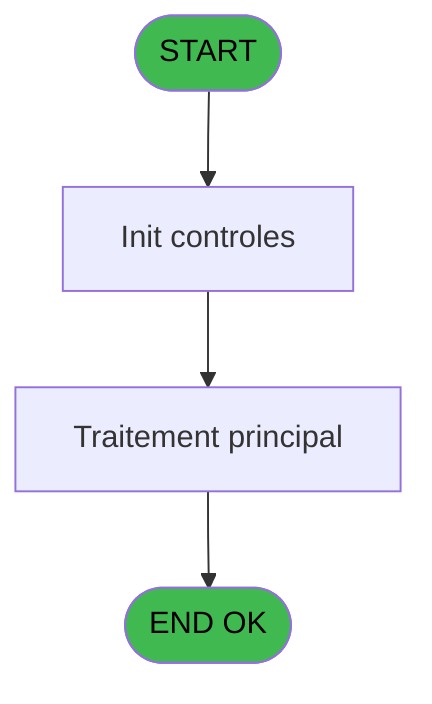

# POO IDE 71 - Visualisation Stat telephone

> **Analyse**: Phases 1-4 2026-02-03 18:03 -> 18:03 (19s) | Assemblage 18:03
> **Pipeline**: V7.2 Enrichi
> **Structure**: 4 onglets (Resume | Ecrans | Donnees | Connexions)

<!-- TAB:Resume -->

## 1. FICHE D'IDENTITE

| Attribut | Valeur |
|----------|--------|
| Projet | POO |
| IDE Position | 71 |
| Nom Programme | Visualisation Stat telephone |
| Fichier source | `Prg_71.xml` |
| Dossier IDE | Stats |
| Taches | 1 (1 ecrans visibles) |
| Tables modifiees | 0 |
| Programmes appeles | 0 |
| :warning: Statut | **ORPHELIN_POTENTIEL** |

## 2. DESCRIPTION FONCTIONNELLE

**Visualisation Stat telephone** assure la gestion complete de ce processus.

Le flux de traitement s'organise en **1 blocs fonctionnels** :

- **Traitement** (1 tache) : traitements metier divers

## 3. BLOCS FONCTIONNELS

### 3.1 Traitement (1 tache)

Traitements internes.

---

#### 71 - Statistiques Pooling [[ECRAN]](#ecran-t1)

**Role** : Traitement : Statistiques Pooling.
**Ecran** : 1136 x 217 DLU (MDI) | [Voir mockup](#ecran-t1)

## 5. REGLES METIER

*(Aucune regle metier identifiee)*

## 6. CONTEXTE

- **Appele par**: (aucun)
- **Appelle**: 0 programmes | **Tables**: 2 (W:0 R:1 L:1) | **Taches**: 1 | **Expressions**: 2

<!-- TAB:Ecrans -->

## 8. ECRANS

### 8.1 Forms visibles (1 / 1)

| # | Position | Tache | Nom | Type | Largeur | Hauteur | Bloc |
|---|----------|-------|-----|------|---------|---------|------|
| 1 | 71 | 71 | Statistiques Pooling | MDI | 1136 | 217 | Traitement |

### 8.2 Mockups Ecrans

---

#### 71 - Statistiques Pooling
**Tache** : [71](#t1) | **Type** : MDI | **Dimensions** : 1136 x 217 DLU
**Bloc** : Traitement | **Titre IDE** : Statistiques Pooling

<!-- FORM-DATA:
{
    "width":  1136,
    "vFactor":  8,
    "type":  "MDI",
    "hFactor":  8,
    "controls":  [
                     {
                         "x":  5,
                         "type":  "table",
                         "var":  "",
                         "name":  "",
                         "titleH":  12,
                         "color":  "",
                         "w":  1123,
                         "y":  0,
                         "fmt":  "",
                         "parent":  null,
                         "text":  "",
                         "rowH":  14,
                         "h":  156,
                         "cols":  [
                                      {
                                          "title":  "Date",
                                          "layer":  1,
                                          "w":  136
                                      },
                                      {
                                          "title":  "Check In",
                                          "layer":  2,
                                          "w":  108
                                      },
                                      {
                                          "title":  "Check Out",
                                          "layer":  3,
                                          "w":  117
                                      },
                                      {
                                          "title":  "Check In réussi",
                                          "layer":  4,
                                          "w":  139
                                      },
                                      {
                                          "title":  "Check Out réussi",
                                          "layer":  5,
                                          "w":  159
                                      },
                                      {
                                          "title":  "Check In Erreur",
                                          "layer":  6,
                                          "w":  137
                                      },
                                      {
                                          "title":  "Nb Tickets",
                                          "layer":  7,
                                          "w":  104
                                      },
                                      {
                                          "title":  "Récption dernier ticket",
                                          "layer":  8,
                                          "w":  191
                                      }
                                  ],
                         "rows":  8
                     },
                     {
                         "x":  140,
                         "type":  "label",
                         "var":  "",
                         "y":  167,
                         "w":  252,
                         "fmt":  "",
                         "name":  "",
                         "h":  8,
                         "color":  "",
                         "text":  "Date dernière activite Informatel",
                         "parent":  null
                     },
                     {
                         "x":  596,
                         "type":  "label",
                         "var":  "",
                         "y":  167,
                         "w":  262,
                         "fmt":  "",
                         "name":  "",
                         "h":  8,
                         "color":  "",
                         "text":  "Heure dernière activite Informatel",
                         "parent":  null
                     },
                     {
                         "x":  5,
                         "type":  "label",
                         "var":  "",
                         "y":  191,
                         "w":  1126,
                         "fmt":  "",
                         "name":  "",
                         "h":  24,
                         "color":  "",
                         "text":  "",
                         "parent":  null
                     },
                     {
                         "x":  23,
                         "type":  "edit",
                         "var":  "",
                         "y":  14,
                         "w":  104,
                         "fmt":  "",
                         "name":  "Date",
                         "h":  10,
                         "color":  "110",
                         "text":  "",
                         "parent":  1
                     },
                     {
                         "x":  161,
                         "type":  "edit",
                         "var":  "",
                         "y":  14,
                         "w":  70,
                         "fmt":  "",
                         "name":  "Nbre Check In",
                         "h":  10,
                         "color":  "110",
                         "text":  "",
                         "parent":  1
                     },
                     {
                         "x":  272,
                         "type":  "edit",
                         "var":  "",
                         "y":  14,
                         "w":  70,
                         "fmt":  "",
                         "name":  "Nbre Check Out",
                         "h":  10,
                         "color":  "110",
                         "text":  "",
                         "parent":  1
                     },
                     {
                         "x":  400,
                         "type":  "edit",
                         "var":  "",
                         "y":  14,
                         "w":  70,
                         "fmt":  "",
                         "name":  "Nbre Check In Reussi",
                         "h":  10,
                         "color":  "110",
                         "text":  "",
                         "parent":  1
                     },
                     {
                         "x":  557,
                         "type":  "edit",
                         "var":  "",
                         "y":  14,
                         "w":  70,
                         "fmt":  "",
                         "name":  "Nbre Check Out Reussi",
                         "h":  10,
                         "color":  "110",
                         "text":  "",
                         "parent":  1
                     },
                     {
                         "x":  701,
                         "type":  "edit",
                         "var":  "",
                         "y":  14,
                         "w":  70,
                         "fmt":  "",
                         "name":  "Nbre Check In Errreur",
                         "h":  10,
                         "color":  "110",
                         "text":  "",
                         "parent":  1
                     },
                     {
                         "x":  820,
                         "type":  "edit",
                         "var":  "",
                         "y":  14,
                         "w":  70,
                         "fmt":  "",
                         "name":  "Nbre Ticket",
                         "h":  10,
                         "color":  "110",
                         "text":  "",
                         "parent":  1
                     },
                     {
                         "x":  961,
                         "type":  "edit",
                         "var":  "",
                         "y":  14,
                         "w":  104,
                         "fmt":  "",
                         "name":  "Heure reception ticket",
                         "h":  10,
                         "color":  "110",
                         "text":  "",
                         "parent":  1
                     },
                     {
                         "x":  401,
                         "type":  "edit",
                         "var":  "",
                         "y":  167,
                         "w":  126,
                         "fmt":  "",
                         "name":  "",
                         "h":  10,
                         "color":  "",
                         "text":  "",
                         "parent":  null
                     },
                     {
                         "x":  862,
                         "type":  "edit",
                         "var":  "",
                         "y":  167,
                         "w":  126,
                         "fmt":  "",
                         "name":  "",
                         "h":  10,
                         "color":  "",
                         "text":  "",
                         "parent":  null
                     },
                     {
                         "x":  11,
                         "type":  "button",
                         "var":  "",
                         "y":  194,
                         "w":  154,
                         "fmt":  "\u0026Ok",
                         "name":  "Bouton Ok",
                         "h":  18,
                         "color":  "",
                         "text":  "",
                         "parent":  23
                     }
                 ],
    "taskId":  "71",
    "height":  217
}
-->

<strong>Champs : 10 champs</strong>

| Pos (x,y) | Nom | Variable | Type |
|-----------|-----|----------|------|
| 23,14 | Date | - | edit |
| 161,14 | Nbre Check In | - | edit |
| 272,14 | Nbre Check Out | - | edit |
| 400,14 | Nbre Check In Reussi | - | edit |
| 557,14 | Nbre Check Out Reussi | - | edit |
| 701,14 | Nbre Check In Errreur | - | edit |
| 820,14 | Nbre Ticket | - | edit |
| 961,14 | Heure reception ticket | - | edit |
| 401,167 | (sans nom) | - | edit |
| 862,167 | (sans nom) | - | edit |

<strong>Boutons : 1 boutons</strong>

| Bouton | Pos (x,y) | Action |
|--------|-----------|--------|
| Ok | 11,194 | Valide la saisie et enregistre |

## 9. NAVIGATION

Ecran unique: **Statistiques Pooling**

### 9.3 Structure hierarchique (1 tache)

| Position | Tache | Type | Dimensions | Bloc |
|----------|-------|------|------------|------|
| **71.1** | [**Statistiques Pooling** (71)](#t1) [mockup](#ecran-t1) | MDI | 1136x217 | Traitement |

### 9.4 Algorigramme

> **Legende**: Vert = START/END OK | Rouge = END KO | Bleu = Decisions
> *Algorigramme auto-genere. Utiliser `/algorigramme` pour une synthese metier detaillee.*

<!-- TAB:Donnees -->

## 10. TABLES

### Tables utilisees (2)

| ID | Nom | Description | Type | R | W | L | Usages |
|----|-----|-------------|------|---|---|---|--------|
| 459 | table_generale |  | DB |   |   | L | 1 |
| 477 | cumul_devises_tempo | Table temporaire ecran | TMP | R |   |   | 1 |

### Colonnes par table (1 / 1 tables avec colonnes identifiees)

Table 477 - cumul_devises_tempo (R) - 1 usages

| Lettre | Variable | Acces | Type |
|--------|----------|-------|------|
| A | v. sortie | R | Logical |
| B | Bouton Ok | R | Alpha |

## 11. VARIABLES

### 11.1 Variables de session (1)

Variables persistantes pendant toute la session.

| Lettre | Nom | Type | Usage dans |
|--------|-----|------|-----------|
| A | v. sortie | Logical | - |

### 11.2 Autres (1)

Variables diverses.

| Lettre | Nom | Type | Usage dans |
|--------|-----|------|-----------|
| B | Bouton Ok | Alpha | - |

## 12. EXPRESSIONS

**2 / 2 expressions decodees (100%)**

### 12.1 Repartition par type

| Type | Expressions | Regles |
|------|-------------|--------|
| CONSTANTE | 2 | 0 |

### 12.2 Expressions cles par type

#### CONSTANTE (2 expressions)

| Type | IDE | Expression | Regle |
|------|-----|------------|-------|
| CONSTANTE | 2 | `1` | - |
| CONSTANTE | 1 | `'C'` | - |

<!-- TAB:Connexions -->

## 13. GRAPHE D'APPELS

### 13.1 Chaine depuis Main (Callers)

**Chemin**: (pas de callers directs)

### 13.2 Callers

| IDE | Nom Programme | Nb Appels |
|-----|---------------|-----------|
| - | (aucun) | - |

### 13.3 Callees (programmes appeles)

### 13.4 Detail Callees avec contexte

| IDE | Nom Programme | Appels | Contexte |
|-----|---------------|--------|----------|
| - | (aucun) | - | - |

## 14. RECOMMANDATIONS MIGRATION

### 14.1 Profil du programme

| Metrique | Valeur | Impact migration |
|----------|--------|-----------------|
| Lignes de logique | 25 | Programme compact |
| Expressions | 2 | Peu de logique |
| Tables WRITE | 0 | Impact faible |
| Sous-programmes | 0 | Peu de dependances |
| Ecrans visibles | 1 | Ecran unique ou traitement batch |
| Code desactive | 0% (0 / 25) | Code sain |
| Regles metier | 0 | Pas de regle identifiee |

### 14.2 Plan de migration par bloc

#### Traitement (1 tache: 1 ecran, 0 traitement)

- **Strategie** : 1 composant(s) UI (Razor/React) avec formulaires et validation.
- Decomposer les taches en services unitaires testables.

### 14.3 Dependances critiques

| Dependance | Type | Appels | Impact |
|------------|------|--------|--------|

---
*Spec DETAILED generee par Pipeline V7.2 - 2026-02-03 18:03*
