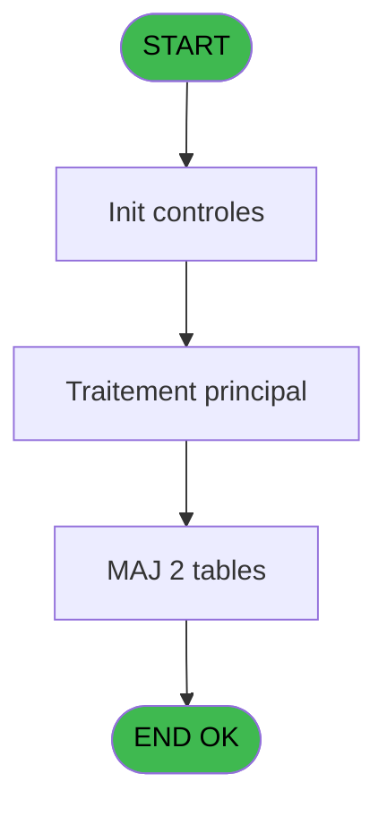
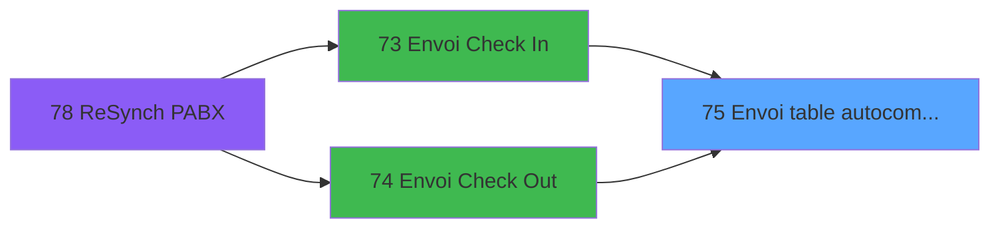

# POO IDE 75 - Envoi table autocom PABX

> **Analyse**: Phases 1-4 2026-02-03 18:04 -> 18:05 (46s) | Assemblage 18:05
> **Pipeline**: V7.2 Enrichi
> **Structure**: 4 onglets (Resume | Ecrans | Donnees | Connexions)

<!-- TAB:Resume -->

## 1. FICHE D'IDENTITE

| Attribut | Valeur |
|----------|--------|
| Projet | POO |
| IDE Position | 75 |
| Nom Programme | Envoi table autocom PABX |
| Fichier source | `Prg_75.xml` |
| Dossier IDE | Utilitaires |
| Taches | 4 (0 ecrans visibles) |
| Tables modifiees | 2 |
| Programmes appeles | 1 |

## 2. DESCRIPTION FONCTIONNELLE

**Envoi table autocom PABX** assure la gestion complete de ce processus, accessible depuis [Envoi Check In (IDE 73)](POO-IDE-73.md), [Envoi Check Out (IDE 74)](POO-IDE-74.md).

Le flux de traitement s'organise en **2 blocs fonctionnels** :

- **Traitement** (3 taches) : traitements metier divers
- **Creation** (1 tache) : insertion d'enregistrements en base (mouvements, prestations)

**Donnees modifiees** : 2 tables en ecriture (commande_autocom_cot, param__telephone_tel).

Detail : phases du traitement

#### Phase 1 : Traitement (3 taches)

- **75** - CM  Envoi table autocom **[[ECRAN]](#ecran-t1)**
- **75.1** - Boucle code autocom
- **75.2** - Lecture type de triplet

Delegue a : [Delete table SQL (IDE 79)](POO-IDE-79.md)

#### Phase 2 : Creation (1 tache)

- **75.1.1** - Creation commande tel

#### Tables impactees

| Table | Operations | Role metier |
|-------|-----------|-------------|
| param__telephone_tel | **W** (1 usages) |  |
| commande_autocom_cot | **W** (1 usages) |  |

## 3. BLOCS FONCTIONNELS

### 3.1 Traitement (3 taches)

Traitements internes.

---

#### 75 - CM  Envoi table autocom [[ECRAN]](#ecran-t1)

**Role** : Traitement : CM  Envoi table autocom.
**Ecran** : 100 x 24 DLU (MDI) | [Voir mockup](#ecran-t1)
**Variables liees** : A (> type envoi)
**Delegue a** : [Delete table SQL (IDE 79)](POO-IDE-79.md)

---

#### 75.1 - Boucle code autocom

**Role** : Traitement : Boucle code autocom.
**Delegue a** : [Delete table SQL (IDE 79)](POO-IDE-79.md)

---

#### 75.2 - Lecture type de triplet

**Role** : Traitement : Lecture type de triplet.
**Variables liees** : B (W0 type triplet), A (> type envoi)
**Delegue a** : [Delete table SQL (IDE 79)](POO-IDE-79.md)

### 3.2 Creation (1 tache)

Insertion de nouveaux enregistrements en base.

---

#### 75.1.1 - Creation commande tel

**Role** : Creation d'enregistrement : Creation commande tel.

## 5. REGLES METIER

*(Aucune regle metier identifiee)*

## 6. CONTEXTE

- **Appele par**: [Envoi Check In (IDE 73)](POO-IDE-73.md), [Envoi Check Out (IDE 74)](POO-IDE-74.md)
- **Appelle**: 1 programmes | **Tables**: 7 (W:2 R:1 L:4) | **Taches**: 4 | **Expressions**: 7

<!-- TAB:Ecrans -->

## 8. ECRANS

*(Programme sans ecran visible)*

## 9. NAVIGATION

### 9.3 Structure hierarchique (4 taches)

| Position | Tache | Type | Dimensions | Bloc |
|----------|-------|------|------------|------|
| **75.1** | [**CM  Envoi table autocom** (75)](#t1) [mockup](#ecran-t1) | MDI | 100x24 | Traitement |
| 75.1.1 | [Boucle code autocom (75.1)](#t2) | MDI | - | |
| 75.1.2 | [Lecture type de triplet (75.2)](#t4) | MDI | - | |
| **75.2** | [**Creation commande tel** (75.1.1)](#t3) | MDI | - | Creation |

### 9.4 Algorigramme

> **Legende**: Vert = START/END OK | Rouge = END KO | Bleu = Decisions
> *Algorigramme auto-genere. Utiliser `/algorigramme` pour une synthese metier detaillee.*

<!-- TAB:Donnees -->

## 10. TABLES

### Tables utilisees (7)

| ID | Nom | Description | Type | R | W | L | Usages |
|----|-----|-------------|------|---|---|---|--------|
| 30 | gm-recherche_____gmr | Index de recherche | DB | R |   |   | 1 |
| 75 | commande_autocom_cot |  | DB |   | **W** |   | 1 |
| 78 | param__telephone_tel |  | DB |   | **W** |   | 1 |
| 80 | codes_autocom____aut |  | DB |   |   | L | 1 |
| 130 | fichier_langue |  | DB |   |   | L | 1 |
| 131 | fichier_validation |  | DB |   |   | L | 1 |
| 152 | parametres_pour_pabx |  | DB |   |   | L | 1 |

### Colonnes par table (0 / 3 tables avec colonnes identifiees)

Table 30 - gm-recherche_____gmr (R) - 1 usages

*Table utilisee uniquement en Link ou aucune colonne Real identifiee dans le DataView.*

Table 75 - commande_autocom_cot (**W**) - 1 usages

*Table utilisee uniquement en Link ou aucune colonne Real identifiee dans le DataView.*

Table 78 - param__telephone_tel (**W**) - 1 usages

*Table utilisee uniquement en Link ou aucune colonne Real identifiee dans le DataView.*

## 11. VARIABLES

### 11.1 Variables de travail (3)

Variables internes au programme.

| Lettre | Nom | Type | Usage dans |
|--------|-----|------|-----------|
| B | W0 type triplet | Alpha | - |
| C | W0 nom ASCII | Alpha | - |
| D | W0 confirmation | Numeric | 1x calcul interne |

### 11.2 Autres (1)

Variables diverses.

| Lettre | Nom | Type | Usage dans |
|--------|-----|------|-----------|
| A | > type envoi | Alpha | - |

## 12. EXPRESSIONS

**7 / 7 expressions decodees (100%)**

### 12.1 Repartition par type

| Type | Expressions | Regles |
|------|-------------|--------|
| CONCATENATION | 2 | 0 |
| OTHER | 2 | 0 |
| CONDITION | 1 | 0 |
| NEGATION | 1 | 0 |
| REFERENCE_VG | 1 | 0 |

### 12.2 Expressions cles par type

#### CONCATENATION (2 expressions)

| Type | IDE | Expression | Regle |
|------|-----|------------|-------|
| CONCATENATION | 4 | `'2'&DStr (Date (),'DD')&ASCIIChr (65+Hour (Time ()))&TStr (Time (),'MMSS')&'.'&GetShortHostname ()` | - |
| CONCATENATION | 3 | `'2'&DStr (Date (),'DD')&ASCIIChr (65+Hour (Time ()))&TStr (Time (),'MMSS')&'.'&Str (VG14,'3P0')` | - |

#### OTHER (2 expressions)

| Type | IDE | Expression | Regle |
|------|-----|------------|-------|
| OTHER | 2 | `SetCrsr (1)` | - |
| OTHER | 1 | `SetCrsr (2)` | - |

#### CONDITION (1 expressions)

| Type | IDE | Expression | Regle |
|------|-----|------------|-------|
| CONDITION | 5 | `W0 confirmation [D]=6` | - |

#### NEGATION (1 expressions)

| Type | IDE | Expression | Regle |
|------|-----|------------|-------|
| NEGATION | 6 | `NOT VG13` | - |

#### REFERENCE_VG (1 expressions)

| Type | IDE | Expression | Regle |
|------|-----|------------|-------|
| REFERENCE_VG | 7 | `VG13` | - |

<!-- TAB:Connexions -->

## 13. GRAPHE D'APPELS

### 13.1 Chaine depuis Main (Callers)

Main -> ... -> [Envoi Check In (IDE 73)](POO-IDE-73.md) -> **Envoi table autocom PABX (IDE 75)**

Main -> ... -> [Envoi Check Out (IDE 74)](POO-IDE-74.md) -> **Envoi table autocom PABX (IDE 75)**

### 13.2 Callers

| IDE | Nom Programme | Nb Appels |
|-----|---------------|-----------|
| [73](POO-IDE-73.md) | Envoi Check In | 1 |
| [74](POO-IDE-74.md) | Envoi Check Out | 1 |

### 13.3 Callees (programmes appeles)

### 13.4 Detail Callees avec contexte

| IDE | Nom Programme | Appels | Contexte |
|-----|---------------|--------|----------|
| [79](POO-IDE-79.md) | Delete table SQL | 1 | Sous-programme |

## 14. RECOMMANDATIONS MIGRATION

### 14.1 Profil du programme

| Metrique | Valeur | Impact migration |
|----------|--------|-----------------|
| Lignes de logique | 88 | Programme compact |
| Expressions | 7 | Peu de logique |
| Tables WRITE | 2 | Impact faible |
| Sous-programmes | 1 | Peu de dependances |
| Ecrans visibles | 0 | Ecran unique ou traitement batch |
| Code desactive | 2.3% (2 / 88) | Code sain |
| Regles metier | 0 | Pas de regle identifiee |

### 14.2 Plan de migration par bloc

#### Traitement (3 taches: 1 ecran, 2 traitements)

- **Strategie** : Orchestrateur avec 1 ecrans (Razor/React) et 2 traitements backend (services).
- Les ecrans deviennent des composants UI, les traitements invisibles deviennent des services injectables.
- 1 sous-programme(s) a migrer ou a reutiliser depuis les services existants.
- Decomposer les taches en services unitaires testables.

#### Creation (1 tache: 0 ecran, 1 traitement)

- **Strategie** : Repository pattern avec Entity Framework Core.
- Insertion via `IRepository<T>.CreateAsync()`

### 14.3 Dependances critiques

| Dependance | Type | Appels | Impact |
|------------|------|--------|--------|
| commande_autocom_cot | Table WRITE (Database) | 1x | Schema + repository |
| param__telephone_tel | Table WRITE (Database) | 1x | Schema + repository |
| [Delete table SQL (IDE 79)](POO-IDE-79.md) | Sous-programme | 1x | Normale - Sous-programme |

---
*Spec DETAILED generee par Pipeline V7.2 - 2026-02-03 18:05*
