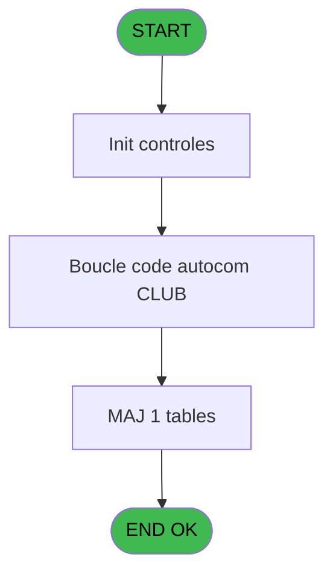

# POO IDE 76 - Envoi autocom PABX

> **Analyse**: Phases 1-4 2026-02-03 18:05 -> 18:06 (16s) | Assemblage 18:06
> **Pipeline**: V7.2 Enrichi
> **Structure**: 4 onglets (Resume | Ecrans | Donnees | Connexions)

<!-- TAB:Resume -->

## 1. FICHE D'IDENTITE

| Attribut | Valeur |
|----------|--------|
| Projet | POO |
| IDE Position | 76 |
| Nom Programme | Envoi autocom PABX |
| Fichier source | `Prg_76.xml` |
| Dossier IDE | Utilitaires |
| Taches | 5 (1 ecrans visibles) |
| Tables modifiees | 1 |
| Programmes appeles | 1 |
| :warning: Statut | **ORPHELIN_POTENTIEL** |

## 2. DESCRIPTION FONCTIONNELLE

**Envoi autocom PABX** assure la gestion complete de ce processus.

Le flux de traitement s'organise en **2 blocs fonctionnels** :

- **Traitement** (4 taches) : traitements metier divers
- **Creation** (1 tache) : insertion d'enregistrements en base (mouvements, prestations)

**Donnees modifiees** : 1 tables en ecriture (commande_autocom_cot).

**Logique metier** : 1 regles identifiees couvrant conditions metier.

Detail : phases du traitement

#### Phase 1 : Traitement (4 taches)

- **76** - CM  Envoi table autocom **[[ECRAN]](#ecran-t1)**
- **76.1** - Liste codes autocom **[[ECRAN]](#ecran-t2)**
- **76.1.2** - Boucle code autocom **[[ECRAN]](#ecran-t4)**
- **76.2** - Lecture type de triplet

Delegue a : [Delete table SQL (IDE 79)](POO-IDE-79.md)

#### Phase 2 : Creation (1 tache)

- **76.1.1** - Creation commande tel

#### Tables impactees

| Table | Operations | Role metier |
|-------|-----------|-------------|
| commande_autocom_cot | **W** (1 usages) |  |

## 3. BLOCS FONCTIONNELS

### 3.1 Traitement (4 taches)

Traitements internes.

---

#### 76 - CM  Envoi table autocom [[ECRAN]](#ecran-t1)

**Role** : Traitement : CM  Envoi table autocom.
**Ecran** : 100 x 24 DLU (MDI) | [Voir mockup](#ecran-t1)

3 sous-taches directes

| Tache | Nom | Bloc |
|-------|-----|------|
| [76.1](#t2) | Liste codes autocom **[[ECRAN]](#ecran-t2)** | Traitement |
| [76.1.2](#t4) | Boucle code autocom **[[ECRAN]](#ecran-t4)** | Traitement |
| [76.2](#t5) | Lecture type de triplet | Traitement |

**Delegue a** : [Delete table SQL (IDE 79)](POO-IDE-79.md)

---

#### 76.1 - Liste codes autocom [[ECRAN]](#ecran-t2)

**Role** : Traitement : Liste codes autocom.
**Ecran** : 994 x 178 DLU (MDI) | [Voir mockup](#ecran-t2)
**Delegue a** : [Delete table SQL (IDE 79)](POO-IDE-79.md)

---

#### 76.1.2 - Boucle code autocom [[ECRAN]](#ecran-t4)

**Role** : Traitement : Boucle code autocom.
**Ecran** : 942 x 178 DLU (MDI) | [Voir mockup](#ecran-t4)
**Delegue a** : [Delete table SQL (IDE 79)](POO-IDE-79.md)

---

#### 76.2 - Lecture type de triplet

**Role** : Traitement : Lecture type de triplet.
**Variables liees** : A (W0 type triplet), E (Bouton Triplet)
**Delegue a** : [Delete table SQL (IDE 79)](POO-IDE-79.md)

### 3.2 Creation (1 tache)

Insertion de nouveaux enregistrements en base.

---

#### 76.1.1 - Creation commande tel

**Role** : Creation d'enregistrement : Creation commande tel.

## 5. REGLES METIER

1 regles identifiees:

### Autres (1 regles)

#### [RM-001] Si [G]='P' alors RTrim ([H])&'+' sinon RTrim ([H])&'-')

| Element | Detail |
|---------|--------|
| **Condition** | `[G]='P'` |
| **Si vrai** | RTrim ([H])&'+' |
| **Si faux** | RTrim ([H])&'-') |
| **Expression source** | Expression 8 : `IF ([G]='P',RTrim ([H])&'+',RTrim ([H])&'-')` |
| **Exemple** | Si [G]='P' → RTrim ([H])&'+'. Sinon → RTrim ([H])&'-') |

## 6. CONTEXTE

- **Appele par**: (aucun)
- **Appelle**: 1 programmes | **Tables**: 8 (W:1 R:2 L:5) | **Taches**: 5 | **Expressions**: 27

<!-- TAB:Ecrans -->

## 8. ECRANS

### 8.1 Forms visibles (1 / 5)

| # | Position | Tache | Nom | Type | Largeur | Hauteur | Bloc |
|---|----------|-------|-----|------|---------|---------|------|
| 1 | 76.1 | 76.1 | Liste codes autocom | MDI | 994 | 178 | Traitement |

### 8.2 Mockups Ecrans

---

#### 76.1 - Liste codes autocom
**Tache** : [76.1](#t2) | **Type** : MDI | **Dimensions** : 994 x 178 DLU
**Bloc** : Traitement | **Titre IDE** : Liste codes autocom

<!-- FORM-DATA:
{
    "width":  994,
    "vFactor":  8,
    "type":  "MDI",
    "hFactor":  8,
    "controls":  [
                     {
                         "x":  13,
                         "type":  "table",
                         "var":  "",
                         "name":  "",
                         "titleH":  12,
                         "color":  "110",
                         "w":  966,
                         "y":  7,
                         "fmt":  "",
                         "parent":  null,
                         "text":  "",
                         "rowH":  14,
                         "h":  127,
                         "cols":  [
                                      {
                                          "title":  "Nom GM",
                                          "layer":  1,
                                          "w":  362
                                      },
                                      {
                                          "title":  "Poste",
                                          "layer":  2,
                                          "w":  101
                                      },
                                      {
                                          "title":  "Ligne téléphone",
                                          "layer":  3,
                                          "w":  175
                                      },
                                      {
                                          "title":  "Code autocom",
                                          "layer":  4,
                                          "w":  294
                                      }
                                  ],
                         "rows":  4
                     },
                     {
                         "x":  813,
                         "type":  "label",
                         "var":  "",
                         "y":  22,
                         "w":  96,
                         "fmt":  "",
                         "name":  "",
                         "h":  8,
                         "color":  "143",
                         "text":  "Opposition",
                         "parent":  1
                     },
                     {
                         "x":  13,
                         "type":  "label",
                         "var":  "",
                         "y":  154,
                         "w":  966,
                         "fmt":  "",
                         "name":  "",
                         "h":  24,
                         "color":  "",
                         "text":  "",
                         "parent":  null
                     },
                     {
                         "x":  664,
                         "type":  "edit",
                         "var":  "",
                         "y":  21,
                         "w":  82,
                         "fmt":  "",
                         "name":  "AUT code autocom",
                         "h":  10,
                         "color":  "110",
                         "text":  "",
                         "parent":  1
                     },
                     {
                         "x":  514,
                         "type":  "edit",
                         "var":  "",
                         "y":  21,
                         "w":  82,
                         "fmt":  "",
                         "name":  "AUT ligne telephone",
                         "h":  10,
                         "color":  "110",
                         "text":  "",
                         "parent":  1
                     },
                     {
                         "x":  384,
                         "type":  "edit",
                         "var":  "",
                         "y":  21,
                         "w":  82,
                         "fmt":  "",
                         "name":  "AUT poste",
                         "h":  10,
                         "color":  "110",
                         "text":  "",
                         "parent":  1
                     },
                     {
                         "x":  19,
                         "type":  "edit",
                         "var":  "",
                         "y":  21,
                         "w":  350,
                         "fmt":  "",
                         "name":  "",
                         "h":  10,
                         "color":  "110",
                         "text":  "",
                         "parent":  1
                     },
                     {
                         "x":  20,
                         "type":  "button",
                         "var":  "",
                         "y":  157,
                         "w":  154,
                         "fmt":  "\u0026Quitter",
                         "name":  "Bouton Quitter",
                         "h":  18,
                         "color":  "",
                         "text":  "",
                         "parent":  12
                     },
                     {
                         "x":  189,
                         "type":  "button",
                         "var":  "",
                         "y":  157,
                         "w":  154,
                         "fmt":  "Envoi \u0026Triplet",
                         "name":  "Bouton Triplet",
                         "h":  18,
                         "color":  "",
                         "text":  "",
                         "parent":  12
                     },
                     {
                         "x":  914,
                         "type":  "image",
                         "var":  "",
                         "y":  21,
                         "w":  32,
                         "fmt":  "",
                         "name":  "",
                         "h":  11,
                         "color":  "110",
                         "text":  "",
                         "parent":  1
                     }
                 ],
    "taskId":  "76.1",
    "height":  178
}
-->

<strong>Champs : 4 champs</strong>

| Pos (x,y) | Nom | Variable | Type |
|-----------|-----|----------|------|
| 664,21 | AUT code autocom | - | edit |
| 514,21 | AUT ligne telephone | - | edit |
| 384,21 | AUT poste | - | edit |
| 19,21 | (sans nom) | - | edit |

<strong>Boutons : 2 boutons</strong>

| Bouton | Pos (x,y) | Action |
|--------|-----------|--------|
| Quitter | 20,157 | Quitte le programme |
| Envoi Triplet | 189,157 | Bouton fonctionnel |

## 9. NAVIGATION

Ecran unique: **Liste codes autocom**

### 9.3 Structure hierarchique (5 taches)

| Position | Tache | Type | Dimensions | Bloc |
|----------|-------|------|------------|------|
| **76.1** | [**CM  Envoi table autocom** (76)](#t1) [mockup](#ecran-t1) | MDI | 100x24 | Traitement |
| 76.1.1 | [Liste codes autocom (76.1)](#t2) [mockup](#ecran-t2) | MDI | 994x178 | |
| 76.1.2 | [Boucle code autocom (76.1.2)](#t4) [mockup](#ecran-t4) | MDI | 942x178 | |
| 76.1.3 | [Lecture type de triplet (76.2)](#t5) | MDI | - | |
| **76.2** | [**Creation commande tel** (76.1.1)](#t3) | MDI | - | Creation |

### 9.4 Algorigramme

> **Legende**: Vert = START/END OK | Rouge = END KO | Bleu = Decisions
> *Algorigramme auto-genere. Utiliser `/algorigramme` pour une synthese metier detaillee.*

<!-- TAB:Donnees -->

## 10. TABLES

### Tables utilisees (8)

| ID | Nom | Description | Type | R | W | L | Usages |
|----|-----|-------------|------|---|---|---|--------|
| 30 | gm-recherche_____gmr | Index de recherche | DB | R |   |   | 1 |
| 75 | commande_autocom_cot |  | DB |   | **W** |   | 1 |
| 78 | param__telephone_tel |  | DB | R |   |   | 1 |
| 80 | codes_autocom____aut |  | DB |   |   | L | 1 |
| 130 | fichier_langue |  | DB |   |   | L | 1 |
| 131 | fichier_validation |  | DB |   |   | L | 1 |
| 152 | parametres_pour_pabx |  | DB |   |   | L | 1 |
| 454 | tai_gm |  | DB |   |   | L | 1 |

### Colonnes par table (2 / 3 tables avec colonnes identifiees)

Table 30 - gm-recherche_____gmr (R) - 1 usages

| Lettre | Variable | Acces | Type |
|--------|----------|-------|------|
| A | W1 triplet | R | Alpha |
| B | v. cdrt retour pabx | R | Logical |
| C | v. quitter | R | Logical |
| D | Bouton Quitter | R | Alpha |
| E | Bouton Triplet | R | Alpha |

Table 75 - commande_autocom_cot (**W**) - 1 usages

*Table utilisee uniquement en Link ou aucune colonne Real identifiee dans le DataView.*

Table 78 - param__telephone_tel (R) - 1 usages

*Table utilisee uniquement en Link ou aucune colonne Real identifiee dans le DataView.*

## 11. VARIABLES

### 11.1 Variables de travail (3)

Variables internes au programme.

| Lettre | Nom | Type | Usage dans |
|--------|-----|------|-----------|
| A | W0 type triplet | Alpha | [76.2](#t5) |
| B | W0 nom ASCII | Alpha | 2x calcul interne |
| C | W0 confirmation | Logical | 1x calcul interne |

### 11.2 Autres (2)

Variables diverses.

| Lettre | Nom | Type | Usage dans |
|--------|-----|------|-----------|
| D | Bouton Quitter | Alpha | 1x refs |
| E | Bouton Triplet | Alpha | [76.2](#t5) |

## 12. EXPRESSIONS

**27 / 27 expressions decodees (100%)**

### 12.1 Repartition par type

| Type | Expressions | Regles |
|------|-------------|--------|
| CONCATENATION | 6 | 5 |
| CONDITION | 8 | 0 |
| CONSTANTE | 1 | 0 |
| OTHER | 9 | 0 |
| NEGATION | 1 | 0 |
| REFERENCE_VG | 1 | 0 |
| STRING | 1 | 0 |

### 12.2 Expressions cles par type

#### CONCATENATION (6 expressions)

| Type | IDE | Expression | Regle |
|------|-----|------------|-------|
| CONCATENATION | 8 | `IF ([G]='P',RTrim ([H])&'+',RTrim ([H])&'-')` | [RM-001](#rm-RM-001) |
| CONCATENATION | 5 | `Fill (' ',6)&Str (Bouton Triplet [E],'6')&Str (W0 type triplet [A],'6')` | - |
| CONCATENATION | 6 | `Str ([F],'6')&Fill (' ',6)&Str (W0 type triplet [A],'6')` | - |
| CONCATENATION | 4 | `Str ([F],'6')&Str (Bouton Triplet [E],'6')&Str (W0 type triplet [A],'6')` | - |
| CONCATENATION | 1 | `'2'&DStr (Date (),'DD')&ASCIIChr (65+Hour (Time ()))&TStr (Time (),'MMSS')&'.'&Str (VG14,'3P0')` | - |
| ... | | *+1 autres* | |

#### CONDITION (8 expressions)

| Type | IDE | Expression | Regle |
|------|-----|------------|-------|
| CONDITION | 12 | `{1,1}='4'` | - |
| CONDITION | 11 | `{1,1}='3'` | - |
| CONDITION | 25 | `[AD]=0 AND [X]` | - |
| CONDITION | 19 | `[G]<>'P'` | - |
| CONDITION | 24 | `IF ([G]='P','+','-')` | - |
| ... | | *+3 autres* | |

#### CONSTANTE (1 expressions)

| Type | IDE | Expression | Regle |
|------|-----|------------|-------|
| CONSTANTE | 17 | `''` | - |

#### OTHER (9 expressions)

| Type | IDE | Expression | Regle |
|------|-----|------------|-------|
| OTHER | 21 | `W0 type triplet [A]` | - |
| OTHER | 20 | `W0 nom ASCII [B]` | - |
| OTHER | 23 | `Bouton Triplet [E]` | - |
| OTHER | 22 | `[F]` | - |
| OTHER | 16 | `Left ([M],1)` | - |
| ... | | *+4 autres* | |

#### NEGATION (1 expressions)

| Type | IDE | Expression | Regle |
|------|-----|------------|-------|
| NEGATION | 26 | `NOT VG13` | - |

#### REFERENCE_VG (1 expressions)

| Type | IDE | Expression | Regle |
|------|-----|------------|-------|
| REFERENCE_VG | 27 | `VG13` | - |

#### STRING (1 expressions)

| Type | IDE | Expression | Regle |
|------|-----|------------|-------|
| STRING | 7 | `Fill (' ',12)&Str (W0 type triplet [A],'6')` | - |

### 12.3 Toutes les expressions (27)

Voir les 27 expressions

#### CONCATENATION (6)

| IDE | Expression Decodee |
|-----|-------------------|
| 8 | `IF ([G]='P',RTrim ([H])&'+',RTrim ([H])&'-')` |
| 1 | `'2'&DStr (Date (),'DD')&ASCIIChr (65+Hour (Time ()))&TStr (Time (),'MMSS')&'.'&Str (VG14,'3P0')` |
| 2 | `'2'&DStr (Date (),'DD')&ASCIIChr (65+Hour (Time ()))&TStr (Time (),'MMSS')&'.'&GetShortHostname ()` |
| 4 | `Str ([F],'6')&Str (Bouton Triplet [E],'6')&Str (W0 type triplet [A],'6')` |
| 5 | `Fill (' ',6)&Str (Bouton Triplet [E],'6')&Str (W0 type triplet [A],'6')` |
| 6 | `Str ([F],'6')&Fill (' ',6)&Str (W0 type triplet [A],'6')` |

#### CONDITION (8)

| IDE | Expression Decodee |
|-----|-------------------|
| 18 | `IF ([G]='P',1,11)` |
| 24 | `IF ([G]='P','+','-')` |
| 9 | `{1,1}='1'` |
| 10 | `{1,1}='2'` |
| 11 | `{1,1}='3'` |
| 12 | `{1,1}='4'` |
| 19 | `[G]<>'P'` |
| 25 | `[AD]=0 AND [X]` |

#### CONSTANTE (1)

| IDE | Expression Decodee |
|-----|-------------------|
| 17 | `''` |

#### OTHER (9)

| IDE | Expression Decodee |
|-----|-------------------|
| 3 | `DbName ('{151,2}'DSOURCE)` |
| 13 | `W0 nom ASCII [B]` |
| 14 | `W0 confirmation [C]` |
| 15 | `Bouton Quitter [D]` |
| 16 | `Left ([M],1)` |
| 20 | `W0 nom ASCII [B]` |
| 21 | `W0 type triplet [A]` |
| 22 | `[F]` |
| 23 | `Bouton Triplet [E]` |

#### NEGATION (1)

| IDE | Expression Decodee |
|-----|-------------------|
| 26 | `NOT VG13` |

#### REFERENCE_VG (1)

| IDE | Expression Decodee |
|-----|-------------------|
| 27 | `VG13` |

#### STRING (1)

| IDE | Expression Decodee |
|-----|-------------------|
| 7 | `Fill (' ',12)&Str (W0 type triplet [A],'6')` |

<!-- TAB:Connexions -->

## 13. GRAPHE D'APPELS

### 13.1 Chaine depuis Main (Callers)

**Chemin**: (pas de callers directs)

### 13.2 Callers

| IDE | Nom Programme | Nb Appels |
|-----|---------------|-----------|
| - | (aucun) | - |

### 13.3 Callees (programmes appeles)

### 13.4 Detail Callees avec contexte

| IDE | Nom Programme | Appels | Contexte |
|-----|---------------|--------|----------|
| [79](POO-IDE-79.md) | Delete table SQL | 1 | Sous-programme |

## 14. RECOMMANDATIONS MIGRATION

### 14.1 Profil du programme

| Metrique | Valeur | Impact migration |
|----------|--------|-----------------|
| Lignes de logique | 105 | Programme compact |
| Expressions | 27 | Peu de logique |
| Tables WRITE | 1 | Impact faible |
| Sous-programmes | 1 | Peu de dependances |
| Ecrans visibles | 1 | Ecran unique ou traitement batch |
| Code desactive | 1% (1 / 105) | Code sain |
| Regles metier | 1 | Quelques regles a preserver |

### 14.2 Plan de migration par bloc

#### Traitement (4 taches: 3 ecrans, 1 traitement)

- **Strategie** : Orchestrateur avec 3 ecrans (Razor/React) et 1 traitements backend (services).
- Les ecrans deviennent des composants UI, les traitements invisibles deviennent des services injectables.
- 1 sous-programme(s) a migrer ou a reutiliser depuis les services existants.
- Decomposer les taches en services unitaires testables.

#### Creation (1 tache: 0 ecran, 1 traitement)

- **Strategie** : Repository pattern avec Entity Framework Core.
- Insertion via `IRepository<T>.CreateAsync()`

### 14.3 Dependances critiques

| Dependance | Type | Appels | Impact |
|------------|------|--------|--------|
| commande_autocom_cot | Table WRITE (Database) | 1x | Schema + repository |
| [Delete table SQL (IDE 79)](POO-IDE-79.md) | Sous-programme | 1x | Normale - Sous-programme |

---
*Spec DETAILED generee par Pipeline V7.2 - 2026-02-03 18:06*
