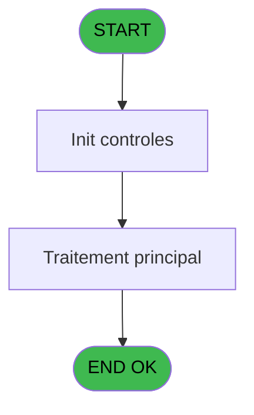
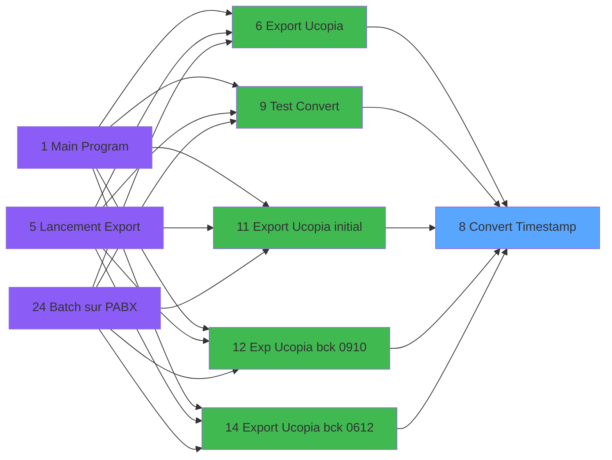

# POO IDE 8 - Convert Timestamp

> **Analyse**: Phases 1-4 2026-02-03 17:37 -> 17:37 (14s) | Assemblage 17:37
> **Pipeline**: V7.2 Enrichi
> **Structure**: 4 onglets (Resume | Ecrans | Donnees | Connexions)

<!-- TAB:Resume -->

## 1. FICHE D'IDENTITE

| Attribut | Valeur |
|----------|--------|
| Projet | POO |
| IDE Position | 8 |
| Nom Programme | Convert Timestamp |
| Fichier source | `Prg_8.xml` |
| Dossier IDE | Export |
| Taches | 1 (0 ecrans visibles) |
| Tables modifiees | 0 |
| Programmes appeles | 0 |

## 2. DESCRIPTION FONCTIONNELLE

**Convert Timestamp** assure la gestion complete de ce processus, accessible depuis [Export Ucopia bck 06/12 (IDE 14)](POO-IDE-14.md), [Export Ucopia bck 20220923 (IDE 15)](POO-IDE-15.md), [Export Ucopia (IDE 6)](POO-IDE-6.md), [Exp Ucopia bck 09/10 (IDE 12)](POO-IDE-12.md), [Test Convert (IDE 9)](POO-IDE-9.md), [Export Ucopia initial (IDE 11)](POO-IDE-11.md).

Le flux de traitement s'organise en **1 blocs fonctionnels** :

- **Traitement** (1 tache) : traitements metier divers

## 3. BLOCS FONCTIONNELS

### 3.1 Traitement (1 tache)

Traitements internes.

---

#### 8 - Convert Timestamp

**Role** : Traitement : Convert Timestamp.
**Variables liees** : A (p.Timestamp)

## 5. REGLES METIER

*(Aucune regle metier identifiee)*

## 6. CONTEXTE

- **Appele par**: [Export Ucopia bck 06/12 (IDE 14)](POO-IDE-14.md), [Export Ucopia bck 20220923 (IDE 15)](POO-IDE-15.md), [Export Ucopia (IDE 6)](POO-IDE-6.md), [Exp Ucopia bck 09/10 (IDE 12)](POO-IDE-12.md), [Test Convert (IDE 9)](POO-IDE-9.md), [Export Ucopia initial (IDE 11)](POO-IDE-11.md)
- **Appelle**: 0 programmes | **Tables**: 0 (W:0 R:0 L:0) | **Taches**: 1 | **Expressions**: 0

<!-- TAB:Ecrans -->

## 8. ECRANS

*(Programme sans ecran visible)*

## 9. NAVIGATION

### 9.3 Structure hierarchique (1 tache)

| Position | Tache | Type | Dimensions | Bloc |
|----------|-------|------|------------|------|
| **8.1** | [**Convert Timestamp** (8)](#t1) | - | - | Traitement |

### 9.4 Algorigramme

> **Legende**: Vert = START/END OK | Rouge = END KO | Bleu = Decisions
> *Algorigramme auto-genere. Utiliser `/algorigramme` pour une synthese metier detaillee.*

<!-- TAB:Donnees -->

## 10. TABLES

### Tables utilisees (0)

| ID | Nom | Description | Type | R | W | L | Usages |
|----|-----|-------------|------|---|---|---|--------|

### Colonnes par table (0 / 0 tables avec colonnes identifiees)

## 11. VARIABLES

### 11.1 Parametres entrants (2)

Variables recues du programme appelant ([Export Ucopia bck 06/12 (IDE 14)](POO-IDE-14.md)).

| Lettre | Nom | Type | Usage dans |
|--------|-----|------|-----------|
| A | p.Timestamp | Numeric | - |
| B | p.Date Time | Alpha | - |

## 12. EXPRESSIONS

**0 / 0 expressions decodees (0%)**

### 12.1 Repartition par type

| Type | Expressions | Regles |
|------|-------------|--------|

### 12.2 Expressions cles par type

<!-- TAB:Connexions -->

## 13. GRAPHE D'APPELS

### 13.1 Chaine depuis Main (Callers)

Main -> ... -> [Export Ucopia bck 06/12 (IDE 14)](POO-IDE-14.md) -> **Convert Timestamp (IDE 8)**

Main -> ... -> [Export Ucopia bck 20220923 (IDE 15)](POO-IDE-15.md) -> **Convert Timestamp (IDE 8)**

Main -> ... -> [Export Ucopia (IDE 6)](POO-IDE-6.md) -> **Convert Timestamp (IDE 8)**

Main -> ... -> [Exp Ucopia bck 09/10 (IDE 12)](POO-IDE-12.md) -> **Convert Timestamp (IDE 8)**

Main -> ... -> [Test Convert (IDE 9)](POO-IDE-9.md) -> **Convert Timestamp (IDE 8)**

Main -> ... -> [Export Ucopia initial (IDE 11)](POO-IDE-11.md) -> **Convert Timestamp (IDE 8)**

### 13.2 Callers

| IDE | Nom Programme | Nb Appels |
|-----|---------------|-----------|
| [14](POO-IDE-14.md) | Export Ucopia bck 06/12 | 3 |
| [15](POO-IDE-15.md) | Export Ucopia bck 20220923 | 3 |
| [6](POO-IDE-6.md) | Export Ucopia | 2 |
| [12](POO-IDE-12.md) | Exp Ucopia bck 09/10 | 2 |
| [9](POO-IDE-9.md) | Test Convert | 1 |
| [11](POO-IDE-11.md) | Export Ucopia initial | 1 |

### 13.3 Callees (programmes appeles)

### 13.4 Detail Callees avec contexte

| IDE | Nom Programme | Appels | Contexte |
|-----|---------------|--------|----------|
| - | (aucun) | - | - |

## 14. RECOMMANDATIONS MIGRATION

### 14.1 Profil du programme

| Metrique | Valeur | Impact migration |
|----------|--------|-----------------|
| Lignes de logique | 4 | Programme compact |
| Expressions | 0 | Peu de logique |
| Tables WRITE | 0 | Impact faible |
| Sous-programmes | 0 | Peu de dependances |
| Ecrans visibles | 0 | Ecran unique ou traitement batch |
| Code desactive | 0% (0 / 4) | Code sain |
| Regles metier | 0 | Pas de regle identifiee |

### 14.2 Plan de migration par bloc

#### Traitement (1 tache: 0 ecran, 1 traitement)

- **Strategie** : 1 service(s) backend injectable(s) (Domain Services).
- Decomposer les taches en services unitaires testables.

### 14.3 Dependances critiques

| Dependance | Type | Appels | Impact |
|------------|------|--------|--------|

---
*Spec DETAILED generee par Pipeline V7.2 - 2026-02-03 17:37*
