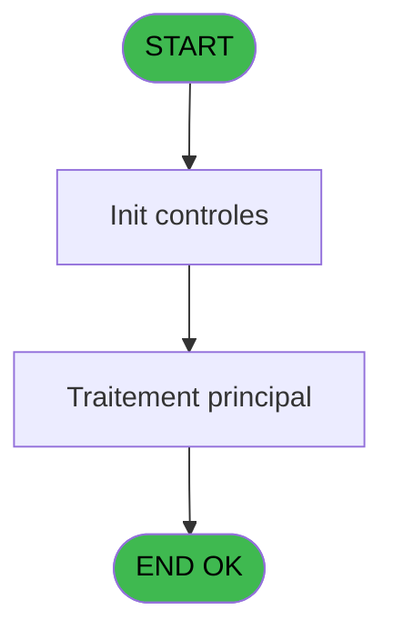
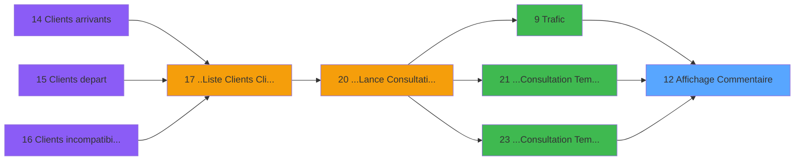
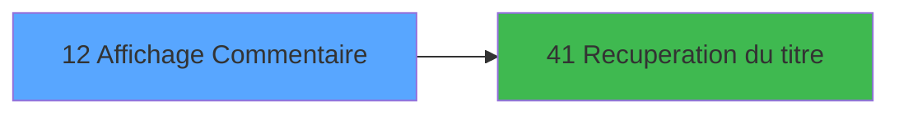

# PTR IDE 12 - Affichage Commentaire

> **Analyse**: Phases 1-4 2026-02-03 18:12 -> 18:12 (13s) | Assemblage 18:12
> **Pipeline**: V7.2 Enrichi
> **Structure**: 4 onglets (Resume | Ecrans | Donnees | Connexions)

<!-- TAB:Resume -->

## 1. FICHE D'IDENTITE

| Attribut | Valeur |
|----------|--------|
| Projet | PTR |
| IDE Position | 12 |
| Nom Programme | Affichage Commentaire |
| Fichier source | `Prg_12.xml` |
| Dossier IDE | Gestion |
| Taches | 1 (1 ecrans visibles) |
| Tables modifiees | 0 |
| Programmes appeles | 1 |

## 2. DESCRIPTION FONCTIONNELLE

**Affichage Commentaire** assure la gestion complete de ce processus, accessible depuis [Trafic (IDE 9)](PTR-IDE-9.md), [...Consultation Tempo Ecran Tt (IDE 21)](PTR-IDE-21.md), [...Consultation Tempo Ecran TK (IDE 23)](PTR-IDE-23.md).

Le flux de traitement s'organise en **1 blocs fonctionnels** :

- **Consultation** (1 tache) : ecrans de recherche, selection et consultation

## 3. BLOCS FONCTIONNELS

### 3.1 Consultation (1 tache)

Ecrans de recherche et consultation.

---

#### 12 - Affichage Commentaire [[ECRAN]](#ecran-t1)

**Role** : Reinitialisation : Affichage Commentaire.
**Ecran** : 1115 x 232 DLU (MDI) | [Voir mockup](#ecran-t1)

## 5. REGLES METIER

*(Aucune regle metier identifiee)*

## 6. CONTEXTE

- **Appele par**: [Trafic (IDE 9)](PTR-IDE-9.md), [...Consultation Tempo Ecran Tt (IDE 21)](PTR-IDE-21.md), [...Consultation Tempo Ecran TK (IDE 23)](PTR-IDE-23.md)
- **Appelle**: 1 programmes | **Tables**: 1 (W:0 R:1 L:0) | **Taches**: 1 | **Expressions**: 5

<!-- TAB:Ecrans -->

## 8. ECRANS

### 8.1 Forms visibles (1 / 1)

| # | Position | Tache | Nom | Type | Largeur | Hauteur | Bloc |
|---|----------|-------|-----|------|---------|---------|------|
| 1 | 12 | 12 | Affichage Commentaire | MDI | 1115 | 232 | Consultation |

### 8.2 Mockups Ecrans

---

#### 12 - Affichage Commentaire
**Tache** : [12](#t1) | **Type** : MDI | **Dimensions** : 1115 x 232 DLU
**Bloc** : Consultation | **Titre IDE** : Affichage Commentaire

<!-- FORM-DATA:
{
    "width":  1115,
    "vFactor":  8,
    "type":  "MDI",
    "hFactor":  8,
    "controls":  [
                     {
                         "x":  9,
                         "type":  "table",
                         "var":  "",
                         "name":  "",
                         "titleH":  12,
                         "color":  "110",
                         "w":  1098,
                         "y":  3,
                         "fmt":  "",
                         "parent":  null,
                         "text":  "",
                         "rowH":  14,
                         "h":  198,
                         "cols":  [
                                      {
                                          "title":  "Code",
                                          "layer":  1,
                                          "w":  75
                                      },
                                      {
                                          "title":  "Commentaire",
                                          "layer":  2,
                                          "w":  698
                                      },
                                      {
                                          "title":  "Type",
                                          "layer":  3,
                                          "w":  61
                                      },
                                      {
                                          "title":  "Produit",
                                          "layer":  4,
                                          "w":  96
                                      },
                                      {
                                          "title":  "Date",
                                          "layer":  5,
                                          "w":  135
                                      }
                                  ],
                         "rows":  5
                     },
                     {
                         "x":  2,
                         "type":  "label",
                         "var":  "",
                         "y":  204,
                         "w":  1106,
                         "fmt":  "",
                         "name":  "",
                         "h":  24,
                         "color":  "",
                         "text":  "",
                         "parent":  null
                     },
                     {
                         "x":  90,
                         "type":  "edit",
                         "var":  "",
                         "y":  17,
                         "w":  686,
                         "fmt":  "",
                         "name":  "",
                         "h":  10,
                         "color":  "110",
                         "text":  "",
                         "parent":  1
                     },
                     {
                         "x":  26,
                         "type":  "edit",
                         "var":  "",
                         "y":  17,
                         "w":  48,
                         "fmt":  "",
                         "name":  "",
                         "h":  10,
                         "color":  "110",
                         "text":  "",
                         "parent":  1
                     },
                     {
                         "x":  789,
                         "type":  "edit",
                         "var":  "",
                         "y":  17,
                         "w":  37,
                         "fmt":  "",
                         "name":  "",
                         "h":  10,
                         "color":  "110",
                         "text":  "",
                         "parent":  1
                     },
                     {
                         "x":  850,
                         "type":  "edit",
                         "var":  "",
                         "y":  17,
                         "w":  82,
                         "fmt":  "",
                         "name":  "",
                         "h":  10,
                         "color":  "110",
                         "text":  "",
                         "parent":  1
                     },
                     {
                         "x":  946,
                         "type":  "edit",
                         "var":  "",
                         "y":  17,
                         "w":  126,
                         "fmt":  "DD/MM/YYYYZ",
                         "name":  "",
                         "h":  10,
                         "color":  "110",
                         "text":  "",
                         "parent":  1
                     },
                     {
                         "x":  11,
                         "type":  "button",
                         "var":  "",
                         "y":  207,
                         "w":  154,
                         "fmt":  "\u0026Quitter",
                         "name":  "",
                         "h":  18,
                         "color":  "",
                         "text":  "",
                         "parent":  null
                     }
                 ],
    "taskId":  "12",
    "height":  232
}
-->

<strong>Champs : 5 champs</strong>

| Pos (x,y) | Nom | Variable | Type |
|-----------|-----|----------|------|
| 90,17 | (sans nom) | - | edit |
| 26,17 | (sans nom) | - | edit |
| 789,17 | (sans nom) | - | edit |
| 850,17 | (sans nom) | - | edit |
| 946,17 | DD/MM/YYYYZ | - | edit |

<strong>Boutons : 1 boutons</strong>

| Bouton | Pos (x,y) | Action |
|--------|-----------|--------|
| Quitter | 11,207 | Quitte le programme |

## 9. NAVIGATION

Ecran unique: **Affichage Commentaire**

### 9.3 Structure hierarchique (1 tache)

| Position | Tache | Type | Dimensions | Bloc |
|----------|-------|------|------------|------|
| **12.1** | [**Affichage Commentaire** (12)](#t1) [mockup](#ecran-t1) | MDI | 1115x232 | Consultation |

### 9.4 Algorigramme

> **Legende**: Vert = START/END OK | Rouge = END KO | Bleu = Decisions
> *Algorigramme auto-genere. Utiliser `/algorigramme` pour une synthese metier detaillee.*

<!-- TAB:Donnees -->

## 10. TABLES

### Tables utilisees (1)

| ID | Nom | Description | Type | R | W | L | Usages |
|----|-----|-------------|------|---|---|---|--------|
| 171 | commentaire______com |  | DB | R |   |   | 1 |

### Colonnes par table (1 / 1 tables avec colonnes identifiees)

Table 171 - commentaire______com (R) - 1 usages

| Lettre | Variable | Acces | Type |
|--------|----------|-------|------|
| A | P0 Societe | R | Alpha |
| B | P0 Compte | R | Numeric |
| C | P0 Filiation | R | Numeric |
| D | W0 Selection | R | Alpha |
| E | V_Titre | R | Alpha |

## 11. VARIABLES

### 11.1 Parametres entrants (3)

Variables recues du programme appelant ([Trafic (IDE 9)](PTR-IDE-9.md)).

| Lettre | Nom | Type | Usage dans |
|--------|-----|------|-----------|
| A | P0 Societe | Alpha | 1x parametre entrant |
| B | P0 Compte | Numeric | 1x parametre entrant |
| C | P0 Filiation | Numeric | 1x parametre entrant |

### 11.2 Variables de travail (1)

Variables internes au programme.

| Lettre | Nom | Type | Usage dans |
|--------|-----|------|-----------|
| D | W0 Selection | Alpha | - |

### 11.3 Autres (1)

Variables diverses.

| Lettre | Nom | Type | Usage dans |
|--------|-----|------|-----------|
| E | V_Titre | Alpha | - |

## 12. EXPRESSIONS

**5 / 5 expressions decodees (100%)**

### 12.1 Repartition par type

| Type | Expressions | Regles |
|------|-------------|--------|
| CONSTANTE | 1 | 0 |
| OTHER | 3 | 0 |
| CONDITION | 1 | 0 |

### 12.2 Expressions cles par type

#### CONSTANTE (1 expressions)

| Type | IDE | Expression | Regle |
|------|-----|------------|-------|
| CONSTANTE | 1 | `3` | - |

#### OTHER (3 expressions)

| Type | IDE | Expression | Regle |
|------|-----|------------|-------|
| OTHER | 4 | `P0 Filiation [C]` | - |
| OTHER | 3 | `P0 Compte [B]` | - |
| OTHER | 2 | `P0 Societe [A]` | - |

#### CONDITION (1 expressions)

| Type | IDE | Expression | Regle |
|------|-----|------------|-------|
| CONDITION | 5 | `Trim ([N])&IF ([G]=0,'Liste Blanche',IF ([G]=2,'Voyage',IF ([G]=3,'Sejour',IF ([G]=4,'Prestation',IF ([G]=5,'Circuit',IF ([G]=6,'Activite',IF ([G]=7,'Trafic','')))))))` | - |

<!-- TAB:Connexions -->

## 13. GRAPHE D'APPELS

### 13.1 Chaine depuis Main (Callers)

Main -> ... -> [Trafic (IDE 9)](PTR-IDE-9.md) -> **Affichage Commentaire (IDE 12)**

Main -> ... -> [...Consultation Tempo Ecran Tt (IDE 21)](PTR-IDE-21.md) -> **Affichage Commentaire (IDE 12)**

Main -> ... -> [...Consultation Tempo Ecran TK (IDE 23)](PTR-IDE-23.md) -> **Affichage Commentaire (IDE 12)**

### 13.2 Callers

| IDE | Nom Programme | Nb Appels |
|-----|---------------|-----------|
| [9](PTR-IDE-9.md) | Trafic | 2 |
| [21](PTR-IDE-21.md) | ...Consultation Tempo Ecran Tt | 1 |
| [23](PTR-IDE-23.md) | ...Consultation Tempo Ecran TK | 1 |

### 13.3 Callees (programmes appeles)

### 13.4 Detail Callees avec contexte

| IDE | Nom Programme | Appels | Contexte |
|-----|---------------|--------|----------|
| [41](PTR-IDE-41.md) | Recuperation du titre | 1 | Recuperation donnees |

## 14. RECOMMANDATIONS MIGRATION

### 14.1 Profil du programme

| Metrique | Valeur | Impact migration |
|----------|--------|-----------------|
| Lignes de logique | 18 | Programme compact |
| Expressions | 5 | Peu de logique |
| Tables WRITE | 0 | Impact faible |
| Sous-programmes | 1 | Peu de dependances |
| Ecrans visibles | 1 | Ecran unique ou traitement batch |
| Code desactive | 0% (0 / 18) | Code sain |
| Regles metier | 0 | Pas de regle identifiee |

### 14.2 Plan de migration par bloc

#### Consultation (1 tache: 1 ecran, 0 traitement)

- **Strategie** : Composants de recherche/selection en modales.
- 1 ecran : Affichage Commentaire

### 14.3 Dependances critiques

| Dependance | Type | Appels | Impact |
|------------|------|--------|--------|
| [Recuperation du titre (IDE 41)](PTR-IDE-41.md) | Sous-programme | 1x | Normale - Recuperation donnees |

---
*Spec DETAILED generee par Pipeline V7.2 - 2026-02-03 18:12*
