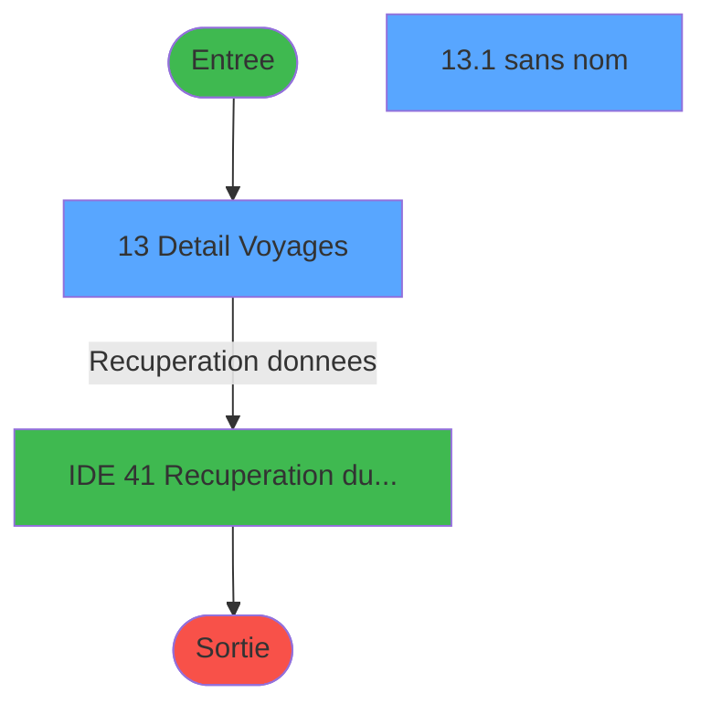
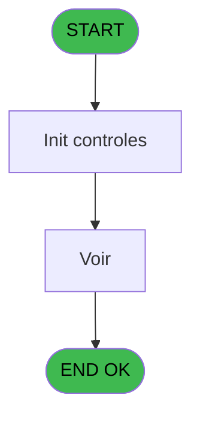
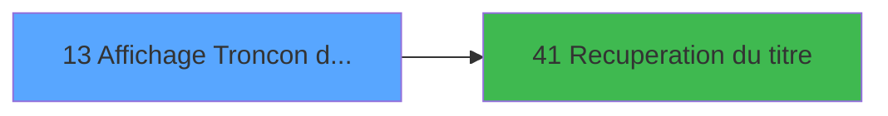

# PTR IDE 13 - Affichage Troncon du Dossier

> **Analyse**: Phases 1-4 2026-02-03 18:12 -> 18:12 (13s) | Assemblage 18:12
> **Pipeline**: V7.2 Enrichi
> **Structure**: 4 onglets (Resume | Ecrans | Donnees | Connexions)

<!-- TAB:Resume -->

## 1. FICHE D'IDENTITE

| Attribut | Valeur |
|----------|--------|
| Projet | PTR |
| IDE Position | 13 |
| Nom Programme | Affichage Troncon du Dossier |
| Fichier source | `Prg_13.xml` |
| Dossier IDE | Listes |
| Taches | 2 (2 ecrans visibles) |
| Tables modifiees | 0 |
| Programmes appeles | 1 |

## 2. DESCRIPTION FONCTIONNELLE

**Affichage Troncon du Dossier** assure la gestion complete de ce processus, accessible depuis [Trafic (IDE 9)](PTR-IDE-9.md).

Le flux de traitement s'organise en **1 blocs fonctionnels** :

- **Traitement** (2 taches) : traitements metier divers

**Logique metier** : 1 regles identifiees couvrant conditions metier.

## 3. BLOCS FONCTIONNELS

### 3.1 Traitement (2 taches)

Traitements internes.

---

#### 13 - Detail Voyages [[ECRAN]](#ecran-t1)

**Role** : Traitement : Detail Voyages.
**Ecran** : 1038 x 201 DLU (MDI) | [Voir mockup](#ecran-t1)
**Delegue a** : [Recuperation du titre (IDE 41)](PTR-IDE-41.md)

---

#### 13.1 - (sans nom) [[ECRAN]](#ecran-t2)

**Role** : Traitement interne.
**Ecran** : 342 x 88 DLU (MDI) | [Voir mockup](#ecran-t2)
**Delegue a** : [Recuperation du titre (IDE 41)](PTR-IDE-41.md)

## 5. REGLES METIER

1 regles identifiees:

### Autres (1 regles)

#### [RM-001] Si [G]='V' alors 'Voyage' sinon 'Prepost')&' '&IF ([J]='A','Aller',IF ([J]='R','Retour',''))

| Element | Detail |
|---------|--------|
| **Condition** | `[G]='V'` |
| **Si vrai** | 'Voyage' |
| **Si faux** | 'Prepost')&' '&IF ([J]='A','Aller',IF ([J]='R','Retour','')) |
| **Expression source** | Expression 7 : `IF ([G]='V','Voyage','Prepost')&' '&IF ([J]='A','Aller',IF (` |
| **Exemple** | Si [G]='V' → 'Voyage' |

## 6. CONTEXTE

- **Appele par**: [Trafic (IDE 9)](PTR-IDE-9.md)
- **Appelle**: 1 programmes | **Tables**: 2 (W:0 R:2 L:0) | **Taches**: 2 | **Expressions**: 7

<!-- TAB:Ecrans -->

## 8. ECRANS

### 8.1 Forms visibles (2 / 2)

| # | Position | Tache | Nom | Type | Largeur | Hauteur | Bloc |
|---|----------|-------|-----|------|---------|---------|------|
| 1 | 13 | 13 | Detail Voyages | MDI | 1038 | 201 | Traitement |
| 2 | 13.1 | 13.1 | (sans nom) | MDI | 342 | 88 | Traitement |

### 8.2 Mockups Ecrans

---

#### 13 - Detail Voyages
**Tache** : [13](#t1) | **Type** : MDI | **Dimensions** : 1038 x 201 DLU
**Bloc** : Traitement | **Titre IDE** : Detail Voyages

<!-- FORM-DATA:
{
    "width":  1038,
    "vFactor":  8,
    "type":  "MDI",
    "hFactor":  8,
    "controls":  [
                     {
                         "x":  6,
                         "type":  "table",
                         "var":  "",
                         "name":  "",
                         "titleH":  12,
                         "color":  "110",
                         "w":  1029,
                         "y":  15,
                         "fmt":  "",
                         "parent":  null,
                         "text":  "",
                         "rowH":  13,
                         "h":  153,
                         "cols":  [
                                      {
                                          "title":  "Code",
                                          "layer":  1,
                                          "w":  92
                                      },
                                      {
                                          "title":  "Code Vol",
                                          "layer":  2,
                                          "w":  134
                                      },
                                      {
                                          "title":  "Départ",
                                          "layer":  3,
                                          "w":  313
                                      },
                                      {
                                          "title":  "Arrivée",
                                          "layer":  4,
                                          "w":  306
                                      },
                                      {
                                          "title":  "Tarif",
                                          "layer":  5,
                                          "w":  83
                                      },
                                      {
                                          "title":  "Classe",
                                          "layer":  6,
                                          "w":  64
                                      }
                                  ],
                         "rows":  6
                     },
                     {
                         "x":  0,
                         "type":  "label",
                         "var":  "",
                         "y":  174,
                         "w":  1028,
                         "fmt":  "",
                         "name":  "",
                         "h":  24,
                         "color":  "",
                         "text":  "",
                         "parent":  null
                     },
                     {
                         "x":  18,
                         "type":  "edit",
                         "var":  "",
                         "y":  30,
                         "w":  75,
                         "fmt":  "",
                         "name":  "",
                         "h":  8,
                         "color":  "110",
                         "text":  "",
                         "parent":  2
                     },
                     {
                         "x":  245,
                         "type":  "edit",
                         "var":  "",
                         "y":  30,
                         "w":  120,
                         "fmt":  "DD/MM/YYYYZ",
                         "name":  "",
                         "h":  8,
                         "color":  "110",
                         "text":  "",
                         "parent":  2
                     },
                     {
                         "x":  381,
                         "type":  "edit",
                         "var":  "",
                         "y":  30,
                         "w":  64,
                         "fmt":  "HH:MM",
                         "name":  "",
                         "h":  8,
                         "color":  "110",
                         "text":  "",
                         "parent":  2
                     },
                     {
                         "x":  106,
                         "type":  "edit",
                         "var":  "",
                         "y":  30,
                         "w":  120,
                         "fmt":  "",
                         "name":  "",
                         "h":  8,
                         "color":  "110",
                         "text":  "",
                         "parent":  2
                     },
                     {
                         "x":  461,
                         "type":  "edit",
                         "var":  "",
                         "y":  30,
                         "w":  75,
                         "fmt":  "",
                         "name":  "",
                         "h":  8,
                         "color":  "110",
                         "text":  "",
                         "parent":  2
                     },
                     {
                         "x":  560,
                         "type":  "edit",
                         "var":  "",
                         "y":  30,
                         "w":  120,
                         "fmt":  "DD/MM/YYYYZ",
                         "name":  "",
                         "h":  8,
                         "color":  "110",
                         "text":  "",
                         "parent":  2
                     },
                     {
                         "x":  693,
                         "type":  "edit",
                         "var":  "",
                         "y":  30,
                         "w":  64,
                         "fmt":  "HH:MM",
                         "name":  "",
                         "h":  8,
                         "color":  "110",
                         "text":  "",
                         "parent":  2
                     },
                     {
                         "x":  770,
                         "type":  "edit",
                         "var":  "",
                         "y":  30,
                         "w":  75,
                         "fmt":  "",
                         "name":  "",
                         "h":  8,
                         "color":  "110",
                         "text":  "",
                         "parent":  2
                     },
                     {
                         "x":  858,
                         "type":  "edit",
                         "var":  "",
                         "y":  30,
                         "w":  75,
                         "fmt":  "",
                         "name":  "",
                         "h":  8,
                         "color":  "110",
                         "text":  "",
                         "parent":  2
                     },
                     {
                         "x":  944,
                         "type":  "edit",
                         "var":  "",
                         "y":  30,
                         "w":  42,
                         "fmt":  "",
                         "name":  "",
                         "h":  8,
                         "color":  "110",
                         "text":  "",
                         "parent":  2
                     },
                     {
                         "x":  11,
                         "type":  "button",
                         "var":  "",
                         "y":  177,
                         "w":  154,
                         "fmt":  "\u0026Quitter",
                         "name":  "",
                         "h":  18,
                         "color":  "",
                         "text":  "",
                         "parent":  19
                     },
                     {
                         "x":  867,
                         "type":  "button",
                         "var":  "",
                         "y":  177,
                         "w":  154,
                         "fmt":  "\u0026Voir",
                         "name":  "",
                         "h":  18,
                         "color":  "",
                         "text":  "",
                         "parent":  19
                     },
                     {
                         "x":  16,
                         "type":  "edit",
                         "var":  "",
                         "y":  2,
                         "w":  997,
                         "fmt":  "30",
                         "name":  "",
                         "h":  8,
                         "color":  "7",
                         "text":  "",
                         "parent":  null
                     }
                 ],
    "taskId":  "13",
    "height":  201
}
-->

<strong>Champs : 11 champs</strong>

| Pos (x,y) | Nom | Variable | Type |
|-----------|-----|----------|------|
| 18,30 | (sans nom) | - | edit |
| 245,30 | DD/MM/YYYYZ | - | edit |
| 381,30 | HH:MM | - | edit |
| 106,30 | (sans nom) | - | edit |
| 461,30 | (sans nom) | - | edit |
| 560,30 | DD/MM/YYYYZ | - | edit |
| 693,30 | HH:MM | - | edit |
| 770,30 | (sans nom) | - | edit |
| 858,30 | (sans nom) | - | edit |
| 944,30 | (sans nom) | - | edit |
| 16,2 | 30 | - | edit |

<strong>Boutons : 2 boutons</strong>

| Bouton | Pos (x,y) | Action |
|--------|-----------|--------|
| Quitter | 11,177 | Quitte le programme |
| Voir | 867,177 | Bouton fonctionnel |

---

#### 13.1 - (sans nom)
**Tache** : [13.1](#t2) | **Type** : MDI | **Dimensions** : 342 x 88 DLU
**Bloc** : Traitement | **Titre IDE** : (sans nom)

<!-- FORM-DATA:
{
    "width":  342,
    "vFactor":  8,
    "type":  "MDI",
    "hFactor":  8,
    "controls":  [
                     {
                         "x":  5,
                         "type":  "label",
                         "var":  "",
                         "y":  2,
                         "w":  333,
                         "fmt":  "",
                         "name":  "",
                         "h":  55,
                         "color":  "",
                         "text":  "",
                         "parent":  null
                     },
                     {
                         "x":  18,
                         "type":  "label",
                         "var":  "",
                         "y":  8,
                         "w":  69,
                         "fmt":  "",
                         "name":  "",
                         "h":  8,
                         "color":  "",
                         "text":  "N° PNR",
                         "parent":  1
                     },
                     {
                         "x":  18,
                         "type":  "label",
                         "var":  "",
                         "y":  20,
                         "w":  93,
                         "fmt":  "",
                         "name":  "",
                         "h":  8,
                         "color":  "",
                         "text":  "Compagnie",
                         "parent":  1
                     },
                     {
                         "x":  18,
                         "type":  "label",
                         "var":  "",
                         "y":  32,
                         "w":  72,
                         "fmt":  "",
                         "name":  "",
                         "h":  8,
                         "color":  "",
                         "text":  "Affréteur",
                         "parent":  1
                     },
                     {
                         "x":  18,
                         "type":  "label",
                         "var":  "",
                         "y":  44,
                         "w":  133,
                         "fmt":  "",
                         "name":  "",
                         "h":  8,
                         "color":  "",
                         "text":  "Type Transport",
                         "parent":  1
                     },
                     {
                         "x":  0,
                         "type":  "label",
                         "var":  "",
                         "y":  62,
                         "w":  341,
                         "fmt":  "",
                         "name":  "",
                         "h":  24,
                         "color":  "",
                         "text":  "",
                         "parent":  null
                     },
                     {
                         "x":  154,
                         "type":  "edit",
                         "var":  "",
                         "y":  44,
                         "w":  168,
                         "fmt":  "14",
                         "name":  "",
                         "h":  9,
                         "color":  "",
                         "text":  "",
                         "parent":  1
                     },
                     {
                         "x":  11,
                         "type":  "button",
                         "var":  "",
                         "y":  65,
                         "w":  154,
                         "fmt":  "\u0026Quitter",
                         "name":  "",
                         "h":  18,
                         "color":  "",
                         "text":  "",
                         "parent":  10
                     },
                     {
                         "x":  154,
                         "type":  "edit",
                         "var":  "",
                         "y":  20,
                         "w":  168,
                         "fmt":  "",
                         "name":  "",
                         "h":  9,
                         "color":  "",
                         "text":  "",
                         "parent":  1
                     },
                     {
                         "x":  154,
                         "type":  "edit",
                         "var":  "",
                         "y":  32,
                         "w":  168,
                         "fmt":  "",
                         "name":  "",
                         "h":  9,
                         "color":  "",
                         "text":  "",
                         "parent":  1
                     },
                     {
                         "x":  154,
                         "type":  "edit",
                         "var":  "",
                         "y":  8,
                         "w":  168,
                         "fmt":  "",
                         "name":  "",
                         "h":  9,
                         "color":  "",
                         "text":  "",
                         "parent":  1
                     }
                 ],
    "taskId":  "13.1",
    "height":  88
}
-->

<strong>Champs : 4 champs</strong>

| Pos (x,y) | Nom | Variable | Type |
|-----------|-----|----------|------|
| 154,44 | 14 | - | edit |
| 154,20 | (sans nom) | - | edit |
| 154,32 | (sans nom) | - | edit |
| 154,8 | (sans nom) | - | edit |

<strong>Boutons : 1 boutons</strong>

| Bouton | Pos (x,y) | Action |
|--------|-----------|--------|
| Quitter | 11,65 | Quitte le programme |

## 9. NAVIGATION

### 9.1 Enchainement des ecrans

**Detail par enchainement :**

| Depuis | Action | Vers | Retour |
|--------|--------|------|--------|
| Detail Voyages | Recuperation donnees | [Recuperation du titre (IDE 41)](PTR-IDE-41.md) | Retour ecran |

### 9.3 Structure hierarchique (2 taches)

| Position | Tache | Type | Dimensions | Bloc |
|----------|-------|------|------------|------|
| **13.1** | [**Detail Voyages** (13)](#t1) [mockup](#ecran-t1) | MDI | 1038x201 | Traitement |
| 13.1.1 | [(sans nom) (13.1)](#t2) [mockup](#ecran-t2) | MDI | 342x88 | |

### 9.4 Algorigramme

> **Legende**: Vert = START/END OK | Rouge = END KO | Bleu = Decisions
> *Algorigramme auto-genere. Utiliser `/algorigramme` pour une synthese metier detaillee.*

<!-- TAB:Donnees -->

## 10. TABLES

### Tables utilisees (2)

| ID | Nom | Description | Type | R | W | L | Usages |
|----|-----|-------------|------|---|---|---|--------|
| 112 | tables_paris |  | DB | R |   |   | 1 |
| 167 | troncon__________tro |  | DB | R |   |   | 1 |

### Colonnes par table (1 / 2 tables avec colonnes identifiees)

Table 112 - tables_paris (R) - 1 usages

*Table utilisee uniquement en Link ou aucune colonne Real identifiee dans le DataView.*

Table 167 - troncon__________tro (R) - 1 usages

| Lettre | Variable | Acces | Type |
|--------|----------|-------|------|
| A | P0 Societe | R | Alpha |
| B | P0 Compte | R | Numeric |
| C | P0 Filiation | R | Numeric |
| D | V_Titre | R | Alpha |

## 11. VARIABLES

### 11.1 Parametres entrants (3)

Variables recues du programme appelant ([Trafic (IDE 9)](PTR-IDE-9.md)).

| Lettre | Nom | Type | Usage dans |
|--------|-----|------|-----------|
| A | P0 Societe | Alpha | 1x parametre entrant |
| B | P0 Compte | Numeric | 1x parametre entrant |
| C | P0 Filiation | Numeric | 1x parametre entrant |

### 11.2 Autres (1)

Variables diverses.

| Lettre | Nom | Type | Usage dans |
|--------|-----|------|-----------|
| D | V_Titre | Alpha | - |

## 12. EXPRESSIONS

**7 / 7 expressions decodees (100%)**

### 12.1 Repartition par type

| Type | Expressions | Regles |
|------|-------------|--------|
| CONCATENATION | 1 | 5 |
| CONSTANTE | 1 | 0 |
| OTHER | 5 | 0 |

### 12.2 Expressions cles par type

#### CONCATENATION (1 expressions)

| Type | IDE | Expression | Regle |
|------|-----|------------|-------|
| CONCATENATION | 7 | `IF ([G]='V','Voyage','Prepost')&' '&IF ([J]='A','Aller',IF ([J]='R','Retour',''))` | [RM-001](#rm-RM-001) |

#### CONSTANTE (1 expressions)

| Type | IDE | Expression | Regle |
|------|-----|------------|-------|
| CONSTANTE | 2 | `4` | - |

#### OTHER (5 expressions)

| Type | IDE | Expression | Regle |
|------|-----|------------|-------|
| OTHER | 5 | `P0 Compte [B]` | - |
| OTHER | 6 | `P0 Filiation [C]` | - |
| OTHER | 4 | `P0 Societe [A]` | - |
| OTHER | 1 | `[W]` | - |
| OTHER | 3 | `Stat (0,'C'MODE)` | - |

<!-- TAB:Connexions -->

## 13. GRAPHE D'APPELS

### 13.1 Chaine depuis Main (Callers)

Main -> ... -> [Trafic (IDE 9)](PTR-IDE-9.md) -> **Affichage Troncon du Dossier (IDE 13)**

### 13.2 Callers

| IDE | Nom Programme | Nb Appels |
|-----|---------------|-----------|
| [9](PTR-IDE-9.md) | Trafic | 2 |

### 13.3 Callees (programmes appeles)

### 13.4 Detail Callees avec contexte

| IDE | Nom Programme | Appels | Contexte |
|-----|---------------|--------|----------|
| [41](PTR-IDE-41.md) | Recuperation du titre | 1 | Recuperation donnees |

## 14. RECOMMANDATIONS MIGRATION

### 14.1 Profil du programme

| Metrique | Valeur | Impact migration |
|----------|--------|-----------------|
| Lignes de logique | 38 | Programme compact |
| Expressions | 7 | Peu de logique |
| Tables WRITE | 0 | Impact faible |
| Sous-programmes | 1 | Peu de dependances |
| Ecrans visibles | 2 | Quelques ecrans |
| Code desactive | 0% (0 / 38) | Code sain |
| Regles metier | 1 | Quelques regles a preserver |

### 14.2 Plan de migration par bloc

#### Traitement (2 taches: 2 ecrans, 0 traitement)

- **Strategie** : 2 composant(s) UI (Razor/React) avec formulaires et validation.
- 1 sous-programme(s) a migrer ou a reutiliser depuis les services existants.
- Decomposer les taches en services unitaires testables.

### 14.3 Dependances critiques

| Dependance | Type | Appels | Impact |
|------------|------|--------|--------|
| [Recuperation du titre (IDE 41)](PTR-IDE-41.md) | Sous-programme | 1x | Normale - Recuperation donnees |

---
*Spec DETAILED generee par Pipeline V7.2 - 2026-02-03 18:12*
