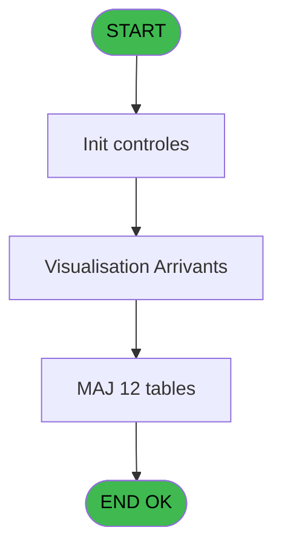
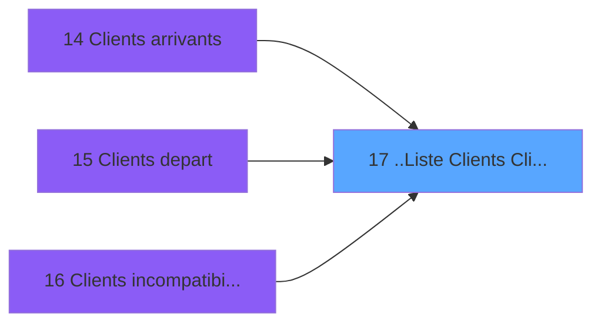
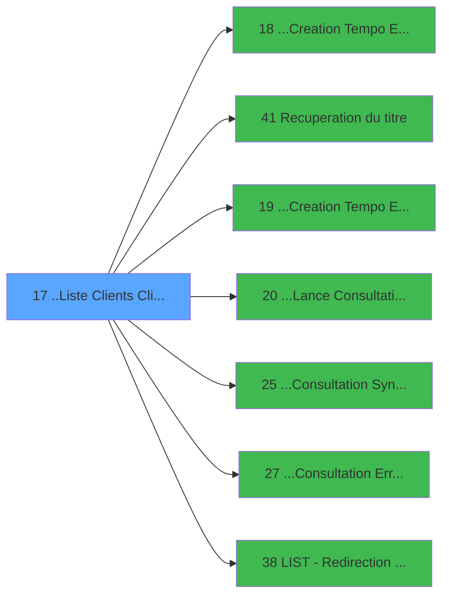

# PTR IDE 17 - ..Liste  Clients (ClipArt)+

> **Analyse**: Phases 1-4 2026-02-03 18:13 -> 18:14 (19s) | Assemblage 18:14
> **Pipeline**: V7.2 Enrichi
> **Structure**: 4 onglets (Resume | Ecrans | Donnees | Connexions)

<!-- TAB:Resume -->

## 1. FICHE D'IDENTITE

| Attribut | Valeur |
|----------|--------|
| Projet | PTR |
| IDE Position | 17 |
| Nom Programme | ..Liste  Clients (ClipArt)+ |
| Fichier source | `Prg_17.xml` |
| Dossier IDE | Listes |
| Taches | 70 (33 ecrans visibles) |
| Tables modifiees | 12 |
| Programmes appeles | 7 |

## 2. DESCRIPTION FONCTIONNELLE

**..Liste  Clients (ClipArt)+** assure la gestion complete de ce processus, accessible depuis [Clients arrivants (IDE 14)](PTR-IDE-14.md), [Clients depart (IDE 15)](PTR-IDE-15.md), [Clients incompatibilites (IDE 16)](PTR-IDE-16.md).

Le flux de traitement s'organise en **6 blocs fonctionnels** :

- **Traitement** (38 taches) : traitements metier divers
- **Consultation** (16 taches) : ecrans de recherche, selection et consultation
- **Creation** (8 taches) : insertion d'enregistrements en base (mouvements, prestations)
- **Validation** (5 taches) : controles et verifications de coherence
- **Impression** (2 taches) : generation de tickets et documents
- **Initialisation** (1 tache) : reinitialisation d'etats et de variables de travail

**Donnees modifiees** : 12 tables en ecriture (tables_paris, tables_imports, param_affichage, code_vol_________vot, tempo_trafic, tempo_troncon, applications, coupures_monnaie_euro, activite_service_reference, classe_monetaire_reference, compte_bilan_par_service_ref, libelle_ecart_reference).

**Logique metier** : 5 regles identifiees couvrant conditions metier, valeurs par defaut.

Detail : phases du traitement

#### Phase 1 : Traitement (38 taches)

- **17** - Liste des Arrivants
- **17.1** - Visualisation Arrivants **[[ECRAN]](#ecran-t2)**
- **17.1.1** - Minimum Date
- **17.1.2.2** - Chargement Userlist
- **17.1.5.2** - Aff. Categorie **[[ECRAN]](#ecran-t11)**
- **17.1.6.2** - Effaçage Heure
- **17.1.10.2** - Liste Vols **[[ECRAN]](#ecran-t24)**
- **17.1.11.1** - Existe une Liste
- **17.1.11.3** - Marquage/Demarquage
- **17.1.11.4** - Combien
- **17.1.13** - Preparation Synthèse **[[ECRAN]](#ecran-t34)**
- **17.1.13.1** - Efface Tempo
- **17.1.14** - Un Instant SVP... **[[ECRAN]](#ecran-t37)**
- **17.1.14.1** - Efface Tempo
- **17.1.14.3** - Coche Jours
- **17.1.15** - Impression Planning **[[ECRAN]](#ecran-t41)**
- **17.1.16** - Un instant S.V.P... **[[ECRAN]](#ecran-t42)**
- **17.1.19** - Impression Reveil **[[ECRAN]](#ecran-t45)**
- **17.1.20** - Impression Incompatibilites **[[ECRAN]](#ecran-t46)**
- **17.1.21** - Impression Groupe **[[ECRAN]](#ecran-t47)**
- **17.1.22** - Impression Synthèse **[[ECRAN]](#ecran-t48)**
- **17.1.23** - Impression Village **[[ECRAN]](#ecran-t49)**
- **17.1.24** - Impression Village **[[ECRAN]](#ecran-t50)**
- **17.1.25** - Impression Commentaires **[[ECRAN]](#ecran-t51)**
- **17.1.26** - Impression Commentaires **[[ECRAN]](#ecran-t52)**
- **17.1.27.1** - Efface Tempo
- **17.1.28** - Liste **[[ECRAN]](#ecran-t57)**
- **17.1.28.1** - Tri Alpha **[[ECRAN]](#ecran-t58)**
- **17.1.28.1.2** - Lecture Tempo
- **17.1.28.1.2.1** - Ecriture Alpha
- **17.1.28.1.3** - Efface Tempo
- **17.1.28.2** - Lecture Paramètre
- **17.1.28.3** - Dialogue_Imp **[[ECRAN]](#ecran-t64)**
- **17.1.28.3.1** - Un instant S.V.P. ... **[[ECRAN]](#ecran-t65)**
- **17.1.28.4** - Paramètres **[[ECRAN]](#ecran-t66)**
- **17.1.28.4.3** - Enreg Param
- **17.1.29** - Efface visu precedente **[[ECRAN]](#ecran-t70)**
- **17.1.30** - Efface visu precedente **[[ECRAN]](#ecran-t71)**

Delegue a : [Recuperation du titre (IDE 41)](PTR-IDE-41.md), [...Lance Consultation Ecran (IDE 20)](PTR-IDE-20.md), [...Consultation Syntèse (IDE 25)](PTR-IDE-25.md), [...Consultation Erreurs (IDE 27)](PTR-IDE-27.md), [LIST - Redirection d'un Etat (IDE 38)](PTR-IDE-38.md)

#### Phase 2 : Validation (5 taches)

- **17.1.2** - Verification Selection
- **17.1.5.1** - Verification Categorie
- **17.1.6.1** - Verification Heure
- **17.1.8.1** - Verification Logement
- **17.1.10.1** - Verification Categorie

#### Phase 3 : Creation (8 taches)

- **17.1.2.1** - Creation Userlist
- **17.1.6.3** - Creation Heure
- **17.1.11.2** - Creation Table **[[ECRAN]](#ecran-t27)**
- **17.1.13.2** - Creation Tempo
- **17.1.14.2** - Creation Tempo
- **17.1.27.2** - Creation Tempo Gauche
- **17.1.27.3** - Creation Tempo Droit
- **17.1.28.1.1** - Creation Tempo

Delegue a : [...Creation Tempo Ecran Toutes (IDE 18)](PTR-IDE-18.md)

#### Phase 4 : Consultation (16 taches)

- **17.1.3** - Selection Liste **[[ECRAN]](#ecran-t7)**
- **17.1.4** - Selection Date
- **17.1.5** - Selection Categorie
- **17.1.6** - Selection Heure Village
- **17.1.6.4** - Affichage Heure **[[ECRAN]](#ecran-t16)**
- **17.1.7** - Selection Ville **[[ECRAN]](#ecran-t17)**
- **17.1.8** - Selection Logement
- **17.1.8.2** - Selection Logement **[[ECRAN]](#ecran-t20)**
- **17.1.9** - Selection Heure **[[ECRAN]](#ecran-t21)**
- **17.1.10** - Selection Categorie
- **17.1.11** - Selection pays **[[ECRAN]](#ecran-t25)**
- **17.1.11.3.1** - Suppression Selection
- **17.1.11.3.2** - Creation Selection
- **17.1.27** - Preparation Affichage **[[ECRAN]](#ecran-t53)**
- **17.1.28.4.1** - Choix Code Langue **[[ECRAN]](#ecran-t67)**
- **17.1.28.4.2** - Choix Transport **[[ECRAN]](#ecran-t68)**

Delegue a : [Recuperation du titre (IDE 41)](PTR-IDE-41.md)

#### Phase 5 : Initialisation (1 tache)

- **17.1.12** - Definition Age Bebe

#### Phase 6 : Impression (2 taches)

- **17.1.17** - Impression Ticketing **[[ECRAN]](#ecran-t43)**
- **17.1.18** - Impression Ticketing **[[ECRAN]](#ecran-t44)**

Delegue a : [...Creation Tempo Ecran Ticket (IDE 19)](PTR-IDE-19.md), [LIST - Redirection d'un Etat (IDE 38)](PTR-IDE-38.md)

#### Tables impactees

| Table | Operations | Role metier |
|-------|-----------|-------------|
| applications | **W**/L (21 usages) |  |
| code_vol_________vot | R/**W**/L (12 usages) |  |
| activite_service_reference | **W**/L (8 usages) | Services / filieres |
| tempo_trafic | R/**W** (5 usages) | Table temporaire ecran |
| classe_monetaire_reference | **W**/L (5 usages) |  |
| coupures_monnaie_euro | **W** (3 usages) |  |
| tables_paris | R/**W** (3 usages) |  |
| compte_bilan_par_service_ref | **W** (3 usages) | Comptes GM (generaux) |
| tempo_troncon | **W** (2 usages) | Table temporaire ecran |
| tables_imports | R/**W** (2 usages) |  |
| param_affichage | **W** (2 usages) |  |
| libelle_ecart_reference | **W** (1 usages) |  |

## 3. BLOCS FONCTIONNELS

### 3.1 Traitement (38 taches)

Traitements internes.

---

#### 17 - Liste des Arrivants

**Role** : Tache d'orchestration : point d'entree du programme (38 sous-taches). Coordonne l'enchainement des traitements.

37 sous-taches directes

| Tache | Nom | Bloc |
|-------|-----|------|
| [17.1](#t2) | Visualisation Arrivants **[[ECRAN]](#ecran-t2)** | Traitement |
| [17.1.1](#t3) | Minimum Date | Traitement |
| [17.1.2.2](#t6) | Chargement Userlist | Traitement |
| [17.1.5.2](#t11) | Aff. Categorie **[[ECRAN]](#ecran-t11)** | Traitement |
| [17.1.6.2](#t14) | Effaçage Heure | Traitement |
| [17.1.10.2](#t24) | Liste Vols **[[ECRAN]](#ecran-t24)** | Traitement |
| [17.1.11.1](#t26) | Existe une Liste | Traitement |
| [17.1.11.3](#t28) | Marquage/Demarquage | Traitement |
| [17.1.11.4](#t31) | Combien | Traitement |
| [17.1.13](#t34) | Preparation Synthèse **[[ECRAN]](#ecran-t34)** | Traitement |
| [17.1.13.1](#t35) | Efface Tempo | Traitement |
| [17.1.14](#t37) | Un Instant SVP... **[[ECRAN]](#ecran-t37)** | Traitement |
| [17.1.14.1](#t38) | Efface Tempo | Traitement |
| [17.1.14.3](#t40) | Coche Jours | Traitement |
| [17.1.15](#t41) | Impression Planning **[[ECRAN]](#ecran-t41)** | Traitement |
| [17.1.16](#t42) | Un instant S.V.P... **[[ECRAN]](#ecran-t42)** | Traitement |
| [17.1.19](#t45) | Impression Reveil **[[ECRAN]](#ecran-t45)** | Traitement |
| [17.1.20](#t46) | Impression Incompatibilites **[[ECRAN]](#ecran-t46)** | Traitement |
| [17.1.21](#t47) | Impression Groupe **[[ECRAN]](#ecran-t47)** | Traitement |
| [17.1.22](#t48) | Impression Synthèse **[[ECRAN]](#ecran-t48)** | Traitement |
| [17.1.23](#t49) | Impression Village **[[ECRAN]](#ecran-t49)** | Traitement |
| [17.1.24](#t50) | Impression Village **[[ECRAN]](#ecran-t50)** | Traitement |
| [17.1.25](#t51) | Impression Commentaires **[[ECRAN]](#ecran-t51)** | Traitement |
| [17.1.26](#t52) | Impression Commentaires **[[ECRAN]](#ecran-t52)** | Traitement |
| [17.1.27.1](#t54) | Efface Tempo | Traitement |
| [17.1.28](#t57) | Liste **[[ECRAN]](#ecran-t57)** | Traitement |
| [17.1.28.1](#t58) | Tri Alpha **[[ECRAN]](#ecran-t58)** | Traitement |
| [17.1.28.1.2](#t60) | Lecture Tempo | Traitement |
| [17.1.28.1.2.1](#t61) | Ecriture Alpha | Traitement |
| [17.1.28.1.3](#t62) | Efface Tempo | Traitement |
| [17.1.28.2](#t63) | Lecture Paramètre | Traitement |
| [17.1.28.3](#t64) | Dialogue_Imp **[[ECRAN]](#ecran-t64)** | Traitement |
| [17.1.28.3.1](#t65) | Un instant S.V.P. ... **[[ECRAN]](#ecran-t65)** | Traitement |
| [17.1.28.4](#t66) | Paramètres **[[ECRAN]](#ecran-t66)** | Traitement |
| [17.1.28.4.3](#t69) | Enreg Param | Traitement |
| [17.1.29](#t70) | Efface visu precedente **[[ECRAN]](#ecran-t70)** | Traitement |
| [17.1.30](#t71) | Efface visu precedente **[[ECRAN]](#ecran-t71)** | Traitement |

**Variables liees** : H (W0-Libelle Liste), O (V_Titre Listes), W (B_Liste), BH (W1-Liste Blanche), BP (W1-Position_Liste)

---

#### 17.1 - Visualisation Arrivants [[ECRAN]](#ecran-t2)

**Role** : Traitement : Visualisation Arrivants.
**Ecran** : 1264 x 298 DLU (MDI) | [Voir mockup](#ecran-t2)

---

#### 17.1.1 - Minimum Date

**Role** : Traitement : Minimum Date.
**Variables liees** : K (W0-DateMiniDebut), L (W0-DateMaxiDebut), M (W0-DateMiniFin), N (W0-DateMaxiFin), R (W1-Date Village)

---

#### 17.1.2.2 - Chargement Userlist

**Role** : Traitement : Chargement Userlist.

---

#### 17.1.5.2 - Aff. Categorie [[ECRAN]](#ecran-t11)

**Role** : Traitement : Aff. Categorie.
**Ecran** : 326 x 166 DLU (MDI) | [Voir mockup](#ecran-t11)

---

#### 17.1.6.2 - Effaçage Heure

**Role** : Traitement : Effaçage Heure.
**Variables liees** : S (W1-Heure Village), BL (W1-Heure Mini), BM (W1-Heure Maxi), BO (W1-Libelle Heure)

---

#### 17.1.10.2 - Liste Vols [[ECRAN]](#ecran-t24)

**Role** : Selection par l'operateur : Liste Vols.
**Ecran** : 376 x 189 DLU (MDI) | [Voir mockup](#ecran-t24)
**Variables liees** : H (W0-Libelle Liste), O (V_Titre Listes), Q (V_Titre Vols), W (B_Liste), BH (W1-Liste Blanche)

---

#### 17.1.11.1 - Existe une Liste

**Role** : Traitement : Existe une Liste.
**Variables liees** : H (W0-Libelle Liste), O (V_Titre Listes), W (B_Liste), BH (W1-Liste Blanche), BP (W1-Position_Liste)

---

#### 17.1.11.3 - Marquage/Demarquage

**Role** : Traitement : Marquage/Demarquage.

---

#### 17.1.11.4 - Combien

**Role** : Traitement : Combien.

---

#### 17.1.13 - Preparation Synthèse [[ECRAN]](#ecran-t34)

**Role** : Traitement : Preparation Synthèse.
**Ecran** : 424 x 56 DLU (MDI) | [Voir mockup](#ecran-t34)

---

#### 17.1.13.1 - Efface Tempo

**Role** : Traitement : Efface Tempo.

---

#### 17.1.14 - Un Instant SVP... [[ECRAN]](#ecran-t37)

**Role** : Traitement : Un Instant SVP....
**Ecran** : 426 x 57 DLU (MDI) | [Voir mockup](#ecran-t37)

---

#### 17.1.14.1 - Efface Tempo

**Role** : Traitement : Efface Tempo.

---

#### 17.1.14.3 - Coche Jours

**Role** : Traitement : Coche Jours.

---

#### 17.1.15 - Impression Planning [[ECRAN]](#ecran-t41)

**Role** : Generation du document : Impression Planning.
**Ecran** : 424 x 57 DLU (MDI) | [Voir mockup](#ecran-t41)
**Variables liees** : V (W1-Impression), BV (V_Impression)

---

#### 17.1.16 - Un instant S.V.P... [[ECRAN]](#ecran-t42)

**Role** : Traitement : Un instant S.V.P....
**Ecran** : 430 x 58 DLU (MDI) | [Voir mockup](#ecran-t42)

---

#### 17.1.19 - Impression Reveil [[ECRAN]](#ecran-t45)

**Role** : Generation du document : Impression Reveil.
**Ecran** : 424 x 56 DLU (MDI) | [Voir mockup](#ecran-t45)
**Variables liees** : V (W1-Impression), BV (V_Impression)

---

#### 17.1.20 - Impression Incompatibilites [[ECRAN]](#ecran-t46)

**Role** : Generation du document : Impression Incompatibilites.
**Ecran** : 429 x 58 DLU (MDI) | [Voir mockup](#ecran-t46)
**Variables liees** : V (W1-Impression), BV (V_Impression)

---

#### 17.1.21 - Impression Groupe [[ECRAN]](#ecran-t47)

**Role** : Generation du document : Impression Groupe.
**Ecran** : 426 x 57 DLU (MDI) | [Voir mockup](#ecran-t47)
**Variables liees** : V (W1-Impression), BV (V_Impression)

---

#### 17.1.22 - Impression Synthèse [[ECRAN]](#ecran-t48)

**Role** : Generation du document : Impression Synthèse.
**Ecran** : 426 x 57 DLU (MDI) | [Voir mockup](#ecran-t48)
**Variables liees** : V (W1-Impression), BV (V_Impression)

---

#### 17.1.23 - Impression Village [[ECRAN]](#ecran-t49)

**Role** : Generation du document : Impression Village.
**Ecran** : 429 x 57 DLU (MDI) | [Voir mockup](#ecran-t49)
**Variables liees** : C (P0-Village), R (W1-Date Village), S (W1-Heure Village), V (W1-Impression), BV (V_Impression)

---

#### 17.1.24 - Impression Village [[ECRAN]](#ecran-t50)

**Role** : Generation du document : Impression Village.
**Ecran** : 429 x 57 DLU (MDI) | [Voir mockup](#ecran-t50)
**Variables liees** : C (P0-Village), R (W1-Date Village), S (W1-Heure Village), V (W1-Impression), BV (V_Impression)

---

#### 17.1.25 - Impression Commentaires [[ECRAN]](#ecran-t51)

**Role** : Generation du document : Impression Commentaires.
**Ecran** : 427 x 58 DLU (MDI) | [Voir mockup](#ecran-t51)
**Variables liees** : V (W1-Impression), BV (V_Impression)

---

#### 17.1.26 - Impression Commentaires [[ECRAN]](#ecran-t52)

**Role** : Generation du document : Impression Commentaires.
**Ecran** : 430 x 56 DLU (MDI) | [Voir mockup](#ecran-t52)
**Variables liees** : V (W1-Impression), BV (V_Impression)

---

#### 17.1.27.1 - Efface Tempo

**Role** : Traitement : Efface Tempo.

---

#### 17.1.28 - Liste [[ECRAN]](#ecran-t57)

**Role** : Traitement : Liste.
**Ecran** : 1259 x 319 DLU (MDI) | [Voir mockup](#ecran-t57)
**Variables liees** : H (W0-Libelle Liste), O (V_Titre Listes), W (B_Liste), BH (W1-Liste Blanche), BP (W1-Position_Liste)

---

#### 17.1.28.1 - Tri Alpha [[ECRAN]](#ecran-t58)

**Role** : Traitement : Tri Alpha.
**Ecran** : 427 x 58 DLU (MDI) | [Voir mockup](#ecran-t58)

---

#### 17.1.28.1.2 - Lecture Tempo

**Role** : Traitement : Lecture Tempo.

---

#### 17.1.28.1.2.1 - Ecriture Alpha

**Role** : Traitement : Ecriture Alpha.

---

#### 17.1.28.1.3 - Efface Tempo

**Role** : Traitement : Efface Tempo.

---

#### 17.1.28.2 - Lecture Paramètre

**Role** : Traitement : Lecture Paramètre.

---

#### 17.1.28.3 - Dialogue_Imp [[ECRAN]](#ecran-t64)

**Role** : Traitement : Dialogue_Imp.
**Ecran** : 427 x 56 DLU (MDI) | [Voir mockup](#ecran-t64)

---

#### 17.1.28.3.1 - Un instant S.V.P. ... [[ECRAN]](#ecran-t65)

**Role** : Traitement : Un instant S.V.P. ....
**Ecran** : 427 x 56 DLU (MDI) | [Voir mockup](#ecran-t65)

---

#### 17.1.28.4 - Paramètres [[ECRAN]](#ecran-t66)

**Role** : Traitement : Paramètres.
**Ecran** : 462 x 113 DLU (MDI) | [Voir mockup](#ecran-t66)

---

#### 17.1.28.4.3 - Enreg Param

**Role** : Traitement : Enreg Param.

---

#### 17.1.29 - Efface visu precedente [[ECRAN]](#ecran-t70)

**Role** : Traitement : Efface visu precedente.
**Ecran** : 422 x 57 DLU (MDI) | [Voir mockup](#ecran-t70)

---

#### 17.1.30 - Efface visu precedente [[ECRAN]](#ecran-t71)

**Role** : Traitement : Efface visu precedente.
**Ecran** : 424 x 56 DLU (MDI) | [Voir mockup](#ecran-t71)

### 3.2 Validation (5 taches)

Controles de coherence : 5 taches verifient les donnees et conditions.

---

#### 17.1.2 - Verification Selection

**Role** : Verification : Verification Selection.
**Variables liees** : BQ (W1-Total Selection), BR (W1-Selection 1/5), BS (W1-Selection 6/10), BT (W1-Selection 11/15)

---

#### 17.1.5.1 - Verification Categorie

**Role** : Verification : Verification Categorie.

---

#### 17.1.6.1 - Verification Heure

**Role** : Verification : Verification Heure.
**Variables liees** : S (W1-Heure Village), BL (W1-Heure Mini), BM (W1-Heure Maxi), BO (W1-Libelle Heure)

---

#### 17.1.8.1 - Verification Logement

**Role** : Verification : Verification Logement.
**Variables liees** : P (V_Titre Logements), BD (W1-Logement)

---

#### 17.1.10.1 - Verification Categorie

**Role** : Verification : Verification Categorie.

### 3.3 Creation (8 taches)

Insertion de nouveaux enregistrements en base.

---

#### 17.1.2.1 - Creation Userlist

**Role** : Creation d'enregistrement : Creation Userlist.
**Delegue a** : [...Creation Tempo Ecran Toutes (IDE 18)](PTR-IDE-18.md), [...Creation Tempo Ecran Ticket (IDE 19)](PTR-IDE-19.md)

---

#### 17.1.6.3 - Creation Heure

**Role** : Creation d'enregistrement : Creation Heure.
**Variables liees** : S (W1-Heure Village), BL (W1-Heure Mini), BM (W1-Heure Maxi), BO (W1-Libelle Heure)
**Delegue a** : [...Creation Tempo Ecran Toutes (IDE 18)](PTR-IDE-18.md), [...Creation Tempo Ecran Ticket (IDE 19)](PTR-IDE-19.md)

---

#### 17.1.11.2 - Creation Table [[ECRAN]](#ecran-t27)

**Role** : Creation d'enregistrement : Creation Table.
**Ecran** : 4 x 8 DLU (Modal) | [Voir mockup](#ecran-t27)
**Delegue a** : [...Creation Tempo Ecran Toutes (IDE 18)](PTR-IDE-18.md), [...Creation Tempo Ecran Ticket (IDE 19)](PTR-IDE-19.md)

---

#### 17.1.13.2 - Creation Tempo

**Role** : Creation d'enregistrement : Creation Tempo.
**Delegue a** : [...Creation Tempo Ecran Toutes (IDE 18)](PTR-IDE-18.md), [...Creation Tempo Ecran Ticket (IDE 19)](PTR-IDE-19.md)

---

#### 17.1.14.2 - Creation Tempo

**Role** : Creation d'enregistrement : Creation Tempo.
**Delegue a** : [...Creation Tempo Ecran Toutes (IDE 18)](PTR-IDE-18.md), [...Creation Tempo Ecran Ticket (IDE 19)](PTR-IDE-19.md)

---

#### 17.1.27.2 - Creation Tempo Gauche

**Role** : Creation d'enregistrement : Creation Tempo Gauche.
**Delegue a** : [...Creation Tempo Ecran Toutes (IDE 18)](PTR-IDE-18.md), [...Creation Tempo Ecran Ticket (IDE 19)](PTR-IDE-19.md)

---

#### 17.1.27.3 - Creation Tempo Droit

**Role** : Creation d'enregistrement : Creation Tempo Droit.
**Delegue a** : [...Creation Tempo Ecran Toutes (IDE 18)](PTR-IDE-18.md), [...Creation Tempo Ecran Ticket (IDE 19)](PTR-IDE-19.md)

---

#### 17.1.28.1.1 - Creation Tempo

**Role** : Creation d'enregistrement : Creation Tempo.
**Delegue a** : [...Creation Tempo Ecran Toutes (IDE 18)](PTR-IDE-18.md), [...Creation Tempo Ecran Ticket (IDE 19)](PTR-IDE-19.md)

### 3.4 Consultation (16 taches)

Ecrans de recherche et consultation.

---

#### 17.1.3 - Selection Liste [[ECRAN]](#ecran-t7)

**Role** : Selection par l'operateur : Selection Liste.
**Ecran** : 434 x 154 DLU (MDI) | [Voir mockup](#ecran-t7)
**Variables liees** : H (W0-Libelle Liste), O (V_Titre Listes), W (B_Liste), BH (W1-Liste Blanche), BP (W1-Position_Liste)

---

#### 17.1.4 - Selection Date

**Role** : Selection par l'operateur : Selection Date.
**Variables liees** : K (W0-DateMiniDebut), L (W0-DateMaxiDebut), M (W0-DateMiniFin), N (W0-DateMaxiFin), R (W1-Date Village)

---

#### 17.1.5 - Selection Categorie

**Role** : Selection par l'operateur : Selection Categorie.
**Variables liees** : BQ (W1-Total Selection), BR (W1-Selection 1/5), BS (W1-Selection 6/10), BT (W1-Selection 11/15)

---

#### 17.1.6 - Selection Heure Village

**Role** : Selection par l'operateur : Selection Heure Village.
**Variables liees** : C (P0-Village), R (W1-Date Village), S (W1-Heure Village), BL (W1-Heure Mini), BM (W1-Heure Maxi)

---

#### 17.1.6.4 - Affichage Heure [[ECRAN]](#ecran-t16)

**Role** : Reinitialisation : Affichage Heure.
**Ecran** : 366 x 132 DLU (MDI) | [Voir mockup](#ecran-t16)
**Variables liees** : S (W1-Heure Village), U (W1-Affichage), BL (W1-Heure Mini), BM (W1-Heure Maxi), BO (W1-Libelle Heure)

---

#### 17.1.7 - Selection Ville [[ECRAN]](#ecran-t17)

**Role** : Selection par l'operateur : Selection Ville.
**Ecran** : 544 x 119 DLU (MDI) | [Voir mockup](#ecran-t17)
**Variables liees** : BN (W1-Code Ville Ticket), BQ (W1-Total Selection), BR (W1-Selection 1/5), BS (W1-Selection 6/10), BT (W1-Selection 11/15)

---

#### 17.1.8 - Selection Logement

**Role** : Selection par l'operateur : Selection Logement.
**Variables liees** : P (V_Titre Logements), BD (W1-Logement), BQ (W1-Total Selection), BR (W1-Selection 1/5), BS (W1-Selection 6/10)

---

#### 17.1.8.2 - Selection Logement [[ECRAN]](#ecran-t20)

**Role** : Selection par l'operateur : Selection Logement.
**Ecran** : 419 x 154 DLU (MDI) | [Voir mockup](#ecran-t20)
**Variables liees** : P (V_Titre Logements), BD (W1-Logement), BQ (W1-Total Selection), BR (W1-Selection 1/5), BS (W1-Selection 6/10)

---

#### 17.1.9 - Selection Heure [[ECRAN]](#ecran-t21)

**Role** : Selection par l'operateur : Selection Heure.
**Ecran** : 469 x 81 DLU (Modal) | [Voir mockup](#ecran-t21)
**Variables liees** : S (W1-Heure Village), BL (W1-Heure Mini), BM (W1-Heure Maxi), BO (W1-Libelle Heure), BQ (W1-Total Selection)

---

#### 17.1.10 - Selection Categorie

**Role** : Selection par l'operateur : Selection Categorie.
**Variables liees** : BQ (W1-Total Selection), BR (W1-Selection 1/5), BS (W1-Selection 6/10), BT (W1-Selection 11/15)

---

#### 17.1.11 - Selection pays [[ECRAN]](#ecran-t25)

**Role** : Selection par l'operateur : Selection pays.
**Ecran** : 358 x 198 DLU (Modal) | [Voir mockup](#ecran-t25)
**Variables liees** : Y (W1-Pays-Inscriptions), BQ (W1-Total Selection), BR (W1-Selection 1/5), BS (W1-Selection 6/10), BT (W1-Selection 11/15)

---

#### 17.1.11.3.1 - Suppression Selection

**Role** : Selection par l'operateur : Suppression Selection.
**Variables liees** : BQ (W1-Total Selection), BR (W1-Selection 1/5), BS (W1-Selection 6/10), BT (W1-Selection 11/15)

---

#### 17.1.11.3.2 - Creation Selection

**Role** : Selection par l'operateur : Creation Selection.
**Variables liees** : BQ (W1-Total Selection), BR (W1-Selection 1/5), BS (W1-Selection 6/10), BT (W1-Selection 11/15)

---

#### 17.1.27 - Preparation Affichage [[ECRAN]](#ecran-t53)

**Role** : Reinitialisation : Preparation Affichage.
**Ecran** : 429 x 58 DLU (MDI) | [Voir mockup](#ecran-t53)
**Variables liees** : U (W1-Affichage)

---

#### 17.1.28.4.1 - Choix Code Langue [[ECRAN]](#ecran-t67)

**Role** : Selection par l'operateur : Choix Code Langue.
**Ecran** : 453 x 183 DLU (MDI) | [Voir mockup](#ecran-t67)
**Variables liees** : A (P0-Code Societe), B (P0-Code Langue), F (P0-Choix Programme), BN (W1-Code Ville Ticket)

---

#### 17.1.28.4.2 - Choix Transport [[ECRAN]](#ecran-t68)

**Role** : Selection par l'operateur : Choix Transport.
**Ecran** : 466 x 187 DLU (MDI) | [Voir mockup](#ecran-t68)
**Variables liees** : F (P0-Choix Programme)

### 3.5 Initialisation (1 tache)

Reinitialisation d'etats et variables de travail.

---

#### 17.1.12 - Definition Age Bebe

**Role** : Reinitialisation : Definition Age Bebe.
**Variables liees** : BF (W1-Bebe)

### 3.6 Impression (2 taches)

Generation des documents et tickets.

---

#### 17.1.17 - Impression Ticketing [[ECRAN]](#ecran-t43)

**Role** : Generation du document : Impression Ticketing.
**Ecran** : 426 x 57 DLU (MDI) | [Voir mockup](#ecran-t43)
**Variables liees** : V (W1-Impression), BV (V_Impression)
**Delegue a** : [...Creation Tempo Ecran Ticket (IDE 19)](PTR-IDE-19.md)

---

#### 17.1.18 - Impression Ticketing [[ECRAN]](#ecran-t44)

**Role** : Generation du document : Impression Ticketing.
**Ecran** : 426 x 57 DLU (MDI) | [Voir mockup](#ecran-t44)
**Variables liees** : V (W1-Impression), BV (V_Impression)
**Delegue a** : [...Creation Tempo Ecran Ticket (IDE 19)](PTR-IDE-19.md)

## 5. REGLES METIER

5 regles identifiees:

### Autres (5 regles)

#### [RM-001] Si P0-Qui [D]='P' alors 0 sinon W0-DateMiniDebut [K])

| Element | Detail |
|---------|--------|
| **Condition** | `P0-Qui [D]='P'` |
| **Si vrai** | 0 |
| **Si faux** | W0-DateMiniDebut [K]) |
| **Variables** | D (P0-Qui), K (W0-DateMiniDebut) |
| **Expression source** | Expression 4 : `IF (P0-Qui [D]='P',0,W0-DateMiniDebut [K])` |
| **Exemple** | Si P0-Qui [D]='P' → 0. Sinon → W0-DateMiniDebut [K]) |

#### [RM-002] Si W0-CleFichierClient [J]=6 alors 0 sinon Date ())

| Element | Detail |
|---------|--------|
| **Condition** | `W0-CleFichierClient [J]=6` |
| **Si vrai** | 0 |
| **Si faux** | Date ()) |
| **Variables** | J (W0-CleFichierClient) |
| **Expression source** | Expression 8 : `IF (W0-CleFichierClient [J]=6,0,Date ())` |
| **Exemple** | Si W0-CleFichierClient [J]=6 → 0. Sinon → Date ()) |

#### [RM-003] Valeur par defaut si P0-Code Societe [A] est vide

| Element | Detail |
|---------|--------|
| **Condition** | `P0-Code Societe [A]=''` |
| **Si vrai** | 'C' |
| **Si faux** | P0-Code Societe [A]) |
| **Variables** | A (P0-Code Societe) |
| **Expression source** | Expression 15 : `IF (P0-Code Societe [A]='','C',P0-Code Societe [A])` |
| **Exemple** | Si P0-Code Societe [A]='' → 'C'. Sinon → P0-Code Societe [A]) |

#### [RM-004] Valeur par defaut si P0-Code Langue [B] est vide

| Element | Detail |
|---------|--------|
| **Condition** | `P0-Code Langue [B]=''` |
| **Si vrai** | 'F' |
| **Si faux** | P0-Code Langue [B]) |
| **Variables** | B (P0-Code Langue) |
| **Expression source** | Expression 18 : `IF (P0-Code Langue [B]='','F',P0-Code Langue [B])` |
| **Exemple** | Si P0-Code Langue [B]='' → 'F'. Sinon → P0-Code Langue [B]) |

#### [RM-005] Si P0-Qui [D]='A' alors 'ARRIVANTS' sinon IF (P0-Qui [D]='V','ARRIVEES',IF (P0-Qui [D]='P','PRESENTS',IF (P0-Qui [D]='D','DEPARTS',IF (P0-Qui [D]='R','PARTANTS',IF (P0-Qui [D]='I','ERREURS','ABSENTS'))))))

| Element | Detail |
|---------|--------|
| **Condition** | `P0-Qui [D]='A'` |
| **Si vrai** | 'ARRIVANTS' |
| **Si faux** | IF (P0-Qui [D]='V','ARRIVEES',IF (P0-Qui [D]='P','PRESENTS',IF (P0-Qui [D]='D','DEPARTS',IF (P0-Qui [D]='R','PARTANTS',IF (P0-Qui [D]='I','ERREURS','ABSENTS')))))) |
| **Variables** | D (P0-Qui) |
| **Expression source** | Expression 19 : `IF (P0-Qui [D]='A','ARRIVANTS',IF (P0-Qui [D]='V','ARRIVEES'` |
| **Exemple** | Si P0-Qui [D]='A' → 'ARRIVANTS' |

## 6. CONTEXTE

- **Appele par**: [Clients arrivants (IDE 14)](PTR-IDE-14.md), [Clients depart (IDE 15)](PTR-IDE-15.md), [Clients incompatibilites (IDE 16)](PTR-IDE-16.md)
- **Appelle**: 7 programmes | **Tables**: 27 (W:12 R:10 L:16) | **Taches**: 70 | **Expressions**: 21

<!-- TAB:Ecrans -->

## 8. ECRANS

### 8.1 Forms visibles (33 / 70)

| # | Position | Tache | Nom | Type | Largeur | Hauteur | Bloc |
|---|----------|-------|-----|------|---------|---------|------|
| 1 | 17.1 | 17.1 | Visualisation Arrivants | MDI | 1264 | 298 | Traitement |
| 2 | 17.1.3 | 17.1.3 | Selection Liste | MDI | 434 | 154 | Consultation |
| 3 | 17.1.5.2 | 17.1.5.2 | Aff. Categorie | MDI | 326 | 166 | Traitement |
| 4 | 17.1.6.4 | 17.1.6.4 | Affichage Heure | MDI | 366 | 132 | Consultation |
| 5 | 17.1.7 | 17.1.7 | Selection Ville | MDI | 544 | 119 | Consultation |
| 6 | 17.1.8.2 | 17.1.8.2 | Selection Logement | MDI | 419 | 154 | Consultation |
| 7 | 17.1.9 | 17.1.9 | Selection Heure | Modal | 469 | 81 | Consultation |
| 8 | 17.1.10.2 | 17.1.10.2 | Liste Vols | MDI | 376 | 189 | Traitement |
| 9 | 17.1.11 | 17.1.11 | Selection pays | Modal | 358 | 198 | Consultation |
| 10 | 17.1.11.2 | 17.1.11.2 | Creation Table | Modal | 4 | 8 | Creation |
| 11 | 17.1.13 | 17.1.13 | Preparation Synthèse | MDI | 424 | 56 | Traitement |
| 12 | 17.1.14 | 17.1.14 | Un Instant SVP... | MDI | 426 | 57 | Traitement |
| 13 | 17.1.15 | 17.1.15 | Impression Planning | MDI | 424 | 57 | Traitement |
| 14 | 17.1.16 | 17.1.16 | Un instant S.V.P... | MDI | 430 | 58 | Traitement |
| 15 | 17.1.17 | 17.1.17 | Impression Ticketing | MDI | 426 | 57 | Impression |
| 16 | 17.1.18 | 17.1.18 | Impression Ticketing | MDI | 426 | 57 | Impression |
| 17 | 17.1.19 | 17.1.19 | Impression Reveil | MDI | 424 | 56 | Traitement |
| 18 | 17.1.20 | 17.1.20 | Impression Incompatibilites | MDI | 429 | 58 | Traitement |
| 19 | 17.1.21 | 17.1.21 | Impression Groupe | MDI | 426 | 57 | Traitement |
| 20 | 17.1.22 | 17.1.22 | Impression Synthèse | MDI | 426 | 57 | Traitement |
| 21 | 17.1.23 | 17.1.23 | Impression Village | MDI | 429 | 57 | Traitement |
| 22 | 17.1.24 | 17.1.24 | Impression Village | MDI | 429 | 57 | Traitement |
| 23 | 17.1.25 | 17.1.25 | Impression Commentaires | MDI | 427 | 58 | Traitement |
| 24 | 17.1.26 | 17.1.26 | Impression Commentaires | MDI | 430 | 56 | Traitement |
| 25 | 17.1.27 | 17.1.27 | Preparation Affichage | MDI | 429 | 58 | Consultation |
| 26 | 17.1.28 | 17.1.28 | Liste | MDI | 1259 | 319 | Traitement |
| 27 | 17.1.28.1 | 17.1.28.1 | Tri Alpha | MDI | 427 | 58 | Traitement |
| 28 | 17.1.28.3.1 | 17.1.28.3.1 | Un instant S.V.P. ... | MDI | 427 | 56 | Traitement |
| 29 | 17.1.28.4 | 17.1.28.4 | Paramètres | MDI | 462 | 113 | Traitement |
| 30 | 17.1.28.4.1 | 17.1.28.4.1 | Choix Code Langue | MDI | 453 | 183 | Consultation |
| 31 | 17.1.28.4.2 | 17.1.28.4.2 | Choix Transport | MDI | 466 | 187 | Consultation |
| 32 | 17.1.29 | 17.1.29 | Efface visu precedente | MDI | 422 | 57 | Traitement |
| 33 | 17.1.30 | 17.1.30 | Efface visu precedente | MDI | 424 | 56 | Traitement |

### 8.2 Mockups Ecrans

---

#### 17.1 - Visualisation Arrivants
**Tache** : [17.1](#t2) | **Type** : MDI | **Dimensions** : 1264 x 298 DLU
**Bloc** : Traitement | **Titre IDE** : Visualisation Arrivants

<!-- FORM-DATA:
{
    "width":  1264,
    "vFactor":  8,
    "type":  "MDI",
    "hFactor":  8,
    "controls":  [
                     {
                         "x":  0,
                         "type":  "label",
                         "var":  "",
                         "y":  0,
                         "w":  1255,
                         "fmt":  "",
                         "name":  "",
                         "h":  20,
                         "color":  "",
                         "text":  "",
                         "parent":  null
                     },
                     {
                         "x":  518,
                         "type":  "label",
                         "var":  "",
                         "y":  24,
                         "w":  546,
                         "fmt":  "",
                         "name":  "",
                         "h":  117,
                         "color":  "195",
                         "text":  "Paramètres",
                         "parent":  null
                     },
                     {
                         "x":  1080,
                         "type":  "label",
                         "var":  "",
                         "y":  27,
                         "w":  175,
                         "fmt":  "",
                         "name":  "",
                         "h":  239,
                         "color":  "",
                         "text":  "",
                         "parent":  null
                     },
                     {
                         "x":  5,
                         "type":  "table",
                         "var":  "",
                         "name":  "",
                         "titleH":  12,
                         "color":  "110",
                         "w":  507,
                         "y":  25,
                         "fmt":  "",
                         "parent":  null,
                         "text":  "",
                         "rowH":  13,
                         "h":  241,
                         "cols":  [
                                      {
                                          "title":  "X",
                                          "layer":  1,
                                          "w":  41
                                      },
                                      {
                                          "title":  "Qualité",
                                          "layer":  2,
                                          "w":  89
                                      },
                                      {
                                          "title":  "Libellé",
                                          "layer":  3,
                                          "w":  342
                                      }
                                  ],
                         "rows":  3
                     },
                     {
                         "x":  556,
                         "type":  "label",
                         "var":  "",
                         "y":  42,
                         "w":  112,
                         "fmt":  "",
                         "name":  "",
                         "h":  8,
                         "color":  "",
                         "text":  "Village",
                         "parent":  4
                     },
                     {
                         "x":  556,
                         "type":  "label",
                         "var":  "",
                         "y":  56,
                         "w":  112,
                         "fmt":  "",
                         "name":  "",
                         "h":  8,
                         "color":  "",
                         "text":  "Date",
                         "parent":  4
                     },
                     {
                         "x":  556,
                         "type":  "label",
                         "var":  "",
                         "y":  72,
                         "w":  112,
                         "fmt":  "",
                         "name":  "",
                         "h":  8,
                         "color":  "",
                         "text":  "Total",
                         "parent":  4
                     },
                     {
                         "x":  556,
                         "type":  "label",
                         "var":  "",
                         "y":  86,
                         "w":  112,
                         "fmt":  "",
                         "name":  "",
                         "h":  8,
                         "color":  "",
                         "text":  "Sélection",
                         "parent":  4
                     },
                     {
                         "x":  556,
                         "type":  "label",
                         "var":  "",
                         "y":  102,
                         "w":  112,
                         "fmt":  "",
                         "name":  "",
                         "h":  8,
                         "color":  "",
                         "text":  "Liste",
                         "parent":  4
                     },
                     {
                         "x":  556,
                         "type":  "label",
                         "var":  "",
                         "y":  119,
                         "w":  112,
                         "fmt":  "",
                         "name":  "",
                         "h":  8,
                         "color":  "",
                         "text":  "Séjour",
                         "parent":  4
                     },
                     {
                         "x":  518,
                         "type":  "label",
                         "var":  "",
                         "y":  144,
                         "w":  546,
                         "fmt":  "",
                         "name":  "",
                         "h":  122,
                         "color":  "195",
                         "text":  "",
                         "parent":  null
                     },
                     {
                         "x":  2,
                         "type":  "label",
                         "var":  "",
                         "y":  271,
                         "w":  1255,
                         "fmt":  "",
                         "name":  "",
                         "h":  24,
                         "color":  "",
                         "text":  "",
                         "parent":  null
                     },
                     {
                         "x":  69,
                         "type":  "edit",
                         "var":  "",
                         "y":  40,
                         "w":  42,
                         "fmt":  "",
                         "name":  "",
                         "h":  9,
                         "color":  "110",
                         "text":  "",
                         "parent":  6
                     },
                     {
                         "x":  165,
                         "type":  "edit",
                         "var":  "",
                         "y":  40,
                         "w":  277,
                         "fmt":  "",
                         "name":  "",
                         "h":  9,
                         "color":  "110",
                         "text":  "",
                         "parent":  6
                     },
                     {
                         "x":  11,
                         "type":  "checkbox",
                         "var":  "",
                         "y":  40,
                         "w":  30,
                         "fmt":  "",
                         "name":  "TUL MARQUEUR",
                         "h":  9,
                         "color":  "110",
                         "text":  "",
                         "parent":  6
                     },
                     {
                         "x":  708,
                         "type":  "edit",
                         "var":  "",
                         "y":  56,
                         "w":  123,
                         "fmt":  "DD/MM/YYYYZ",
                         "name":  "",
                         "h":  9,
                         "color":  "2",
                         "text":  "",
                         "parent":  4
                     },
                     {
                         "x":  708,
                         "type":  "edit",
                         "var":  "",
                         "y":  72,
                         "w":  75,
                         "fmt":  "#4LZ",
                         "name":  "",
                         "h":  9,
                         "color":  "2",
                         "text":  "",
                         "parent":  4
                     },
                     {
                         "x":  708,
                         "type":  "edit",
                         "var":  "",
                         "y":  86,
                         "w":  75,
                         "fmt":  "#4LZ",
                         "name":  "",
                         "h":  9,
                         "color":  "2",
                         "text":  "",
                         "parent":  4
                     },
                     {
                         "x":  708,
                         "type":  "edit",
                         "var":  "",
                         "y":  102,
                         "w":  179,
                         "fmt":  "30",
                         "name":  "W1-Liste",
                         "h":  9,
                         "color":  "",
                         "text":  "",
                         "parent":  4
                     },
                     {
                         "x":  921,
                         "type":  "button",
                         "var":  "",
                         "y":  274,
                         "w":  154,
                         "fmt":  "\u0026\\Liste",
                         "name":  "B_Liste",
                         "h":  18,
                         "color":  "",
                         "text":  "",
                         "parent":  26
                     },
                     {
                         "x":  1090,
                         "type":  "button",
                         "var":  "",
                         "y":  244,
                         "w":  154,
                         "fmt":  "\u0026Ecran",
                         "name":  "B_Ecran",
                         "h":  18,
                         "color":  "",
                         "text":  "",
                         "parent":  5
                     },
                     {
                         "x":  708,
                         "type":  "edit",
                         "var":  "",
                         "y":  118,
                         "w":  179,
                         "fmt":  "UX14",
                         "name":  "",
                         "h":  9,
                         "color":  "",
                         "text":  "",
                         "parent":  4
                     },
                     {
                         "x":  6,
                         "type":  "edit",
                         "var":  "",
                         "y":  6,
                         "w":  396,
                         "fmt":  "30",
                         "name":  "",
                         "h":  8,
                         "color":  "",
                         "text":  "",
                         "parent":  1
                     },
                     {
                         "x":  978,
                         "type":  "edit",
                         "var":  "",
                         "y":  6,
                         "w":  268,
                         "fmt":  "WWW DD MMM YYYYT",
                         "name":  "",
                         "h":  8,
                         "color":  "",
                         "text":  "",
                         "parent":  1
                     },
                     {
                         "x":  708,
                         "type":  "edit",
                         "var":  "",
                         "y":  42,
                         "w":  179,
                         "fmt":  "U15",
                         "name":  "",
                         "h":  9,
                         "color":  "",
                         "text":  "",
                         "parent":  4
                     },
                     {
                         "x":  841,
                         "type":  "edit",
                         "var":  "",
                         "y":  56,
                         "w":  67,
                         "fmt":  "5",
                         "name":  "",
                         "h":  9,
                         "color":  "",
                         "text":  "",
                         "parent":  4
                     },
                     {
                         "x":  8,
                         "type":  "button",
                         "var":  "",
                         "y":  274,
                         "w":  154,
                         "fmt":  "\u0026Quitter",
                         "name":  "",
                         "h":  18,
                         "color":  "",
                         "text":  "",
                         "parent":  26
                     },
                     {
                         "x":  748,
                         "type":  "button",
                         "var":  "",
                         "y":  274,
                         "w":  154,
                         "fmt":  "\u0026Date",
                         "name":  "",
                         "h":  18,
                         "color":  "",
                         "text":  "",
                         "parent":  26
                     },
                     {
                         "x":  1092,
                         "type":  "button",
                         "var":  "",
                         "y":  274,
                         "w":  154,
                         "fmt":  "\u0026Séjour",
                         "name":  "W1-Bt Sejour",
                         "h":  18,
                         "color":  "",
                         "text":  "",
                         "parent":  26
                     }
                 ],
    "taskId":  "17.1",
    "height":  298
}
-->

<strong>Champs : 12 champs</strong>

| Pos (x,y) | Nom | Variable | Type |
|-----------|-----|----------|------|
| 69,40 | (sans nom) | - | edit |
| 165,40 | (sans nom) | - | edit |
| 11,40 | TUL MARQUEUR | - | checkbox |
| 708,56 | DD/MM/YYYYZ | - | edit |
| 708,72 | #4LZ | - | edit |
| 708,86 | #4LZ | - | edit |
| 708,102 | W1-Liste | - | edit |
| 708,118 | UX14 | - | edit |
| 6,6 | 30 | - | edit |
| 978,6 | WWW DD MMM YYYYT | - | edit |
| 708,42 | U15 | - | edit |
| 841,56 | 5 | - | edit |

<strong>Boutons : 5 boutons</strong>

| Bouton | Pos (x,y) | Action |
|--------|-----------|--------|
| \Liste | 921,274 | Bouton fonctionnel |
| Ecran | 1090,244 | Appel [...Creation Tempo Ecran Toutes (IDE 18)](PTR-IDE-18.md) |
| Quitter | 8,274 | Quitte le programme |
| Date | 748,274 | Bouton fonctionnel |
| Séjour | 1092,274 | Bouton fonctionnel |

---

#### 17.1.3 - Selection Liste
**Tache** : [17.1.3](#t7) | **Type** : MDI | **Dimensions** : 434 x 154 DLU
**Bloc** : Consultation | **Titre IDE** : Selection Liste

<!-- FORM-DATA:
{
    "width":  434,
    "vFactor":  8,
    "type":  "MDI",
    "hFactor":  8,
    "controls":  [
                     {
                         "x":  48,
                         "type":  "table",
                         "var":  "",
                         "name":  "",
                         "titleH":  12,
                         "color":  "196",
                         "w":  352,
                         "y":  4,
                         "fmt":  "",
                         "parent":  null,
                         "text":  "",
                         "rowH":  12,
                         "h":  94,
                         "cols":  [
                                      {
                                          "title":  "Type de liste",
                                          "layer":  1,
                                          "w":  317
                                      }
                                  ],
                         "rows":  1
                     },
                     {
                         "x":  0,
                         "type":  "label",
                         "var":  "",
                         "y":  128,
                         "w":  429,
                         "fmt":  "",
                         "name":  "",
                         "h":  24,
                         "color":  "1",
                         "text":  "",
                         "parent":  null
                     },
                     {
                         "x":  52,
                         "type":  "edit",
                         "var":  "",
                         "y":  19,
                         "w":  310,
                         "fmt":  "UX26",
                         "name":  "",
                         "h":  8,
                         "color":  "196",
                         "text":  "",
                         "parent":  1
                     },
                     {
                         "x":  8,
                         "type":  "button",
                         "var":  "",
                         "y":  131,
                         "w":  154,
                         "fmt":  "\u0026Sélectionner",
                         "name":  "",
                         "h":  18,
                         "color":  "",
                         "text":  "",
                         "parent":  5
                     },
                     {
                         "x":  265,
                         "type":  "button",
                         "var":  "",
                         "y":  131,
                         "w":  154,
                         "fmt":  "\u0026Abandonner",
                         "name":  "",
                         "h":  18,
                         "color":  "",
                         "text":  "",
                         "parent":  5
                     },
                     {
                         "x":  184,
                         "type":  "image",
                         "var":  "",
                         "y":  105,
                         "w":  66,
                         "fmt":  "",
                         "name":  "",
                         "h":  20,
                         "color":  "7",
                         "text":  "",
                         "parent":  null
                     }
                 ],
    "taskId":  "17.1.3",
    "height":  154
}
-->

<strong>Champs : 1 champs</strong>

| Pos (x,y) | Nom | Variable | Type |
|-----------|-----|----------|------|
| 52,19 | UX26 | - | edit |

<strong>Boutons : 2 boutons</strong>

| Bouton | Pos (x,y) | Action |
|--------|-----------|--------|
| Sélectionner | 8,131 | Bouton fonctionnel |
| Abandonner | 265,131 | Annule et retour au menu |

---

#### 17.1.5.2 - Aff. Categorie
**Tache** : [17.1.5.2](#t11) | **Type** : MDI | **Dimensions** : 326 x 166 DLU
**Bloc** : Traitement | **Titre IDE** : Aff. Categorie

<!-- FORM-DATA:
{
    "width":  326,
    "vFactor":  8,
    "type":  "MDI",
    "hFactor":  8,
    "controls":  [
                     {
                         "x":  32,
                         "type":  "table",
                         "var":  "",
                         "name":  "",
                         "titleH":  12,
                         "color":  "196",
                         "w":  259,
                         "y":  0,
                         "fmt":  "",
                         "parent":  null,
                         "text":  "",
                         "rowH":  12,
                         "h":  136,
                         "cols":  [
                                      {
                                          "title":  "vot_compagnie",
                                          "layer":  1,
                                          "w":  125
                                      },
                                      {
                                          "title":  "Heure",
                                          "layer":  2,
                                          "w":  101
                                      }
                                  ],
                         "rows":  2
                     },
                     {
                         "x":  0,
                         "type":  "label",
                         "var":  "",
                         "y":  142,
                         "w":  326,
                         "fmt":  "",
                         "name":  "",
                         "h":  24,
                         "color":  "",
                         "text":  "",
                         "parent":  null
                     },
                     {
                         "x":  70,
                         "type":  "edit",
                         "var":  "",
                         "y":  14,
                         "w":  75,
                         "fmt":  "",
                         "name":  "VOL Code Vol",
                         "h":  8,
                         "color":  "196",
                         "text":  "",
                         "parent":  1
                     },
                     {
                         "x":  163,
                         "type":  "edit",
                         "var":  "",
                         "y":  14,
                         "w":  75,
                         "fmt":  "HH:MMhZ",
                         "name":  "",
                         "h":  8,
                         "color":  "196",
                         "text":  "",
                         "parent":  1
                     },
                     {
                         "x":  8,
                         "type":  "button",
                         "var":  "",
                         "y":  145,
                         "w":  154,
                         "fmt":  "\u0026Quitter",
                         "name":  "",
                         "h":  18,
                         "color":  "",
                         "text":  "",
                         "parent":  6
                     },
                     {
                         "x":  38,
                         "type":  "edit",
                         "var":  "",
                         "y":  14,
                         "w":  30,
                         "fmt":  "",
                         "name":  "vot_compagnie",
                         "h":  8,
                         "color":  "196",
                         "text":  "",
                         "parent":  1
                     }
                 ],
    "taskId":  "17.1.5.2",
    "height":  166
}
-->

<strong>Champs : 3 champs</strong>

| Pos (x,y) | Nom | Variable | Type |
|-----------|-----|----------|------|
| 70,14 | VOL Code Vol | - | edit |
| 163,14 | HH:MMhZ | - | edit |
| 38,14 | vot_compagnie | - | edit |

<strong>Boutons : 1 boutons</strong>

| Bouton | Pos (x,y) | Action |
|--------|-----------|--------|
| Quitter | 8,145 | Quitte le programme |

---

#### 17.1.6.4 - Affichage Heure
**Tache** : [17.1.6.4](#t16) | **Type** : MDI | **Dimensions** : 366 x 132 DLU
**Bloc** : Consultation | **Titre IDE** : Affichage Heure

<!-- FORM-DATA:
{
    "width":  366,
    "vFactor":  8,
    "type":  "MDI",
    "hFactor":  8,
    "controls":  [
                     {
                         "x":  67,
                         "type":  "table",
                         "var":  "",
                         "name":  "",
                         "titleH":  12,
                         "color":  "196",
                         "w":  237,
                         "y":  9,
                         "fmt":  "",
                         "parent":  null,
                         "text":  "",
                         "rowH":  12,
                         "h":  87,
                         "cols":  [
                                      {
                                          "title":  "Date",
                                          "layer":  1,
                                          "w":  132
                                      },
                                      {
                                          "title":  "Heure",
                                          "layer":  2,
                                          "w":  73
                                      }
                                  ],
                         "rows":  2
                     },
                     {
                         "x":  0,
                         "type":  "label",
                         "var":  "",
                         "y":  106,
                         "w":  361,
                         "fmt":  "",
                         "name":  "",
                         "h":  24,
                         "color":  "",
                         "text":  "",
                         "parent":  null
                     },
                     {
                         "x":  73,
                         "type":  "edit",
                         "var":  "",
                         "y":  23,
                         "w":  120,
                         "fmt":  "",
                         "name":  "TDH DATE",
                         "h":  8,
                         "color":  "196",
                         "text":  "",
                         "parent":  1
                     },
                     {
                         "x":  205,
                         "type":  "edit",
                         "var":  "",
                         "y":  23,
                         "w":  64,
                         "fmt":  "U5",
                         "name":  "",
                         "h":  8,
                         "color":  "196",
                         "text":  "",
                         "parent":  1
                     },
                     {
                         "x":  8,
                         "type":  "button",
                         "var":  "",
                         "y":  109,
                         "w":  154,
                         "fmt":  "\u0026Quitter",
                         "name":  "",
                         "h":  18,
                         "color":  "",
                         "text":  "",
                         "parent":  6
                     }
                 ],
    "taskId":  "17.1.6.4",
    "height":  132
}
-->

<strong>Champs : 2 champs</strong>

| Pos (x,y) | Nom | Variable | Type |
|-----------|-----|----------|------|
| 73,23 | TDH DATE | - | edit |
| 205,23 | U5 | - | edit |

<strong>Boutons : 1 boutons</strong>

| Bouton | Pos (x,y) | Action |
|--------|-----------|--------|
| Quitter | 8,109 | Quitte le programme |

---

#### 17.1.7 - Selection Ville
**Tache** : [17.1.7](#t17) | **Type** : MDI | **Dimensions** : 544 x 119 DLU
**Bloc** : Consultation | **Titre IDE** : Selection Ville

<!-- FORM-DATA:
{
    "width":  544,
    "vFactor":  8,
    "type":  "MDI",
    "hFactor":  8,
    "controls":  [
                     {
                         "x":  199,
                         "type":  "label",
                         "var":  "",
                         "y":  2,
                         "w":  330,
                         "fmt":  "",
                         "name":  "",
                         "h":  83,
                         "color":  "7",
                         "text":  "",
                         "parent":  null
                     },
                     {
                         "x":  236,
                         "type":  "label",
                         "var":  "",
                         "y":  39,
                         "w":  184,
                         "fmt":  "",
                         "name":  "",
                         "h":  8,
                         "color":  "7",
                         "text":  "Ville Emission Tickets",
                         "parent":  1
                     },
                     {
                         "x":  3,
                         "type":  "label",
                         "var":  "",
                         "y":  91,
                         "w":  533,
                         "fmt":  "",
                         "name":  "",
                         "h":  24,
                         "color":  "7",
                         "text":  "",
                         "parent":  null
                     },
                     {
                         "x":  428,
                         "type":  "edit",
                         "var":  "",
                         "y":  38,
                         "w":  48,
                         "fmt":  "",
                         "name":  "",
                         "h":  10,
                         "color":  "110",
                         "text":  "",
                         "parent":  1
                     },
                     {
                         "x":  12,
                         "type":  "button",
                         "var":  "",
                         "y":  94,
                         "w":  154,
                         "fmt":  "\u0026Sélectionner",
                         "name":  "",
                         "h":  18,
                         "color":  "",
                         "text":  "",
                         "parent":  5
                     },
                     {
                         "x":  371,
                         "type":  "button",
                         "var":  "",
                         "y":  94,
                         "w":  154,
                         "fmt":  "\u0026Abandonner",
                         "name":  "",
                         "h":  18,
                         "color":  "",
                         "text":  "",
                         "parent":  5
                     },
                     {
                         "x":  22,
                         "type":  "image",
                         "var":  "",
                         "y":  7,
                         "w":  145,
                         "fmt":  "",
                         "name":  "",
                         "h":  77,
                         "color":  "7",
                         "text":  "",
                         "parent":  1
                     }
                 ],
    "taskId":  "17.1.7",
    "height":  119
}
-->

<strong>Champs : 1 champs</strong>

| Pos (x,y) | Nom | Variable | Type |
|-----------|-----|----------|------|
| 428,38 | (sans nom) | - | edit |

<strong>Boutons : 2 boutons</strong>

| Bouton | Pos (x,y) | Action |
|--------|-----------|--------|
| Sélectionner | 12,94 | Bouton fonctionnel |
| Abandonner | 371,94 | Annule et retour au menu |

---

#### 17.1.8.2 - Selection Logement
**Tache** : [17.1.8.2](#t20) | **Type** : MDI | **Dimensions** : 419 x 154 DLU
**Bloc** : Consultation | **Titre IDE** : Selection Logement

<!-- FORM-DATA:
{
    "width":  419,
    "vFactor":  8,
    "type":  "MDI",
    "hFactor":  8,
    "controls":  [
                     {
                         "x":  11,
                         "type":  "table",
                         "var":  "",
                         "name":  "",
                         "titleH":  12,
                         "color":  "196",
                         "w":  402,
                         "y":  7,
                         "fmt":  "",
                         "parent":  null,
                         "text":  "",
                         "rowH":  13,
                         "h":  90,
                         "cols":  [
                                      {
                                          "title":  "Code",
                                          "layer":  1,
                                          "w":  48
                                      },
                                      {
                                          "title":  "Logement",
                                          "layer":  2,
                                          "w":  321
                                      }
                                  ],
                         "rows":  2
                     },
                     {
                         "x":  11,
                         "type":  "label",
                         "var":  "",
                         "y":  7,
                         "w":  74,
                         "fmt":  "",
                         "name":  "",
                         "h":  12,
                         "color":  "7",
                         "text":  "Code",
                         "parent":  null
                     },
                     {
                         "x":  85,
                         "type":  "label",
                         "var":  "",
                         "y":  7,
                         "w":  319,
                         "fmt":  "",
                         "name":  "",
                         "h":  12,
                         "color":  "7",
                         "text":  "Logement",
                         "parent":  null
                     },
                     {
                         "x":  2,
                         "type":  "label",
                         "var":  "",
                         "y":  126,
                         "w":  414,
                         "fmt":  "",
                         "name":  "",
                         "h":  24,
                         "color":  "",
                         "text":  "",
                         "parent":  null
                     },
                     {
                         "x":  30,
                         "type":  "edit",
                         "var":  "",
                         "y":  22,
                         "w":  19,
                         "fmt":  "",
                         "name":  "",
                         "h":  8,
                         "color":  "196",
                         "text":  "",
                         "parent":  1
                     },
                     {
                         "x":  68,
                         "type":  "edit",
                         "var":  "",
                         "y":  22,
                         "w":  232,
                         "fmt":  "",
                         "name":  "",
                         "h":  8,
                         "color":  "196",
                         "text":  "",
                         "parent":  1
                     },
                     {
                         "x":  12,
                         "type":  "button",
                         "var":  "",
                         "y":  129,
                         "w":  144,
                         "fmt":  "\u0026Sélectionner",
                         "name":  "",
                         "h":  18,
                         "color":  "",
                         "text":  "",
                         "parent":  7
                     },
                     {
                         "x":  263,
                         "type":  "button",
                         "var":  "",
                         "y":  129,
                         "w":  144,
                         "fmt":  "\u0026Abandonner",
                         "name":  "",
                         "h":  18,
                         "color":  "",
                         "text":  "",
                         "parent":  7
                     },
                     {
                         "x":  179,
                         "type":  "image",
                         "var":  "",
                         "y":  103,
                         "w":  58,
                         "fmt":  "",
                         "name":  "",
                         "h":  18,
                         "color":  "",
                         "text":  "",
                         "parent":  null
                     }
                 ],
    "taskId":  "17.1.8.2",
    "height":  154
}
-->

<strong>Champs : 2 champs</strong>

| Pos (x,y) | Nom | Variable | Type |
|-----------|-----|----------|------|
| 30,22 | (sans nom) | - | edit |
| 68,22 | (sans nom) | - | edit |

<strong>Boutons : 2 boutons</strong>

| Bouton | Pos (x,y) | Action |
|--------|-----------|--------|
| Sélectionner | 12,129 | Bouton fonctionnel |
| Abandonner | 263,129 | Annule et retour au menu |

---

#### 17.1.9 - Selection Heure
**Tache** : [17.1.9](#t21) | **Type** : Modal | **Dimensions** : 469 x 81 DLU
**Bloc** : Consultation | **Titre IDE** : Selection Heure

<!-- FORM-DATA:
{
    "width":  469,
    "vFactor":  8,
    "type":  "Modal",
    "hFactor":  8,
    "controls":  [
                     {
                         "x":  210,
                         "type":  "label",
                         "var":  "",
                         "y":  11,
                         "w":  239,
                         "fmt":  "",
                         "name":  "",
                         "h":  35,
                         "color":  "1",
                         "text":  "",
                         "parent":  null
                     },
                     {
                         "x":  269,
                         "type":  "label",
                         "var":  "",
                         "y":  24,
                         "w":  54,
                         "fmt":  "",
                         "name":  "",
                         "h":  10,
                         "color":  "29",
                         "text":  "Heure",
                         "parent":  2
                     },
                     {
                         "x":  1,
                         "type":  "label",
                         "var":  "",
                         "y":  56,
                         "w":  464,
                         "fmt":  "",
                         "name":  "",
                         "h":  24,
                         "color":  "",
                         "text":  "",
                         "parent":  null
                     },
                     {
                         "x":  333,
                         "type":  "edit",
                         "var":  "",
                         "y":  24,
                         "w":  37,
                         "fmt":  "2P0Z0",
                         "name":  "",
                         "h":  10,
                         "color":  "110",
                         "text":  "",
                         "parent":  2
                     },
                     {
                         "x":  373,
                         "type":  "edit",
                         "var":  "",
                         "y":  24,
                         "w":  38,
                         "fmt":  "UA",
                         "name":  "W2-Choix",
                         "h":  10,
                         "color":  "1",
                         "text":  "",
                         "parent":  2
                     },
                     {
                         "x":  16,
                         "type":  "image",
                         "var":  "",
                         "y":  9,
                         "w":  175,
                         "fmt":  "",
                         "name":  "",
                         "h":  38,
                         "color":  "7",
                         "text":  "",
                         "parent":  null
                     },
                     {
                         "x":  15,
                         "type":  "button",
                         "var":  "",
                         "y":  59,
                         "w":  154,
                         "fmt":  "\u0026Sélectionner",
                         "name":  "",
                         "h":  18,
                         "color":  "",
                         "text":  "",
                         "parent":  6
                     },
                     {
                         "x":  297,
                         "type":  "button",
                         "var":  "",
                         "y":  59,
                         "w":  154,
                         "fmt":  "\u0026Abandonner",
                         "name":  "",
                         "h":  18,
                         "color":  "",
                         "text":  "",
                         "parent":  6
                     }
                 ],
    "taskId":  "17.1.9",
    "height":  81
}
-->

<strong>Champs : 2 champs</strong>

| Pos (x,y) | Nom | Variable | Type |
|-----------|-----|----------|------|
| 333,24 | 2P0Z0 | - | edit |
| 373,24 | W2-Choix | - | edit |

<strong>Boutons : 2 boutons</strong>

| Bouton | Pos (x,y) | Action |
|--------|-----------|--------|
| Sélectionner | 15,59 | Bouton fonctionnel |
| Abandonner | 297,59 | Annule et retour au menu |

---

#### 17.1.10.2 - Liste Vols
**Tache** : [17.1.10.2](#t24) | **Type** : MDI | **Dimensions** : 376 x 189 DLU
**Bloc** : Traitement | **Titre IDE** : Liste Vols

<!-- FORM-DATA:
{
    "width":  376,
    "vFactor":  8,
    "type":  "MDI",
    "hFactor":  8,
    "controls":  [
                     {
                         "x":  26,
                         "type":  "table",
                         "var":  "",
                         "name":  "",
                         "titleH":  12,
                         "color":  "196",
                         "w":  338,
                         "y":  3,
                         "fmt":  "",
                         "parent":  null,
                         "text":  "",
                         "rowH":  12,
                         "h":  136,
                         "cols":  [
                                      {
                                          "title":  "Vol",
                                          "layer":  1,
                                          "w":  112
                                      },
                                      {
                                          "title":  "Ville",
                                          "layer":  2,
                                          "w":  90
                                      },
                                      {
                                          "title":  "Heure",
                                          "layer":  3,
                                          "w":  95
                                      }
                                  ],
                         "rows":  3
                     },
                     {
                         "x":  0,
                         "type":  "label",
                         "var":  "",
                         "y":  164,
                         "w":  375,
                         "fmt":  "",
                         "name":  "",
                         "h":  24,
                         "color":  "1",
                         "text":  "",
                         "parent":  null
                     },
                     {
                         "x":  60,
                         "type":  "edit",
                         "var":  "",
                         "y":  18,
                         "w":  73,
                         "fmt":  "",
                         "name":  "",
                         "h":  8,
                         "color":  "177",
                         "text":  "",
                         "parent":  1
                     },
                     {
                         "x":  149,
                         "type":  "edit",
                         "var":  "",
                         "y":  18,
                         "w":  75,
                         "fmt":  "",
                         "name":  "",
                         "h":  8,
                         "color":  "177",
                         "text":  "",
                         "parent":  1
                     },
                     {
                         "x":  242,
                         "type":  "edit",
                         "var":  "",
                         "y":  18,
                         "w":  83,
                         "fmt":  "HH:MMhZ",
                         "name":  "",
                         "h":  8,
                         "color":  "177",
                         "text":  "",
                         "parent":  1
                     },
                     {
                         "x":  19,
                         "type":  "button",
                         "var":  "",
                         "y":  167,
                         "w":  154,
                         "fmt":  "\u0026Selectionner",
                         "name":  "",
                         "h":  18,
                         "color":  "",
                         "text":  "",
                         "parent":  9
                     },
                     {
                         "x":  200,
                         "type":  "button",
                         "var":  "",
                         "y":  167,
                         "w":  154,
                         "fmt":  "\u0026Abandonner",
                         "name":  "",
                         "h":  18,
                         "color":  "",
                         "text":  "",
                         "parent":  9
                     },
                     {
                         "x":  159,
                         "type":  "image",
                         "var":  "",
                         "y":  143,
                         "w":  56,
                         "fmt":  "",
                         "name":  "",
                         "h":  18,
                         "color":  "7",
                         "text":  "",
                         "parent":  null
                     },
                     {
                         "x":  32,
                         "type":  "edit",
                         "var":  "",
                         "y":  18,
                         "w":  27,
                         "fmt":  "",
                         "name":  "vot_compagnie",
                         "h":  8,
                         "color":  "177",
                         "text":  "",
                         "parent":  1
                     }
                 ],
    "taskId":  "17.1.10.2",
    "height":  189
}
-->

<strong>Champs : 4 champs</strong>

| Pos (x,y) | Nom | Variable | Type |
|-----------|-----|----------|------|
| 60,18 | (sans nom) | - | edit |
| 149,18 | (sans nom) | - | edit |
| 242,18 | HH:MMhZ | - | edit |
| 32,18 | vot_compagnie | - | edit |

<strong>Boutons : 2 boutons</strong>

| Bouton | Pos (x,y) | Action |
|--------|-----------|--------|
| Selectionner | 19,167 | Ouvre la selection |
| Abandonner | 200,167 | Annule et retour au menu |

---

#### 17.1.11 - Selection pays
**Tache** : [17.1.11](#t25) | **Type** : Modal | **Dimensions** : 358 x 198 DLU
**Bloc** : Consultation | **Titre IDE** : Selection pays

<!-- FORM-DATA:
{
    "width":  358,
    "vFactor":  8,
    "type":  "Modal",
    "hFactor":  8,
    "controls":  [
                     {
                         "x":  41,
                         "type":  "table",
                         "var":  "",
                         "name":  "",
                         "titleH":  12,
                         "color":  "196",
                         "w":  285,
                         "y":  16,
                         "fmt":  "",
                         "parent":  null,
                         "text":  "",
                         "rowH":  13,
                         "h":  142,
                         "cols":  [
                                      {
                                          "title":  "Pays",
                                          "layer":  1,
                                          "w":  249
                                      }
                                  ],
                         "rows":  1
                     },
                     {
                         "x":  0,
                         "type":  "label",
                         "var":  "",
                         "y":  173,
                         "w":  357,
                         "fmt":  "",
                         "name":  "",
                         "h":  25,
                         "color":  "1",
                         "text":  "",
                         "parent":  null
                     },
                     {
                         "x":  45,
                         "type":  "checkbox",
                         "var":  "",
                         "y":  30,
                         "w":  27,
                         "fmt":  "",
                         "name":  "",
                         "h":  10,
                         "color":  "196",
                         "text":  "Check",
                         "parent":  1
                     },
                     {
                         "x":  82,
                         "type":  "edit",
                         "var":  "",
                         "y":  31,
                         "w":  208,
                         "fmt":  "",
                         "name":  "",
                         "h":  8,
                         "color":  "196",
                         "text":  "",
                         "parent":  1
                     },
                     {
                         "x":  8,
                         "type":  "button",
                         "var":  "",
                         "y":  176,
                         "w":  154,
                         "fmt":  "",
                         "name":  "Bouton Marque / Demarque",
                         "h":  19,
                         "color":  "",
                         "text":  "",
                         "parent":  null
                     },
                     {
                         "x":  192,
                         "type":  "button",
                         "var":  "",
                         "y":  176,
                         "w":  154,
                         "fmt":  "\u0026Quitter",
                         "name":  "",
                         "h":  19,
                         "color":  "",
                         "text":  "",
                         "parent":  4
                     }
                 ],
    "taskId":  "17.1.11",
    "height":  198
}
-->

<strong>Champs : 2 champs</strong>

| Pos (x,y) | Nom | Variable | Type |
|-----------|-----|----------|------|
| 45,30 | Check | - | checkbox |
| 82,31 | (sans nom) | - | edit |

<strong>Boutons : 2 boutons</strong>

| Bouton | Pos (x,y) | Action |
|--------|-----------|--------|
| Marque / Demarque | 8,176 | Bouton fonctionnel |
| Quitter | 192,176 | Quitte le programme |

---

#### 17.1.11.2 - Creation Table
**Tache** : [17.1.11.2](#t27) | **Type** : Modal | **Dimensions** : 4 x 8 DLU
**Bloc** : Creation | **Titre IDE** : Creation Table

<!-- FORM-DATA:
{
    "width":  4,
    "vFactor":  8,
    "type":  "Modal",
    "hFactor":  4,
    "controls":  [
                     {
                         "x":  0,
                         "type":  "edit",
                         "var":  "",
                         "y":  0,
                         "w":  4,
                         "fmt":  "",
                         "name":  "",
                         "h":  8,
                         "color":  "",
                         "text":  "",
                         "parent":  null
                     }
                 ],
    "taskId":  "17.1.11.2",
    "height":  8
}
-->

<strong>Champs : 1 champs</strong>

| Pos (x,y) | Nom | Variable | Type |
|-----------|-----|----------|------|
| 0,0 | (sans nom) | - | edit |

---

#### 17.1.13 - Preparation Synthèse
**Tache** : [17.1.13](#t34) | **Type** : MDI | **Dimensions** : 424 x 56 DLU
**Bloc** : Traitement | **Titre IDE** : Preparation Synthèse

<!-- FORM-DATA:
{
    "width":  424,
    "vFactor":  8,
    "type":  "MDI",
    "hFactor":  8,
    "controls":  [
                     {
                         "x":  12,
                         "type":  "label",
                         "var":  "",
                         "y":  4,
                         "w":  400,
                         "fmt":  "",
                         "name":  "",
                         "h":  48,
                         "color":  "",
                         "text":  "",
                         "parent":  null
                     },
                     {
                         "x":  161,
                         "type":  "label",
                         "var":  "",
                         "y":  18,
                         "w":  221,
                         "fmt":  "",
                         "name":  "",
                         "h":  8,
                         "color":  "7",
                         "text":  "Impression en cours ...",
                         "parent":  1
                     },
                     {
                         "x":  22,
                         "type":  "image",
                         "var":  "",
                         "y":  8,
                         "w":  106,
                         "fmt":  "",
                         "name":  "",
                         "h":  40,
                         "color":  "",
                         "text":  "",
                         "parent":  null
                     },
                     {
                         "x":  226,
                         "type":  "edit",
                         "var":  "",
                         "y":  29,
                         "w":  37,
                         "fmt":  "",
                         "name":  "",
                         "h":  15,
                         "color":  "",
                         "text":  "",
                         "parent":  1
                     }
                 ],
    "taskId":  "17.1.13",
    "height":  56
}
-->

<strong>Champs : 1 champs</strong>

| Pos (x,y) | Nom | Variable | Type |
|-----------|-----|----------|------|
| 226,29 | (sans nom) | - | edit |

---

#### 17.1.14 - Un Instant SVP...
**Tache** : [17.1.14](#t37) | **Type** : MDI | **Dimensions** : 426 x 57 DLU
**Bloc** : Traitement | **Titre IDE** : Un Instant SVP...

<!-- FORM-DATA:
{
    "width":  426,
    "vFactor":  8,
    "type":  "MDI",
    "hFactor":  8,
    "controls":  [
                     {
                         "x":  12,
                         "type":  "label",
                         "var":  "",
                         "y":  4,
                         "w":  400,
                         "fmt":  "",
                         "name":  "",
                         "h":  48,
                         "color":  "",
                         "text":  "",
                         "parent":  null
                     },
                     {
                         "x":  161,
                         "type":  "label",
                         "var":  "",
                         "y":  18,
                         "w":  221,
                         "fmt":  "",
                         "name":  "",
                         "h":  8,
                         "color":  "7",
                         "text":  "Impression en cours ...",
                         "parent":  1
                     },
                     {
                         "x":  226,
                         "type":  "edit",
                         "var":  "",
                         "y":  29,
                         "w":  37,
                         "fmt":  "",
                         "name":  "",
                         "h":  15,
                         "color":  "",
                         "text":  "",
                         "parent":  1
                     },
                     {
                         "x":  22,
                         "type":  "image",
                         "var":  "",
                         "y":  8,
                         "w":  106,
                         "fmt":  "",
                         "name":  "",
                         "h":  40,
                         "color":  "",
                         "text":  "",
                         "parent":  null
                     }
                 ],
    "taskId":  "17.1.14",
    "height":  57
}
-->

<strong>Champs : 1 champs</strong>

| Pos (x,y) | Nom | Variable | Type |
|-----------|-----|----------|------|
| 226,29 | (sans nom) | - | edit |

---

#### 17.1.15 - Impression Planning
**Tache** : [17.1.15](#t41) | **Type** : MDI | **Dimensions** : 424 x 57 DLU
**Bloc** : Traitement | **Titre IDE** : Impression Planning

<!-- FORM-DATA:
{
    "width":  424,
    "vFactor":  8,
    "type":  "MDI",
    "hFactor":  8,
    "controls":  [
                     {
                         "x":  12,
                         "type":  "label",
                         "var":  "",
                         "y":  4,
                         "w":  400,
                         "fmt":  "",
                         "name":  "",
                         "h":  48,
                         "color":  "",
                         "text":  "",
                         "parent":  null
                     },
                     {
                         "x":  161,
                         "type":  "label",
                         "var":  "",
                         "y":  18,
                         "w":  221,
                         "fmt":  "",
                         "name":  "",
                         "h":  8,
                         "color":  "7",
                         "text":  "Impression en cours ...",
                         "parent":  1
                     },
                     {
                         "x":  22,
                         "type":  "image",
                         "var":  "",
                         "y":  8,
                         "w":  106,
                         "fmt":  "",
                         "name":  "",
                         "h":  40,
                         "color":  "",
                         "text":  "",
                         "parent":  null
                     },
                     {
                         "x":  226,
                         "type":  "edit",
                         "var":  "",
                         "y":  29,
                         "w":  37,
                         "fmt":  "",
                         "name":  "",
                         "h":  15,
                         "color":  "",
                         "text":  "",
                         "parent":  1
                     }
                 ],
    "taskId":  "17.1.15",
    "height":  57
}
-->

<strong>Champs : 1 champs</strong>

| Pos (x,y) | Nom | Variable | Type |
|-----------|-----|----------|------|
| 226,29 | (sans nom) | - | edit |

---

#### 17.1.16 - Un instant S.V.P...
**Tache** : [17.1.16](#t42) | **Type** : MDI | **Dimensions** : 430 x 58 DLU
**Bloc** : Traitement | **Titre IDE** : Un instant S.V.P...

<!-- FORM-DATA:
{
    "width":  430,
    "vFactor":  8,
    "type":  "MDI",
    "hFactor":  8,
    "controls":  [
                     {
                         "x":  12,
                         "type":  "label",
                         "var":  "",
                         "y":  4,
                         "w":  400,
                         "fmt":  "",
                         "name":  "",
                         "h":  48,
                         "color":  "",
                         "text":  "",
                         "parent":  null
                     },
                     {
                         "x":  161,
                         "type":  "label",
                         "var":  "",
                         "y":  18,
                         "w":  221,
                         "fmt":  "",
                         "name":  "",
                         "h":  8,
                         "color":  "7",
                         "text":  "Preparation en cours ...",
                         "parent":  1
                     },
                     {
                         "x":  226,
                         "type":  "edit",
                         "var":  "",
                         "y":  29,
                         "w":  37,
                         "fmt":  "",
                         "name":  "",
                         "h":  15,
                         "color":  "",
                         "text":  "",
                         "parent":  1
                     },
                     {
                         "x":  22,
                         "type":  "image",
                         "var":  "",
                         "y":  8,
                         "w":  106,
                         "fmt":  "",
                         "name":  "",
                         "h":  40,
                         "color":  "",
                         "text":  "",
                         "parent":  null
                     }
                 ],
    "taskId":  "17.1.16",
    "height":  58
}
-->

<strong>Champs : 1 champs</strong>

| Pos (x,y) | Nom | Variable | Type |
|-----------|-----|----------|------|
| 226,29 | (sans nom) | - | edit |

---

#### 17.1.17 - Impression Ticketing
**Tache** : [17.1.17](#t43) | **Type** : MDI | **Dimensions** : 426 x 57 DLU
**Bloc** : Impression | **Titre IDE** : Impression Ticketing

<!-- FORM-DATA:
{
    "width":  426,
    "vFactor":  8,
    "type":  "MDI",
    "hFactor":  8,
    "controls":  [
                     {
                         "x":  12,
                         "type":  "label",
                         "var":  "",
                         "y":  4,
                         "w":  400,
                         "fmt":  "",
                         "name":  "",
                         "h":  48,
                         "color":  "",
                         "text":  "",
                         "parent":  null
                     },
                     {
                         "x":  161,
                         "type":  "label",
                         "var":  "",
                         "y":  18,
                         "w":  221,
                         "fmt":  "",
                         "name":  "",
                         "h":  8,
                         "color":  "7",
                         "text":  "Impression en cours ...",
                         "parent":  1
                     },
                     {
                         "x":  226,
                         "type":  "edit",
                         "var":  "",
                         "y":  29,
                         "w":  37,
                         "fmt":  "",
                         "name":  "",
                         "h":  15,
                         "color":  "",
                         "text":  "",
                         "parent":  1
                     },
                     {
                         "x":  22,
                         "type":  "image",
                         "var":  "",
                         "y":  8,
                         "w":  106,
                         "fmt":  "",
                         "name":  "",
                         "h":  40,
                         "color":  "",
                         "text":  "",
                         "parent":  null
                     }
                 ],
    "taskId":  "17.1.17",
    "height":  57
}
-->

<strong>Champs : 1 champs</strong>

| Pos (x,y) | Nom | Variable | Type |
|-----------|-----|----------|------|
| 226,29 | (sans nom) | - | edit |

---

#### 17.1.18 - Impression Ticketing
**Tache** : [17.1.18](#t44) | **Type** : MDI | **Dimensions** : 426 x 57 DLU
**Bloc** : Impression | **Titre IDE** : Impression Ticketing

<!-- FORM-DATA:
{
    "width":  426,
    "vFactor":  8,
    "type":  "MDI",
    "hFactor":  8,
    "controls":  [
                     {
                         "x":  12,
                         "type":  "label",
                         "var":  "",
                         "y":  4,
                         "w":  400,
                         "fmt":  "",
                         "name":  "",
                         "h":  48,
                         "color":  "",
                         "text":  "",
                         "parent":  null
                     },
                     {
                         "x":  161,
                         "type":  "label",
                         "var":  "",
                         "y":  18,
                         "w":  221,
                         "fmt":  "",
                         "name":  "",
                         "h":  8,
                         "color":  "7",
                         "text":  "Impression en cours ...",
                         "parent":  1
                     },
                     {
                         "x":  226,
                         "type":  "edit",
                         "var":  "",
                         "y":  29,
                         "w":  37,
                         "fmt":  "",
                         "name":  "",
                         "h":  15,
                         "color":  "",
                         "text":  "",
                         "parent":  1
                     },
                     {
                         "x":  22,
                         "type":  "image",
                         "var":  "",
                         "y":  8,
                         "w":  106,
                         "fmt":  "",
                         "name":  "",
                         "h":  40,
                         "color":  "",
                         "text":  "",
                         "parent":  null
                     }
                 ],
    "taskId":  "17.1.18",
    "height":  57
}
-->

<strong>Champs : 1 champs</strong>

| Pos (x,y) | Nom | Variable | Type |
|-----------|-----|----------|------|
| 226,29 | (sans nom) | - | edit |

---

#### 17.1.19 - Impression Reveil
**Tache** : [17.1.19](#t45) | **Type** : MDI | **Dimensions** : 424 x 56 DLU
**Bloc** : Traitement | **Titre IDE** : Impression Reveil

<!-- FORM-DATA:
{
    "width":  424,
    "vFactor":  8,
    "type":  "MDI",
    "hFactor":  8,
    "controls":  [
                     {
                         "x":  12,
                         "type":  "label",
                         "var":  "",
                         "y":  4,
                         "w":  400,
                         "fmt":  "",
                         "name":  "",
                         "h":  48,
                         "color":  "",
                         "text":  "",
                         "parent":  null
                     },
                     {
                         "x":  161,
                         "type":  "label",
                         "var":  "",
                         "y":  18,
                         "w":  221,
                         "fmt":  "",
                         "name":  "",
                         "h":  8,
                         "color":  "7",
                         "text":  "Impression en cours ...",
                         "parent":  1
                     },
                     {
                         "x":  226,
                         "type":  "edit",
                         "var":  "",
                         "y":  29,
                         "w":  37,
                         "fmt":  "",
                         "name":  "",
                         "h":  15,
                         "color":  "",
                         "text":  "",
                         "parent":  1
                     },
                     {
                         "x":  22,
                         "type":  "image",
                         "var":  "",
                         "y":  8,
                         "w":  106,
                         "fmt":  "",
                         "name":  "",
                         "h":  40,
                         "color":  "",
                         "text":  "",
                         "parent":  null
                     }
                 ],
    "taskId":  "17.1.19",
    "height":  56
}
-->

<strong>Champs : 1 champs</strong>

| Pos (x,y) | Nom | Variable | Type |
|-----------|-----|----------|------|
| 226,29 | (sans nom) | - | edit |

---

#### 17.1.20 - Impression Incompatibilites
**Tache** : [17.1.20](#t46) | **Type** : MDI | **Dimensions** : 429 x 58 DLU
**Bloc** : Traitement | **Titre IDE** : Impression Incompatibilites

<!-- FORM-DATA:
{
    "width":  429,
    "vFactor":  8,
    "type":  "MDI",
    "hFactor":  8,
    "controls":  [
                     {
                         "x":  12,
                         "type":  "label",
                         "var":  "",
                         "y":  4,
                         "w":  400,
                         "fmt":  "",
                         "name":  "",
                         "h":  48,
                         "color":  "",
                         "text":  "",
                         "parent":  null
                     },
                     {
                         "x":  161,
                         "type":  "label",
                         "var":  "",
                         "y":  18,
                         "w":  221,
                         "fmt":  "",
                         "name":  "",
                         "h":  8,
                         "color":  "7",
                         "text":  "Impression en cours ...",
                         "parent":  1
                     },
                     {
                         "x":  226,
                         "type":  "edit",
                         "var":  "",
                         "y":  29,
                         "w":  37,
                         "fmt":  "",
                         "name":  "",
                         "h":  15,
                         "color":  "",
                         "text":  "",
                         "parent":  1
                     },
                     {
                         "x":  22,
                         "type":  "image",
                         "var":  "",
                         "y":  8,
                         "w":  106,
                         "fmt":  "",
                         "name":  "",
                         "h":  40,
                         "color":  "",
                         "text":  "",
                         "parent":  null
                     }
                 ],
    "taskId":  "17.1.20",
    "height":  58
}
-->

<strong>Champs : 1 champs</strong>

| Pos (x,y) | Nom | Variable | Type |
|-----------|-----|----------|------|
| 226,29 | (sans nom) | - | edit |

---

#### 17.1.21 - Impression Groupe
**Tache** : [17.1.21](#t47) | **Type** : MDI | **Dimensions** : 426 x 57 DLU
**Bloc** : Traitement | **Titre IDE** : Impression Groupe

<!-- FORM-DATA:
{
    "width":  426,
    "vFactor":  8,
    "type":  "MDI",
    "hFactor":  8,
    "controls":  [
                     {
                         "x":  12,
                         "type":  "label",
                         "var":  "",
                         "y":  4,
                         "w":  400,
                         "fmt":  "",
                         "name":  "",
                         "h":  48,
                         "color":  "",
                         "text":  "",
                         "parent":  null
                     },
                     {
                         "x":  161,
                         "type":  "label",
                         "var":  "",
                         "y":  18,
                         "w":  221,
                         "fmt":  "",
                         "name":  "",
                         "h":  8,
                         "color":  "7",
                         "text":  "Impression en cours ...",
                         "parent":  1
                     },
                     {
                         "x":  226,
                         "type":  "edit",
                         "var":  "",
                         "y":  29,
                         "w":  37,
                         "fmt":  "",
                         "name":  "",
                         "h":  15,
                         "color":  "",
                         "text":  "",
                         "parent":  1
                     },
                     {
                         "x":  22,
                         "type":  "image",
                         "var":  "",
                         "y":  8,
                         "w":  106,
                         "fmt":  "",
                         "name":  "",
                         "h":  40,
                         "color":  "",
                         "text":  "",
                         "parent":  null
                     }
                 ],
    "taskId":  "17.1.21",
    "height":  57
}
-->

<strong>Champs : 1 champs</strong>

| Pos (x,y) | Nom | Variable | Type |
|-----------|-----|----------|------|
| 226,29 | (sans nom) | - | edit |

---

#### 17.1.22 - Impression Synthèse
**Tache** : [17.1.22](#t48) | **Type** : MDI | **Dimensions** : 426 x 57 DLU
**Bloc** : Traitement | **Titre IDE** : Impression Synthèse

<!-- FORM-DATA:
{
    "width":  426,
    "vFactor":  8,
    "type":  "MDI",
    "hFactor":  8,
    "controls":  [
                     {
                         "x":  12,
                         "type":  "label",
                         "var":  "",
                         "y":  4,
                         "w":  400,
                         "fmt":  "",
                         "name":  "",
                         "h":  48,
                         "color":  "",
                         "text":  "",
                         "parent":  null
                     },
                     {
                         "x":  161,
                         "type":  "label",
                         "var":  "",
                         "y":  18,
                         "w":  221,
                         "fmt":  "",
                         "name":  "",
                         "h":  8,
                         "color":  "7",
                         "text":  "Impression en cours ...",
                         "parent":  1
                     },
                     {
                         "x":  226,
                         "type":  "edit",
                         "var":  "",
                         "y":  29,
                         "w":  37,
                         "fmt":  "",
                         "name":  "",
                         "h":  15,
                         "color":  "",
                         "text":  "",
                         "parent":  1
                     },
                     {
                         "x":  22,
                         "type":  "image",
                         "var":  "",
                         "y":  8,
                         "w":  106,
                         "fmt":  "",
                         "name":  "",
                         "h":  40,
                         "color":  "",
                         "text":  "",
                         "parent":  null
                     }
                 ],
    "taskId":  "17.1.22",
    "height":  57
}
-->

<strong>Champs : 1 champs</strong>

| Pos (x,y) | Nom | Variable | Type |
|-----------|-----|----------|------|
| 226,29 | (sans nom) | - | edit |

---

#### 17.1.23 - Impression Village
**Tache** : [17.1.23](#t49) | **Type** : MDI | **Dimensions** : 429 x 57 DLU
**Bloc** : Traitement | **Titre IDE** : Impression Village

<!-- FORM-DATA:
{
    "width":  429,
    "vFactor":  8,
    "type":  "MDI",
    "hFactor":  8,
    "controls":  [
                     {
                         "x":  12,
                         "type":  "label",
                         "var":  "",
                         "y":  4,
                         "w":  400,
                         "fmt":  "",
                         "name":  "",
                         "h":  48,
                         "color":  "",
                         "text":  "",
                         "parent":  null
                     },
                     {
                         "x":  161,
                         "type":  "label",
                         "var":  "",
                         "y":  18,
                         "w":  221,
                         "fmt":  "",
                         "name":  "",
                         "h":  8,
                         "color":  "7",
                         "text":  "Impression en cours ...",
                         "parent":  1
                     },
                     {
                         "x":  226,
                         "type":  "edit",
                         "var":  "",
                         "y":  29,
                         "w":  37,
                         "fmt":  "",
                         "name":  "",
                         "h":  15,
                         "color":  "",
                         "text":  "",
                         "parent":  1
                     },
                     {
                         "x":  22,
                         "type":  "image",
                         "var":  "",
                         "y":  8,
                         "w":  106,
                         "fmt":  "",
                         "name":  "",
                         "h":  40,
                         "color":  "",
                         "text":  "",
                         "parent":  null
                     }
                 ],
    "taskId":  "17.1.23",
    "height":  57
}
-->

<strong>Champs : 1 champs</strong>

| Pos (x,y) | Nom | Variable | Type |
|-----------|-----|----------|------|
| 226,29 | (sans nom) | - | edit |

---

#### 17.1.24 - Impression Village
**Tache** : [17.1.24](#t50) | **Type** : MDI | **Dimensions** : 429 x 57 DLU
**Bloc** : Traitement | **Titre IDE** : Impression Village

<!-- FORM-DATA:
{
    "width":  429,
    "vFactor":  8,
    "type":  "MDI",
    "hFactor":  8,
    "controls":  [
                     {
                         "x":  12,
                         "type":  "label",
                         "var":  "",
                         "y":  4,
                         "w":  400,
                         "fmt":  "",
                         "name":  "",
                         "h":  48,
                         "color":  "",
                         "text":  "",
                         "parent":  null
                     },
                     {
                         "x":  161,
                         "type":  "label",
                         "var":  "",
                         "y":  18,
                         "w":  221,
                         "fmt":  "",
                         "name":  "",
                         "h":  8,
                         "color":  "7",
                         "text":  "Impression en cours ...",
                         "parent":  1
                     },
                     {
                         "x":  226,
                         "type":  "edit",
                         "var":  "",
                         "y":  29,
                         "w":  37,
                         "fmt":  "",
                         "name":  "",
                         "h":  15,
                         "color":  "",
                         "text":  "",
                         "parent":  1
                     },
                     {
                         "x":  22,
                         "type":  "image",
                         "var":  "",
                         "y":  8,
                         "w":  106,
                         "fmt":  "",
                         "name":  "",
                         "h":  40,
                         "color":  "",
                         "text":  "",
                         "parent":  null
                     }
                 ],
    "taskId":  "17.1.24",
    "height":  57
}
-->

<strong>Champs : 1 champs</strong>

| Pos (x,y) | Nom | Variable | Type |
|-----------|-----|----------|------|
| 226,29 | (sans nom) | - | edit |

---

#### 17.1.25 - Impression Commentaires
**Tache** : [17.1.25](#t51) | **Type** : MDI | **Dimensions** : 427 x 58 DLU
**Bloc** : Traitement | **Titre IDE** : Impression Commentaires

<!-- FORM-DATA:
{
    "width":  427,
    "vFactor":  8,
    "type":  "MDI",
    "hFactor":  8,
    "controls":  [
                     {
                         "x":  12,
                         "type":  "label",
                         "var":  "",
                         "y":  4,
                         "w":  400,
                         "fmt":  "",
                         "name":  "",
                         "h":  48,
                         "color":  "",
                         "text":  "",
                         "parent":  null
                     },
                     {
                         "x":  161,
                         "type":  "label",
                         "var":  "",
                         "y":  18,
                         "w":  221,
                         "fmt":  "",
                         "name":  "",
                         "h":  8,
                         "color":  "7",
                         "text":  "Impression en cours ...",
                         "parent":  1
                     },
                     {
                         "x":  226,
                         "type":  "edit",
                         "var":  "",
                         "y":  29,
                         "w":  37,
                         "fmt":  "",
                         "name":  "",
                         "h":  15,
                         "color":  "",
                         "text":  "",
                         "parent":  1
                     },
                     {
                         "x":  22,
                         "type":  "image",
                         "var":  "",
                         "y":  8,
                         "w":  106,
                         "fmt":  "",
                         "name":  "",
                         "h":  40,
                         "color":  "",
                         "text":  "",
                         "parent":  null
                     }
                 ],
    "taskId":  "17.1.25",
    "height":  58
}
-->

<strong>Champs : 1 champs</strong>

| Pos (x,y) | Nom | Variable | Type |
|-----------|-----|----------|------|
| 226,29 | (sans nom) | - | edit |

---

#### 17.1.26 - Impression Commentaires
**Tache** : [17.1.26](#t52) | **Type** : MDI | **Dimensions** : 430 x 56 DLU
**Bloc** : Traitement | **Titre IDE** : Impression Commentaires

<!-- FORM-DATA:
{
    "width":  430,
    "vFactor":  8,
    "type":  "MDI",
    "hFactor":  8,
    "controls":  [
                     {
                         "x":  12,
                         "type":  "label",
                         "var":  "",
                         "y":  4,
                         "w":  400,
                         "fmt":  "",
                         "name":  "",
                         "h":  48,
                         "color":  "",
                         "text":  "",
                         "parent":  null
                     },
                     {
                         "x":  161,
                         "type":  "label",
                         "var":  "",
                         "y":  18,
                         "w":  221,
                         "fmt":  "",
                         "name":  "",
                         "h":  8,
                         "color":  "7",
                         "text":  "Impression en cours ...",
                         "parent":  1
                     },
                     {
                         "x":  226,
                         "type":  "edit",
                         "var":  "",
                         "y":  29,
                         "w":  37,
                         "fmt":  "",
                         "name":  "",
                         "h":  15,
                         "color":  "",
                         "text":  "",
                         "parent":  1
                     },
                     {
                         "x":  22,
                         "type":  "image",
                         "var":  "",
                         "y":  8,
                         "w":  106,
                         "fmt":  "",
                         "name":  "",
                         "h":  40,
                         "color":  "",
                         "text":  "",
                         "parent":  null
                     }
                 ],
    "taskId":  "17.1.26",
    "height":  56
}
-->

<strong>Champs : 1 champs</strong>

| Pos (x,y) | Nom | Variable | Type |
|-----------|-----|----------|------|
| 226,29 | (sans nom) | - | edit |

---

#### 17.1.27 - Preparation Affichage
**Tache** : [17.1.27](#t53) | **Type** : MDI | **Dimensions** : 429 x 58 DLU
**Bloc** : Consultation | **Titre IDE** : Preparation Affichage

<!-- FORM-DATA:
{
    "width":  429,
    "vFactor":  8,
    "type":  "MDI",
    "hFactor":  8,
    "controls":  [
                     {
                         "x":  12,
                         "type":  "label",
                         "var":  "",
                         "y":  4,
                         "w":  400,
                         "fmt":  "",
                         "name":  "",
                         "h":  48,
                         "color":  "",
                         "text":  "",
                         "parent":  null
                     },
                     {
                         "x":  161,
                         "type":  "label",
                         "var":  "",
                         "y":  18,
                         "w":  221,
                         "fmt":  "",
                         "name":  "",
                         "h":  8,
                         "color":  "7",
                         "text":  "Impression en cours ...",
                         "parent":  1
                     },
                     {
                         "x":  22,
                         "type":  "image",
                         "var":  "",
                         "y":  8,
                         "w":  106,
                         "fmt":  "",
                         "name":  "",
                         "h":  40,
                         "color":  "",
                         "text":  "",
                         "parent":  null
                     },
                     {
                         "x":  226,
                         "type":  "edit",
                         "var":  "",
                         "y":  29,
                         "w":  37,
                         "fmt":  "",
                         "name":  "",
                         "h":  15,
                         "color":  "",
                         "text":  "",
                         "parent":  1
                     }
                 ],
    "taskId":  "17.1.27",
    "height":  58
}
-->

<strong>Champs : 1 champs</strong>

| Pos (x,y) | Nom | Variable | Type |
|-----------|-----|----------|------|
| 226,29 | (sans nom) | - | edit |

---

#### 17.1.28 - Liste
**Tache** : [17.1.28](#t57) | **Type** : MDI | **Dimensions** : 1259 x 319 DLU
**Bloc** : Traitement | **Titre IDE** : Liste

<!-- FORM-DATA:
{
    "width":  1259,
    "vFactor":  8,
    "type":  "MDI",
    "hFactor":  8,
    "controls":  [
                     {
                         "x":  0,
                         "type":  "label",
                         "var":  "",
                         "y":  0,
                         "w":  1255,
                         "fmt":  "",
                         "name":  "",
                         "h":  20,
                         "color":  "",
                         "text":  "",
                         "parent":  null
                     },
                     {
                         "x":  970,
                         "type":  "label",
                         "var":  "",
                         "y":  48,
                         "w":  282,
                         "fmt":  "",
                         "name":  "",
                         "h":  32,
                         "color":  "195",
                         "text":  "Date du depart",
                         "parent":  null
                     },
                     {
                         "x":  0,
                         "type":  "table",
                         "var":  "",
                         "name":  "",
                         "titleH":  12,
                         "color":  "110",
                         "w":  958,
                         "y":  49,
                         "fmt":  "",
                         "parent":  null,
                         "text":  "",
                         "rowH":  12,
                         "h":  235,
                         "cols":  [
                                      {
                                          "title":  "Titre",
                                          "layer":  1,
                                          "w":  50
                                      },
                                      {
                                          "title":  "Nom",
                                          "layer":  2,
                                          "w":  204
                                      },
                                      {
                                          "title":  "Prénom",
                                          "layer":  3,
                                          "w":  140
                                      },
                                      {
                                          "title":  "Pays",
                                          "layer":  4,
                                          "w":  73
                                      },
                                      {
                                          "title":  "Titre",
                                          "layer":  5,
                                          "w":  53
                                      },
                                      {
                                          "title":  "Nom",
                                          "layer":  6,
                                          "w":  200
                                      },
                                      {
                                          "title":  "Prénom",
                                          "layer":  7,
                                          "w":  150
                                      },
                                      {
                                          "title":  "Pays",
                                          "layer":  8,
                                          "w":  53
                                      }
                                  ],
                         "rows":  8
                     },
                     {
                         "x":  970,
                         "type":  "label",
                         "var":  "",
                         "y":  81,
                         "w":  282,
                         "fmt":  "",
                         "name":  "",
                         "h":  32,
                         "color":  "195",
                         "text":  "Decollage",
                         "parent":  null
                     },
                     {
                         "x":  970,
                         "type":  "label",
                         "var":  "",
                         "y":  116,
                         "w":  282,
                         "fmt":  "",
                         "name":  "",
                         "h":  32,
                         "color":  "195",
                         "text":  "Atterrissage",
                         "parent":  null
                     },
                     {
                         "x":  970,
                         "type":  "label",
                         "var":  "",
                         "y":  162,
                         "w":  154,
                         "fmt":  "",
                         "name":  "",
                         "h":  8,
                         "color":  "",
                         "text":  "Destination",
                         "parent":  null
                     },
                     {
                         "x":  971,
                         "type":  "label",
                         "var":  "",
                         "y":  189,
                         "w":  72,
                         "fmt":  "",
                         "name":  "",
                         "h":  10,
                         "color":  "",
                         "text":  "Reveil",
                         "parent":  null
                     },
                     {
                         "x":  971,
                         "type":  "label",
                         "var":  "",
                         "y":  206,
                         "w":  142,
                         "fmt":  "",
                         "name":  "",
                         "h":  10,
                         "color":  "",
                         "text":  "Depot Bagages",
                         "parent":  null
                     },
                     {
                         "x":  971,
                         "type":  "label",
                         "var":  "",
                         "y":  223,
                         "w":  74,
                         "fmt":  "",
                         "name":  "",
                         "h":  10,
                         "color":  "",
                         "text":  "Repas",
                         "parent":  null
                     },
                     {
                         "x":  971,
                         "type":  "label",
                         "var":  "",
                         "y":  240,
                         "w":  154,
                         "fmt":  "",
                         "name":  "",
                         "h":  10,
                         "color":  "",
                         "text":  "Depart Village",
                         "parent":  null
                     },
                     {
                         "x":  971,
                         "type":  "label",
                         "var":  "",
                         "y":  257,
                         "w":  101,
                         "fmt":  "",
                         "name":  "",
                         "h":  10,
                         "color":  "",
                         "text":  "Decollage",
                         "parent":  null
                     },
                     {
                         "x":  971,
                         "type":  "label",
                         "var":  "",
                         "y":  274,
                         "w":  107,
                         "fmt":  "",
                         "name":  "",
                         "h":  10,
                         "color":  "",
                         "text":  "Aterrissage",
                         "parent":  null
                     },
                     {
                         "x":  0,
                         "type":  "label",
                         "var":  "",
                         "y":  288,
                         "w":  1255,
                         "fmt":  "",
                         "name":  "",
                         "h":  24,
                         "color":  "",
                         "text":  "",
                         "parent":  null
                     },
                     {
                         "x":  0,
                         "type":  "label",
                         "var":  "",
                         "y":  22,
                         "w":  1255,
                         "fmt":  "",
                         "name":  "",
                         "h":  20,
                         "color":  "",
                         "text":  "",
                         "parent":  null
                     },
                     {
                         "x":  6,
                         "type":  "label",
                         "var":  "",
                         "y":  28,
                         "w":  131,
                         "fmt":  "",
                         "name":  "",
                         "h":  9,
                         "color":  "",
                         "text":  "Lieu de séjour",
                         "parent":  105
                     },
                     {
                         "x":  66,
                         "type":  "edit",
                         "var":  "",
                         "y":  64,
                         "w":  176,
                         "fmt":  "",
                         "name":  "",
                         "h":  8,
                         "color":  "110",
                         "text":  "",
                         "parent":  5
                     },
                     {
                         "x":  266,
                         "type":  "edit",
                         "var":  "",
                         "y":  64,
                         "w":  120,
                         "fmt":  "",
                         "name":  "",
                         "h":  8,
                         "color":  "110",
                         "text":  "",
                         "parent":  5
                     },
                     {
                         "x":  531,
                         "type":  "edit",
                         "var":  "",
                         "y":  64,
                         "w":  176,
                         "fmt":  "",
                         "name":  "",
                         "h":  8,
                         "color":  "110",
                         "text":  "",
                         "parent":  5
                     },
                     {
                         "x":  731,
                         "type":  "edit",
                         "var":  "",
                         "y":  64,
                         "w":  120,
                         "fmt":  "",
                         "name":  "",
                         "h":  8,
                         "color":  "110",
                         "text":  "",
                         "parent":  5
                     },
                     {
                         "x":  970,
                         "type":  "edit",
                         "var":  "",
                         "y":  173,
                         "w":  238,
                         "fmt":  "",
                         "name":  "",
                         "h":  10,
                         "color":  "110",
                         "text":  "",
                         "parent":  null
                     },
                     {
                         "x":  1138,
                         "type":  "edit",
                         "var":  "",
                         "y":  189,
                         "w":  70,
                         "fmt":  "",
                         "name":  "",
                         "h":  10,
                         "color":  "110",
                         "text":  "",
                         "parent":  null
                     },
                     {
                         "x":  1138,
                         "type":  "edit",
                         "var":  "",
                         "y":  206,
                         "w":  70,
                         "fmt":  "",
                         "name":  "",
                         "h":  10,
                         "color":  "110",
                         "text":  "",
                         "parent":  null
                     },
                     {
                         "x":  1138,
                         "type":  "edit",
                         "var":  "",
                         "y":  223,
                         "w":  70,
                         "fmt":  "",
                         "name":  "",
                         "h":  10,
                         "color":  "110",
                         "text":  "",
                         "parent":  null
                     },
                     {
                         "x":  1138,
                         "type":  "edit",
                         "var":  "",
                         "y":  240,
                         "w":  70,
                         "fmt":  "",
                         "name":  "",
                         "h":  10,
                         "color":  "110",
                         "text":  "",
                         "parent":  null
                     },
                     {
                         "x":  1138,
                         "type":  "edit",
                         "var":  "",
                         "y":  257,
                         "w":  70,
                         "fmt":  "",
                         "name":  "",
                         "h":  10,
                         "color":  "110",
                         "text":  "",
                         "parent":  null
                     },
                     {
                         "x":  1138,
                         "type":  "edit",
                         "var":  "",
                         "y":  274,
                         "w":  70,
                         "fmt":  "",
                         "name":  "",
                         "h":  10,
                         "color":  "110",
                         "text":  "",
                         "parent":  null
                     },
                     {
                         "x":  6,
                         "type":  "edit",
                         "var":  "",
                         "y":  6,
                         "w":  396,
                         "fmt":  "30",
                         "name":  "",
                         "h":  8,
                         "color":  "",
                         "text":  "",
                         "parent":  1
                     },
                     {
                         "x":  978,
                         "type":  "edit",
                         "var":  "",
                         "y":  6,
                         "w":  268,
                         "fmt":  "WWW DD MMM YYYYT",
                         "name":  "",
                         "h":  8,
                         "color":  "",
                         "text":  "",
                         "parent":  1
                     },
                     {
                         "x":  1050,
                         "type":  "edit",
                         "var":  "",
                         "y":  61,
                         "w":  123,
                         "fmt":  "DD/MM/YYYYZ",
                         "name":  "",
                         "h":  9,
                         "color":  "",
                         "text":  "",
                         "parent":  4
                     },
                     {
                         "x":  11,
                         "type":  "edit",
                         "var":  "",
                         "y":  64,
                         "w":  30,
                         "fmt":  "2",
                         "name":  "",
                         "h":  8,
                         "color":  "110",
                         "text":  "",
                         "parent":  5
                     },
                     {
                         "x":  411,
                         "type":  "edit",
                         "var":  "",
                         "y":  64,
                         "w":  30,
                         "fmt":  "2",
                         "name":  "",
                         "h":  8,
                         "color":  "110",
                         "text":  "",
                         "parent":  5
                     },
                     {
                         "x":  480,
                         "type":  "edit",
                         "var":  "",
                         "y":  64,
                         "w":  30,
                         "fmt":  "2",
                         "name":  "",
                         "h":  8,
                         "color":  "110",
                         "text":  "",
                         "parent":  5
                     },
                     {
                         "x":  882,
                         "type":  "edit",
                         "var":  "",
                         "y":  64,
                         "w":  30,
                         "fmt":  "2",
                         "name":  "",
                         "h":  8,
                         "color":  "110",
                         "text":  "",
                         "parent":  5
                     },
                     {
                         "x":  1072,
                         "type":  "edit",
                         "var":  "",
                         "y":  93,
                         "w":  78,
                         "fmt":  "",
                         "name":  "",
                         "h":  9,
                         "color":  "",
                         "text":  "",
                         "parent":  23
                     },
                     {
                         "x":  1072,
                         "type":  "edit",
                         "var":  "",
                         "y":  129,
                         "w":  78,
                         "fmt":  "",
                         "name":  "",
                         "h":  9,
                         "color":  "",
                         "text":  "",
                         "parent":  25
                     },
                     {
                         "x":  9,
                         "type":  "button",
                         "var":  "",
                         "y":  291,
                         "w":  154,
                         "fmt":  "\u0026Quitter",
                         "name":  "",
                         "h":  18,
                         "color":  "",
                         "text":  "",
                         "parent":  41
                     },
                     {
                         "x":  924,
                         "type":  "button",
                         "var":  "",
                         "y":  291,
                         "w":  154,
                         "fmt":  "\u0026Impression",
                         "name":  "",
                         "h":  18,
                         "color":  "",
                         "text":  "",
                         "parent":  41
                     },
                     {
                         "x":  1090,
                         "type":  "button",
                         "var":  "",
                         "y":  291,
                         "w":  154,
                         "fmt":  "\u0026Paramètres",
                         "name":  "",
                         "h":  18,
                         "color":  "",
                         "text":  "",
                         "parent":  41
                     },
                     {
                         "x":  152,
                         "type":  "edit",
                         "var":  "",
                         "y":  27,
                         "w":  286,
                         "fmt":  "",
                         "name":  "W1-Lieu Sejour IMP",
                         "h":  10,
                         "color":  "",
                         "text":  "",
                         "parent":  105
                     }
                 ],
    "taskId":  "17.1.28",
    "height":  319
}
-->

<strong>Champs : 21 champs</strong>

| Pos (x,y) | Nom | Variable | Type |
|-----------|-----|----------|------|
| 66,64 | (sans nom) | - | edit |
| 266,64 | (sans nom) | - | edit |
| 531,64 | (sans nom) | - | edit |
| 731,64 | (sans nom) | - | edit |
| 970,173 | (sans nom) | - | edit |
| 1138,189 | (sans nom) | - | edit |
| 1138,206 | (sans nom) | - | edit |
| 1138,223 | (sans nom) | - | edit |
| 1138,240 | (sans nom) | - | edit |
| 1138,257 | (sans nom) | - | edit |
| 1138,274 | (sans nom) | - | edit |
| 6,6 | 30 | - | edit |
| 978,6 | WWW DD MMM YYYYT | - | edit |
| 1050,61 | DD/MM/YYYYZ | - | edit |
| 11,64 | 2 | - | edit |
| 411,64 | 2 | - | edit |
| 480,64 | 2 | - | edit |
| 882,64 | 2 | - | edit |
| 1072,93 | (sans nom) | - | edit |
| 1072,129 | (sans nom) | - | edit |
| 152,27 | W1-Lieu Sejour IMP | - | edit |

<strong>Boutons : 3 boutons</strong>

| Bouton | Pos (x,y) | Action |
|--------|-----------|--------|
| Quitter | 9,291 | Quitte le programme |
| Impression | 924,291 | Bouton fonctionnel |
| Paramètres | 1090,291 | Bouton fonctionnel |

---

#### 17.1.28.1 - Tri Alpha
**Tache** : [17.1.28.1](#t58) | **Type** : MDI | **Dimensions** : 427 x 58 DLU
**Bloc** : Traitement | **Titre IDE** : Tri Alpha

<!-- FORM-DATA:
{
    "width":  427,
    "vFactor":  8,
    "type":  "MDI",
    "hFactor":  8,
    "controls":  [
                     {
                         "x":  12,
                         "type":  "label",
                         "var":  "",
                         "y":  4,
                         "w":  400,
                         "fmt":  "",
                         "name":  "",
                         "h":  48,
                         "color":  "",
                         "text":  "",
                         "parent":  null
                     },
                     {
                         "x":  161,
                         "type":  "label",
                         "var":  "",
                         "y":  18,
                         "w":  221,
                         "fmt":  "",
                         "name":  "",
                         "h":  8,
                         "color":  "7",
                         "text":  "Preparation affichage",
                         "parent":  1
                     },
                     {
                         "x":  226,
                         "type":  "edit",
                         "var":  "",
                         "y":  29,
                         "w":  37,
                         "fmt":  "",
                         "name":  "",
                         "h":  15,
                         "color":  "",
                         "text":  "",
                         "parent":  1
                     },
                     {
                         "x":  22,
                         "type":  "image",
                         "var":  "",
                         "y":  8,
                         "w":  106,
                         "fmt":  "",
                         "name":  "",
                         "h":  40,
                         "color":  "",
                         "text":  "",
                         "parent":  null
                     }
                 ],
    "taskId":  "17.1.28.1",
    "height":  58
}
-->

<strong>Champs : 1 champs</strong>

| Pos (x,y) | Nom | Variable | Type |
|-----------|-----|----------|------|
| 226,29 | (sans nom) | - | edit |

---

#### 17.1.28.3.1 - Un instant S.V.P. ...
**Tache** : [17.1.28.3.1](#t65) | **Type** : MDI | **Dimensions** : 427 x 56 DLU
**Bloc** : Traitement | **Titre IDE** : Un instant S.V.P. ...

<!-- FORM-DATA:
{
    "width":  427,
    "vFactor":  8,
    "type":  "MDI",
    "hFactor":  8,
    "controls":  [
                     {
                         "x":  12,
                         "type":  "label",
                         "var":  "",
                         "y":  4,
                         "w":  400,
                         "fmt":  "",
                         "name":  "",
                         "h":  48,
                         "color":  "",
                         "text":  "",
                         "parent":  null
                     },
                     {
                         "x":  161,
                         "type":  "label",
                         "var":  "",
                         "y":  18,
                         "w":  221,
                         "fmt":  "",
                         "name":  "",
                         "h":  8,
                         "color":  "7",
                         "text":  "Impression en cours ...",
                         "parent":  1
                     },
                     {
                         "x":  226,
                         "type":  "edit",
                         "var":  "",
                         "y":  29,
                         "w":  37,
                         "fmt":  "",
                         "name":  "",
                         "h":  15,
                         "color":  "",
                         "text":  "",
                         "parent":  1
                     },
                     {
                         "x":  22,
                         "type":  "image",
                         "var":  "",
                         "y":  8,
                         "w":  106,
                         "fmt":  "",
                         "name":  "",
                         "h":  40,
                         "color":  "",
                         "text":  "",
                         "parent":  null
                     }
                 ],
    "taskId":  "17.1.28.3.1",
    "height":  56
}
-->

<strong>Champs : 1 champs</strong>

| Pos (x,y) | Nom | Variable | Type |
|-----------|-----|----------|------|
| 226,29 | (sans nom) | - | edit |

---

#### 17.1.28.4 - Paramètres
**Tache** : [17.1.28.4](#t66) | **Type** : MDI | **Dimensions** : 462 x 113 DLU
**Bloc** : Traitement | **Titre IDE** : Paramètres

<!-- FORM-DATA:
{
    "width":  462,
    "vFactor":  8,
    "type":  "MDI",
    "hFactor":  8,
    "controls":  [
                     {
                         "x":  10,
                         "type":  "label",
                         "var":  "",
                         "y":  5,
                         "w":  439,
                         "fmt":  "",
                         "name":  "",
                         "h":  78,
                         "color":  "195",
                         "text":  "Paramètres",
                         "parent":  null
                     },
                     {
                         "x":  1,
                         "type":  "label",
                         "var":  "",
                         "y":  87,
                         "w":  453,
                         "fmt":  "",
                         "name":  "",
                         "h":  24,
                         "color":  "",
                         "text":  "",
                         "parent":  null
                     },
                     {
                         "x":  206,
                         "type":  "button",
                         "var":  "",
                         "y":  21,
                         "w":  154,
                         "fmt":  "\u0026\\Langue",
                         "name":  "B_Langue",
                         "h":  14,
                         "color":  "",
                         "text":  "",
                         "parent":  null
                     },
                     {
                         "x":  206,
                         "type":  "button",
                         "var":  "",
                         "y":  52,
                         "w":  154,
                         "fmt":  "\u0026Transport",
                         "name":  "B_Transport",
                         "h":  14,
                         "color":  "",
                         "text":  "",
                         "parent":  null
                     },
                     {
                         "x":  73,
                         "type":  "edit",
                         "var":  "",
                         "y":  21,
                         "w":  126,
                         "fmt":  "10",
                         "name":  "",
                         "h":  14,
                         "color":  "6",
                         "text":  "",
                         "parent":  1
                     },
                     {
                         "x":  73,
                         "type":  "edit",
                         "var":  "",
                         "y":  52,
                         "w":  126,
                         "fmt":  "10",
                         "name":  "",
                         "h":  14,
                         "color":  "6",
                         "text":  "",
                         "parent":  1
                     },
                     {
                         "x":  9,
                         "type":  "button",
                         "var":  "",
                         "y":  90,
                         "w":  154,
                         "fmt":  "\u0026Selectionner",
                         "name":  "",
                         "h":  18,
                         "color":  "",
                         "text":  "",
                         "parent":  null
                     },
                     {
                         "x":  293,
                         "type":  "button",
                         "var":  "",
                         "y":  90,
                         "w":  154,
                         "fmt":  "\u0026Abandonner",
                         "name":  "",
                         "h":  18,
                         "color":  "",
                         "text":  "",
                         "parent":  null
                     }
                 ],
    "taskId":  "17.1.28.4",
    "height":  113
}
-->

<strong>Champs : 2 champs</strong>

| Pos (x,y) | Nom | Variable | Type |
|-----------|-----|----------|------|
| 73,21 | 10 | - | edit |
| 73,52 | 10 | - | edit |

<strong>Boutons : 4 boutons</strong>

| Bouton | Pos (x,y) | Action |
|--------|-----------|--------|
| \Langue | 206,21 | Bouton fonctionnel |
| Transport | 206,52 | Bouton fonctionnel |
| Selectionner | 9,90 | Ouvre la selection |
| Abandonner | 293,90 | Annule et retour au menu |

---

#### 17.1.28.4.1 - Choix Code Langue
**Tache** : [17.1.28.4.1](#t67) | **Type** : MDI | **Dimensions** : 453 x 183 DLU
**Bloc** : Consultation | **Titre IDE** : Choix Code Langue

<!-- FORM-DATA:
{
    "width":  453,
    "vFactor":  8,
    "type":  "MDI",
    "hFactor":  8,
    "controls":  [
                     {
                         "x":  7,
                         "type":  "table",
                         "var":  "",
                         "name":  "",
                         "titleH":  12,
                         "color":  "196",
                         "w":  443,
                         "y":  5,
                         "fmt":  "",
                         "parent":  null,
                         "text":  "",
                         "rowH":  13,
                         "h":  117,
                         "cols":  [
                                      {
                                          "title":  "Langues",
                                          "layer":  1,
                                          "w":  407
                                      }
                                  ],
                         "rows":  1
                     },
                     {
                         "x":  0,
                         "type":  "label",
                         "var":  "",
                         "y":  156,
                         "w":  447,
                         "fmt":  "",
                         "name":  "",
                         "h":  24,
                         "color":  "",
                         "text":  "",
                         "parent":  null
                     },
                     {
                         "x":  11,
                         "type":  "edit",
                         "var":  "",
                         "y":  20,
                         "w":  30,
                         "fmt":  "UX",
                         "name":  "",
                         "h":  8,
                         "color":  "196",
                         "text":  "",
                         "parent":  1
                     },
                     {
                         "x":  61,
                         "type":  "edit",
                         "var":  "",
                         "y":  20,
                         "w":  344,
                         "fmt":  "",
                         "name":  "",
                         "h":  8,
                         "color":  "196",
                         "text":  "",
                         "parent":  1
                     },
                     {
                         "x":  6,
                         "type":  "button",
                         "var":  "",
                         "y":  159,
                         "w":  154,
                         "fmt":  "\u0026Selectionner",
                         "name":  "",
                         "h":  18,
                         "color":  "",
                         "text":  "",
                         "parent":  6
                     },
                     {
                         "x":  282,
                         "type":  "button",
                         "var":  "",
                         "y":  159,
                         "w":  154,
                         "fmt":  "\u0026Abandonner",
                         "name":  "",
                         "h":  18,
                         "color":  "",
                         "text":  "",
                         "parent":  6
                     },
                     {
                         "x":  189,
                         "type":  "image",
                         "var":  "",
                         "y":  127,
                         "w":  69,
                         "fmt":  "",
                         "name":  "",
                         "h":  23,
                         "color":  "",
                         "text":  "",
                         "parent":  null
                     }
                 ],
    "taskId":  "17.1.28.4.1",
    "height":  183
}
-->

<strong>Champs : 2 champs</strong>

| Pos (x,y) | Nom | Variable | Type |
|-----------|-----|----------|------|
| 11,20 | UX | - | edit |
| 61,20 | (sans nom) | - | edit |

<strong>Boutons : 2 boutons</strong>

| Bouton | Pos (x,y) | Action |
|--------|-----------|--------|
| Selectionner | 6,159 | Ouvre la selection |
| Abandonner | 282,159 | Annule et retour au menu |

---

#### 17.1.28.4.2 - Choix Transport
**Tache** : [17.1.28.4.2](#t68) | **Type** : MDI | **Dimensions** : 466 x 187 DLU
**Bloc** : Consultation | **Titre IDE** : Choix Transport

<!-- FORM-DATA:
{
    "width":  466,
    "vFactor":  8,
    "type":  "MDI",
    "hFactor":  8,
    "controls":  [
                     {
                         "x":  12,
                         "type":  "table",
                         "var":  "",
                         "name":  "",
                         "titleH":  12,
                         "color":  "196",
                         "w":  448,
                         "y":  5,
                         "fmt":  "",
                         "parent":  null,
                         "text":  "",
                         "rowH":  13,
                         "h":  122,
                         "cols":  [
                                      {
                                          "title":  "Transport",
                                          "layer":  1,
                                          "w":  411
                                      }
                                  ],
                         "rows":  1
                     },
                     {
                         "x":  0,
                         "type":  "label",
                         "var":  "",
                         "y":  162,
                         "w":  460,
                         "fmt":  "",
                         "name":  "",
                         "h":  24,
                         "color":  "",
                         "text":  "",
                         "parent":  null
                     },
                     {
                         "x":  16,
                         "type":  "edit",
                         "var":  "",
                         "y":  20,
                         "w":  30,
                         "fmt":  "UX",
                         "name":  "",
                         "h":  8,
                         "color":  "196",
                         "text":  "",
                         "parent":  2
                     },
                     {
                         "x":  70,
                         "type":  "edit",
                         "var":  "",
                         "y":  20,
                         "w":  344,
                         "fmt":  "",
                         "name":  "",
                         "h":  8,
                         "color":  "196",
                         "text":  "",
                         "parent":  2
                     },
                     {
                         "x":  13,
                         "type":  "button",
                         "var":  "",
                         "y":  165,
                         "w":  154,
                         "fmt":  "\u0026Selectionner",
                         "name":  "",
                         "h":  18,
                         "color":  "",
                         "text":  "",
                         "parent":  6
                     },
                     {
                         "x":  294,
                         "type":  "button",
                         "var":  "",
                         "y":  165,
                         "w":  154,
                         "fmt":  "\u0026Abandonner",
                         "name":  "",
                         "h":  18,
                         "color":  "",
                         "text":  "",
                         "parent":  6
                     },
                     {
                         "x":  203,
                         "type":  "image",
                         "var":  "",
                         "y":  133,
                         "w":  69,
                         "fmt":  "",
                         "name":  "",
                         "h":  23,
                         "color":  "",
                         "text":  "",
                         "parent":  null
                     }
                 ],
    "taskId":  "17.1.28.4.2",
    "height":  187
}
-->

<strong>Champs : 2 champs</strong>

| Pos (x,y) | Nom | Variable | Type |
|-----------|-----|----------|------|
| 16,20 | UX | - | edit |
| 70,20 | (sans nom) | - | edit |

<strong>Boutons : 2 boutons</strong>

| Bouton | Pos (x,y) | Action |
|--------|-----------|--------|
| Selectionner | 13,165 | Ouvre la selection |
| Abandonner | 294,165 | Annule et retour au menu |

---

#### 17.1.29 - Efface visu precedente
**Tache** : [17.1.29](#t70) | **Type** : MDI | **Dimensions** : 422 x 57 DLU
**Bloc** : Traitement | **Titre IDE** : Efface visu precedente

<!-- FORM-DATA:
{
    "width":  422,
    "vFactor":  8,
    "type":  "MDI",
    "hFactor":  8,
    "controls":  [
                     {
                         "x":  12,
                         "type":  "label",
                         "var":  "",
                         "y":  4,
                         "w":  400,
                         "fmt":  "",
                         "name":  "",
                         "h":  48,
                         "color":  "",
                         "text":  "",
                         "parent":  null
                     },
                     {
                         "x":  161,
                         "type":  "label",
                         "var":  "",
                         "y":  18,
                         "w":  221,
                         "fmt":  "",
                         "name":  "",
                         "h":  8,
                         "color":  "7",
                         "text":  "Un instant SVP...",
                         "parent":  1
                     },
                     {
                         "x":  226,
                         "type":  "edit",
                         "var":  "",
                         "y":  29,
                         "w":  37,
                         "fmt":  "",
                         "name":  "",
                         "h":  15,
                         "color":  "",
                         "text":  "",
                         "parent":  1
                     },
                     {
                         "x":  22,
                         "type":  "image",
                         "var":  "",
                         "y":  8,
                         "w":  106,
                         "fmt":  "",
                         "name":  "",
                         "h":  40,
                         "color":  "",
                         "text":  "",
                         "parent":  null
                     }
                 ],
    "taskId":  "17.1.29",
    "height":  57
}
-->

<strong>Champs : 1 champs</strong>

| Pos (x,y) | Nom | Variable | Type |
|-----------|-----|----------|------|
| 226,29 | (sans nom) | - | edit |

---

#### 17.1.30 - Efface visu precedente
**Tache** : [17.1.30](#t71) | **Type** : MDI | **Dimensions** : 424 x 56 DLU
**Bloc** : Traitement | **Titre IDE** : Efface visu precedente

<!-- FORM-DATA:
{
    "width":  424,
    "vFactor":  8,
    "type":  "MDI",
    "hFactor":  8,
    "controls":  [
                     {
                         "x":  12,
                         "type":  "label",
                         "var":  "",
                         "y":  4,
                         "w":  400,
                         "fmt":  "",
                         "name":  "",
                         "h":  48,
                         "color":  "",
                         "text":  "",
                         "parent":  null
                     },
                     {
                         "x":  161,
                         "type":  "label",
                         "var":  "",
                         "y":  18,
                         "w":  221,
                         "fmt":  "",
                         "name":  "",
                         "h":  8,
                         "color":  "7",
                         "text":  "Un instant SVP...",
                         "parent":  1
                     },
                     {
                         "x":  22,
                         "type":  "image",
                         "var":  "",
                         "y":  8,
                         "w":  106,
                         "fmt":  "",
                         "name":  "",
                         "h":  40,
                         "color":  "",
                         "text":  "",
                         "parent":  null
                     },
                     {
                         "x":  226,
                         "type":  "edit",
                         "var":  "",
                         "y":  29,
                         "w":  37,
                         "fmt":  "",
                         "name":  "",
                         "h":  15,
                         "color":  "",
                         "text":  "",
                         "parent":  1
                     }
                 ],
    "taskId":  "17.1.30",
    "height":  56
}
-->

<strong>Champs : 1 champs</strong>

| Pos (x,y) | Nom | Variable | Type |
|-----------|-----|----------|------|
| 226,29 | (sans nom) | - | edit |

## 9. NAVIGATION

### 9.1 Enchainement des ecrans

```mermaid
flowchart TD
    START([Entree])
    style START fill:#3fb950
    VF2[17.1 Visualisation Arriv...]
    style VF2 fill:#58a6ff
    VF7[17.1.3 Selection Liste]
    style VF7 fill:#58a6ff
    VF11[17.1.5.2 Aff. Categorie]
    style VF11 fill:#58a6ff
    VF16[17.1.6.4 Affichage Heure]
    style VF16 fill:#58a6ff
    VF17[17.1.7 Selection Ville]
    style VF17 fill:#58a6ff
    VF20[17.1.8.2 Selection Logement]
    style VF20 fill:#58a6ff
    VF21[17.1.9 Selection Heure]
    style VF21 fill:#58a6ff
    VF24[17.1.10.2 Liste Vols]
    style VF24 fill:#58a6ff
    VF25[17.1.11 Selection pays]
    style VF25 fill:#58a6ff
    VF27[17.1.11.2 Creation Table]
    style VF27 fill:#58a6ff
    VF34[17.1.13 Preparation Synthèse]
    style VF34 fill:#58a6ff
    VF37[17.1.14 Un Instant SVP...]
    style VF37 fill:#58a6ff
    VF41[17.1.15 Impression Planning]
    style VF41 fill:#58a6ff
    VF42[17.1.16 Un instant S.V.P...]
    style VF42 fill:#58a6ff
    VF43[17.1.17 Impression Ticketing]
    style VF43 fill:#58a6ff
    VF44[17.1.18 Impression Ticketing]
    style VF44 fill:#58a6ff
    VF45[17.1.19 Impression Reveil]
    style VF45 fill:#58a6ff
    VF46[17.1.20 Impression Incompa...]
    style VF46 fill:#58a6ff
    VF47[17.1.21 Impression Groupe]
    style VF47 fill:#58a6ff
    VF48[17.1.22 Impression Synthèse]
    style VF48 fill:#58a6ff
    VF49[17.1.23 Impression Village]
    style VF49 fill:#58a6ff
    VF50[17.1.24 Impression Village]
    style VF50 fill:#58a6ff
    VF51[17.1.25 Impression Comment...]
    style VF51 fill:#58a6ff
    VF52[17.1.26 Impression Comment...]
    style VF52 fill:#58a6ff
    VF53[17.1.27 Preparation Affichage]
    style VF53 fill:#58a6ff
    VF57[17.1.28 Liste]
    style VF57 fill:#58a6ff
    VF58[17.1.28.1 Tri Alpha]
    style VF58 fill:#58a6ff
    VF65[17.1.28.3.1 Un instant S.V.P. ...]
    style VF65 fill:#58a6ff
    VF66[17.1.28.4 Paramètres]
    style VF66 fill:#58a6ff
    VF67[17.1.28.4.1 Choix Code Langue]
    style VF67 fill:#58a6ff
    VF68[17.1.28.4.2 Choix Transport]
    style VF68 fill:#58a6ff
    VF70[17.1.29 Efface visu preced...]
    style VF70 fill:#58a6ff
    VF71[17.1.30 Efface visu preced...]
    style VF71 fill:#58a6ff
    EXT18[IDE 18 ...Creation Tem...]
    style EXT18 fill:#3fb950
    EXT41[IDE 41 Recuperation du...]
    style EXT41 fill:#3fb950
    EXT19[IDE 19 ...Creation Tem...]
    style EXT19 fill:#3fb950
    EXT20[IDE 20 ...Lance Consul...]
    style EXT20 fill:#3fb950
    EXT25[IDE 25 ...Consultation...]
    style EXT25 fill:#3fb950
    EXT27[IDE 27 ...Consultation...]
    style EXT27 fill:#3fb950
    EXT38[IDE 38 LIST - Redirect...]
    style EXT38 fill:#3fb950
    FIN([Sortie])
    style FIN fill:#f85149
    START --> VF2
    VF2 -->|Sous-programme| EXT18
    VF2 -->|Recuperation donnees| EXT41
    VF2 -->|Impression ticket/document| EXT19
    VF2 -->|Sous-programme| EXT20
    VF2 -->|Sous-programme| EXT25
    VF2 -->|Sous-programme| EXT27
    VF2 -->|Configuration impression| EXT38
    EXT38 --> FIN
```

**Detail par enchainement :**

| Depuis | Action | Vers | Retour |
|--------|--------|------|--------|
| Visualisation Arrivants | Sous-programme | [...Creation Tempo Ecran Toutes (IDE 18)](PTR-IDE-18.md) | Retour ecran |
| Visualisation Arrivants | Recuperation donnees | [Recuperation du titre (IDE 41)](PTR-IDE-41.md) | Retour ecran |
| Visualisation Arrivants | Impression ticket/document | [...Creation Tempo Ecran Ticket (IDE 19)](PTR-IDE-19.md) | Retour ecran |
| Visualisation Arrivants | Sous-programme | [...Lance Consultation Ecran (IDE 20)](PTR-IDE-20.md) | Retour ecran |
| Visualisation Arrivants | Sous-programme | [...Consultation Syntèse (IDE 25)](PTR-IDE-25.md) | Retour ecran |
| Visualisation Arrivants | Sous-programme | [...Consultation Erreurs (IDE 27)](PTR-IDE-27.md) | Retour ecran |
| Visualisation Arrivants | Configuration impression | [LIST - Redirection d'un Etat (IDE 38)](PTR-IDE-38.md) | Retour ecran |

### 9.3 Structure hierarchique (70 taches)

| Position | Tache | Type | Dimensions | Bloc |
|----------|-------|------|------------|------|
| **17.1** | [**Liste des Arrivants** (17)](#t1) | MDI | - | Traitement |
| 17.1.1 | [Visualisation Arrivants (17.1)](#t2) [mockup](#ecran-t2) | MDI | 1264x298 | |
| 17.1.2 | [Minimum Date (17.1.1)](#t3) | MDI | - | |
| 17.1.3 | [Chargement Userlist (17.1.2.2)](#t6) | MDI | - | |
| 17.1.4 | [Aff. Categorie (17.1.5.2)](#t11) [mockup](#ecran-t11) | MDI | 326x166 | |
| 17.1.5 | [Effaçage Heure (17.1.6.2)](#t14) | MDI | - | |
| 17.1.6 | [Liste Vols (17.1.10.2)](#t24) [mockup](#ecran-t24) | MDI | 376x189 | |
| 17.1.7 | [Existe une Liste (17.1.11.1)](#t26) | MDI | - | |
| 17.1.8 | [Marquage/Demarquage (17.1.11.3)](#t28) | MDI | - | |
| 17.1.9 | [Combien (17.1.11.4)](#t31) | MDI | - | |
| 17.1.10 | [Preparation Synthèse (17.1.13)](#t34) [mockup](#ecran-t34) | MDI | 424x56 | |
| 17.1.11 | [Efface Tempo (17.1.13.1)](#t35) | MDI | - | |
| 17.1.12 | [Un Instant SVP... (17.1.14)](#t37) [mockup](#ecran-t37) | MDI | 426x57 | |
| 17.1.13 | [Efface Tempo (17.1.14.1)](#t38) | MDI | - | |
| 17.1.14 | [Coche Jours (17.1.14.3)](#t40) | MDI | - | |
| 17.1.15 | [Impression Planning (17.1.15)](#t41) [mockup](#ecran-t41) | MDI | 424x57 | |
| 17.1.16 | [Un instant S.V.P... (17.1.16)](#t42) [mockup](#ecran-t42) | MDI | 430x58 | |
| 17.1.17 | [Impression Reveil (17.1.19)](#t45) [mockup](#ecran-t45) | MDI | 424x56 | |
| 17.1.18 | [Impression Incompatibilites (17.1.20)](#t46) [mockup](#ecran-t46) | MDI | 429x58 | |
| 17.1.19 | [Impression Groupe (17.1.21)](#t47) [mockup](#ecran-t47) | MDI | 426x57 | |
| 17.1.20 | [Impression Synthèse (17.1.22)](#t48) [mockup](#ecran-t48) | MDI | 426x57 | |
| 17.1.21 | [Impression Village (17.1.23)](#t49) [mockup](#ecran-t49) | MDI | 429x57 | |
| 17.1.22 | [Impression Village (17.1.24)](#t50) [mockup](#ecran-t50) | MDI | 429x57 | |
| 17.1.23 | [Impression Commentaires (17.1.25)](#t51) [mockup](#ecran-t51) | MDI | 427x58 | |
| 17.1.24 | [Impression Commentaires (17.1.26)](#t52) [mockup](#ecran-t52) | MDI | 430x56 | |
| 17.1.25 | [Efface Tempo (17.1.27.1)](#t54) | MDI | - | |
| 17.1.26 | [Liste (17.1.28)](#t57) [mockup](#ecran-t57) | MDI | 1259x319 | |
| 17.1.27 | [Tri Alpha (17.1.28.1)](#t58) [mockup](#ecran-t58) | MDI | 427x58 | |
| 17.1.28 | [Lecture Tempo (17.1.28.1.2)](#t60) | MDI | - | |
| 17.1.29 | [Ecriture Alpha (17.1.28.1.2.1)](#t61) | MDI | - | |
| 17.1.30 | [Efface Tempo (17.1.28.1.3)](#t62) | MDI | - | |
| 17.1.31 | [Lecture Paramètre (17.1.28.2)](#t63) | MDI | - | |
| 17.1.32 | [Dialogue_Imp (17.1.28.3)](#t64) [mockup](#ecran-t64) | MDI | 427x56 | |
| 17.1.33 | [Un instant S.V.P. ... (17.1.28.3.1)](#t65) [mockup](#ecran-t65) | MDI | 427x56 | |
| 17.1.34 | [Paramètres (17.1.28.4)](#t66) [mockup](#ecran-t66) | MDI | 462x113 | |
| 17.1.35 | [Enreg Param (17.1.28.4.3)](#t69) | MDI | - | |
| 17.1.36 | [Efface visu precedente (17.1.29)](#t70) [mockup](#ecran-t70) | MDI | 422x57 | |
| 17.1.37 | [Efface visu precedente (17.1.30)](#t71) [mockup](#ecran-t71) | MDI | 424x56 | |
| **17.2** | [**Verification Selection** (17.1.2)](#t4) | MDI | - | Validation |
| 17.2.1 | [Verification Categorie (17.1.5.1)](#t10) | MDI | - | |
| 17.2.2 | [Verification Heure (17.1.6.1)](#t13) | MDI | - | |
| 17.2.3 | [Verification Logement (17.1.8.1)](#t19) | MDI | - | |
| 17.2.4 | [Verification Categorie (17.1.10.1)](#t23) | MDI | - | |
| **17.3** | [**Creation Userlist** (17.1.2.1)](#t5) | MDI | - | Creation |
| 17.3.1 | [Creation Heure (17.1.6.3)](#t15) | MDI | - | |
| 17.3.2 | [Creation Table (17.1.11.2)](#t27) [mockup](#ecran-t27) | Modal | 4x8 | |
| 17.3.3 | [Creation Tempo (17.1.13.2)](#t36) | MDI | - | |
| 17.3.4 | [Creation Tempo (17.1.14.2)](#t39) | MDI | - | |
| 17.3.5 | [Creation Tempo Gauche (17.1.27.2)](#t55) | MDI | - | |
| 17.3.6 | [Creation Tempo Droit (17.1.27.3)](#t56) | MDI | - | |
| 17.3.7 | [Creation Tempo (17.1.28.1.1)](#t59) | MDI | - | |
| **17.4** | [**Selection Liste** (17.1.3)](#t7) [mockup](#ecran-t7) | MDI | 434x154 | Consultation |
| 17.4.1 | [Selection Date (17.1.4)](#t8) | MDI | - | |
| 17.4.2 | [Selection Categorie (17.1.5)](#t9) | MDI | - | |
| 17.4.3 | [Selection Heure Village (17.1.6)](#t12) | MDI | - | |
| 17.4.4 | [Affichage Heure (17.1.6.4)](#t16) [mockup](#ecran-t16) | MDI | 366x132 | |
| 17.4.5 | [Selection Ville (17.1.7)](#t17) [mockup](#ecran-t17) | MDI | 544x119 | |
| 17.4.6 | [Selection Logement (17.1.8)](#t18) | MDI | - | |
| 17.4.7 | [Selection Logement (17.1.8.2)](#t20) [mockup](#ecran-t20) | MDI | 419x154 | |
| 17.4.8 | [Selection Heure (17.1.9)](#t21) [mockup](#ecran-t21) | Modal | 469x81 | |
| 17.4.9 | [Selection Categorie (17.1.10)](#t22) | MDI | - | |
| 17.4.10 | [Selection pays (17.1.11)](#t25) [mockup](#ecran-t25) | Modal | 358x198 | |
| 17.4.11 | [Suppression Selection (17.1.11.3.1)](#t29) | MDI | - | |
| 17.4.12 | [Creation Selection (17.1.11.3.2)](#t30) | MDI | - | |
| 17.4.13 | [Preparation Affichage (17.1.27)](#t53) [mockup](#ecran-t53) | MDI | 429x58 | |
| 17.4.14 | [Choix Code Langue (17.1.28.4.1)](#t67) [mockup](#ecran-t67) | MDI | 453x183 | |
| 17.4.15 | [Choix Transport (17.1.28.4.2)](#t68) [mockup](#ecran-t68) | MDI | 466x187 | |
| **17.5** | [**Definition Age Bebe** (17.1.12)](#t33) | MDI | - | Initialisation |
| **17.6** | [**Impression Ticketing** (17.1.17)](#t43) [mockup](#ecran-t43) | MDI | 426x57 | Impression |
| 17.6.1 | [Impression Ticketing (17.1.18)](#t44) [mockup](#ecran-t44) | MDI | 426x57 | |

### 9.4 Algorigramme

> **Legende**: Vert = START/END OK | Rouge = END KO | Bleu = Decisions
> *Algorigramme auto-genere. Utiliser `/algorigramme` pour une synthese metier detaillee.*

<!-- TAB:Donnees -->

## 10. TABLES

### Tables utilisees (27)

| ID | Nom | Description | Type | R | W | L | Usages |
|----|-----|-------------|------|---|---|---|--------|
| 29 | voyages__________voy |  | DB | R |   | L | 12 |
| 31 | gm-complet_______gmc |  | DB |   |   | L | 3 |
| 34 | hebergement______heb | Hebergement (chambres) | DB |   |   | L | 14 |
| 36 | client_gm |  | DB | R |   | L | 12 |
| 71 | derniere_purge___pur |  | DB | R |   |   | 1 |
| 103 | logement_client__loc |  | DB |   |   | L | 1 |
| 112 | tables_paris |  | DB | R | **W** |   | 3 |
| 113 | tables_village |  | DB | R |   |   | 1 |
| 118 | tables_imports |  | DB | R | **W** |   | 2 |
| 119 | tables_pays_tel_ |  | DB |   |   | L | 1 |
| 120 | tables_qualites__qua |  | DB | R |   |   | 3 |
| 121 | tables_pays_ventes | Donnees de ventes | DB |   |   | L | 1 |
| 126 | param_affichage |  | DB |   | **W** |   | 2 |
| 128 | param_trafic_____ptr |  | DB |   |   | L | 1 |
| 131 | fichier_validation |  | DB |   |   | L | 1 |
| 132 | code_vol_________vot |  | DB | R | **W** | L | 12 |
| 134 | groupe_arr_dep___vol |  | DB | R |   | L | 2 |
| 167 | troncon__________tro |  | DB |   |   | L | 2 |
| 171 | commentaire______com |  | DB |   |   | L | 2 |
| 658 | tempo_trafic | Table temporaire ecran | DB | R | **W** |   | 5 |
| 667 | tempo_troncon | Table temporaire ecran | DB |   | **W** |   | 2 |
| 670 | applications |  | DB |   | **W** | L | 21 |
| 672 | coupures_monnaie_euro |  | DB |   | **W** |   | 3 |
| 678 | activite_service_reference | Services / filieres | DB |   | **W** | L | 8 |
| 681 | classe_monetaire_reference |  | DB |   | **W** | L | 5 |
| 682 | compte_bilan_par_service_ref | Comptes GM (generaux) | DB |   | **W** |   | 3 |
| 686 | libelle_ecart_reference |  | DB |   | **W** |   | 1 |

### Colonnes par table (18 / 18 tables avec colonnes identifiees)

Table 29 - voyages__________voy (R/L) - 12 usages

| Lettre | Variable | Acces | Type |
|--------|----------|-------|------|
| A | W2-Type | R | Alpha |
| B | W2-Boucle | R | Alpha |
| C | W2-Bornes-Date | R | Numeric |
| D | W2-DateMiniDebut | R | Date |
| E | W2-DateMaxiDebut | R | Date |
| F | W2-DateMiniFin | R | Date |
| G | W2-DateMaxiFin | R | Date |
| H | W2-Pied 4 | R | Alpha |
| I | W2-Pied 5 | R | Alpha |
| J | W2-Pied 6 | R | Alpha |
| K | W2-Pied 7 | R | Alpha |
| L | W2-Pied 8 | R | Alpha |
| M | W2-Pied 9 | R | Alpha |
| N | W2-Pied 10 | R | Alpha |
| O | W2-Pied 11 | R | Alpha |
| P | W2-Pied 12 | R | Alpha |
| Q | W2-Pied 13 | R | Alpha |
| R | W2-Pied 14 | R | Alpha |
| S | W2-Pied 15 | R | Alpha |
| T | W2-Nb Pied 1 | R | Numeric |
| U | W2-Nb Pied 2 | R | Numeric |
| V | W2-Nb Pied 3 | R | Numeric |
| W | W2-Nb Pied 4 | R | Numeric |
| X | W2-Nb Pied 5 | R | Numeric |
| Y | W2-Nb Pied 6 | R | Numeric |
| Z | W2-Nb Pied 7 | R | Numeric |
| BA | W2-Nb Pied 8 | R | Numeric |
| BB | W2-Nb Pied 9 | R | Numeric |
| BC | W2-Nb Pied 10 | R | Numeric |
| BD | W2-Nb Pied 11 | R | Numeric |
| BE | W2-Nb Pied 12 | R | Numeric |
| BF | W2-Nb Pied 13 | R | Numeric |
| BG | W2-Nb Pied 14 | R | Numeric |
| BH | W2-Nb Pied 15 | R | Numeric |
| BI | W2-IATA Arrivee | R | Alpha |

Table 36 - client_gm (R/L) - 12 usages

| Lettre | Variable | Acces | Type |
|--------|----------|-------|------|
| A | W2-Circuit | R | Numeric |
| B | W2-Type | R | Alpha |
| C | W2-Boucle | R | Alpha |
| D | W2-Present | R | Numeric |
| E | W2-Bornes-Date | R | Numeric |
| F | W2-DateMiniDebut | R | Date |
| G | W2-DateMaxiDebut | R | Date |
| H | W2-DateMiniFin | R | Date |
| I | W2-DateMaxiFin | R | Date |
| J | W2-Date-Presence-Min | R | Numeric |
| K | W2-Date-Presence-Max | R | Numeric |
| L | W2-Date-Debut | R | Numeric |
| M | W2-Date-Fin | R | Numeric |
| N | W2-J | R | Numeric |
| O | W2-j+1 | R | Numeric |
| P | W2-J+2 | R | Numeric |
| Q | W2-J+3 | R | Numeric |
| R | W2-J+4 | R | Numeric |
| S | W2-J+5 | R | Numeric |
| T | W2-j+6 | R | Numeric |
| U | W2-J+7 | R | Numeric |
| V | W2-J+8 | R | Numeric |
| W | W2-J+9 | R | Numeric |
| X | W2-J+10 | R | Numeric |
| Y | W2-j+11 | R | Numeric |
| Z | W2-J+12 | R | Numeric |
| BA | W2-J+13 | R | Numeric |
| BB | W2-J+14 | R | Numeric |
| BC | W2-CompteFilliation | R | Numeric |
| BD | W2-Nb Pied 12 | R | Numeric |
| BE | W2-Nb Pied 13 | R | Numeric |
| BF | W2-Nb Pied 14 | R | Numeric |
| BG | W2-Nb Pied 15 | R | Numeric |
| BH | W2-ARRIVEE | R | Numeric |
| BI | W2-DEPART | R | Numeric |
| BJ | W2-Retour Circuit | R | Numeric |
| BK | W2-Presence-Avant | R | Numeric |
| BL | W2 Heb ou Cir Avant | R | Numeric |
| BM | W2 Vol Aller ? | R | Numeric |
| BN | W2-Vol Retour | R | Numeric |
| BO | W2-Vol Retour | R | Numeric |

Table 71 - derniere_purge___pur (R) - 1 usages

*Table utilisee uniquement en Link ou aucune colonne Real identifiee dans le DataView.*

Table 112 - tables_paris (R/**W**) - 3 usages

*Table utilisee uniquement en Link ou aucune colonne Real identifiee dans le DataView.*

Table 113 - tables_village (R) - 1 usages

| Lettre | Variable | Acces | Type |
|--------|----------|-------|------|
| C | P0-Village | R | Alpha |
| D | W3-depvillage | R | Alpha |
| I | V.Depart Village | R | Alpha |
| R | W1-Date Village | R | Date |
| S | W1-Heure Village | R | Alpha |

Table 118 - tables_imports (R/**W**) - 2 usages

*Table utilisee uniquement en Link ou aucune colonne Real identifiee dans le DataView.*

Table 120 - tables_qualites__qua (R) - 3 usages

| Lettre | Variable | Acces | Type |
|--------|----------|-------|------|
| A | W1-Selection Choix | R | Alpha |
| B | W1-Age Bebe | R | Numeric |
| C | W1-Age Enfant | R | Numeric |
| D | W1-Date | R | Date |
| E | W1-Date Impression | R | Date |
| F | W1-Minimum date | R | Date |
| G | W1-Code Vol | R | Alpha |
| H | W1-Compagnie | R | Unicode |
| I | W1-Code Ville | R | Alpha |
| J | W1-Total | R | Numeric |
| K | W1-Selection | R | Numeric |
| L | W1-Zero Selection | R | Numeric |
| M | W1-Liste | R | Alpha |
| N | W1-Top Liste | R | Alpha |
| O | W1-Mode | R | Alpha |
| P | W1-CODE VOL | R | Alpha |
| Q | W1-COMPAGNIE | R | Unicode |
| R | W1-Date Village | R | Date |
| S | W1-Heure Village | R | Alpha |
| T | W1-Lieu de sejour | R | Alpha |
| U | W1-Affichage | R | Alpha |
| V | W1-Impression | R | Alpha |
| W | B_Liste | R | Alpha |
| X | B_Ecran | R | Alpha |
| Y | W1-Pays-Inscriptions | R | Alpha |
| Z | W1-Imprimante | R | Alpha |
| BA | W1-Lieu Sejour IMP | R | Alpha |
| BB | W1-Sexe | R | Alpha |
| BC | W1-Qualite | R | Alpha |
| BD | W1-Logement | R | Alpha |
| BE | W1-Numero Adherent | R | Alpha |
| BF | W1-Bebe | R | Alpha |
| BG | W1-Millesias | R | Alpha |
| BH | W1-Liste Blanche | R | Alpha |
| BI | W1-Retour Circuit | R | Alpha |
| BJ | W1-Libelle | R | Alpha |
| BK | W1-Libelle-Presents | R | Alpha |
| BL | W1-Heure Mini | R | Alpha |
| BM | W1-Heure Maxi | R | Alpha |
| BN | W1-Code Ville Ticket | R | Alpha |
| BO | W1-Libelle Heure | R | Alpha |
| BP | W1-Position_Liste | R | Alpha |
| BQ | W1-Total Selection | R | Alpha |
| BR | W1-Selection 1/5 | R | Alpha |
| BS | W1-Selection 6/10 | R | Alpha |
| BT | W1-Selection 11/15 | R | Alpha |
| BU | W1-Format Imprimante | R | Alpha |
| BV | V_Impression | R | Logical |
| BW | W1-Bt Sejour | R | Alpha |

Table 126 - param_affichage (**W**) - 2 usages

| Lettre | Variable | Acces | Type |
|--------|----------|-------|------|
| C | V-Titre parametres | W | Alpha |
| U | W1-Affichage | W | Alpha |

Table 132 - code_vol_________vot (R/**W**/L) - 12 usages

| Lettre | Variable | Acces | Type |
|--------|----------|-------|------|
| A | W3-Fin de Tache | W | Alpha |
| B | W3-Code Retour | W | Numeric |

Table 134 - groupe_arr_dep___vol (R/L) - 2 usages

| Lettre | Variable | Acces | Type |
|--------|----------|-------|------|
| A | W3-Fin de Tache | R | Alpha |
| B | W3-Code Retour | R | Numeric |

Table 658 - tempo_trafic (R/**W**) - 5 usages

| Lettre | Variable | Acces | Type |
|--------|----------|-------|------|
| A | W3-Une Fois | W | Numeric |
| B | W3-JOUR | W | Date |
| C | W3-JOUR+1 | W | Date |
| D | W3-JOUR+2 | W | Date |
| E | W3-JOUR+3 | W | Date |
| F | W3-JOUR+4 | W | Date |
| G | W3-JOUR+5 | W | Date |
| H | W3-JOUR+6 | W | Date |
| I | W3-JOUR+7 | W | Date |
| J | W3-JOUR+8 | W | Date |
| K | W3-JOUR+9 | W | Date |
| L | W3-JOUR+10 | W | Date |
| M | W3-JOUR+11 | W | Date |
| N | W3-JOUR+12 | W | Date |
| O | W3-JOUR+13 | W | Date |
| P | W3-JOUR+14 | W | Date |
| Q | W3-BORNE-DATE | W | Numeric |
| R | W2-Pied 15 | W | Alpha |
| S | W2-Nb Pied 1 | W | Numeric |
| T | W2-Nb Pied 2 | W | Numeric |
| U | W2-Nb Pied 3 | W | Numeric |
| V | W2-Nb Pied 4 | W | Numeric |
| W | W2-Nb Pied 5 | W | Numeric |
| X | W2-Nb Pied 6 | W | Numeric |
| Y | W2-Nb Pied 7 | W | Numeric |
| Z | W2-Nb Pied 8 | W | Numeric |
| BA | W2-Nb Pied 9 | W | Numeric |
| BB | W2-Nb Pied 10 | W | Numeric |
| BC | W2-Nb Pied 11 | W | Numeric |
| BD | W2-Nb Pied 12 | W | Numeric |
| BE | W2-Nb Pied 13 | W | Numeric |
| BF | W2-Nb Pied 14 | W | Numeric |
| BG | W2-Nb Pied 15 | W | Numeric |
| BH | W2-EnteteNationalite | W | Numeric |
| BI | W2-Rupture | W | Alpha |

Table 667 - tempo_troncon (**W**) - 2 usages

*Table utilisee uniquement en Link ou aucune colonne Real identifiee dans le DataView.*

Table 670 - applications (**W**/L) - 21 usages

| Lettre | Variable | Acces | Type |
|--------|----------|-------|------|
| A | W2-Fin de Tache | W | Alpha |
| B | W2-Code Retour | W | Numeric |

Table 672 - coupures_monnaie_euro (**W**) - 3 usages

*Table utilisee uniquement en Link ou aucune colonne Real identifiee dans le DataView.*

Table 678 - activite_service_reference (**W**/L) - 8 usages

| Lettre | Variable | Acces | Type |
|--------|----------|-------|------|
| A | W3-Fin de Tache | W | Alpha |
| B | W2-Langue | W | Alpha |
| C | W2-Avion/Train | W | Alpha |
| D | V_Titre | W | Alpha |
| E | V.Destination | W | Alpha |
| F | V.Reveil | W | Alpha |
| G | V.Depot Bagages | W | Alpha |
| H | V.Repas | W | Alpha |
| I | V.Depart Village | W | Alpha |
| J | V.Decollage | W | Alpha |
| K | V.Aterrissage | W | Alpha |

Table 681 - classe_monetaire_reference (**W**/L) - 5 usages

*Table utilisee uniquement en Link ou aucune colonne Real identifiee dans le DataView.*

Table 682 - compte_bilan_par_service_ref (**W**) - 3 usages

| Lettre | Variable | Acces | Type |
|--------|----------|-------|------|
| A | W4 Societe | W | Alpha |
| B | W4 User | W | Alpha |
| C | W4 SEXE | W | Alpha |
| D | W4 NOM | W | Alpha |
| E | W4 PRENOM | W | Alpha |
| F | W4 PAYS | W | Alpha |
| G | W4 Fin Programme | W | Alpha |

Table 686 - libelle_ecart_reference (**W**) - 1 usages

| Lettre | Variable | Acces | Type |
|--------|----------|-------|------|
| BJ | W1-Libelle | W | Alpha |
| BK | W1-Libelle-Presents | W | Alpha |
| BO | W1-Libelle Heure | W | Alpha |
| G | W0-LIBELLE-A-V | W | Alpha |
| H | W0-Libelle Liste | W | Alpha |
| I | W3-Libelle 2 | W | Alpha |

## 11. VARIABLES

### 11.1 Autres (49)

Variables diverses.

| Lettre | Nom | Type | Usage dans |
|--------|-----|------|-----------|
| A | P0-Code Societe | Alpha | 1x refs |
| B | P0-Code Langue | Alpha | [17.1.28.4.1](#t67) |
| C | P0-Village | Alpha | - |
| D | P0-Qui | Alpha | 7x refs |
| E | P_Titre Ecran | Alpha | - |
| F | P0-Choix Programme | Alpha | - |
| G | W0-LIBELLE-A-V | Alpha | - |
| H | W0-Libelle Liste | Alpha | - |
| I | W0-Fin de Tache | Alpha | 1x refs |
| J | W0-CleFichierClient | Numeric | 4x refs |
| K | W0-DateMiniDebut | Date | 1x refs |
| L | W0-DateMaxiDebut | Date | 1x refs |
| M | W0-DateMiniFin | Date | 1x refs |
| N | W0-DateMaxiFin | Date | 1x refs |
| O | V_Titre Listes | Alpha | - |
| P | V_Titre Logements | Alpha | - |
| Q | V_Titre Vols | Alpha | - |
| R | W1-Date Village | Date | - |
| S | W1-Heure Village | Alpha | - |
| T | W1-Lieu de sejour | Alpha | - |
| U | W1-Affichage | Alpha | - |
| V | W1-Impression | Alpha | - |
| W | B_Liste | Alpha | - |
| X | B_Ecran | Alpha | - |
| Y | W1-Pays-Inscriptions | Alpha | - |
| Z | W1-Imprimante | Alpha | - |
| BA | W1-Lieu Sejour IMP | Alpha | - |
| BB | W1-Sexe | Alpha | - |
| BC | W1-Qualite | Alpha | - |
| BD | W1-Logement | Alpha | - |
| BE | W1-Numero Adherent | Alpha | - |
| BF | W1-Bebe | Alpha | - |
| BG | W1-Millesias | Alpha | - |
| BH | W1-Liste Blanche | Alpha | - |
| BI | W1-Retour Circuit | Alpha | - |
| BJ | W1-Libelle | Alpha | - |
| BK | W1-Libelle-Presents | Alpha | - |
| BL | W1-Heure Mini | Alpha | - |
| BM | W1-Heure Maxi | Alpha | - |
| BN | W1-Code Ville Ticket | Alpha | - |
| BO | W1-Libelle Heure | Alpha | - |
| BP | W1-Position_Liste | Alpha | - |
| BQ | W1-Total Selection | Alpha | - |
| BR | W1-Selection 1/5 | Alpha | - |
| BS | W1-Selection 6/10 | Alpha | - |
| BT | W1-Selection 11/15 | Alpha | - |
| BU | W1-Format Imprimante | Alpha | - |
| BV | V_Impression | Logical | - |
| BW | W1-Bt Sejour | Alpha | - |

Toutes les 49 variables (liste complete)

| Cat | Lettre | Nom Variable | Type |
|-----|--------|--------------|------|
| Autre | **A** | P0-Code Societe | Alpha |
| Autre | **B** | P0-Code Langue | Alpha |
| Autre | **C** | P0-Village | Alpha |
| Autre | **D** | P0-Qui | Alpha |
| Autre | **E** | P_Titre Ecran | Alpha |
| Autre | **F** | P0-Choix Programme | Alpha |
| Autre | **G** | W0-LIBELLE-A-V | Alpha |
| Autre | **H** | W0-Libelle Liste | Alpha |
| Autre | **I** | W0-Fin de Tache | Alpha |
| Autre | **J** | W0-CleFichierClient | Numeric |
| Autre | **K** | W0-DateMiniDebut | Date |
| Autre | **L** | W0-DateMaxiDebut | Date |
| Autre | **M** | W0-DateMiniFin | Date |
| Autre | **N** | W0-DateMaxiFin | Date |
| Autre | **O** | V_Titre Listes | Alpha |
| Autre | **P** | V_Titre Logements | Alpha |
| Autre | **Q** | V_Titre Vols | Alpha |
| Autre | **R** | W1-Date Village | Date |
| Autre | **S** | W1-Heure Village | Alpha |
| Autre | **T** | W1-Lieu de sejour | Alpha |
| Autre | **U** | W1-Affichage | Alpha |
| Autre | **V** | W1-Impression | Alpha |
| Autre | **W** | B_Liste | Alpha |
| Autre | **X** | B_Ecran | Alpha |
| Autre | **Y** | W1-Pays-Inscriptions | Alpha |
| Autre | **Z** | W1-Imprimante | Alpha |
| Autre | **BA** | W1-Lieu Sejour IMP | Alpha |
| Autre | **BB** | W1-Sexe | Alpha |
| Autre | **BC** | W1-Qualite | Alpha |
| Autre | **BD** | W1-Logement | Alpha |
| Autre | **BE** | W1-Numero Adherent | Alpha |
| Autre | **BF** | W1-Bebe | Alpha |
| Autre | **BG** | W1-Millesias | Alpha |
| Autre | **BH** | W1-Liste Blanche | Alpha |
| Autre | **BI** | W1-Retour Circuit | Alpha |
| Autre | **BJ** | W1-Libelle | Alpha |
| Autre | **BK** | W1-Libelle-Presents | Alpha |
| Autre | **BL** | W1-Heure Mini | Alpha |
| Autre | **BM** | W1-Heure Maxi | Alpha |
| Autre | **BN** | W1-Code Ville Ticket | Alpha |
| Autre | **BO** | W1-Libelle Heure | Alpha |
| Autre | **BP** | W1-Position_Liste | Alpha |
| Autre | **BQ** | W1-Total Selection | Alpha |
| Autre | **BR** | W1-Selection 1/5 | Alpha |
| Autre | **BS** | W1-Selection 6/10 | Alpha |
| Autre | **BT** | W1-Selection 11/15 | Alpha |
| Autre | **BU** | W1-Format Imprimante | Alpha |
| Autre | **BV** | V_Impression | Logical |
| Autre | **BW** | W1-Bt Sejour | Alpha |

## 12. EXPRESSIONS

**21 / 21 expressions decodees (100%)**

### 12.1 Repartition par type

| Type | Expressions | Regles |
|------|-------------|--------|
| CONDITION | 13 | 5 |
| CONSTANTE | 7 | 0 |
| NEGATION | 1 | 0 |

### 12.2 Expressions cles par type

#### CONDITION (13 expressions)

| Type | IDE | Expression | Regle |
|------|-----|------------|-------|
| CONDITION | 8 | `IF (W0-CleFichierClient [J]=6,0,Date ())` | [RM-002](#rm-RM-002) |
| CONDITION | 18 | `IF (P0-Code Langue [B]='','F',P0-Code Langue [B])` | [RM-004](#rm-RM-004) |
| CONDITION | 15 | `IF (P0-Code Societe [A]='','C',P0-Code Societe [A])` | [RM-003](#rm-RM-003) |
| CONDITION | 19 | `IF (P0-Qui [D]='A','ARRIVANTS',IF (P0-Qui [D]='V','ARRIVEES',IF (P0-Qui [D]='P','PRESENTS',IF (P0-Qui [D]='D','DEPARTS',IF (P0-Qui [D]='R','PARTANTS',IF (P0-Qui [D]='I','ERREURS','ABSENTS'))))))` | [RM-005](#rm-RM-005) |
| CONDITION | 4 | `IF (P0-Qui [D]='P',0,W0-DateMiniDebut [K])` | [RM-001](#rm-RM-001) |
| ... | | *+8 autres* | |

#### CONSTANTE (7 expressions)

| Type | IDE | Expression | Regle |
|------|-----|------------|-------|
| CONSTANTE | 14 | `''` | - |
| CONSTANTE | 16 | `5` | - |
| CONSTANTE | 17 | `6` | - |
| CONSTANTE | 12 | `'F'` | - |
| CONSTANTE | 1 | `11` | - |
| ... | | *+2 autres* | |

#### NEGATION (1 expressions)

| Type | IDE | Expression | Regle |
|------|-----|------------|-------|
| NEGATION | 21 | `NOT (P0-Qui [D]='D' OR P0-Qui [D]='R')` | - |

### 12.3 Toutes les expressions (21)

Voir les 21 expressions

#### CONDITION (13)

| IDE | Expression Decodee |
|-----|-------------------|
| 4 | `IF (P0-Qui [D]='P',0,W0-DateMiniDebut [K])` |
| 5 | `IF (P0-Qui [D]='P',Date (),W0-DateMaxiDebut [L])` |
| 6 | `IF (P0-Qui [D]='P',0,W0-DateMiniFin [M])` |
| 7 | `IF (P0-Qui [D]='P',999999,W0-DateMaxiFin [N])` |
| 8 | `IF (W0-CleFichierClient [J]=6,0,Date ())` |
| 9 | `IF (W0-CleFichierClient [J]=6,999999,Date ())` |
| 10 | `IF (W0-CleFichierClient [J]=6,Date (),0)` |
| 11 | `IF (W0-CleFichierClient [J]=6,Date (),999999)` |
| 15 | `IF (P0-Code Societe [A]='','C',P0-Code Societe [A])` |
| 18 | `IF (P0-Code Langue [B]='','F',P0-Code Langue [B])` |
| 19 | `IF (P0-Qui [D]='A','ARRIVANTS',IF (P0-Qui [D]='V','ARRIVEES',IF (P0-Qui [D]='P','PRESENTS',IF (P0-Qui [D]='D','DEPARTS',IF (P0-Qui [D]='R','PARTANTS',IF (P0-Qui [D]='I','ERREURS','ABSENTS'))))))` |
| 13 | `W0-Fin de Tache [I]='F'` |
| 20 | `P0-Qui [D]='D' OR P0-Qui [D]='R'` |

#### CONSTANTE (7)

| IDE | Expression Decodee |
|-----|-------------------|
| 1 | `11` |
| 2 | `12` |
| 3 | `10` |
| 12 | `'F'` |
| 14 | `''` |
| 16 | `5` |
| 17 | `6` |

#### NEGATION (1)

| IDE | Expression Decodee |
|-----|-------------------|
| 21 | `NOT (P0-Qui [D]='D' OR P0-Qui [D]='R')` |

<!-- TAB:Connexions -->

## 13. GRAPHE D'APPELS

### 13.1 Chaine depuis Main (Callers)

Main -> ... -> [Clients arrivants (IDE 14)](PTR-IDE-14.md) -> **..Liste  Clients (ClipArt)+ (IDE 17)**

Main -> ... -> [Clients depart (IDE 15)](PTR-IDE-15.md) -> **..Liste  Clients (ClipArt)+ (IDE 17)**

Main -> ... -> [Clients incompatibilites (IDE 16)](PTR-IDE-16.md) -> **..Liste  Clients (ClipArt)+ (IDE 17)**

### 13.2 Callers

| IDE | Nom Programme | Nb Appels |
|-----|---------------|-----------|
| [14](PTR-IDE-14.md) | Clients arrivants | 1 |
| [15](PTR-IDE-15.md) | Clients depart | 1 |
| [16](PTR-IDE-16.md) | Clients incompatibilites | 1 |

### 13.3 Callees (programmes appeles)

### 13.4 Detail Callees avec contexte

| IDE | Nom Programme | Appels | Contexte |
|-----|---------------|--------|----------|
| [18](PTR-IDE-18.md) | ...Creation Tempo Ecran Toutes | 16 | Sous-programme |
| [41](PTR-IDE-41.md) | Recuperation du titre | 7 | Recuperation donnees |
| [19](PTR-IDE-19.md) | ...Creation Tempo Ecran Ticket | 2 | Impression ticket/document |
| [20](PTR-IDE-20.md) | ...Lance Consultation Ecran | 1 | Sous-programme |
| [25](PTR-IDE-25.md) | ...Consultation Syntèse | 1 | Sous-programme |
| [27](PTR-IDE-27.md) | ...Consultation Erreurs | 1 | Sous-programme |
| [38](PTR-IDE-38.md) | LIST - Redirection d'un Etat | 1 | Configuration impression |

## 14. RECOMMANDATIONS MIGRATION

### 14.1 Profil du programme

| Metrique | Valeur | Impact migration |
|----------|--------|-----------------|
| Lignes de logique | 3635 | Programme volumineux |
| Expressions | 21 | Peu de logique |
| Tables WRITE | 12 | Fort impact donnees |
| Sous-programmes | 7 | Dependances moderees |
| Ecrans visibles | 33 | Interface complexe multi-ecrans |
| Code desactive | 0% (0 / 3635) | Code sain |
| Regles metier | 5 | Quelques regles a preserver |

### 14.2 Plan de migration par bloc

#### Traitement (38 taches: 22 ecrans, 16 traitements)

- **Strategie** : Orchestrateur avec 22 ecrans (Razor/React) et 16 traitements backend (services).
- Les ecrans deviennent des composants UI, les traitements invisibles deviennent des services injectables.
- 7 sous-programme(s) a migrer ou a reutiliser depuis les services existants.
- Decomposer les taches en services unitaires testables.

#### Validation (5 taches: 0 ecran, 5 traitements)

- **Strategie** : FluentValidation avec validators specifiques.
- Chaque tache de validation -> un validator injectable

#### Creation (8 taches: 1 ecran, 7 traitements)

- **Strategie** : Repository pattern avec Entity Framework Core.
- Insertion via `IRepository<T>.CreateAsync()`

#### Consultation (16 taches: 9 ecrans, 7 traitements)

- **Strategie** : Composants de recherche/selection en modales.
- 9 ecrans : Selection Liste, Affichage Heure, Selection Ville, Selection Logement, Selection Heure, Selection pays, Preparation Affichage, Choix Code Langue, Choix Transport

#### Initialisation (1 tache: 0 ecran, 1 traitement)

- **Strategie** : Constructeur/methode `InitAsync()` dans l'orchestrateur.

#### Impression (2 taches: 2 ecrans, 0 traitement)

- **Strategie** : Templates HTML -> PDF via wkhtmltopdf ou Puppeteer.
- `PrintService` injectable avec choix imprimante

### 14.3 Dependances critiques

| Dependance | Type | Appels | Impact |
|------------|------|--------|--------|
| tables_paris | Table WRITE (Database) | 2x | Schema + repository |
| tables_imports | Table WRITE (Database) | 1x | Schema + repository |
| param_affichage | Table WRITE (Database) | 2x | Schema + repository |
| code_vol_________vot | Table WRITE (Database) | 3x | Schema + repository |
| tempo_trafic | Table WRITE (Database) | 4x | Schema + repository |
| tempo_troncon | Table WRITE (Database) | 2x | Schema + repository |
| applications | Table WRITE (Database) | 6x | Schema + repository |
| coupures_monnaie_euro | Table WRITE (Database) | 3x | Schema + repository |
| activite_service_reference | Table WRITE (Database) | 7x | Schema + repository |
| classe_monetaire_reference | Table WRITE (Database) | 1x | Schema + repository |
| compte_bilan_par_service_ref | Table WRITE (Database) | 3x | Schema + repository |
| libelle_ecart_reference | Table WRITE (Database) | 1x | Schema + repository |
| [...Creation Tempo Ecran Toutes (IDE 18)](PTR-IDE-18.md) | Sous-programme | 16x | **CRITIQUE** - Sous-programme |
| [Recuperation du titre (IDE 41)](PTR-IDE-41.md) | Sous-programme | 7x | **CRITIQUE** - Recuperation donnees |
| [...Creation Tempo Ecran Ticket (IDE 19)](PTR-IDE-19.md) | Sous-programme | 2x | Haute - Impression ticket/document |
| [...Consultation Erreurs (IDE 27)](PTR-IDE-27.md) | Sous-programme | 1x | Normale - Sous-programme |
| [LIST - Redirection d'un Etat (IDE 38)](PTR-IDE-38.md) | Sous-programme | 1x | Normale - Configuration impression |
| [...Lance Consultation Ecran (IDE 20)](PTR-IDE-20.md) | Sous-programme | 1x | Normale - Sous-programme |
| [...Consultation Syntèse (IDE 25)](PTR-IDE-25.md) | Sous-programme | 1x | Normale - Sous-programme |

---
*Spec DETAILED generee par Pipeline V7.2 - 2026-02-03 18:14*
